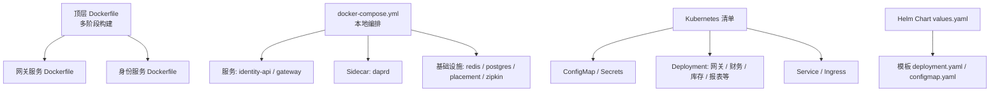
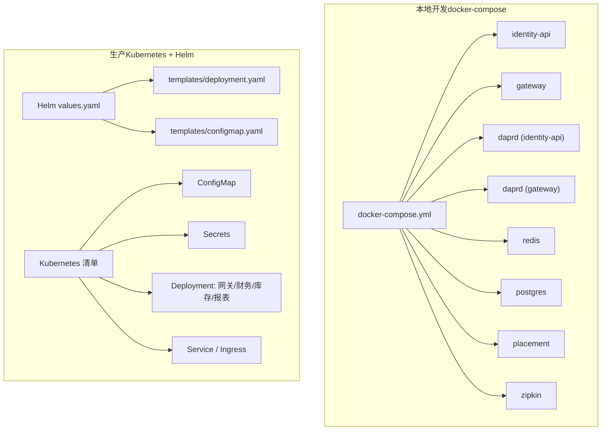
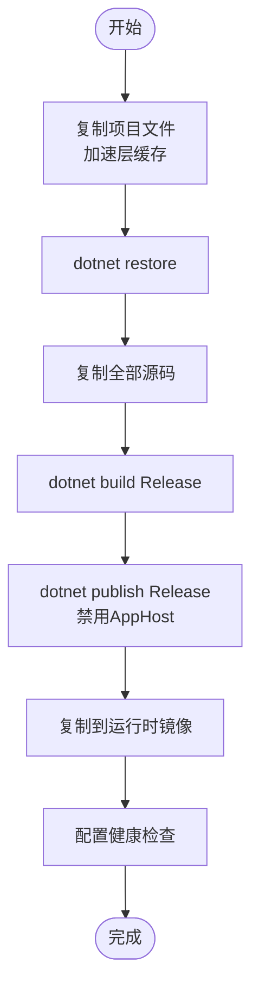
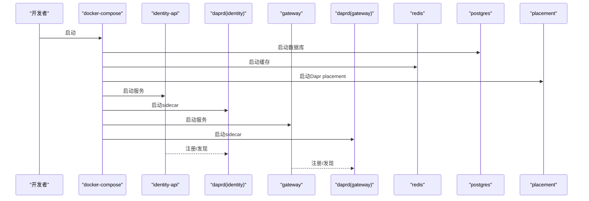
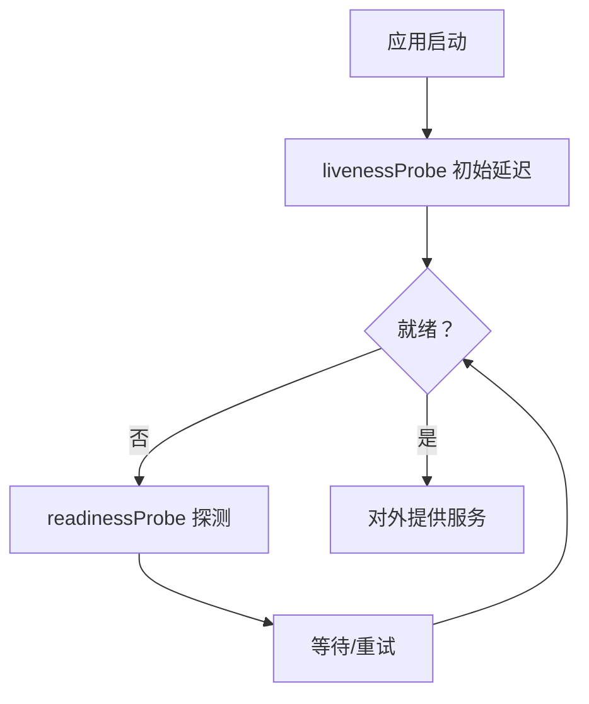
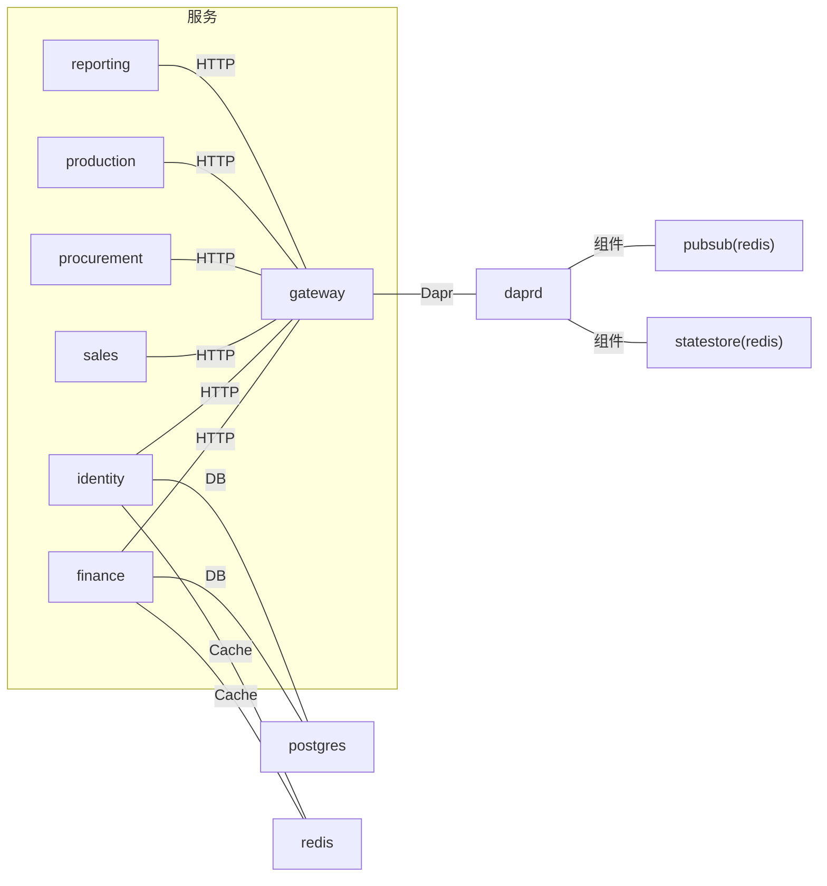

# 容器化与Docker

<cite>
**本文引用的文件**
- [Dockerfile](file://Dockerfile)
- [docker-compose.yml](file://docker-compose.yml)
- [src/.dockerignore](file://src/.dockerignore)
- [src/Gateways/ErpSystem.Gateway/Dockerfile](file://src/Gateways/ErpSystem.Gateway/Dockerfile)
- [src/Services/Identity/ErpSystem.Identity/Dockerfile](file://src/Services/Identity/ErpSystem.Identity/Dockerfile)
- [docs/deployment.md](file://docs/deployment.md)
- [deploy/k8s/services/gateway.yaml](file://deploy/k8s/services/gateway.yaml)
- [deploy/k8s/services/finance.yaml](file://deploy/k8s/services/finance.yaml)
- [deploy/k8s/configmap.yaml](file://deploy/k8s/configmap.yaml)
- [deploy/k8s/secrets.yaml](file://deploy/k8s/secrets.yaml)
- [deploy/helm/erp-system/values.yaml](file://deploy/helm/erp-system/values.yaml)
- [deploy/helm/erp-system/templates/deployment.yaml](file://deploy/helm/erp-system/templates/deployment.yaml)
- [deploy/helm/erp-system/templates/configmap.yaml](file://deploy/helm/erp-system/templates/configmap.yaml)
- [components/pubsub.yaml](file://components/pubsub.yaml)
- [components/statestore.yaml](file://components/statestore.yaml)
</cite>

## 目录
1. [简介](#简介)
2. [项目结构](#项目结构)
3. [核心组件](#核心组件)
4. [架构总览](#架构总览)
5. [详细组件分析](#详细组件分析)
6. [依赖关系分析](#依赖关系分析)
7. [性能考量](#性能考量)
8. [故障排查指南](#故障排查指南)
9. [结论](#结论)
10. [附录](#附录)

## 简介
本文件系统性阐述本项目的容器化与Docker实践，覆盖多阶段构建策略、依赖安装与构建优化、健康检查与资源限制、docker-compose编排、镜像标签与私有仓库配置、容器安全策略与漏洞扫描，以及本地开发容器环境搭建指导。目标是帮助开发者在本地与生产环境中稳定、高效地运行微服务。

## 项目结构
本项目采用多服务单仓结构，每个微服务均提供独立的Dockerfile，并通过一个顶层Dockerfile实现统一的多阶段构建与参数化发布；同时提供docker-compose用于本地联调，以及Helm/Kubernetes清单用于生产部署。

图表来源
- [Dockerfile](file://Dockerfile#L1-L37)
- [src/Gateways/ErpSystem.Gateway/Dockerfile](file://src/Gateways/ErpSystem.Gateway/Dockerfile#L1-L22)
- [src/Services/Identity/ErpSystem.Identity/Dockerfile](file://src/Services/Identity/ErpSystem.Identity/Dockerfile#L1-L24)
- [docker-compose.yml](file://docker-compose.yml#L1-L99)
- [deploy/k8s/configmap.yaml](file://deploy/k8s/configmap.yaml#L1-L25)
- [deploy/k8s/secrets.yaml](file://deploy/k8s/secrets.yaml#L1-L19)
- [deploy/k8s/services/gateway.yaml](file://deploy/k8s/services/gateway.yaml#L1-L60)
- [deploy/helm/erp-system/values.yaml](file://deploy/helm/erp-system/values.yaml#L1-L127)
- [deploy/helm/erp-system/templates/deployment.yaml](file://deploy/helm/erp-system/templates/deployment.yaml#L1-L58)
- [deploy/helm/erp-system/templates/configmap.yaml](file://deploy/helm/erp-system/templates/configmap.yaml#L1-L19)

章节来源
- [Dockerfile](file://Dockerfile#L1-L37)
- [docker-compose.yml](file://docker-compose.yml#L1-L99)

## 核心组件
- 多阶段构建Dockerfile：统一SDK阶段构建、发布阶段生成产物、最终运行时镜像，减少镜像体积并提升安全性。
- 服务级Dockerfile：针对不同微服务（如网关、身份）的独立构建脚本，便于按需构建与差异化配置。
- docker-compose：本地开发联调，包含数据库、缓存、Dapr sidecar与各微服务。
- Kubernetes/Helm：生产级编排，含资源限制、健康检查、配置与密钥注入、Ingress暴露。
- Dapr组件：Redis作为状态存储与消息订阅组件，配合sidecar使用。

章节来源
- [Dockerfile](file://Dockerfile#L1-L37)
- [src/Gateways/ErpSystem.Gateway/Dockerfile](file://src/Gateways/ErpSystem.Gateway/Dockerfile#L1-L22)
- [src/Services/Identity/ErpSystem.Identity/Dockerfile](file://src/Services/Identity/ErpSystem.Identity/Dockerfile#L1-L24)
- [docker-compose.yml](file://docker-compose.yml#L1-L99)
- [deploy/k8s/services/gateway.yaml](file://deploy/k8s/services/gateway.yaml#L1-L60)
- [deploy/k8s/services/finance.yaml](file://deploy/k8s/services/finance.yaml#L1-L66)
- [deploy/k8s/configmap.yaml](file://deploy/k8s/configmap.yaml#L1-L25)
- [deploy/k8s/secrets.yaml](file://deploy/k8s/secrets.yaml#L1-L19)
- [deploy/helm/erp-system/values.yaml](file://deploy/helm/erp-system/values.yaml#L1-L127)
- [deploy/helm/erp-system/templates/deployment.yaml](file://deploy/helm/erp-system/templates/deployment.yaml#L1-L58)
- [deploy/helm/erp-system/templates/configmap.yaml](file://deploy/helm/erp-system/templates/configmap.yaml#L1-L19)
- [components/pubsub.yaml](file://components/pubsub.yaml#L1-L13)
- [components/statestore.yaml](file://components/statestore.yaml#L1-L13)

## 架构总览
下图展示本地与生产两种运行形态：本地通过docker-compose快速拉起服务链路，生产通过Helm/Kubernetes进行标准化部署。

图表来源
- [docker-compose.yml](file://docker-compose.yml#L1-L99)
- [deploy/helm/erp-system/values.yaml](file://deploy/helm/erp-system/values.yaml#L1-L127)
- [deploy/helm/erp-system/templates/deployment.yaml](file://deploy/helm/erp-system/templates/deployment.yaml#L1-L58)
- [deploy/helm/erp-system/templates/configmap.yaml](file://deploy/helm/erp-system/templates/configmap.yaml#L1-L19)
- [deploy/k8s/configmap.yaml](file://deploy/k8s/configmap.yaml#L1-L25)
- [deploy/k8s/secrets.yaml](file://deploy/k8s/secrets.yaml#L1-L19)

## 详细组件分析

### 多阶段构建策略与优化
- 基础镜像选择
  - SDK阶段：使用官方 .NET SDK 镜像进行restore与build，确保依赖解析与编译环境一致。
  - 运行时阶段：使用官方 .NET AspNet Runtime 镜像，显著减小最终镜像体积。
- 依赖安装与层缓存
  - 先复制项目文件以利用Docker层缓存，再执行restore，避免无关变更导致的重建。
  - 使用参数化SERVICE_NAME实现同一Dockerfile构建多个服务，提高复用性。
- 构建与发布
  - 在publish阶段禁用AppHost，适配容器运行时入口方式。
- 安全加固
  - 最终镜像仅包含运行时产物，不包含SDK与构建工具。
  - 健康检查通过HTTP端点验证应用可用性，结合重启策略保障可用性。

图表来源
- [Dockerfile](file://Dockerfile#L1-L37)

章节来源
- [Dockerfile](file://Dockerfile#L1-L37)

### docker-compose 编排配置
- 服务定义
  - identity-api 与 gateway：分别基于各自Dockerfile构建，映射宿主端口至容器8080。
  - daprd sidecar：与对应服务共享网络模式，注入组件目录，连接placement。
- 网络配置
  - 自定义bridge网络，隔离服务间通信。
- 卷挂载
  - 组件目录挂载，使Dapr sidecar可加载pubsub/statestore组件。
- 环境变量管理
  - ASPNETCORE_URLS 指定监听端口。
  - ConnectionStrings__DefaultConnection 指向postgres容器。
- 启动顺序
  - 使用depends_on声明依赖，确保数据库与缓存先于业务服务启动。

图表来源
- [docker-compose.yml](file://docker-compose.yml#L1-L99)

章节来源
- [docker-compose.yml](file://docker-compose.yml#L1-L99)

### 健康检查、资源限制与启动顺序
- 健康检查
  - 容器内通过HEALTHCHECK定义周期性探针，访问/health端点。
  - Kubernetes中为各Deployment配置livenessProbe/readinessProbe，路径与周期可调。
- 资源限制
  - values.yaml中定义通用resources请求与限制，支持按服务覆盖。
  - Deployment模板根据values注入requests/limits。
- 启动顺序
  - docker-compose使用depends_on保证依赖服务优先启动。
  - Kubernetes中通过initContainers或探针延迟启动更稳妥（建议在复杂场景使用）。

图表来源
- [Dockerfile](file://Dockerfile#L31-L33)
- [deploy/k8s/services/gateway.yaml](file://deploy/k8s/services/gateway.yaml#L35-L46)
- [deploy/k8s/services/finance.yaml](file://deploy/k8s/services/finance.yaml#L41-L52)
- [deploy/helm/erp-system/templates/deployment.yaml](file://deploy/helm/erp-system/templates/deployment.yaml#L44-L55)

章节来源
- [Dockerfile](file://Dockerfile#L31-L33)
- [deploy/k8s/services/gateway.yaml](file://deploy/k8s/services/gateway.yaml#L35-L46)
- [deploy/k8s/services/finance.yaml](file://deploy/k8s/services/finance.yaml#L41-L52)
- [deploy/helm/erp-system/templates/deployment.yaml](file://deploy/helm/erp-system/templates/deployment.yaml#L44-L55)

### 镜像构建最佳实践、标签管理与私有仓库
- 最佳实践
  - 使用.dockerignore排除不必要的构建上下文文件，减少层变更与传输时间。
  - 多阶段构建分离SDK与运行时，最小化攻击面。
  - 参数化SERVICE_NAME实现单文件多服务构建，提升CI效率。
- 标签管理
  - 建议采用语义化版本或短哈希+时间戳组合命名，便于追踪与回滚。
- 私有仓库
  - Helm values中可通过global.imageRegistry配置镜像仓库地址。
  - 生产环境建议启用imagePullSecrets与只读策略。

章节来源
- [src/.dockerignore](file://src/.dockerignore#L1-L20)
- [Dockerfile](file://Dockerfile#L1-L37)
- [deploy/helm/erp-system/values.yaml](file://deploy/helm/erp-system/values.yaml#L5-L8)

### 容器安全策略、权限控制与漏洞扫描
- 安全策略
  - 运行时镜像不包含SDK与构建工具，降低被利用风险。
  - 使用只读根文件系统与非root用户（建议在具体镜像中实现）。
- 权限控制
  - Kubernetes中通过PodSecurity标准与RBAC限制权限范围。
  - Secrets与ConfigMap分离敏感与非敏感配置。
- 漏洞扫描
  - CI流水线集成镜像扫描工具（如Trivy、Clair），在推送前阻断高危镜像。
  - 结合SBOM与供应链安全策略。

[本节为通用安全建议，无需特定文件引用]

### 本地开发容器环境搭建指导
- 步骤
  - 准备Docker环境与docker-compose。
  - 执行compose文件启动所有服务与sidecar。
  - 访问网关或各服务端点进行调试。
- 注意事项
  - 如需Dapr组件，请确保components目录存在且挂载正确。
  - 数据库初始化脚本已挂载，首次启动会自动执行。

章节来源
- [docker-compose.yml](file://docker-compose.yml#L1-L99)
- [components/pubsub.yaml](file://components/pubsub.yaml#L1-L13)
- [components/statestore.yaml](file://components/statestore.yaml#L1-L13)

## 依赖关系分析
- 组件耦合
  - 微服务依赖postgres与redis，Dapr sidecar依赖placement。
  - 网关依赖身份服务与其他内部服务，需在Kubernetes中通过DNS与Service访问。
- 外部依赖
  - Helm Chart依赖Bitnami PostgreSQL与Redis子图表。
  - Dapr组件依赖Redis实例。

图表来源
- [deploy/k8s/services/gateway.yaml](file://deploy/k8s/services/gateway.yaml#L1-L60)
- [deploy/k8s/services/finance.yaml](file://deploy/k8s/services/finance.yaml#L1-L66)
- [components/pubsub.yaml](file://components/pubsub.yaml#L1-L13)
- [components/statestore.yaml](file://components/statestore.yaml#L1-L13)

章节来源
- [deploy/k8s/services/gateway.yaml](file://deploy/k8s/services/gateway.yaml#L1-L60)
- [deploy/k8s/services/finance.yaml](file://deploy/k8s/services/finance.yaml#L1-L66)
- [components/pubsub.yaml](file://components/pubsub.yaml#L1-L13)
- [components/statestore.yaml](file://components/statestore.yaml#L1-L13)

## 性能考量
- 构建性能
  - 层缓存优化：固定复制项目文件顺序，减少无关变更触发重建。
  - 并行构建：在CI中对多服务Dockerfile并行构建。
- 运行性能
  - 合理设置CPU/内存requests与limits，避免资源争抢。
  - 使用水平副本与滚动升级策略，保障流量峰值下的稳定性。
- 网络与I/O
  - 将数据库与缓存置于高性能存储与低延迟网络。
  - Dapr sidecar与应用同容器网络，减少跨网络开销。

[本节为通用性能建议，无需特定文件引用]

## 故障排查指南
- 健康检查失败
  - 检查/health与/health/ready端点是否可达，确认探针配置与初始延迟合理。
  - 查看容器日志与Kubernetes事件，定位依赖未就绪问题。
- 依赖连接失败
  - 确认连接字符串指向正确的服务名与端口（K8s内部DNS规则）。
  - docker-compose中检查depends_on与容器名称一致性。
- Dapr组件加载失败
  - 确认components目录挂载正确，sidecar命令参数与placement地址无误。
- 配置与密钥
  - 检查ConfigMap与Secrets是否正确注入env/envFrom，键名大小写与命名空间一致。

章节来源
- [Dockerfile](file://Dockerfile#L31-L33)
- [deploy/k8s/services/gateway.yaml](file://deploy/k8s/services/gateway.yaml#L35-L46)
- [deploy/k8s/services/finance.yaml](file://deploy/k8s/services/finance.yaml#L41-L52)
- [docker-compose.yml](file://docker-compose.yml#L1-L99)
- [deploy/k8s/configmap.yaml](file://deploy/k8s/configmap.yaml#L1-L25)
- [deploy/k8s/secrets.yaml](file://deploy/k8s/secrets.yaml#L1-L19)

## 结论
本项目通过多阶段构建、参数化Dockerfile、docker-compose本地编排与Helm/Kubernetes生产部署，实现了从开发到生产的完整容器化闭环。配合健康检查、资源限制与Dapr组件，系统具备良好的可观测性与可维护性。建议在CI中引入镜像扫描与自动化部署流程，进一步提升交付质量与安全性。

## 附录
- 本地开发常用命令参考
  - 构建所有服务镜像：参见部署文档中的构建示例。
  - 启动本地服务链：docker-compose up -d。
  - 停止与清理：docker-compose down。
- 生产部署要点
  - 使用Helm安装/升级，结合values-prod.yaml进行环境覆盖。
  - 关注探针路径、副本数与资源配额，确保弹性与稳定性。
  - 通过Ingress暴露服务，结合TLS与WAF增强边界安全。

章节来源
- [docs/deployment.md](file://docs/deployment.md#L14-L24)
- [docs/deployment.md](file://docs/deployment.md#L28-L44)
- [docs/deployment.md](file://docs/deployment.md#L59-L76)
- [docs/deployment.md](file://docs/deployment.md#L103-L107)