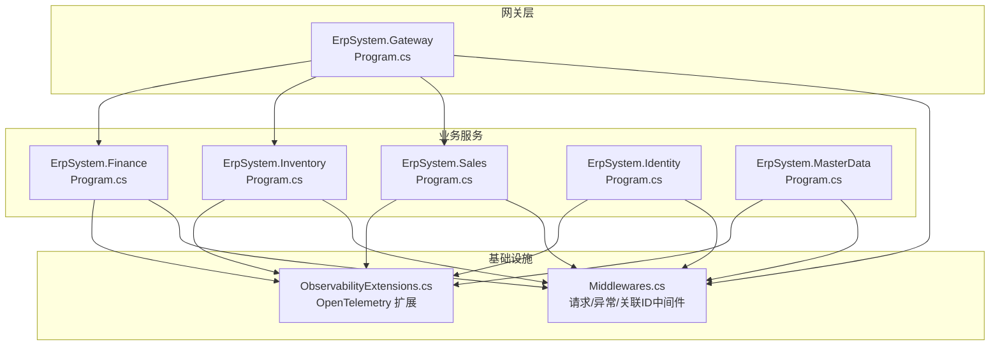
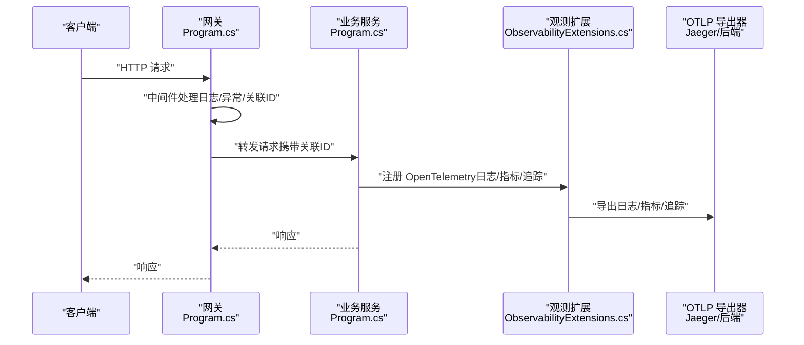
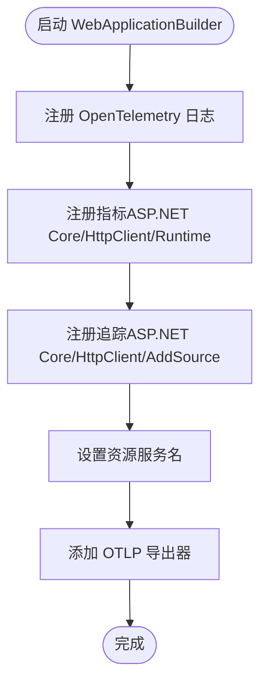
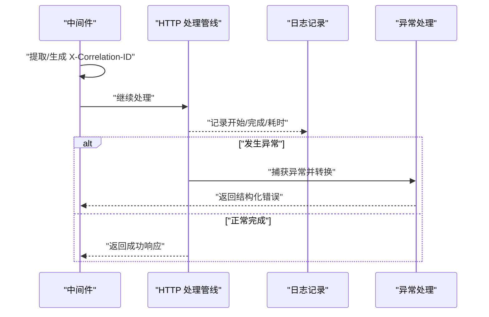
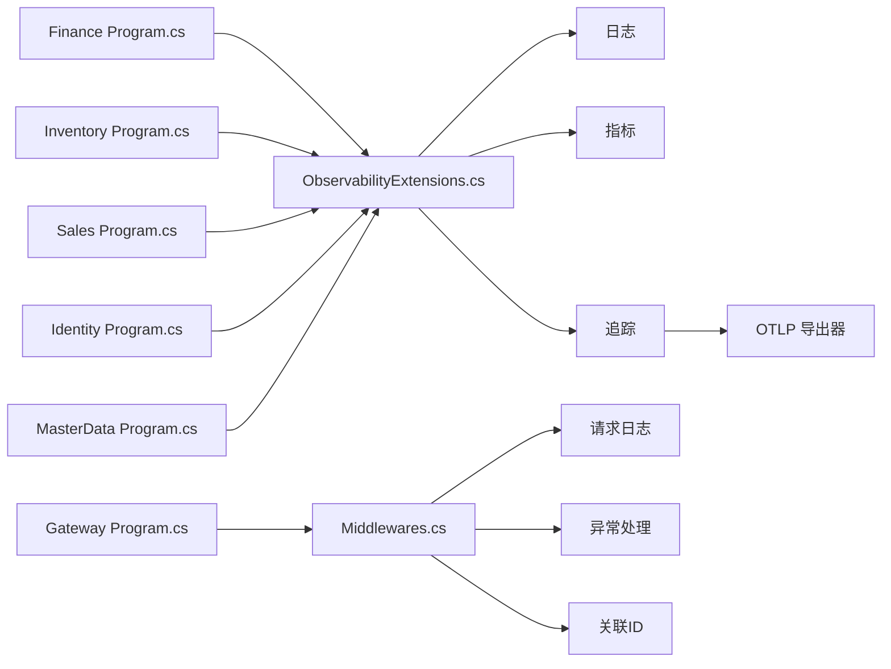

# 分布式追踪

<cite>
**本文引用的文件**
- [ObservabilityExtensions.cs](file://src/BuildingBlocks/ErpSystem.BuildingBlocks/Observability/ObservabilityExtensions.cs)
- [Middlewares.cs](file://src/BuildingBlocks/ErpSystem.BuildingBlocks/Middleware/Middlewares.cs)
- [Program.cs（财务）](file://src/Services/Finance/ErpSystem.Finance/Program.cs)
- [Program.cs（库存）](file://src/Services/Inventory/ErpSystem.Inventory/Program.cs)
- [Program.cs（销售）](file://src/Services/Sales/ErpSystem.Sales/Program.cs)
- [Program.cs（身份）](file://src/Services/Identity/ErpSystem.Identity/Program.cs)
- [Program.cs（主数据）](file://src/Services/MasterData/ErpSystem.MasterData/Program.cs)
- [Program.cs（网关）](file://src/Gateways/ErpSystem.Gateway/Program.cs)
</cite>

## 目录
1. [简介](#简介)
2. [项目结构](#项目结构)
3. [核心组件](#核心组件)
4. [架构总览](#架构总览)
5. [组件详解](#组件详解)
6. [依赖关系分析](#依赖关系分析)
7. [性能考量](#性能考量)
8. [故障排查指南](#故障排查指南)
9. [结论](#结论)
10. [附录](#附录)

## 简介
本文件面向分布式追踪系统，围绕 OpenTelemetry 追踪配置、OTLP 导出器设置与 Jaeger 集成展开，结合仓库中现有的可观测性扩展与中间件实现，系统化说明服务间链路追踪、Span 上下文传播、分布式事务监控、采样策略、性能影响与资源优化、自定义追踪属性、错误追踪与异常监控、追踪数据可视化与性能分析方法，以及在微服务架构中的调试技巧与故障排查策略。

## 项目结构
本项目采用多服务微架构，每个服务均基于 ASP.NET Core 构建，通过 Dapr 事件总线进行解耦通信。可观测性能力通过统一的扩展类集中注入，日志与追踪由 OpenTelemetry 提供支持；部分服务通过中间件实现请求级关联标识与异常处理，便于跨服务串联与定位问题。

图表来源
- [Program.cs（网关）](file://src/Gateways/ErpSystem.Gateway/Program.cs#L1-L107)
- [Program.cs（财务）](file://src/Services/Finance/ErpSystem.Finance/Program.cs#L1-L86)
- [Program.cs（库存）](file://src/Services/Inventory/ErpSystem.Inventory/Program.cs#L1-L74)
- [Program.cs（销售）](file://src/Services/Sales/ErpSystem.Sales/Program.cs#L1-L72)
- [Program.cs（身份）](file://src/Services/Identity/ErpSystem.Identity/Program.cs#L1-L71)
- [Program.cs（主数据）](file://src/Services/MasterData/ErpSystem.MasterData/Program.cs#L1-L68)
- [ObservabilityExtensions.cs](file://src/BuildingBlocks/ErpSystem.BuildingBlocks/Observability/ObservabilityExtensions.cs#L1-L44)
- [Middlewares.cs](file://src/BuildingBlocks/ErpSystem.BuildingBlocks/Middleware/Middlewares.cs#L1-L125)

章节来源
- [ObservabilityExtensions.cs](file://src/BuildingBlocks/ErpSystem.BuildingBlocks/Observability/ObservabilityExtensions.cs#L1-L44)
- [Middlewares.cs](file://src/BuildingBlocks/ErpSystem.BuildingBlocks/Middleware/Middlewares.cs#L1-L125)
- [Program.cs（财务）](file://src/Services/Finance/ErpSystem.Finance/Program.cs#L1-L86)
- [Program.cs（库存）](file://src/Services/Inventory/ErpSystem.Inventory/Program.cs#L1-L74)
- [Program.cs（销售）](file://src/Services/Sales/ErpSystem.Sales/Program.cs#L1-L72)
- [Program.cs（身份）](file://src/Services/Identity/ErpSystem.Identity/Program.cs#L1-L71)
- [Program.cs（主数据）](file://src/Services/MasterData/ErpSystem.MasterData/Program.cs#L1-L68)
- [Program.cs（网关）](file://src/Gateways/ErpSystem.Gateway/Program.cs#L1-L107)

## 核心组件
- OpenTelemetry 扩展：集中注册日志、指标与追踪，自动启用 ASP.NET Core 与 HttpClient 仪器化，并以 OTLP 导出器输出到外部后端（如 Jaeger）。该扩展通过资源构建器设置服务名，确保跨服务一致的标识。
- 中间件体系：提供请求/响应日志、全局异常处理与 X-Correlation-ID 关联标识，便于跨服务串联与问题定位。
- 服务入口：各服务 Program.cs 负责构建应用、注册中间件与路由映射，未显式调用观测扩展时，默认不启用 OpenTelemetry。

章节来源
- [ObservabilityExtensions.cs](file://src/BuildingBlocks/ErpSystem.BuildingBlocks/Observability/ObservabilityExtensions.cs#L10-L42)
- [Middlewares.cs](file://src/BuildingBlocks/ErpSystem.BuildingBlocks/Middleware/Middlewares.cs#L10-L124)
- [Program.cs（财务）](file://src/Services/Finance/ErpSystem.Finance/Program.cs#L51-L73)
- [Program.cs（库存）](file://src/Services/Inventory/ErpSystem.Inventory/Program.cs#L50-L71)
- [Program.cs（销售）](file://src/Services/Sales/ErpSystem.Sales/Program.cs#L48-L69)
- [Program.cs（身份）](file://src/Services/Identity/ErpSystem.Identity/Program.cs#L43-L68)
- [Program.cs（主数据）](file://src/Services/MasterData/ErpSystem.MasterData/Program.cs#L45-L67)
- [Program.cs（网关）](file://src/Gateways/ErpSystem.Gateway/Program.cs#L68-L101)

## 架构总览
下图展示从客户端到服务端的典型调用链路，以及 OpenTelemetry 如何在各环节采集日志、指标与追踪数据，并通过 OTLP 导出至 Jaeger 或其他后端。

图表来源
- [Program.cs（网关）](file://src/Gateways/ErpSystem.Gateway/Program.cs#L1-L107)
- [Program.cs（财务）](file://src/Services/Finance/ErpSystem.Finance/Program.cs#L1-L86)
- [ObservabilityExtensions.cs](file://src/BuildingBlocks/ErpSystem.BuildingBlocks/Observability/ObservabilityExtensions.cs#L12-L42)
- [Middlewares.cs](file://src/BuildingBlocks/ErpSystem.BuildingBlocks/Middleware/Middlewares.cs#L10-L124)

## 组件详解

### OpenTelemetry 追踪配置与 OTLP 导出
- 日志与追踪注册：通过扩展方法集中注册日志与追踪，开启 ASP.NET Core 与 HttpClient 仪器化，自动捕获请求与 HTTP 客户端调用的 Span。
- 资源与服务名：使用资源构建器设置服务名，确保跨服务链路统一标识。
- OTLP 导出：默认添加 OTLP 导出器，需在部署环境设置 OTEL_EXPORTER_OTLP_ENDPOINT 指向 Jaeger 或其他后端。
- 自定义来源：通过 AddSource(serviceName) 将服务自身产生的活动纳入追踪范围。

图表来源
- [ObservabilityExtensions.cs](file://src/BuildingBlocks/ErpSystem.BuildingBlocks/Observability/ObservabilityExtensions.cs#L12-L42)

章节来源
- [ObservabilityExtensions.cs](file://src/BuildingBlocks/ErpSystem.BuildingBlocks/Observability/ObservabilityExtensions.cs#L12-L42)

### 服务间链路追踪与 Span 上下文传播
- 关联标识：中间件在请求头注入 X-Correlation-ID，便于跨服务对齐同一请求的多个 Span。
- 请求日志：中间件记录请求开始、完成与异常信息，包含耗时，有助于快速定位慢调用与失败点。
- 异常处理：统一异常转换为结构化响应，避免内部异常细节泄露，同时保留错误上下文用于追踪。

图表来源
- [Middlewares.cs](file://src/BuildingBlocks/ErpSystem.BuildingBlocks/Middleware/Middlewares.cs#L54-L124)

章节来源
- [Middlewares.cs](file://src/BuildingBlocks/ErpSystem.BuildingBlocks/Middleware/Middlewares.cs#L10-L124)

### 分布式事务监控
- 事件驱动：服务通过 Dapr 事件总线发布领域事件，结合 OpenTelemetry 可在事件处理路径上形成完整的跨服务链路。
- 事务边界：建议在命令/查询处理的边界处手动创建根 Span，确保事务级操作（如聚合提交）被完整追踪。

章节来源
- [Program.cs（财务）](file://src/Services/Finance/ErpSystem.Finance/Program.cs#L27-L46)
- [Program.cs（库存）](file://src/Services/Inventory/ErpSystem.Inventory/Program.cs#L27-L35)
- [Program.cs（销售）](file://src/Services/Sales/ErpSystem.Sales/Program.cs#L25-L39)
- [Program.cs（身份）](file://src/Services/Identity/ErpSystem.Identity/Program.cs#L29-L37)
- [Program.cs（主数据）](file://src/Services/MasterData/ErpSystem.MasterData/Program.cs#L28-L36)

### 追踪采样策略、性能影响与资源优化
- 采样策略：当前实现未显式配置采样器，遵循 OpenTelemetry 默认策略。生产环境建议根据流量与后端承载能力调整采样率或采用概率/速率限制采样。
- 性能影响：仪器化会带来 CPU 与内存开销，建议仅在关键路径启用详细属性，减少昂贵计算与字符串拼接。
- 资源优化：优先使用轻量属性与事件，避免在高频路径写入大对象；合理设置导出批大小与间隔，降低网络与存储压力。

章节来源
- [ObservabilityExtensions.cs](file://src/BuildingBlocks/ErpSystem.BuildingBlocks/Observability/ObservabilityExtensions.cs#L29-L39)

### 自定义追踪属性、错误追踪与异常监控
- 自定义属性：可在业务关键点设置 Span 属性（如用户ID、租户ID、业务键），便于在 Jaeger 中检索与过滤。
- 错误追踪：中间件统一捕获异常并记录结构化错误，结合 OpenTelemetry 的异常事件可完整呈现错误堆栈与上下文。
- 异常监控：建议在网关与核心服务启用更严格的超时与熔断策略，防止级联故障放大。

章节来源
- [Middlewares.cs](file://src/BuildingBlocks/ErpSystem.BuildingBlocks/Middleware/Middlewares.cs#L73-L124)
- [Program.cs（网关）](file://src/Gateways/ErpSystem.Gateway/Program.cs#L31-L58)

### 追踪数据可视化、性能分析与瓶颈识别
- 可视化：通过 Jaeger UI 查看服务拓扑、调用链与耗时分布，结合 X-Correlation-ID 快速定位同一请求的全链路。
- 性能分析：关注 P95/P99 延迟、错误率与拒绝率，识别慢服务与热点端点；利用 Span 属性筛选特定租户或用户场景。
- 瓶颈识别：对比上游与下游的耗时占比，区分网络、序列化、数据库与业务逻辑等阶段的瓶颈。

章节来源
- [ObservabilityExtensions.cs](file://src/BuildingBlocks/ErpSystem.BuildingBlocks/Observability/ObservabilityExtensions.cs#L36-L38)

### 在微服务架构中的作用、调试技巧与故障排查
- 作用：追踪是微服务可观测性的“主线”，贯穿请求生命周期，支撑排障、容量规划与性能优化。
- 调试技巧：在本地开发时启用详细日志与追踪，结合中间件的请求计时与异常信息快速定位问题。
- 故障排查：优先检查网关与下游服务的健康状态、超时与熔断配置；利用关联ID在 Jaeger 中回溯完整链路。

章节来源
- [Program.cs（网关）](file://src/Gateways/ErpSystem.Gateway/Program.cs#L60-L81)
- [Middlewares.cs](file://src/BuildingBlocks/ErpSystem.BuildingBlocks/Middleware/Middlewares.cs#L10-L49)

## 依赖关系分析
- 观测扩展依赖：各服务通过依赖注入使用 OpenTelemetry 的日志、指标与追踪能力，统一导出至 OTLP。
- 中间件依赖：所有服务均可复用请求日志、异常处理与关联ID中间件，提升一致性与可维护性。
- 服务间耦合：通过 Dapr 事件总线实现松耦合，追踪可覆盖事件发布/订阅路径，形成端到端链路。

图表来源
- [ObservabilityExtensions.cs](file://src/BuildingBlocks/ErpSystem.BuildingBlocks/Observability/ObservabilityExtensions.cs#L12-L42)
- [Middlewares.cs](file://src/BuildingBlocks/ErpSystem.BuildingBlocks/Middleware/Middlewares.cs#L10-L124)
- [Program.cs（财务）](file://src/Services/Finance/ErpSystem.Finance/Program.cs#L51-L73)
- [Program.cs（库存）](file://src/Services/Inventory/ErpSystem.Inventory/Program.cs#L50-L71)
- [Program.cs（销售）](file://src/Services/Sales/ErpSystem.Sales/Program.cs#L48-L69)
- [Program.cs（身份）](file://src/Services/Identity/ErpSystem.Identity/Program.cs#L43-L68)
- [Program.cs（主数据）](file://src/Services/MasterData/ErpSystem.MasterData/Program.cs#L45-L67)
- [Program.cs（网关）](file://src/Gateways/ErpSystem.Gateway/Program.cs#L68-L101)

章节来源
- [ObservabilityExtensions.cs](file://src/BuildingBlocks/ErpSystem.BuildingBlocks/Observability/ObservabilityExtensions.cs#L12-L42)
- [Middlewares.cs](file://src/BuildingBlocks/ErpSystem.BuildingBlocks/Middleware/Middlewares.cs#L10-L124)
- [Program.cs（财务）](file://src/Services/Finance/ErpSystem.Finance/Program.cs#L51-L73)
- [Program.cs（库存）](file://src/Services/Inventory/ErpSystem.Inventory/Program.cs#L50-L71)
- [Program.cs（销售）](file://src/Services/Sales/ErpSystem.Sales/Program.cs#L48-L69)
- [Program.cs（身份）](file://src/Services/Identity/ErpSystem.Identity/Program.cs#L43-L68)
- [Program.cs（主数据）](file://src/Services/MasterData/ErpSystem.MasterData/Program.cs#L45-L67)
- [Program.cs（网关）](file://src/Gateways/ErpSystem.Gateway/Program.cs#L68-L101)

## 性能考量
- 采样与批量：在高吞吐场景下调低采样率或增加导出批大小，平衡数据完整性与资源消耗。
- 属性与事件：避免在热路径写入昂贵属性，减少字符串格式化与集合拷贝。
- 超时与熔断：在网关与服务间设置合理的超时与熔断策略，防止雪崩效应。
- 资源限制：为 OpenTelemetry 导出器配置背压与重试策略，避免阻塞请求管线。

章节来源
- [ObservabilityExtensions.cs](file://src/BuildingBlocks/ErpSystem.BuildingBlocks/Observability/ObservabilityExtensions.cs#L29-L39)
- [Program.cs（网关）](file://src/Gateways/ErpSystem.Gateway/Program.cs#L31-L58)

## 故障排查指南
- 启动与导出：确认已设置 OTEL_EXPORTER_OTLP_ENDPOINT，且网络可达；检查服务名与资源标签是否正确。
- 关联ID：若链路不完整，检查请求头是否携带 X-Correlation-ID，确保中间件在网关与服务两端均生效。
- 异常定位：结合中间件的日志输出与 Jaeger 的异常事件，快速定位失败节点与错误原因。
- 性能回归：对比不同版本的 P95 延迟与错误率，排查新增仪器化或导出配置的影响。

章节来源
- [ObservabilityExtensions.cs](file://src/BuildingBlocks/ErpSystem.BuildingBlocks/Observability/ObservabilityExtensions.cs#L36-L38)
- [Middlewares.cs](file://src/BuildingBlocks/ErpSystem.BuildingBlocks/Middleware/Middlewares.cs#L54-L124)
- [Program.cs（网关）](file://src/Gateways/ErpSystem.Gateway/Program.cs#L70-L81)

## 结论
本项目通过统一的 OpenTelemetry 扩展与中间件体系，为微服务提供了标准化的可观测性基础。结合 OTLP 导出与 Jaeger 可视化，能够有效支撑服务间链路追踪、分布式事务监控与性能分析。建议在生产环境中完善采样策略、资源限制与异常处理，持续优化追踪成本与价值。

## 附录
- 部署要点：确保各服务在容器编排中设置 OTEL_EXPORTER_OTLP_ENDPOINT 与服务名，以便追踪数据正确归档与检索。
- 最佳实践：在关键业务路径添加自定义属性，启用结构化异常处理，配合中间件实现一致的日志与追踪体验。