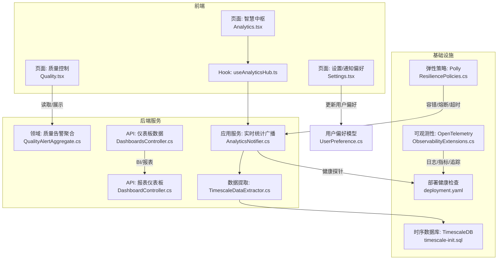
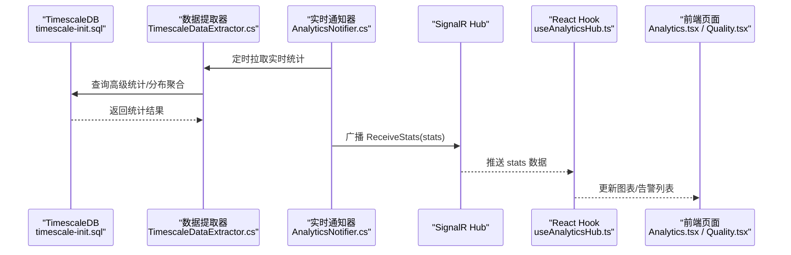
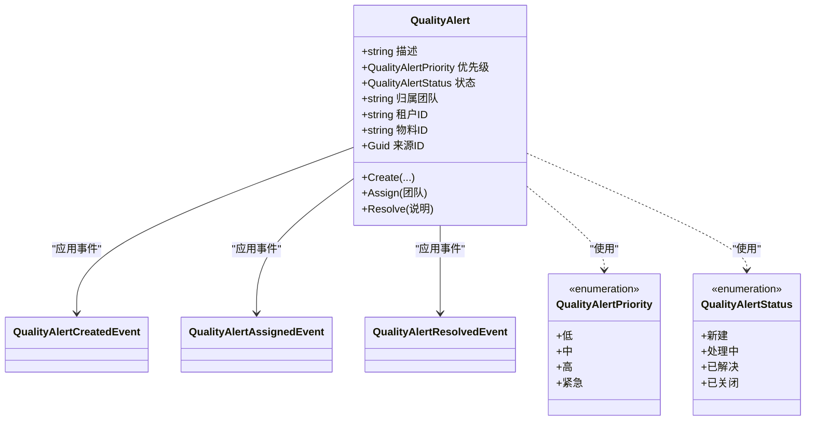
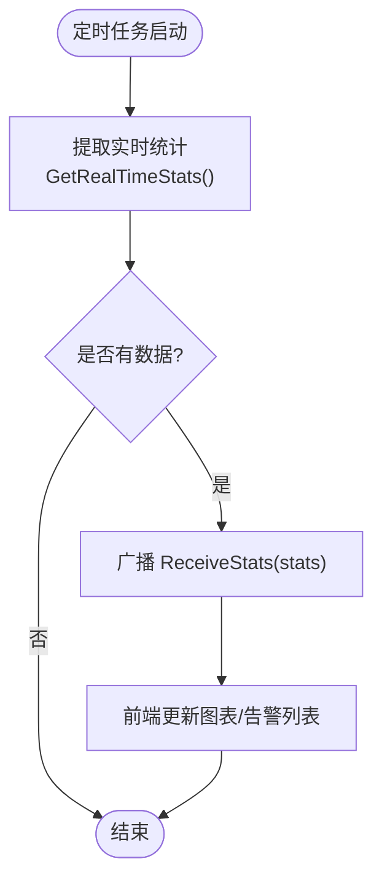
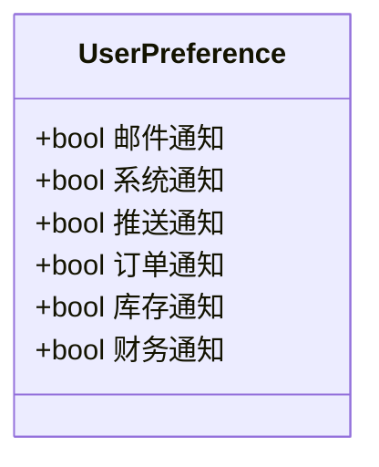
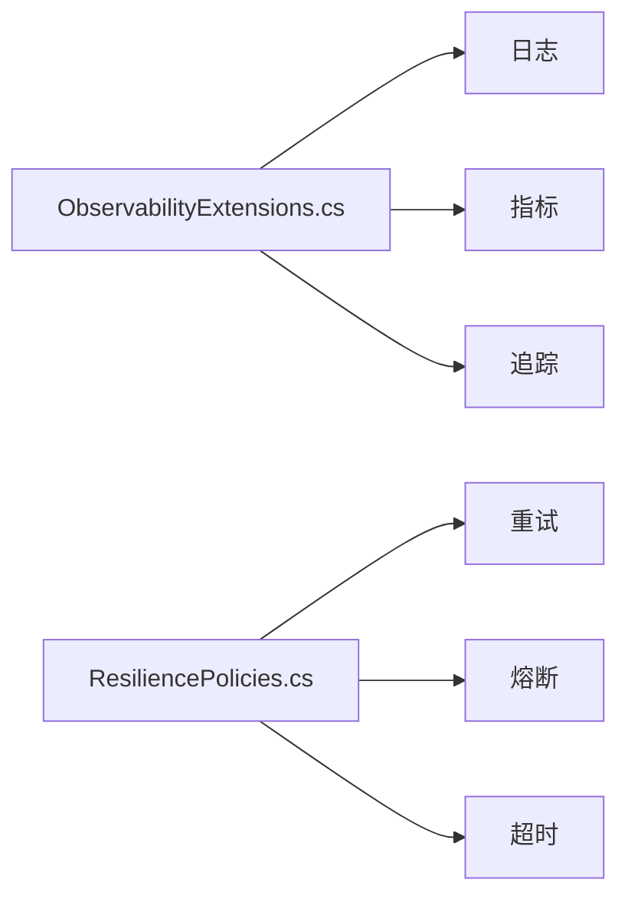
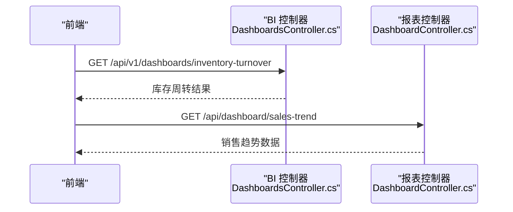
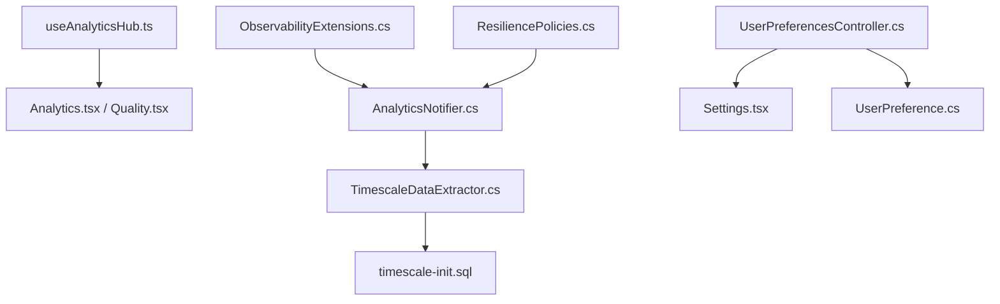

# 告警与通知

<cite>
**本文引用的文件**
- [ObservabilityExtensions.cs](file://src/BuildingBlocks/ErpSystem.BuildingBlocks/Observability/ObservabilityExtensions.cs)
- [ResiliencePolicies.cs](file://src/BuildingBlocks/ErpSystem.BuildingBlocks/Resilience/ResiliencePolicies.cs)
- [QualityAlertAggregate.cs](file://src/Services/Quality/ErpSystem.Quality/Domain/QualityAlertAggregate.cs)
- [QualityCheckAggregate.cs](file://src/Services/Quality/ErpSystem.Quality/Domain/QualityCheckAggregate.cs)
- [Quality.tsx](file://src/Web/ErpSystem.Web/src/pages/Quality.tsx)
- [Analytics.tsx](file://src/Web/ErpSystem.Web/src/pages/Analytics.tsx)
- [RealTimeDashboard.tsx](file://src/Web/ErpSystem.Web/src/components/RealTimeDashboard.tsx)
- [useAnalyticsHub.ts](file://src/Web/ErpSystem.Web/src/hooks/useAnalyticsHub.ts)
- [AnalyticsNotifier.cs](file://src/Services/Analytics/ErpSystem.Analytics/Infrastructure/BackgroundJobs/AnalyticsNotifier.cs)
- [TimescaleDataExtractor.cs](file://src/Services/Analytics/ErpSystem.Analytics/Infrastructure/TimescaleDataExtractor.cs)
- [DashboardsController.cs](file://src/Services/Analytics/ErpSystem.Analytics/API/DashboardsController.cs)
- [DashboardController.cs](file://src/Services/Reporting/ErpSystem.Reporting/Controllers/DashboardController.cs)
- [UserPreference.cs](file://src/Services/Settings/ErpSystem.Settings/Domain/UserPreference.cs)
- [UserPreferencesController.cs](file://src/Services/Settings/ErpSystem.Settings/Controllers/UserPreferencesController.cs)
- [Settings.tsx](file://src/Web/ErpSystem.Web/src/pages/Settings.tsx)
- [timescale-init.sql](file://infrastructure/timescale-init.sql)
- [deployment.yaml](file://deploy/helm/erp-system/templates/deployment.yaml)
</cite>

## 目录
1. [简介](#简介)
2. [项目结构](#项目结构)
3. [核心组件](#核心组件)
4. [架构总览](#架构总览)
5. [组件详解](#组件详解)
6. [依赖关系分析](#依赖关系分析)
7. [性能考量](#性能考量)
8. [故障排查指南](#故障排查指南)
9. [结论](#结论)
10. [附录](#附录)

## 简介
本文件面向“告警与通知系统”的设计与实现，结合现有代码库中的质量告警、实时统计推送、用户偏好与通知通道、基础设施可观测性与弹性策略等能力，系统化阐述以下主题：
- 告警规则配置、阈值设置与告警级别定义
- 通知渠道集成（邮件、站内与推送）
- 告警去重、抑制与升级策略
- SLO/SLI 指标监控、业务告警与基础设施告警
- 告警仪表板设计、历史分析与效果评估
- 在 SRE 工作流、故障响应与问题预防中的作用

## 项目结构
告警与通知相关能力横跨前端界面、后端服务、数据库与时序存储、以及基础设施部署与可观测性配置。下图展示与告警/通知相关的关键模块与交互路径。

**图表来源**
- [Quality.tsx](file://src/Web/ErpSystem.Web/src/pages/Quality.tsx#L1-L154)
- [Analytics.tsx](file://src/Web/ErpSystem.Web/src/pages/Analytics.tsx#L1-L49)
- [useAnalyticsHub.ts](file://src/Web/ErpSystem.Web/src/hooks/useAnalyticsHub.ts#L1-L34)
- [AnalyticsNotifier.cs](file://src/Services/Analytics/ErpSystem.Analytics/Infrastructure/BackgroundJobs/AnalyticsNotifier.cs#L1-L47)
- [DashboardsController.cs](file://src/Services/Analytics/ErpSystem.Analytics/API/DashboardsController.cs#L1-L32)
- [DashboardController.cs](file://src/Services/Reporting/ErpSystem.Reporting/Controllers/DashboardController.cs#L1-L79)
- [TimescaleDataExtractor.cs](file://src/Services/Analytics/ErpSystem.Analytics/Infrastructure/TimescaleDataExtractor.cs#L1-L142)
- [timescale-init.sql](file://infrastructure/timescale-init.sql#L1-L139)
- [deployment.yaml](file://deploy/helm/erp-system/templates/deployment.yaml#L42-L57)
- [ObservabilityExtensions.cs](file://src/BuildingBlocks/ErpSystem.BuildingBlocks/Observability/ObservabilityExtensions.cs#L1-L44)
- [ResiliencePolicies.cs](file://src/BuildingBlocks/ErpSystem.BuildingBlocks/Resilience/ResiliencePolicies.cs#L1-L111)

**章节来源**
- [Quality.tsx](file://src/Web/ErpSystem.Web/src/pages/Quality.tsx#L1-L154)
- [Analytics.tsx](file://src/Web/ErpSystem.Web/src/pages/Analytics.tsx#L1-L49)
- [useAnalyticsHub.ts](file://src/Web/ErpSystem.Web/src/hooks/useAnalyticsHub.ts#L1-L34)
- [AnalyticsNotifier.cs](file://src/Services/Analytics/ErpSystem.Analytics/Infrastructure/BackgroundJobs/AnalyticsNotifier.cs#L1-L47)
- [DashboardsController.cs](file://src/Services/Analytics/ErpSystem.Analytics/API/DashboardsController.cs#L1-L32)
- [DashboardController.cs](file://src/Services/Reporting/ErpSystem.Reporting/Controllers/DashboardController.cs#L1-L79)
- [TimescaleDataExtractor.cs](file://src/Services/Analytics/ErpSystem.Analytics/Infrastructure/TimescaleDataExtractor.cs#L1-L142)
- [timescale-init.sql](file://infrastructure/timescale-init.sql#L1-L139)
- [deployment.yaml](file://deploy/helm/erp-system/templates/deployment.yaml#L42-L57)
- [ObservabilityExtensions.cs](file://src/BuildingBlocks/ErpSystem.BuildingBlocks/Observability/ObservabilityExtensions.cs#L1-L44)
- [ResiliencePolicies.cs](file://src/BuildingBlocks/ErpSystem.BuildingBlocks/Resilience/ResiliencePolicies.cs#L1-L111)

## 核心组件
- 质量告警聚合与状态流转：用于业务层面的质量异常检测、分配与解决闭环，支持优先级与状态枚举。
- 实时统计推送：通过后台作业周期性从 TimescaleDB 提取统计聚合，经 SignalR 推送给前端。
- 用户通知偏好：集中管理邮件、系统通知、推送等开关及业务域通知偏好。
- 可观测性与弹性：统一的日志、指标与追踪导出，以及基于 Polly 的重试、熔断与超时策略。
- 仪表板与报表：提供实时与历史维度的数据可视化入口。

**章节来源**
- [QualityAlertAggregate.cs](file://src/Services/Quality/ErpSystem.Quality/Domain/QualityAlertAggregate.cs#L1-L118)
- [AnalyticsNotifier.cs](file://src/Services/Analytics/ErpSystem.Analytics/Infrastructure/BackgroundJobs/AnalyticsNotifier.cs#L1-L47)
- [TimescaleDataExtractor.cs](file://src/Services/Analytics/ErpSystem.Analytics/Infrastructure/TimescaleDataExtractor.cs#L1-L142)
- [UserPreference.cs](file://src/Services/Settings/ErpSystem.Settings/Domain/UserPreference.cs#L1-L33)
- [ObservabilityExtensions.cs](file://src/BuildingBlocks/ErpSystem.BuildingBlocks/Observability/ObservabilityExtensions.cs#L1-L44)
- [ResiliencePolicies.cs](file://src/BuildingBlocks/ErpSystem.BuildingBlocks/Resilience/ResiliencePolicies.cs#L1-L111)

## 架构总览
下图展示从数据采集到前端呈现的完整链路，强调告警与通知在系统中的位置与协作方式。

**图表来源**
- [TimescaleDataExtractor.cs](file://src/Services/Analytics/ErpSystem.Analytics/Infrastructure/TimescaleDataExtractor.cs#L85-L131)
- [AnalyticsNotifier.cs](file://src/Services/Analytics/ErpSystem.Analytics/Infrastructure/BackgroundJobs/AnalyticsNotifier.cs#L12-L36)
- [useAnalyticsHub.ts](file://src/Web/ErpSystem.Web/src/hooks/useAnalyticsHub.ts#L27-L34)
- [Analytics.tsx](file://src/Web/ErpSystem.Web/src/pages/Analytics.tsx#L1-L49)
- [Quality.tsx](file://src/Web/ErpSystem.Web/src/pages/Quality.tsx#L1-L154)

## 组件详解

### 质量告警与通知（业务告警）
- 告警实体包含描述、优先级、状态、归属团队、租户与物料等属性；支持创建、分配与解决事件驱动的状态变更。
- 前端页面展示“打开告警数”、“平均检查时间”等关键指标，并以卡片形式呈现近期质量告警。
- 建议将质量告警与用户通知偏好联动：当告警状态变化或达到特定优先级时，按用户偏好的渠道进行推送。

**图表来源**
- [QualityAlertAggregate.cs](file://src/Services/Quality/ErpSystem.Quality/Domain/QualityAlertAggregate.cs#L8-L118)

**章节来源**
- [QualityAlertAggregate.cs](file://src/Services/Quality/ErpSystem.Quality/Domain/QualityAlertAggregate.cs#L1-L118)
- [Quality.tsx](file://src/Web/ErpSystem.Web/src/pages/Quality.tsx#L44-L63)

### 实时统计与异常检测（基础设施/业务告警）
- 后台作业每 5 秒从 TimescaleDB 读取最近 24 小时的材料统计（中位数、均值、标准差），通过 SignalR 推送至前端。
- 前端页面展示“异常检测流”，并提供实时仪表盘，用于观察库存波动、设备热态与成本偏差等异常信号。
- 可将异常检测结果映射为告警规则：当统计量超过阈值或偏离分布范围时触发告警。

**图表来源**
- [AnalyticsNotifier.cs](file://src/Services/Analytics/ErpSystem.Analytics/Infrastructure/BackgroundJobs/AnalyticsNotifier.cs#L12-L36)
- [TimescaleDataExtractor.cs](file://src/Services/Analytics/ErpSystem.Analytics/Infrastructure/TimescaleDataExtractor.cs#L88-L131)
- [useAnalyticsHub.ts](file://src/Web/ErpSystem.Web/src/hooks/useAnalyticsHub.ts#L27-L34)
- [Analytics.tsx](file://src/Web/ErpSystem.Web/src/pages/Analytics.tsx#L135-L149)

**章节来源**
- [AnalyticsNotifier.cs](file://src/Services/Analytics/ErpSystem.Analytics/Infrastructure/BackgroundJobs/AnalyticsNotifier.cs#L1-L47)
- [TimescaleDataExtractor.cs](file://src/Services/Analytics/ErpSystem.Analytics/Infrastructure/TimescaleDataExtractor.cs#L1-L142)
- [useAnalyticsHub.ts](file://src/Web/ErpSystem.Web/src/hooks/useAnalyticsHub.ts#L1-L34)
- [Analytics.tsx](file://src/Web/ErpSystem.Web/src/pages/Analytics.tsx#L1-L49)

### 通知渠道与用户偏好
- 用户偏好模型包含邮件、系统通知、推送等开关，以及订单、库存、财务等业务域通知偏好。
- 前端设置页提供通知渠道开关与偏好编辑，便于按角色与场景定制告警接收方式。
- 建议在告警产生或状态变更时，根据用户偏好与告警优先级决定发送渠道与消息模板。

**图表来源**
- [UserPreference.cs](file://src/Services/Settings/ErpSystem.Settings/Domain/UserPreference.cs#L22-L29)

**章节来源**
- [UserPreference.cs](file://src/Services/Settings/ErpSystem.Settings/Domain/UserPreference.cs#L1-L33)
- [UserPreferencesController.cs](file://src/Services/Settings/ErpSystem.Settings/Controllers/UserPreferencesController.cs#L70-L100)
- [Settings.tsx](file://src/Web/ErpSystem.Web/src/pages/Settings.tsx#L259-L294)

### 可观测性与弹性策略
- 统一接入 OpenTelemetry，启用日志、指标与追踪导出，便于定位告警与通知链路中的性能瓶颈与错误。
- 使用 Polly 提供重试、熔断与超时策略，增强对外部服务（如 TimescaleDB）的弹性与稳定性。

**图表来源**
- [ObservabilityExtensions.cs](file://src/BuildingBlocks/ErpSystem.BuildingBlocks/Observability/ObservabilityExtensions.cs#L12-L42)
- [ResiliencePolicies.cs](file://src/BuildingBlocks/ErpSystem.BuildingBlocks/Resilience/ResiliencePolicies.cs#L13-L111)

**章节来源**
- [ObservabilityExtensions.cs](file://src/BuildingBlocks/ErpSystem.BuildingBlocks/Observability/ObservabilityExtensions.cs#L1-L44)
- [ResiliencePolicies.cs](file://src/BuildingBlocks/ErpSystem.BuildingBlocks/Resilience/ResiliencePolicies.cs#L1-L111)

### 仪表板与报表（SLO/SLI 与告警效果评估）
- BI 仪表板控制器提供库存周转、OEE 等关键指标查询接口，可用于构建 SLI/SLO 监控看板。
- 报表控制器提供销售趋势、库存状态、活动汇总等数据，辅助评估告警对运营的影响与改进效果。

**图表来源**
- [DashboardsController.cs](file://src/Services/Analytics/ErpSystem.Analytics/API/DashboardsController.cs#L10-L24)
- [DashboardController.cs](file://src/Services/Reporting/ErpSystem.Reporting/Controllers/DashboardController.cs#L13-L58)

**章节来源**
- [DashboardsController.cs](file://src/Services/Analytics/ErpSystem.Analytics/API/DashboardsController.cs#L1-L32)
- [DashboardController.cs](file://src/Services/Reporting/ErpSystem.Reporting/Controllers/DashboardController.cs#L1-L79)

## 依赖关系分析
- 前端依赖 SignalR 连接与 Hook 管理状态，后端通过 HubContext 广播统计快照。
- 实时通知器依赖 TimescaleDataExtractor，后者依赖 TimescaleDB 初始化脚本创建的表与物化视图。
- 用户偏好模型与控制器支撑通知渠道与业务域偏好管理。
- 可观测性与弹性策略贯穿服务层，保障告警链路的稳定与可诊断性。

**图表来源**
- [useAnalyticsHub.ts](file://src/Web/ErpSystem.Web/src/hooks/useAnalyticsHub.ts#L1-L34)
- [Analytics.tsx](file://src/Web/ErpSystem.Web/src/pages/Analytics.tsx#L1-L49)
- [Quality.tsx](file://src/Web/ErpSystem.Web/src/pages/Quality.tsx#L1-L154)
- [AnalyticsNotifier.cs](file://src/Services/Analytics/ErpSystem.Analytics/Infrastructure/BackgroundJobs/AnalyticsNotifier.cs#L1-L47)
- [TimescaleDataExtractor.cs](file://src/Services/Analytics/ErpSystem.Analytics/Infrastructure/TimescaleDataExtractor.cs#L1-L142)
- [timescale-init.sql](file://infrastructure/timescale-init.sql#L1-L139)
- [UserPreferencesController.cs](file://src/Services/Settings/ErpSystem.Settings/Controllers/UserPreferencesController.cs#L70-L100)
- [Settings.tsx](file://src/Web/ErpSystem.Web/src/pages/Settings.tsx#L259-L294)
- [UserPreference.cs](file://src/Services/Settings/ErpSystem.Settings/Domain/UserPreference.cs#L1-L33)
- [ObservabilityExtensions.cs](file://src/BuildingBlocks/ErpSystem.BuildingBlocks/Observability/ObservabilityExtensions.cs#L1-L44)
- [ResiliencePolicies.cs](file://src/BuildingBlocks/ErpSystem.BuildingBlocks/Resilience/ResiliencePolicies.cs#L1-L111)

**章节来源**
- [useAnalyticsHub.ts](file://src/Web/ErpSystem.Web/src/hooks/useAnalyticsHub.ts#L1-L34)
- [AnalyticsNotifier.cs](file://src/Services/Analytics/ErpSystem.Analytics/Infrastructure/BackgroundJobs/AnalyticsNotifier.cs#L1-L47)
- [TimescaleDataExtractor.cs](file://src/Services/Analytics/ErpSystem.Analytics/Infrastructure/TimescaleDataExtractor.cs#L1-L142)
- [timescale-init.sql](file://infrastructure/timescale-init.sql#L1-L139)
- [UserPreferencesController.cs](file://src/Services/Settings/ErpSystem.Settings/Controllers/UserPreferencesController.cs#L70-L100)
- [Settings.tsx](file://src/Web/ErpSystem.Web/src/pages/Settings.tsx#L259-L294)
- [UserPreference.cs](file://src/Services/Settings/ErpSystem.Settings/Domain/UserPreference.cs#L1-L33)
- [ObservabilityExtensions.cs](file://src/BuildingBlocks/ErpSystem.BuildingBlocks/Observability/ObservabilityExtensions.cs#L1-L44)
- [ResiliencePolicies.cs](file://src/BuildingBlocks/ErpSystem.BuildingBlocks/Resilience/ResiliencePolicies.cs#L1-L111)

## 性能考量
- 实时统计推送采用周期性轮询与 SignalR 广播，建议根据数据量与前端渲染压力调整推送频率与批量大小。
- TimescaleDB 使用连续聚合与压缩策略降低存储与查询开销，确保长期历史分析与实时统计的平衡。
- 可观测性导出与弹性策略应结合生产环境资源与延迟目标进行调优，避免告警链路成为性能瓶颈。

[本节为通用指导，不直接分析具体文件]

## 故障排查指南
- 健康检查：部署模板提供就绪与存活探针，可通过 /health 与 /health/ready 快速判断服务可用性。
- 日志与追踪：启用 OpenTelemetry 后，可在外部平台查看日志、指标与追踪，定位异常。
- 弹性策略：若外部服务不稳定，Polly 的熔断与重试可减少抖动；需关注失败比例与最小吞吐量阈值。
- 通知未达：检查用户偏好开关、SignalR 连接状态与网络代理配置。

**章节来源**
- [deployment.yaml](file://deploy/helm/erp-system/templates/deployment.yaml#L42-L57)
- [ObservabilityExtensions.cs](file://src/BuildingBlocks/ErpSystem.BuildingBlocks/Observability/ObservabilityExtensions.cs#L1-L44)
- [ResiliencePolicies.cs](file://src/BuildingBlocks/ErpSystem.BuildingBlocks/Resilience/ResiliencePolicies.cs#L1-L111)

## 结论
当前系统已具备质量告警闭环、实时统计推送、用户通知偏好与可观测性基础能力。建议在此基础上完善告警规则引擎（阈值与模式）、去重与抑制策略、升级与分派机制，并将异常检测结果与业务 KPI 对齐，形成可度量的 SLO/SLI 监控体系，持续提升故障响应效率与问题预防能力。

[本节为总结性内容，不直接分析具体文件]

## 附录

### 告警规则与阈值建议（概念性）
- 规则类型
  - 统计阈值：如库存变化中位数/均值/标准差超过预设区间。
  - 分布异常：偏离历史分布的百分位阈值。
  - 趋势异常：连续 N 小时偏离基准值。
- 阈值设置
  - 基于历史分位数（如 P95/P99）设定动态阈值。
  - 结合业务影响定义多级阈值（低/中/高/紧急）。
- 告警级别
  - 与质量告警优先级一致：低/中/高/紧急，便于统一调度与升级。

[本节为概念性内容，不直接分析具体文件]

### 告警去重、抑制与升级策略（概念性）
- 去重：同一指标在同一周期内的重复告警合并，仅保留最新一次。
- 抑制：高优先级告警触发后暂时抑制低优先级同类告警，避免噪声。
- 升级：未在 T 时间内处理的告警自动升级至更高优先级并通知上一级负责人。

[本节为概念性内容，不直接分析具体文件]

### SLO/SLI 指标监控（概念性）
- SLI：如“实时统计推送成功率”“告警到解决的平均时延”“异常检测准确率”。
- SLO：如“推送成功率 ≥ 99.9%”“P95 解决时延 ≤ 4h”。
- 告警仪表板：展示 SLI 实时值、SLO 达成率与剩余误差预算。

[本节为概念性内容，不直接分析具体文件]