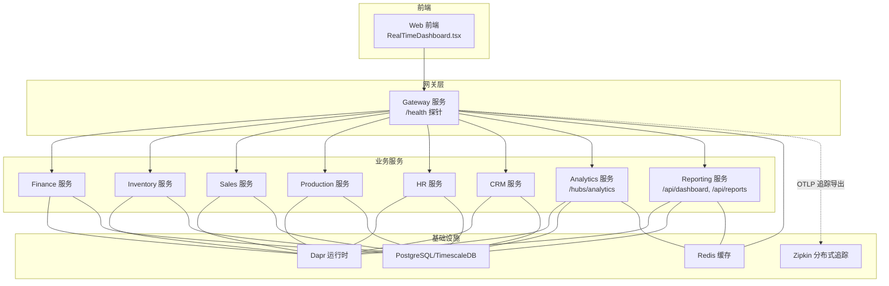
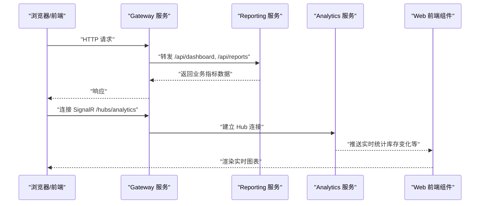
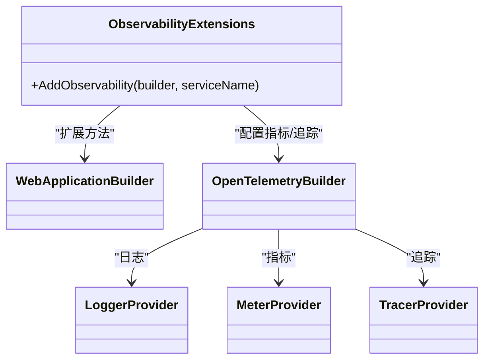
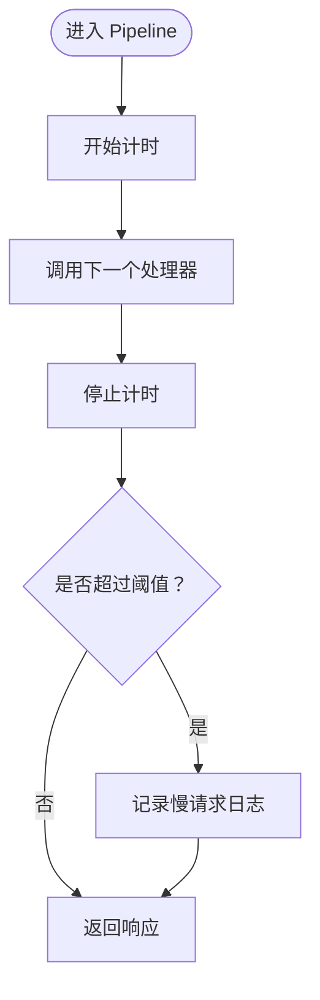
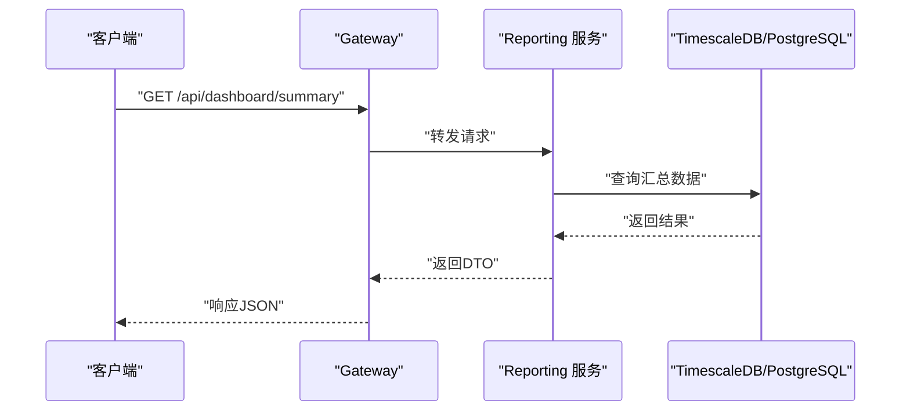
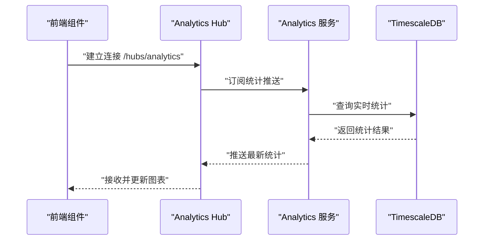
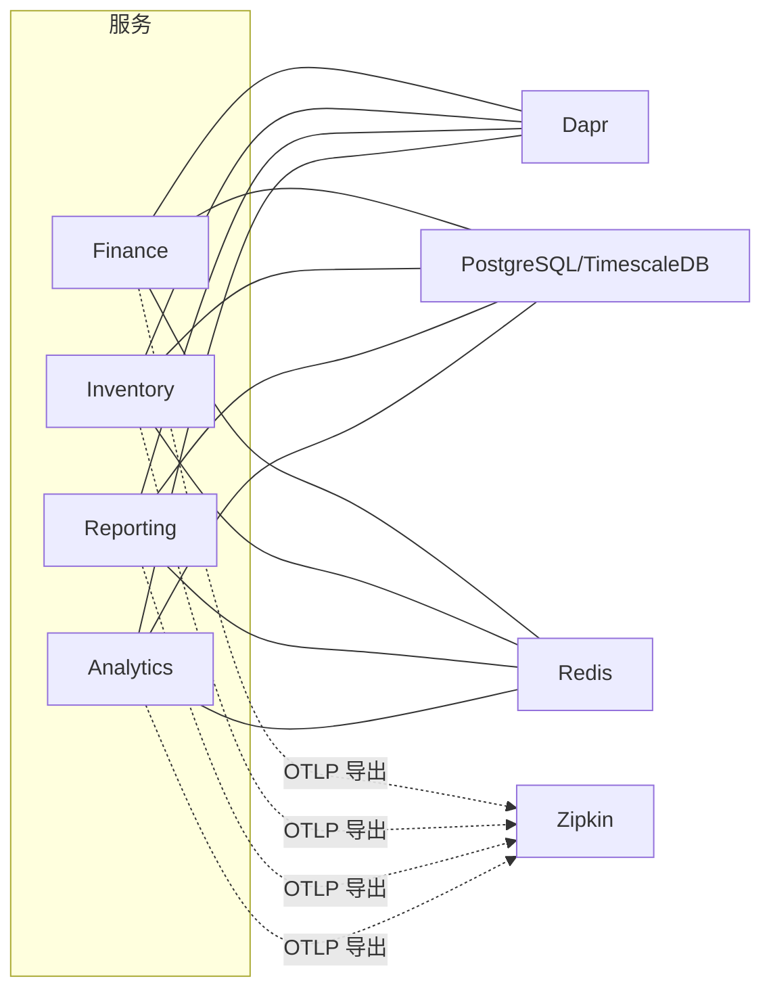

# 指标监控

<cite>
**本文引用的文件**
- [ObservabilityExtensions.cs](file://src/BuildingBlocks/ErpSystem.BuildingBlocks/Observability/ObservabilityExtensions.cs)
- [PerformanceBehavior.cs](file://src/BuildingBlocks/ErpSystem.BuildingBlocks/Behaviors/PerformanceBehavior.cs)
- [docker-compose.yml](file://docker-compose.yml)
- [values.yaml](file://deploy/helm/erp-system/values.yaml)
- [configmap.yaml](file://deploy/k8s/configmap.yaml)
- [ingress.yaml（K8s）](file://deploy/k8s/ingress.yaml)
- [ingress.yaml（Helm）](file://deploy/helm/erp-system/templates/ingress.yaml)
- [deployment.yaml（Helm）](file://deploy/helm/erp-system/templates/deployment.yaml)
- [DashboardController.cs](file://src/Services/Reporting/ErpSystem.Reporting/Controllers/DashboardController.cs)
- [DashboardsController.cs](file://src/Services/Analytics/ErpSystem.Analytics/API/DashboardsController.cs)
- [TimescaleDataExtractor.cs](file://src/Services/Analytics/ErpSystem.Analytics/Infrastructure/TimescaleDataExtractor.cs)
- [RealTimeDashboard.tsx](file://src/Web/ErpSystem.Web/src/components/RealTimeDashboard.tsx)
- [useAnalyticsHub.ts](file://src/Web/ErpSystem.Web/src/hooks/useAnalyticsHub.ts)
- [Program.cs（Analytics）](file://src/Services/Analytics/ErpSystem.Analytics/Program.cs)
- [Program.cs（Finance）](file://src/Services/Finance/ErpSystem.Finance/Program.cs)
- [Program.cs（Inventory）](file://src/Services/Inventory/ErpSystem.Inventory/Program.cs)
- [deployment.yaml（Reporting 服务）](file://deploy/k8s/services/reporting.yaml)
- [deployment.yaml（Gateway 服务）](file://deploy/k8s/services/gateway.yaml)
- [deployment.md](file://docs/deployment.md)
</cite>

## 目录
1. [简介](#简介)
2. [项目结构](#项目结构)
3. [核心组件](#核心组件)
4. [架构总览](#架构总览)
5. [详细组件分析](#详细组件分析)
6. [依赖关系分析](#依赖关系分析)
7. [性能考量](#性能考量)
8. [故障排查指南](#故障排查指南)
9. [结论](#结论)
10. [附录](#附录)

## 简介
本文件面向指标监控系统，围绕该ERP微服务项目的可观测性能力进行系统化梳理，重点覆盖以下方面：
- Prometheus指标采集：基于OpenTelemetry扩展的ASP.NET Core、HTTP客户端与运行时指标注入
- Grafana仪表板配置与指标可视化：结合后端REST接口与前端SignalR实时推送
- 关键业务指标定义：财务、库存、销售等模块的KPI与趋势数据
- 性能指标监控与系统健康指标：慢请求检测、异常捕获、健康检查端点
- 指标类型选择、标签管理与命名规范：统一的观测性实践建议
- 自定义指标创建、第三方指标集成与指标存储策略：OTLP导出、TimescaleDB聚合
- 阈值设置、告警规则配置与趋势分析方法：结合现有健康检查与日志行为
- 指标在容量规划、性能优化与故障诊断中的应用：资源配额、探针与日志行为

## 项目结构
本项目采用多服务微架构，包含多个独立的业务服务（如财务、库存、销售、生产、HR、CRM、Analytics、Reporting等），并通过网关统一对外提供API，并通过Dapr进行事件总线与状态存储集成。可观测性通过通用构建块中的OpenTelemetry扩展注入到各服务中。

图表来源
- [docker-compose.yml](file://docker-compose.yml#L1-L99)
- [values.yaml](file://deploy/helm/erp-system/values.yaml#L1-L127)
- [configmap.yaml](file://deploy/k8s/configmap.yaml#L1-L25)
- [ingress.yaml（K8s）](file://deploy/k8s/ingress.yaml#L1-L36)
- [ingress.yaml（Helm）](file://deploy/helm/erp-system/templates/ingress.yaml#L1-L46)
- [deployment.yaml（Helm）](file://deploy/helm/erp-system/templates/deployment.yaml#L42-L57)
- [deployment.yaml（Reporting 服务）](file://deploy/k8s/services/reporting.yaml#L1-L63)
- [deployment.yaml（Gateway 服务）](file://deploy/k8s/services/gateway.yaml#L1-L59)

章节来源
- [docker-compose.yml](file://docker-compose.yml#L1-L99)
- [values.yaml](file://deploy/helm/erp-system/values.yaml#L1-L127)
- [configmap.yaml](file://deploy/k8s/configmap.yaml#L1-L25)
- [ingress.yaml（K8s）](file://deploy/k8s/ingress.yaml#L1-L36)
- [ingress.yaml（Helm）](file://deploy/helm/erp-system/templates/ingress.yaml#L1-L46)
- [deployment.yaml（Helm）](file://deploy/helm/erp-system/templates/deployment.yaml#L42-L57)
- [deployment.yaml（Reporting 服务）](file://deploy/k8s/services/reporting.yaml#L1-L63)
- [deployment.yaml（Gateway 服务）](file://deploy/k8s/services/gateway.yaml#L1-L59)

## 核心组件
- 可观测性扩展（OpenTelemetry）
  - 日志：启用OpenTelemetry日志，包含格式化消息与作用域
  - 指标：ASP.NET Core、HTTP客户端、运行时指标
  - 调用链追踪：ASP.NET Core、HTTP客户端、服务源追踪；OTLP导出至外部追踪系统
- 性能与异常行为
  - 性能行为：对慢请求进行告警日志
  - 未处理异常行为：捕获并记录所有未处理异常
- 健康检查端点
  - 所有服务均暴露 /health（存活）与 /health/ready（就绪）探针
- 业务指标与可视化
  - Reporting 服务提供仪表板汇总、销售趋势、库存状态、热销产品、近期活动等接口
  - Analytics 服务提供BI指标（如库存周转率、OEE）接口，并通过SignalR推送实时统计
  - 前端通过SignalR订阅实时统计数据并在图表中展示

章节来源
- [ObservabilityExtensions.cs](file://src/BuildingBlocks/ErpSystem.BuildingBlocks/Observability/ObservabilityExtensions.cs#L12-L42)
- [PerformanceBehavior.cs](file://src/BuildingBlocks/ErpSystem.BuildingBlocks/Behaviors/PerformanceBehavior.cs#L11-L39)
- [PerformanceBehavior.cs](file://src/BuildingBlocks/ErpSystem.BuildingBlocks/Behaviors/PerformanceBehavior.cs#L45-L67)
- [deployment.md](file://docs/deployment.md#L103-L115)
- [DashboardController.cs](file://src/Services/Reporting/ErpSystem.Reporting/Controllers/DashboardController.cs#L1-L79)
- [DashboardsController.cs](file://src/Services/Analytics/ErpSystem.Analytics/API/DashboardsController.cs#L1-L26)
- [Program.cs（Analytics）](file://src/Services/Analytics/ErpSystem.Analytics/Program.cs#L56-L56)
- [RealTimeDashboard.tsx](file://src/Web/ErpSystem.Web/src/components/RealTimeDashboard.tsx#L1-L27)
- [useAnalyticsHub.ts](file://src/Web/ErpSystem.Web/src/hooks/useAnalyticsHub.ts#L1-L50)

## 架构总览
下图展示了从客户端到服务端、再到基础设施与可观测性系统的整体流程，强调指标采集、日志与追踪的注入路径，以及业务指标的获取与实时推送。

图表来源
- [ingress.yaml（Helm）](file://deploy/helm/erp-system/templates/ingress.yaml#L24-L38)
- [ingress.yaml（K8s）](file://deploy/k8s/ingress.yaml#L23-L29)
- [Program.cs（Analytics）](file://src/Services/Analytics/ErpSystem.Analytics/Program.cs#L56-L56)
- [RealTimeDashboard.tsx](file://src/Web/ErpSystem.Web/src/components/RealTimeDashboard.tsx#L1-L27)
- [useAnalyticsHub.ts](file://src/Web/ErpSystem.Web/src/hooks/useAnalyticsHub.ts#L12-L47)

## 详细组件分析

### 可观测性扩展（OpenTelemetry）
- 日志：启用OpenTelemetry日志，包含格式化消息与作用域，便于结构化日志与上下文关联
- 指标：自动注入ASP.NET Core、HTTP客户端与运行时指标，满足基础性能与资源使用监控
- 追踪：启用ASP.NET Core、HTTP客户端与服务源追踪，并配置OTLP导出器，支持Jaeger/Aspire/Seq/Elastic等后端
- 注入位置：通过通用构建块中的扩展方法在各服务启动时注册

图表来源
- [ObservabilityExtensions.cs](file://src/BuildingBlocks/ErpSystem.BuildingBlocks/Observability/ObservabilityExtensions.cs#L12-L42)

章节来源
- [ObservabilityExtensions.cs](file://src/BuildingBlocks/ErpSystem.BuildingBlocks/Observability/ObservabilityExtensions.cs#L12-L42)

### 性能与异常行为（Pipeline 行为）
- 性能行为：对请求处理耗时进行计时，超过阈值（毫秒级）记录警告日志，便于定位慢请求
- 异常行为：捕获未处理异常，记录异常堆栈与请求上下文，确保问题可追溯

图表来源
- [PerformanceBehavior.cs](file://src/BuildingBlocks/ErpSystem.BuildingBlocks/Behaviors/PerformanceBehavior.cs#L17-L39)

章节来源
- [PerformanceBehavior.cs](file://src/BuildingBlocks/ErpSystem.BuildingBlocks/Behaviors/PerformanceBehavior.cs#L11-L39)
- [PerformanceBehavior.cs](file://src/BuildingBlocks/ErpSystem.BuildingBlocks/Behaviors/PerformanceBehavior.cs#L45-L67)

### 健康检查端点
- 所有服务均暴露 /health（存活探针）与 /health/ready（就绪探针），用于Kubernetes滚动更新与负载均衡
- Helm模板与Kubernetes清单中均有相应探针配置

章节来源
- [deployment.md](file://docs/deployment.md#L103-L115)
- [deployment.yaml（Helm）](file://deploy/helm/erp-system/templates/deployment.yaml#L44-L55)
- [deployment.yaml（Reporting 服务）](file://deploy/k8s/services/reporting.yaml#L39-L50)
- [deployment.yaml（Gateway 服务）](file://deploy/k8s/services/gateway.yaml#L35-L46)

### 业务指标与可视化（Reporting 服务）
- 汇总接口：获取执行摘要（收入、订单数、库存价值、低库存、待采购单、在制品订单等）
- 销售趋势：按天返回趋势数据点，支持图表展示
- 库存状态：按类别统计库存数量、低库存与缺货项及库存价值
- 热销产品：返回销量与收入前N的产品
- 近期活动：跨模块的最近操作记录

图表来源
- [DashboardController.cs](file://src/Services/Reporting/ErpSystem.Reporting/Controllers/DashboardController.cs#L13-L18)
- [ingress.yaml（Helm）](file://deploy/helm/erp-system/templates/ingress.yaml#L32-L38)
- [ingress.yaml（K8s）](file://deploy/k8s/ingress.yaml#L23-L29)

章节来源
- [DashboardController.cs](file://src/Services/Reporting/ErpSystem.Reporting/Controllers/DashboardController.cs#L1-L79)
- [ingress.yaml（Helm）](file://deploy/helm/erp-system/templates/ingress.yaml#L24-L38)
- [ingress.yaml（K8s）](file://deploy/k8s/ingress.yaml#L23-L29)

### 实时指标与可视化（Analytics 服务 + 前端）
- BI 指标接口：提供库存周转率、OEE 等指标
- 实时推送：通过SignalR向前端推送最新统计（如材料变更分布、均值与标准差）
- 前端组件：使用React与Recharts展示实时图表，通过Hook建立与Hub的连接

图表来源
- [DashboardsController.cs](file://src/Services/Analytics/ErpSystem.Analytics/API/DashboardsController.cs#L10-L24)
- [Program.cs（Analytics）](file://src/Services/Analytics/ErpSystem.Analytics/Program.cs#L56-L56)
- [useAnalyticsHub.ts](file://src/Web/ErpSystem.Web/src/hooks/useAnalyticsHub.ts#L18-L47)
- [RealTimeDashboard.tsx](file://src/Web/ErpSystem.Web/src/components/RealTimeDashboard.tsx#L12-L20)

章节来源
- [DashboardsController.cs](file://src/Services/Analytics/ErpSystem.Analytics/API/DashboardsController.cs#L1-L26)
- [Program.cs（Analytics）](file://src/Services/Analytics/ErpSystem.Analytics/Program.cs#L56-L56)
- [useAnalyticsHub.ts](file://src/Web/ErpSystem.Web/src/hooks/useAnalyticsHub.ts#L1-L50)
- [RealTimeDashboard.tsx](file://src/Web/ErpSystem.Web/src/components/RealTimeDashboard.tsx#L1-L27)

### 指标存储与数据提取（TimescaleDB）
- 数据提取：通过TimescaleDB Toolkit函数访问聚合统计，支持近24小时内的分位数、均值与标准差等指标
- 查询示例：按小时与物料维度聚合，返回中位数、平均变化与标准差等

章节来源
- [TimescaleDataExtractor.cs](file://src/Services/Analytics/ErpSystem.Analytics/Infrastructure/TimescaleDataExtractor.cs#L88-L131)

## 依赖关系分析
- 组件耦合
  - 各业务服务通过Dapr集成事件总线与状态存储，降低服务间耦合
  - 网关作为统一入口，集中处理路由与探针
- 外部依赖
  - Zipkin用于分布式追踪导出（OTLP）
  - Redis用于缓存与Dapr组件
  - PostgreSQL/TimescaleDB用于事件存储与分析
- 配置与环境变量
  - ConfigMap集中管理环境变量（数据库连接、服务URL、Dapr端口等）
  - Helm values控制镜像、副本数、资源限制与Ingress配置

图表来源
- [docker-compose.yml](file://docker-compose.yml#L86-L91)
- [configmap.yaml](file://deploy/k8s/configmap.yaml#L11-L24)
- [ObservabilityExtensions.cs](file://src/BuildingBlocks/ErpSystem.BuildingBlocks/Observability/ObservabilityExtensions.cs#L36-L38)

章节来源
- [docker-compose.yml](file://docker-compose.yml#L1-L99)
- [configmap.yaml](file://deploy/k8s/configmap.yaml#L1-L25)
- [ObservabilityExtensions.cs](file://src/BuildingBlocks/ErpSystem.BuildingBlocks/Observability/ObservabilityExtensions.cs#L36-L38)

## 性能考量
- 资源配额与弹性
  - Helm values为各服务设置requests/limits，保障集群内资源公平分配
  - Ingress与探针配置保证流量与健康状态的稳定性
- 慢请求与异常
  - 性能行为对慢请求进行告警，异常行为记录未处理异常，便于快速定位性能瓶颈与错误根因
- 指标采集粒度
  - OpenTelemetry已注入ASP.NET Core、HTTP客户端与运行时指标，建议结合业务自定义指标以完善KPI覆盖

章节来源
- [values.yaml](file://deploy/helm/erp-system/values.yaml#L13-L19)
- [deployment.yaml（Helm）](file://deploy/helm/erp-system/templates/deployment.yaml#L42-L57)
- [PerformanceBehavior.cs](file://src/BuildingBlocks/ErpSystem.BuildingBlocks/Behaviors/PerformanceBehavior.cs#L17-L39)
- [PerformanceBehavior.cs](file://src/BuildingBlocks/ErpSystem.BuildingBlocks/Behaviors/PerformanceBehavior.cs#L48-L66)

## 故障排查指南
- 健康检查失败
  - 检查 /health 与 /health/ready 是否可达，确认探针配置与容器端口一致
- 指标不可见或无数据
  - 确认OpenTelemetry已正确注册并启用指标与追踪
  - 检查OTLP导出端点环境变量是否在部署环境中配置
- 实时图表无更新
  - 确认SignalR Hub已映射且前端成功连接
  - 检查Analytics服务是否正常推送统计
- TimescaleDB查询异常
  - 确认TimescaleDB Toolkit已启用，查询权限与连接字符串正确

章节来源
- [deployment.md](file://docs/deployment.md#L103-L115)
- [ObservabilityExtensions.cs](file://src/BuildingBlocks/ErpSystem.BuildingBlocks/Observability/ObservabilityExtensions.cs#L36-L38)
- [Program.cs（Analytics）](file://src/Services/Analytics/ErpSystem.Analytics/Program.cs#L56-L56)
- [useAnalyticsHub.ts](file://src/Web/ErpSystem.Web/src/hooks/useAnalyticsHub.ts#L18-L47)
- [TimescaleDataExtractor.cs](file://src/Services/Analytics/ErpSystem.Analytics/Infrastructure/TimescaleDataExtractor.cs#L123-L128)

## 结论
本项目在通用构建块中集成了OpenTelemetry可观测性能力，为各业务服务提供了统一的日志、指标与追踪注入；通过健康检查端点与探针配置保障了系统健康与弹性；Reporting与Analytics服务分别提供静态与实时业务指标，配合前端图表实现可视化。建议在此基础上补充业务自定义指标、完善告警规则与阈值策略，并持续优化资源配额与探针参数以提升监控质量与系统稳定性。

## 附录

### 指标类型选择与命名规范（建议）
- 指标类型
  - 计数器（Counter）：累计型业务事件（如订单数、发票数）
  - 即时值（Gauge）：当前状态（如活跃用户、队列长度）
  - 直方图/摘要（Histogram/HistogramQuantile）：延迟与大小分布（如请求耗时、响应体大小）
- 标签管理
  - 统一标签键：service、version、environment、region、cluster
  - 业务标签：module（模块）、tenant（租户）、status（状态码）、operation（操作名）
- 命名规范
  - 前缀：erp_<module>_
  - 动作_对象_单位：如 erp_sales_orders_total、erp_inventory_value_gauge
  - 避免使用空格与特殊字符，优先使用下划线或驼峰

### 自定义指标创建与第三方集成
- 自定义指标
  - 在业务服务中注册Meter与Instrument，结合领域事件或业务操作上报
  - 使用OpenTelemetry SDK或Prometheus集成库导出指标
- 第三方集成
  - 追踪：OTLP导出至Zipkin/Jaeger
  - 日志：OpenTelemetry日志与结构化日志栈（如Seq/Elastic）
  - 指标：Prometheus/Grafana（通过OTel Collector或直接导出）

### 指标存储策略
- 短期：内存或本地存储（用于实时图表与短期分析）
- 中期：TimescaleDB（时序数据、聚合与趋势分析）
- 长期：归档至对象存储或数据湖，支持离线分析与合规保留

### 阈值设置、告警规则与趋势分析
- 阈值设置
  - P0/P1：拒绝服务、SLA严重偏离、慢请求占比过高
  - P2：慢请求阈值告警、错误率上升、队列积压
- 告警规则
  - 基于PromQL的规则表达式，结合时间窗口与聚合层级
  - 与健康检查端点联动，避免误报
- 趋势分析
  - 使用折线图与柱状图展示周同比/月同比
  - 结合TimescaleDB聚合与BI接口输出

### 指标在容量规划、性能优化与故障诊断中的应用
- 容量规划：基于CPU/内存使用趋势与请求量增长预测扩容
- 性能优化：定位慢请求与热点模块，优化数据库查询与缓存命中
- 故障诊断：结合日志、追踪与指标，快速定位异常根因与传播路径