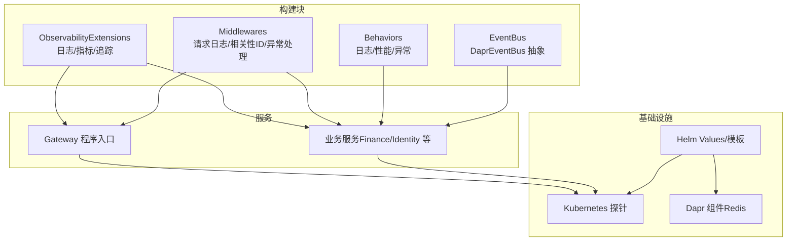
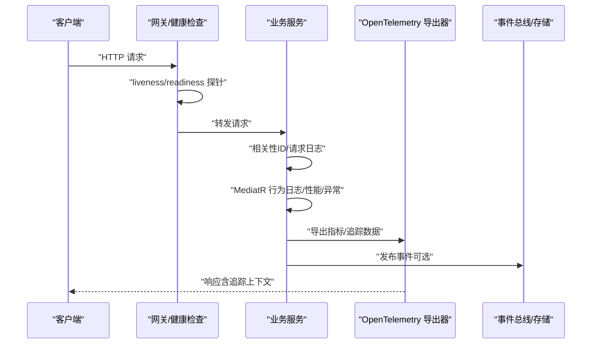
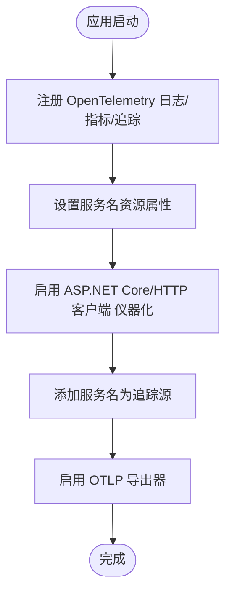
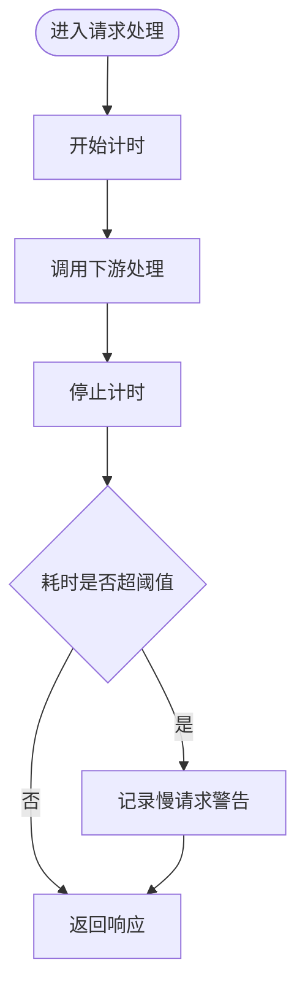
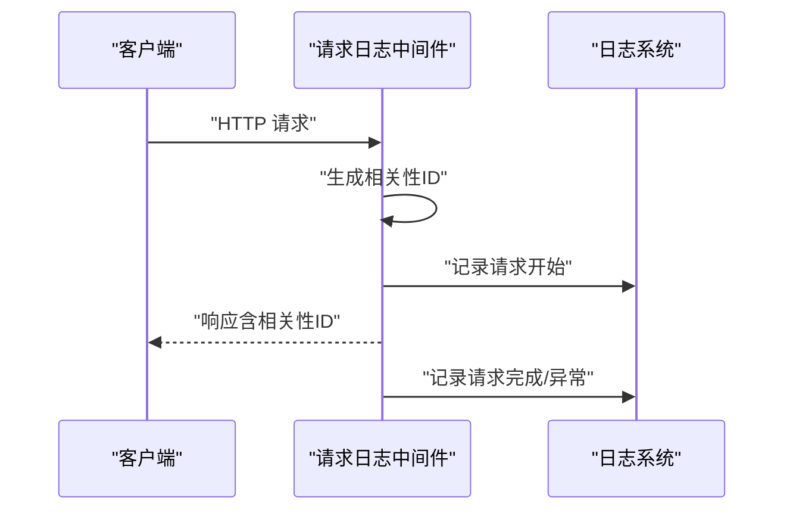
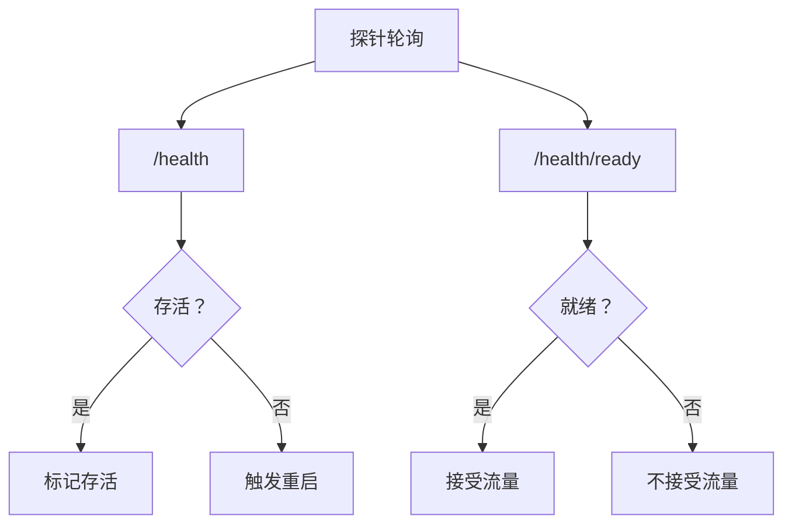
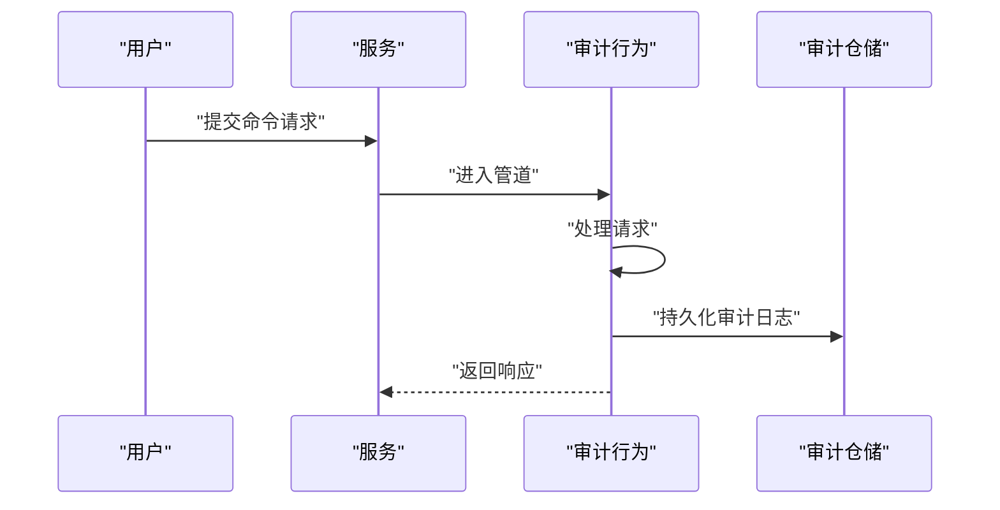
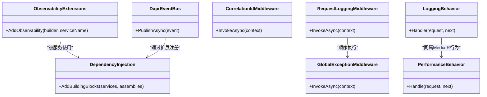

# 监控与可观测性

<cite>
**本文引用的文件**
- [ObservabilityExtensions.cs](file://src/BuildingBlocks/ErpSystem.BuildingBlocks/Observability/ObservabilityExtensions.cs)
- [Middlewares.cs](file://src/BuildingBlocks/ErpSystem.BuildingBlocks/Middleware/Middlewares.cs)
- [LoggingBehavior.cs](file://src/BuildingBlocks/ErpSystem.BuildingBlocks/Behaviors/LoggingBehavior.cs)
- [PerformanceBehavior.cs](file://src/BuildingBlocks/ErpSystem.BuildingBlocks/Behaviors/PerformanceBehavior.cs)
- [DependencyInjection.cs](file://src/BuildingBlocks/ErpSystem.BuildingBlocks/DependencyInjection.cs)
- [DaprEventBus.cs](file://src/BuildingBlocks/ErpSystem.BuildingBlocks/EventBus/DaprEventBus.cs)
- [EventBusExtensions.cs](file://src/BuildingBlocks/ErpSystem.BuildingBlocks/EventBus/EventBusExtensions.cs)
- [Program.cs（Gateway）](file://src/Gateways/ErpSystem.Gateway/Program.cs)
- [gateway.yaml](file://deploy/k8s/services/gateway.yaml)
- [deployment.yaml（Helm）](file://deploy/helm/erp-system/templates/deployment.yaml)
- [values.yaml（Helm）](file://deploy/helm/erp-system/values.yaml)
- [appsettings.json（Finance）](file://src/Services/Finance/ErpSystem.Finance/appsettings.json)
- [appsettings.json（Identity）](file://src/Services/Identity/ErpSystem.Identity/appsettings.json)
- [AuditLog.cs](file://src/BuildingBlocks/ErpSystem.BuildingBlocks/Auditing/AuditLog.cs)
</cite>

## 目录
1. [简介](#简介)
2. [项目结构](#项目结构)
3. [核心组件](#核心组件)
4. [架构总览](#架构总览)
5. [详细组件分析](#详细组件分析)
6. [依赖关系分析](#依赖关系分析)
7. [性能考量](#性能考量)
8. [故障排查指南](#故障排查指南)
9. [结论](#结论)
10. [附录](#附录)

## 简介
本文件面向SRE与开发团队，系统化梳理本ERP微服务项目的监控与可观测性能力，覆盖分布式追踪、链路追踪、性能监控、指标采集、健康检查与探针、日志聚合与结构化日志、事件总线可观测性、以及服务网格与流量分析的落地建议。文档同时提供仪表板设计与告警管理的最佳实践，帮助在生产环境中实现高可用、可诊断、可优化的运维体系。

## 项目结构
本项目采用多服务微架构，结合Kubernetes与Helm进行编排，并通过构建块（Building Blocks）统一注入可观测性能力。关键位置如下：
- 可观测性扩展：集中于构建块中的可观测性扩展，统一注册日志、指标与追踪导出。
- 中间件层：请求日志、相关性ID、全局异常处理等中间件贯穿HTTP请求生命周期。
- 领域管道行为：日志、性能与异常行为在MediatR请求处理管线中执行。
- 网关与探针：网关服务内置健康检查端点与探针配置；Kubernetes层面为各服务配置存活与就绪探针。
- 事件总线：基于Dapr的事件总线抽象，便于后续接入Pub/Sub与可观测性。
- 配置：各服务的appsettings.json控制日志级别；Helm values定义环境变量与资源限制。

图表来源
- [ObservabilityExtensions.cs](file://src/BuildingBlocks/ErpSystem.BuildingBlocks/Observability/ObservabilityExtensions.cs#L12-L42)
- [Middlewares.cs](file://src/BuildingBlocks/ErpSystem.BuildingBlocks/Middleware/Middlewares.cs#L10-L68)
- [LoggingBehavior.cs](file://src/BuildingBlocks/ErpSystem.BuildingBlocks/Behaviors/LoggingBehavior.cs#L6-L21)
- [PerformanceBehavior.cs](file://src/BuildingBlocks/ErpSystem.BuildingBlocks/Behaviors/PerformanceBehavior.cs#L11-L39)
- [DaprEventBus.cs](file://src/BuildingBlocks/ErpSystem.BuildingBlocks/EventBus/DaprEventBus.cs#L11-L21)
- [Program.cs（Gateway）](file://src/Gateways/ErpSystem.Gateway/Program.cs#L66-L81)
- [gateway.yaml](file://deploy/k8s/services/gateway.yaml#L35-L46)
- [values.yaml（Helm）](file://deploy/helm/erp-system/values.yaml#L117-L123)

章节来源
- [ObservabilityExtensions.cs](file://src/BuildingBlocks/ErpSystem.BuildingBlocks/Observability/ObservabilityExtensions.cs#L12-L42)
- [Middlewares.cs](file://src/BuildingBlocks/ErpSystem.BuildingBlocks/Middleware/Middlewares.cs#L10-L68)
- [PerformanceBehavior.cs](file://src/BuildingBlocks/ErpSystem.BuildingBlocks/Behaviors/PerformanceBehavior.cs#L11-L39)
- [Program.cs（Gateway）](file://src/Gateways/ErpSystem.Gateway/Program.cs#L66-L81)
- [gateway.yaml](file://deploy/k8s/services/gateway.yaml#L35-L46)
- [values.yaml（Helm）](file://deploy/helm/erp-system/values.yaml#L117-L123)

## 核心组件
- 分布式追踪与指标导出：通过OpenTelemetry扩展统一注册日志、ASP.NET Core与HTTP客户端指标、运行时指标，并启用OTLP导出器，便于对接Jaeger、Aspire Dashboard、Seq或Elastic等后端。
- 结构化日志与请求追踪：中间件为每个请求生成相关性ID并记录开始/完成/异常信息；日志包含方法、路径、状态码与耗时，便于跨服务串联。
- 性能监控与慢请求告警：在MediatR管道中记录请求处理耗时，超过阈值时发出警告，辅助定位慢调用。
- 健康检查与探针：网关服务暴露/health与/health/ready端点；Kubernetes为各服务配置liveness与readiness探针。
- 审计与审计日志：自动记录命令执行的审计日志，支持实体变更追踪与合规审计。
- 事件总线可观测性：通过IEventBus抽象与Dapr Pub/Sub组件，便于后续埋点与追踪事件发布。

章节来源
- [ObservabilityExtensions.cs](file://src/BuildingBlocks/ErpSystem.BuildingBlocks/Observability/ObservabilityExtensions.cs#L14-L39)
- [Middlewares.cs](file://src/BuildingBlocks/ErpSystem.BuildingBlocks/Middleware/Middlewares.cs#L17-L46)
- [PerformanceBehavior.cs](file://src/BuildingBlocks/ErpSystem.BuildingBlocks/Behaviors/PerformanceBehavior.cs#L27-L36)
- [Program.cs（Gateway）](file://src/Gateways/ErpSystem.Gateway/Program.cs#L80-L81)
- [AuditLog.cs](file://src/BuildingBlocks/ErpSystem.BuildingBlocks/Auditing/AuditLog.cs#L83-L92)
- [DaprEventBus.cs](file://src/BuildingBlocks/ErpSystem.BuildingBlocks/EventBus/DaprEventBus.cs#L15-L20)

## 架构总览
下图展示从客户端到服务端的关键可观测性路径：请求进入网关，经由健康检查与探针保障存活与就绪；请求在中间件层打上相关性ID并记录日志；服务内部通过OpenTelemetry导出指标与追踪；审计行为记录命令级变更；事件总线负责跨服务解耦与可观测性扩展。

图表来源
- [Program.cs（Gateway）](file://src/Gateways/ErpSystem.Gateway/Program.cs#L80-L81)
- [gateway.yaml](file://deploy/k8s/services/gateway.yaml#L35-L46)
- [Middlewares.cs](file://src/BuildingBlocks/ErpSystem.BuildingBlocks/Middleware/Middlewares.cs#L17-L46)
- [PerformanceBehavior.cs](file://src/BuildingBlocks/ErpSystem.BuildingBlocks/Behaviors/PerformanceBehavior.cs#L27-L36)
- [ObservabilityExtensions.cs](file://src/BuildingBlocks/ErpSystem.BuildingBlocks/Observability/ObservabilityExtensions.cs#L36-L39)
- [DaprEventBus.cs](file://src/BuildingBlocks/ErpSystem.BuildingBlocks/EventBus/DaprEventBus.cs#L15-L20)

## 详细组件分析

### 分布式追踪与链路追踪
- 统一注册：通过扩展方法在应用启动时注册OpenTelemetry日志、指标与追踪，并设置服务名资源属性。
- 追踪导出：启用OTLP导出器，需在部署时设置导出端点环境变量以对接Jaeger、Aspire Dashboard、Seq或Elastic。
- 源码注入：追踪管线包含ASP.NET Core与HTTP客户端仪器化，并以服务名为源，确保跨服务关联。

图表来源
- [ObservabilityExtensions.cs](file://src/BuildingBlocks/ErpSystem.BuildingBlocks/Observability/ObservabilityExtensions.cs#L22-L39)

章节来源
- [ObservabilityExtensions.cs](file://src/BuildingBlocks/ErpSystem.BuildingBlocks/Observability/ObservabilityExtensions.cs#L12-L42)

### 性能监控与慢请求告警
- 在MediatR请求处理管线中记录请求名称与耗时，超过阈值（毫秒）时发出警告日志，便于定位慢调用。
- 建议结合Prometheus抓取ASP.NET Core与HTTP客户端指标，配合Grafana仪表板展示P50/P95/P99延迟趋势。

图表来源
- [PerformanceBehavior.cs](file://src/BuildingBlocks/ErpSystem.BuildingBlocks/Behaviors/PerformanceBehavior.cs#L17-L39)

章节来源
- [PerformanceBehavior.cs](file://src/BuildingBlocks/ErpSystem.BuildingBlocks/Behaviors/PerformanceBehavior.cs#L11-L68)

### 指标收集与Prometheus集成
- 指标来源：ASP.NET Core、HTTP客户端、运行时指标已注册，可直接被Prometheus抓取。
- 建议：在Helm中为各服务配置Prometheus scrape配置，使用服务发现或静态配置方式抓取指标端点。

章节来源
- [ObservabilityExtensions.cs](file://src/BuildingBlocks/ErpSystem.BuildingBlocks/Observability/ObservabilityExtensions.cs#L24-L28)

### Grafana仪表板设计建议
- 基础面板：请求速率、错误率、P50/P95/P99延迟、并发连接数、GC暂停时间。
- 高级面板：慢请求Top-N、上游依赖延迟贡献、事件发布吞吐量（如启用事件总线）。
- 告警阈值：基于历史分位数设定动态阈值，避免固定阈值导致的误报。

### 日志聚合与结构化日志
- 结构化日志：中间件在请求开始/完成/异常时输出包含方法、路径、状态码与耗时的日志条目，便于结构化解析。
- 相关性ID：中间件为每个请求生成短ID并写入响应头，便于跨服务串联日志。
- 日志级别：服务appsettings.json中默认“Information”，可按环境调整。

图表来源
- [Middlewares.cs](file://src/BuildingBlocks/ErpSystem.BuildingBlocks/Middleware/Middlewares.cs#L17-L46)

章节来源
- [Middlewares.cs](file://src/BuildingBlocks/ErpSystem.BuildingBlocks/Middleware/Middlewares.cs#L10-L68)
- [appsettings.json（Finance）](file://src/Services/Finance/ErpSystem.Finance/appsettings.json#L2-L7)
- [appsettings.json（Identity）](file://src/Services/Identity/ErpSystem.Identity/appsettings.json#L2-L7)

### 健康检查、存活探针与就绪探针
- 健康检查端点：网关服务映射/health与/health/ready端点，用于Kubernetes探针。
- 存活探针：探测/health，失败则重启容器。
- 就绪探针：探测/health/ready，未就绪时不接收流量。
- Kubernetes配置：Helm模板与K8s YAML均配置了liveness与readiness探针参数。

图表来源
- [Program.cs（Gateway）](file://src/Gateways/ErpSystem.Gateway/Program.cs#L80-L81)
- [gateway.yaml](file://deploy/k8s/services/gateway.yaml#L35-L46)
- [deployment.yaml（Helm）](file://deploy/helm/erp-system/templates/deployment.yaml#L44-L55)

章节来源
- [Program.cs（Gateway）](file://src/Gateways/ErpSystem.Gateway/Program.cs#L66-L81)
- [gateway.yaml](file://deploy/k8s/services/gateway.yaml#L35-L46)
- [deployment.yaml（Helm）](file://deploy/helm/erp-system/templates/deployment.yaml#L44-L55)

### 审计与审计日志
- 自动审计：对实现特定标记接口的命令请求，在处理完成后自动生成审计日志，包含实体类型、实体ID、操作、用户、租户、IP与UA等。
- 数据模型：审计日志实体包含索引字段，便于查询与报表。

图表来源
- [AuditLog.cs](file://src/BuildingBlocks/ErpSystem.BuildingBlocks/Auditing/AuditLog.cs#L83-L92)

章节来源
- [AuditLog.cs](file://src/BuildingBlocks/ErpSystem.BuildingBlocks/Auditing/AuditLog.cs#L65-L101)

### 事件总线可观测性
- 抽象与实现：通过IEventBus抽象与DaprEventBus实现，Topic命名约定为事件类型名，便于追踪与告警。
- 扩展建议：在发布前后增加埋点与指标，结合OTLP导出事件发布链路。

章节来源
- [DaprEventBus.cs](file://src/BuildingBlocks/ErpSystem.BuildingBlocks/EventBus/DaprEventBus.cs#L11-L21)
- [EventBusExtensions.cs](file://src/BuildingBlocks/ErpSystem.BuildingBlocks/EventBus/EventBusExtensions.cs#L7-L13)

### 服务网格监控、流量分析与性能瓶颈识别
- 当前状态：项目未显式启用服务网格（如Istio），但具备Dapr组件（Redis）与事件总线抽象，便于后续接入服务网格。
- 建议：在服务网格启用后，结合追踪与指标，分析跨服务调用延迟、错误率与队列积压，定位性能瓶颈。

### 用户体验监控、APM工具集成与错误追踪
- 建议：在前端Web应用中集成APM（如OpenTelemetry JS SDK），采集页面加载、用户交互与错误事件，结合后端追踪进行端到端体验监控。

## 依赖关系分析
- 构建块依赖：各服务通过依赖注入注册构建块，MediatR行为与中间件贯穿请求生命周期。
- 观测性扩展：统一在应用启动时注册，确保所有服务共享一致的可观测性配置。
- 事件总线：当前使用Dummy实现，便于测试；生产可替换为DaprEventBus并接入Redis Pub/Sub。

图表来源
- [ObservabilityExtensions.cs](file://src/BuildingBlocks/ErpSystem.BuildingBlocks/Observability/ObservabilityExtensions.cs#L12-L42)
- [Middlewares.cs](file://src/BuildingBlocks/ErpSystem.BuildingBlocks/Middleware/Middlewares.cs#L10-L124)
- [LoggingBehavior.cs](file://src/BuildingBlocks/ErpSystem.BuildingBlocks/Behaviors/LoggingBehavior.cs#L6-L21)
- [PerformanceBehavior.cs](file://src/BuildingBlocks/ErpSystem.BuildingBlocks/Behaviors/PerformanceBehavior.cs#L11-L68)
- [DaprEventBus.cs](file://src/BuildingBlocks/ErpSystem.BuildingBlocks/EventBus/DaprEventBus.cs#L11-L21)
- [DependencyInjection.cs](file://src/BuildingBlocks/ErpSystem.BuildingBlocks/DependencyInjection.cs#L12-L29)

章节来源
- [DependencyInjection.cs](file://src/BuildingBlocks/ErpSystem.BuildingBlocks/DependencyInjection.cs#L12-L29)
- [EventBusExtensions.cs](file://src/BuildingBlocks/ErpSystem.BuildingBlocks/EventBus/EventBusExtensions.cs#L7-L13)

## 性能考量
- 资源配额：Helm values为各服务设置了CPU与内存请求/限制，建议结合Prometheus指标与HPA策略进行弹性伸缩。
- 探针参数：根据服务启动时间与依赖加载情况调整初始延迟与周期，避免探针抖动。
- 追踪开销：OTLP导出器在生产需配置采样与批量导出参数，降低网络与存储压力。

章节来源
- [values.yaml（Helm）](file://deploy/helm/erp-system/values.yaml#L11-L19)
- [deployment.yaml（Helm）](file://deploy/helm/erp-system/templates/deployment.yaml#L44-L55)

## 故障排查指南
- 快速定位
  - 查看相关性ID：中间件在请求头与日志中输出相关性ID，便于跨服务串联。
  - 慢请求：关注性能行为产生的慢请求警告日志。
  - 异常：全局异常中间件统一输出标准化错误响应，便于快速定位。
- 健康检查
  - 若探针失败：检查/health与/health/ready端点返回状态；确认依赖（数据库、缓存）可用。
- 追踪与指标
  - 确认OTEL_EXPORTER_OTLP_ENDPOINT环境变量正确；验证OTLP导出器连通性。

章节来源
- [Middlewares.cs](file://src/BuildingBlocks/ErpSystem.BuildingBlocks/Middleware/Middlewares.cs#L17-L46)
- [PerformanceBehavior.cs](file://src/BuildingBlocks/ErpSystem.BuildingBlocks/Behaviors/PerformanceBehavior.cs#L27-L36)
- [Program.cs（Gateway）](file://src/Gateways/ErpSystem.Gateway/Program.cs#L80-L81)

## 结论
本项目在构建块层面统一注入了可观测性能力，结合中间件与MediatR行为实现了结构化日志、相关性ID与慢请求告警；通过健康检查与Kubernetes探针保障服务可用性；并通过审计行为满足合规与变更追踪需求。建议在生产中完善Prometheus/Grafana指标体系、OTLP导出配置与服务网格集成，持续优化告警策略与仪表板设计，提升整体可观测性水平。

## 附录
- 最佳实践清单
  - 为所有服务启用/health与/health/ready端点。
  - 使用相关性ID贯穿请求生命周期，便于链路追踪。
  - 对慢请求与异常建立分级告警，结合仪表板可视化。
  - 在事件总线发布前后增加埋点与指标，完善跨服务可观测性。
  - 启用服务网格后，结合追踪与指标进行流量分析与瓶颈定位。