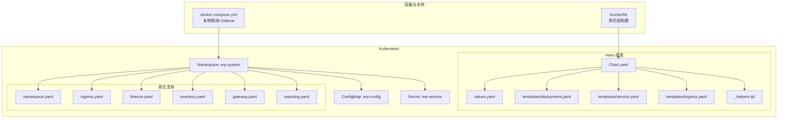
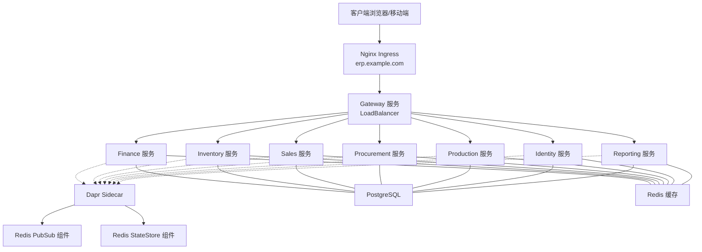
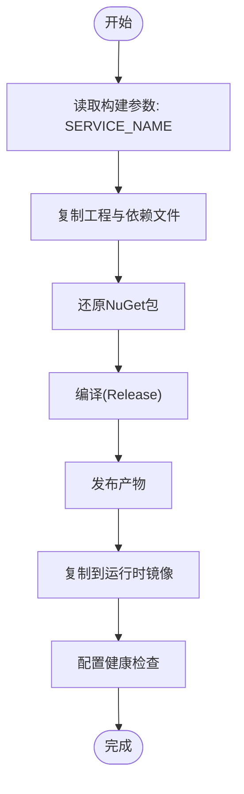
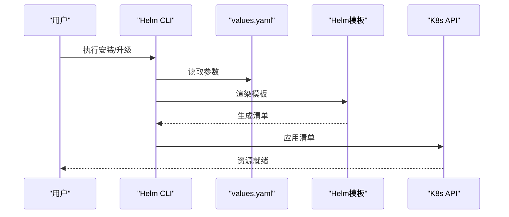
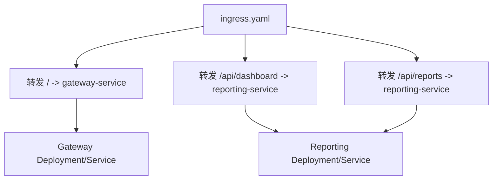
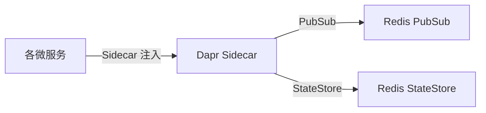
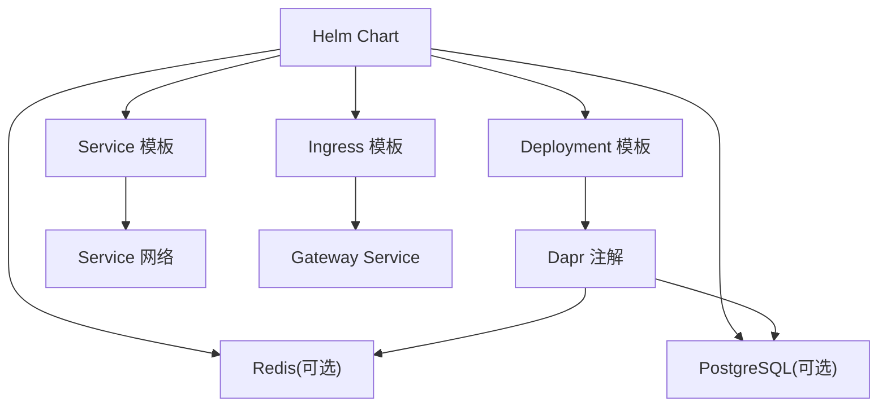

# 部署与运维

<cite>
**本文引用的文件**
- [Chart.yaml](file://deploy/helm/erp-system/Chart.yaml)
- [values.yaml](file://deploy/helm/erp-system/values.yaml)
- [_helpers.tpl](file://deploy/helm/erp-system/templates/_helpers.tpl)
- [deployment.yaml](file://deploy/helm/erp-system/templates/deployment.yaml)
- [service.yaml](file://deploy/helm/erp-system/templates/service.yaml)
- [ingress.yaml](file://deploy/helm/erp-system/templates/ingress.yaml)
- [namespace.yaml](file://deploy/k8s/namespace.yaml)
- [ingress.yaml](file://deploy/k8s/ingress.yaml)
- [configmap.yaml](file://deploy/k8s/configmap.yaml)
- [secrets.yaml](file://deploy/k8s/secrets.yaml)
- [finance.yaml](file://deploy/k8s/services/finance.yaml)
- [inventory.yaml](file://deploy/k8s/services/inventory.yaml)
- [gateway.yaml](file://deploy/k8s/services/gateway.yaml)
- [reporting.yaml](file://deploy/k8s/services/reporting.yaml)
- [Dockerfile](file://Dockerfile)
- [docker-compose.yml](file://docker-compose.yml)
- [pubsub.yaml](file://components/pubsub.yaml)
- [statestore.yaml](file://components/statestore.yaml)
</cite>

## 目录
1. [简介](#简介)
2. [项目结构](#项目结构)
3. [核心组件](#核心组件)
4. [架构总览](#架构总览)
5. [详细组件分析](#详细组件分析)
6. [依赖关系分析](#依赖关系分析)
7. [性能考虑](#性能考虑)
8. [故障排查指南](#故障排查指南)
9. [结论](#结论)
10. [附录](#附录)

## 简介
本文件面向部署与运维工程师，系统性阐述该ERP微服务项目的容器化策略、Kubernetes部署与Helm管理、服务网格与Ingress路由、扩缩容与滚动更新、以及CI/CD与监控告警等运维主题。内容基于仓库中的实际部署配置文件进行归纳总结，并提供可操作的实施建议与最佳实践。

## 项目结构
- 容器化与本地开发：使用单体Dockerfile支持多服务多阶段构建；同时提供docker-compose用于本地联调（含Dapr sidecar）。
- Kubernetes部署：提供两套方案
  - Helm图表：集中管理所有服务、Ingress、ConfigMap、Secrets及依赖（PostgreSQL、Redis），支持按服务启停与资源参数化。
  - 原生K8s清单：针对每个服务提供独立Deployment/Service清单，便于分发与最小权限管理。
- 服务网格：通过Dapr组件定义（PubSub、StateStore）实现事件发布订阅与状态存储，统一接入Redis。

图示来源
- [Dockerfile](file://Dockerfile#L1-L37)
- [docker-compose.yml](file://docker-compose.yml#L1-L99)
- [Chart.yaml](file://deploy/helm/erp-system/Chart.yaml#L1-L27)
- [values.yaml](file://deploy/helm/erp-system/values.yaml#L1-L127)
- [deployment.yaml](file://deploy/helm/erp-system/templates/deployment.yaml#L1-L58)
- [service.yaml](file://deploy/helm/erp-system/templates/service.yaml#L1-L22)
- [ingress.yaml](file://deploy/helm/erp-system/templates/ingress.yaml#L1-L47)
- [_helpers.tpl](file://deploy/helm/erp-system/templates/_helpers.tpl#L1-L51)
- [namespace.yaml](file://deploy/k8s/namespace.yaml#L1-L8)
- [ingress.yaml](file://deploy/k8s/ingress.yaml#L1-L37)
- [finance.yaml](file://deploy/k8s/services/finance.yaml#L1-L66)
- [inventory.yaml](file://deploy/k8s/services/inventory.yaml#L1-L66)
- [gateway.yaml](file://deploy/k8s/services/gateway.yaml#L1-L60)
- [reporting.yaml](file://deploy/k8s/services/reporting.yaml#L1-L64)

章节来源
- [Dockerfile](file://Dockerfile#L1-L37)
- [docker-compose.yml](file://docker-compose.yml#L1-L99)
- [Chart.yaml](file://deploy/helm/erp-system/Chart.yaml#L1-L27)
- [values.yaml](file://deploy/helm/erp-system/values.yaml#L1-L127)
- [namespace.yaml](file://deploy/k8s/namespace.yaml#L1-L8)

## 核心组件
- 容器镜像与多阶段构建
  - 使用多阶段构建，先在SDK镜像中编译与发布，再拷贝到轻量运行时镜像，最终暴露HTTP端口并配置健康检查。
  - 支持通过构建参数选择目标服务目录，便于统一Dockerfile管理多个微服务。
- Helm图表
  - Chart定义了应用元信息与依赖（PostgreSQL、Redis），values.yaml集中管理全局命名空间、副本数、镜像、Ingress、数据库与Redis配置、Dapr组件映射等。
  - 模板通过循环渲染各服务的Deployment/Service，并自动注入Dapr注解与探针。
- 原生K8s清单
  - 提供每个服务的Deployment/Service，Gateway以LoadBalancer对外暴露，其余服务默认ClusterIP。
  - Ingress统一入口，将根路径转发至Gateway，报表相关路径转发至Reporting服务。
- 服务网格与组件
  - Dapr PubSub与StateStore组件指向Redis，作为各服务的事件总线与状态存储后端。
- 运行时配置
  - ConfigMap集中存放环境变量与服务间URL；Secrets存放敏感数据（数据库密码、JWT密钥等）。

章节来源
- [Dockerfile](file://Dockerfile#L1-L37)
- [Chart.yaml](file://deploy/helm/erp-system/Chart.yaml#L1-L27)
- [values.yaml](file://deploy/helm/erp-system/values.yaml#L1-L127)
- [deployment.yaml](file://deploy/helm/erp-system/templates/deployment.yaml#L1-L58)
- [service.yaml](file://deploy/helm/erp-system/templates/service.yaml#L1-L22)
- [ingress.yaml](file://deploy/helm/erp-system/templates/ingress.yaml#L1-L47)
- [namespace.yaml](file://deploy/k8s/namespace.yaml#L1-L8)
- [ingress.yaml](file://deploy/k8s/ingress.yaml#L1-L37)
- [configmap.yaml](file://deploy/k8s/configmap.yaml#L1-L25)
- [secrets.yaml](file://deploy/k8s/secrets.yaml#L1-L19)
- [pubsub.yaml](file://components/pubsub.yaml#L1-L13)
- [statestore.yaml](file://components/statestore.yaml#L1-L13)

## 架构总览
下图展示从客户端到各微服务的流量路径、服务发现与服务网格集成，以及外部依赖（PostgreSQL、Redis）。

图示来源
- [ingress.yaml](file://deploy/helm/erp-system/templates/ingress.yaml#L1-L47)
- [ingress.yaml](file://deploy/k8s/ingress.yaml#L1-L37)
- [gateway.yaml](file://deploy/k8s/services/gateway.yaml#L1-L60)
- [finance.yaml](file://deploy/k8s/services/finance.yaml#L1-L66)
- [inventory.yaml](file://deploy/k8s/services/inventory.yaml#L1-L66)
- [reporting.yaml](file://deploy/k8s/services/reporting.yaml#L1-L64)
- [pubsub.yaml](file://components/pubsub.yaml#L1-L13)
- [statestore.yaml](file://components/statestore.yaml#L1-L13)
- [configmap.yaml](file://deploy/k8s/configmap.yaml#L1-L25)

## 详细组件分析

### 容器化与镜像构建
- 多阶段构建流程
  - SDK阶段：还原依赖、编译、发布。
  - 发布阶段：生成可发布产物。
  - 运行时阶段：复制发布产物至精简运行时镜像，暴露端口并配置健康检查。
- 构建参数
  - 通过构建参数指定服务名称，使同一Dockerfile适配不同服务目录。
- 健康检查
  - 在运行时镜像中配置HTTP健康检查，访问服务健康端点。
- 本地联调
  - docker-compose包含Dapr sidecar与Placement，便于本地调试服务网格能力。

图示来源
- [Dockerfile](file://Dockerfile#L1-L37)

章节来源
- [Dockerfile](file://Dockerfile#L1-L37)
- [docker-compose.yml](file://docker-compose.yml#L1-L99)

### Kubernetes命名空间与基础配置
- 命名空间
  - 统一使用命名空间“erp-system”，便于资源隔离与权限控制。
- 配置与密钥
  - ConfigMap集中存放非敏感环境变量与服务URL。
  - Secrets存放数据库密码、JWT密钥等敏感信息，避免硬编码。

章节来源
- [namespace.yaml](file://deploy/k8s/namespace.yaml#L1-L8)
- [configmap.yaml](file://deploy/k8s/configmap.yaml#L1-L25)
- [secrets.yaml](file://deploy/k8s/secrets.yaml#L1-L19)

### Helm图表管理
- Chart元信息与依赖
  - 定义应用名称、版本、描述与维护者信息；声明对Bitnami Redis与PostgreSQL的依赖。
- values.yaml参数化
  - 全局命名空间、副本数、镜像仓库与标签、Ingress主机与TLS、数据库与Redis配置、Dapr组件映射、环境变量等。
- 模板渲染逻辑
  - 通过模板循环渲染各服务的Deployment/Service，自动注入Dapr注解与探针。
  - Ingress根据启用开关渲染规则，将根路径与报表路径转发至对应服务。
- 辅助模板
  - 提供名称、标签、选择器等通用模板片段，提升一致性与可维护性。

图示来源
- [Chart.yaml](file://deploy/helm/erp-system/Chart.yaml#L1-L27)
- [values.yaml](file://deploy/helm/erp-system/values.yaml#L1-L127)
- [_helpers.tpl](file://deploy/helm/erp-system/templates/_helpers.tpl#L1-L51)
- [deployment.yaml](file://deploy/helm/erp-system/templates/deployment.yaml#L1-L58)
- [service.yaml](file://deploy/helm/erp-system/templates/service.yaml#L1-L22)
- [ingress.yaml](file://deploy/helm/erp-system/templates/ingress.yaml#L1-L47)

章节来源
- [Chart.yaml](file://deploy/helm/erp-system/Chart.yaml#L1-L27)
- [values.yaml](file://deploy/helm/erp-system/values.yaml#L1-L127)
- [_helpers.tpl](file://deploy/helm/erp-system/templates/_helpers.tpl#L1-L51)
- [deployment.yaml](file://deploy/helm/erp-system/templates/deployment.yaml#L1-L58)
- [service.yaml](file://deploy/helm/erp-system/templates/service.yaml#L1-L22)
- [ingress.yaml](file://deploy/helm/erp-system/templates/ingress.yaml#L1-L47)

### 原生K8s清单与服务编排
- 服务清单
  - 每个服务包含Deployment与Service，Gateway以LoadBalancer对外暴露，其他服务默认ClusterIP。
  - 各服务均配置存活与就绪探针，访问健康端点。
- Ingress
  - 将根路径转发至Gateway，报表路径转发至Reporting服务，支持重写与代理大小限制等注解。

图示来源
- [ingress.yaml](file://deploy/k8s/ingress.yaml#L1-L37)
- [gateway.yaml](file://deploy/k8s/services/gateway.yaml#L1-L60)
- [reporting.yaml](file://deploy/k8s/services/reporting.yaml#L1-L64)

章节来源
- [finance.yaml](file://deploy/k8s/services/finance.yaml#L1-L66)
- [inventory.yaml](file://deploy/k8s/services/inventory.yaml#L1-L66)
- [gateway.yaml](file://deploy/k8s/services/gateway.yaml#L1-L60)
- [reporting.yaml](file://deploy/k8s/services/reporting.yaml#L1-L64)
- [ingress.yaml](file://deploy/k8s/ingress.yaml#L1-L37)

### 服务网格与组件
- Dapr组件
  - PubSub与StateStore均指向Redis，作为事件总线与状态存储。
- Sidecar注入
  - Helm模板自动为各服务注入Dapr注解（启用、应用ID、端口），确保服务网格功能生效。

图示来源
- [deployment.yaml](file://deploy/helm/erp-system/templates/deployment.yaml#L22-L26)
- [pubsub.yaml](file://components/pubsub.yaml#L1-L13)
- [statestore.yaml](file://components/statestore.yaml#L1-L13)

章节来源
- [deployment.yaml](file://deploy/helm/erp-system/templates/deployment.yaml#L22-L26)
- [pubsub.yaml](file://components/pubsub.yaml#L1-L13)
- [statestore.yaml](file://components/statestore.yaml#L1-L13)

## 依赖关系分析
- Helm依赖
  - Redis与PostgreSQL通过Bitnami Charts引入，可按需启用或禁用。
- 服务间依赖
  - Gateway作为统一入口，其他服务通过内部DNS解析相互访问。
  - Dapr组件统一依赖Redis，数据库由PostgreSQL提供。
- 资源耦合
  - ConfigMap与Secrets被各服务通过envFrom挂载，降低重复配置。

图示来源
- [Chart.yaml](file://deploy/helm/erp-system/Chart.yaml#L18-L27)
- [values.yaml](file://deploy/helm/erp-system/values.yaml#L100-L123)
- [deployment.yaml](file://deploy/helm/erp-system/templates/deployment.yaml#L1-L58)
- [service.yaml](file://deploy/helm/erp-system/templates/service.yaml#L1-L22)
- [ingress.yaml](file://deploy/helm/erp-system/templates/ingress.yaml#L1-L47)

章节来源
- [Chart.yaml](file://deploy/helm/erp-system/Chart.yaml#L18-L27)
- [values.yaml](file://deploy/helm/erp-system/values.yaml#L100-L123)

## 性能考虑
- 资源请求与限制
  - values.yaml与各服务清单均定义了requests与limits，建议结合压测结果调整CPU/内存阈值。
- 副本数与可用区
  - 不同服务副本数不同，建议根据业务峰值与延迟目标评估扩容策略。
- 探针与启动时间
  - 初始延迟与周期应结合服务启动时间与数据库连接初始化成本进行优化。
- Ingress代理大小
  - 已设置代理体大小，上传类接口需关注业务峰值。

章节来源
- [values.yaml](file://deploy/helm/erp-system/values.yaml#L11-L19)
- [finance.yaml](file://deploy/k8s/services/finance.yaml#L34-L41)
- [inventory.yaml](file://deploy/k8s/services/inventory.yaml#L34-L41)
- [reporting.yaml](file://deploy/k8s/services/reporting.yaml#L32-L39)
- [ingress.yaml](file://deploy/k8s/ingress.yaml#L6-L9)

## 故障排查指南
- 健康检查失败
  - 检查探针路径与端口是否与服务健康端点一致；查看Pod日志定位异常。
- 服务无法访问
  - 确认Service选择器匹配Pod标签；确认Ingress规则与后端Service名称一致。
- 认证与密钥
  - 确认Secret已正确创建且被envFrom挂载；避免明文配置。
- 数据库连接
  - 检查ConfigMap中的连接字符串与PostgreSQL服务可达性。
- Dapr组件
  - 确认Dapr注解已注入，Redis组件可用；查看Sidecar日志。

章节来源
- [deployment.yaml](file://deploy/helm/erp-system/templates/deployment.yaml#L44-L55)
- [ingress.yaml](file://deploy/k8s/ingress.yaml#L1-L37)
- [configmap.yaml](file://deploy/k8s/configmap.yaml#L11-L15)
- [secrets.yaml](file://deploy/k8s/secrets.yaml#L7-L18)
- [pubsub.yaml](file://components/pubsub.yaml#L1-L13)
- [statestore.yaml](file://components/statestore.yaml#L1-L13)

## 结论
本项目提供了完整的容器化与Kubernetes部署方案：多阶段构建保证镜像体积与安全；Helm图表实现参数化与可复用；服务网格通过Dapr组件统一事件与状态；Ingress提供统一入口与路径路由。建议在生产环境中进一步完善监控告警、蓝绿/金丝雀发布与自动化回滚策略，并结合业务流量模型持续优化资源与扩缩容阈值。

## 附录

### CI/CD流水线设计与自动化部署
- 触发条件
  - 主分支合并触发构建与测试；打Tag触发镜像推送与发布。
- 步骤建议
  - 代码检出 → 单元测试 → 多阶段构建 → 推送镜像 → Helm/Kustomize渲染 → 应用部署 → 健康检查 → 回滚保护。
- 回滚策略
  - 采用滚动更新与版本标签；失败时回滚至上一个成功版本。
- 蓝绿/金丝雀
  - 通过不同标签与Ingress切换实现蓝绿；或通过权重/流量切分实现金丝雀。

[本节为通用实践建议，不直接分析具体文件]

### 监控指标、日志聚合与告警
- 指标采集
  - Prometheus/Grafana采集Pod CPU/内存、Ingress请求/响应时间、Dapr组件指标。
- 日志
  - 结合集中式日志平台收集应用与Sidecar日志。
- 告警
  - 基于健康检查失败、错误率、延迟与资源使用率阈值触发告警。

[本节为通用实践建议，不直接分析具体文件]

### 扩缩容策略与滚动更新
- 水平扩展
  - 根据CPU/内存与QPS设定HPA；结合副本数与亲和性策略。
- 滚动更新
  - 默认滚动更新策略，合理设置最大不可用与最大额外副本。
- 蓝绿/金丝雀
  - 通过新旧版本标签与Ingress切换实现零停机发布。

[本节为通用实践建议，不直接分析具体文件]