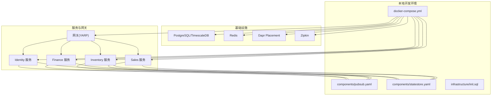
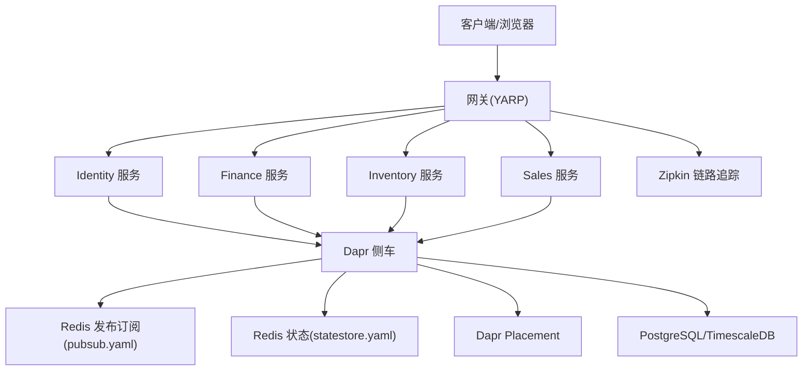
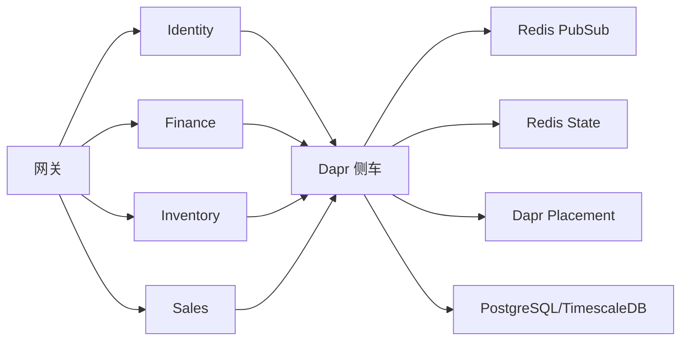

# 快速开始

<cite>
**本文引用的文件**
- [README.md](file://README.md)
- [docker-compose.yml](file://docker-compose.yml)
- [DEVELOPMENT_PLAN.md](file://DEVELOPMENT_PLAN.md)
- [src/Gateways/ErpSystem.Gateway/appsettings.json](file://src/Gateways/ErpSystem.Gateway/appsettings.json)
- [src/BuildingBlocks/ErpSystem.BuildingBlocks/DependencyInjection.cs](file://src/BuildingBlocks/ErpSystem.BuildingBlocks/DependencyInjection.cs)
- [src/Gateways/ErpSystem.Gateway/Dockerfile](file://src/Gateways/ErpSystem.Gateway/Dockerfile)
- [src/Services/Identity/ErpSystem.Identity/Dockerfile](file://src/Services/Identity/ErpSystem.Identity/Dockerfile)
- [components/pubsub.yaml](file://components/pubsub.yaml)
- [components/statestore.yaml](file://components/statestore.yaml)
- [infrastructure/init.sql](file://infrastructure/init.sql)
- [src/Services/Identity/ErpSystem.Identity/appsettings.json](file://src/Services/Identity/ErpSystem.Identity/appsettings.json)
- [src/Services/Finance/ErpSystem.Finance/appsettings.json](file://src/Services/Finance/ErpSystem.Finance/appsettings.json)
- [src/Services/Sales/ErpSystem.Sales/appsettings.json](file://src/Services/Sales/ErpSystem.Sales/appsettings.json)
</cite>

## 目录
1. [简介](#简介)
2. [项目结构](#项目结构)
3. [核心组件](#核心组件)
4. [架构总览](#架构总览)
5. [详细组件分析](#详细组件分析)
6. [依赖分析](#依赖分析)
7. [性能考虑](#性能考虑)
8. [故障排查指南](#故障排查指南)
9. [结论](#结论)
10. [附录](#附录)

## 简介
本指南面向新加入的开发者，帮助你在约30分钟内完成ERP微服务系统的本地环境准备、数据库初始化、服务启动与验证。你将学会：
- 安装与验证 .NET 10 SDK、Docker
- 使用Docker Compose一键拉起基础设施与服务
- 了解服务启动顺序与关键配置
- 通过网关访问各微服务接口
- 常见问题排查与验证方法

## 项目结构
该仓库采用“多服务、多层架构”的组织方式，核心包含：
- 多个独立的微服务（Finance、Inventory、Sales、Identity 等）
- 网关层（YARP）统一路由
- 公共基础设施（PostgreSQL/TimescaleDB、Redis、Dapr Sidecar）
- Helm/Kubernetes 部署模板与Docker Compose编排

图表来源
- [docker-compose.yml](file://docker-compose.yml#L1-L99)
- [components/pubsub.yaml](file://components/pubsub.yaml#L1-L13)
- [components/statestore.yaml](file://components/statestore.yaml#L1-L13)
- [infrastructure/init.sql](file://infrastructure/init.sql#L1-L9)

章节来源
- [README.md](file://README.md#L289-L323)
- [docker-compose.yml](file://docker-compose.yml#L1-L99)

## 核心组件
- 网关（YARP）：集中路由与反向代理，负责将请求转发至各微服务。
- 微服务：按业务域拆分，如 Finance、Inventory、Sales、Identity 等。
- 基础设施：PostgreSQL/TimescaleDB（数据库）、Redis（状态/发布订阅）、Dapr（服务间通信与可观测性）。
- 组件配置：Dapr 发布订阅与状态存储组件通过 YAML 注册。

章节来源
- [src/Gateways/ErpSystem.Gateway/appsettings.json](file://src/Gateways/ErpSystem.Gateway/appsettings.json#L1-L229)
- [components/pubsub.yaml](file://components/pubsub.yaml#L1-L13)
- [components/statestore.yaml](file://components/statestore.yaml#L1-L13)

## 架构总览
下图展示了本地开发时的典型交互：客户端通过网关访问服务，服务通过 Dapr 侧车进行服务发现、发布订阅与状态管理，并与数据库交互。

图表来源
- [src/Gateways/ErpSystem.Gateway/appsettings.json](file://src/Gateways/ErpSystem.Gateway/appsettings.json#L1-L229)
- [docker-compose.yml](file://docker-compose.yml#L1-L99)
- [components/pubsub.yaml](file://components/pubsub.yaml#L1-L13)
- [components/statestore.yaml](file://components/statestore.yaml#L1-L13)

## 详细组件分析

### 环境准备与验证
- 安装 .NET 10 SDK：确保版本满足要求，可通过命令行工具验证安装。
- 安装 Docker Desktop：启用 WSL2 后端（Windows），或对应平台版本。
- 验证安装：
  - dotnet --info
  - docker --version
  - docker compose version

章节来源
- [README.md](file://README.md#L219-L226)

### 数据库初始化
- 使用 Docker Compose 启动后，容器会自动执行初始化脚本，创建各业务库。
- 初始化脚本位置与内容：
  - [infrastructure/init.sql](file://infrastructure/init.sql#L1-L9)
- 你也可以在首次启动前手动创建数据库，或在容器内执行 SQL 脚本。

章节来源
- [docker-compose.yml](file://docker-compose.yml#L72-L84)
- [infrastructure/init.sql](file://infrastructure/init.sql#L1-L9)

### 服务启动顺序与依赖
- 启动顺序建议：
  1) 启动基础设施：postgres、redis、placement、zipkin
  2) 启动 Dapr 侧车：daprd（随服务容器或独立运行）
  3) 启动各微服务：Identity、Gateway、Finance、Inventory、Sales 等
- Compose 中已定义 depends_on，但实际生产中建议在应用层面增加健康检查与重试策略。

章节来源
- [docker-compose.yml](file://docker-compose.yml#L1-L99)
- [DEVELOPMENT_PLAN.md](file://DEVELOPMENT_PLAN.md#L26-L33)

### 网关配置与路由
- 网关通过 appsettings.json 配置路由规则与集群地址，确保与服务容器端口一致。
- 关键点：
  - 反向代理路由路径映射到各服务
  - 集群地址指向本地服务端口
- 示例参考：
  - [src/Gateways/ErpSystem.Gateway/appsettings.json](file://src/Gateways/ErpSystem.Gateway/appsettings.json#L9-L229)

章节来源
- [src/Gateways/ErpSystem.Gateway/appsettings.json](file://src/Gateways/ErpSystem.Gateway/appsettings.json#L1-L229)

### Dapr 组件注册
- 发布订阅与状态存储通过 YAML 组件注册，挂载到 daprd 容器。
- 组件示例：
  - [components/pubsub.yaml](file://components/pubsub.yaml#L1-L13)
  - [components/statestore.yaml](file://components/statestore.yaml#L1-L13)

章节来源
- [components/pubsub.yaml](file://components/pubsub.yaml#L1-L13)
- [components/statestore.yaml](file://components/statestore.yaml#L1-L13)

### Dockerfile 与镜像构建
- 网关与 Identity 服务均提供 Dockerfile，支持多阶段构建与发布。
- 参考：
  - [src/Gateways/ErpSystem.Gateway/Dockerfile](file://src/Gateways/ErpSystem.Gateway/Dockerfile#L1-L22)
  - [src/Services/Identity/ErpSystem.Identity/Dockerfile](file://src/Services/Identity/ErpSystem.Identity/Dockerfile#L1-L24)

章节来源
- [src/Gateways/ErpSystem.Gateway/Dockerfile](file://src/Gateways/ErpSystem.Gateway/Dockerfile#L1-L22)
- [src/Services/Identity/ErpSystem.Identity/Dockerfile](file://src/Services/Identity/ErpSystem.Identity/Dockerfile#L1-L24)

### 数据库连接配置
- 不同服务的数据库连接字符串配置示例：
  - Identity 服务：默认无显式连接串（使用默认值或环境变量）
    - [src/Services/Identity/ErpSystem.Identity/appsettings.json](file://src/Services/Identity/ErpSystem.Identity/appsettings.json#L1-L10)
  - Finance 服务：示例连接串
    - [src/Services/Finance/ErpSystem.Finance/appsettings.json](file://src/Services/Finance/ErpSystem.Finance/appsettings.json#L1-L12)
  - Sales 服务：示例连接串
    - [src/Services/Sales/ErpSystem.Sales/appsettings.json](file://src/Services/Sales/ErpSystem.Sales/appsettings.json#L1-L12)

章节来源
- [src/Services/Identity/ErpSystem.Identity/appsettings.json](file://src/Services/Identity/ErpSystem.Identity/appsettings.json#L1-L10)
- [src/Services/Finance/ErpSystem.Finance/appsettings.json](file://src/Services/Finance/ErpSystem.Finance/appsettings.json#L1-L12)
- [src/Services/Sales/ErpSystem.Sales/appsettings.json](file://src/Services/Sales/ErpSystem.Sales/appsettings.json#L1-L12)

### 本地开发启动流程（推荐）
- 方式一：使用 Docker Compose（最简）
  1) 在仓库根目录执行：
     - docker-compose up -d
  2) 等待所有容器启动并初始化数据库
  3) 访问网关端口查看服务可用性
- 方式二：本地直接运行（适合调试）
  1) 先启动基础设施（postgres、redis、placement、zipkin）
  2) 启动各微服务（如 Identity、Gateway、Finance、Inventory、Sales）
  3) 通过网关访问服务

章节来源
- [README.md](file://README.md#L227-L251)
- [docker-compose.yml](file://docker-compose.yml#L1-L99)

### 单个服务启动示例（以 Finance 为例）
- 在服务目录中执行 dotnet run 启动
- 若使用 Docker：
  - docker build -t erp-system/finance:latest --build-arg SERVICE_NAME=Finance .
  - docker run -d -p 5275:8080 --name finance-service erp-system/finance:latest

章节来源
- [README.md](file://README.md#L238-L241)

## 依赖分析
- 组件耦合与协作：
  - 网关依赖各服务的可达性与端口映射
  - 服务通过 Dapr 侧车与 Redis、PostgreSQL/TimescaleDB 交互
  - Dapr Placement 提供服务发现与元数据管理
- 外部依赖：
  - .NET 10 SDK
  - Docker Desktop
  - PostgreSQL/TimescaleDB
  - Redis
  - Dapr CLI/Placement

图表来源
- [src/Gateways/ErpSystem.Gateway/appsettings.json](file://src/Gateways/ErpSystem.Gateway/appsettings.json#L1-L229)
- [docker-compose.yml](file://docker-compose.yml#L1-L99)

章节来源
- [src/Gateways/ErpSystem.Gateway/appsettings.json](file://src/Gateways/ErpSystem.Gateway/appsettings.json#L1-L229)
- [docker-compose.yml](file://docker-compose.yml#L1-L99)

## 性能考虑
- 使用 Docker Compose 时，建议为数据库与缓存分配足够内存与CPU资源。
- 启动顺序与健康检查：在生产环境中为服务添加健康检查与重试策略，避免依赖未就绪导致的失败。
- 观测性：Zipkin 已内置，便于排查链路问题；可结合日志与指标进一步完善。

## 故障排查指南
- 无法访问网关或服务
  - 检查 docker-compose 端口映射是否冲突
  - 确认服务容器日志输出
  - 参考：[docker-compose.yml](file://docker-compose.yml#L1-L99)
- 数据库连接失败
  - 确认数据库初始化脚本已执行
  - 检查服务配置中的连接字符串
  - 参考：
    - [infrastructure/init.sql](file://infrastructure/init.sql#L1-L9)
    - [src/Services/Finance/ErpSystem.Finance/appsettings.json](file://src/Services/Finance/ErpSystem.Finance/appsettings.json#L1-L12)
    - [src/Services/Sales/ErpSystem.Sales/appsettings.json](file://src/Services/Sales/ErpSystem.Sales/appsettings.json#L1-L12)
- Dapr 侧车异常
  - 确认 daprd 容器与服务容器在同一网络
  - 检查 pubsub 与 statestore 组件是否正确挂载
  - 参考：
    - [docker-compose.yml](file://docker-compose.yml#L21-L28)
    - [components/pubsub.yaml](file://components/pubsub.yaml#L1-L13)
    - [components/statestore.yaml](file://components/statestore.yaml#L1-L13)
- 网关路由不生效
  - 检查 appsettings.json 中的路由与集群地址
  - 参考：[src/Gateways/ErpSystem.Gateway/appsettings.json](file://src/Gateways/ErpSystem.Gateway/appsettings.json#L1-L229)

章节来源
- [docker-compose.yml](file://docker-compose.yml#L1-L99)
- [infrastructure/init.sql](file://infrastructure/init.sql#L1-L9)
- [src/Services/Finance/ErpSystem.Finance/appsettings.json](file://src/Services/Finance/ErpSystem.Finance/appsettings.json#L1-L12)
- [src/Services/Sales/ErpSystem.Sales/appsettings.json](file://src/Services/Sales/ErpSystem.Sales/appsettings.json#L1-L12)
- [components/pubsub.yaml](file://components/pubsub.yaml#L1-L13)
- [components/statestore.yaml](file://components/statestore.yaml#L1-L13)
- [src/Gateways/ErpSystem.Gateway/appsettings.json](file://src/Gateways/ErpSystem.Gateway/appsettings.json#L1-L229)

## 结论
按照本指南，你可以在30分钟内完成环境准备、数据库初始化、服务启动与基本验证。建议在本地开发时优先使用 Docker Compose，遇到问题时结合日志与配置文件逐项排查。

## 附录

### 验证安装成功的测试步骤
- 启动 Compose 并等待初始化完成
- 通过网关访问服务（例如访问 Finance 服务的公开接口）
- 查看 Zipkin 是否有链路记录
- 检查各服务容器日志是否正常

章节来源
- [README.md](file://README.md#L227-L251)
- [docker-compose.yml](file://docker-compose.yml#L1-L99)

### 基本功能演示（概念性）
- 登录与鉴权：通过 Identity 服务获取令牌
- 财务记账：Finance 服务的总账/凭证接口
- 库存管理：Inventory 服务的出入库与盘点
- 销售订单：Sales 服务的下单与出库
- 实时看板：Analytics 服务的实时仪表盘（通过 SignalR）

章节来源
- [README.md](file://README.md#L39-L126)