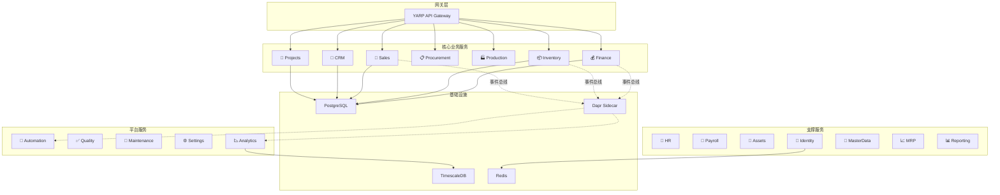
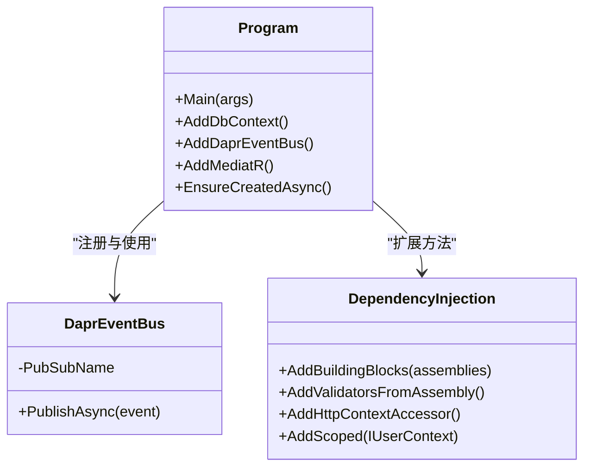
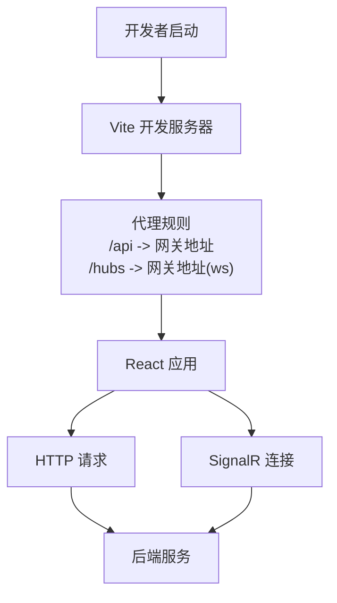
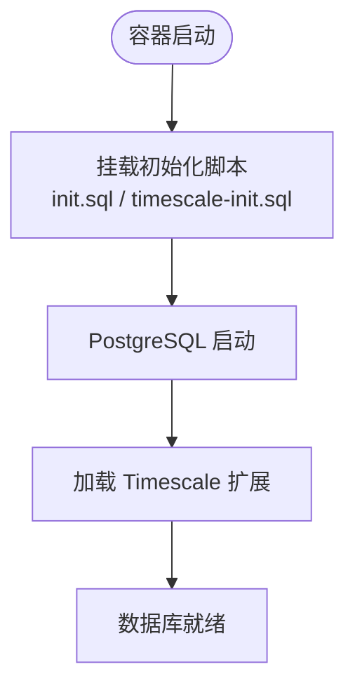
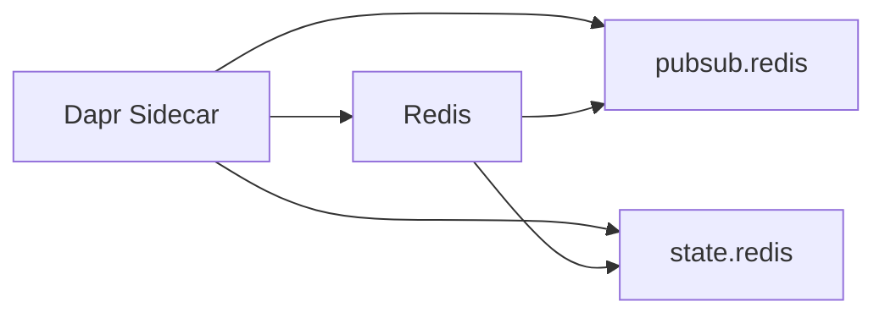
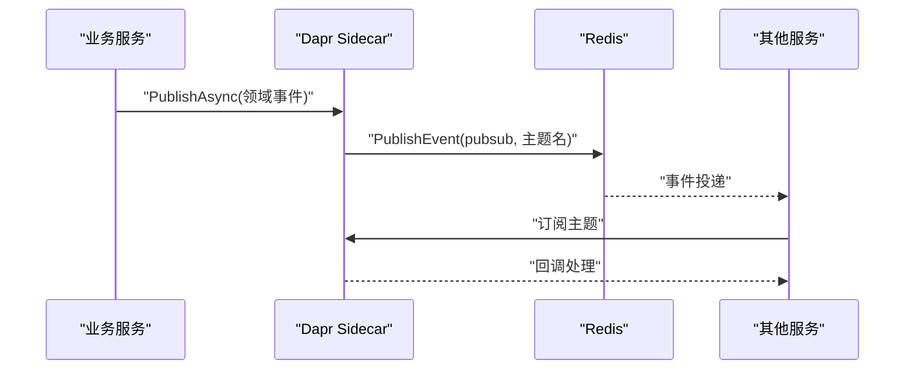
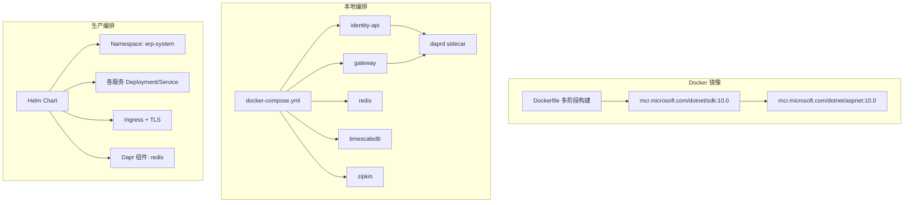
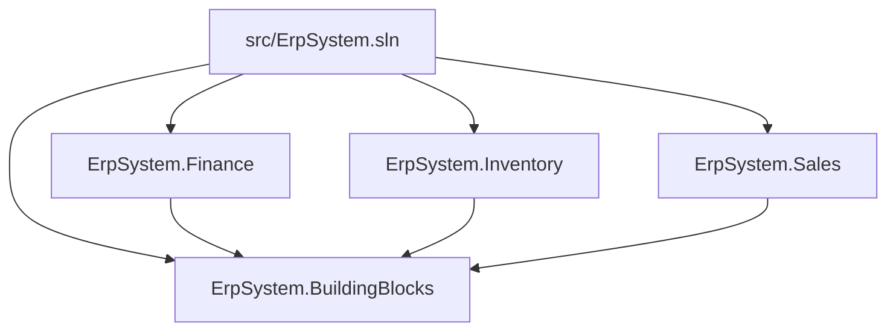

# 技术栈介绍

<cite>
**本文档引用的文件**
- [README.md](file://README.md)
- [src/ErpSystem.sln](file://src/ErpSystem.sln)
- [Dockerfile](file://Dockerfile)
- [docker-compose.yml](file://docker-compose.yml)
- [deploy/k8s/namespace.yaml](file://deploy/k8s/namespace.yaml)
- [deploy/helm/erp-system/values.yaml](file://deploy/helm/erp-system/values.yaml)
- [src/Web/ErpSystem.Web/package.json](file://src/Web/ErpSystem.Web/package.json)
- [src/Web/ErpSystem.Web/vite.config.ts](file://src/Web/ErpSystem.Web/vite.config.ts)
- [src/Web/ErpSystem.Web/tsconfig.json](file://src/Web/ErpSystem.Web/tsconfig.json)
- [src/BuildingBlocks/ErpSystem.BuildingBlocks/DependencyInjection.cs](file://src/BuildingBlocks/ErpSystem.BuildingBlocks/DependencyInjection.cs)
- [src/BuildingBlocks/ErpSystem.BuildingBlocks/EventBus/DaprEventBus.cs](file://src/BuildingBlocks/ErpSystem.BuildingBlocks/EventBus/DaprEventBus.cs)
- [src/Services/Finance/ErpSystem.Finance/Program.cs](file://src/Services/Finance/ErpSystem.Finance/Program.cs)
- [components/pubsub.yaml](file://components/pubsub.yaml)
- [components/statestore.yaml](file://components/statestore.yaml)
</cite>

## 目录
1. [引言](#引言)
2. [项目结构](#项目结构)
3. [核心组件](#核心组件)
4. [架构总览](#架构总览)
5. [详细组件分析](#详细组件分析)
6. [依赖关系分析](#依赖关系分析)
7. [性能考虑](#性能考虑)
8. [故障排除指南](#故障排除指南)
9. [结论](#结论)
10. [附录](#附录)

## 引言
本技术栈介绍面向ERP系统的核心技术选型与实现要点，覆盖后端(.NET 10、ASP.NET Core、Entity Framework Core)、前端(React、TypeScript、Vite)、数据库(PostgreSQL、TimescaleDB)、缓存(Redis)、微服务运行时(Dapr)以及容器化与编排(Kubernetes/Helm)。文档同时提供版本兼容性与升级路径建议，帮助读者快速理解并落地该云原生ERP系统。

## 项目结构
该仓库采用多项目解决方案组织，包含共享基础设施模块(BuildingBlocks)、多个业务微服务、网关、Web前端以及部署脚本。整体结构清晰地分离了领域层、应用层、基础设施层与展示层。

```mermaid
graph TB
subgraph "解决方案"
SLN["src/ErpSystem.sln"]
end
subgraph "共享内核"
BB["ErpSystem.BuildingBlocks"]
end
subgraph "网关"
GW["ErpSystem.Gateway"]
end
subgraph "核心业务服务"
FIN["ErpSystem.Finance"]
INV["ErpSystem.Inventory"]
SALES["ErpSystem.Sales"]
PROC["ErpSystem.Procurement"]
PROD["ErpSystem.Production"]
CRM["ErpSystem.CRM"]
PROJ["ErpSystem.Projects"]
end
subgraph "支撑服务"
HR["ErpSystem.HR"]
PAY["ErpSystem.Payroll"]
ASSET["ErpSystem.Assets"]
ID["ErpSystem.Identity"]
MD["ErpSystem.MasterData"]
MRP["ErpSystem.Mrp"]
RPT["ErpSystem.Reporting"]
end
subgraph "平台服务"
AUTO["ErpSystem.Automation"]
QUAL["ErpSystem.Quality"]
MAINT["ErpSystem.Maintenance"]
SET["ErpSystem.Settings"]
ANA["ErpSystem.Analytics"]
end
SLN --> BB
SLN --> GW
SLN --> FIN
SLN --> INV
SLN --> SALES
SLN --> PROC
SLN --> PROD
SLN --> CRM
SLN --> PROJ
SLN --> HR
SLN --> PAY
SLN --> ASSET
SLN --> ID
SLN --> MD
SLN --> MRP
SLN --> RPT
SLN --> AUTO
SLN --> QUAL
SLN --> MAINT
SLN --> SET
SLN --> ANA
```

**图表来源**
- [src/ErpSystem.sln](file://src/ErpSystem.sln#L1-L400)

**章节来源**
- [README.md](file://README.md#L289-L323)
- [src/ErpSystem.sln](file://src/ErpSystem.sln#L1-L400)

## 核心组件
- 后端框架：.NET 10、ASP.NET Core、Entity Framework Core
- 前端技术：React 18、TypeScript、Vite
- 数据库：PostgreSQL 16+、TimescaleDB
- 缓存：Redis
- 微服务运行时：Dapr（事件总线、状态存储）
- 容器化与编排：Docker、Kubernetes（Helm Chart）

**章节来源**
- [README.md](file://README.md#L217-L286)
- [Dockerfile](file://Dockerfile#L1-L37)
- [docker-compose.yml](file://docker-compose.yml#L1-L99)
- [deploy/helm/erp-system/values.yaml](file://deploy/helm/erp-system/values.yaml#L1-L127)

## 架构总览
系统采用微服务架构，通过YARP网关统一入口，各业务服务独立部署；事件驱动通过Dapr事件总线在服务间解耦；读写分离结合Event Sourcing与CQRS；前端通过SignalR实现实时仪表盘与通知。

**图表来源**
- [README.md](file://README.md#L130-L183)
- [src/Services/Finance/ErpSystem.Finance/Program.cs](file://src/Services/Finance/ErpSystem.Finance/Program.cs#L20-L28)
- [src/BuildingBlocks/ErpSystem.BuildingBlocks/EventBus/DaprEventBus.cs](file://src/BuildingBlocks/ErpSystem.BuildingBlocks/EventBus/DaprEventBus.cs#L1-L31)

## 详细组件分析

### 后端技术栈（.NET 10 + ASP.NET Core + EF Core）
- 运行时与SDK：使用.NET 10作为基础运行时与SDK版本，确保最新性能与安全补丁。
- Web框架：ASP.NET Core用于构建REST API与实时功能（SignalR）。
- ORM：Entity Framework Core配合Npgsql连接PostgreSQL/TimescaleDB，支持Event Store与读写库分离。
- 依赖注入：通过共享内核模块集中注册验证、日志、审计、性能监控等横切行为。
- 事件总线：集成Dapr事件总线，发布领域事件到Redis主题，实现松耦合通信。

**图表来源**
- [src/Services/Finance/ErpSystem.Finance/Program.cs](file://src/Services/Finance/ErpSystem.Finance/Program.cs#L11-L76)
- [src/BuildingBlocks/ErpSystem.BuildingBlocks/EventBus/DaprEventBus.cs](file://src/BuildingBlocks/ErpSystem.BuildingBlocks/EventBus/DaprEventBus.cs#L11-L21)
- [src/BuildingBlocks/ErpSystem.BuildingBlocks/DependencyInjection.cs](file://src/BuildingBlocks/ErpSystem.BuildingBlocks/DependencyInjection.cs#L10-L30)

**章节来源**
- [src/Services/Finance/ErpSystem.Finance/Program.cs](file://src/Services/Finance/ErpSystem.Finance/Program.cs#L1-L88)
- [src/BuildingBlocks/ErpSystem.BuildingBlocks/DependencyInjection.cs](file://src/BuildingBlocks/ErpSystem.BuildingBlocks/DependencyInjection.cs#L1-L31)
- [src/BuildingBlocks/ErpSystem.BuildingBlocks/EventBus/DaprEventBus.cs](file://src/BuildingBlocks/ErpSystem.BuildingBlocks/EventBus/DaprEventBus.cs#L1-L31)

### 前端技术栈（React + TypeScript + Vite）
- 框架与生态：React 18 + React Router DOM 7 + TailwindCSS + Framer Motion + Recharts。
- 类型安全：TypeScript严格模式，ESNext目标与模块解析策略提升开发体验。
- 构建工具：Vite提供快速开发服务器与生产构建，内置代理转发至后端API与SignalR Hub。
- 实时通信：@microsoft/signalr用于与后端实时仪表盘通信。

**图表来源**
- [src/Web/ErpSystem.Web/vite.config.ts](file://src/Web/ErpSystem.Web/vite.config.ts#L5-L22)
- [src/Web/ErpSystem.Web/package.json](file://src/Web/ErpSystem.Web/package.json#L1-L35)
- [src/Web/ErpSystem.Web/tsconfig.json](file://src/Web/ErpSystem.Web/tsconfig.json#L1-L35)

**章节来源**
- [src/Web/ErpSystem.Web/package.json](file://src/Web/ErpSystem.Web/package.json#L1-L35)
- [src/Web/ErpSystem.Web/vite.config.ts](file://src/Web/ErpSystem.Web/vite.config.ts#L1-L23)
- [src/Web/ErpSystem.Web/tsconfig.json](file://src/Web/ErpSystem.Web/tsconfig.json#L1-L35)

### 数据库技术栈（PostgreSQL + TimescaleDB）
- 关系型数据：PostgreSQL 16+作为主数据库，支持Event Store与读库。
- 时间序列：TimescaleDB用于高性能时间序列分析与实时仪表盘数据。
- 初始化：通过Docker卷挂载初始化SQL脚本，自动完成数据库与扩展准备。

**图表来源**
- [docker-compose.yml](file://docker-compose.yml#L72-L83)

**章节来源**
- [docker-compose.yml](file://docker-compose.yml#L72-L83)
- [README.md](file://README.md#L221-L226)

### 缓存方案（Redis）
- 事件总线与状态存储：Dapr组件通过Redis实现发布订阅与分布式状态管理。
- 组件配置：pubsub与statestore均指向redis:6379，无密码配置。

**图表来源**
- [components/pubsub.yaml](file://components/pubsub.yaml#L1-L13)
- [components/statestore.yaml](file://components/statestore.yaml#L1-L13)

**章节来源**
- [components/pubsub.yaml](file://components/pubsub.yaml#L1-L13)
- [components/statestore.yaml](file://components/statestore.yaml#L1-L13)

### 微服务运行时（Dapr）
- 事件总线：通过Dapr事件总线发布领域事件，主题名采用事件类型名称约定。
- Sidecar：每个服务配套Dapr sidecar，通过组件目录挂载pubsub与statestore。
- Saga与可靠性：结合Outbox模式与Dapr事件总线实现跨服务可靠通信。

**图表来源**
- [src/BuildingBlocks/ErpSystem.BuildingBlocks/EventBus/DaprEventBus.cs](file://src/BuildingBlocks/ErpSystem.BuildingBlocks/EventBus/DaprEventBus.cs#L11-L21)
- [docker-compose.yml](file://docker-compose.yml#L21-L28)

**章节来源**
- [src/BuildingBlocks/ErpSystem.BuildingBlocks/EventBus/DaprEventBus.cs](file://src/BuildingBlocks/ErpSystem.BuildingBlocks/EventBus/DaprEventBus.cs#L1-L31)
- [docker-compose.yml](file://docker-compose.yml#L21-L28)

### 容器化与编排（Docker + Kubernetes/Helm）
- 多阶段构建：基于官方.NET 10 SDK与ASP.NET 10运行时镜像，支持健康检查与轻量部署。
- 本地编排：docker-compose定义identity-api、gateway、Dapr placement、Redis、PostgreSQL/TimescaleDB与Zipkin。
- 生产编排：Helm Chart提供命名空间、服务副本数、资源限制、Ingress与Dapr组件配置。

**图表来源**
- [Dockerfile](file://Dockerfile#L1-L37)
- [docker-compose.yml](file://docker-compose.yml#L1-L99)
- [deploy/k8s/namespace.yaml](file://deploy/k8s/namespace.yaml#L1-L8)
- [deploy/helm/erp-system/values.yaml](file://deploy/helm/erp-system/values.yaml#L1-L127)

**章节来源**
- [Dockerfile](file://Dockerfile#L1-L37)
- [docker-compose.yml](file://docker-compose.yml#L1-L99)
- [deploy/k8s/namespace.yaml](file://deploy/k8s/namespace.yaml#L1-L8)
- [deploy/helm/erp-system/values.yaml](file://deploy/helm/erp-system/values.yaml#L1-L127)

## 依赖关系分析
- 解决方案层面：所有服务与网关、测试项目均在单一解决方案中管理，便于统一构建与测试。
- 共享内核：BuildingBlocks提供通用行为（验证、日志、审计、缓存、多租户、弹性与可观测性），被各服务复用。
- 事件总线：服务通过Dapr事件总线与共享内核中的IEventBus接口解耦。

**图表来源**
- [src/ErpSystem.sln](file://src/ErpSystem.sln#L1-L400)
- [src/BuildingBlocks/ErpSystem.BuildingBlocks/DependencyInjection.cs](file://src/BuildingBlocks/ErpSystem.BuildingBlocks/DependencyInjection.cs#L10-L30)

**章节来源**
- [src/ErpSystem.sln](file://src/ErpSystem.sln#L1-L400)
- [src/BuildingBlocks/ErpSystem.BuildingBlocks/DependencyInjection.cs](file://src/BuildingBlocks/ErpSystem.BuildingBlocks/DependencyInjection.cs#L1-L31)

## 性能考虑
- 数据库性能：使用TimescaleDB优化时间序列查询，PostgreSQL启用扩展与索引策略。
- 缓存策略：Redis作为事件总线与状态存储，降低数据库压力，提升响应速度。
- 容器资源：Helm values为各服务设置CPU/内存请求与限制，避免资源争抢。
- 构建优化：Vite按需打包，.NET多阶段构建减少镜像体积与启动时间。

## 故障排除指南
- 健康检查失败：确认容器健康检查端点与暴露端口一致，检查网络连通性。
- Dapr组件未加载：确认components目录挂载正确，pubsub/statestore指向的Redis可达。
- 数据库连接异常：检查连接字符串、容器网络与数据库初始化脚本是否执行成功。
- 前端无法访问后端：确认Vite代理配置与网关端口一致，WebSocket代理开启。

**章节来源**
- [Dockerfile](file://Dockerfile#L31-L36)
- [docker-compose.yml](file://docker-compose.yml#L24-L28)
- [docker-compose.yml](file://docker-compose.yml#L10-L16)
- [src/Web/ErpSystem.Web/vite.config.ts](file://src/Web/ErpSystem.Web/vite.config.ts#L8-L20)

## 结论
该ERP系统以.NET 10为核心，结合ASP.NET Core、EF Core、Dapr、React、TypeScript与Vite，构建出高可扩展、可观测且云原生的企业级解决方案。通过PostgreSQL/TimescaleDB与Redis提供高性能的数据与缓存能力，借助Docker与Kubernetes/Helm实现标准化交付与运维。整体技术栈成熟稳定，具备良好的升级与演进路径。

## 附录

### 版本兼容性与升级路径
- .NET 10：建议在CI/CD中锁定SDK与运行时版本，确保镜像与本地环境一致。
- PostgreSQL 16+：升级时先进行备份与迁移脚本验证，再滚动更新容器。
- TimescaleDB：与PostgreSQL主版本保持兼容，升级前评估扩展与查询性能影响。
- Redis：采用无密码配置用于开发环境，生产环境建议启用认证与TLS。
- Dapr：Sidecar版本与Placement服务版本需匹配，升级时注意组件配置一致性。
- Kubernetes/Helm：Chart版本随功能迭代更新，升级时使用helm diff或逐项对比values.yaml。

**章节来源**
- [README.md](file://README.md#L219-L226)
- [docker-compose.yml](file://docker-compose.yml#L57-L63)
- [deploy/helm/erp-system/values.yaml](file://deploy/helm/erp-system/values.yaml#L117-L123)