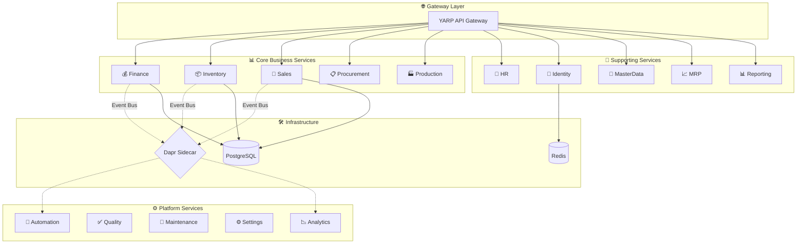

# 🏢 Enterprise ERP System

<div align="center">

[](https://dotnet.microsoft.com/)
[](/)
[](/)
[](LICENSE)

[](https://microservices.io/)
[](https://martinfowler.com/eaaDev/EventSourcing.html)
[](https://martinfowler.com/bliki/DomainDrivenDesign.html)
[](https://kubernetes.io/)

**🚀 A production-ready, cloud-native ERP system built with .NET 10, Domain-Driven Design, and enterprise-grade patterns**

[Quick Start](#-quick-start) • [Features](#-features) • [Architecture](#-architecture) • [Deployment](#-deployment) • [Contributing](#-contributing)

---

### 💡 Why Another ERP?

| ❌ Most Open-Source ERPs | ✅ This Project |
|--------------------------|-----------------|
| Legacy monoliths | **15+ Microservices** with independent deployment |
| Outdated tech stacks | **.NET 10**, Dapr, Kubernetes-ready |
| Oversimplified demos | **Real-world complexity**: Event Sourcing, MRP, Multi-tenancy |
| Vendor lock-in | **100% Open Source**, MIT Licensed |

</div>

---

## ✨ Features

<table>
<tr>
<td width="50%">

### 💰 Finance & Accounting
- ✅ Double-Entry General Ledger
- ✅ Chart of Accounts (hierarchical)
- ✅ Trial Balance & Financial Reports
- ✅ Accounts Payable / Receivable
- ✅ Auto Journal Entries from Operations

</td>
<td width="50%">

### 📦 Supply Chain
- ✅ Multi-Warehouse Inventory
- ✅ Real-time Stock Reservations
- ✅ Purchase Order Lifecycle
- ✅ Goods Receipt & Quality Control
- ✅ Material Requirements Planning (MRP)

</td>
</tr>
<tr>
<td>

### 🛒 Sales & CRM
- ✅ Order-to-Cash Workflow
- ✅ Customer Management
- ✅ Shipment Tracking
- ✅ Invoice Generation
- ✅ Sales Analytics Dashboard

</td>
<td>

### 🏭 Manufacturing
- ✅ Production Orders
- ✅ Bill of Materials (BOM)
- ✅ Work-in-Progress Tracking
- ✅ Production Efficiency Reports
- ✅ Asset Maintenance

</td>
</tr>
<tr>
<td>

### 👥 Human Resources
- ✅ Employee Lifecycle
- ✅ Organization Structure
- ✅ Identity & Access Control (RBAC)
- ✅ Role-based Permissions

</td>
<td>

### 📊 BI & Reporting
- ✅ Executive Dashboard
- ✅ Sales Trend Analysis
- ✅ Inventory Valuation Reports
- ✅ Financial Summary (P&L)
- ✅ Production Efficiency Metrics

</td>
</tr>
</table>

---

## 🏗️ Architecture



### 🎨 Design Patterns

| Pattern | Implementation |
|---------|---------------|
| **Event Sourcing** | Complete audit trail, temporal queries |
| **CQRS** | Separate read/write models with MediatR |
| **Domain-Driven Design** | Aggregates, Value Objects, Domain Events |
| **Saga Pattern** | Distributed transactions via Dapr |
| **Outbox Pattern** | Reliable event publishing with EF Core |
| **Specification Pattern** | Reusable query logic |
| **Result Pattern** | Railway-oriented error handling |

### 🛡️ Enterprise Building Blocks

Our shared kernel provides **production-ready** cross-cutting concerns:

```
ErpSystem.BuildingBlocks/
├── Behaviors/          # MediatR pipeline (Validation, Logging, Idempotency, Audit, Performance)
├── CQRS/               # ICommand, IQuery, Handler abstractions
├── Common/             # Result<T> pattern, Error types
├── Domain/             # Specifications, Domain Event Dispatcher
├── Outbox/             # Transactional Outbox with EF Core
├── MultiTenancy/       # SaaS tenant isolation (query filters + interceptors)
├── Resilience/         # Polly V8 (Retry, Circuit Breaker, Timeout)
├── Caching/            # Distributed cache extensions (GetOrSet)
├── Auditing/           # Automatic audit logging
└── Middleware/         # CorrelationId, RequestLogging, GlobalException
```

---

## 🚀 Quick Start

### Prerequisites

| Tool | Version |
|------|---------|
| [.NET SDK](https://dotnet.microsoft.com/download/dotnet/10.0) | 10.0+ |
| [Docker](https://www.docker.com/products/docker-desktop) | Latest |
| [PostgreSQL](https://www.postgresql.org/download/) | 16+ |

### Run Locally

```bash
# 1. Clone
git clone https://github.com/Edison0621/erp-microservice.git
cd erp-microservice

# 2. Build & Test
dotnet build src/ErpSystem.sln
dotnet test src/ErpSystem.sln

# 3. Run a service (e.g., Finance)
cd src/Services/Finance/ErpSystem.Finance
dotnet run
```

### Run with Docker

```bash
# Build all images
docker build -t erp-system/finance:latest --build-arg SERVICE_NAME=Finance .

# Or use Docker Compose
docker-compose up -d
```

---

## ☸️ Deployment

### Kubernetes with Helm

```bash
# Install the chart
helm install erp-system deploy/helm/erp-system \
  --set postgresql.auth.password=your-secure-password \
  --set ingress.host=erp.yourcompany.com

# Verify
kubectl get pods -n erp-system
```

### Deployment Stack

```
deploy/
├── k8s/                        # Raw Kubernetes manifests
│   ├── namespace.yaml
│   ├── configmap.yaml
│   ├── secrets.yaml
│   ├── ingress.yaml
│   └── services/*.yaml         # Per-service deployments
└── helm/erp-system/            # Helm Chart
    ├── Chart.yaml
    ├── values.yaml
    └── templates/
```

📖 **Full Guide**: [docs/deployment.md](docs/deployment.md)

---

## 📁 Project Structure

```
erp-microservice/
├── src/
│   ├── BuildingBlocks/             # 🧱 Shared kernel (enterprise patterns)
│   ├── Gateways/ErpSystem.Gateway/ # 🌐 YARP reverse proxy
│   ├── Services/
│   │   ├── Finance/                # 💰 General Ledger, AP/AR
│   │   ├── Inventory/              # 📦 Stock management
│   │   ├── Sales/                  # 🛒 Order processing
│   │   ├── Procurement/            # 📋 Purchase orders
│   │   ├── Production/             # 🏭 Manufacturing
│   │   ├── HR/                     # 👥 Employee management
│   │   ├── Identity/               # 🔐 Auth & RBAC
│   │   ├── MasterData/             # 📁 Materials, Customers, Suppliers
│   │   ├── Mrp/                    # 📈 Material Requirements Planning
│   │   ├── Reporting/              # 📊 BI Dashboard & Reports
│   │   ├── Quality/                # ✅ QC & Inspection
│   │   ├── Analytics/              # 📉 Time-series analytics
│   │   ├── Automation/             # 🤖 Workflow engine
│   │   ├── Maintenance/            # 🔧 Asset maintenance
│   │   └── Settings/               # ⚙️ System configuration
│   └── Web/ErpSystem.Web/          # 🖥️ React frontend
├── tests/
│   └── ErpSystem.IntegrationTests/ # ✅ 21 passing tests
└── deploy/
    ├── k8s/                        # Kubernetes manifests
    └── helm/erp-system/            # Helm chart
```

---

## 🧪 Testing

```bash
# Run all tests
dotnet test src/ErpSystem.sln

# Run specific module
dotnet test --filter "GLTests"

# With coverage
dotnet test /p:CollectCoverage=true
```

**Current Status**: ✅ **21 tests passing**

---

## 🛣️ Roadmap

| Phase | Status | Description |
|-------|--------|-------------|
| Phase 1 | ✅ Complete | Core Infrastructure & Event Sourcing |
| Phase 2 | ✅ Complete | Finance Module (General Ledger) |
| Phase 3 | ✅ Complete | Inventory & Procurement |
| Phase 4 | ✅ Complete | MRP (Material Requirements Planning) |
| Phase 5 | ✅ Complete | Enterprise BuildingBlocks |
| Phase 6 | ✅ Complete | Reporting & BI Dashboard |
| Phase 7 | ✅ Complete | Kubernetes & Helm Charts |
| Phase 8 | 🔄 Planned | GraphQL API Layer |
| Phase 9 | 🔄 Planned | Real-time Notifications (SignalR) |

---

## 🤝 Contributing

We welcome contributions! See [CONTRIBUTING.md](CONTRIBUTING.md) for guidelines.

```bash
# Fork → Clone → Branch → Code → Test → PR
git checkout -b feature/amazing-feature
git commit -m "feat: add amazing feature"
git push origin feature/amazing-feature
```

---

## 📄 License

This project is licensed under the **MIT License** - see [LICENSE](LICENSE) for details.

---

<div align="center">

### ⭐ Star this repo if you find it useful!

**Built with ❤️ using .NET 10, DDD, and modern cloud-native patterns**

[Report Bug](https://github.com/Edison0621/erp-microservice/issues) · [Request Feature](https://github.com/Edison0621/erp-microservice/issues) · [Discussions](https://github.com/Edison0621/erp-microservice/discussions)

</div>
