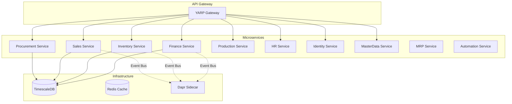

# 🏢 Enterprise ERP System

<div align="center">

[](https://dotnet.microsoft.com/)
[](https://martinfowler.com/eaaDev/EventSourcing.html)
[](https://microservices.io/)
[](LICENSE)

**A production-ready, cloud-native ERP system built with modern .NET and DDD principles**

[Features](#-key-features) • [Architecture](#-architecture) • [Quick Start](#-quick-start) • [Documentation](#-documentation) • [Contributing](#-contributing)

</div>

---

## 🎯 Why This Project?

Most open-source ERP systems are either:
- **Legacy monoliths** with outdated tech stacks
- **Over-simplified demos** that don't handle real-world complexity
- **Proprietary** with vendor lock-in

**This project is different.** It's a **fully functional, enterprise-grade ERP** that demonstrates:
- ✅ **Event Sourcing & CQRS** for complete audit trails
- ✅ **Domain-Driven Design** for complex business logic
- ✅ **Microservices** with independent deployment
- ✅ **Cloud-native** patterns (Dapr, Docker, Kubernetes-ready)
- ✅ **Financial Integrity** with double-entry accounting

## ✨ Key Features

### 📊 **General Ledger (Finance)**
- **Chart of Accounts** with hierarchical structure
- **Double-Entry Bookkeeping** with strict validation
- **Trial Balance** and financial reporting
- **Automatic Journal Entries** from operational transactions

### 📦 **Supply Chain Management**
- Multi-warehouse inventory tracking
- Real-time stock reservations
- Procurement lifecycle (PO → Goods Receipt)
- Production planning with BOM support

### 💼 **Sales & CRM**
- Order-to-Cash workflow
- Customer management
- Shipment tracking
- Invoice generation

### 👥 **Human Resources**
- Employee lifecycle management
- Organization structure
- Identity & Access Control (RBAC)

### 🏭 **Manufacturing**
- Production orders
- Material requirements
- Work-in-progress tracking

### 🤖 **Intelligent Automation (NEW in v2.0)**
- **Real-time Cost Calculation** - Moving average cost with instant updates
- **Smart MRP** - Automatic reordering rules and procurement suggestions
- **Workflow Automation** - Event-driven rules engine (email, webhooks, notifications)
- **Time-series Analytics** - TimescaleDB for inventory and cost trend analysis

## 🏗️ Architecture



### 🎨 Design Patterns

| Pattern | Purpose |
|---------|---------|
| **Event Sourcing** | Complete audit trail, temporal queries |
| **CQRS** | Optimized read/write models |
| **Domain-Driven Design** | Rich domain models, ubiquitous language |
| **Saga Pattern** | Distributed transactions across services |
| **Outbox Pattern** | Reliable event publishing |
| **Specification Pattern** | Encapsulated, reusable query logic |
| **Result Pattern** | Functional error handling (Railway Oriented) |

### 🛡️ Enterprise Building Blocks

The shared kernel (`ErpSystem.BuildingBlocks`) provides production-ready cross-cutting concerns:

| Component | Description |
|-----------|-------------|
| **IdempotencyBehavior** | Prevents duplicate command execution in distributed systems |
| **ValidationBehavior** | Auto-validates commands with FluentValidation |
| **AuditBehavior** | Automatic audit logging for compliance |
| **PerformanceBehavior** | Slow request detection and logging |
| **Transactional Outbox** | Guarantees reliable message delivery |
| **Multi-tenancy** | SaaS-ready tenant isolation with EF Core query filters |
| **Resilience Policies** | Polly V8 retry, circuit breaker, timeout pipelines |
| **Domain Event Dispatcher** | Auto-publishes aggregate domain events after SaveChanges |
| **UserContext** | Strongly-typed access to current user identity |
| **Cache Extensions** | GetOrSet pattern for distributed caching |

## 🚀 Quick Start

### Prerequisites
- [.NET 10 SDK](https://dotnet.microsoft.com/download/dotnet/10.0)
- [Docker Desktop](https://www.docker.com/products/docker-desktop)
- [PostgreSQL 16+](https://www.postgresql.org/download/)

### Run Locally

```bash
# Clone the repository
git clone https://github.com/yourusername/erp-system.git
cd erp-system

# Start infrastructure
docker-compose up -d

# Run all services
dotnet build
dotnet test

# Start individual services
cd src/Services/Finance/ErpSystem.Finance
dotnet run
```

### Using Docker

```bash
# Build all services
docker-compose -f docker-compose.yml build

# Start the entire system
docker-compose up
```

## 📁 Project Structure

```
ErpSystem/
├── src/
│   ├── BuildingBlocks/          # Enterprise shared kernel
│   │   ├── Auditing/            # Audit logging infrastructure
│   │   ├── Behaviors/           # MediatR pipeline behaviors
│   │   ├── Caching/             # Distributed cache extensions
│   │   ├── Common/              # Result pattern, Error types
│   │   ├── CQRS/                # Command/Query abstractions
│   │   ├── Domain/              # Specifications, Event Dispatcher
│   │   ├── Middleware/          # Enterprise HTTP middleware
│   │   ├── MultiTenancy/        # SaaS tenant isolation
│   │   ├── Outbox/              # Transactional outbox pattern
│   │   └── Resilience/          # Polly V8 policies
│   ├── Services/
│   │   ├── Finance/             # GL, AP/AR, Invoicing
│   │   ├── Inventory/           # Stock management
│   │   ├── Sales/               # Order processing
│   │   ├── Procurement/         # Purchase orders
│   │   ├── Production/          # Manufacturing
│   │   ├── HR/                  # Employee management
│   │   ├── Identity/            # Authentication & RBAC
│   │   ├── MasterData/          # Materials, Customers, Suppliers
│   │   ├── Quality/             # QC and inspection
│   │   ├── Mrp/                 # Material Requirements Planning
│   │   ├── Analytics/           # Time-series analytics
│   │   ├── Automation/          # Workflow automation engine
│   │   ├── Maintenance/         # Asset maintenance
│   │   └── Settings/            # System configuration
│   ├── Gateways/
│   │   └── ErpSystem.Gateway/   # YARP reverse proxy
│   └── Web/
│       └── ErpSystem.Web/       # React frontend
└── tests/
    └── ErpSystem.IntegrationTests/
```

## 🧪 Testing

```bash
# Run all tests
dotnet test

# Run specific test suite
dotnet test --filter GLTests

# Generate coverage report
dotnet test /p:CollectCoverage=true
```

## 📚 Documentation

- [Architecture Overview](docs/architecture.md)
- [Domain Models](docs/domain-models.md)
- [API Reference](docs/api-reference.md)
- [Deployment Guide](docs/deployment.md)

## 🛣️ Roadmap

- [x] **Phase 1**: Core Infrastructure & Event Sourcing
- [x] **Phase 2**: Finance Module (General Ledger)
- [x] **Phase 3**: Inventory & Procurement
- [x] **Phase 4**: MRP (Material Requirements Planning)
- [x] **Phase 5**: Enterprise BuildingBlocks (Idempotency, Outbox, Audit, Multi-tenancy)
- [x] **Phase 6**: Advanced Reporting & BI Dashboard
- [x] **Phase 7**: Kubernetes Deployment & Helm Charts

## 🤝 Contributing

We welcome contributions! Please see our [Contributing Guide](CONTRIBUTING.md) for details.

### Development Workflow
1. Fork the repository
2. Create a feature branch (`git checkout -b feature/amazing-feature`)
3. Commit your changes (`git commit -m 'Add amazing feature'`)
4. Push to the branch (`git push origin feature/amazing-feature`)
5. Open a Pull Request

## 📄 License

This project is licensed under the MIT License - see the [LICENSE](LICENSE) file for details.

## 🌟 Star History

[](https://star-history.com/#yourusername/erp-system&Date)

## 💬 Community

- 💬 [Discussions](https://github.com/yourusername/erp-system/discussions)
- 🐛 [Issues](https://github.com/yourusername/erp-system/issues)
- 📧 Email: your.email@example.com

---

<div align="center">

**Built with ❤️ using .NET 10 and modern software engineering practices**

[⬆ back to top](#-enterprise-erp-system)

</div>
