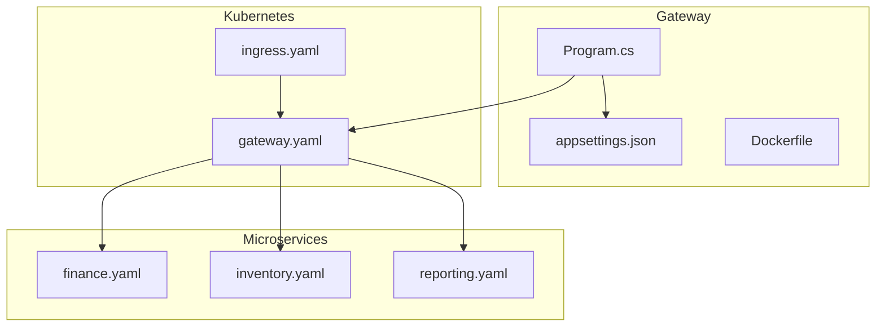
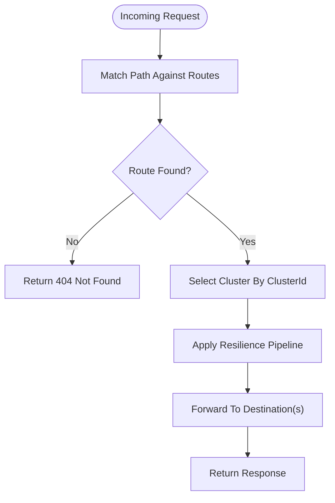
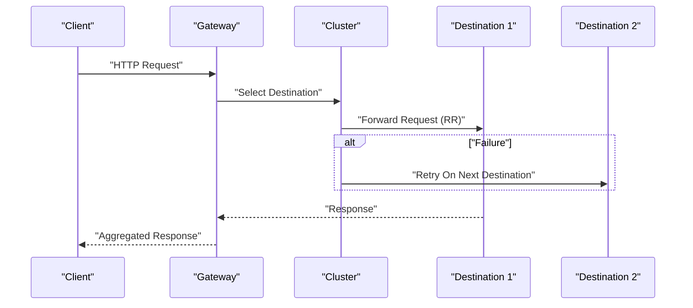
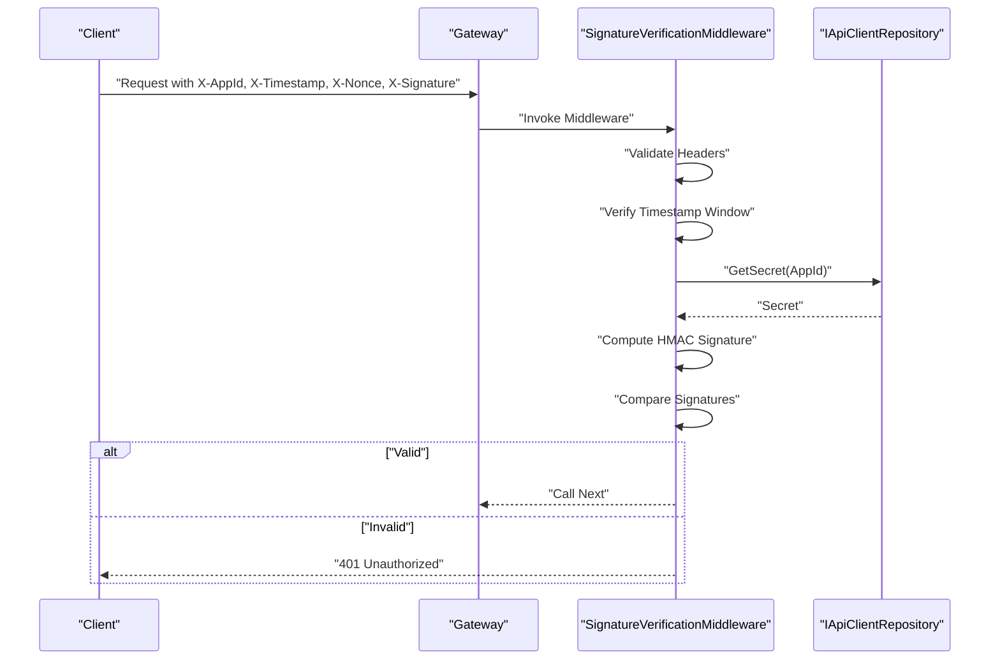
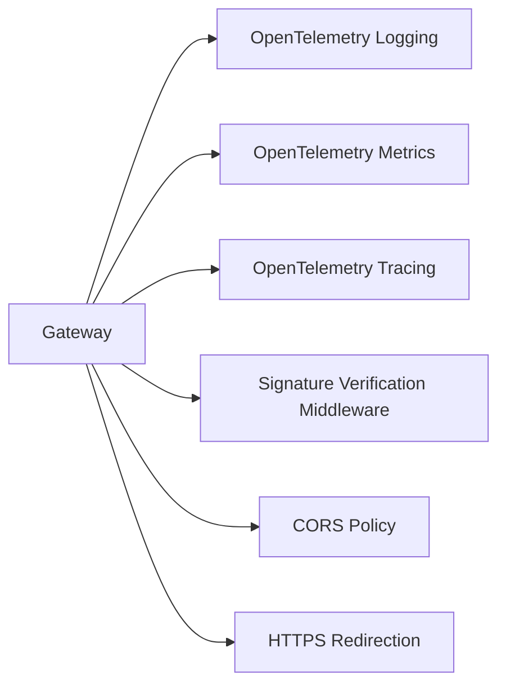
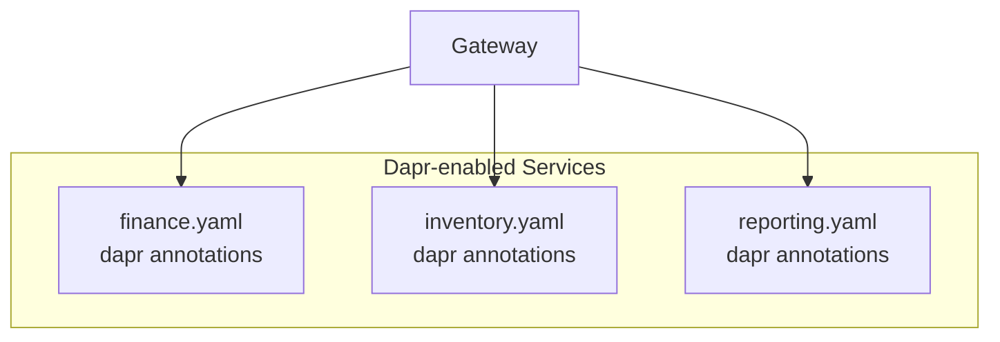
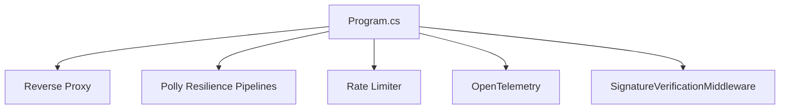

# API Gateway

<cite>
**Referenced Files in This Document**
- [Program.cs](file://src/Gateways/ErpSystem.Gateway/Program.cs)
- [appsettings.json](file://src/Gateways/ErpSystem.Gateway/appsettings.json)
- [appsettings.Development.json](file://src/Gateways/ErpSystem.Gateway/appsettings.Development.json)
- [Dockerfile](file://src/Gateways/ErpSystem.Gateway/Dockerfile)
- [ErpSystem.Gateway.http](file://src/Gateways/ErpSystem.Gateway/ErpSystem.Gateway.http)
- [SignatureVerificationMiddleware.cs](file://src/BuildingBlocks/ErpSystem.BuildingBlocks/Auth/SignatureVerificationMiddleware.cs)
- [AuthExtensions.cs](file://src/BuildingBlocks/ErpSystem.BuildingBlocks/Auth/AuthExtensions.cs)
- [IUserContext.cs](file://src/BuildingBlocks/ErpSystem.BuildingBlocks/Auth/IUserContext.cs)
- [UserContext.cs](file://src/BuildingBlocks/ErpSystem.BuildingBlocks/Auth/UserContext.cs)
- [Middlewares.cs](file://src/BuildingBlocks/ErpSystem.BuildingBlocks/Middleware/Middlewares.cs)
- [ObservabilityExtensions.cs](file://src/BuildingBlocks/ErpSystem.BuildingBlocks/Observability/ObservabilityExtensions.cs)
- [gateway.yaml](file://deploy/k8s/services/gateway.yaml)
- [ingress.yaml](file://deploy/k8s/ingress.yaml)
- [values.yaml](file://deploy/helm/erp-system/values.yaml)
- [finance.yaml](file://deploy/k8s/services/finance.yaml)
- [inventory.yaml](file://deploy/k8s/services/inventory.yaml)
- [reporting.yaml](file://deploy/k8s/services/reporting.yaml)
</cite>

## Table of Contents
1. [Introduction](#introduction)
2. [Project Structure](#project-structure)
3. [Core Components](#core-components)
4. [Architecture Overview](#architecture-overview)
5. [Detailed Component Analysis](#detailed-component-analysis)
6. [Dependency Analysis](#dependency-analysis)
7. [Performance Considerations](#performance-considerations)
8. [Troubleshooting Guide](#troubleshooting-guide)
9. [Conclusion](#conclusion)
10. [Appendices](#appendices)

## Introduction
This document describes the ERP system gateway service, the central API entry point that routes requests to individual microservices. It covers routing patterns, load balancing, service discovery integration, authentication enforcement, rate limiting, request transformation capabilities, and cross-cutting concerns such as logging, monitoring, and security. It also documents API versioning at the gateway level and integration with the Dapr service mesh.

## Project Structure
The gateway is implemented as an ASP.NET Core application using the reverse proxy middleware. Configuration defines routes and clusters for each microservice, while Kubernetes manifests define deployment, service exposure, and ingress routing. The gateway integrates with Dapr-enabled services and supports observability via OpenTelemetry.

**Diagram sources**
- [Program.cs](file://src/Gateways/ErpSystem.Gateway/Program.cs#L1-L107)
- [appsettings.json](file://src/Gateways/ErpSystem.Gateway/appsettings.json#L1-L229)
- [Dockerfile](file://src/Gateways/ErpSystem.Gateway/Dockerfile#L1-L22)
- [gateway.yaml](file://deploy/k8s/services/gateway.yaml#L1-L60)
- [ingress.yaml](file://deploy/k8s/ingress.yaml#L1-L37)
- [finance.yaml](file://deploy/k8s/services/finance.yaml#L1-L65)
- [inventory.yaml](file://deploy/k8s/services/inventory.yaml#L1-L65)
- [reporting.yaml](file://deploy/k8s/services/reporting.yaml#L1-L63)

**Section sources**
- [Program.cs](file://src/Gateways/ErpSystem.Gateway/Program.cs#L1-L107)
- [appsettings.json](file://src/Gateways/ErpSystem.Gateway/appsettings.json#L1-L229)
- [Dockerfile](file://src/Gateways/ErpSystem.Gateway/Dockerfile#L1-L22)
- [gateway.yaml](file://deploy/k8s/services/gateway.yaml#L1-L60)
- [ingress.yaml](file://deploy/k8s/ingress.yaml#L1-L37)

## Core Components
- Reverse Proxy Routing: Routes incoming requests to configured clusters based on path prefixes. Versioned routes under /api/v1/<service> forward to respective clusters.
- Resilience Policies: Standardized retry, circuit breaker, and timeout policies applied to outbound HTTP calls.
- Rate Limiting: Configured to reject excessive requests with 429 Too Many Requests.
- Health Checks: Exposed at /health for probes and operational monitoring.
- CORS: Enabled with permissive defaults for development.
- Observability: OpenTelemetry integration for logging, metrics, and tracing.
- Authentication: Signature verification middleware enforces client authentication via custom headers and HMAC signatures.

**Section sources**
- [Program.cs](file://src/Gateways/ErpSystem.Gateway/Program.cs#L11-L80)
- [appsettings.json](file://src/Gateways/ErpSystem.Gateway/appsettings.json#L9-L113)
- [ObservabilityExtensions.cs](file://src/BuildingBlocks/ErpSystem.BuildingBlocks/Observability/ObservabilityExtensions.cs#L10-L42)
- [SignatureVerificationMiddleware.cs](file://src/BuildingBlocks/ErpSystem.BuildingBlocks/Auth/SignatureVerificationMiddleware.cs#L14-L76)

## Architecture Overview
The gateway acts as the single entry point for clients. Requests are matched against versioned routes and forwarded to appropriate clusters. Each cluster resolves to one or more destinations (microservices). The gateway applies resilience, rate limiting, and authentication before forwarding. Observability is integrated via OpenTelemetry.

```mermaid
graph TB
Client["Client"] --> Ingress["Ingress (Nginx)"]
Ingress --> GW["Gateway (ASP.NET Core Reverse Proxy)"]
GW --> RP["Reverse Proxy Middleware"]
RP --> R1["Route: /api/v1/identity/* -> identity-cluster"]
RP --> R2["Route: /api/v1/masterdata/* -> masterdata-cluster"]
RP --> R3["Route: /api/v1/finance/* -> finance-cluster"]
RP --> R4["Route: /api/v1/procurement/* -> procurement-cluster"]
RP --> R5["Route: /api/v1/inventory/* -> inventory-cluster"]
RP --> R6["Route: /api/v1/sales/* -> sales-cluster"]
RP --> R7["Route: /api/v1/production/* -> production-cluster"]
RP --> R8["Route: /api/v1/hr/* -> hr-cluster"]
RP --> R9["Route: /api/v1/mrp/* -> mrp-cluster"]
RP --> R10["Route: /api/v1/automation/* -> automation-cluster"]
RP --> R11["Route: /api/v1/analytics/* -> analytics-cluster"]
RP --> R12["Route: /hubs/analytics/* -> analytics-cluster"]
RP --> R13["Route: /api/v1/settings/* -> settings-cluster"]
RP --> R14["Route: /api/v1/crm/* -> crm-cluster"]
RP --> R15["Route: /api/v1/projects/* -> projects-cluster"]
RP --> R16["Route: /api/v1/payroll/* -> payroll-cluster"]
RP --> R17["Route: /api/v1/assets/* -> assets-cluster"]
subgraph "Clusters"
C1["identity-cluster"]
C2["masterdata-cluster"]
C3["finance-cluster"]
C4["procurement-cluster"]
C5["inventory-cluster"]
C6["sales-cluster"]
C7["production-cluster"]
C8["hr-cluster"]
C9["mrp-cluster"]
C10["automation-cluster"]
C11["analytics-cluster"]
C12["settings-cluster"]
C13["crm-cluster"]
C14["projects-cluster"]
C15["payroll-cluster"]
C16["assets-cluster"]
end
R1 -.-> C1
R2 -.-> C2
R3 -.-> C3
R4 -.-> C4
R5 -.-> C5
R6 -.-> C6
R7 -.-> C7
R8 -.-> C8
R9 -.-> C9
R10 -.-> C10
R11 -.-> C11
R12 -.-> C11
R13 -.-> C12
R14 -.-> C13
R15 -.-> C14
R16 -.-> C15
R17 -.-> C16
subgraph "Destinations"
D1["identity-service"]
D2["masterdata-service"]
D3["finance-service"]
D4["procurement-service"]
D5["inventory-service"]
D6["sales-service"]
D7["production-service"]
D8["hr-service"]
D9["mrp-service"]
D10["automation-service"]
D11["analytics-service"]
D12["settings-service"]
D13["crm-service"]
D14["projects-service"]
D15["payroll-service"]
D16["assets-service"]
end
C1 --> D1
C2 --> D2
C3 --> D3
C4 --> D4
C5 --> D5
C6 --> D6
C7 --> D7
C8 --> D8
C9 --> D9
C10 --> D10
C11 --> D11
C12 --> D12
C13 --> D13
C14 --> D14
C15 --> D15
C16 --> D16
```

**Diagram sources**
- [appsettings.json](file://src/Gateways/ErpSystem.Gateway/appsettings.json#L9-L227)
- [ingress.yaml](file://deploy/k8s/ingress.yaml#L12-L22)
- [finance.yaml](file://deploy/k8s/services/finance.yaml#L20-L22)
- [inventory.yaml](file://deploy/k8s/services/inventory.yaml#L20-L22)

## Detailed Component Analysis

### Reverse Proxy Routing and API Versioning
- Versioned Routes: All microservice endpoints are exposed under /api/v1/<service> with catch-all remainder capture to preserve subpaths.
- Clusters: Each route maps to a named cluster containing one or more destinations.
- Destinations: Currently configured with static addresses for local development; service discovery is available for future integration.

**Diagram sources**
- [appsettings.json](file://src/Gateways/ErpSystem.Gateway/appsettings.json#L9-L113)
- [Program.cs](file://src/Gateways/ErpSystem.Gateway/Program.cs#L22-L24)

**Section sources**
- [appsettings.json](file://src/Gateways/ErpSystem.Gateway/appsettings.json#L9-L227)
- [Program.cs](file://src/Gateways/ErpSystem.Gateway/Program.cs#L22-L24)

### Load Balancing Mechanisms
- Round-Robin Load Balancing: The reverse proxy forwards requests to multiple destinations within a cluster using built-in load balancing. Multiple destinations can be defined per cluster for redundancy and scaling.
- Horizontal Scaling: Kubernetes deployments specify replica counts for gateway and services to distribute traffic.

**Diagram sources**
- [appsettings.json](file://src/Gateways/ErpSystem.Gateway/appsettings.json#L114-L227)
- [gateway.yaml](file://deploy/k8s/services/gateway.yaml#L10-L10)

**Section sources**
- [appsettings.json](file://src/Gateways/ErpSystem.Gateway/appsettings.json#L114-L227)
- [gateway.yaml](file://deploy/k8s/services/gateway.yaml#L10-L10)

### Service Discovery Integration
- Current State: Static destination addresses are configured in JSON. Service discovery resolver is present in code comments indicating potential future integration.
- Recommended Approach: Enable service discovery resolver to dynamically resolve service endpoints, enabling seamless scaling and zero-downtime deployments.

**Section sources**
- [Program.cs](file://src/Gateways/ErpSystem.Gateway/Program.cs#L24-L24)
- [appsettings.json](file://src/Gateways/ErpSystem.Gateway/appsettings.json#L114-L227)

### Authentication Enforcement
- Signature Verification Middleware: Validates requests using custom headers (X-AppId, X-Timestamp, X-Nonce, X-Signature) and HMAC-SHA256 signatures against registered client secrets.
- Header Requirements: Missing or invalid headers result in 401 Unauthorized responses.
- Timestamp Validation: Requests outside a five-minute window are rejected.
- Secret Retrieval: Requires an implementation of IApiClientRepository to fetch client secrets.

**Diagram sources**
- [SignatureVerificationMiddleware.cs](file://src/BuildingBlocks/ErpSystem.BuildingBlocks/Auth/SignatureVerificationMiddleware.cs#L14-L76)
- [AuthExtensions.cs](file://src/BuildingBlocks/ErpSystem.BuildingBlocks/Auth/AuthExtensions.cs#L8-L17)

**Section sources**
- [SignatureVerificationMiddleware.cs](file://src/BuildingBlocks/ErpSystem.BuildingBlocks/Auth/SignatureVerificationMiddleware.cs#L14-L76)
- [AuthExtensions.cs](file://src/BuildingBlocks/ErpSystem.BuildingBlocks/Auth/AuthExtensions.cs#L8-L17)

### Rate Limiting
- Configuration: Rate limiter is registered with a rejection status code of 429 Too Many Requests.
- Purpose: Protects backend services from overload by limiting concurrent or bursty requests.

**Section sources**
- [Program.cs](file://src/Gateways/ErpSystem.Gateway/Program.cs#L61-L64)

### Request Transformation Capabilities
- Path Rewriting: Routes preserve subpaths via catch-all remainder tokens, enabling transparent forwarding of nested resource paths.
- Header Forwarding: Reverse proxy forwards standard HTTP headers; custom headers can be added or transformed as needed.
- Body Handling: Signature verification middleware reads and buffers the request body for signature computation.

**Section sources**
- [appsettings.json](file://src/Gateways/ErpSystem.Gateway/appsettings.json#L14-L110)
- [SignatureVerificationMiddleware.cs](file://src/BuildingBlocks/ErpSystem.BuildingBlocks/Auth/SignatureVerificationMiddleware.cs#L55-L59)

### Cross-Cutting Concerns: Logging, Monitoring, and Security
- Logging: OpenTelemetry structured logging is configured for consistent log formatting and enrichment.
- Metrics and Tracing: OpenTelemetry metrics and tracing instrument HTTP and HTTP client calls, exporting traces via OTLP.
- Security: Signature verification middleware provides transport-level authentication; CORS is enabled for development; HTTPS redirection is enabled in the pipeline.

**Diagram sources**
- [Program.cs](file://src/Gateways/ErpSystem.Gateway/Program.cs#L11-L20)
- [Program.cs](file://src/Gateways/ErpSystem.Gateway/Program.cs#L70-L78)
- [ObservabilityExtensions.cs](file://src/BuildingBlocks/ErpSystem.BuildingBlocks/Observability/ObservabilityExtensions.cs#L12-L39)

**Section sources**
- [Program.cs](file://src/Gateways/ErpSystem.Gateway/Program.cs#L11-L20)
- [Program.cs](file://src/Gateways/ErpSystem.Gateway/Program.cs#L70-L78)
- [ObservabilityExtensions.cs](file://src/BuildingBlocks/ErpSystem.BuildingBlocks/Observability/ObservabilityExtensions.cs#L12-L39)

### API Versioning at the Gateway Level
- Versioned Routes: All routes are prefixed with /api/v1/<service>, allowing controlled evolution of APIs without changing client URLs.
- Future Flexibility: Additional versions can be introduced by adding new route sets with distinct prefixes.

**Section sources**
- [appsettings.json](file://src/Gateways/ErpSystem.Gateway/appsettings.json#L13-L110)

### Integration with Dapr Service Mesh
- Dapr Annotations: Microservice deployments include Dapr annotations (enabled, app-id, app-port) to enable sidecar injection and service invocation.
- Gateway Considerations: While the gateway itself does not require Dapr sidecar injection, it can route to Dapr-enabled services seamlessly.

**Diagram sources**
- [finance.yaml](file://deploy/k8s/services/finance.yaml#L20-L22)
- [inventory.yaml](file://deploy/k8s/services/inventory.yaml#L20-L22)
- [reporting.yaml](file://deploy/k8s/services/reporting.yaml#L20-L22)

**Section sources**
- [finance.yaml](file://deploy/k8s/services/finance.yaml#L20-L22)
- [inventory.yaml](file://deploy/k8s/services/inventory.yaml#L20-L22)
- [reporting.yaml](file://deploy/k8s/services/reporting.yaml#L20-L22)

## Dependency Analysis
The gateway depends on:
- Reverse Proxy middleware for routing and load balancing.
- Polly resilience pipelines for retries, circuit breaking, and timeouts.
- Rate limiter for traffic protection.
- OpenTelemetry for observability.
- Signature verification middleware for authentication.

**Diagram sources**
- [Program.cs](file://src/Gateways/ErpSystem.Gateway/Program.cs#L11-L64)
- [SignatureVerificationMiddleware.cs](file://src/BuildingBlocks/ErpSystem.BuildingBlocks/Auth/SignatureVerificationMiddleware.cs#L14-L76)
- [ObservabilityExtensions.cs](file://src/BuildingBlocks/ErpSystem.BuildingBlocks/Observability/ObservabilityExtensions.cs#L12-L39)

**Section sources**
- [Program.cs](file://src/Gateways/ErpSystem.Gateway/Program.cs#L11-L64)
- [SignatureVerificationMiddleware.cs](file://src/BuildingBlocks/ErpSystem.BuildingBlocks/Auth/SignatureVerificationMiddleware.cs#L14-L76)
- [ObservabilityExtensions.cs](file://src/BuildingBlocks/ErpSystem.BuildingBlocks/Observability/ObservabilityExtensions.cs#L12-L39)

## Performance Considerations
- Resilience: The standardized resilience pipeline reduces downstream failures and improves availability.
- Timeouts: Short timeouts prevent resource starvation under heavy load.
- Load Balancing: Distributes traffic across multiple destinations for improved throughput.
- Observability: Metrics and tracing help identify bottlenecks and monitor latency.

[No sources needed since this section provides general guidance]

## Troubleshooting Guide
- 401 Unauthorized: Verify presence and correctness of X-AppId, X-Timestamp, X-Nonce, and X-Signature headers; ensure timestamps are within the allowed window; confirm client secret registration.
- 429 Too Many Requests: Reduce client request rate or adjust rate limiter configuration.
- 503/Unhealthy: Check health probe endpoints (/health) and pod readiness; verify service discovery and destination addresses.
- CORS Issues: Confirm CORS policy allows required origins, headers, and methods.
- Observability: Ensure OTEL exporter endpoint is configured; check logs and traces for error details.

**Section sources**
- [SignatureVerificationMiddleware.cs](file://src/BuildingBlocks/ErpSystem.BuildingBlocks/Auth/SignatureVerificationMiddleware.cs#L20-L73)
- [Program.cs](file://src/Gateways/ErpSystem.Gateway/Program.cs#L61-L64)
- [gateway.yaml](file://deploy/k8s/services/gateway.yaml#L35-L46)

## Conclusion
The gateway provides a robust, versioned entry point for the ERP system, routing requests to microservices with built-in resilience, rate limiting, authentication, and observability. Its modular design supports future enhancements such as service discovery and expanded security controls.

[No sources needed since this section summarizes without analyzing specific files]

## Appendices

### Example Request Forwarding
- Route: /api/v1/finance/accounts/{id}
- Cluster: finance-cluster
- Behavior: Request is forwarded to the configured destination(s) with preserved subpath.

**Section sources**
- [appsettings.json](file://src/Gateways/ErpSystem.Gateway/appsettings.json#L23-L27)

### Example Response Aggregation
- Scenario: Gateway aggregates responses from multiple microservices for composite views.
- Implementation: Use parallel dispatch to multiple clusters followed by response merging; handle partial failures gracefully.

[No sources needed since this section provides general guidance]

### Error Propagation Patterns
- Downstream Errors: Forward HTTP status codes and sanitized messages to clients.
- Circuit Breaker: Suppress requests to failing downstream services until recovery.
- Global Exception Handling: Centralized error responses for consistent client experience.

**Section sources**
- [Program.cs](file://src/Gateways/ErpSystem.Gateway/Program.cs#L44-L53)
- [Middlewares.cs](file://src/BuildingBlocks/ErpSystem.BuildingBlocks/Middleware/Middlewares.cs#L73-L85)

### Containerization and Deployment
- Base Image: ASP.NET Core 10 runtime.
- Build Steps: Restore, build, publish stages.
- Entrypoint: dotnet ErpSystem.Gateway.dll.

**Section sources**
- [Dockerfile](file://src/Gateways/ErpSystem.Gateway/Dockerfile#L1-L22)

### Kubernetes and Helm Configuration
- Gateway Deployment: Replica count, probes, and service exposure.
- Ingress: Routes root and reporting paths to appropriate services.
- Helm Values: Enables Dapr, sets service images and replicas, and configures ingress.

**Section sources**
- [gateway.yaml](file://deploy/k8s/services/gateway.yaml#L1-L60)
- [ingress.yaml](file://deploy/k8s/ingress.yaml#L1-L37)
- [values.yaml](file://deploy/helm/erp-system/values.yaml#L117-L122)