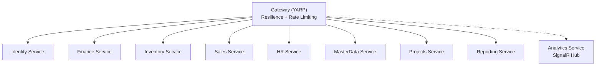
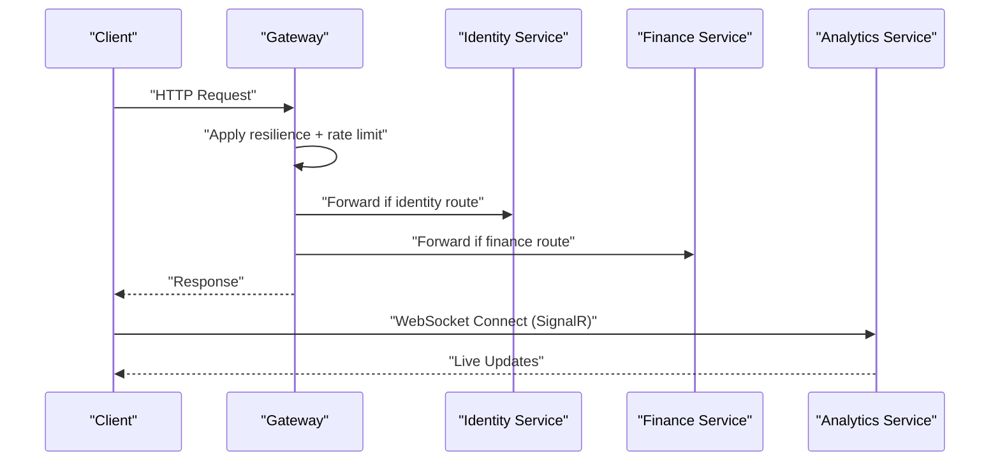
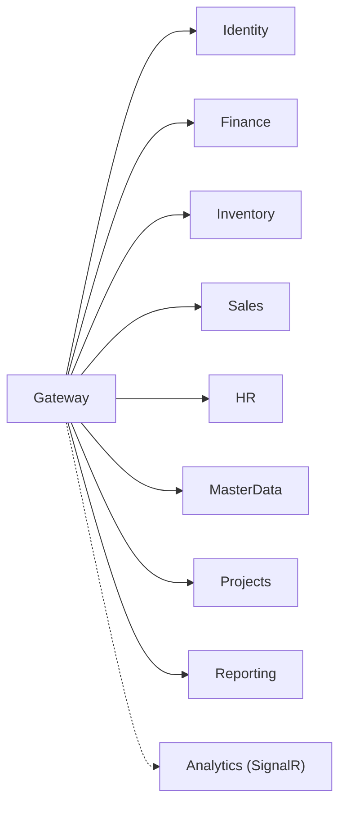

# API Reference

<cite>
**Referenced Files in This Document**
- [README.md](file://README.md)
- [Program.cs](file://src/Gateways/ErpSystem.Gateway/Program.cs)
- [AuthController.cs](file://src/Services/Identity/ErpSystem.Identity/API/AuthController.cs)
- [UsersController.cs](file://src/Services/Identity/ErpSystem.Identity/API/UsersController.cs)
- [GLController.cs](file://src/Services/Finance/ErpSystem.Finance/API/GLController.cs)
- [InvoicesController.cs](file://src/Services/Finance/ErpSystem.Finance/API/InvoicesController.cs)
- [InventoryController.cs](file://src/Services/Inventory/ErpSystem.Inventory/API/InventoryController.cs)
- [SalesOrdersController.cs](file://src/Services/Sales/ErpSystem.Sales/API/SalesOrdersController.cs)
- [ProjectsController.cs](file://src/Services/Projects/ErpSystem.Projects/API/ProjectsController.cs)
- [EmployeesController.cs](file://src/Services/HR/ErpSystem.HR/API/EmployeesController.cs)
- [MasterControllers.cs](file://src/Services/MasterData/ErpSystem.MasterData/Controllers/MasterControllers.cs)
- [DashboardController.cs](file://src/Services/Reporting/ErpSystem.Reporting/Controllers/DashboardController.cs)
- [DashboardsController.cs](file://src/Services/Analytics/ErpSystem.Analytics/API/DashboardsController.cs)
- [AnalyticsHub.cs](file://src/Services/Analytics/ErpSystem.Analytics/API/Hubs/AnalyticsHub.cs)
- [AuthExtensions.cs](file://src/BuildingBlocks/ErpSystem.BuildingBlocks/Auth/AuthExtensions.cs)
- [UserContext.cs](file://src/BuildingBlocks/ErpSystem.BuildingBlocks/Auth/UserContext.cs)
</cite>

## Table of Contents
1. [Introduction](#introduction)
2. [Project Structure](#project-structure)
3. [Core Components](#core-components)
4. [Architecture Overview](#architecture-overview)
5. [Detailed Component Analysis](#detailed-component-analysis)
6. [Dependency Analysis](#dependency-analysis)
7. [Performance Considerations](#performance-considerations)
8. [Troubleshooting Guide](#troubleshooting-guide)
9. [Conclusion](#conclusion)
10. [Appendices](#appendices)

## Introduction
This document provides a comprehensive API reference for the ERP microservices. It catalogs REST endpoints across services, outlines authentication and authorization patterns, describes real-time capabilities via SignalR hubs, and documents error handling and rate limiting. It also explains the API versioning approach and offers practical guidance for clients integrating with the system.

## Project Structure
The system is organized as a set of independent microservices behind a YARP reverse proxy gateway. Each service exposes REST endpoints and, where applicable, SignalR hubs for real-time updates. The gateway applies resilience policies and rate limiting, and serves as the single entry point for clients.

**Diagram sources**
- [README.md](file://README.md#L130-L183)
- [Program.cs](file://src/Gateways/ErpSystem.Gateway/Program.cs#L22-L80)

**Section sources**
- [README.md](file://README.md#L130-L183)
- [Program.cs](file://src/Gateways/ErpSystem.Gateway/Program.cs#L22-L80)

## Core Components
- Gateway: YARP reverse proxy with resilience (retry, circuit breaker, timeout), rate limiting, and health checks.
- Identity Service: Authentication and user management endpoints.
- Finance Service: General ledger, journal entries, invoices, aging analysis, and financial periods.
- Inventory Service: Stock search, reservations, transfers, adjustments, and transaction history.
- Sales Service: Sales orders lifecycle and shipment creation.
- HR Service: Employee lifecycle operations.
- MasterData Service: Materials and partner master data CRUD.
- Projects Service: Project, task, milestone, and team member management.
- Reporting Service: Executive dashboard KPIs and trend data.
- Analytics Service: BI dashboards and a SignalR hub for live updates.

**Section sources**
- [Program.cs](file://src/Gateways/ErpSystem.Gateway/Program.cs#L30-L58)
- [AuthController.cs](file://src/Services/Identity/ErpSystem.Identity/API/AuthController.cs#L11-L30)
- [GLController.cs](file://src/Services/Finance/ErpSystem.Finance/API/GLController.cs#L12-L74)
- [InvoicesController.cs](file://src/Services/Finance/ErpSystem.Finance/API/InvoicesController.cs#L13-L72)
- [InventoryController.cs](file://src/Services/Inventory/ErpSystem.Inventory/API/InventoryController.cs#L11-L42)
- [SalesOrdersController.cs](file://src/Services/Sales/ErpSystem.Sales/API/SalesOrdersController.cs#L11-L43)
- [EmployeesController.cs](file://src/Services/HR/ErpSystem.HR/API/EmployeesController.cs#L11-L46)
- [MasterControllers.cs](file://src/Services/MasterData/ErpSystem.MasterData/Controllers/MasterControllers.cs#L13-L76)
- [ProjectsController.cs](file://src/Services/Projects/ErpSystem.Projects/API/ProjectsController.cs#L13-L129)
- [DashboardController.cs](file://src/Services/Reporting/ErpSystem.Reporting/Controllers/DashboardController.cs#L13-L58)
- [DashboardsController.cs](file://src/Services/Analytics/ErpSystem.Analytics/API/DashboardsController.cs#L10-L24)
- [AnalyticsHub.cs](file://src/Services/Analytics/ErpSystem.Analytics/API/Hubs/AnalyticsHub.cs#L5-L12)

## Architecture Overview
The gateway enforces resilience and rate limiting, forwards requests to appropriate services, and exposes SignalR hubs for real-time dashboards.

**Diagram sources**
- [Program.cs](file://src/Gateways/ErpSystem.Gateway/Program.cs#L30-L64)
- [AuthController.cs](file://src/Services/Identity/ErpSystem.Identity/API/AuthController.cs#L8-L30)
- [GLController.cs](file://src/Services/Finance/ErpSystem.Finance/API/GLController.cs#L9-L74)
- [AnalyticsHub.cs](file://src/Services/Analytics/ErpSystem.Analytics/API/Hubs/AnalyticsHub.cs#L5-L12)

## Detailed Component Analysis

### Authentication and Authorization
- Authentication endpoints:
  - POST /api/v1/identity/auth/register
  - POST /api/v1/identity/auth/login
- User management endpoints:
  - POST /api/v1/identity/users
  - GET /api/v1/identity/users
  - GET /api/v1/identity/users/{id}
  - PUT /api/v1/identity/users/{id}/profile
  - POST /api/v1/identity/users/{id}/lock
  - POST /api/v1/identity/users/{id}/unlock
  - POST /api/v1/identity/users/{id}/roles

- Claims and context:
  - UserContext extracts authenticated status, user identifier, tenant identifier, email, name, and roles from claims.

- Signature verification extension:
  - A signature verification mechanism is available for inter-service trust.

Notes:
- The login endpoint returns a token payload suitable for bearer authentication.
- Role-based access control is supported via claims; enforce authorization at the controller level as needed.

**Section sources**
- [AuthController.cs](file://src/Services/Identity/ErpSystem.Identity/API/AuthController.cs#L11-L30)
- [UsersController.cs](file://src/Services/Identity/ErpSystem.Identity/API/UsersController.cs#L13-L54)
- [UserContext.cs](file://src/BuildingBlocks/ErpSystem.BuildingBlocks/Auth/UserContext.cs#L8-L32)
- [AuthExtensions.cs](file://src/BuildingBlocks/ErpSystem.BuildingBlocks/Auth/AuthExtensions.cs#L8-L17)

### Finance Service
- General Ledger
  - POST /api/gl/accounts
  - GET /api/gl/accounts
  - POST /api/gl/journal-entries
  - POST /api/gl/journal-entries/{id}/post
  - GET /api/gl/journal-entries/{id}
  - GET /api/gl/reports/trial-balance
  - POST /api/gl/periods
  - POST /api/gl/periods/{id}/close

- Invoices
  - POST /api/v1/finance/invoices
  - GET /api/v1/finance/invoices
  - GET /api/v1/finance/invoices/{id}
  - POST /api/v1/finance/invoices/{id}/issue
  - POST /api/v1/finance/invoices/{id}/cancel
  - POST /api/v1/finance/invoices/{id}/write-off
  - POST /api/v1/finance/invoices/{id}/payments
  - GET /api/v1/finance/invoices/{id}/payments
  - GET /api/v1/finance/invoices/aging-analysis
  - GET /api/v1/finance/invoices/overdue

Error handling:
- Posting a journal entry may return bad request for invalid state transitions.
- Not found responses when retrieving non-existent journal entries.

**Section sources**
- [GLController.cs](file://src/Services/Finance/ErpSystem.Finance/API/GLController.cs#L12-L74)
- [InvoicesController.cs](file://src/Services/Finance/ErpSystem.Finance/API/InvoicesController.cs#L13-L72)

### Inventory Service
- Inventory operations
  - GET /api/v1/inventory/items
  - GET /api/v1/inventory/available
  - POST /api/v1/inventory/receive
  - POST /api/v1/inventory/transfer
  - POST /api/v1/inventory/issue
  - POST /api/v1/inventory/reservations
  - POST /api/v1/inventory/reservations/release
  - POST /api/v1/inventory/adjust
  - GET /api/v1/inventory/items/{id}/transactions

**Section sources**
- [InventoryController.cs](file://src/Services/Inventory/ErpSystem.Inventory/API/InventoryController.cs#L11-L42)

### Sales Service
- Sales orders
  - POST /api/v1/sales/orders
  - GET /api/v1/sales/orders/{id}
  - GET /api/v1/sales/orders
  - POST /api/v1/sales/orders/{id}/confirm
  - POST /api/v1/sales/orders/{id}/cancel
  - GET /api/v1/sales/orders/{id}/billable-lines

- Shipments
  - POST /api/v1/sales/shipments

**Section sources**
- [SalesOrdersController.cs](file://src/Services/Sales/ErpSystem.Sales/API/SalesOrdersController.cs#L11-L43)

### HR Service
- Employee lifecycle
  - POST /api/v1/hr/employees
  - GET /api/v1/hr/employees/{id}
  - GET /api/v1/hr/employees
  - POST /api/v1/hr/employees/{id}/transfer
  - POST /api/v1/hr/employees/{id}/promote
  - POST /api/v1/hr/employees/{id}/terminate
  - GET /api/v1/hr/employees/{id}/events

**Section sources**
- [EmployeesController.cs](file://src/Services/HR/ErpSystem.HR/API/EmployeesController.cs#L11-L46)

### MasterData Service
- Materials
  - POST /api/v1/MasterData
  - GET /api/v1/MasterData
  - GET /api/v1/MasterData/{id}
  - PUT /api/v1/MasterData/{id}/info
  - PUT /api/v1/MasterData/{id}/attributes

- Partners
  - POST /api/v1/MasterData/suppliers
  - PUT /api/v1/MasterData/suppliers/{id}/profile
  - POST /api/v1/MasterData/customers
  - GET /api/v1/MasterData/suppliers
  - GET /api/v1/MasterData/customers

**Section sources**
- [MasterControllers.cs](file://src/Services/MasterData/ErpSystem.MasterData/Controllers/MasterControllers.cs#L13-L76)

### Projects Service
- Projects
  - GET /api/v1/projects/projects
  - GET /api/v1/projects/projects/{id}
  - POST /api/v1/projects/projects
  - PUT /api/v1/projects/projects/{id}/status
  - POST /api/v1/projects/projects/{id}/tasks
  - POST /api/v1/projects/projects/{id}/milestones
  - POST /api/v1/projects/projects/{id}/team-members
  - GET /api/v1/projects/projects/statistics

**Section sources**
- [ProjectsController.cs](file://src/Services/Projects/ErpSystem.Projects/API/ProjectsController.cs#L13-L129)

### Reporting Service
- Dashboard
  - GET /api/Reporting/Dashboard/summary
  - GET /api/Reporting/Dashboard/sales-trend
  - GET /api/Reporting/Dashboard/inventory-status
  - GET /api/Reporting/Dashboard/top-products
  - GET /api/Reporting/Dashboard/recent-activities

**Section sources**
- [DashboardController.cs](file://src/Services/Reporting/ErpSystem.Reporting/Controllers/DashboardController.cs#L13-L58)

### Analytics Service
- BI Dashboards
  - GET /api/v1/Analytics/Dashboards/inventory-turnover
  - GET /api/v1/Analytics/Dashboards/oee

- SignalR Hub
  - Endpoint: /analytics-hub (WebSocket)
  - Purpose: Real-time live updates for dashboards and notifications

Note: The hub currently does not implement custom negotiation or advanced grouping; connections are established via the default SignalR negotiation path.

**Section sources**
- [DashboardsController.cs](file://src/Services/Analytics/ErpSystem.Analytics/API/DashboardsController.cs#L10-L24)
- [AnalyticsHub.cs](file://src/Services/Analytics/ErpSystem.Analytics/API/Hubs/AnalyticsHub.cs#L5-L12)

## Dependency Analysis
- Gateway resilience and rate limiting apply to all proxied requests.
- Identity service precedes most workflows by issuing tokens used by clients.
- Analytics hub is accessed via WebSocket from the web client.

**Diagram sources**
- [Program.cs](file://src/Gateways/ErpSystem.Gateway/Program.cs#L30-L64)
- [README.md](file://README.md#L130-L183)

**Section sources**
- [Program.cs](file://src/Gateways/ErpSystem.Gateway/Program.cs#L30-L64)
- [README.md](file://README.md#L130-L183)

## Performance Considerations
- Resilience policies configured at the gateway:
  - Retry with exponential backoff and jitter.
  - Circuit breaker with failure ratio sampling and minimum throughput.
  - Timeout to fail fast.
- Rate limiting enabled to prevent backend overload; rejected requests receive a 429 status.

Recommendations:
- Clients should implement backoff and retry for transient errors.
- Respect rate limits and monitor response codes.
- Use pagination query parameters where exposed (e.g., page) to reduce payload sizes.

**Section sources**
- [Program.cs](file://src/Gateways/ErpSystem.Gateway/Program.cs#L30-L64)

## Troubleshooting Guide
Common scenarios:
- Unauthorized access: Authentication endpoints return unauthorized on login failures; ensure correct credentials and bearer token usage.
- Bad request on posting journal entries: Validate the entry state and required fields.
- Not found on retrieving journal entries: Ensure the ID exists.
- Overloaded services: Expect 429 responses when rate limits are exceeded.

Operational checks:
- Health endpoint: /health at the gateway.
- OpenAPI documentation: Available in development builds at the gateway.

**Section sources**
- [AuthController.cs](file://src/Services/Identity/ErpSystem.Identity/API/AuthController.cs#L18-L30)
- [GLController.cs](file://src/Services/Finance/ErpSystem.Finance/API/GLController.cs#L33-L44)
- [Program.cs](file://src/Gateways/ErpSystem.Gateway/Program.cs#L60-L80)

## Conclusion
This API reference consolidates REST endpoints, authentication, and real-time capabilities across the ERP microservices. Clients should integrate using bearer tokens issued by the Identity service, leverage gateway resilience and rate limiting, and consume SignalR hubs for live dashboards.

## Appendices

### API Versioning and Compatibility
- Versioning approach:
  - Identity: /api/v1/identity/*
  - Finance: /api/v1/finance/*
  - Inventory: /api/v1/inventory/*
  - Sales: /api/v1/sales/*
  - HR: /api/v1/hr/*
  - MasterData: /api/v1/MasterData/*
  - Projects: /api/v1/projects/*
  - Reporting: /api/Reporting/*
  - Analytics: /api/v1/Analytics/*

- Backward compatibility:
  - No explicit deprecation policies were identified in the codebase. Maintain stable resource paths and avoid breaking changes to existing endpoints.

**Section sources**
- [AuthController.cs](file://src/Services/Identity/ErpSystem.Identity/API/AuthController.cs#L8-L30)
- [InvoicesController.cs](file://src/Services/Finance/ErpSystem.Finance/API/InvoicesController.cs#L10-L72)
- [InventoryController.cs](file://src/Services/Inventory/ErpSystem.Inventory/API/InventoryController.cs#L8-L42)
- [SalesOrdersController.cs](file://src/Services/Sales/ErpSystem.Sales/API/SalesOrdersController.cs#L8-L43)
- [EmployeesController.cs](file://src/Services/HR/ErpSystem.HR/API/EmployeesController.cs#L8-L46)
- [MasterControllers.cs](file://src/Services/MasterData/ErpSystem.MasterData/Controllers/MasterControllers.cs#L10-L76)
- [ProjectsController.cs](file://src/Services/Projects/ErpSystem.Projects/API/ProjectsController.cs#L10-L129)
- [DashboardController.cs](file://src/Services/Reporting/ErpSystem.Reporting/Controllers/DashboardController.cs#L7-L58)
- [DashboardsController.cs](file://src/Services/Analytics/ErpSystem.Analytics/API/DashboardsController.cs#L7-L24)

### Practical Usage Examples
- Authenticate and obtain a token:
  - POST /api/v1/identity/auth/register
  - POST /api/v1/identity/auth/login
- Manage users:
  - POST /api/v1/identity/users
  - POST /api/v1/identity/users/{id}/roles
- Finance operations:
  - POST /api/v1/finance/invoices
  - POST /api/gl/journal-entries
  - GET /api/gl/reports/trial-balance
- Inventory operations:
  - POST /api/v1/inventory/receive
  - POST /api/v1/inventory/transfer
  - GET /api/v1/inventory/items
- Sales operations:
  - POST /api/v1/sales/orders
  - POST /api/v1/sales/shipments
- HR operations:
  - POST /api/v1/hr/employees
  - POST /api/v1/hr/employees/{id}/promote
- MasterData operations:
  - POST /api/v1/MasterData
  - POST /api/v1/MasterData/suppliers
- Projects operations:
  - POST /api/v1/projects/projects
  - POST /api/v1/projects/projects/{id}/tasks
- Reporting:
  - GET /api/Reporting/Dashboard/summary
- Analytics real-time:
  - Connect to /analytics-hub for live updates

**Section sources**
- [AuthController.cs](file://src/Services/Identity/ErpSystem.Identity/API/AuthController.cs#L11-L30)
- [UsersController.cs](file://src/Services/Identity/ErpSystem.Identity/API/UsersController.cs#L13-L54)
- [InvoicesController.cs](file://src/Services/Finance/ErpSystem.Finance/API/InvoicesController.cs#L13-L72)
- [GLController.cs](file://src/Services/Finance/ErpSystem.Finance/API/GLController.cs#L12-L74)
- [InventoryController.cs](file://src/Services/Inventory/ErpSystem.Inventory/API/InventoryController.cs#L11-L42)
- [SalesOrdersController.cs](file://src/Services/Sales/ErpSystem.Sales/API/SalesOrdersController.cs#L11-L43)
- [EmployeesController.cs](file://src/Services/HR/ErpSystem.HR/API/EmployeesController.cs#L11-L46)
- [MasterControllers.cs](file://src/Services/MasterData/ErpSystem.MasterData/Controllers/MasterControllers.cs#L13-L76)
- [ProjectsController.cs](file://src/Services/Projects/ErpSystem.Projects/API/ProjectsController.cs#L39-L101)
- [DashboardController.cs](file://src/Services/Reporting/ErpSystem.Reporting/Controllers/DashboardController.cs#L13-L58)
- [DashboardsController.cs](file://src/Services/Analytics/ErpSystem.Analytics/API/DashboardsController.cs#L10-L24)
- [AnalyticsHub.cs](file://src/Services/Analytics/ErpSystem.Analytics/API/Hubs/AnalyticsHub.cs#L5-L12)

### Client Implementation Guidelines
- Authentication:
  - Use the login endpoint to obtain a token and include it in Authorization: Bearer headers for protected routes.
- Error handling:
  - Implement retries for transient failures; handle 400 for validation errors and 401/403 for auth issues.
- Rate limiting:
  - Observe 429 responses and back off accordingly.
- Real-time dashboards:
  - Establish a WebSocket connection to the Analytics hub for live updates.

**Section sources**
- [AuthController.cs](file://src/Services/Identity/ErpSystem.Identity/API/AuthController.cs#L18-L30)
- [Program.cs](file://src/Gateways/ErpSystem.Gateway/Program.cs#L60-L80)
- [AnalyticsHub.cs](file://src/Services/Analytics/ErpSystem.Analytics/API/Hubs/AnalyticsHub.cs#L5-L12)