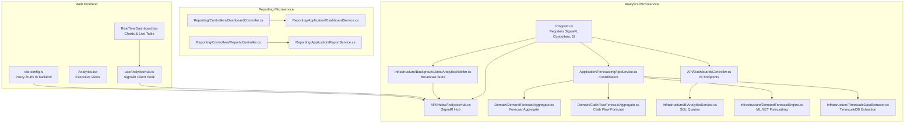
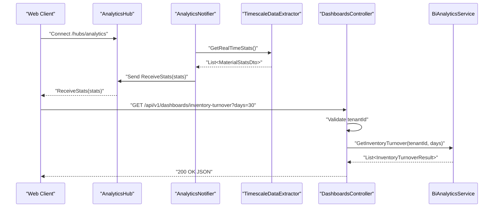
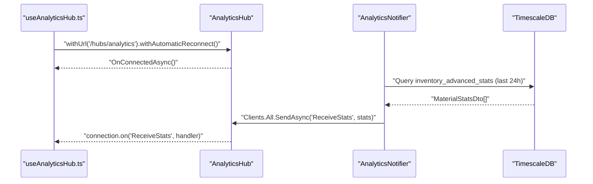
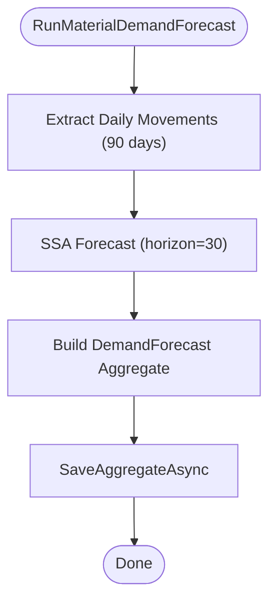
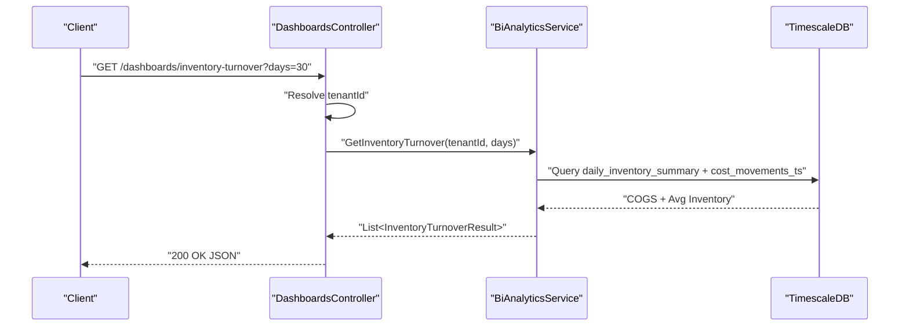
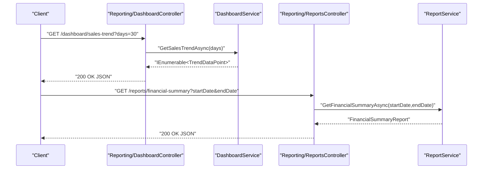
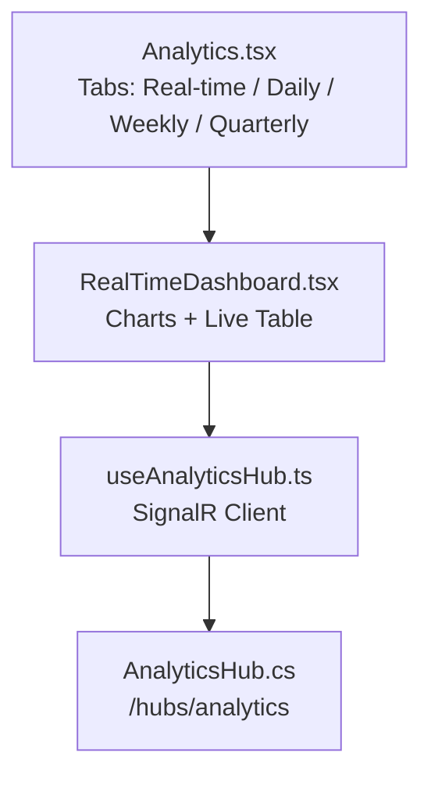
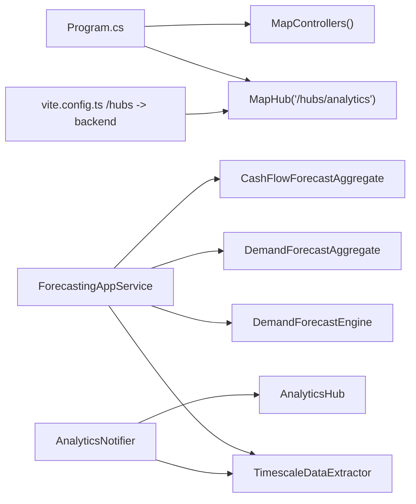

# Analytics Service API

<cite>
**Referenced Files in This Document**
- [Program.cs](file://src/Services/Analytics/ErpSystem.Analytics/Program.cs)
- [AnalyticsHub.cs](file://src/Services/Analytics/ErpSystem.Analytics/API/Hubs/AnalyticsHub.cs)
- [DashboardsController.cs](file://src/Services/Analytics/ErpSystem.Analytics/API/DashboardsController.cs)
- [ForecastingAppService.cs](file://src/Services/Analytics/ErpSystem.Analytics/Application/ForecastingAppService.cs)
- [DemandForecastAggregate.cs](file://src/Services/Analytics/ErpSystem.Analytics/Domain/DemandForecastAggregate.cs)
- [CashFlowForecastAggregate.cs](file://src/Services/Analytics/ErpSystem.Analytics/Domain/CashFlowForecastAggregate.cs)
- [BiAnalyticsService.cs](file://src/Services/Analytics/ErpSystem.Analytics/Infrastructure/BiAnalyticsService.cs)
- [DemandForecastEngine.cs](file://src/Services/Analytics/ErpSystem.Analytics/Infrastructure/DemandForecastEngine.cs)
- [TimescaleDataExtractor.cs](file://src/Services/Analytics/ErpSystem.Analytics/Infrastructure/TimescaleDataExtractor.cs)
- [AnalyticsNotifier.cs](file://src/Services/Analytics/ErpSystem.Analytics/Infrastructure/BackgroundJobs/AnalyticsNotifier.cs)
- [DashboardController.cs](file://src/Services/Reporting/ErpSystem.Reporting/Controllers/DashboardController.cs)
- [ReportsController.cs](file://src/Services/Reporting/ErpSystem.Reporting/Controllers/ReportsController.cs)
- [DashboardService.cs](file://src/Services/Reporting/ErpSystem.Reporting/Application/DashboardService.cs)
- [ReportService.cs](file://src/Services/Reporting/ErpSystem.Reporting/Application/ReportService.cs)
- [useAnalyticsHub.ts](file://src/Web/ErpSystem.Web/src/hooks/useAnalyticsHub.ts)
- [RealTimeDashboard.tsx](file://src/Web/ErpSystem.Web/src/components/RealTimeDashboard.tsx)
- [Analytics.tsx](file://src/Web/ErpSystem.Web/src/pages/Analytics.tsx)
- [vite.config.ts](file://src/Web/ErpSystem.Web/vite.config.ts)
</cite>

## Table of Contents
1. [Introduction](#introduction)
2. [Project Structure](#project-structure)
3. [Core Components](#core-components)
4. [Architecture Overview](#architecture-overview)
5. [Detailed Component Analysis](#detailed-component-analysis)
6. [Dependency Analysis](#dependency-analysis)
7. [Performance Considerations](#performance-considerations)
8. [Troubleshooting Guide](#troubleshooting-guide)
9. [Conclusion](#conclusion)
10. [Appendices](#appendices)

## Introduction
This document provides comprehensive API documentation for the Analytics service, focusing on real-time dashboards, predictive analytics, and business intelligence endpoints. It covers:
- Dashboard configuration and KPI tracking endpoints
- Custom report generation
- SignalR hub connections for real-time data streaming
- WebSocket protocol usage for live dashboards
- Machine learning model integration for forecasting and trend analysis
- Interactive dashboard building, drill-down analytics, and executive reporting
- Data visualization APIs and export capabilities
- Integration with BI tools
- Performance optimization for large datasets and caching strategies

## Project Structure
The Analytics service is implemented as a microservice with:
- HTTP controllers for BI endpoints
- SignalR hub for real-time streaming
- Application services orchestrating forecasting workflows
- Domain aggregates for storing forecast results
- Infrastructure services for TimescaleDB extraction and ML.NET forecasting
- Background job broadcasting live statistics to clients

**Diagram sources**
- [Program.cs](file://src/Services/Analytics/ErpSystem.Analytics/Program.cs#L11-L56)
- [AnalyticsHub.cs](file://src/Services/Analytics/ErpSystem.Analytics/API/Hubs/AnalyticsHub.cs#L5-L12)
- [DashboardsController.cs](file://src/Services/Analytics/ErpSystem.Analytics/API/DashboardsController.cs#L8-L25)
- [ForecastingAppService.cs](file://src/Services/Analytics/ErpSystem.Analytics/Application/ForecastingAppService.cs#L10-L41)
- [DemandForecastAggregate.cs](file://src/Services/Analytics/ErpSystem.Analytics/Domain/DemandForecastAggregate.cs#L8-L54)
- [CashFlowForecastAggregate.cs](file://src/Services/Analytics/ErpSystem.Analytics/Domain/CashFlowForecastAggregate.cs#L8-L47)
- [BiAnalyticsService.cs](file://src/Services/Analytics/ErpSystem.Analytics/Infrastructure/BiAnalyticsService.cs#L8-L92)
- [DemandForecastEngine.cs](file://src/Services/Analytics/ErpSystem.Analytics/Infrastructure/DemandForecastEngine.cs#L9-L61)
- [TimescaleDataExtractor.cs](file://src/Services/Analytics/ErpSystem.Analytics/Infrastructure/TimescaleDataExtractor.cs#L8-L141)
- [AnalyticsNotifier.cs](file://src/Services/Analytics/ErpSystem.Analytics/Infrastructure/BackgroundJobs/AnalyticsNotifier.cs#L6-L37)
- [DashboardController.cs](file://src/Services/Reporting/ErpSystem.Reporting/Controllers/DashboardController.cs#L8-L79)
- [ReportsController.cs](file://src/Services/Reporting/ErpSystem.Reporting/Controllers/ReportsController.cs#L8-L136)
- [DashboardService.cs](file://src/Services/Reporting/ErpSystem.Reporting/Application/DashboardService.cs#L20-L92)
- [ReportService.cs](file://src/Services/Reporting/ErpSystem.Reporting/Application/ReportService.cs#L14-L104)
- [useAnalyticsHub.ts](file://src/Web/ErpSystem.Web/src/hooks/useAnalyticsHub.ts#L12-L49)
- [RealTimeDashboard.tsx](file://src/Web/ErpSystem.Web/src/components/RealTimeDashboard.tsx#L6-L116)
- [Analytics.tsx](file://src/Web/ErpSystem.Web/src/pages/Analytics.tsx#L5-L167)
- [vite.config.ts](file://src/Web/ErpSystem.Web/vite.config.ts#L8-L19)

**Section sources**
- [Program.cs](file://src/Services/Analytics/ErpSystem.Analytics/Program.cs#L11-L56)
- [vite.config.ts](file://src/Web/ErpSystem.Web/vite.config.ts#L8-L19)

## Core Components
- SignalR Hub: Provides real-time streaming of live statistics to connected clients.
- Forecasting App Service: Orchestrates data extraction, ML.NET forecasting, and domain aggregate persistence.
- BI Analytics Service: Executes SQL queries against TimescaleDB for dashboard metrics.
- Timescale Data Extractor: Pulls time-series data for forecasting and real-time stats.
- Demand Forecast Engine: Uses ML.NET SSA forecasting pipeline for predictions.
- Background Job: Periodically broadcasts real-time stats snapshots to clients.
- Reporting Controllers: Provide executive dashboards and custom reports.

**Section sources**
- [AnalyticsHub.cs](file://src/Services/Analytics/ErpSystem.Analytics/API/Hubs/AnalyticsHub.cs#L5-L12)
- [ForecastingAppService.cs](file://src/Services/Analytics/ErpSystem.Analytics/Application/ForecastingAppService.cs#L10-L41)
- [BiAnalyticsService.cs](file://src/Services/Analytics/ErpSystem.Analytics/Infrastructure/BiAnalyticsService.cs#L8-L92)
- [TimescaleDataExtractor.cs](file://src/Services/Analytics/ErpSystem.Analytics/Infrastructure/TimescaleDataExtractor.cs#L8-L141)
- [DemandForecastEngine.cs](file://src/Services/Analytics/ErpSystem.Analytics/Infrastructure/DemandForecastEngine.cs#L9-L61)
- [AnalyticsNotifier.cs](file://src/Services/Analytics/ErpSystem.Analytics/Infrastructure/BackgroundJobs/AnalyticsNotifier.cs#L6-L37)
- [DashboardController.cs](file://src/Services/Reporting/ErpSystem.Reporting/Controllers/DashboardController.cs#L8-L79)
- [ReportsController.cs](file://src/Services/Reporting/ErpSystem.Reporting/Controllers/ReportsController.cs#L8-L136)

## Architecture Overview
The Analytics service integrates HTTP APIs, SignalR real-time streaming, and background jobs to deliver:
- Predictive analytics via ML.NET forecasting
- Business intelligence dashboards via TimescaleDB queries
- Real-time inventory velocity and volatility visualization
- Executive reporting endpoints for financial and operational summaries

**Diagram sources**
- [AnalyticsHub.cs](file://src/Services/Analytics/ErpSystem.Analytics/API/Hubs/AnalyticsHub.cs#L5-L12)
- [AnalyticsNotifier.cs](file://src/Services/Analytics/ErpSystem.Analytics/Infrastructure/BackgroundJobs/AnalyticsNotifier.cs#L12-L36)
- [TimescaleDataExtractor.cs](file://src/Services/Analytics/ErpSystem.Analytics/Infrastructure/TimescaleDataExtractor.cs#L88-L131)
- [DashboardsController.cs](file://src/Services/Analytics/ErpSystem.Analytics/API/DashboardsController.cs#L10-L16)
- [BiAnalyticsService.cs](file://src/Services/Analytics/ErpSystem.Analytics/Infrastructure/BiAnalyticsService.cs#L16-L66)

## Detailed Component Analysis

### Real-Time Dashboards and SignalR Streaming
- SignalR Hub endpoint: "/hubs/analytics"
- Clients connect via Microsoft SignalR client and receive periodic "ReceiveStats" events
- Backend broadcasts top recent stats snapshots every 5 seconds
- Frontend hook manages connection lifecycle and listens for updates

**Diagram sources**
- [useAnalyticsHub.ts](file://src/Web/ErpSystem.Web/src/hooks/useAnalyticsHub.ts#L12-L49)
- [AnalyticsHub.cs](file://src/Services/Analytics/ErpSystem.Analytics/API/Hubs/AnalyticsHub.cs#L7-L11)
- [AnalyticsNotifier.cs](file://src/Services/Analytics/ErpSystem.Analytics/Infrastructure/BackgroundJobs/AnalyticsNotifier.cs#L12-L36)
- [TimescaleDataExtractor.cs](file://src/Services/Analytics/ErpSystem.Analytics/Infrastructure/TimescaleDataExtractor.cs#L88-L131)

**Section sources**
- [Program.cs](file://src/Services/Analytics/ErpSystem.Analytics/Program.cs#L56-L56)
- [AnalyticsHub.cs](file://src/Services/Analytics/ErpSystem.Analytics/API/Hubs/AnalyticsHub.cs#L5-L12)
- [AnalyticsNotifier.cs](file://src/Services/Analytics/ErpSystem.Analytics/Infrastructure/BackgroundJobs/AnalyticsNotifier.cs#L12-L36)
- [useAnalyticsHub.ts](file://src/Web/ErpSystem.Web/src/hooks/useAnalyticsHub.ts#L12-L49)
- [RealTimeDashboard.tsx](file://src/Web/ErpSystem.Web/src/components/RealTimeDashboard.tsx#L6-L116)
- [vite.config.ts](file://src/Web/ErpSystem.Web/vite.config.ts#L14-L19)

### Predictive Analytics and Forecasting APIs
- Forecasting orchestration:
  - Extract daily inventory movements for the last 90 days
  - Predict next 30 days using ML.NET SSA forecasting
  - Persist forecast as a domain aggregate with confidence score
- Domain aggregates:
  - DemandForecast: stores predicted quantities, forecast date, and confidence
  - CashFlowForecast: stores predicted inflow/outflow and derived net position

**Diagram sources**
- [ForecastingAppService.cs](file://src/Services/Analytics/ErpSystem.Analytics/Application/ForecastingAppService.cs#L18-L40)
- [DemandForecastEngine.cs](file://src/Services/Analytics/ErpSystem.Analytics/Infrastructure/DemandForecastEngine.cs#L13-L45)
- [TimescaleDataExtractor.cs](file://src/Services/Analytics/ErpSystem.Analytics/Infrastructure/TimescaleDataExtractor.cs#L15-L48)
- [DemandForecastAggregate.cs](file://src/Services/Analytics/ErpSystem.Analytics/Domain/DemandForecastAggregate.cs#L17-L37)

**Section sources**
- [ForecastingAppService.cs](file://src/Services/Analytics/ErpSystem.Analytics/Application/ForecastingAppService.cs#L10-L41)
- [DemandForecastEngine.cs](file://src/Services/Analytics/ErpSystem.Analytics/Infrastructure/DemandForecastEngine.cs#L9-L61)
- [TimescaleDataExtractor.cs](file://src/Services/Analytics/ErpSystem.Analytics/Infrastructure/TimescaleDataExtractor.cs#L8-L141)
- [DemandForecastAggregate.cs](file://src/Services/Analytics/ErpSystem.Analytics/Domain/DemandForecastAggregate.cs#L8-L54)
- [CashFlowForecastAggregate.cs](file://src/Services/Analytics/ErpSystem.Analytics/Domain/CashFlowForecastAggregate.cs#L8-L47)

### Business Intelligence Endpoints
- Inventory Turnover:
  - Endpoint: GET /api/v1/dashboards/inventory-turnover?days=30
  - Returns per-material turnover metrics using TimescaleDB continuous aggregates
- OEE Dashboard:
  - Endpoint: GET /api/v1/dashboards/oee
  - Returns equipment effectiveness components (simulated in current implementation)

**Diagram sources**
- [DashboardsController.cs](file://src/Services/Analytics/ErpSystem.Analytics/API/DashboardsController.cs#L10-L16)
- [BiAnalyticsService.cs](file://src/Services/Analytics/ErpSystem.Analytics/Infrastructure/BiAnalyticsService.cs#L16-L66)

**Section sources**
- [DashboardsController.cs](file://src/Services/Analytics/ErpSystem.Analytics/API/DashboardsController.cs#L8-L25)
- [BiAnalyticsService.cs](file://src/Services/Analytics/ErpSystem.Analytics/Infrastructure/BiAnalyticsService.cs#L8-L92)

### Executive Reporting Endpoints
- Dashboard summary and trends:
  - GET /api/dashboard/summary
  - GET /api/dashboard/sales-trend?days=30
  - GET /api/dashboard/inventory-status
  - GET /api/dashboard/top-products?count=10
  - GET /api/dashboard/recent-activities?count=20
- Custom reports:
  - GET /api/reports/financial-summary?startDate&endDate
  - GET /api/reports/inventory-valuation
  - GET /api/reports/sales-by-customer?startDate&endDate
  - GET /api/reports/purchase-orders
  - GET /api/reports/production-efficiency?startDate&endDate

**Diagram sources**
- [DashboardController.cs](file://src/Services/Reporting/ErpSystem.Reporting/Controllers/DashboardController.cs#L13-L58)
- [DashboardService.cs](file://src/Services/Reporting/ErpSystem.Reporting/Application/DashboardService.cs#L22-L53)
- [ReportsController.cs](file://src/Services/Reporting/ErpSystem.Reporting/Controllers/ReportsController.cs#L13-L70)
- [ReportService.cs](file://src/Services/Reporting/ErpSystem.Reporting/Application/ReportService.cs#L16-L34)

**Section sources**
- [DashboardController.cs](file://src/Services/Reporting/ErpSystem.Reporting/Controllers/DashboardController.cs#L8-L79)
- [DashboardService.cs](file://src/Services/Reporting/ErpSystem.Reporting/Application/DashboardService.cs#L20-L92)
- [ReportsController.cs](file://src/Services/Reporting/ErpSystem.Reporting/Controllers/ReportsController.cs#L8-L136)
- [ReportService.cs](file://src/Services/Reporting/ErpSystem.Reporting/Application/ReportService.cs#L14-L104)

### Interactive Dashboard Building and Drill-Down Analytics
- Real-time dashboard page aggregates:
  - Intelligence cards for procurement forecast, inventory turnover, OEE, and cash position
  - AI demand prediction visualization placeholder with confidence indicator
  - Anomaly detection feed driven by TimescaleDB insights
- Live inventory velocity and volatility charts:
  - Bar chart of average movement per material
  - Line chart of volatility (standard deviation)
  - Live data table streaming updates via SignalR

**Diagram sources**
- [Analytics.tsx](file://src/Web/ErpSystem.Web/src/pages/Analytics.tsx#L5-L167)
- [RealTimeDashboard.tsx](file://src/Web/ErpSystem.Web/src/components/RealTimeDashboard.tsx#L6-L116)
- [useAnalyticsHub.ts](file://src/Web/ErpSystem.Web/src/hooks/useAnalyticsHub.ts#L12-L49)
- [AnalyticsHub.cs](file://src/Services/Analytics/ErpSystem.Analytics/API/Hubs/AnalyticsHub.cs#L5-L12)

**Section sources**
- [Analytics.tsx](file://src/Web/ErpSystem.Web/src/pages/Analytics.tsx#L5-L167)
- [RealTimeDashboard.tsx](file://src/Web/ErpSystem.Web/src/components/RealTimeDashboard.tsx#L6-L116)
- [useAnalyticsHub.ts](file://src/Web/ErpSystem.Web/src/hooks/useAnalyticsHub.ts#L12-L49)

## Dependency Analysis
- SignalR and HTTP pipeline:
  - Program registers SignalR hub and maps controller routes
  - Frontend proxy forwards /hubs to backend for WebSocket upgrade
- Forecasting pipeline:
  - ForecastingAppService depends on TimescaleDataExtractor and DemandForecastEngine
  - Results persisted via IEventStore and domain aggregates
- Real-time streaming:
  - AnalyticsNotifier periodically queries TimescaleDB and broadcasts to clients
- Reporting:
  - DashboardController and ReportsController depend on application services that currently return sample data; in production they would integrate with Dapr to aggregate from multiple services

**Diagram sources**
- [Program.cs](file://src/Services/Analytics/ErpSystem.Analytics/Program.cs#L56-L56)
- [vite.config.ts](file://src/Web/ErpSystem.Web/vite.config.ts#L14-L19)
- [ForecastingAppService.cs](file://src/Services/Analytics/ErpSystem.Analytics/Application/ForecastingAppService.cs#L10-L41)
- [TimescaleDataExtractor.cs](file://src/Services/Analytics/ErpSystem.Analytics/Infrastructure/TimescaleDataExtractor.cs#L8-L141)
- [DemandForecastEngine.cs](file://src/Services/Analytics/ErpSystem.Analytics/Infrastructure/DemandForecastEngine.cs#L9-L61)
- [DemandForecastAggregate.cs](file://src/Services/Analytics/ErpSystem.Analytics/Domain/DemandForecastAggregate.cs#L8-L54)
- [CashFlowForecastAggregate.cs](file://src/Services/Analytics/ErpSystem.Analytics/Domain/CashFlowForecastAggregate.cs#L8-L47)
- [AnalyticsNotifier.cs](file://src/Services/Analytics/ErpSystem.Analytics/Infrastructure/BackgroundJobs/AnalyticsNotifier.cs#L6-L37)
- [AnalyticsHub.cs](file://src/Services/Analytics/ErpSystem.Analytics/API/Hubs/AnalyticsHub.cs#L5-L12)

**Section sources**
- [Program.cs](file://src/Services/Analytics/ErpSystem.Analytics/Program.cs#L11-L56)
- [ForecastingAppService.cs](file://src/Services/Analytics/ErpSystem.Analytics/Application/ForecastingAppService.cs#L10-L41)
- [AnalyticsNotifier.cs](file://src/Services/Analytics/ErpSystem.Analytics/Infrastructure/BackgroundJobs/AnalyticsNotifier.cs#L6-L37)
- [vite.config.ts](file://src/Web/ErpSystem.Web/vite.config.ts#L8-L19)

## Performance Considerations
- TimescaleDB optimization:
  - Use continuous aggregates and hypertables for efficient time-series queries
  - Leverage time_bucket grouping and approximate statistical functions for real-time stats
- Forecasting performance:
  - Use SSA forecasting with appropriate window sizes aligned to observed seasonality
  - Cache frequently accessed historical windows to reduce database load
- Real-time streaming:
  - Broadcast compact DTOs (MaterialStatsDto) to minimize payload size
  - Tune broadcast interval to balance freshness and bandwidth
- Caching strategies:
  - Cache dashboard KPIs and report summaries with TTL
  - Use CDN for static visualizations and pre-rendered charts
- Horizontal scaling:
  - Scale-out SignalR instances behind a load balancer supporting sticky sessions
  - Partition tenants and aggregates to isolate workloads

[No sources needed since this section provides general guidance]

## Troubleshooting Guide
- SignalR connection failures:
  - Verify frontend proxy configuration for WebSocket upgrade
  - Check backend hub registration and CORS policies
- Real-time stats not updating:
  - Confirm AnalyticsNotifier periodic timer and TimescaleDB connectivity
  - Review logging for exceptions during extraction or broadcasting
- Forecasting errors:
  - Ensure sufficient historical data points for SSA forecasting
  - Validate domain event store persistence and aggregate reconstruction
- BI endpoint timeouts:
  - Optimize TimescaleDB queries with proper indexing and time constraints
  - Consider pagination or sampling for large result sets

**Section sources**
- [vite.config.ts](file://src/Web/ErpSystem.Web/vite.config.ts#L14-L19)
- [AnalyticsNotifier.cs](file://src/Services/Analytics/ErpSystem.Analytics/Infrastructure/BackgroundJobs/AnalyticsNotifier.cs#L12-L36)
- [TimescaleDataExtractor.cs](file://src/Services/Analytics/ErpSystem.Analytics/Infrastructure/TimescaleDataExtractor.cs#L88-L131)
- [ForecastingAppService.cs](file://src/Services/Analytics/ErpSystem.Analytics/Application/ForecastingAppService.cs#L18-L40)

## Conclusion
The Analytics service delivers a robust foundation for real-time dashboards, predictive analytics, and business intelligence. It leverages SignalR for live streaming, ML.NET for forecasting, and TimescaleDB for scalable time-series analytics. The Reporting service complements the Analytics service with executive dashboards and custom reports. With proper caching, partitioning, and monitoring, the platform can scale to support large datasets and diverse tenant workloads.

[No sources needed since this section summarizes without analyzing specific files]

## Appendices

### API Reference Summary

- Real-Time Streaming
  - SignalR Hub: /hubs/analytics
  - Event: ReceiveStats(stats)
- BI Dashboards
  - GET /api/v1/dashboards/inventory-turnover?days=30
  - GET /api/v1/dashboards/oee
- Executive Reporting
  - GET /api/dashboard/summary
  - GET /api/dashboard/sales-trend?days=30
  - GET /api/dashboard/inventory-status
  - GET /api/dashboard/top-products?count=10
  - GET /api/dashboard/recent-activities?count=20
  - GET /api/reports/financial-summary?startDate&endDate
  - GET /api/reports/inventory-valuation
  - GET /api/reports/sales-by-customer?startDate&endDate
  - GET /api/reports/purchase-orders
  - GET /api/reports/production-efficiency?startDate&endDate

**Section sources**
- [Program.cs](file://src/Services/Analytics/ErpSystem.Analytics/Program.cs#L56-L56)
- [DashboardsController.cs](file://src/Services/Analytics/ErpSystem.Analytics/API/DashboardsController.cs#L10-L24)
- [DashboardController.cs](file://src/Services/Reporting/ErpSystem.Reporting/Controllers/DashboardController.cs#L13-L58)
- [ReportsController.cs](file://src/Services/Reporting/ErpSystem.Reporting/Controllers/ReportsController.cs#L13-L70)