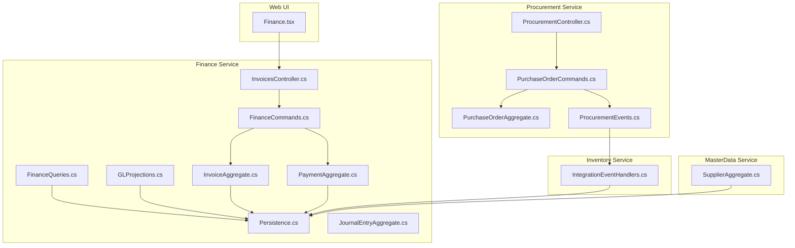
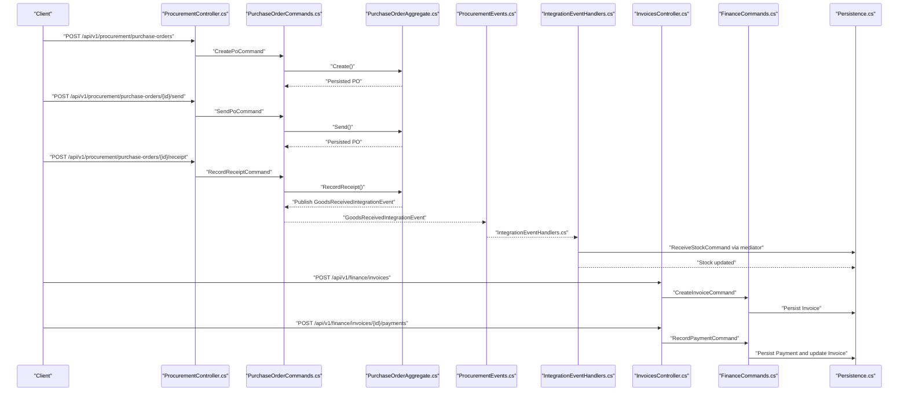
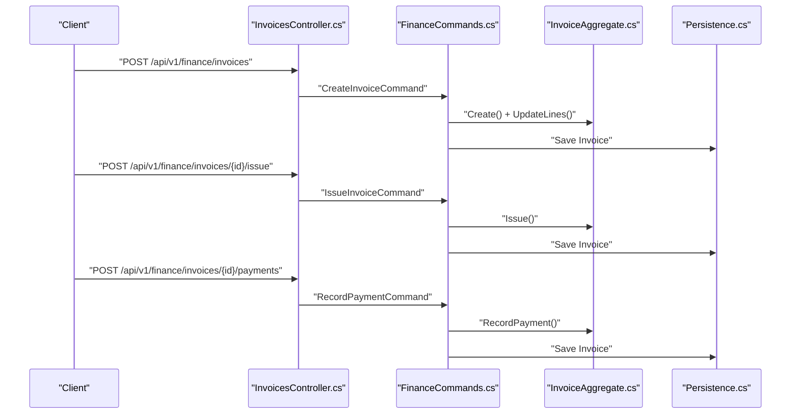
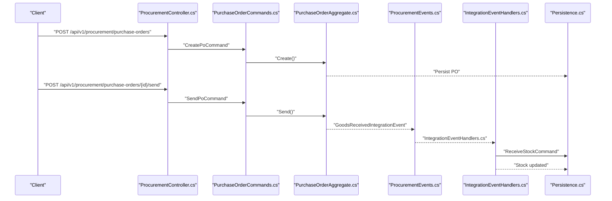
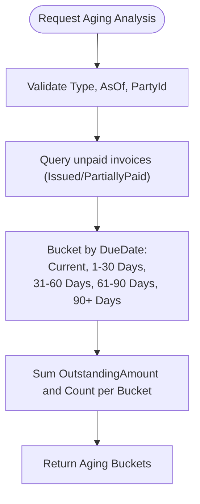
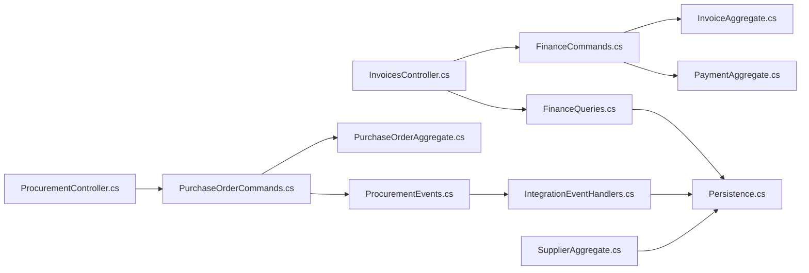

# Accounts Payable API

<cite>
**Referenced Files in This Document**
- [InvoicesController.cs](file://src/Services/Finance/ErpSystem.Finance/API/InvoicesController.cs)
- [InvoiceAggregate.cs](file://src/Services/Finance/ErpSystem.Finance/Domain/InvoiceAggregate.cs)
- [PaymentAggregate.cs](file://src/Services/Finance/ErpSystem.Finance/Domain/PaymentAggregate.cs)
- [FinanceCommands.cs](file://src/Services/Finance/ErpSystem.Finance/Application/FinanceCommands.cs)
- [FinanceQueries.cs](file://src/Services/Finance/ErpSystem.Finance/Application/FinanceQueries.cs)
- [Persistence.cs](file://src/Services/Finance/ErpSystem.Finance/Infrastructure/Persistence.cs)
- [GLProjections.cs](file://src/Services/Finance/ErpSystem.Finance/Infrastructure/GLProjections.cs)
- [JournalEntryAggregate.cs](file://src/Services/Finance/ErpSystem.Finance/Domain/JournalEntryAggregate.cs)
- [ProcurementController.cs](file://src/Services/Procurement/ErpSystem.Procurement/API/ProcurementController.cs)
- [PurchaseOrderAggregate.cs](file://src/Services/Procurement/ErpSystem.Procurement/Domain/PurchaseOrderAggregate.cs)
- [PurchaseOrderCommands.cs](file://src/Services/Procurement/ErpSystem.Procurement/Application/PurchaseOrderCommands.cs)
- [ProcurementEvents.cs](file://src/Services/Procurement/ErpSystem.Procurement/Domain/ProcurementEvents.cs)
- [IntegrationEventHandlers.cs](file://src/Services/Inventory/ErpSystem.Inventory/Application/IntegrationEventHandlers.cs)
- [SupplierAggregate.cs](file://src/Services/MasterData/ErpSystem.MasterData/Domain/SupplierAggregate.cs)
- [ProcurementToInventoryTests.cs](file://src/Tests/ErpSystem.IntegrationTests/ProcurementToInventoryTests.cs)
- [Finance.tsx](file://src/Web/ErpSystem.Web/src/pages/Finance.tsx)
</cite>

## Table of Contents
1. [Introduction](#introduction)
2. [Project Structure](#project-structure)
3. [Core Components](#core-components)
4. [Architecture Overview](#architecture-overview)
5. [Detailed Component Analysis](#detailed-component-analysis)
6. [Dependency Analysis](#dependency-analysis)
7. [Performance Considerations](#performance-considerations)
8. [Troubleshooting Guide](#troubleshooting-guide)
9. [Conclusion](#conclusion)
10. [Appendices](#appendices)

## Introduction
This document provides comprehensive API documentation for Accounts Payable capabilities implemented in the ERP microservice. It covers vendor payment processing, expense management, payable reconciliation, purchase order matching, invoice verification, payment authorization workflows, vendor setup, payment terms, discount management, expense report processing, petty cash management, check printing operations, automated payment scheduling, ACH processing, wire transfers, integration with procurement, inventory, and supplier management systems, multi-currency vendor transactions, foreign exchange handling, tax reporting, payable aging analysis, vendor performance tracking, and payment forecasting.

## Project Structure
The Accounts Payable domain spans several services:
- Finance service: invoice lifecycle, payments, aging analytics, dashboard stats, general ledger projections
- Procurement service: purchase orders, goods receipt, integration events
- Inventory service: receives goods-received integration events and updates stock
- MasterData service: supplier profiles, contact persons, bank accounts
- Reporting and Web UI: dashboards and quick actions

**Diagram sources**
- [InvoicesController.cs](file://src/Services/Finance/ErpSystem.Finance/API/InvoicesController.cs#L1-L74)
- [InvoiceAggregate.cs](file://src/Services/Finance/ErpSystem.Finance/Domain/InvoiceAggregate.cs#L1-L176)
- [PaymentAggregate.cs](file://src/Services/Finance/ErpSystem.Finance/Domain/PaymentAggregate.cs#L1-L120)
- [FinanceCommands.cs](file://src/Services/Finance/ErpSystem.Finance/Application/FinanceCommands.cs#L1-L143)
- [FinanceQueries.cs](file://src/Services/Finance/ErpSystem.Finance/Application/FinanceQueries.cs#L1-L173)
- [Persistence.cs](file://src/Services/Finance/ErpSystem.Finance/Infrastructure/Persistence.cs#L64-L98)
- [GLProjections.cs](file://src/Services/Finance/ErpSystem.Finance/Infrastructure/GLProjections.cs#L1-L151)
- [JournalEntryAggregate.cs](file://src/Services/Finance/ErpSystem.Finance/Domain/JournalEntryAggregate.cs#L1-L136)
- [ProcurementController.cs](file://src/Services/Procurement/ErpSystem.Procurement/API/ProcurementController.cs#L1-L33)
- [PurchaseOrderAggregate.cs](file://src/Services/Procurement/ErpSystem.Procurement/Domain/PurchaseOrderAggregate.cs#L1-L149)
- [PurchaseOrderCommands.cs](file://src/Services/Procurement/ErpSystem.Procurement/Application/PurchaseOrderCommands.cs#L1-L117)
- [ProcurementEvents.cs](file://src/Services/Procurement/ErpSystem.Procurement/Domain/ProcurementEvents.cs#L1-L20)
- [IntegrationEventHandlers.cs](file://src/Services/Inventory/ErpSystem.Inventory/Application/IntegrationEventHandlers.cs#L1-L39)
- [SupplierAggregate.cs](file://src/Services/MasterData/ErpSystem.MasterData/Domain/SupplierAggregate.cs#L1-L125)
- [Finance.tsx](file://src/Web/ErpSystem.Web/src/pages/Finance.tsx#L1-L156)

**Section sources**
- [InvoicesController.cs](file://src/Services/Finance/ErpSystem.Finance/API/InvoicesController.cs#L1-L74)
- [ProcurementController.cs](file://src/Services/Procurement/ErpSystem.Procurement/API/ProcurementController.cs#L1-L33)
- [IntegrationEventHandlers.cs](file://src/Services/Inventory/ErpSystem.Inventory/Application/IntegrationEventHandlers.cs#L1-L39)
- [SupplierAggregate.cs](file://src/Services/MasterData/ErpSystem.MasterData/Domain/SupplierAggregate.cs#L1-L125)
- [Finance.tsx](file://src/Web/ErpSystem.Web/src/pages/Finance.tsx#L1-L156)

## Core Components
- InvoicesController: exposes endpoints for invoice creation, issue/cancel/write-off, payment recording, payment retrieval, and aging/overdue queries.
- Invoice aggregate: manages invoice lifecycle, lines, totals, tax, payments, and status transitions.
- Payment aggregate: tracks payment direction (AP), allocations to invoices, completion, and status.
- Finance commands: orchestrate invoice creation, issuing, payment registration, payment recording, write-offs, cancellations.
- Finance queries: provide paginated invoice/payment lists, aging analysis, overdue invoices, and financial dashboard stats.
- Procurement controller and commands: manage purchase order lifecycle and goods receipt with integration events.
- Inventory integration handler: processes goods-received integration events to update stock.
- Supplier aggregate: maintains supplier profile, contacts, bank accounts, and status.
- Read models and projections: persist invoice/payment/read-side aggregates and GL projections.

**Section sources**
- [InvoicesController.cs](file://src/Services/Finance/ErpSystem.Finance/API/InvoicesController.cs#L1-L74)
- [InvoiceAggregate.cs](file://src/Services/Finance/ErpSystem.Finance/Domain/InvoiceAggregate.cs#L1-L176)
- [PaymentAggregate.cs](file://src/Services/Finance/ErpSystem.Finance/Domain/PaymentAggregate.cs#L1-L120)
- [FinanceCommands.cs](file://src/Services/Finance/ErpSystem.Finance/Application/FinanceCommands.cs#L1-L143)
- [FinanceQueries.cs](file://src/Services/Finance/ErpSystem.Finance/Application/FinanceQueries.cs#L1-L173)
- [ProcurementController.cs](file://src/Services/Procurement/ErpSystem.Procurement/API/ProcurementController.cs#L1-L33)
- [PurchaseOrderCommands.cs](file://src/Services/Procurement/ErpSystem.Procurement/Application/PurchaseOrderCommands.cs#L1-L117)
- [ProcurementEvents.cs](file://src/Services/Procurement/ErpSystem.Procurement/Domain/ProcurementEvents.cs#L1-L20)
- [IntegrationEventHandlers.cs](file://src/Services/Inventory/ErpSystem.Inventory/Application/IntegrationEventHandlers.cs#L1-L39)
- [SupplierAggregate.cs](file://src/Services/MasterData/ErpSystem.MasterData/Domain/SupplierAggregate.cs#L1-L125)
- [Persistence.cs](file://src/Services/Finance/ErpSystem.Finance/Infrastructure/Persistence.cs#L64-L98)
- [GLProjections.cs](file://src/Services/Finance/ErpSystem.Finance/Infrastructure/GLProjections.cs#L1-L151)

## Architecture Overview
Accounts Payable integrates invoice and payment workflows with procurement and inventory:
- Procurement issues purchase orders and records goods receipts, publishing integration events.
- Inventory consumes goods-received events to update stock.
- Finance creates AP invoices, records payments, computes aging analytics, and projects GL read models.

**Diagram sources**
- [ProcurementController.cs](file://src/Services/Procurement/ErpSystem.Procurement/API/ProcurementController.cs#L1-L33)
- [PurchaseOrderCommands.cs](file://src/Services/Procurement/ErpSystem.Procurement/Application/PurchaseOrderCommands.cs#L1-L117)
- [PurchaseOrderAggregate.cs](file://src/Services/Procurement/ErpSystem.Procurement/Domain/PurchaseOrderAggregate.cs#L1-L149)
- [ProcurementEvents.cs](file://src/Services/Procurement/ErpSystem.Procurement/Domain/ProcurementEvents.cs#L1-L20)
- [IntegrationEventHandlers.cs](file://src/Services/Inventory/ErpSystem.Inventory/Application/IntegrationEventHandlers.cs#L1-L39)
- [InvoicesController.cs](file://src/Services/Finance/ErpSystem.Finance/API/InvoicesController.cs#L1-L74)
- [FinanceCommands.cs](file://src/Services/Finance/ErpSystem.Finance/Application/FinanceCommands.cs#L1-L143)
- [Persistence.cs](file://src/Services/Finance/ErpSystem.Finance/Infrastructure/Persistence.cs#L64-L98)

## Detailed Component Analysis

### Vendor Payment Processing
Endpoints:
- Create invoice: POST /api/v1/finance/invoices
- Issue invoice: POST /api/v1/finance/invoices/{id}/issue
- Cancel invoice: POST /api/v1/finance/invoices/{id}/cancel
- Write-off invoice: POST /api/v1/finance/invoices/{id}/write-off
- Record payment against invoice: POST /api/v1/finance/invoices/{id}/payments
- Retrieve payments for invoice: GET /api/v1/finance/invoices/{id}/payments

Workflows:
- Invoice creation sets type to Accounts Payable, defines party/vendor, dates, currency, and lines with tax rates.
- Issuing validates totals and moves invoice to issued status.
- Payments are recorded against invoices, updating paid/outstanding amounts and status.
- Cancellation and write-off enforce business rules (no prior payments, issued/partially paid for write-off).

**Diagram sources**
- [InvoicesController.cs](file://src/Services/Finance/ErpSystem.Finance/API/InvoicesController.cs#L13-L58)
- [FinanceCommands.cs](file://src/Services/Finance/ErpSystem.Finance/Application/FinanceCommands.cs#L53-L125)
- [InvoiceAggregate.cs](file://src/Services/Finance/ErpSystem.Finance/Domain/InvoiceAggregate.cs#L85-L140)
- [Persistence.cs](file://src/Services/Finance/ErpSystem.Finance/Infrastructure/Persistence.cs#L64-L98)

**Section sources**
- [InvoicesController.cs](file://src/Services/Finance/ErpSystem.Finance/API/InvoicesController.cs#L13-L58)
- [InvoiceAggregate.cs](file://src/Services/Finance/ErpSystem.Finance/Domain/InvoiceAggregate.cs#L85-L140)
- [FinanceCommands.cs](file://src/Services/Finance/ErpSystem.Finance/Application/FinanceCommands.cs#L53-L125)

### Expense Management and Petty Cash
- The Finance service supports payment recording with multiple methods (Cash, Bank Transfer, Cheque, Electronic Payment, Other).
- Payments can be registered with optional allocation to an invoice, enabling AP payment flows.
- Petty cash and expense reports are not explicitly modeled in the Finance service; however, the Payment aggregate’s direction and method fields support AP payment scenarios.

Recommendations:
- Extend Payment aggregate/methods to include “Expense Report” and “Petty Cash” categories.
- Introduce dedicated read models for expense reports and petty cash advances.
- Add endpoints for expense report submission and petty cash disbursement.

**Section sources**
- [PaymentAggregate.cs](file://src/Services/Finance/ErpSystem.Finance/Domain/PaymentAggregate.cs#L18-L25)
- [FinanceCommands.cs](file://src/Services/Finance/ErpSystem.Finance/Application/FinanceCommands.cs#L18-L29)

### Payable Reconciliation
- Retrieve payments for a specific invoice via GET /api/v1/finance/invoices/{id}/payments.
- Use invoice status transitions (fully paid, partially paid) to reconcile payments.
- Combine invoice and payment read models to produce reconciliation reports.

**Section sources**
- [InvoicesController.cs](file://src/Services/Finance/ErpSystem.Finance/API/InvoicesController.cs#L55-L58)
- [InvoiceAggregate.cs](file://src/Services/Finance/ErpSystem.Finance/Domain/InvoiceAggregate.cs#L165-L167)
- [Persistence.cs](file://src/Services/Finance/ErpSystem.Finance/Infrastructure/Persistence.cs#L64-L98)

### Purchase Order Matching and Goods Receipt
- Create PO: POST /api/v1/procurement/purchase-orders
- Submit PO: POST /api/v1/procurement/purchase-orders/{id}/submit
- Approve PO: POST /api/v1/procurement/purchase-orders/{id}/approve
- Send PO: POST /api/v1/procurement/purchase-orders/{id}/send
- Record goods receipt: POST /api/v1/procurement/purchase-orders/{id}/receipt
- Inventory receives integration event and updates stock.

**Diagram sources**
- [ProcurementController.cs](file://src/Services/Procurement/ErpSystem.Procurement/API/ProcurementController.cs#L11-L33)
- [PurchaseOrderCommands.cs](file://src/Services/Procurement/ErpSystem.Procurement/Application/PurchaseOrderCommands.cs#L36-L97)
- [PurchaseOrderAggregate.cs](file://src/Services/Procurement/ErpSystem.Procurement/Domain/PurchaseOrderAggregate.cs#L95-L149)
- [ProcurementEvents.cs](file://src/Services/Procurement/ErpSystem.Procurement/Domain/ProcurementEvents.cs#L7-L19)
- [IntegrationEventHandlers.cs](file://src/Services/Inventory/ErpSystem.Inventory/Application/IntegrationEventHandlers.cs#L16-L31)
- [Persistence.cs](file://src/Services/Finance/ErpSystem.Finance/Infrastructure/Persistence.cs#L64-L98)

**Section sources**
- [ProcurementController.cs](file://src/Services/Procurement/ErpSystem.Procurement/API/ProcurementController.cs#L11-L33)
- [PurchaseOrderCommands.cs](file://src/Services/Procurement/ErpSystem.Procurement/Application/PurchaseOrderCommands.cs#L36-L97)
- [ProcurementEvents.cs](file://src/Services/Procurement/ErpSystem.Procurement/Domain/ProcurementEvents.cs#L7-L19)
- [IntegrationEventHandlers.cs](file://src/Services/Inventory/ErpSystem.Inventory/Application/IntegrationEventHandlers.cs#L16-L31)

### Invoice Verification Workflow
- Create invoice with lines and tax rates.
- Issue invoice to move from draft to issued.
- Optionally cancel or write-off according to business rules.
- Record payments to reconcile against issued invoices.

Validation highlights:
- Draft-only modifications for invoice lines.
- Positive total and due date constraints on issue.
- Payment amount limits and status checks.

**Section sources**
- [InvoiceAggregate.cs](file://src/Services/Finance/ErpSystem.Finance/Domain/InvoiceAggregate.cs#L92-L140)
- [FinanceCommands.cs](file://src/Services/Finance/ErpSystem.Finance/Application/FinanceCommands.cs#L53-L114)

### Payment Authorization Workflows
- Register payment with optional allocation to an invoice.
- Payment aggregate supports allocation to invoices and completion.
- Payment methods include Cheque, Bank Transfer, and Electronic Payment.

Authorization notes:
- Allocation enforces unallocated balance and status checks.
- Payment completion marks the payment as processed.

**Section sources**
- [FinanceCommands.cs](file://src/Services/Finance/ErpSystem.Finance/Application/FinanceCommands.cs#L65-L106)
- [PaymentAggregate.cs](file://src/Services/Finance/ErpSystem.Finance/Domain/PaymentAggregate.cs#L72-L87)

### Vendor Setup, Payment Terms, and Discount Management
- Supplier aggregate stores supplier profile, contacts, and bank accounts.
- Payment terms and discounts are not explicitly modeled; however, invoice lines include tax rate and amounts suitable for discount calculations.

Recommendations:
- Add payment terms (net days, discount %, discount days) to supplier or invoice.
- Introduce discount application logic during payment recording.

**Section sources**
- [SupplierAggregate.cs](file://src/Services/MasterData/ErpSystem.MasterData/Domain/SupplierAggregate.cs#L6-L39)
- [InvoiceAggregate.cs](file://src/Services/Finance/ErpSystem.Finance/Domain/InvoiceAggregate.cs#L28-L33)

### Check Printing Operations
- Payment method enumeration includes Cheque.
- Payment registration captures method and reference number for check tracking.

Recommendations:
- Extend payment registration to include check number, printer queue, and status (printed, voided).
- Add endpoints for check batch creation and printing.

**Section sources**
- [PaymentAggregate.cs](file://src/Services/Finance/ErpSystem.Finance/Domain/PaymentAggregate.cs#L18-L25)
- [FinanceCommands.cs](file://src/Services/Finance/ErpSystem.Finance/Application/FinanceCommands.cs#L18-L29)

### Automated Payment Scheduling, ACH Processing, and Wire Transfers
- Payment method enumeration includes Bank Transfer and Electronic Payment.
- Automated scheduling can be implemented by invoking payment registration with future dates and selected methods.

Recommendations:
- Add scheduled payment jobs to trigger payment registration based on due dates and vendor preferences.
- Wire transfer can be modeled as a distinct payment method with additional fields (SWIFT, bank details).

**Section sources**
- [PaymentAggregate.cs](file://src/Services/Finance/ErpSystem.Finance/Domain/PaymentAggregate.cs#L18-L25)
- [FinanceCommands.cs](file://src/Services/Finance/ErpSystem.Finance/Application/FinanceCommands.cs#L18-L29)

### Integration with Procurement, Inventory, and Supplier Management
- Procurement publishes GoodsReceivedIntegrationEvent upon receipt; Inventory handler updates stock.
- Supplier aggregate provides vendor profile and bank accounts for payments.
- Finance read models capture invoice and payment data for dashboards and reports.

**Section sources**
- [ProcurementEvents.cs](file://src/Services/Procurement/ErpSystem.Procurement/Domain/ProcurementEvents.cs#L7-L19)
- [IntegrationEventHandlers.cs](file://src/Services/Inventory/ErpSystem.Inventory/Application/IntegrationEventHandlers.cs#L16-L31)
- [SupplierAggregate.cs](file://src/Services/MasterData/ErpSystem.MasterData/Domain/SupplierAggregate.cs#L66-L124)
- [Persistence.cs](file://src/Services/Finance/ErpSystem.Finance/Infrastructure/Persistence.cs#L64-L98)

### Multi-Currency Vendor Transactions and Foreign Exchange Handling
- Invoices and payments support currency fields.
- Aging analysis and dashboard statistics operate on monetary values; FX conversion is not implemented.

Recommendations:
- Add currency exchange rate provider and FX rate lookup per invoice/payment date.
- Compute functional currency amounts and maintain FX gain/loss entries.

**Section sources**
- [InvoiceAggregate.cs](file://src/Services/Finance/ErpSystem.Finance/Domain/InvoiceAggregate.cs#L75-L76)
- [PaymentAggregate.cs](file://src/Services/Finance/ErpSystem.Finance/Domain/PaymentAggregate.cs#L46-L47)
- [FinanceQueries.cs](file://src/Services/Finance/ErpSystem.Finance/Application/FinanceQueries.cs#L55-L72)

### Tax Reporting
- Invoice lines include tax rate and computed tax amount.
- Journal entry aggregate supports posting debits/credits for tax-related accounting.

Recommendations:
- Generate tax reports by grouping invoices by tax rate and period.
- Post journal entries for tax payable/liability.

**Section sources**
- [InvoiceAggregate.cs](file://src/Services/Finance/ErpSystem.Finance/Domain/InvoiceAggregate.cs#L28-L33)
- [JournalEntryAggregate.cs](file://src/Services/Finance/ErpSystem.Finance/Domain/JournalEntryAggregate.cs#L24-L52)

### Payable Aging Analysis, Vendor Performance Tracking, and Payment Forecasting
- Aging analysis endpoint: GET /api/v1/finance/invoices/aging-analysis
- Overdue invoices endpoint: GET /api/v1/finance/invoices/overdue
- Dashboard statistics include total payable and monthly outgoing trends.

**Diagram sources**
- [InvoicesController.cs](file://src/Services/Finance/ErpSystem.Finance/API/InvoicesController.cs#L60-L65)
- [FinanceQueries.cs](file://src/Services/Finance/ErpSystem.Finance/Application/FinanceQueries.cs#L74-L97)

**Section sources**
- [InvoicesController.cs](file://src/Services/Finance/ErpSystem.Finance/API/InvoicesController.cs#L60-L72)
- [FinanceQueries.cs](file://src/Services/Finance/ErpSystem.Finance/Application/FinanceQueries.cs#L55-L109)

## Dependency Analysis
- InvoicesController depends on MediatR handlers for commands and queries.
- FinanceCommandHandler coordinates Invoice and Payment aggregates.
- FinanceQueryHandler reads from read models (InvoiceReadModel, PaymentReadModel).
- ProcurementController delegates to PurchaseOrderCommands; PurchaseOrderCommands publishes integration events consumed by Inventory service.
- SupplierAggregate provides vendor data used in payment flows.

**Diagram sources**
- [InvoicesController.cs](file://src/Services/Finance/ErpSystem.Finance/API/InvoicesController.cs#L1-L74)
- [FinanceCommands.cs](file://src/Services/Finance/ErpSystem.Finance/Application/FinanceCommands.cs#L1-L143)
- [InvoiceAggregate.cs](file://src/Services/Finance/ErpSystem.Finance/Domain/InvoiceAggregate.cs#L1-L176)
- [PaymentAggregate.cs](file://src/Services/Finance/ErpSystem.Finance/Domain/PaymentAggregate.cs#L1-L120)
- [FinanceQueries.cs](file://src/Services/Finance/ErpSystem.Finance/Application/FinanceQueries.cs#L1-L173)
- [Persistence.cs](file://src/Services/Finance/ErpSystem.Finance/Infrastructure/Persistence.cs#L64-L98)
- [ProcurementController.cs](file://src/Services/Procurement/ErpSystem.Procurement/API/ProcurementController.cs#L1-L33)
- [PurchaseOrderCommands.cs](file://src/Services/Procurement/ErpSystem.Procurement/Application/PurchaseOrderCommands.cs#L1-L117)
- [PurchaseOrderAggregate.cs](file://src/Services/Procurement/ErpSystem.Procurement/Domain/PurchaseOrderAggregate.cs#L1-L149)
- [ProcurementEvents.cs](file://src/Services/Procurement/ErpSystem.Procurement/Domain/ProcurementEvents.cs#L1-L20)
- [IntegrationEventHandlers.cs](file://src/Services/Inventory/ErpSystem.Inventory/Application/IntegrationEventHandlers.cs#L1-L39)
- [SupplierAggregate.cs](file://src/Services/MasterData/ErpSystem.MasterData/Domain/SupplierAggregate.cs#L1-L125)

**Section sources**
- [InvoicesController.cs](file://src/Services/Finance/ErpSystem.Finance/API/InvoicesController.cs#L1-L74)
- [ProcurementController.cs](file://src/Services/Procurement/ErpSystem.Procurement/API/ProcurementController.cs#L1-L33)
- [IntegrationEventHandlers.cs](file://src/Services/Inventory/ErpSystem.Inventory/Application/IntegrationEventHandlers.cs#L1-L39)
- [SupplierAggregate.cs](file://src/Services/MasterData/ErpSystem.MasterData/Domain/SupplierAggregate.cs#L1-L125)

## Performance Considerations
- Queries use asynchronous LINQ with AsNoTracking for read-heavy operations.
- Pagination is supported for invoices and payments.
- Aging analysis and dashboard trends compute aggregates over filtered datasets.
- Consider indexing on invoice status, due date, and payment date for improved query performance.

[No sources needed since this section provides general guidance]

## Troubleshooting Guide
Common issues and resolutions:
- Cannot modify non-draft invoice lines: Ensure invoice status is Draft before updating lines.
- Cannot issue invoice with zero/negative total: Adjust invoice lines to ensure positive total.
- Payment exceeds outstanding amount: Reduce payment amount or apply allocation adjustments.
- Cannot cancel invoice with payments: Write off or handle partial payments before cancellation.
- Allocation errors: Verify payment status and unallocated balance before allocating to invoices.

**Section sources**
- [InvoiceAggregate.cs](file://src/Services/Finance/ErpSystem.Finance/Domain/InvoiceAggregate.cs#L92-L140)
- [PaymentAggregate.cs](file://src/Services/Finance/ErpSystem.Finance/Domain/PaymentAggregate.cs#L72-L87)

## Conclusion
The Accounts Payable API provides robust endpoints for invoice lifecycle management, payment recording, and payable analytics. Integrations with procurement and inventory enable end-to-end procurement-to-payment flows. Extending the system with multi-currency FX handling, vendor payment terms, discount management, expense reporting, and enhanced payment methods will further strengthen the AP capabilities.

[No sources needed since this section summarizes without analyzing specific files]

## Appendices

### API Endpoints Summary
- Invoices
  - POST /api/v1/finance/invoices
  - GET /api/v1/finance/invoices
  - GET /api/v1/finance/invoices/{id}
  - POST /api/v1/finance/invoices/{id}/issue
  - POST /api/v1/finance/invoices/{id}/cancel
  - POST /api/v1/finance/invoices/{id}/write-off
  - POST /api/v1/finance/invoices/{id}/payments
  - GET /api/v1/finance/invoices/{id}/payments
  - GET /api/v1/finance/invoices/aging-analysis
  - GET /api/v1/finance/invoices/overdue
- Purchase Orders
  - POST /api/v1/procurement/purchase-orders
  - GET /api/v1/procurement/purchase-orders
  - GET /api/v1/procurement/purchase-orders/{id}
  - POST /api/v1/procurement/purchase-orders/{id}/submit
  - POST /api/v1/procurement/purchase-orders/{id}/approve
  - POST /api/v1/procurement/purchase-orders/{id}/send
  - POST /api/v1/procurement/purchase-orders/{id}/receipt

**Section sources**
- [InvoicesController.cs](file://src/Services/Finance/ErpSystem.Finance/API/InvoicesController.cs#L13-L72)
- [ProcurementController.cs](file://src/Services/Procurement/ErpSystem.Procurement/API/ProcurementController.cs#L11-L33)

### UI Quick Actions
- Finance dashboard includes quick actions such as “Record Payment.”

**Section sources**
- [Finance.tsx](file://src/Web/ErpSystem.Web/src/pages/Finance.tsx#L151-L156)