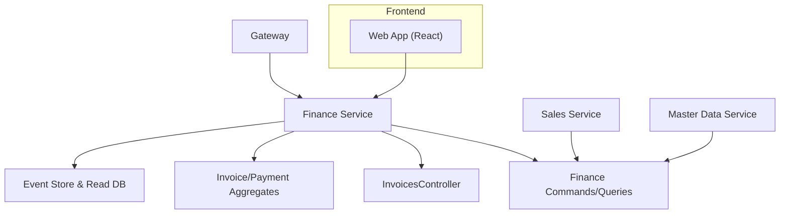
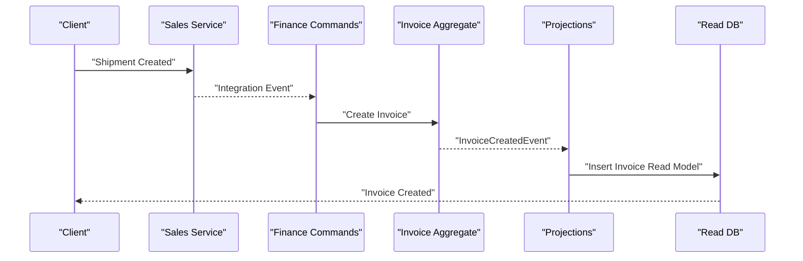
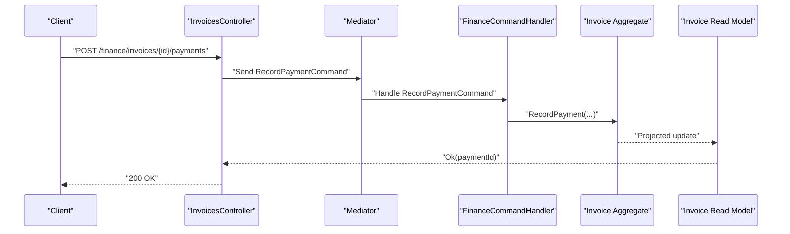
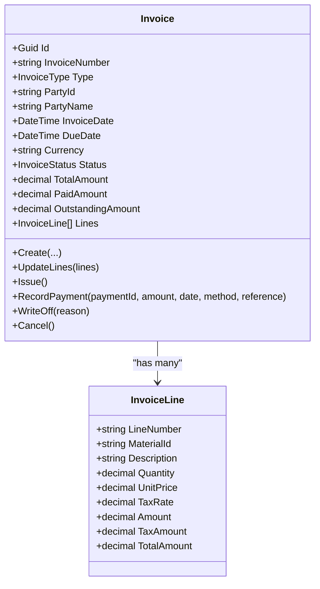
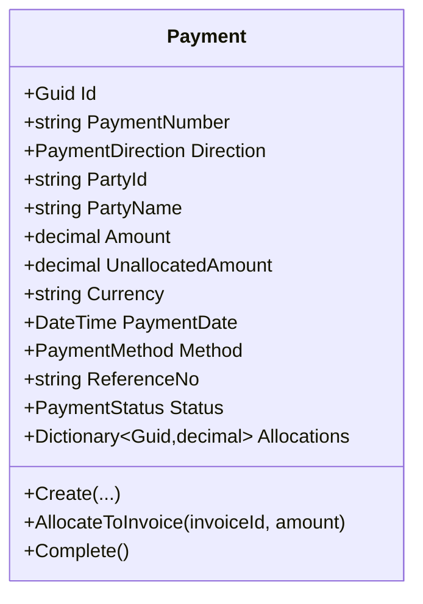
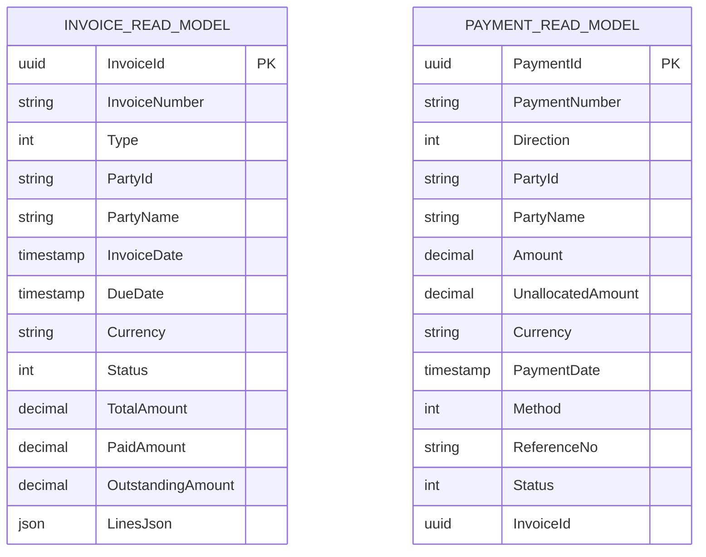
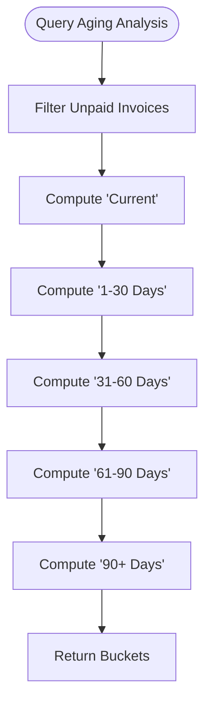
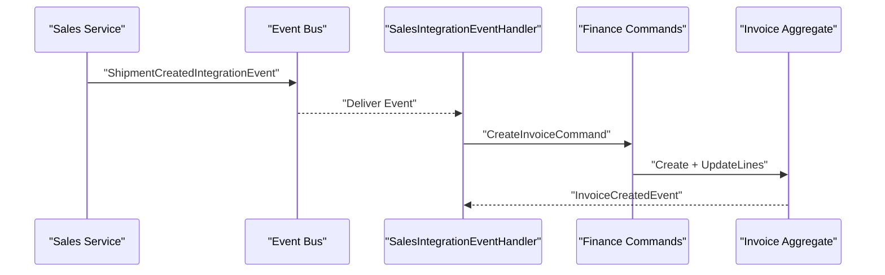

# Accounts Receivable API

<cite>
**Referenced Files in This Document**
- [README.md](file://README.md)
- [InvoicesController.cs](file://src/Services/Finance/ErpSystem.Finance/API/InvoicesController.cs)
- [FinanceController.cs](file://src/Services/Finance/ErpSystem.Finance/Controllers/FinanceController.cs)
- [InvoiceAggregate.cs](file://src/Services/Finance/ErpSystem.Finance/Domain/InvoiceAggregate.cs)
- [PaymentAggregate.cs](file://src/Services/Finance/ErpSystem.Finance/Domain/PaymentAggregate.cs)
- [Persistence.cs](file://src/Services/Finance/ErpSystem.Finance/Infrastructure/Persistence.cs)
- [FinanceCommands.cs](file://src/Services/Finance/ErpSystem.Finance/Application/FinanceCommands.cs)
- [FinanceQueries.cs](file://src/Services/Finance/ErpSystem.Finance/Application/FinanceQueries.cs)
- [IntegrationEventHandlers.cs](file://src/Services/Finance/ErpSystem.Finance/Application/IntegrationEventHandlers.cs)
- [SalesOrderAggregate.cs](file://src/Services/Sales/ErpSystem.Sales/Application/SalesQueries.cs)
- [CustomerAggregate.cs](file://src/Services/MasterData/ErpSystem.MasterData/Domain/CustomerAggregate.cs)
- [Finance.tsx](file://src/Web/ErpSystem.Web/src/pages/Finance.tsx)
</cite>

## Table of Contents
1. [Introduction](#introduction)
2. [Project Structure](#project-structure)
3. [Core Components](#core-components)
4. [Architecture Overview](#architecture-overview)
5. [Detailed Component Analysis](#detailed-component-analysis)
6. [Dependency Analysis](#dependency-analysis)
7. [Performance Considerations](#performance-considerations)
8. [Troubleshooting Guide](#troubleshooting-guide)
9. [Conclusion](#conclusion)
10. [Appendices](#appendices)

## Introduction
This document provides comprehensive API documentation for Accounts Receivable within the Finance microservice. It covers customer invoicing, receivable management, cash application, automated billing, payment tracking, aging analysis, collection workflows, credit memo processing, invoice disputes, and bad debt provisions. It also documents integration with Sales Orders, shipping, and Customer Management, along with tax calculation, discount processing, and multi-currency support. Examples include recurring billing, subscription invoicing, and multi-currency transactions. The documentation is grounded in the actual codebase and highlights real endpoints, data models, and workflows.

## Project Structure
The Accounts Receivable functionality resides primarily in the Finance service, with integrations to Sales and Master Data services. The Finance service exposes REST APIs for invoice lifecycle management and reporting, persists domain events for auditability, and projects read models for efficient querying.

**Diagram sources**
- [README.md](file://README.md#L130-L183)
- [InvoicesController.cs](file://src/Services/Finance/ErpSystem.Finance/API/InvoicesController.cs#L10-L73)
- [FinanceCommands.cs](file://src/Services/Finance/ErpSystem.Finance/Application/FinanceCommands.cs#L45-L142)
- [FinanceQueries.cs](file://src/Services/Finance/ErpSystem.Finance/Application/FinanceQueries.cs#L23-L159)

**Section sources**
- [README.md](file://README.md#L130-L183)

## Core Components
- InvoicesController: Exposes REST endpoints for invoice creation, issuance, cancellation, write-off, payment recording, and reporting.
- Invoice aggregate: Manages invoice lifecycle, validations, totals, and status transitions.
- Payment aggregate: Manages incoming payments, allocations, and completion.
- Read models and projections: Persist invoice and payment snapshots for fast querying and reporting.
- Queries: Provide aging analysis, overdue invoices, and dashboard statistics.
- Integration handlers: Automatically create invoices upon shipment and orchestrate cross-service workflows.

**Section sources**
- [InvoicesController.cs](file://src/Services/Finance/ErpSystem.Finance/API/InvoicesController.cs#L10-L73)
- [InvoiceAggregate.cs](file://src/Services/Finance/ErpSystem.Finance/Domain/InvoiceAggregate.cs#L67-L175)
- [PaymentAggregate.cs](file://src/Services/Finance/ErpSystem.Finance/Domain/PaymentAggregate.cs#L38-L121)
- [Persistence.cs](file://src/Services/Finance/ErpSystem.Finance/Infrastructure/Persistence.cs#L52-L131)
- [FinanceQueries.cs](file://src/Services/Finance/ErpSystem.Finance/Application/FinanceQueries.cs#L17-L159)
- [IntegrationEventHandlers.cs](file://src/Services/Finance/ErpSystem.Finance/Application/IntegrationEventHandlers.cs#L6-L31)

## Architecture Overview
The Finance service follows CQRS and Event Sourcing. Commands mutate aggregates and publish domain events; projections update read models; queries serve read-side requests. Integration events from Sales trigger invoice creation automatically.

**Diagram sources**
- [IntegrationEventHandlers.cs](file://src/Services/Finance/ErpSystem.Finance/Application/IntegrationEventHandlers.cs#L8-L31)
- [InvoiceAggregate.cs](file://src/Services/Finance/ErpSystem.Finance/Domain/InvoiceAggregate.cs#L85-L90)
- [Persistence.cs](file://src/Services/Finance/ErpSystem.Finance/Infrastructure/Persistence.cs#L17-L34)

## Detailed Component Analysis

### Invoices API
Endpoints for invoice lifecycle and reporting.

- POST /api/v1/finance/invoices
  - Purpose: Create a draft invoice.
  - Request body: CreateInvoiceCommand with number, type, party info, dates, currency, and lines.
  - Response: Invoice identifier.

- GET /api/v1/finance/invoices
  - Purpose: List all invoices (read model).
  - Response: Array of InvoiceReadModel.

- GET /api/v1/finance/invoices/{id}
  - Purpose: Retrieve a specific invoice.
  - Response: InvoiceReadModel.

- POST /api/v1/finance/invoices/{id}/issue
  - Purpose: Issue a draft invoice.
  - Response: No Content.

- POST /api/v1/finance/invoices/{id}/cancel
  - Purpose: Cancel a draft or issued invoice (no payments).
  - Response: No Content.

- POST /api/v1/finance/invoices/{id}/write-off
  - Purpose: Write off an issued or partially paid invoice.
  - Response: No Content.

- POST /api/v1/finance/invoices/{id}/payments
  - Purpose: Record a payment against an invoice.
  - Request body: RecordPaymentCommand with amount, date, method, reference.
  - Response: Payment identifier.

- GET /api/v1/finance/invoices/{id}/payments
  - Purpose: List payments applied to an invoice.
  - Response: Array of PaymentReadModel.

- GET /api/v1/finance/invoices/aging-analysis
  - Purpose: Receivable aging analysis by buckets.
  - Query params: type, asOf, partyId.
  - Response: Array of AgingBucket.

- GET /api/v1/finance/invoices/overdue
  - Purpose: Overdue invoices filtered by type and party.
  - Query params: type, asOf, partyId.
  - Response: Array of InvoiceReadModel.

**Diagram sources**
- [InvoicesController.cs](file://src/Services/Finance/ErpSystem.Finance/API/InvoicesController.cs#L47-L53)
- [FinanceCommands.cs](file://src/Services/Finance/ErpSystem.Finance/Application/FinanceCommands.cs#L116-L125)
- [InvoiceAggregate.cs](file://src/Services/Finance/ErpSystem.Finance/Domain/InvoiceAggregate.cs#L110-L122)

**Section sources**
- [InvoicesController.cs](file://src/Services/Finance/ErpSystem.Finance/API/InvoicesController.cs#L10-L73)
- [FinanceController.cs](file://src/Services/Finance/ErpSystem.Finance/Controllers/FinanceController.cs#L9-L38)
- [FinanceCommands.cs](file://src/Services/Finance/ErpSystem.Finance/Application/FinanceCommands.cs#L31-L43)
- [FinanceQueries.cs](file://src/Services/Finance/ErpSystem.Finance/Application/FinanceQueries.cs#L17-L22)

### Invoice Aggregate
Core business logic for invoice management.

- Types and statuses:
  - InvoiceType: Accounts Receivable, Accounts Payable.
  - InvoiceStatus: Draft, Issued, Partially Paid, Fully Paid, Written Off, Cancelled.

- Key operations:
  - Create: Initializes a draft invoice.
  - UpdateLines: Allowed only on drafts.
  - Issue: Validates draft and positive total; transitions to Issued.
  - RecordPayment: Validates status, amount, and outstanding; updates paid/remaining and status.
  - WriteOff: Transitions to Written Off for issued/partially paid.
  - Cancel: Allowed only on draft/issued with zero payments.

- Value objects:
  - InvoiceLine: quantity, unit price, tax rate; computes amount, tax, total.

**Diagram sources**
- [InvoiceAggregate.cs](file://src/Services/Finance/ErpSystem.Finance/Domain/InvoiceAggregate.cs#L67-L175)

**Section sources**
- [InvoiceAggregate.cs](file://src/Services/Finance/ErpSystem.Finance/Domain/InvoiceAggregate.cs#L5-L175)

### Payment Aggregate
Manages incoming payments and allocations.

- PaymentDirection: Incoming (AR), Outgoing (AP).
- PaymentStatus: Draft, Completed, Failed, Voided.
- Key operations:
  - Create: Initializes a payment with amount and unallocated balance.
  - AllocateToInvoice: Allocates part of the payment to an invoice.
  - Complete: Marks payment as completed.

**Diagram sources**
- [PaymentAggregate.cs](file://src/Services/Finance/ErpSystem.Finance/Domain/PaymentAggregate.cs#L38-L121)

**Section sources**
- [PaymentAggregate.cs](file://src/Services/Finance/ErpSystem.Finance/Domain/PaymentAggregate.cs#L5-L121)

### Read Models and Projection
Read models enable fast querying and reporting.

- InvoiceReadModel: Includes invoice metadata, amounts, status, and serialized lines.
- PaymentReadModel: Includes payment metadata, allocations, and optional invoice linkage.
- Projections handle domain events to update read models.

**Diagram sources**
- [Persistence.cs](file://src/Services/Finance/ErpSystem.Finance/Infrastructure/Persistence.cs#L52-L84)

**Section sources**
- [Persistence.cs](file://src/Services/Finance/ErpSystem.Finance/Infrastructure/Persistence.cs#L52-L131)

### Aging Analysis and Overdue Invoices
- AgingReport: Buckets for Current, 1–30 Days, 31–60 Days, 61–90 Days, 90+ Days.
- Queries:
  - GetAgingReportQuery: Computes totals and counts per bucket.
  - GetAgingAnalysisQuery: Same logic with optional party filter.
  - GetOverdueInvoicesQuery: Returns overdue invoices filtered by type and party.

**Diagram sources**
- [FinanceQueries.cs](file://src/Services/Finance/ErpSystem.Finance/Application/FinanceQueries.cs#L55-L97)

**Section sources**
- [FinanceQueries.cs](file://src/Services/Finance/ErpSystem.Finance/Application/FinanceQueries.cs#L17-L109)

### Automated Billing from Sales
- Integration handler listens for shipment-created events and auto-creates AR invoices with predefined lines and tax rates.
- Invoices are created with customer identifiers and due dates derived from shipment events.

**Diagram sources**
- [IntegrationEventHandlers.cs](file://src/Services/Finance/ErpSystem.Finance/Application/IntegrationEventHandlers.cs#L8-L31)

**Section sources**
- [IntegrationEventHandlers.cs](file://src/Services/Finance/ErpSystem.Finance/Application/IntegrationEventHandlers.cs#L6-L31)

### Frontend Integration Example
- The web app consumes invoices and aging reports from Finance endpoints to render dashboards and payment actions.

**Section sources**
- [Finance.tsx](file://src/Web/ErpSystem.Web/src/pages/Finance.tsx#L21-L58)

## Dependency Analysis
- Finance depends on:
  - Domain aggregates (Invoice, Payment) for business logic.
  - Application commands/queries for orchestration.
  - Event store and read database for persistence and projections.
- Integrations:
  - Sales publishes shipment events consumed by Finance to auto-generate invoices.
  - Master Data provides customer credit and address information (used conceptually).

**Diagram sources**
- [IntegrationEventHandlers.cs](file://src/Services/Finance/ErpSystem.Finance/Application/IntegrationEventHandlers.cs#L6-L31)
- [README.md](file://README.md#L130-L183)

**Section sources**
- [IntegrationEventHandlers.cs](file://src/Services/Finance/ErpSystem.Finance/Application/IntegrationEventHandlers.cs#L6-L31)
- [README.md](file://README.md#L130-L183)

## Performance Considerations
- CQRS and projection-based read models reduce query latency for invoices and payments.
- Pagination in queries supports large datasets.
- Event sourcing enables historical auditing and temporal queries without impacting read performance.
- Recommendation: Index read model columns frequently queried (e.g., PartyId, Status, DueDate) to optimize aging and overdue reports.

[No sources needed since this section provides general guidance]

## Troubleshooting Guide
Common issues and resolutions:
- Invoice not issued:
  - Ensure status is Draft and total > 0 before issuing.
  - Validate due date and currency alignment.

- Payment errors:
  - Payments cannot exceed outstanding amount.
  - Payments cannot be recorded on cancelled/written-off/draft invoices.
  - Unallocated payments must be fully allocated before write-off or cancellation.

- Aging report discrepancies:
  - Verify filters (type, partyId, asOf) and status conditions.
  - Confirm read model projections are up to date after invoice/payment changes.

**Section sources**
- [InvoiceAggregate.cs](file://src/Services/Finance/ErpSystem.Finance/Domain/InvoiceAggregate.cs#L100-L140)
- [PaymentAggregate.cs](file://src/Services/Finance/ErpSystem.Finance/Domain/PaymentAggregate.cs#L72-L87)
- [FinanceQueries.cs](file://src/Services/Finance/ErpSystem.Finance/Application/FinanceQueries.cs#L55-L109)

## Conclusion
The Finance service delivers a robust Accounts Receivable solution with clear lifecycle management, automated billing, comprehensive reporting, and strong integration points. The documented APIs and workflows provide a solid foundation for building customer invoicing, cash application, aging analysis, and collection automation while supporting multi-currency and subscription-style invoicing patterns.

[No sources needed since this section summarizes without analyzing specific files]

## Appendices

### API Definitions

- Create Invoice
  - Method: POST
  - Path: /api/v1/finance/invoices
  - Body: CreateInvoiceCommand
  - Response: InvoiceId

- Issue Invoice
  - Method: POST
  - Path: /api/v1/finance/invoices/{id}/issue
  - Response: No Content

- Cancel Invoice
  - Method: POST
  - Path: /api/v1/finance/invoices/{id}/cancel
  - Response: No Content

- Write Off Invoice
  - Method: POST
  - Path: /api/v1/finance/invoices/{id}/write-off
  - Body: string reason
  - Response: No Content

- Record Payment
  - Method: POST
  - Path: /api/v1/finance/invoices/{id}/payments
  - Body: RecordPaymentCommand
  - Response: PaymentId

- List Payments for Invoice
  - Method: GET
  - Path: /api/v1/finance/invoices/{id}/payments
  - Response: Array of PaymentReadModel

- Aging Analysis
  - Method: GET
  - Path: /api/v1/finance/invoices/aging-analysis
  - Query: type, asOf, partyId
  - Response: Array of AgingBucket

- Overdue Invoices
  - Method: GET
  - Path: /api/v1/finance/invoices/overdue
  - Query: type, asOf, partyId
  - Response: Array of InvoiceReadModel

**Section sources**
- [InvoicesController.cs](file://src/Services/Finance/ErpSystem.Finance/API/InvoicesController.cs#L13-L72)
- [FinanceController.cs](file://src/Services/Finance/ErpSystem.Finance/Controllers/FinanceController.cs#L11-L30)

### Data Models

- InvoiceReadModel
  - Fields: InvoiceId, InvoiceNumber, Type, PartyId, PartyName, InvoiceDate, DueDate, Currency, Status, TotalAmount, PaidAmount, OutstandingAmount, LinesJson

- PaymentReadModel
  - Fields: PaymentId, PaymentNumber, Direction, PartyId, PartyName, Amount, UnallocatedAmount, Currency, PaymentDate, Method, ReferenceNo, Status, InvoiceId

**Section sources**
- [Persistence.cs](file://src/Services/Finance/ErpSystem.Finance/Infrastructure/Persistence.cs#L52-L84)

### Integration Notes
- Multi-currency: Invoices and payments support configurable currency; ensure consistent currency handling across Sales and Finance.
- Discounts: Invoice lines compute line amounts using discount rates; apply at line level during invoice creation.
- Taxes: Invoice lines include tax rate; totals reflect tax calculations.
- Collections: Aging buckets and overdue endpoints support collection workflow automation.

**Section sources**
- [InvoiceAggregate.cs](file://src/Services/Finance/ErpSystem.Finance/Domain/InvoiceAggregate.cs#L28-L33)
- [IntegrationEventHandlers.cs](file://src/Services/Finance/ErpSystem.Finance/Application/IntegrationEventHandlers.cs#L10-L19)