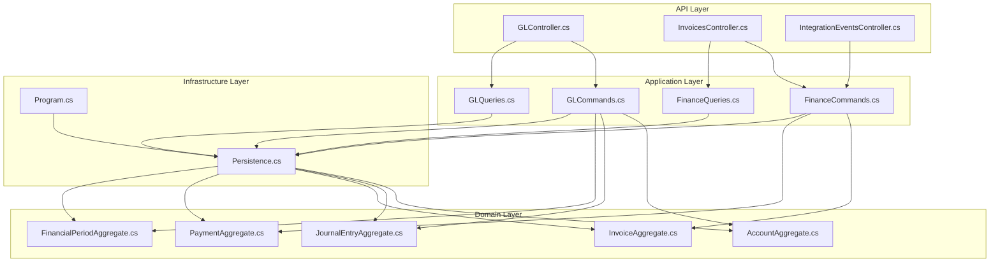
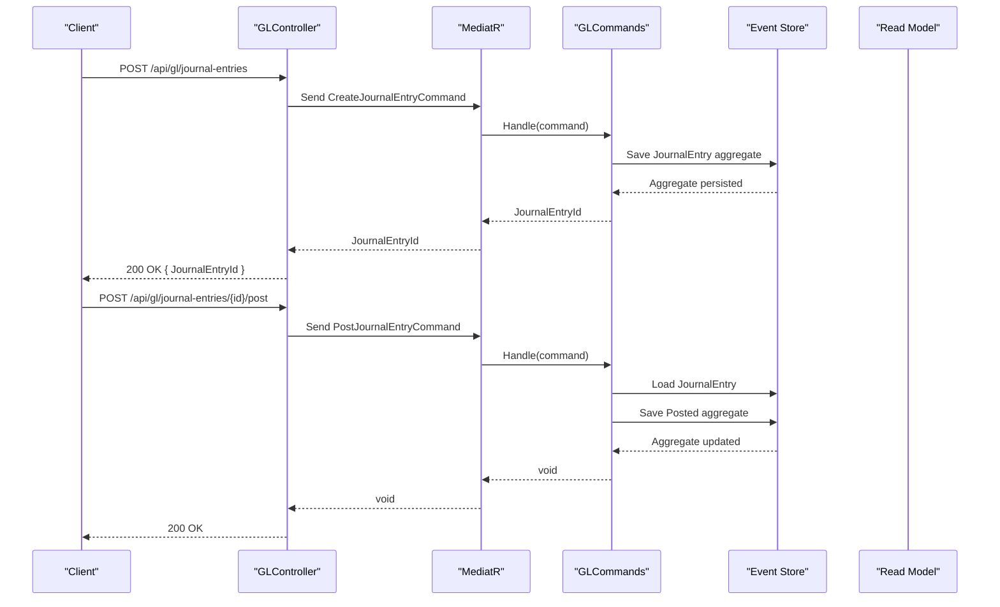
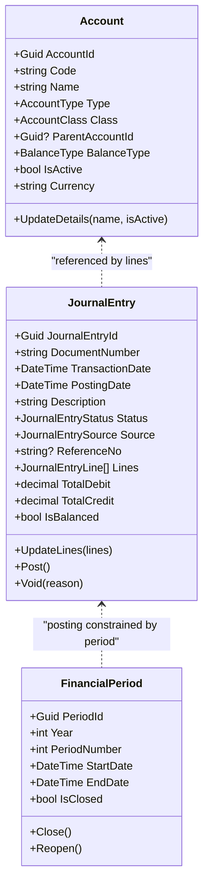
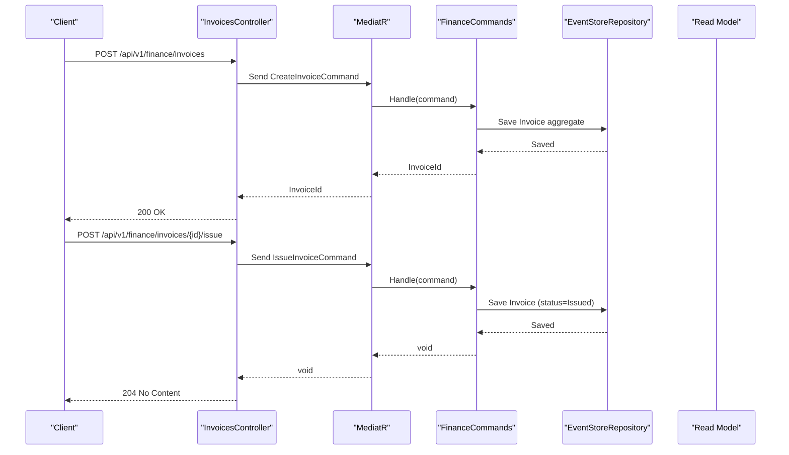
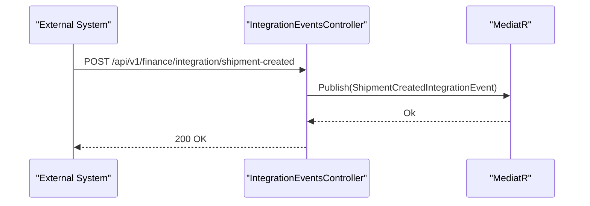
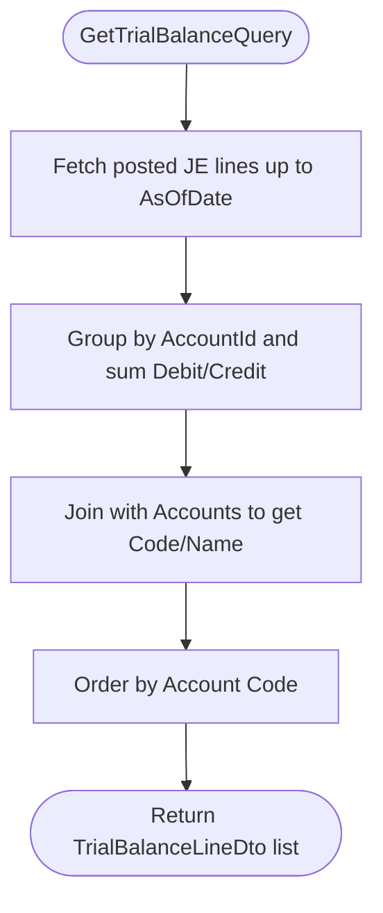
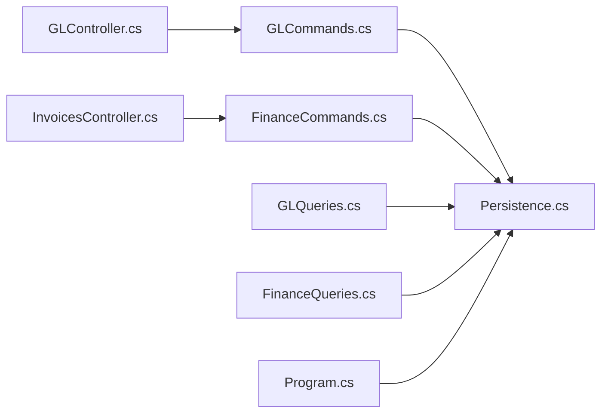
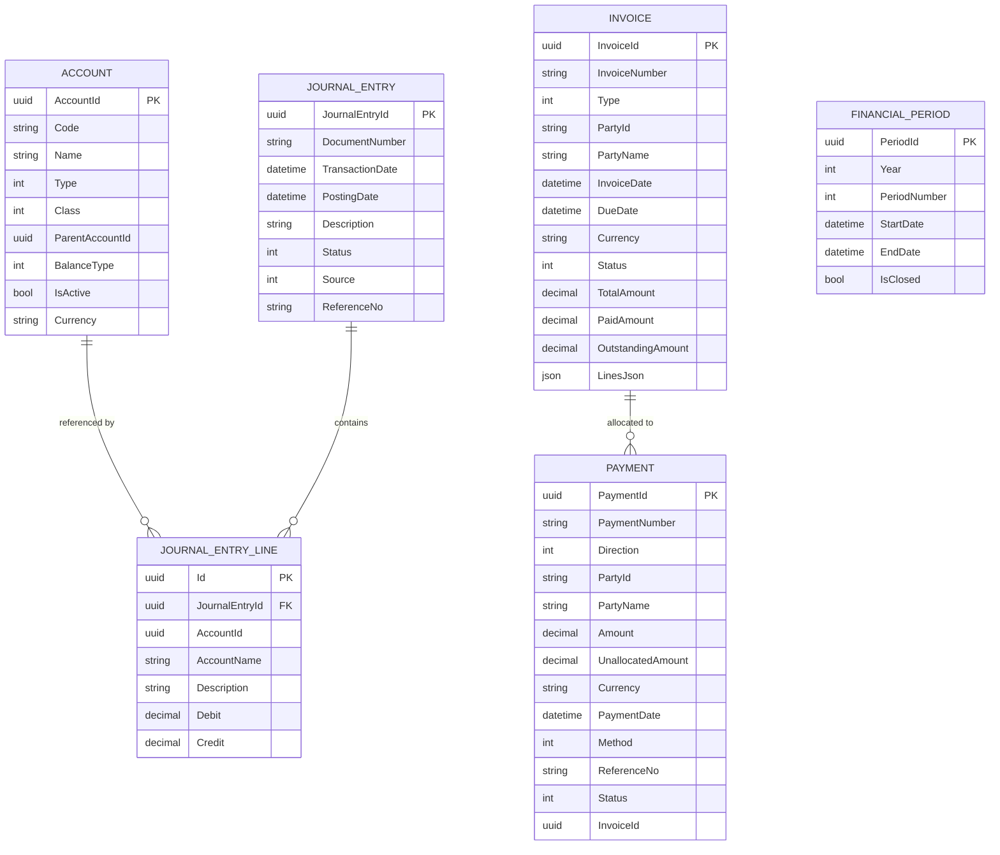

# Finance Service API

<cite>
**Referenced Files in This Document**
- [Program.cs](file://src/Services/Finance/ErpSystem.Finance/Program.cs)
- [ErpSystem.Finance.http](file://src/Services/Finance/ErpSystem.Finance/ErpSystem.Finance.http)
- [GLController.cs](file://src/Services/Finance/ErpSystem.Finance/API/GLController.cs)
- [InvoicesController.cs](file://src/Services/Finance/ErpSystem.Finance/API/InvoicesController.cs)
- [IntegrationEventsController.cs](file://src/Services/Finance/ErpSystem.Finance/API/IntegrationEventsController.cs)
- [GLCommands.cs](file://src/Services/Finance/ErpSystem.Finance/Application/GLCommands.cs)
- [GLQueries.cs](file://src/Services/Finance/ErpSystem.Finance/Application/GLQueries.cs)
- [FinanceCommands.cs](file://src/Services/Finance/ErpSystem.Finance/Application/FinanceCommands.cs)
- [FinanceQueries.cs](file://src/Services/Finance/ErpSystem.Finance/Application/FinanceQueries.cs)
- [AccountAggregate.cs](file://src/Services/Finance/ErpSystem.Finance/Domain/AccountAggregate.cs)
- [JournalEntryAggregate.cs](file://src/Services/Finance/ErpSystem.Finance/Domain/JournalEntryAggregate.cs)
- [InvoiceAggregate.cs](file://src/Services/Finance/ErpSystem.Finance/Domain/InvoiceAggregate.cs)
- [PaymentAggregate.cs](file://src/Services/Finance/ErpSystem.Finance/Domain/PaymentAggregate.cs)
- [FinancialPeriodAggregate.cs](file://src/Services/Finance/ErpSystem.Finance/Domain/FinancialPeriodAggregate.cs)
- [Persistence.cs](file://src/Services/Finance/ErpSystem.Finance/Infrastructure/Persistence.cs)
</cite>

## Table of Contents
1. [Introduction](#introduction)
2. [Project Structure](#project-structure)
3. [Core Components](#core-components)
4. [Architecture Overview](#architecture-overview)
5. [Detailed Component Analysis](#detailed-component-analysis)
6. [Dependency Analysis](#dependency-analysis)
7. [Performance Considerations](#performance-considerations)
8. [Troubleshooting Guide](#troubleshooting-guide)
9. [Conclusion](#conclusion)
10. [Appendices](#appendices)

## Introduction
This document provides comprehensive API documentation for the Finance service, focusing on general ledger, accounts payable/receivable, and financial reporting. It covers journal entry creation and posting, account reconciliation, invoice processing, payment management, financial period handling, chart of accounts management, financial statement generation, and real-time financial analytics. It also outlines integrations with external accounting systems, tax calculation endpoints, and currency conversion APIs, along with examples of financial workflow automation, approval processes, compliance reporting, data validation, audit trails, and multi-currency support.

## Project Structure
The Finance service follows a clean architecture with clear separation of concerns:
- API layer: Controllers expose HTTP endpoints for GL, invoices, and integration events.
- Application layer: CQRS commands and queries orchestrate domain logic and coordinate projections.
- Domain layer: Aggregates encapsulate business rules and state transitions.
- Infrastructure layer: Event store and read models provide persistence and projections.

**Diagram sources**
- [Program.cs](file://src/Services/Finance/ErpSystem.Finance/Program.cs#L11-L74)
- [GLController.cs](file://src/Services/Finance/ErpSystem.Finance/API/GLController.cs#L10-L75)
- [InvoicesController.cs](file://src/Services/Finance/ErpSystem.Finance/API/InvoicesController.cs#L11-L73)
- [IntegrationEventsController.cs](file://src/Services/Finance/ErpSystem.Finance/API/IntegrationEventsController.cs#L8-L17)
- [GLCommands.cs](file://src/Services/Finance/ErpSystem.Finance/Application/GLCommands.cs#L24-L97)
- [GLQueries.cs](file://src/Services/Finance/ErpSystem.Finance/Application/GLQueries.cs#L19-L79)
- [FinanceCommands.cs](file://src/Services/Finance/ErpSystem.Finance/Application/FinanceCommands.cs#L45-L141)
- [FinanceQueries.cs](file://src/Services/Finance/ErpSystem.Finance/Application/FinanceQueries.cs#L23-L109)
- [AccountAggregate.cs](file://src/Services/Finance/ErpSystem.Finance/Domain/AccountAggregate.cs#L41-L86)
- [JournalEntryAggregate.cs](file://src/Services/Finance/ErpSystem.Finance/Domain/JournalEntryAggregate.cs#L55-L135)
- [InvoiceAggregate.cs](file://src/Services/Finance/ErpSystem.Finance/Domain/InvoiceAggregate.cs#L67-L175)
- [PaymentAggregate.cs](file://src/Services/Finance/ErpSystem.Finance/Domain/PaymentAggregate.cs#L38-L121)
- [FinancialPeriodAggregate.cs](file://src/Services/Finance/ErpSystem.Finance/Domain/FinancialPeriodAggregate.cs#L25-L72)
- [Persistence.cs](file://src/Services/Finance/ErpSystem.Finance/Infrastructure/Persistence.cs#L6-L131)

**Section sources**
- [Program.cs](file://src/Services/Finance/ErpSystem.Finance/Program.cs#L11-L74)
- [ErpSystem.Finance.http](file://src/Services/Finance/ErpSystem.Finance/ErpSystem.Finance.http#L1-L7)

## Core Components
- General Ledger (GL): Chart of accounts management, journal entry creation and posting, trial balance reporting, and financial period handling.
- Accounts Receivable/AP: Invoice lifecycle (create, issue, cancel, write-off), payment recording, aging analysis, and overdue reports.
- Integration: Publishes and consumes integration events to coordinate with other services.
- Data Access: Event store for domain events and read models for reporting.

Key capabilities:
- Event-sourced aggregates for immutable audit trails.
- Projection-based read models for efficient querying.
- Strong typing via enums for statuses, types, and classifications.
- Multi-currency support at the account and transaction level.

**Section sources**
- [GLController.cs](file://src/Services/Finance/ErpSystem.Finance/API/GLController.cs#L10-L75)
- [InvoicesController.cs](file://src/Services/Finance/ErpSystem.Finance/API/InvoicesController.cs#L11-L73)
- [IntegrationEventsController.cs](file://src/Services/Finance/ErpSystem.Finance/API/IntegrationEventsController.cs#L8-L17)
- [GLCommands.cs](file://src/Services/Finance/ErpSystem.Finance/Application/GLCommands.cs#L24-L97)
- [FinanceCommands.cs](file://src/Services/Finance/ErpSystem.Finance/Application/FinanceCommands.cs#L45-L141)
- [Persistence.cs](file://src/Services/Finance/ErpSystem.Finance/Infrastructure/Persistence.cs#L6-L131)

## Architecture Overview
The Finance service uses CQRS with event sourcing:
- Commands trigger domain events that mutate aggregates.
- Projections update read models for fast reads.
- Controllers expose REST endpoints mapped to commands and queries.

**Diagram sources**
- [GLController.cs](file://src/Services/Finance/ErpSystem.Finance/API/GLController.cs#L26-L45)
- [GLCommands.cs](file://src/Services/Finance/ErpSystem.Finance/Application/GLCommands.cs#L54-L79)
- [Persistence.cs](file://src/Services/Finance/ErpSystem.Finance/Infrastructure/Persistence.cs#L6-L18)

## Detailed Component Analysis

### General Ledger Endpoints
- Chart of Accounts Management
  - Define account: Creates a new ledger account with code, name, type, class, parent, balance type, and currency.
  - Update account: Updates name and active status.
  - Retrieve accounts: Returns ordered list of accounts for display/reporting.
- Journal Entry Management
  - Create journal entry: Accepts document number, dates, description, source, optional reference, and lines with account, description, debit, credit.
  - Post journal entry: Validates balance and status, then posts the entry.
  - Get journal entry: Retrieves header and lines by ID.
  - Trial balance: Computes debit/credit totals up to a given date.
- Financial Period Management
  - Define period: Creates a period with year, period number, start/end dates.
  - Close period: Closes a defined period.

**Diagram sources**
- [AccountAggregate.cs](file://src/Services/Finance/ErpSystem.Finance/Domain/AccountAggregate.cs#L41-L86)
- [JournalEntryAggregate.cs](file://src/Services/Finance/ErpSystem.Finance/Domain/JournalEntryAggregate.cs#L55-L135)
- [FinancialPeriodAggregate.cs](file://src/Services/Finance/ErpSystem.Finance/Domain/FinancialPeriodAggregate.cs#L25-L72)

**Section sources**
- [GLController.cs](file://src/Services/Finance/ErpSystem.Finance/API/GLController.cs#L12-L74)
- [GLCommands.cs](file://src/Services/Finance/ErpSystem.Finance/Application/GLCommands.cs#L9-L97)
- [GLQueries.cs](file://src/Services/Finance/ErpSystem.Finance/Application/GLQueries.cs#L8-L79)
- [AccountAggregate.cs](file://src/Services/Finance/ErpSystem.Finance/Domain/AccountAggregate.cs#L41-L86)
- [JournalEntryAggregate.cs](file://src/Services/Finance/ErpSystem.Finance/Domain/JournalEntryAggregate.cs#L55-L135)
- [FinancialPeriodAggregate.cs](file://src/Services/Finance/ErpSystem.Finance/Domain/FinancialPeriodAggregate.cs#L25-L72)

### Accounts Receivable and Payable Endpoints
- Invoice Lifecycle
  - Create invoice: Number, type (AR/AP), party, dates, currency, and lines with material/product, quantity, unit price, tax rate.
  - Issue invoice: Marks invoice as issued.
  - Cancel invoice: Cancels draft or issued invoices (no payments recorded).
  - Write off invoice: Writes off issued/partially paid invoices with a reason.
  - Get invoices: Paginated listing.
  - Get invoice by ID: Single invoice details.
- Payment Management
  - Record payment against invoice: Records payment with amount, date, method, and reference.
  - Register payment: Creates a payment (incoming/outgoing) optionally allocating to an invoice.
  - Get payments: Paginated listing.
  - Get payments for invoice: Lists payments linked to an invoice.
- Aging and Overdue Reports
  - Aging analysis: Buckets unpaid invoices by due date ranges.
  - Overdue invoices: Filters invoices past due date.

**Diagram sources**
- [InvoicesController.cs](file://src/Services/Finance/ErpSystem.Finance/API/InvoicesController.cs#L13-L38)
- [FinanceCommands.cs](file://src/Services/Finance/ErpSystem.Finance/Application/FinanceCommands.cs#L53-L113)

**Section sources**
- [InvoicesController.cs](file://src/Services/Finance/ErpSystem.Finance/API/InvoicesController.cs#L13-L73)
- [FinanceCommands.cs](file://src/Services/Finance/ErpSystem.Finance/Application/FinanceCommands.cs#L7-L141)
- [FinanceQueries.cs](file://src/Services/Finance/ErpSystem.Finance/Application/FinanceQueries.cs#L7-L109)
- [InvoiceAggregate.cs](file://src/Services/Finance/ErpSystem.Finance/Domain/InvoiceAggregate.cs#L67-L175)
- [PaymentAggregate.cs](file://src/Services/Finance/ErpSystem.Finance/Domain/PaymentAggregate.cs#L38-L121)

### Integration Events Endpoint
- Handles integration events from external systems (e.g., shipment creation) by publishing them through the mediator for downstream processing.

**Diagram sources**
- [IntegrationEventsController.cs](file://src/Services/Finance/ErpSystem.Finance/API/IntegrationEventsController.cs#L10-L16)

**Section sources**
- [IntegrationEventsController.cs](file://src/Services/Finance/ErpSystem.Finance/API/IntegrationEventsController.cs#L8-L17)

### Financial Statement Generation
- Trial Balance: Summarizes debit/credit totals per account up to a specified date by joining posted journal entry lines with headers.
- Aging Analysis: Computes buckets for current, 1–30 days, 31–60 days, 61–90 days, and 90+ days based on due dates.
- Overdue Invoices: Lists invoices past due date filtered optionally by party.

**Diagram sources**
- [GLQueries.cs](file://src/Services/Finance/ErpSystem.Finance/Application/GLQueries.cs#L38-L78)

**Section sources**
- [GLQueries.cs](file://src/Services/Finance/ErpSystem.Finance/Application/GLQueries.cs#L12-L79)
- [FinanceQueries.cs](file://src/Services/Finance/ErpSystem.Finance/Application/FinanceQueries.cs#L54-L108)

### Real-Time Financial Analytics
- Read models are projected from domain events for near-real-time reporting.
- The analytics service (external to Finance) subscribes to events and maintains dashboards and forecasts.

[No sources needed since this section provides general guidance]

## Dependency Analysis
- Controllers depend on MediatR to dispatch commands and queries.
- Handlers depend on event stores and read databases for persistence and projections.
- Domain aggregates emit events that drive projections and downstream integrations.
- The service integrates with Dapr for event bus and uses PostgreSQL with JSONB for event payloads.

**Diagram sources**
- [Program.cs](file://src/Services/Finance/ErpSystem.Finance/Program.cs#L20-L49)
- [GLController.cs](file://src/Services/Finance/ErpSystem.Finance/API/GLController.cs#L10-L75)
- [InvoicesController.cs](file://src/Services/Finance/ErpSystem.Finance/API/InvoicesController.cs#L11-L73)
- [GLCommands.cs](file://src/Services/Finance/ErpSystem.Finance/Application/GLCommands.cs#L24-L97)
- [FinanceCommands.cs](file://src/Services/Finance/ErpSystem.Finance/Application/FinanceCommands.cs#L45-L141)
- [GLQueries.cs](file://src/Services/Finance/ErpSystem.Finance/Application/GLQueries.cs#L19-L79)
- [FinanceQueries.cs](file://src/Services/Finance/ErpSystem.Finance/Application/FinanceQueries.cs#L23-L109)
- [Persistence.cs](file://src/Services/Finance/ErpSystem.Finance/Infrastructure/Persistence.cs#L6-L131)

**Section sources**
- [Program.cs](file://src/Services/Finance/ErpSystem.Finance/Program.cs#L20-L49)
- [Persistence.cs](file://src/Services/Finance/ErpSystem.Finance/Infrastructure/Persistence.cs#L6-L131)

## Performance Considerations
- Prefer projection-based read models for reporting to avoid heavy joins on the event store.
- Use indexed columns (e.g., JournalEntryId, AccountId) in read models to optimize queries.
- Batch and paginate queries for invoices and payments to limit payload sizes.
- Offload analytics to a dedicated analytics service to reduce Finance API latency.

[No sources needed since this section provides general guidance]

## Troubleshooting Guide
Common issues and resolutions:
- Journal Entry Posting Failures
  - Unbalanced entries: Ensure debits equal credits before posting.
  - Non-draft status: Only draft entries can be posted; void or re-create as needed.
  - Empty entries: Entries must have positive amounts.
- Invoice Operations
  - Cannot modify non-draft invoices: Revert to draft or void before editing.
  - Payment exceeds outstanding: Adjust payment amount or allocate partial payments.
  - Cancel conflicts: Cannot cancel invoices with existing payments.
- Aging and Overdue Reports
  - Unexpected bucketing: Verify due dates and filtering parameters (party ID, as-of date).
- Integration Events
  - Event delivery failures: Confirm mediator publish and Dapr event bus configuration.

**Section sources**
- [JournalEntryAggregate.cs](file://src/Services/Finance/ErpSystem.Finance/Domain/JournalEntryAggregate.cs#L87-L107)
- [InvoiceAggregate.cs](file://src/Services/Finance/ErpSystem.Finance/Domain/InvoiceAggregate.cs#L100-L140)
- [FinanceCommands.cs](file://src/Services/Finance/ErpSystem.Finance/Application/FinanceCommands.cs#L115-L124)
- [IntegrationEventsController.cs](file://src/Services/Finance/ErpSystem.Finance/API/IntegrationEventsController.cs#L10-L16)

## Conclusion
The Finance service provides a robust, event-driven foundation for financial operations with strong auditability, multi-currency support, and extensible integrations. Its CQRS and event-sourcing design enables scalable reporting, real-time analytics, and seamless alignment with external systems.

[No sources needed since this section summarizes without analyzing specific files]

## Appendices

### API Definitions

- General Ledger
  - POST /api/gl/accounts
    - Body: DefineAccountCommand
    - Response: 201 Created with AccountId
  - GET /api/gl/accounts
    - Response: 200 OK with list of accounts
  - POST /api/gl/journal-entries
    - Body: CreateJournalEntryCommand
    - Response: 200 OK with JournalEntryId
  - POST /api/gl/journal-entries/{id}/post
    - Path: id
    - Response: 200 OK on success, 400 Bad Request on validation errors
  - GET /api/gl/journal-entries/{id}
    - Path: id
    - Response: 200 OK with header and lines, or 404 Not Found
  - GET /api/gl/reports/trial-balance?asOfDate={date}
    - Query: asOfDate (optional)
    - Response: 200 OK with trial balance lines
  - POST /api/gl/periods
    - Body: DefineFinancialPeriodCommand
    - Response: 200 OK with PeriodId
  - POST /api/gl/periods/{id}/close
    - Path: id
    - Response: 200 OK

- Invoices
  - POST /api/v1/finance/invoices
    - Body: CreateInvoiceCommand
    - Response: 200 OK with InvoiceId
  - GET /api/v1/finance/invoices
    - Response: 200 OK with paginated invoices
  - GET /api/v1/finance/invoices/{id}
    - Path: id
    - Response: 200 OK with invoice details
  - POST /api/v1/finance/invoices/{id}/issue
    - Path: id
    - Response: 204 No Content
  - POST /api/v1/finance/invoices/{id}/cancel
    - Path: id
    - Response: 204 No Content
  - POST /api/v1/finance/invoices/{id}/write-off
    - Path: id
    - Body: reason (string)
    - Response: 204 No Content
  - POST /api/v1/finance/invoices/{id}/payments
    - Path: id
    - Body: RecordPaymentCommand
    - Response: 200 OK with PaymentId
  - GET /api/v1/finance/invoices/{id}/payments
    - Path: id
    - Response: 200 OK with payments
  - GET /api/v1/finance/invoices/aging-analysis?type={type}&asOf={date}&partyId={partyId}
    - Query: type, asOf, partyId
    - Response: 200 OK with aging buckets
  - GET /api/v1/finance/invoices/overdue?type={type}&asOf={date}&partyId={partyId}
    - Query: type, asOf, partyId
    - Response: 200 OK with overdue invoices

- Integration Events
  - POST /api/v1/finance/integration/shipment-created
    - Body: ShipmentCreatedIntegrationEvent
    - Response: 200 OK

**Section sources**
- [GLController.cs](file://src/Services/Finance/ErpSystem.Finance/API/GLController.cs#L12-L74)
- [InvoicesController.cs](file://src/Services/Finance/ErpSystem.Finance/API/InvoicesController.cs#L13-L73)
- [IntegrationEventsController.cs](file://src/Services/Finance/ErpSystem.Finance/API/IntegrationEventsController.cs#L10-L16)

### Data Models

**Diagram sources**
- [Persistence.cs](file://src/Services/Finance/ErpSystem.Finance/Infrastructure/Persistence.cs#L52-L131)

### Financial Workflows and Automation Examples
- Journal Entry Approval Workflow
  - Draft creation: Create journal entry with initial lines.
  - Validation: Balance check and period open status.
  - Approval: External approval process triggers posting.
  - Posting: Post journal entry; event updates read model for reporting.
- Invoice Payment Automation
  - Create invoice and issue automatically.
  - Register payment with allocation to invoice.
  - Aging report triggers collection reminders.
- Compliance Reporting
  - Use trial balance and aging reports for regulatory submissions.
  - Maintain audit trail via event-sourced aggregates.

[No sources needed since this section provides general guidance]

### Tax Calculation and Currency Conversion
- Tax Calculation
  - Invoice lines include tax rate; total and tax amount computed per line.
  - Use tax rate and quantity/unit price to derive tax per line.
- Currency Conversion
  - Multi-currency support at account and transaction level.
  - Store base currency and convert rates externally; apply conversions during reporting or analytics.

[No sources needed since this section provides general guidance]