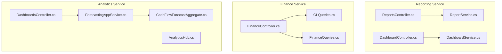
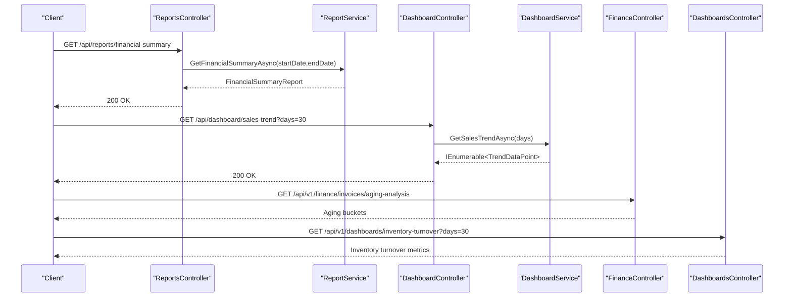
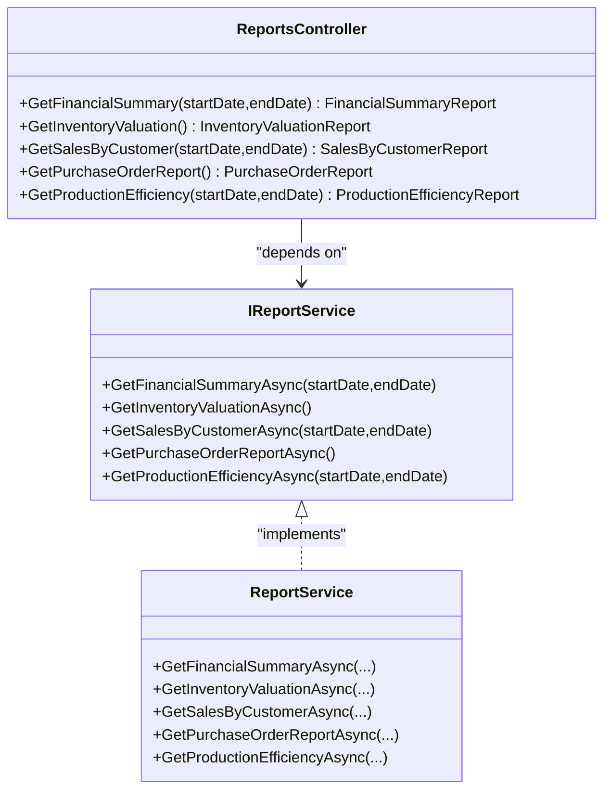
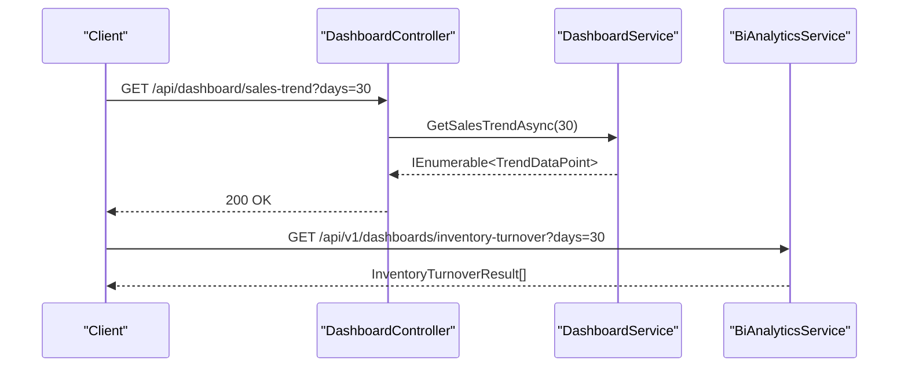
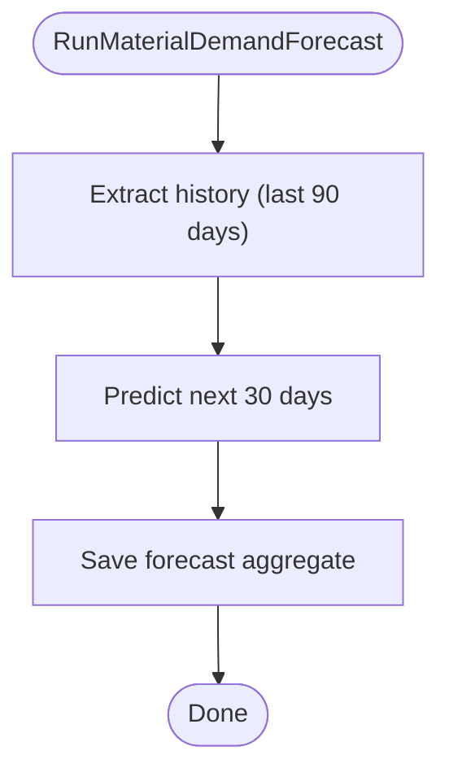
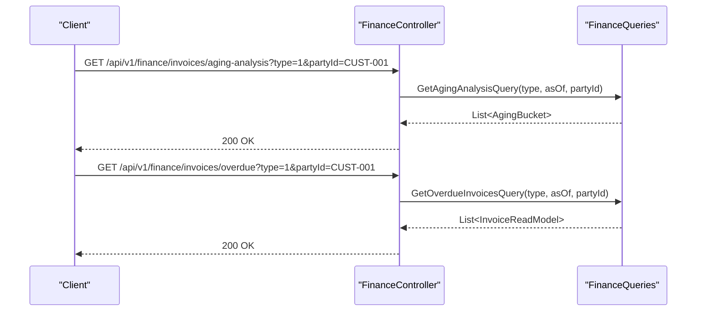
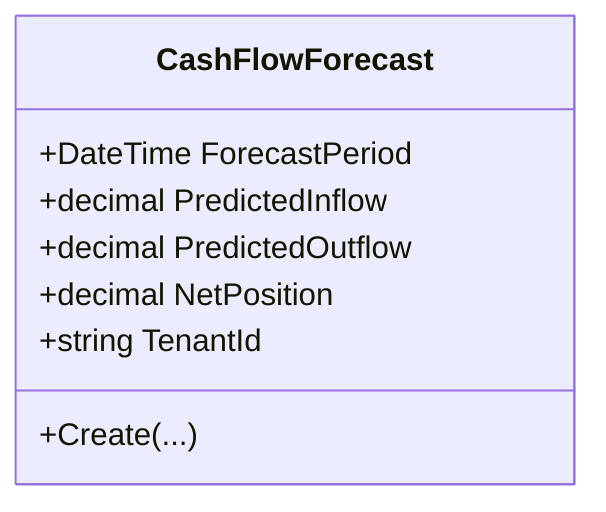
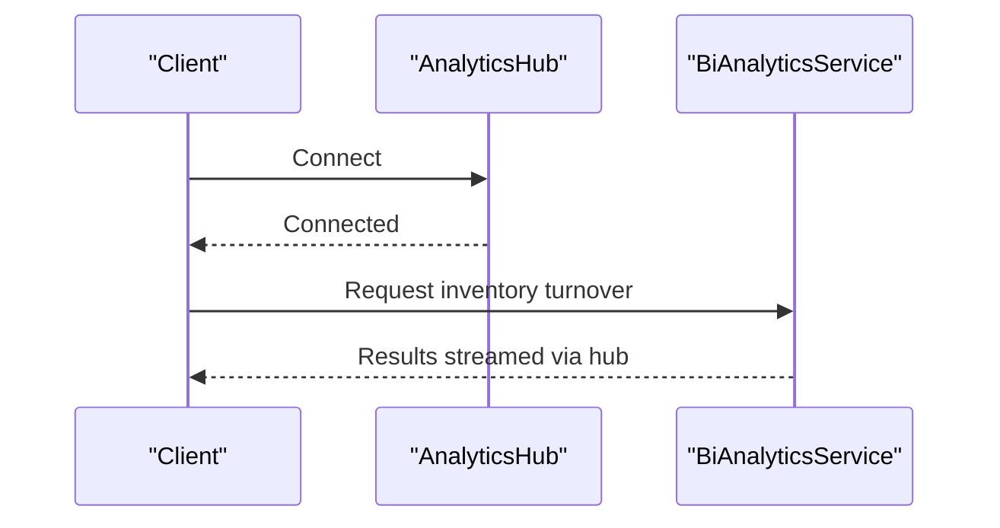
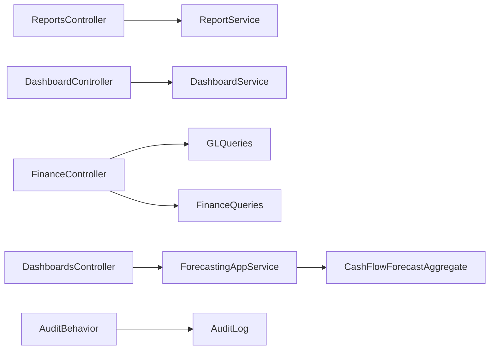

# Financial Reporting API

<cite>
**Referenced Files in This Document**
- [ReportsController.cs](file://src/Services/Reporting/ErpSystem.Reporting/Controllers/ReportsController.cs)
- [DashboardController.cs](file://src/Services/Reporting/ErpSystem.Reporting/Controllers/DashboardController.cs)
- [ReportService.cs](file://src/Services/Reporting/ErpSystem.Reporting/Application/ReportService.cs)
- [DashboardService.cs](file://src/Services/Reporting/ErpSystem.Reporting/Application/DashboardService.cs)
- [FinanceController.cs](file://src/Services/Finance/ErpSystem.Finance/Controllers/FinanceController.cs)
- [GLQueries.cs](file://src/Services/Finance/ErpSystem.Finance/Application/GLQueries.cs)
- [FinanceQueries.cs](file://src/Services/Finance/ErpSystem.Finance/Application/FinanceQueries.cs)
- [DashboardsController.cs](file://src/Services/Analytics/ErpSystem.Analytics/API/DashboardsController.cs)
- [AnalyticsHub.cs](file://src/Services/Analytics/ErpSystem.Analytics/API/Hubs/AnalyticsHub.cs)
- [ForecastingAppService.cs](file://src/Services/Analytics/ErpSystem.Analytics/Application/ForecastingAppService.cs)
- [CashFlowForecastAggregate.cs](file://src/Services/Analytics/ErpSystem.Analytics/Domain/CashFlowForecastAggregate.cs)
- [AuditLog.cs](file://src/BuildingBlocks/ErpSystem.BuildingBlocks/Auditing/AuditLog.cs)
</cite>

## Table of Contents
1. [Introduction](#introduction)
2. [Project Structure](#project-structure)
3. [Core Components](#core-components)
4. [Architecture Overview](#architecture-overview)
5. [Detailed Component Analysis](#detailed-component-analysis)
6. [Dependency Analysis](#dependency-analysis)
7. [Performance Considerations](#performance-considerations)
8. [Security and Compliance](#security-and-compliance)
9. [Troubleshooting Guide](#troubleshooting-guide)
10. [Conclusion](#conclusion)

## Introduction
This document provides comprehensive API documentation for Financial Reporting endpoints, focusing on financial statements, analytics, and compliance reporting. It covers:
- Financial statement generation (income and balance-like summaries)
- Real-time dashboards and KPI tracking
- Trend analysis and forecasting
- Variance and aging analysis
- Drill-down reports and executive summaries
- Integration patterns with external systems
- Security, access control, and audit trail requirements

The APIs are implemented as part of the Reporting, Finance, and Analytics microservices, with supporting building blocks for auditing and multi-tenancy.

## Project Structure
The Financial Reporting capability spans three primary areas:
- Reporting service: exposes financial summary, inventory valuation, sales by customer, purchase orders, and production efficiency reports
- Finance service: provides invoice/payment operations, aging analysis, and dashboard statistics
- Analytics service: supports real-time dashboards, trend data, and predictive forecasting

**Diagram sources**
- [ReportsController.cs](file://src/Services/Reporting/ErpSystem.Reporting/Controllers/ReportsController.cs#L1-L71)
- [DashboardController.cs](file://src/Services/Reporting/ErpSystem.Reporting/Controllers/DashboardController.cs#L1-L59)
- [ReportService.cs](file://src/Services/Reporting/ErpSystem.Reporting/Application/ReportService.cs#L1-L105)
- [DashboardService.cs](file://src/Services/Reporting/ErpSystem.Reporting/Application/DashboardService.cs#L1-L93)
- [FinanceController.cs](file://src/Services/Finance/ErpSystem.Finance/Controllers/FinanceController.cs#L1-L79)
- [GLQueries.cs](file://src/Services/Finance/ErpSystem.Finance/Application/GLQueries.cs#L1-L80)
- [FinanceQueries.cs](file://src/Services/Finance/ErpSystem.Finance/Application/FinanceQueries.cs#L1-L173)
- [DashboardsController.cs](file://src/Services/Analytics/ErpSystem.Analytics/API/DashboardsController.cs#L1-L26)
- [AnalyticsHub.cs](file://src/Services/Analytics/ErpSystem.Analytics/API/Hubs/AnalyticsHub.cs#L1-L13)
- [ForecastingAppService.cs](file://src/Services/Analytics/ErpSystem.Analytics/Application/ForecastingAppService.cs#L1-L42)
- [CashFlowForecastAggregate.cs](file://src/Services/Analytics/ErpSystem.Analytics/Domain/CashFlowForecastAggregate.cs#L1-L43)

**Section sources**
- [ReportsController.cs](file://src/Services/Reporting/ErpSystem.Reporting/Controllers/ReportsController.cs#L1-L71)
- [DashboardController.cs](file://src/Services/Reporting/ErpSystem.Reporting/Controllers/DashboardController.cs#L1-L59)
- [FinanceController.cs](file://src/Services/Finance/ErpSystem.Finance/Controllers/FinanceController.cs#L1-L79)

## Core Components
- Reporting Controllers
  - GET /api/reports/financial-summary
  - GET /api/reports/inventory-valuation
  - GET /api/reports/sales-by-customer
  - GET /api/reports/purchase-orders
  - GET /api/reports/production-efficiency
- Dashboard Controllers
  - GET /api/dashboard/summary
  - GET /api/dashboard/sales-trend
  - GET /api/dashboard/inventory-status
  - GET /api/dashboard/top-products
  - GET /api/dashboard/recent-activities
- Finance Controllers
  - POST /api/v1/finance/invoices/{id}/issue
  - POST /api/v1/finance/invoices/{id}/cancel
  - POST /api/v1/finance/invoices/{id}/write-off
  - POST /api/v1/finance/invoices/{id}/payments
  - GET /api/v1/finance/invoices/aging-analysis
  - GET /api/v1/finance/invoices/overdue
  - GET /api/v1/finance/stats/dashboard
  - GET /api/v1/finance/reports/aging
- Analytics Controllers
  - GET /api/v1/dashboards/inventory-turnover
  - GET /api/v1/dashboards/oee

**Section sources**
- [ReportsController.cs](file://src/Services/Reporting/ErpSystem.Reporting/Controllers/ReportsController.cs#L10-L71)
- [DashboardController.cs](file://src/Services/Reporting/ErpSystem.Reporting/Controllers/DashboardController.cs#L10-L59)
- [FinanceController.cs](file://src/Services/Finance/ErpSystem.Finance/Controllers/FinanceController.cs#L11-L75)
- [DashboardsController.cs](file://src/Services/Analytics/ErpSystem.Analytics/API/DashboardsController.cs#L10-L24)

## Architecture Overview
The Financial Reporting APIs follow a layered architecture:
- Controllers expose HTTP endpoints
- Application services encapsulate business logic
- Queries and projections support read-side operations
- Analytics services provide real-time and predictive insights
- Audit logs capture compliance-relevant events

**Diagram sources**
- [ReportsController.cs](file://src/Services/Reporting/ErpSystem.Reporting/Controllers/ReportsController.cs#L13-L22)
- [ReportService.cs](file://src/Services/Reporting/ErpSystem.Reporting/Application/ReportService.cs#L16-L34)
- [DashboardController.cs](file://src/Services/Reporting/ErpSystem.Reporting/Controllers/DashboardController.cs#L23-L28)
- [DashboardService.cs](file://src/Services/Reporting/ErpSystem.Reporting/Application/DashboardService.cs#L39-L53)
- [FinanceController.cs](file://src/Services/Finance/ErpSystem.Finance/Controllers/FinanceController.cs#L39-L45)
- [DashboardsController.cs](file://src/Services/Analytics/ErpSystem.Analytics/API/DashboardsController.cs#L10-L16)

## Detailed Component Analysis

### Financial Statements and Reports
- Financial Summary Report
  - Purpose: Consolidated revenue, cost, profit, margin, and revenue breakdown by category
  - Endpoint: GET /api/reports/financial-summary
  - Parameters: startDate (optional), endDate (optional)
  - Implementation: ReportService.GetFinancialSummaryAsync
- Inventory Valuation Report
  - Purpose: Inventory value, item counts, and per-item valuation
  - Endpoint: GET /api/reports/inventory-valuation
  - Implementation: ReportService.GetInventoryValuationAsync
- Sales by Customer Report
  - Purpose: Customer-level sales aggregation with percentages
  - Endpoint: GET /api/reports/sales-by-customer
  - Parameters: startDate (optional), endDate (optional)
  - Implementation: ReportService.GetSalesByCustomerAsync
- Purchase Order Status Report
  - Purpose: PO counts, statuses, and total value
  - Endpoint: GET /api/reports/purchase-orders
  - Implementation: ReportService.GetPurchaseOrderReportAsync
- Production Efficiency Report
  - Purpose: On-time completion, delays, and average lead time
  - Endpoint: GET /api/reports/production-efficiency
  - Parameters: startDate (optional), endDate (optional)
  - Implementation: ReportService.GetProductionEfficiencyAsync

**Diagram sources**
- [ReportsController.cs](file://src/Services/Reporting/ErpSystem.Reporting/Controllers/ReportsController.cs#L8-L71)
- [ReportService.cs](file://src/Services/Reporting/ErpSystem.Reporting/Application/ReportService.cs#L5-L12)

**Section sources**
- [ReportsController.cs](file://src/Services/Reporting/ErpSystem.Reporting/Controllers/ReportsController.cs#L13-L71)
- [ReportService.cs](file://src/Services/Reporting/ErpSystem.Reporting/Application/ReportService.cs#L16-L103)

### Real-Time Dashboards and KPI Tracking
- Dashboard Summary
  - Purpose: Executive KPIs (revenue, orders, inventory value, low stock, pending POs, active production orders)
  - Endpoint: GET /api/dashboard/summary
  - Implementation: DashboardService.GetSummaryAsync
- Sales Trend
  - Purpose: Time series data for charting
  - Endpoint: GET /api/dashboard/sales-trend?days=30
  - Implementation: DashboardService.GetSalesTrendAsync
- Inventory Status by Category
  - Purpose: Inventory composition and stock levels
  - Endpoint: GET /api/dashboard/inventory-status
  - Implementation: DashboardService.GetInventoryStatusAsync
- Top Products
  - Purpose: Best-selling SKUs
  - Endpoint: GET /api/dashboard/top-products?count=10
  - Implementation: DashboardService.GetTopProductsAsync
- Recent Activities
  - Purpose: Cross-module activity feed
  - Endpoint: GET /api/dashboard/recent-activities?count=20
  - Implementation: DashboardService.GetRecentActivitiesAsync

**Diagram sources**
- [DashboardController.cs](file://src/Services/Reporting/ErpSystem.Reporting/Controllers/DashboardController.cs#L13-L58)
- [DashboardService.cs](file://src/Services/Reporting/ErpSystem.Reporting/Application/DashboardService.cs#L22-L91)
- [DashboardsController.cs](file://src/Services/Analytics/ErpSystem.Analytics/API/DashboardsController.cs#L10-L16)

**Section sources**
- [DashboardController.cs](file://src/Services/Reporting/ErpSystem.Reporting/Controllers/DashboardController.cs#L13-L58)
- [DashboardService.cs](file://src/Services/Reporting/ErpSystem.Reporting/Application/DashboardService.cs#L22-L91)

### Trend Analysis and Forecasting
- Trend Data Generation
  - DashboardService generates synthetic time series for sales trend visualization
- Predictive Analytics
  - ForecastingAppService orchestrates demand forecasting using historical movements and a forecasting engine
  - Stores forecast aggregates for later retrieval and reconciliation

**Diagram sources**
- [ForecastingAppService.cs](file://src/Services/Analytics/ErpSystem.Analytics/Application/ForecastingAppService.cs#L18-L40)

**Section sources**
- [DashboardService.cs](file://src/Services/Reporting/ErpSystem.Reporting/Application/DashboardService.cs#L39-L53)
- [ForecastingAppService.cs](file://src/Services/Analytics/ErpSystem.Analytics/Application/ForecastingAppService.cs#L18-L40)

### Variance Analysis and Aging Reports
- Aging Analysis
  - FinanceController exposes endpoints for aging analysis and overdue invoices
  - FinanceQueries computes buckets and overdue lists
- Variance Analysis
  - Not implemented in the current code; can be built on top of trial balance and period-end projections

**Diagram sources**
- [FinanceController.cs](file://src/Services/Finance/ErpSystem.Finance/Controllers/FinanceController.cs#L39-L45)
- [FinanceQueries.cs](file://src/Services/Finance/ErpSystem.Finance/Application/FinanceQueries.cs#L74-L109)

**Section sources**
- [FinanceController.cs](file://src/Services/Finance/ErpSystem.Finance/Controllers/FinanceController.cs#L39-L45)
- [FinanceQueries.cs](file://src/Services/Finance/ErpSystem.Finance/Application/FinanceQueries.cs#L55-L109)

### Cash Flow and Balance Sheet Projections
- Trial Balance
  - GLQueries calculates trial balance on-demand by aggregating posted journal entry lines
- Cash Flow Forecast
  - CashFlowForecastAggregate manages predicted inflows/outflows and net position

**Diagram sources**
- [CashFlowForecastAggregate.cs](file://src/Services/Analytics/ErpSystem.Analytics/Domain/CashFlowForecastAggregate.cs#L8-L32)

**Section sources**
- [GLQueries.cs](file://src/Services/Finance/ErpSystem.Finance/Application/GLQueries.cs#L38-L78)
- [CashFlowForecastAggregate.cs](file://src/Services/Analytics/ErpSystem.Analytics/Domain/CashFlowForecastAggregate.cs#L8-L43)

### Drill-Down Analysis and Executive Summaries
- Drill-down
  - Use query parameters (e.g., dates, partyId) to narrow report scope
  - Combine reporting endpoints with analytics trend data for deeper insights
- Executive Summaries
  - Dashboard summary provides consolidated KPIs for quick decision-making

**Section sources**
- [ReportsController.cs](file://src/Services/Reporting/ErpSystem.Reporting/Controllers/ReportsController.cs#L13-L71)
- [DashboardController.cs](file://src/Services/Reporting/ErpSystem.Reporting/Controllers/DashboardController.cs#L13-L18)
- [FinanceQueries.cs](file://src/Services/Finance/ErpSystem.Finance/Application/FinanceQueries.cs#L111-L158)

### Integration with External Systems and Audit Trail
- External Reporting Systems
  - Use SignalR hub for real-time streaming (AnalyticsHub)
  - Expose standardized DTOs consumable by external clients
- Audit Trail
  - AuditLog captures entity changes with user, tenant, IP, and user-agent metadata
  - AuditBehavior automatically records auditable commands

**Diagram sources**
- [AnalyticsHub.cs](file://src/Services/Analytics/ErpSystem.Analytics/API/Hubs/AnalyticsHub.cs#L5-L12)

**Section sources**
- [AnalyticsHub.cs](file://src/Services/Analytics/ErpSystem.Analytics/API/Hubs/AnalyticsHub.cs#L5-L12)
- [AuditLog.cs](file://src/BuildingBlocks/ErpSystem.BuildingBlocks/Auditing/AuditLog.cs#L28-L53)

## Dependency Analysis
- Controllers depend on application services for business logic
- Application services rely on read models and projections for efficient reads
- Analytics services coordinate with forecasting engines and time-series extractors
- Audit behavior integrates across services to maintain compliance

**Diagram sources**
- [ReportsController.cs](file://src/Services/Reporting/ErpSystem.Reporting/Controllers/ReportsController.cs#L8-L8)
- [ReportService.cs](file://src/Services/Reporting/ErpSystem.Reporting/Application/ReportService.cs#L14-L14)
- [DashboardController.cs](file://src/Services/Reporting/ErpSystem.Reporting/Controllers/DashboardController.cs#L8-L8)
- [DashboardService.cs](file://src/Services/Reporting/ErpSystem.Reporting/Application/DashboardService.cs#L20-L20)
- [FinanceController.cs](file://src/Services/Finance/ErpSystem.Finance/Controllers/FinanceController.cs#L9-L9)
- [GLQueries.cs](file://src/Services/Finance/ErpSystem.Finance/Application/GLQueries.cs#L19-L19)
- [FinanceQueries.cs](file://src/Services/Finance/ErpSystem.Finance/Application/FinanceQueries.cs#L23-L23)
- [DashboardsController.cs](file://src/Services/Analytics/ErpSystem.Analytics/API/DashboardsController.cs#L8-L8)
- [ForecastingAppService.cs](file://src/Services/Analytics/ErpSystem.Analytics/Application/ForecastingAppService.cs#L10-L13)
- [CashFlowForecastAggregate.cs](file://src/Services/Analytics/ErpSystem.Analytics/Domain/CashFlowForecastAggregate.cs#L8-L8)
- [AuditLog.cs](file://src/BuildingBlocks/ErpSystem.BuildingBlocks/Auditing/AuditLog.cs#L65-L101)

**Section sources**
- [ReportsController.cs](file://src/Services/Reporting/ErpSystem.Reporting/Controllers/ReportsController.cs#L8-L8)
- [ReportService.cs](file://src/Services/Reporting/ErpSystem.Reporting/Application/ReportService.cs#L14-L14)
- [DashboardController.cs](file://src/Services/Reporting/ErpSystem.Reporting/Controllers/DashboardController.cs#L8-L8)
- [DashboardService.cs](file://src/Services/Reporting/ErpSystem.Reporting/Application/DashboardService.cs#L20-L20)
- [FinanceController.cs](file://src/Services/Finance/ErpSystem.Finance/Controllers/FinanceController.cs#L9-L9)
- [GLQueries.cs](file://src/Services/Finance/ErpSystem.Finance/Application/GLQueries.cs#L19-L19)
- [FinanceQueries.cs](file://src/Services/Finance/ErpSystem.Finance/Application/FinanceQueries.cs#L23-L23)
- [DashboardsController.cs](file://src/Services/Analytics/ErpSystem.Analytics/API/DashboardsController.cs#L8-L8)
- [ForecastingAppService.cs](file://src/Services/Analytics/ErpSystem.Analytics/Application/ForecastingAppService.cs#L10-L13)
- [CashFlowForecastAggregate.cs](file://src/Services/Analytics/ErpSystem.Analytics/Domain/CashFlowForecastAggregate.cs#L8-L8)
- [AuditLog.cs](file://src/BuildingBlocks/ErpSystem.BuildingBlocks/Auditing/AuditLog.cs#L65-L101)

## Performance Considerations
- Prefer read models and projections for reporting to avoid heavy joins
- Use pagination for large datasets (invoices, payments)
- Cache frequently accessed dashboard summaries
- Optimize trend calculations with indexed time-series data
- Implement background jobs for heavy analytics computations

## Security and Compliance
- Access Control
  - Enforce role-based access to sensitive financial data
  - Use tenant isolation for multi-tenant deployments
- Audit Trail
  - Capture all significant changes with AuditLog and AuditBehavior
  - Retain audit logs per regulatory requirements
- Data Protection
  - Encrypt sensitive financial data at rest and in transit
  - Apply data loss prevention (DLP) policies for exports

**Section sources**
- [AuditLog.cs](file://src/BuildingBlocks/ErpSystem.BuildingBlocks/Auditing/AuditLog.cs#L28-L53)
- [AuditLog.cs](file://src/BuildingBlocks/ErpSystem.BuildingBlocks/Auditing/AuditLog.cs#L65-L101)

## Troubleshooting Guide
- Reports return empty or stale data
  - Verify read models are up-to-date via projections
  - Check background job execution for analytics updates
- Aging analysis discrepancies
  - Confirm invoice statuses and due dates align with business rules
  - Validate party filters and date boundaries
- Dashboard trends appear inconsistent
  - Ensure deterministic seed for synthetic data during demos
  - Confirm time-series extraction window and aggregation logic

**Section sources**
- [DashboardService.cs](file://src/Services/Reporting/ErpSystem.Reporting/Application/DashboardService.cs#L41-L53)
- [FinanceQueries.cs](file://src/Services/Finance/ErpSystem.Finance/Application/FinanceQueries.cs#L55-L109)

## Conclusion
The Financial Reporting API suite delivers robust capabilities for financial statements, dashboards, analytics, and compliance. By leveraging controllers, application services, and analytics engines, it supports real-time insights, trend analysis, and drill-down reporting. Combined with audit logging and access controls, it meets modern requirements for transparency, security, and scalability.