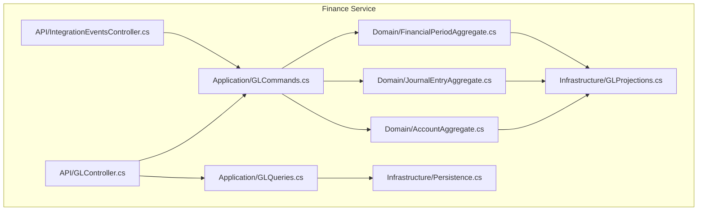
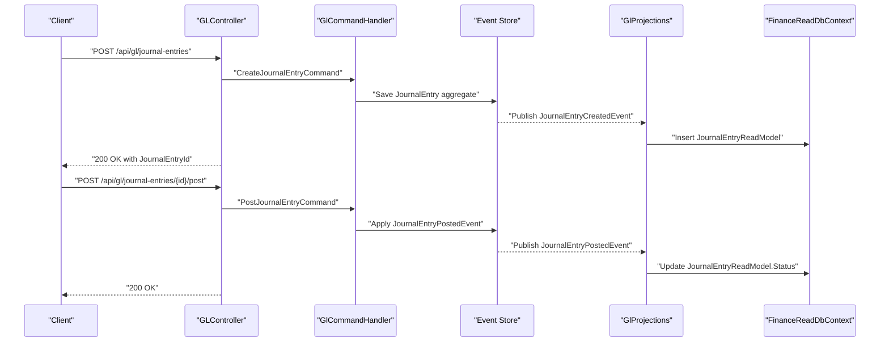
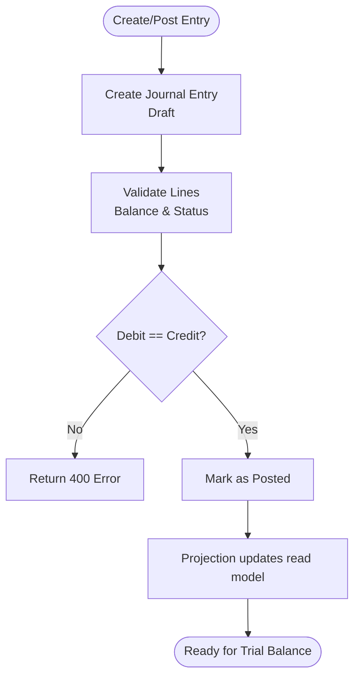
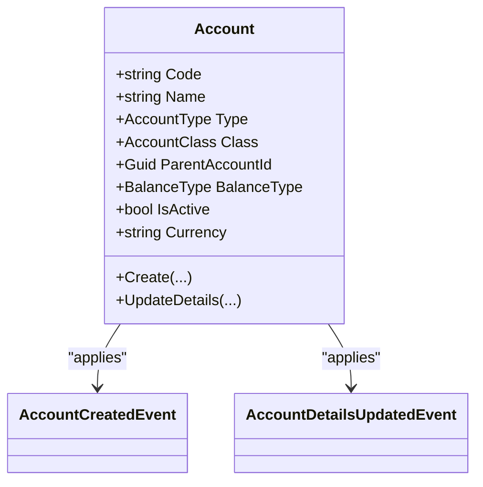
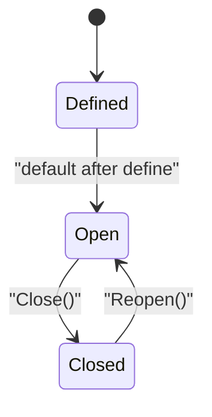
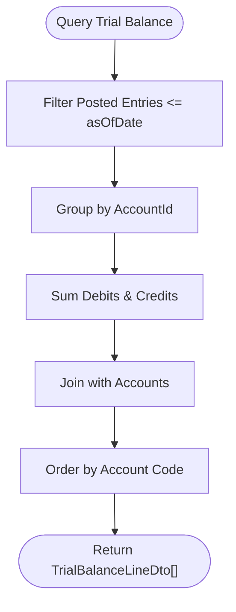
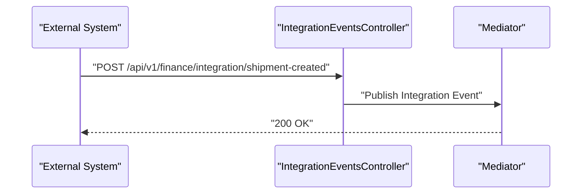
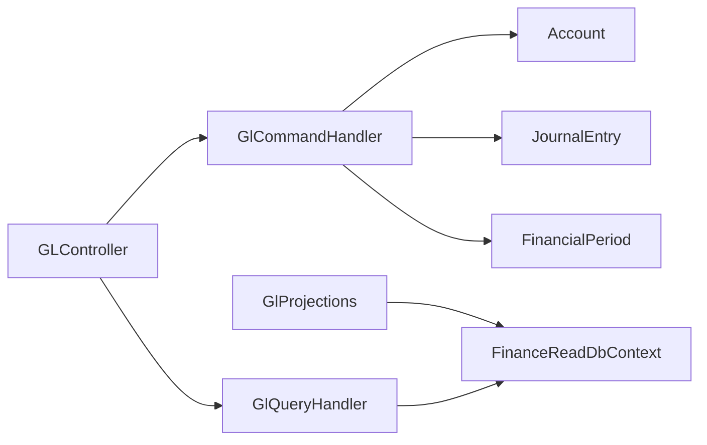

# General Ledger API

<cite>
**Referenced Files in This Document**
- [GLController.cs](file://src/Services/Finance/ErpSystem.Finance/API/GLController.cs)
- [GLCommands.cs](file://src/Services/Finance/ErpSystem.Finance/Application/GLCommands.cs)
- [GLQueries.cs](file://src/Services/Finance/ErpSystem.Finance/Application/GLQueries.cs)
- [AccountAggregate.cs](file://src/Services/Finance/ErpSystem.Finance/Domain/AccountAggregate.cs)
- [JournalEntryAggregate.cs](file://src/Services/Finance/ErpSystem.Finance/Domain/JournalEntryAggregate.cs)
- [FinancialPeriodAggregate.cs](file://src/Services/Finance/ErpSystem.Finance/Domain/FinancialPeriodAggregate.cs)
- [GLProjections.cs](file://src/Services/Finance/ErpSystem.Finance/Infrastructure/GLProjections.cs)
- [Persistence.cs](file://src/Services/Finance/ErpSystem.Finance/Infrastructure/Persistence.cs)
- [IntegrationEventsController.cs](file://src/Services/Finance/ErpSystem.Finance/API/IntegrationEventsController.cs)
- [FinanceController.cs](file://src/Services/Finance/ErpSystem.Finance/Controllers/FinanceController.cs)
- [GLTests.cs](file://src/Tests/ErpSystem.IntegrationTests/GLTests.cs)
</cite>

## Table of Contents
1. [Introduction](#introduction)
2. [Project Structure](#project-structure)
3. [Core Components](#core-components)
4. [Architecture Overview](#architecture-overview)
5. [Detailed Component Analysis](#detailed-component-analysis)
6. [Dependency Analysis](#dependency-analysis)
7. [Performance Considerations](#performance-considerations)
8. [Troubleshooting Guide](#troubleshooting-guide)
9. [Conclusion](#conclusion)
10. [Appendices](#appendices)

## Introduction
This document provides comprehensive API documentation for the General Ledger (GL) service endpoints. It covers journal entry creation, posting, and reversal operations; chart of accounts management including creation, updates, and hierarchy; financial period management; trial balance reporting; and integration points with external systems. It also outlines multi-currency considerations and compliance-ready reporting capabilities.

## Project Structure
The General Ledger service resides in the Finance microservice and follows a clean architecture with:
- API controllers exposing HTTP endpoints
- Application layer with commands, queries, and handlers
- Domain models implementing aggregates and value objects
- Infrastructure projecting domain events into read models for efficient querying
- Tests validating end-to-end workflows

**Diagram sources**
- [GLController.cs](file://src/Services/Finance/ErpSystem.Finance/API/GLController.cs#L10-L75)
- [GLCommands.cs](file://src/Services/Finance/ErpSystem.Finance/Application/GLCommands.cs#L24-L97)
- [GLQueries.cs](file://src/Services/Finance/ErpSystem.Finance/Application/GLQueries.cs#L19-L79)
- [AccountAggregate.cs](file://src/Services/Finance/ErpSystem.Finance/Domain/AccountAggregate.cs#L41-L86)
- [JournalEntryAggregate.cs](file://src/Services/Finance/ErpSystem.Finance/Domain/JournalEntryAggregate.cs#L55-L135)
- [FinancialPeriodAggregate.cs](file://src/Services/Finance/ErpSystem.Finance/Domain/FinancialPeriodAggregate.cs#L25-L72)
- [GLProjections.cs](file://src/Services/Finance/ErpSystem.Finance/Infrastructure/GLProjections.cs#L7-L149)
- [Persistence.cs](file://src/Services/Finance/ErpSystem.Finance/Infrastructure/Persistence.cs#L20-L131)
- [IntegrationEventsController.cs](file://src/Services/Finance/ErpSystem.Finance/API/IntegrationEventsController.cs#L8-L17)

**Section sources**
- [GLController.cs](file://src/Services/Finance/ErpSystem.Finance/API/GLController.cs#L10-L75)
- [GLCommands.cs](file://src/Services/Finance/ErpSystem.Finance/Application/GLCommands.cs#L24-L97)
- [GLQueries.cs](file://src/Services/Finance/ErpSystem.Finance/Application/GLQueries.cs#L19-L79)
- [Persistence.cs](file://src/Services/Finance/ErpSystem.Finance/Infrastructure/Persistence.cs#L20-L131)

## Core Components
- GLController: Exposes endpoints for chart of accounts, journal entries, posting, reversal, periods, and trial balance reports.
- GLCommands: Defines commands and handlers for creating accounts, updating account details, creating journal entries, posting entries, defining and closing financial periods.
- GLQueries: Defines queries and handlers for retrieving chart of accounts, journal entry details, and trial balance.
- Domain Aggregates: Account, JournalEntry, FinancialPeriod encapsulate business rules and state transitions.
- Projections: Convert domain events into read models for fast querying.
- Read Models: Persisted via FinanceReadDbContext for accounts, journal entries, lines, and financial periods.

Key responsibilities:
- Enforce business rules (balances, status transitions, period closure)
- Maintain auditability via event-sourced aggregates
- Provide real-time read models for reporting

**Section sources**
- [GLController.cs](file://src/Services/Finance/ErpSystem.Finance/API/GLController.cs#L10-L75)
- [GLCommands.cs](file://src/Services/Finance/ErpSystem.Finance/Application/GLCommands.cs#L8-L97)
- [GLQueries.cs](file://src/Services/Finance/ErpSystem.Finance/Application/GLQueries.cs#L8-L79)
- [AccountAggregate.cs](file://src/Services/Finance/ErpSystem.Finance/Domain/AccountAggregate.cs#L41-L86)
- [JournalEntryAggregate.cs](file://src/Services/Finance/ErpSystem.Finance/Domain/JournalEntryAggregate.cs#L55-L135)
- [FinancialPeriodAggregate.cs](file://src/Services/Finance/ErpSystem.Finance/Domain/FinancialPeriodAggregate.cs#L25-L72)
- [GLProjections.cs](file://src/Services/Finance/ErpSystem.Finance/Infrastructure/GLProjections.cs#L18-L149)
- [Persistence.cs](file://src/Services/Finance/ErpSystem.Finance/Infrastructure/Persistence.cs#L86-L131)

## Architecture Overview
The GL service uses CQRS with event sourcing:
- Commands mutate aggregates and publish domain events
- Projections translate events into read models
- Queries resolve against read models for performance

**Diagram sources**
- [GLController.cs](file://src/Services/Finance/ErpSystem.Finance/API/GLController.cs#L26-L45)
- [GLCommands.cs](file://src/Services/Finance/ErpSystem.Finance/Application/GLCommands.cs#L54-L79)
- [GLProjections.cs](file://src/Services/Finance/ErpSystem.Finance/Infrastructure/GLProjections.cs#L47-L103)
- [Persistence.cs](file://src/Services/Finance/ErpSystem.Finance/Infrastructure/Persistence.cs#L20-L49)

## Detailed Component Analysis

### Journal Entry Management
Endpoints:
- Create Journal Entry: POST /api/gl/journal-entries
- Post Journal Entry: POST /api/gl/journal-entries/{id}/post
- Get Journal Entry: GET /api/gl/journal-entries/{id}

Processing logic:
- Create validates DTO and persists a draft JournalEntry
- Post enforces balance and status checks before marking as Posted
- Get returns header and lines joined from read model

**Diagram sources**
- [JournalEntryAggregate.cs](file://src/Services/Finance/ErpSystem.Finance/Domain/JournalEntryAggregate.cs#L87-L99)
- [GLCommands.cs](file://src/Services/Finance/ErpSystem.Finance/Application/GLCommands.cs#L54-L79)
- [GLProjections.cs](file://src/Services/Finance/ErpSystem.Finance/Infrastructure/GLProjections.cs#L95-L103)

**Section sources**
- [GLController.cs](file://src/Services/Finance/ErpSystem.Finance/API/GLController.cs#L26-L53)
- [GLCommands.cs](file://src/Services/Finance/ErpSystem.Finance/Application/GLCommands.cs#L54-L79)
- [JournalEntryAggregate.cs](file://src/Services/Finance/ErpSystem.Finance/Domain/JournalEntryAggregate.cs#L55-L135)
- [GLProjections.cs](file://src/Services/Finance/ErpSystem.Finance/Infrastructure/GLProjections.cs#L47-L103)

### Chart of Accounts Management
Endpoints:
- Create Account: POST /api/gl/accounts
- Update Account: PUT /api/gl/accounts/{id}
- Get Accounts: GET /api/gl/accounts

Data model:
- Account has code, name, type, class, parent, balance type, currency, and active flag
- Hierarchical relationships supported via ParentAccountId

**Diagram sources**
- [AccountAggregate.cs](file://src/Services/Finance/ErpSystem.Finance/Domain/AccountAggregate.cs#L41-L86)
- [GLProjections.cs](file://src/Services/Finance/ErpSystem.Finance/Infrastructure/GLProjections.cs#L18-L44)

**Section sources**
- [GLController.cs](file://src/Services/Finance/ErpSystem.Finance/API/GLController.cs#L12-L24)
- [GLCommands.cs](file://src/Services/Finance/ErpSystem.Finance/Application/GLCommands.cs#L36-L52)
- [AccountAggregate.cs](file://src/Services/Finance/ErpSystem.Finance/Domain/AccountAggregate.cs#L41-L86)
- [GLProjections.cs](file://src/Services/Finance/ErpSystem.Finance/Infrastructure/GLProjections.cs#L18-L44)

### Financial Period Management
Endpoints:
- Define Period: POST /api/gl/periods
- Close Period: POST /api/gl/periods/{id}/close

Behavior:
- Define creates a period in open state
- Close marks a period as closed; reopening is supported by domain logic

**Diagram sources**
- [FinancialPeriodAggregate.cs](file://src/Services/Finance/ErpSystem.Finance/Domain/FinancialPeriodAggregate.cs#L25-L72)
- [GLProjections.cs](file://src/Services/Finance/ErpSystem.Finance/Infrastructure/GLProjections.cs#L116-L149)

**Section sources**
- [GLController.cs](file://src/Services/Finance/ErpSystem.Finance/API/GLController.cs#L62-L74)
- [GLCommands.cs](file://src/Services/Finance/ErpSystem.Finance/Application/GLCommands.cs#L81-L96)
- [FinancialPeriodAggregate.cs](file://src/Services/Finance/ErpSystem.Finance/Domain/FinancialPeriodAggregate.cs#L25-L72)
- [GLProjections.cs](file://src/Services/Finance/ErpSystem.Finance/Infrastructure/GLProjections.cs#L116-L149)

### Trial Balance Reporting
Endpoint:
- Trial Balance: GET /api/gl/reports/trial-balance?asOfDate={date}

Logic:
- Aggregates posted journal entry lines up to a given date
- Groups by account and computes totals

**Diagram sources**
- [GLQueries.cs](file://src/Services/Finance/ErpSystem.Finance/Application/GLQueries.cs#L38-L78)
- [Persistence.cs](file://src/Services/Finance/ErpSystem.Finance/Infrastructure/Persistence.cs#L112-L121)

**Section sources**
- [GLController.cs](file://src/Services/Finance/ErpSystem.Finance/API/GLController.cs#L55-L60)
- [GLQueries.cs](file://src/Services/Finance/ErpSystem.Finance/Application/GLQueries.cs#L38-L78)

### Multi-Currency Considerations
- Accounts carry a currency field
- Journal entry lines currently store debit/credit amounts without per-line currency
- For multi-currency scenarios, consider extending journal entry lines to include:
  - Local currency amount
  - Functional currency amount
  - Exchange rate and rate date
- Exchange rate handling and currency translation would require:
  - Rate provider integration
  - Batch conversion at period-end
  - Separate functional currency ledger entries

[No sources needed since this section provides conceptual guidance]

### Compliance and Integration
- Integration events endpoint accepts external integration events
- FinanceController exposes invoice/payment/reporting endpoints for cross-service compliance reporting

**Diagram sources**
- [IntegrationEventsController.cs](file://src/Services/Finance/ErpSystem.Finance/API/IntegrationEventsController.cs#L8-L17)

**Section sources**
- [IntegrationEventsController.cs](file://src/Services/Finance/ErpSystem.Finance/API/IntegrationEventsController.cs#L8-L17)
- [FinanceController.cs](file://src/Services/Finance/ErpSystem.Finance/Controllers/FinanceController.cs#L7-L17)

## Dependency Analysis

**Diagram sources**
- [GLController.cs](file://src/Services/Finance/ErpSystem.Finance/API/GLController.cs#L10-L75)
- [GLCommands.cs](file://src/Services/Finance/ErpSystem.Finance/Application/GLCommands.cs#L24-L97)
- [GLQueries.cs](file://src/Services/Finance/ErpSystem.Finance/Application/GLQueries.cs#L19-L79)
- [GLProjections.cs](file://src/Services/Finance/ErpSystem.Finance/Infrastructure/GLProjections.cs#L7-L16)
- [Persistence.cs](file://src/Services/Finance/ErpSystem.Finance/Infrastructure/Persistence.cs#L20-L49)

**Section sources**
- [GLCommands.cs](file://src/Services/Finance/ErpSystem.Finance/Application/GLCommands.cs#L24-L97)
- [GLQueries.cs](file://src/Services/Finance/ErpSystem.Finance/Application/GLQueries.cs#L19-L79)
- [GLProjections.cs](file://src/Services/Finance/ErpSystem.Finance/Infrastructure/GLProjections.cs#L7-L16)

## Performance Considerations
- Prefer batch operations for high-volume posting to reduce event store writes
- Use indexed read models (e.g., JournalEntryLines indexes) for efficient reporting
- Consider pre-aggregated balances for trial balance in high-throughput environments
- Offload heavy reports to background jobs or materialized views

[No sources needed since this section provides general guidance]

## Troubleshooting Guide
Common errors and resolutions:
- Posting unbalanced journal entries: Ensure total debits equal credits before posting
- Posting non-draft entries: Only draft entries can be posted; reload state after projection delay
- Period closure: Ensure target period is open before attempting close
- Account not found: Verify account exists and is active

Validation references:
- JournalEntry.Post enforces balance and status
- JournalEntry.Void enforces posted state
- Handlers throw descriptive exceptions for missing aggregates

**Section sources**
- [JournalEntryAggregate.cs](file://src/Services/Finance/ErpSystem.Finance/Domain/JournalEntryAggregate.cs#L87-L107)
- [GLCommands.cs](file://src/Services/Finance/ErpSystem.Finance/Application/GLCommands.cs#L69-L79)

## Conclusion
The General Ledger service provides robust, event-sourced endpoints for managing chart of accounts, journal entries, financial periods, and trial balance reporting. It supports extensibility for multi-currency and integrates with external systems via integration events. The clean architecture ensures maintainability and scalability for compliance and reporting needs.

## Appendices

### API Reference Summary

- Chart of Accounts
  - POST /api/gl/accounts
  - PUT /api/gl/accounts/{id}
  - GET /api/gl/accounts

- Journal Entries
  - POST /api/gl/journal-entries
  - POST /api/gl/journal-entries/{id}/post
  - GET /api/gl/journal-entries/{id}

- Financial Periods
  - POST /api/gl/periods
  - POST /api/gl/periods/{id}/close

- Reports
  - GET /api/gl/reports/trial-balance

- Integration
  - POST /api/v1/finance/integration/shipment-created

**Section sources**
- [GLController.cs](file://src/Services/Finance/ErpSystem.Finance/API/GLController.cs#L12-L74)
- [IntegrationEventsController.cs](file://src/Services/Finance/ErpSystem.Finance/API/IntegrationEventsController.cs#L8-L17)

### Example Workflows

- Journal Entry Workflow
  - Create draft entry with lines
  - Validate balance and status
  - Post entry
  - Confirm read model reflects Posted status
  - Query trial balance

- Batch Posting Operations
  - Create multiple draft entries
  - Batch post entries within open period
  - Validate balances and statuses

- Account Reporting
  - Retrieve chart of accounts
  - Filter by type/class
  - Generate trial balance snapshots

**Section sources**
- [GLTests.cs](file://src/Tests/ErpSystem.IntegrationTests/GLTests.cs#L11-L88)
- [GLQueries.cs](file://src/Services/Finance/ErpSystem.Finance/Application/GLQueries.cs#L24-L78)