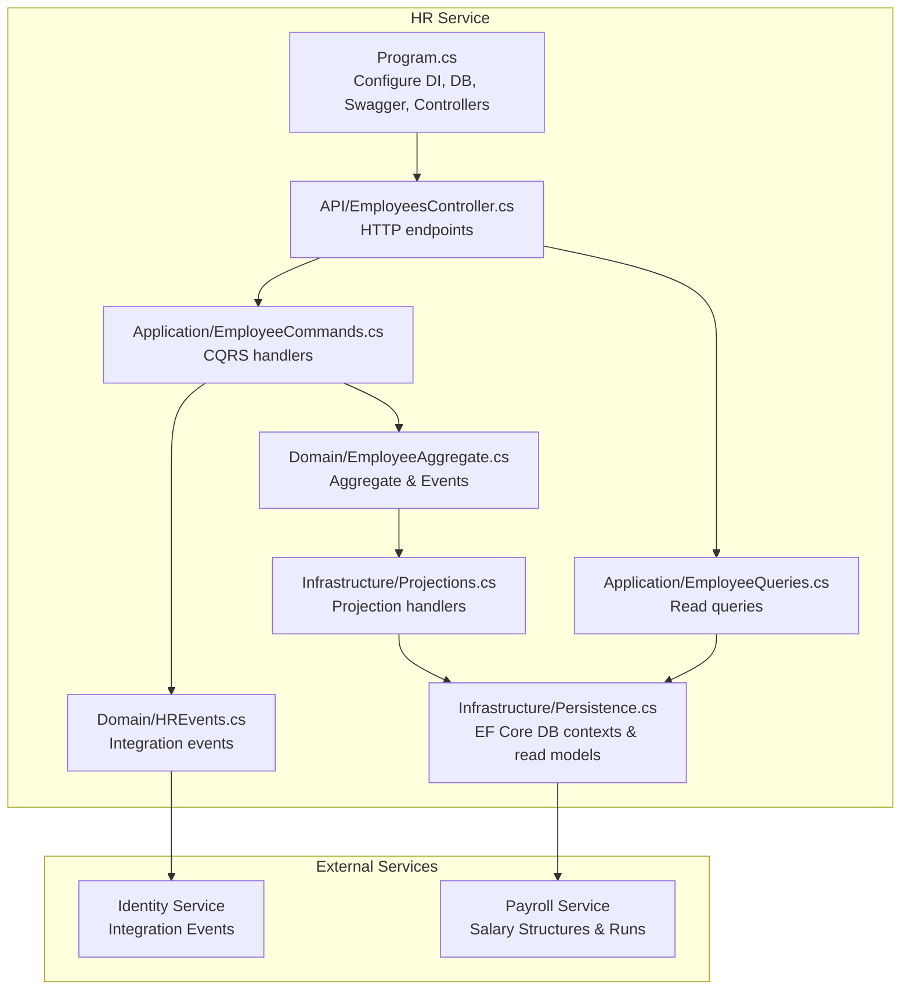
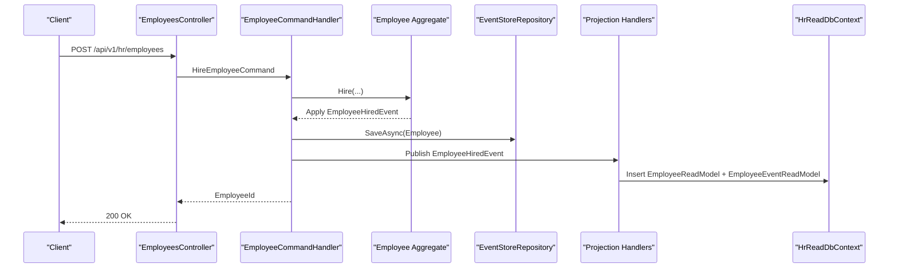
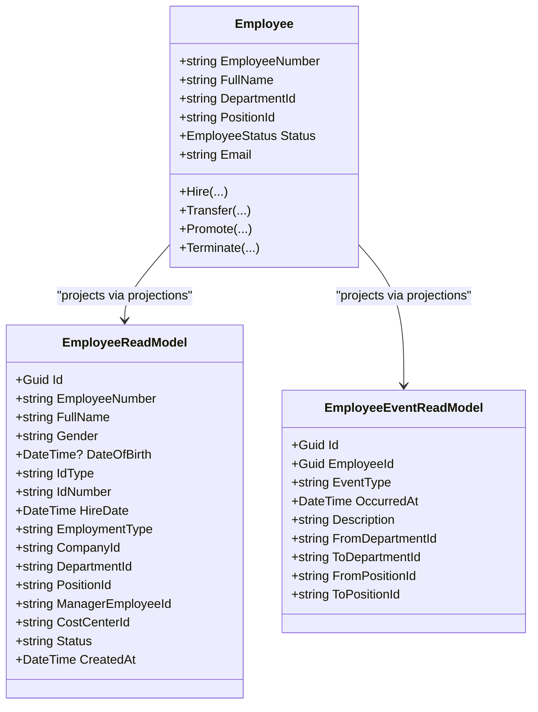
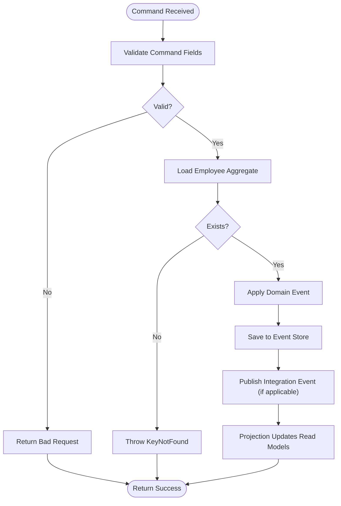
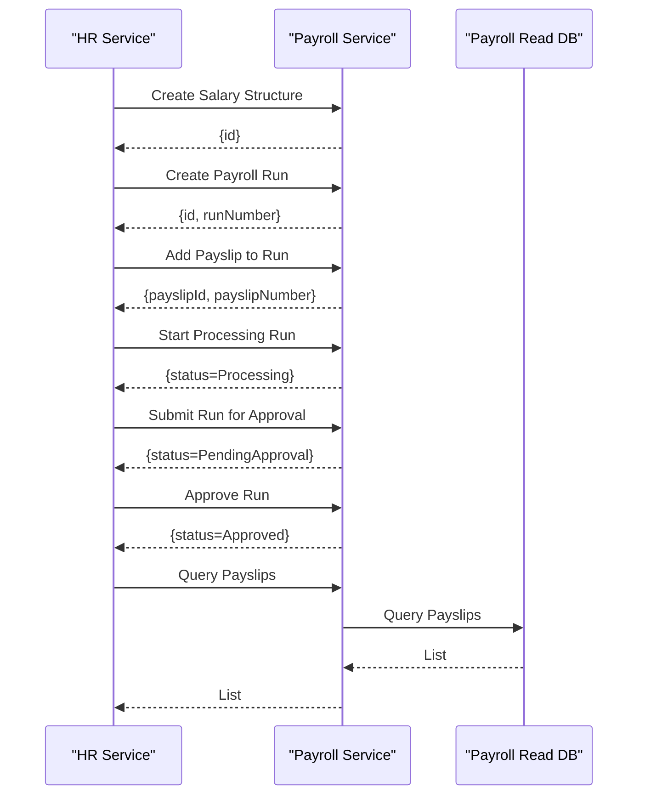
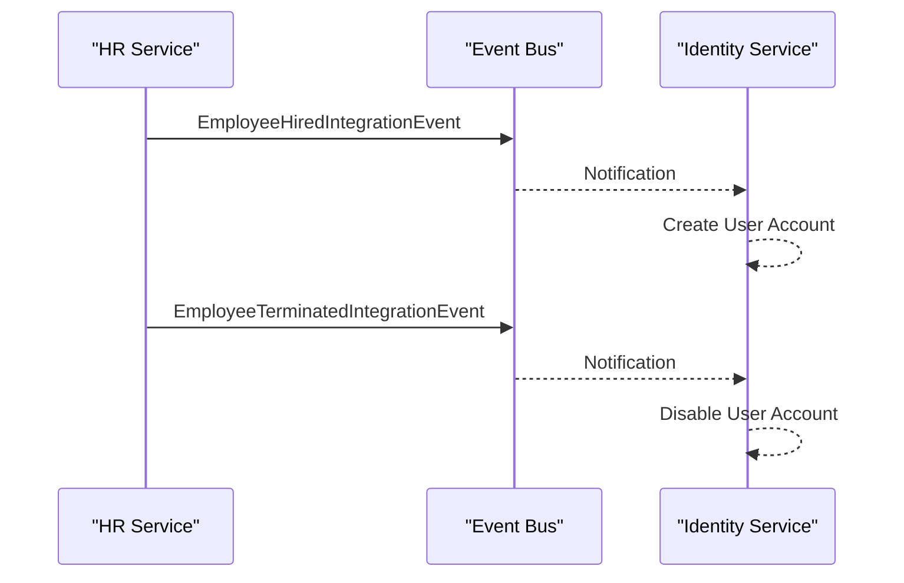
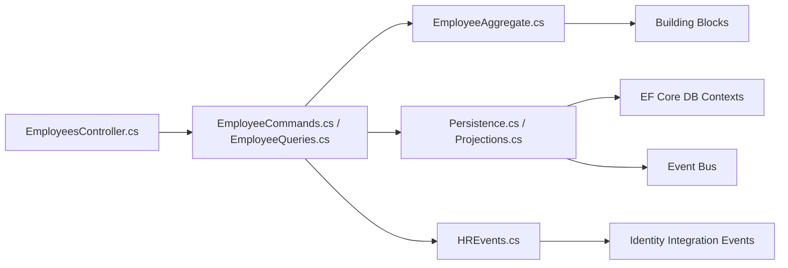

# HR Service API

<cite>
**Referenced Files in This Document**
- [Program.cs](file://src/Services/HR/ErpSystem.HR/Program.cs)
- [EmployeesController.cs](file://src/Services/HR/ErpSystem.HR/API/EmployeesController.cs)
- [EmployeeCommands.cs](file://src/Services/HR/ErpSystem.HR/Application/EmployeeCommands.cs)
- [EmployeeQueries.cs](file://src/Services/HR/ErpSystem.HR/Application/EmployeeQueries.cs)
- [EmployeeAggregate.cs](file://src/Services/HR/ErpSystem.HR/Domain/EmployeeAggregate.cs)
- [Persistence.cs](file://src/Services/HR/ErpSystem.HR/Infrastructure/Persistence.cs)
- [Projections.cs](file://src/Services/HR/ErpSystem.HR/Infrastructure/Projections.cs)
- [HREvents.cs](file://src/Services/HR/ErpSystem.HR/Domain/HREvents.cs)
- [HRIntegrationEvents.cs](file://src/Services/Identity/ErpSystem.Identity/Application/IntegrationEvents/HRIntegrationEvents.cs)
- [PayrollControllers.cs](file://src/Services/Payroll/ErpSystem.Payroll/API/PayrollControllers.cs)
</cite>

## Table of Contents
1. [Introduction](#introduction)
2. [Project Structure](#project-structure)
3. [Core Components](#core-components)
4. [Architecture Overview](#architecture-overview)
5. [Detailed Component Analysis](#detailed-component-analysis)
6. [Dependency Analysis](#dependency-analysis)
7. [Performance Considerations](#performance-considerations)
8. [Troubleshooting Guide](#troubleshooting-guide)
9. [Conclusion](#conclusion)
10. [Appendices](#appendices)

## Introduction
This document provides comprehensive API documentation for the HR microservice, focusing on employee lifecycle management, organizational structure, and payroll integration. It covers endpoints for hiring, transfers, promotions, terminations, employee search, and event history. It also documents the integration with the Identity service for account provisioning upon hiring and the Payroll service for salary structures, payroll runs, and payslips. Where applicable, conceptual workflows for time and attendance, leave management, performance evaluations, benefits administration, compliance reporting, recruitment, training, succession planning, talent acquisition, and workforce analytics are outlined to guide system integration.

## Project Structure
The HR service follows a clean architecture with separate concerns for API controllers, application commands/queries, domain events and aggregates, and infrastructure for persistence and projections. It uses CQRS with MediatR for requests and an event-driven projection model to maintain read-side data.

**Diagram sources**
- [Program.cs](file://src/Services/HR/ErpSystem.HR/Program.cs#L1-L72)
- [EmployeesController.cs](file://src/Services/HR/ErpSystem.HR/API/EmployeesController.cs#L1-L48)
- [EmployeeCommands.cs](file://src/Services/HR/ErpSystem.HR/Application/EmployeeCommands.cs#L1-L112)
- [EmployeeQueries.cs](file://src/Services/HR/ErpSystem.HR/Application/EmployeeQueries.cs#L1-L44)
- [EmployeeAggregate.cs](file://src/Services/HR/ErpSystem.HR/Domain/EmployeeAggregate.cs#L1-L151)
- [Persistence.cs](file://src/Services/HR/ErpSystem.HR/Infrastructure/Persistence.cs#L1-L64)
- [Projections.cs](file://src/Services/HR/ErpSystem.HR/Infrastructure/Projections.cs#L1-L125)
- [HREvents.cs](file://src/Services/HR/ErpSystem.HR/Domain/HREvents.cs#L1-L22)

**Section sources**
- [Program.cs](file://src/Services/HR/ErpSystem.HR/Program.cs#L1-L72)

## Core Components
- API Layer: Exposes HTTP endpoints for employee operations and queries.
- Application Layer: Implements CQRS with commands for mutations and queries for reads.
- Domain Layer: Defines the Employee aggregate, employment lifecycle events, and status transitions.
- Infrastructure Layer: Manages event sourcing persistence, read model projections, and read database contexts.
- Integration Contracts: Defines integration events published by HR to other services.

Key capabilities:
- Employee lifecycle: Hire, transfer, promote, terminate.
- Employee search and retrieval.
- Event history per employee.
- Projection of employee and event read models for efficient querying.

**Section sources**
- [EmployeesController.cs](file://src/Services/HR/ErpSystem.HR/API/EmployeesController.cs#L1-L48)
- [EmployeeCommands.cs](file://src/Services/HR/ErpSystem.HR/Application/EmployeeCommands.cs#L1-L112)
- [EmployeeQueries.cs](file://src/Services/HR/ErpSystem.HR/Application/EmployeeQueries.cs#L1-L44)
- [EmployeeAggregate.cs](file://src/Services/HR/ErpSystem.HR/Domain/EmployeeAggregate.cs#L1-L151)
- [Persistence.cs](file://src/Services/HR/ErpSystem.HR/Infrastructure/Persistence.cs#L1-L64)
- [Projections.cs](file://src/Services/HR/ErpSystem.HR/Infrastructure/Projections.cs#L1-L125)
- [HREvents.cs](file://src/Services/HR/ErpSystem.HR/Domain/HREvents.cs#L1-L22)

## Architecture Overview
The HR service uses event sourcing for write operations and CQRS for separation of concerns. Commands mutate the Employee aggregate, which publishes domain events. Projection handlers update read-side tables for fast queries. Integration events are published to trigger cross-service actions (e.g., identity account creation on hire).

**Diagram sources**
- [EmployeesController.cs](file://src/Services/HR/ErpSystem.HR/API/EmployeesController.cs#L11-L12)
- [EmployeeCommands.cs](file://src/Services/HR/ErpSystem.HR/Application/EmployeeCommands.cs#L52-L75)
- [EmployeeAggregate.cs](file://src/Services/HR/ErpSystem.HR/Domain/EmployeeAggregate.cs#L85-L106)
- [Projections.cs](file://src/Services/HR/ErpSystem.HR/Infrastructure/Projections.cs#L12-L47)
- [Persistence.cs](file://src/Services/HR/ErpSystem.HR/Infrastructure/Persistence.cs#L32-L63)

## Detailed Component Analysis

### API Endpoints

#### Hire Employee
- Method: POST
- Path: /api/v1/hr/employees
- Request body: HireEmployeeCommand fields
- Response: Employee identifier
- Behavior: Creates a new Employee aggregate, applies EmployeeHiredEvent, saves to event store, and publishes an integration event for identity provisioning.

**Section sources**
- [EmployeesController.cs](file://src/Services/HR/ErpSystem.HR/API/EmployeesController.cs#L11-L12)
- [EmployeeCommands.cs](file://src/Services/HR/ErpSystem.HR/Application/EmployeeCommands.cs#L8-L22)
- [EmployeeCommands.cs](file://src/Services/HR/ErpSystem.HR/Application/EmployeeCommands.cs#L52-L75)
- [HREvents.cs](file://src/Services/HR/ErpSystem.HR/Domain/HREvents.cs#L7-L14)

#### Get Employee by Id
- Method: GET
- Path: /api/v1/hr/employees/{id}
- Response: EmployeeReadModel or null
- Behavior: Queries the read database by primary key.

**Section sources**
- [EmployeesController.cs](file://src/Services/HR/ErpSystem.HR/API/EmployeesController.cs#L14-L15)
- [EmployeeQueries.cs](file://src/Services/HR/ErpSystem.HR/Application/EmployeeQueries.cs#L18-L21)

#### Search Employees
- Method: GET
- Path: /api/v1/hr/employees
- Query parameters:
  - fullName: filter by partial name match
  - departmentId: filter by department
  - status: filter by status
  - page: pagination page (default 1)
- Response: Paginated list of EmployeeReadModel
- Behavior: Applies filters on the read database with ordering and paging.

**Section sources**
- [EmployeesController.cs](file://src/Services/HR/ErpSystem.HR/API/EmployeesController.cs#L17-L20)
- [EmployeeQueries.cs](file://src/Services/HR/ErpSystem.HR/Application/EmployeeQueries.cs#L23-L34)

#### Transfer Employee
- Method: POST
- Path: /api/v1/hr/employees/{id}/transfer
- Request body: TransferEmployeeCommand
- Validation: id must match command.EmployeeId
- Response: Boolean success
- Behavior: Loads employee, applies EmployeeTransferredEvent, saves, updates read model.

**Section sources**
- [EmployeesController.cs](file://src/Services/HR/ErpSystem.HR/API/EmployeesController.cs#L22-L27)
- [EmployeeCommands.cs](file://src/Services/HR/ErpSystem.HR/Application/EmployeeCommands.cs#L77-L84)
- [EmployeeAggregate.cs](file://src/Services/HR/ErpSystem.HR/Domain/EmployeeAggregate.cs#L108-L112)
- [Projections.cs](file://src/Services/HR/ErpSystem.HR/Infrastructure/Projections.cs#L49-L72)

#### Promote Employee
- Method: POST
- Path: /api/v1/hr/employees/{id}/promote
- Request body: PromoteEmployeeCommand
- Validation: id must match command.EmployeeId
- Response: Boolean success
- Behavior: Loads employee, applies EmployeePromotedEvent, saves, updates read model.

**Section sources**
- [EmployeesController.cs](file://src/Services/HR/ErpSystem.HR/API/EmployeesController.cs#L29-L34)
- [EmployeeCommands.cs](file://src/Services/HR/ErpSystem.HR/Application/EmployeeCommands.cs#L86-L93)
- [EmployeeAggregate.cs](file://src/Services/HR/ErpSystem.HR/Domain/EmployeeAggregate.cs#L114-L118)
- [Projections.cs](file://src/Services/HR/ErpSystem.HR/Infrastructure/Projections.cs#L74-L94)

#### Terminate Employee
- Method: POST
- Path: /api/v1/hr/employees/{id}/terminate
- Request body: TerminateEmployeeCommand
- Validation: id must match command.EmployeeId
- Response: Boolean success
- Behavior: Loads employee, applies EmployeeTerminatedEvent, saves, updates read model, publishes integration event for identity deactivation.

**Section sources**
- [EmployeesController.cs](file://src/Services/HR/ErpSystem.HR/API/EmployeesController.cs#L36-L41)
- [EmployeeCommands.cs](file://src/Services/HR/ErpSystem.HR/Application/EmployeeCommands.cs#L95-L110)
- [EmployeeAggregate.cs](file://src/Services/HR/ErpSystem.HR/Domain/EmployeeAggregate.cs#L120-L124)
- [Projections.cs](file://src/Services/HR/ErpSystem.HR/Infrastructure/Projections.cs#L96-L114)
- [HREvents.cs](file://src/Services/HR/ErpSystem.HR/Domain/HREvents.cs#L16-L21)

#### Get Employee Events
- Method: GET
- Path: /api/v1/hr/employees/{id}/events
- Response: List of EmployeeEventReadModel ordered by occurrence
- Behavior: Queries read database for event history.

**Section sources**
- [EmployeesController.cs](file://src/Services/HR/ErpSystem.HR/API/EmployeesController.cs#L43-L46)
- [EmployeeQueries.cs](file://src/Services/HR/ErpSystem.HR/Application/EmployeeQueries.cs#L36-L42)

### Data Models

**Diagram sources**
- [EmployeeAggregate.cs](file://src/Services/HR/ErpSystem.HR/Domain/EmployeeAggregate.cs#L76-L151)
- [Persistence.cs](file://src/Services/HR/ErpSystem.HR/Infrastructure/Persistence.cs#L32-L63)

**Section sources**
- [EmployeeAggregate.cs](file://src/Services/HR/ErpSystem.HR/Domain/EmployeeAggregate.cs#L1-L151)
- [Persistence.cs](file://src/Services/HR/ErpSystem.HR/Infrastructure/Persistence.cs#L32-L63)

### Processing Logic

**Diagram sources**
- [EmployeeCommands.cs](file://src/Services/HR/ErpSystem.HR/Application/EmployeeCommands.cs#L77-L110)
- [Projections.cs](file://src/Services/HR/ErpSystem.HR/Infrastructure/Projections.cs#L49-L114)

**Section sources**
- [EmployeeCommands.cs](file://src/Services/HR/ErpSystem.HR/Application/EmployeeCommands.cs#L46-L112)
- [Projections.cs](file://src/Services/HR/ErpSystem.HR/Infrastructure/Projections.cs#L6-L125)

### Integration with Payroll Service
The HR service integrates with the Payroll service for salary structures and payroll processing. The Payroll service exposes endpoints for managing salary structures, creating payroll runs, adding payslips, and approving/canceling runs. These integrations enable end-to-end compensation management aligned with HR records.

**Diagram sources**
- [PayrollControllers.cs](file://src/Services/Payroll/ErpSystem.Payroll/API/PayrollControllers.cs#L13-L80)
- [PayrollControllers.cs](file://src/Services/Payroll/ErpSystem.Payroll/API/PayrollControllers.cs#L86-L210)
- [PayrollControllers.cs](file://src/Services/Payroll/ErpSystem.Payroll/API/PayrollControllers.cs#L214-L259)

**Section sources**
- [PayrollControllers.cs](file://src/Services/Payroll/ErpSystem.Payroll/API/PayrollControllers.cs#L1-L278)

### Integration with Identity Service
On employee hire, the HR service publishes an integration event to provision an identity account. On termination, it publishes an event to disable the account. The Identity service consumes these notifications to manage user accounts.

**Diagram sources**
- [HREvents.cs](file://src/Services/HR/ErpSystem.HR/Domain/HREvents.cs#L7-L21)
- [HRIntegrationEvents.cs](file://src/Services/Identity/ErpSystem.Identity/Application/IntegrationEvents/HRIntegrationEvents.cs#L7-L21)

**Section sources**
- [HREvents.cs](file://src/Services/HR/ErpSystem.HR/Domain/HREvents.cs#L1-L22)
- [HRIntegrationEvents.cs](file://src/Services/Identity/ErpSystem.Identity/Application/IntegrationEvents/HRIntegrationEvents.cs#L1-L22)

## Dependency Analysis
- API depends on Application for CQRS handlers.
- Application depends on Domain for aggregates and events, and on Infrastructure for event store and read database.
- Domain depends on Building Blocks for event sourcing abstractions.
- Infrastructure depends on Entity Framework Core and the event bus.
- Integration events bridge HR with Identity and potentially Payroll.

**Diagram sources**
- [EmployeesController.cs](file://src/Services/HR/ErpSystem.HR/API/EmployeesController.cs#L1-L48)
- [EmployeeCommands.cs](file://src/Services/HR/ErpSystem.HR/Application/EmployeeCommands.cs#L1-L112)
- [EmployeeQueries.cs](file://src/Services/HR/ErpSystem.HR/Application/EmployeeQueries.cs#L1-L44)
- [EmployeeAggregate.cs](file://src/Services/HR/ErpSystem.HR/Domain/EmployeeAggregate.cs#L1-L151)
- [Persistence.cs](file://src/Services/HR/ErpSystem.HR/Infrastructure/Persistence.cs#L1-L64)
- [Projections.cs](file://src/Services/HR/ErpSystem.HR/Infrastructure/Projections.cs#L1-L125)
- [HREvents.cs](file://src/Services/HR/ErpSystem.HR/Domain/HREvents.cs#L1-L22)
- [HRIntegrationEvents.cs](file://src/Services/Identity/ErpSystem.Identity/Application/IntegrationEvents/HRIntegrationEvents.cs#L1-L22)

**Section sources**
- [Program.cs](file://src/Services/HR/ErpSystem.HR/Program.cs#L13-L46)

## Performance Considerations
- Read scalability: Use the read database for filtering and pagination to avoid heavy writes during reads.
- Event sourcing: Keep projections efficient; batch writes where possible.
- Caching: Consider caching frequently accessed employee metadata at the application level.
- Pagination: Default page size is 20; tune based on UI needs and latency targets.
- Indexes: Ensure read model tables have appropriate indexes for common filters (department, status, name).

## Troubleshooting Guide
- 400 Bad Request on transfer/promote/terminate: Ensure the path parameter id matches the command.EmployeeId.
- 404 Not Found on terminate: Employee not found; verify the identifier.
- 400 Bad Request on hire: Validate required fields in the HireEmployeeCommand.
- Event not appearing in /events: Confirm the projection handler executed and the read database was updated.
- Integration event not received by Identity: Verify event bus connectivity and that the integration event types match between services.

**Section sources**
- [EmployeesController.cs](file://src/Services/HR/ErpSystem.HR/API/EmployeesController.cs#L22-L41)
- [EmployeeCommands.cs](file://src/Services/HR/ErpSystem.HR/Application/EmployeeCommands.cs#L77-L110)
- [Projections.cs](file://src/Services/HR/ErpSystem.HR/Infrastructure/Projections.cs#L12-L114)

## Conclusion
The HR service provides a robust, event-driven foundation for employee lifecycle management with clear integration points to Identity and Payroll. The API supports essential HR operations, maintains audit trails via event history, and enables scalable read-side queries. Extending support for time and attendance, leave management, performance evaluations, benefits administration, compliance reporting, recruitment, training, succession planning, talent acquisition, and workforce analytics can be achieved by adding new aggregates, events, commands, queries, and projections aligned with the existing architecture.

## Appendices

### Endpoint Reference Summary
- POST /api/v1/hr/employees
  - Purpose: Hire a new employee
  - Request: HireEmployeeCommand
  - Response: Employee identifier
- GET /api/v1/hr/employees/{id}
  - Purpose: Retrieve employee by id
  - Response: EmployeeReadModel
- GET /api/v1/hr/employees
  - Purpose: Search employees with filters and pagination
  - Query: fullName, departmentId, status, page
  - Response: Paginated EmployeeReadModel list
- POST /api/v1/hr/employees/{id}/transfer
  - Purpose: Transfer employee to another department/position
  - Request: TransferEmployeeCommand
  - Response: Boolean
- POST /api/v1/hr/employees/{id}/promote
  - Purpose: Promote employee to a new position
  - Request: PromoteEmployeeCommand
  - Response: Boolean
- POST /api/v1/hr/employees/{id}/terminate
  - Purpose: Terminate employee
  - Request: TerminateEmployeeCommand
  - Response: Boolean
- GET /api/v1/hr/employees/{id}/events
  - Purpose: Retrieve event history for an employee
  - Response: List of EmployeeEventReadModel

### Data Privacy and Compliance Notes
- Employee personal data is stored in the read model; apply access controls and data retention policies.
- Event streams capture sensitive lifecycle data; secure storage and access to the event store.
- Consider audit logging for sensitive operations and integrate with compliance reporting services.

### Manager and Self-Service Portals
- Manager dashboards can consume employee search and event history endpoints to monitor team status and changes.
- Self-service portals can leverage similar read endpoints for employees to view profile, history, and related information.