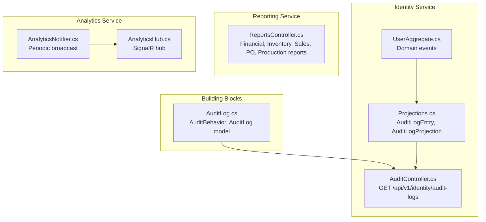
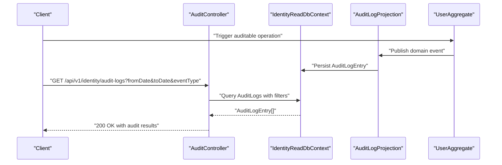
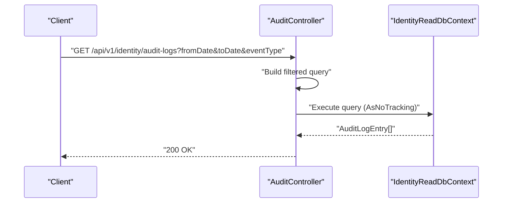
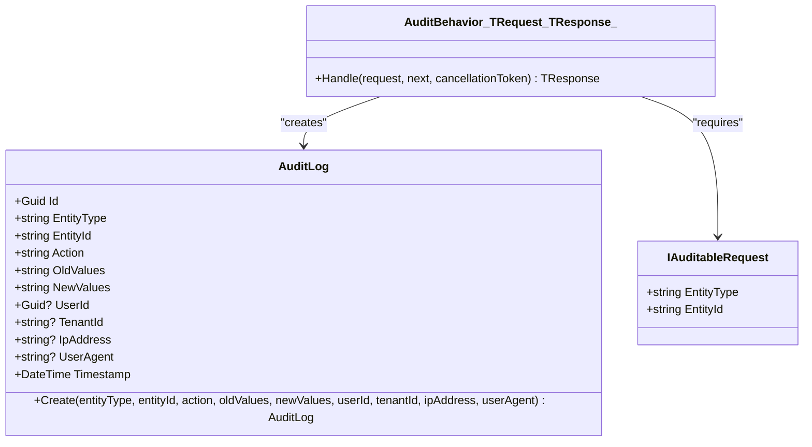
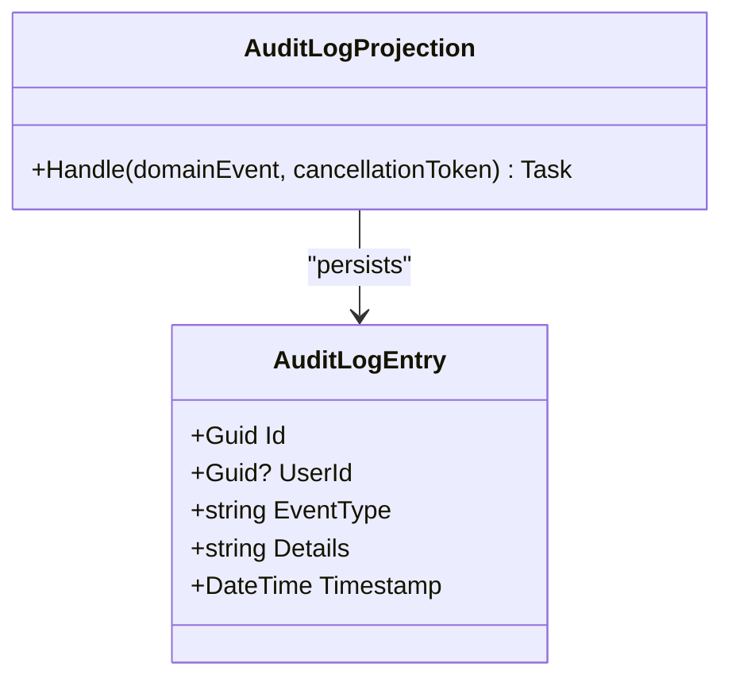
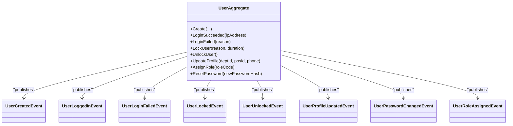
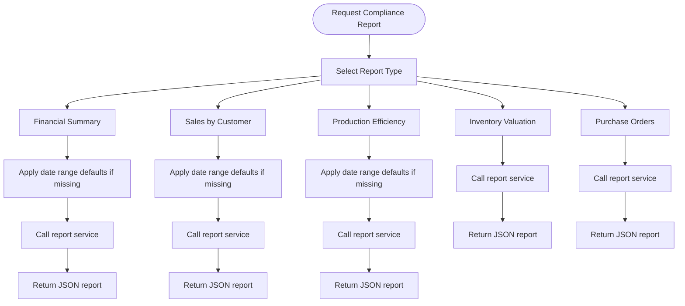
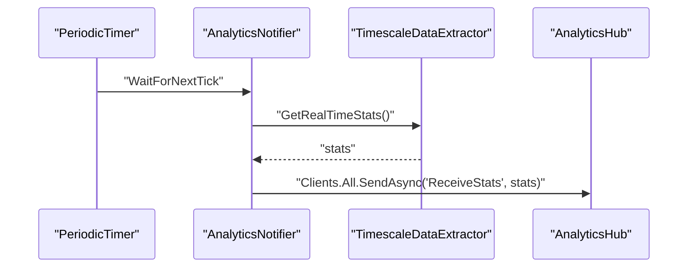
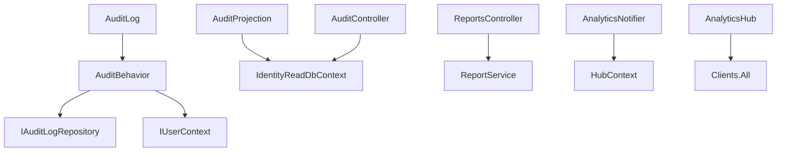

# Audit Trail and Activity Endpoints

<cite>
**Referenced Files in This Document**
- [AuditLog.cs](file://src/BuildingBlocks/ErpSystem.BuildingBlocks/Auditing/AuditLog.cs)
- [AuditController.cs](file://src/Services/Identity/ErpSystem.Identity/API/AuditController.cs)
- [Projections.cs](file://src/Services/Identity/ErpSystem.Identity/Infrastructure/Projections.cs)
- [UserAggregate.cs](file://src/Services/Identity/ErpSystem.Identity/Domain/UserAggregate.cs)
- [ReportsController.cs](file://src/Services/Reporting/ErpSystem.Reporting/Controllers/ReportsController.cs)
- [AnalyticsHub.cs](file://src/Services/Analytics/ErpSystem.Analytics/API/Hubs/AnalyticsHub.cs)
- [AnalyticsNotifier.cs](file://src/Services/Analytics/ErpSystem.Analytics/Infrastructure/BackgroundJobs/AnalyticsNotifier.cs)
- [timescale-init.sql](file://infrastructure/timescale-init.sql)
</cite>

## Table of Contents
1. [Introduction](#introduction)
2. [Project Structure](#project-structure)
3. [Core Components](#core-components)
4. [Architecture Overview](#architecture-overview)
5. [Detailed Component Analysis](#detailed-component-analysis)
6. [Dependency Analysis](#dependency-analysis)
7. [Performance Considerations](#performance-considerations)
8. [Troubleshooting Guide](#troubleshooting-guide)
9. [Conclusion](#conclusion)

## Introduction
This document provides API documentation for audit trail and activity monitoring endpoints across the ERP microservice platform. It covers user activity logging, system event tracking, compliance reporting capabilities, audit log queries with time-range and event-type filters, and integration patterns with external audit systems. It also addresses audit log retention policies, data privacy considerations, and real-time audit notification patterns.

## Project Structure
The audit and activity monitoring capabilities are implemented across building blocks, identity service, reporting service, and analytics service:
- Building Blocks: Centralized audit pipeline and model definitions
- Identity Service: Audit endpoint and projections for user/system events
- Reporting Service: Compliance-oriented reports
- Analytics Service: Real-time notifications for anomaly detection and operational insights

**Diagram sources**
- [AuditLog.cs](file://src/BuildingBlocks/ErpSystem.BuildingBlocks/Auditing/AuditLog.cs#L65-L101)
- [AuditController.cs](file://src/Services/Identity/ErpSystem.Identity/API/AuditController.cs#L1-L24)
- [Projections.cs](file://src/Services/Identity/ErpSystem.Identity/Infrastructure/Projections.cs#L200-L208)
- [UserAggregate.cs](file://src/Services/Identity/ErpSystem.Identity/Domain/UserAggregate.cs#L6-L52)
- [ReportsController.cs](file://src/Services/Reporting/ErpSystem.Reporting/Controllers/ReportsController.cs#L1-L71)
- [AnalyticsHub.cs](file://src/Services/Analytics/ErpSystem.Analytics/API/Hubs/AnalyticsHub.cs#L1-L12)
- [AnalyticsNotifier.cs](file://src/Services/Analytics/ErpSystem.Analytics/Infrastructure/BackgroundJobs/AnalyticsNotifier.cs#L1-L47)

**Section sources**
- [AuditLog.cs](file://src/BuildingBlocks/ErpSystem.BuildingBlocks/Auditing/AuditLog.cs#L1-L135)
- [AuditController.cs](file://src/Services/Identity/ErpSystem.Identity/API/AuditController.cs#L1-L24)
- [Projections.cs](file://src/Services/Identity/ErpSystem.Identity/Infrastructure/Projections.cs#L61-L88)
- [UserAggregate.cs](file://src/Services/Identity/ErpSystem.Identity/Domain/UserAggregate.cs#L1-L164)
- [ReportsController.cs](file://src/Services/Reporting/ErpSystem.Reporting/Controllers/ReportsController.cs#L1-L136)
- [AnalyticsHub.cs](file://src/Services/Analytics/ErpSystem.Analytics/API/Hubs/AnalyticsHub.cs#L1-L12)
- [AnalyticsNotifier.cs](file://src/Services/Analytics/ErpSystem.Analytics/Infrastructure/BackgroundJobs/AnalyticsNotifier.cs#L1-L47)

## Core Components
- AuditLog model and behavior: Centralized creation of audit entries for auditable commands and EF Core configuration for persistence.
- Identity audit endpoint: Queryable audit log endpoint with time-range and event-type filters.
- Identity projections: Generic audit projection capturing domain events into a structured audit log entry.
- Domain events: User lifecycle and security-related events that trigger audit entries.
- Reporting APIs: Compliance-focused reports that complement audit data for regulatory needs.
- Real-time analytics hub: Broadcasts operational anomalies and statistics via SignalR for near real-time monitoring.

**Section sources**
- [AuditLog.cs](file://src/BuildingBlocks/ErpSystem.BuildingBlocks/Auditing/AuditLog.cs#L12-L54)
- [AuditLog.cs](file://src/BuildingBlocks/ErpSystem.BuildingBlocks/Auditing/AuditLog.cs#L65-L101)
- [AuditLog.cs](file://src/BuildingBlocks/ErpSystem.BuildingBlocks/Auditing/AuditLog.cs#L115-L134)
- [AuditController.cs](file://src/Services/Identity/ErpSystem.Identity/API/AuditController.cs#L11-L23)
- [Projections.cs](file://src/Services/Identity/ErpSystem.Identity/Infrastructure/Projections.cs#L61-L71)
- [Projections.cs](file://src/Services/Identity/ErpSystem.Identity/Infrastructure/Projections.cs#L200-L208)
- [UserAggregate.cs](file://src/Services/Identity/ErpSystem.Identity/Domain/UserAggregate.cs#L6-L52)
- [ReportsController.cs](file://src/Services/Reporting/ErpSystem.Reporting/Controllers/ReportsController.cs#L10-L71)
- [AnalyticsHub.cs](file://src/Services/Analytics/ErpSystem.Analytics/API/Hubs/AnalyticsHub.cs#L5-L12)
- [AnalyticsNotifier.cs](file://src/Services/Analytics/ErpSystem.Analytics/Infrastructure/BackgroundJobs/AnalyticsNotifier.cs#L12-L36)

## Architecture Overview
The audit and activity monitoring architecture integrates domain events, projections, and API endpoints to capture, store, and expose audit trails. The building blocks provide a reusable audit pipeline, while the identity service exposes a dedicated endpoint for querying audit logs. Reporting and analytics services complement audit data with compliance reports and real-time notifications.

**Diagram sources**
- [AuditController.cs](file://src/Services/Identity/ErpSystem.Identity/API/AuditController.cs#L11-L23)
- [Projections.cs](file://src/Services/Identity/ErpSystem.Identity/Infrastructure/Projections.cs#L200-L208)
- [UserAggregate.cs](file://src/Services/Identity/ErpSystem.Identity/Domain/UserAggregate.cs#L72-L119)
- [Projections.cs](file://src/Services/Identity/ErpSystem.Identity/Infrastructure/Projections.cs#L73-L88)

## Detailed Component Analysis

### Audit Endpoint API
- Endpoint: GET /api/v1/identity/audit-logs
- Query parameters:
  - fromDate: ISO date filter for minimum timestamp
  - toDate: ISO date filter for maximum timestamp
  - eventType: String filter for event type
- Response: Array of audit log entries ordered by timestamp descending, limited to a fixed number
- Notes: Uses a read-side database context for efficient querying

**Diagram sources**
- [AuditController.cs](file://src/Services/Identity/ErpSystem.Identity/API/AuditController.cs#L11-L23)

**Section sources**
- [AuditController.cs](file://src/Services/Identity/ErpSystem.Identity/API/AuditController.cs#L1-L24)

### Audit Log Model and Pipeline
- AuditLog model captures entity type, entity ID, action, old/new values, user, tenant, IP address, user agent, and timestamp
- AuditBehavior automatically creates audit entries for requests implementing the auditable marker interface
- EF Core configuration defines indexes for efficient querying by entity, timestamp, and user

**Diagram sources**
- [AuditLog.cs](file://src/BuildingBlocks/ErpSystem.BuildingBlocks/Auditing/AuditLog.cs#L12-L54)
- [AuditLog.cs](file://src/BuildingBlocks/ErpSystem.BuildingBlocks/Auditing/AuditLog.cs#L65-L101)
- [AuditLog.cs](file://src/BuildingBlocks/ErpSystem.BuildingBlocks/Auditing/AuditLog.cs#L106-L110)

**Section sources**
- [AuditLog.cs](file://src/BuildingBlocks/ErpSystem.BuildingBlocks/Auditing/AuditLog.cs#L12-L54)
- [AuditLog.cs](file://src/BuildingBlocks/ErpSystem.BuildingBlocks/Auditing/AuditLog.cs#L65-L101)
- [AuditLog.cs](file://src/BuildingBlocks/ErpSystem.BuildingBlocks/Auditing/AuditLog.cs#L115-L134)

### Identity Audit Projection
- AuditLogEntry is a read-model capturing event type, details, and timestamp
- AuditLogProjection subscribes to domain events and persists them as audit log entries
- Supports generic audit for all domain events

**Diagram sources**
- [Projections.cs](file://src/Services/Identity/ErpSystem.Identity/Infrastructure/Projections.cs#L61-L71)
- [Projections.cs](file://src/Services/Identity/ErpSystem.Identity/Infrastructure/Projections.cs#L200-L208)

**Section sources**
- [Projections.cs](file://src/Services/Identity/ErpSystem.Identity/Infrastructure/Projections.cs#L61-L71)
- [Projections.cs](file://src/Services/Identity/ErpSystem.Identity/Infrastructure/Projections.cs#L200-L208)

### Domain Events Driving Audit
- User lifecycle and security events (created, logged in, login failed, locked, unlocked, profile updated, password changed, role assigned)
- These events are captured by the audit projection and exposed via the audit endpoint

**Diagram sources**
- [UserAggregate.cs](file://src/Services/Identity/ErpSystem.Identity/Domain/UserAggregate.cs#L6-L52)
- [UserAggregate.cs](file://src/Services/Identity/ErpSystem.Identity/Domain/UserAggregate.cs#L72-L119)

**Section sources**
- [UserAggregate.cs](file://src/Services/Identity/ErpSystem.Identity/Domain/UserAggregate.cs#L6-L52)
- [UserAggregate.cs](file://src/Services/Identity/ErpSystem.Identity/Domain/UserAggregate.cs#L72-L119)

### Compliance Reporting Endpoints
- Financial Summary Report
- Inventory Valuation Report
- Sales by Customer Report
- Purchase Order Status Report
- Production Efficiency Report
- Each endpoint supports optional date range parameters where applicable

**Diagram sources**
- [ReportsController.cs](file://src/Services/Reporting/ErpSystem.Reporting/Controllers/ReportsController.cs#L10-L71)

**Section sources**
- [ReportsController.cs](file://src/Services/Reporting/ErpSystem.Reporting/Controllers/ReportsController.cs#L10-L71)

### Real-Time Audit Notifications
- AnalyticsNotifier periodically extracts real-time statistics and broadcasts them via SignalR
- AnalyticsHub serves as the SignalR endpoint for clients
- Suitable for alerting on anomalies and operational metrics

**Diagram sources**
- [AnalyticsNotifier.cs](file://src/Services/Analytics/ErpSystem.Analytics/Infrastructure/BackgroundJobs/AnalyticsNotifier.cs#L12-L36)
- [AnalyticsHub.cs](file://src/Services/Analytics/ErpSystem.Analytics/API/Hubs/AnalyticsHub.cs#L5-L12)

**Section sources**
- [AnalyticsNotifier.cs](file://src/Services/Analytics/ErpSystem.Analytics/Infrastructure/BackgroundJobs/AnalyticsNotifier.cs#L1-L47)
- [AnalyticsHub.cs](file://src/Services/Analytics/ErpSystem.Analytics/API/Hubs/AnalyticsHub.cs#L1-L12)

## Dependency Analysis
- AuditBehavior depends on IAuditLogRepository and IUserContext to create audit entries for auditable requests
- AuditLogProjection depends on IdentityReadDbContext to persist audit log entries
- AuditController depends on IdentityReadDbContext for querying audit logs
- Reporting controllers depend on report services for generating compliance reports
- AnalyticsNotifier depends on SignalR hub context and periodic timer for broadcasting updates

**Diagram sources**
- [AuditLog.cs](file://src/BuildingBlocks/ErpSystem.BuildingBlocks/Auditing/AuditLog.cs#L65-L101)
- [Projections.cs](file://src/Services/Identity/ErpSystem.Identity/Infrastructure/Projections.cs#L200-L208)
- [AuditController.cs](file://src/Services/Identity/ErpSystem.Identity/API/AuditController.cs#L1-L24)
- [ReportsController.cs](file://src/Services/Reporting/ErpSystem.Reporting/Controllers/ReportsController.cs#L1-L8)
- [AnalyticsNotifier.cs](file://src/Services/Analytics/ErpSystem.Analytics/Infrastructure/BackgroundJobs/AnalyticsNotifier.cs#L6-L9)
- [AnalyticsHub.cs](file://src/Services/Analytics/ErpSystem.Analytics/API/Hubs/AnalyticsHub.cs#L5-L12)

**Section sources**
- [AuditLog.cs](file://src/BuildingBlocks/ErpSystem.BuildingBlocks/Auditing/AuditLog.cs#L65-L101)
- [Projections.cs](file://src/Services/Identity/ErpSystem.Identity/Infrastructure/Projections.cs#L200-L208)
- [AuditController.cs](file://src/Services/Identity/ErpSystem.Identity/API/AuditController.cs#L1-L24)
- [ReportsController.cs](file://src/Services/Reporting/ErpSystem.Reporting/Controllers/ReportsController.cs#L1-L8)
- [AnalyticsNotifier.cs](file://src/Services/Analytics/ErpSystem.Analytics/Infrastructure/BackgroundJobs/AnalyticsNotifier.cs#L6-L9)
- [AnalyticsHub.cs](file://src/Services/Analytics/ErpSystem.Analytics/API/Hubs/AnalyticsHub.cs#L5-L12)

## Performance Considerations
- Audit endpoint limits results to a fixed number to prevent large payloads
- EF Core indexes on AuditLog and AuditLogEntry support efficient filtering by timestamp and entity
- Read-side database usage for audit queries avoids write contention
- Real-time analytics broadcast occurs on a periodic basis to balance load

[No sources needed since this section provides general guidance]

## Troubleshooting Guide
- Audit entries not appearing:
  - Verify that requests implement the auditable marker interface so AuditBehavior can capture them
  - Confirm that domain events are published and handled by AuditLogProjection
- Query returns empty results:
  - Check query parameter formats and time zone considerations
  - Ensure the read-side database is up-to-date with projections
- Real-time notifications not received:
  - Confirm SignalR hub connection and client subscription
  - Review periodic notifier logs for exceptions

**Section sources**
- [AuditLog.cs](file://src/BuildingBlocks/ErpSystem.BuildingBlocks/Auditing/AuditLog.cs#L72-L100)
- [Projections.cs](file://src/Services/Identity/ErpSystem.Identity/Infrastructure/Projections.cs#L200-L208)
- [AnalyticsNotifier.cs](file://src/Services/Analytics/ErpSystem.Analytics/Infrastructure/BackgroundJobs/AnalyticsNotifier.cs#L31-L35)

## Conclusion
The audit trail and activity monitoring system provides robust user activity logging, system event tracking, and compliance reporting capabilities. The modular design leverages domain events, projections, and dedicated endpoints to deliver efficient querying, real-time notifications, and extensible audit data suitable for integration with external audit systems. Retention and privacy considerations should be aligned with organizational policies and regulatory requirements.