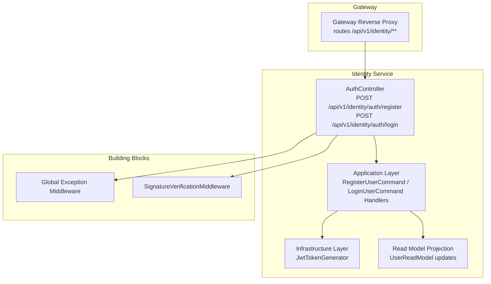
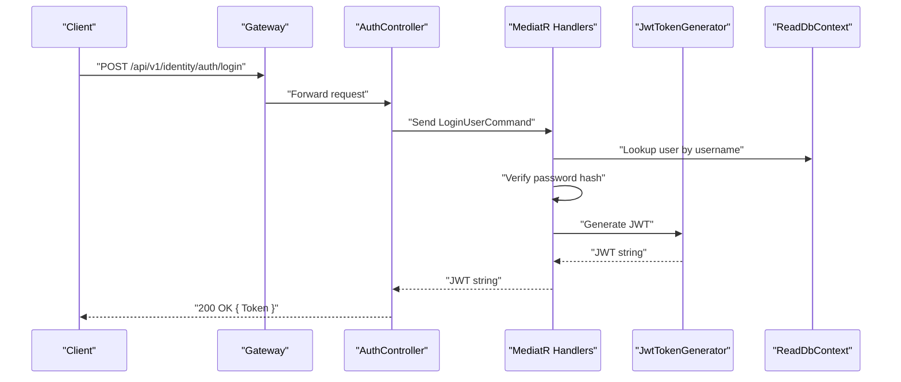
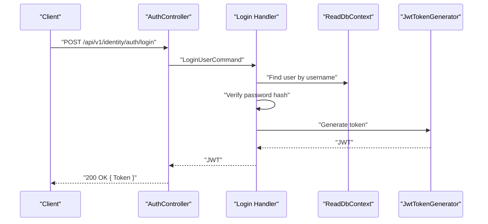
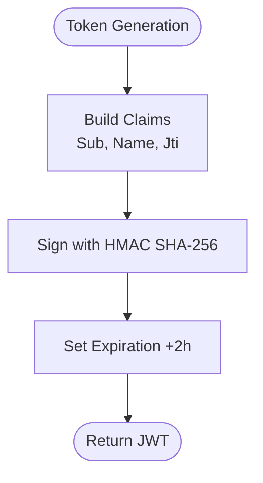
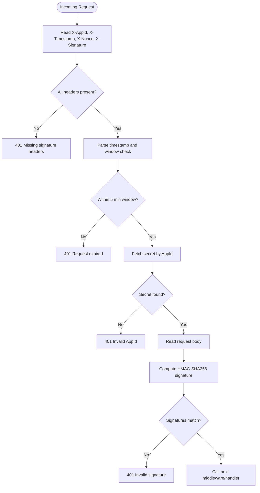
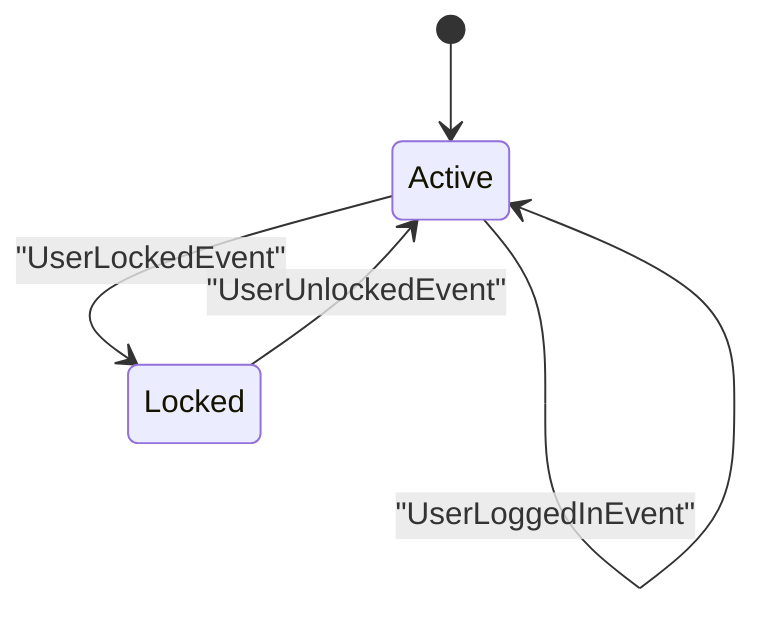
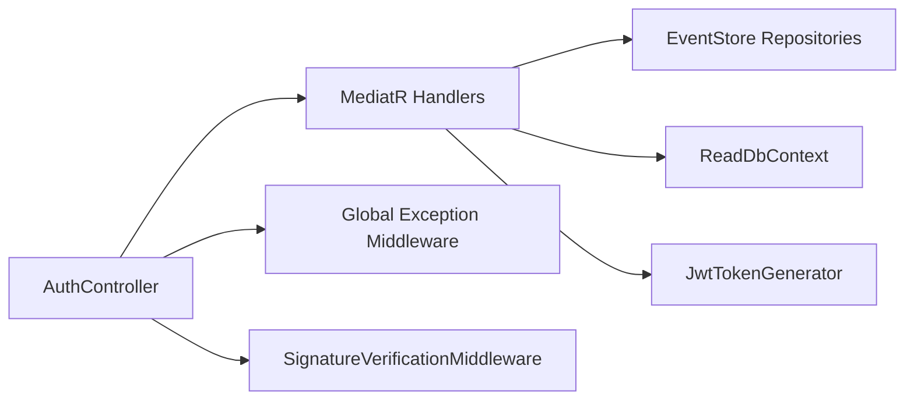

# Authentication Endpoints

<cite>
**Referenced Files in This Document**
- [AuthController.cs](file://src/Services/Identity/ErpSystem.Identity/API/AuthController.cs)
- [FullIdentityCommands.cs](file://src/Services/Identity/ErpSystem.Identity/Application/FullIdentityCommands.cs)
- [JwtTokenGenerator.cs](file://src/Services/Identity/ErpSystem.Identity/Infrastructure/JwtTokenGenerator.cs)
- [SignatureVerificationMiddleware.cs](file://src/BuildingBlocks/ErpSystem.BuildingBlocks/Auth/SignatureVerificationMiddleware.cs)
- [AuthExtensions.cs](file://src/BuildingBlocks/ErpSystem.BuildingBlocks/Auth/AuthExtensions.cs)
- [Middlewares.cs](file://src/BuildingBlocks/ErpSystem.BuildingBlocks/Middleware/Middlewares.cs)
- [Program.cs (Identity)](file://src/Services/Identity/ErpSystem.Identity/Program.cs)
- [Projections.cs](file://src/Services/Identity/ErpSystem.Identity/Infrastructure/Projections.cs)
- [appsettings.json (Gateway)](file://src/Gateways/ErpSystem.Gateway/appsettings.json)
</cite>

## Table of Contents
1. [Introduction](#introduction)
2. [Project Structure](#project-structure)
3. [Core Components](#core-components)
4. [Architecture Overview](#architecture-overview)
5. [Detailed Component Analysis](#detailed-component-analysis)
6. [Dependency Analysis](#dependency-analysis)
7. [Performance Considerations](#performance-considerations)
8. [Troubleshooting Guide](#troubleshooting-guide)
9. [Conclusion](#conclusion)
10. [Appendices](#appendices)

## Introduction
This document provides API documentation for authentication endpoints in the Identity service, focusing on user registration and login. It also documents JWT token generation and validation, middleware-based signature verification, and outlines current limitations around logout, token refresh, and password reset. Guidance is included for integrating bearer tokens, managing sessions, and securing token storage. Multi-factor authentication integration points are identified for future enhancement.

## Project Structure
The authentication surface is implemented in the Identity service with supporting building blocks for middleware and JWT utilities. The Gateway routes identity requests to the Identity service.

**Diagram sources**
- [AuthController.cs](file://src/Services/Identity/ErpSystem.Identity/API/AuthController.cs#L1-L32)
- [FullIdentityCommands.cs](file://src/Services/Identity/ErpSystem.Identity/Application/FullIdentityCommands.cs#L67-L89)
- [JwtTokenGenerator.cs](file://src/Services/Identity/ErpSystem.Identity/Infrastructure/JwtTokenGenerator.cs#L1-L38)
- [Projections.cs](file://src/Services/Identity/ErpSystem.Identity/Infrastructure/Projections.cs#L105-L130)
- [Middlewares.cs](file://src/BuildingBlocks/ErpSystem.BuildingBlocks/Middleware/Middlewares.cs#L73-L124)
- [SignatureVerificationMiddleware.cs](file://src/BuildingBlocks/ErpSystem.BuildingBlocks/Auth/SignatureVerificationMiddleware.cs#L1-L85)
- [appsettings.json (Gateway)](file://src/Gateways/ErpSystem.Gateway/appsettings.json#L10-L16)

**Section sources**
- [AuthController.cs](file://src/Services/Identity/ErpSystem.Identity/API/AuthController.cs#L1-L32)
- [Program.cs (Identity)](file://src/Services/Identity/ErpSystem.Identity/Program.cs#L43-L56)
- [appsettings.json (Gateway)](file://src/Gateways/ErpSystem.Gateway/appsettings.json#L10-L16)

## Core Components
- AuthController: Exposes registration and login endpoints. Registration returns a user identifier; login returns a JWT token or an unauthorized response on failure.
- Application Handlers: Implement registration and login logic, including password hashing and token generation.
- JwtTokenGenerator: Produces signed JWT tokens with predefined claims and expiration.
- SignatureVerificationMiddleware: Enforces request signature verification for API clients via custom headers.
- Global Exception Middleware: Ensures consistent HTTP error responses across the application.

**Section sources**
- [AuthController.cs](file://src/Services/Identity/ErpSystem.Identity/API/AuthController.cs#L11-L30)
- [FullIdentityCommands.cs](file://src/Services/Identity/ErpSystem.Identity/Application/FullIdentityCommands.cs#L67-L89)
- [JwtTokenGenerator.cs](file://src/Services/Identity/ErpSystem.Identity/Infrastructure/JwtTokenGenerator.cs#L15-L36)
- [SignatureVerificationMiddleware.cs](file://src/BuildingBlocks/ErpSystem.BuildingBlocks/Auth/SignatureVerificationMiddleware.cs#L14-L76)
- [Middlewares.cs](file://src/BuildingBlocks/ErpSystem.BuildingBlocks/Middleware/Middlewares.cs#L73-L124)

## Architecture Overview
The authentication flow integrates controller actions, application handlers, JWT generation, and middleware layers. Requests are routed by the Gateway to the Identity service, where the controller delegates to MediatR handlers. Successful login triggers token generation and read model updates.

**Diagram sources**
- [AuthController.cs](file://src/Services/Identity/ErpSystem.Identity/API/AuthController.cs#L18-L30)
- [FullIdentityCommands.cs](file://src/Services/Identity/ErpSystem.Identity/Application/FullIdentityCommands.cs#L76-L89)
- [JwtTokenGenerator.cs](file://src/Services/Identity/ErpSystem.Identity/Infrastructure/JwtTokenGenerator.cs#L15-L36)
- [Projections.cs](file://src/Services/Identity/ErpSystem.Identity/Infrastructure/Projections.cs#L105-L109)
- [appsettings.json (Gateway)](file://src/Gateways/ErpSystem.Gateway/appsettings.json#L10-L16)

## Detailed Component Analysis

### Authentication Endpoints

#### POST /api/v1/identity/auth/register
- Description: Registers a new user account.
- Request body: RegisterUserCommand (username, email, password, display name).
- Responses:
  - 200 OK: Returns a user identifier.
  - 500 Internal Server Error: On unhandled exceptions.
- Notes: Uses application handler to hash password and persist user.

Example request body (paths only):
- [RegisterUserCommand definition](file://src/Services/Identity/ErpSystem.Identity/Application/FullIdentityCommands.cs#L14-L14)

Example successful response:
- [Registration response mapping](file://src/Services/Identity/ErpSystem.Identity/API/AuthController.cs#L11-L16)

**Section sources**
- [AuthController.cs](file://src/Services/Identity/ErpSystem.Identity/API/AuthController.cs#L11-L16)
- [FullIdentityCommands.cs](file://src/Services/Identity/ErpSystem.Identity/Application/FullIdentityCommands.cs#L67-L75)

#### POST /api/v1/identity/auth/login
- Description: Authenticates a user and returns a JWT token.
- Request body: LoginUserCommand (username, password).
- Responses:
  - 200 OK: Returns a JWT token.
  - 401 Unauthorized: On invalid credentials.
  - 500 Internal Server Error: On unhandled exceptions.
- Behavior: On success, the user aggregate logs a successful login; the read model is updated accordingly.

Successful login flow:

**Diagram sources**
- [AuthController.cs](file://src/Services/Identity/ErpSystem.Identity/API/AuthController.cs#L18-L30)
- [FullIdentityCommands.cs](file://src/Services/Identity/ErpSystem.Identity/Application/FullIdentityCommands.cs#L76-L89)
- [JwtTokenGenerator.cs](file://src/Services/Identity/ErpSystem.Identity/Infrastructure/JwtTokenGenerator.cs#L15-L36)

Error handling during login:
- Invalid credentials trigger an unauthorized response.
- Exceptions are caught and mapped to 401 Unauthorized.

**Section sources**
- [AuthController.cs](file://src/Services/Identity/ErpSystem.Identity/API/AuthController.cs#L21-L30)
- [FullIdentityCommands.cs](file://src/Services/Identity/ErpSystem.Identity/Application/FullIdentityCommands.cs#L79-L81)

### JWT Token Generation, Validation, and Expiration
- Generation: The generator creates a signed JWT with subject, name, and a unique token identifier. Token expiration is set two hours from issuance.
- Validation: Not implemented in the provided code; token validation would typically occur in downstream services using ASP.NET Core JWT middleware.
- Expiration: Tokens expire after two hours.

**Diagram sources**
- [JwtTokenGenerator.cs](file://src/Services/Identity/ErpSystem.Identity/Infrastructure/JwtTokenGenerator.cs#L15-L36)

**Section sources**
- [JwtTokenGenerator.cs](file://src/Services/Identity/ErpSystem.Identity/Infrastructure/JwtTokenGenerator.cs#L10-L36)

### Authentication Middleware and Signature Verification
- SignatureVerificationMiddleware enforces request signature verification for API clients using custom headers: X-AppId, X-Timestamp, X-Nonce, X-Signature.
- Timestamp validation ensures requests are within a five-minute window.
- Signature verification uses HMAC-SHA256 over a concatenated payload and a shared secret retrieved per AppId.
- The middleware is applied globally and returns 401 on missing or invalid headers/signatures.

**Diagram sources**
- [SignatureVerificationMiddleware.cs](file://src/BuildingBlocks/ErpSystem.BuildingBlocks/Auth/SignatureVerificationMiddleware.cs#L16-L76)

**Section sources**
- [SignatureVerificationMiddleware.cs](file://src/BuildingBlocks/ErpSystem.BuildingBlocks/Auth/SignatureVerificationMiddleware.cs#L14-L76)
- [AuthExtensions.cs](file://src/BuildingBlocks/ErpSystem.BuildingBlocks/Auth/AuthExtensions.cs#L6-L18)

### Session Management and Read Model Updates
- On successful login, the user aggregate records a successful login event.
- Read model projections update last login time, reset access failure count, and unlock the user if locked.

**Diagram sources**
- [Projections.cs](file://src/Services/Identity/ErpSystem.Identity/Infrastructure/Projections.cs#L105-L127)

**Section sources**
- [Projections.cs](file://src/Services/Identity/ErpSystem.Identity/Infrastructure/Projections.cs#L105-L127)

### Logout, Token Refresh, and Password Reset
- Logout: Not implemented in the provided code.
- Token Refresh: Not implemented in the provided code.
- Password Reset: Not implemented in the provided code; a reset command exists in the application layer for administrative use.

**Section sources**
- [UserEnhancementCommands.cs](file://src/Services/Identity/ErpSystem.Identity/Application/UserEnhancementCommands.cs#L43-L52)

## Dependency Analysis
- AuthController depends on MediatR to dispatch commands to application handlers.
- Application handlers depend on repositories and the read database for user lookup and persistence.
- JwtTokenGenerator is a pure utility for token creation.
- Global Exception Middleware wraps all requests to normalize error responses.
- SignatureVerificationMiddleware is registered via extension methods and applied globally.

**Diagram sources**
- [AuthController.cs](file://src/Services/Identity/ErpSystem.Identity/API/AuthController.cs#L1-L32)
- [FullIdentityCommands.cs](file://src/Services/Identity/ErpSystem.Identity/Application/FullIdentityCommands.cs#L67-L89)
- [JwtTokenGenerator.cs](file://src/Services/Identity/ErpSystem.Identity/Infrastructure/JwtTokenGenerator.cs#L1-L38)
- [Middlewares.cs](file://src/BuildingBlocks/ErpSystem.BuildingBlocks/Middleware/Middlewares.cs#L73-L124)
- [SignatureVerificationMiddleware.cs](file://src/BuildingBlocks/ErpSystem.BuildingBlocks/Auth/SignatureVerificationMiddleware.cs#L14-L76)

**Section sources**
- [Program.cs (Identity)](file://src/Services/Identity/ErpSystem.Identity/Program.cs#L43-L56)
- [AuthExtensions.cs](file://src/BuildingBlocks/ErpSystem.BuildingBlocks/Auth/AuthExtensions.cs#L6-L18)

## Performance Considerations
- Token generation is lightweight; avoid excessive token creation.
- Password hashing is performed synchronously in the login handler; consider ensuring the hashing library is optimized and not blocking.
- Middleware overhead is minimal but ensure signature computation does not block I/O.

## Troubleshooting Guide
Common issues and resolutions:
- 401 Unauthorized on login:
  - Cause: Invalid credentials or user not found.
  - Resolution: Verify username/password; ensure user exists in the read model.
- 401 Missing signature headers:
  - Cause: Missing X-AppId, X-Timestamp, X-Nonce, or X-Signature.
  - Resolution: Include all required headers in the request.
- 401 Request expired:
  - Cause: Timestamp outside the five-minute window.
  - Resolution: Align client clock or adjust tolerance.
- 401 Invalid AppId:
  - Cause: Unknown application identifier.
  - Resolution: Register the AppId or use a valid one.
- 401 Invalid signature:
  - Cause: Payload mismatch or incorrect secret.
  - Resolution: Recompute signature using the exact payload format and correct secret.

**Section sources**
- [AuthController.cs](file://src/Services/Identity/ErpSystem.Identity/API/AuthController.cs#L21-L30)
- [SignatureVerificationMiddleware.cs](file://src/BuildingBlocks/ErpSystem.BuildingBlocks/Auth/SignatureVerificationMiddleware.cs#L20-L73)
- [Middlewares.cs](file://src/BuildingBlocks/ErpSystem.BuildingBlocks/Middleware/Middlewares.cs#L92-L101)

## Conclusion
The Identity service currently supports user registration and login with JWT token issuance. Authentication middleware enforces request signature verification for API clients. Logout, token refresh, and password reset are not implemented in the provided code. Downstream services should implement JWT validation and integrate bearer token requirements. For enhanced security, consider adding logout/token revocation, refresh token rotation, and password reset flows.

## Appendices

### API Definitions

- POST /api/v1/identity/auth/register
  - Request body: RegisterUserCommand
  - Responses:
    - 200 OK: { UserId }
    - 500 Internal Server Error

- POST /api/v1/identity/auth/login
  - Request body: LoginUserCommand
  - Responses:
    - 200 OK: { Token }
    - 401 Unauthorized: Invalid credentials
    - 500 Internal Server Error

### Bearer Token Requirements
- Clients should include Authorization: Bearer <token> for protected downstream requests.
- Token expiration is two hours; implement token refresh strategies as needed.

### Security Considerations and Recommendations
- Transport security: Use HTTPS/TLS for all endpoints.
- Token storage: Store tokens securely (e.g., HttpOnly cookies or secure vaults) and avoid plain-text storage.
- Rotation and revocation: Implement token refresh and blacklist mechanisms for logout scenarios.
- MFA integration: Add multi-factor authentication by extending the login handler to emit challenges and validating second factors before issuing tokens.