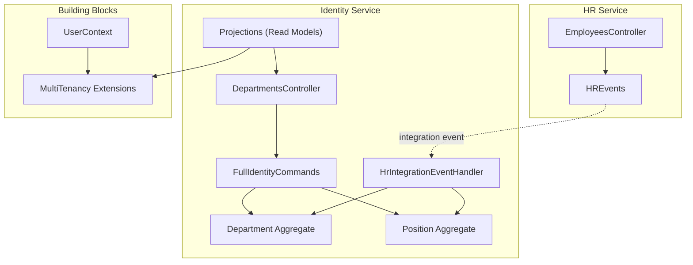
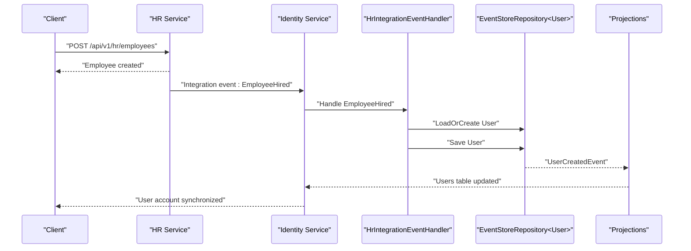
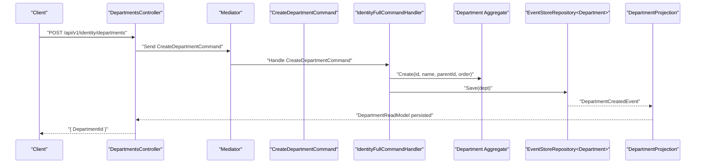
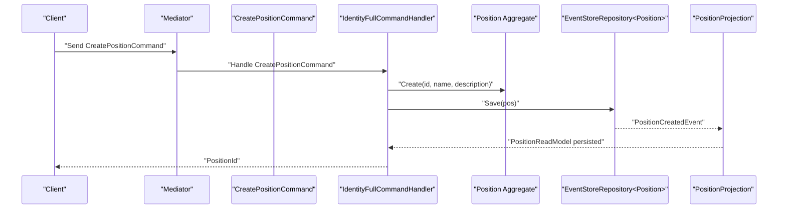
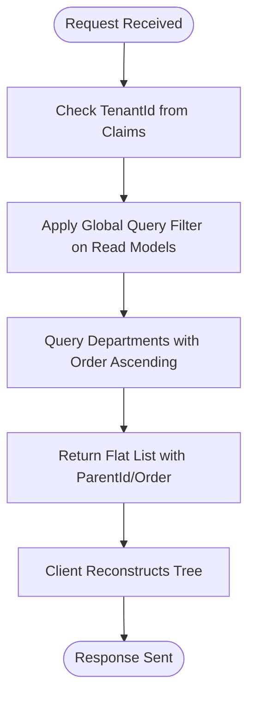
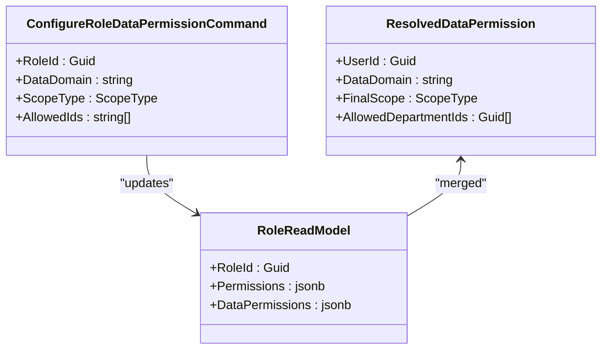
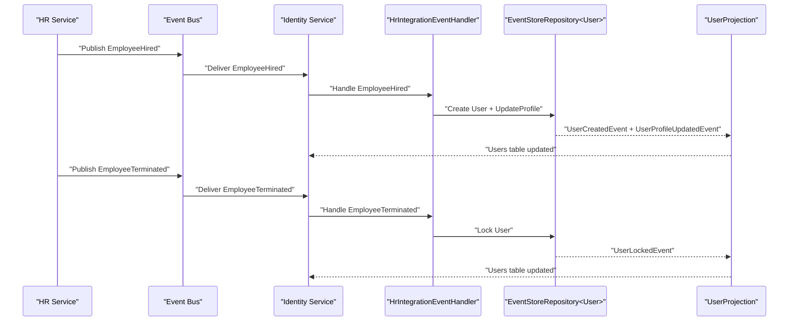
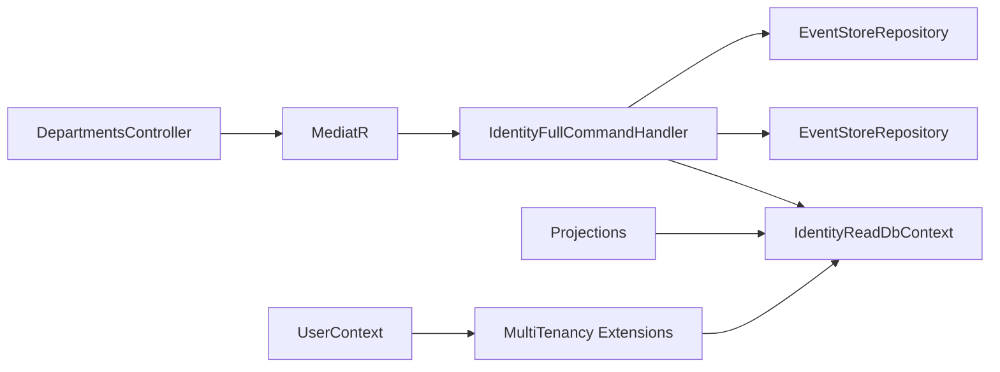

# Department and Organization Endpoints

<cite>
**Referenced Files in This Document**
- [DepartmentsController.cs](file://src/Services/Identity/ErpSystem.Identity/API/DepartmentsController.cs)
- [DepartmentAggregate.cs](file://src/Services/Identity/ErpSystem.Identity/Domain/DepartmentAggregate.cs)
- [PositionAggregate.cs](file://src/Services/Identity/ErpSystem.Identity/Domain/PositionAggregate.cs)
- [FullIdentityCommands.cs](file://src/Services/Identity/ErpSystem.Identity/Application/FullIdentityCommands.cs)
- [Projections.cs](file://src/Services/Identity/ErpSystem.Identity/Infrastructure/Projections.cs)
- [MultiTenancy.cs](file://src/BuildingBlocks/ErpSystem.BuildingBlocks/MultiTenancy/MultiTenancy.cs)
- [IUserContext.cs](file://src/BuildingBlocks/ErpSystem.BuildingBlocks/Auth/IUserContext.cs)
- [UserContext.cs](file://src/BuildingBlocks/ErpSystem.BuildingBlocks/Auth/UserContext.cs)
- [IntegrationEventHandlers.cs](file://src/Services/Identity/ErpSystem.Identity/Application/IntegrationEventHandlers.cs)
- [HRIntegrationEvents.cs](file://src/Services/Identity/ErpSystem.Identity/Application/IntegrationEvents/HRIntegrationEvents.cs)
- [HREvents.cs](file://src/Services/HR/ErpSystem.HR/Domain/HREvents.cs)
- [EmployeesController.cs](file://src/Services/HR/ErpSystem.HR/API/EmployeesController.cs)
- [UserAggregate.cs](file://src/Services/Identity/ErpSystem.Identity/Domain/UserAggregate.cs)
- [DataPermissionQueries.cs](file://src/Services/Identity/ErpSystem.Identity/Application/DataPermissionQueries.cs)
</cite>

## Table of Contents
1. [Introduction](#introduction)
2. [Project Structure](#project-structure)
3. [Core Components](#core-components)
4. [Architecture Overview](#architecture-overview)
5. [Detailed Component Analysis](#detailed-component-analysis)
6. [Dependency Analysis](#dependency-analysis)
7. [Performance Considerations](#performance-considerations)
8. [Troubleshooting Guide](#troubleshooting-guide)
9. [Conclusion](#conclusion)

## Introduction
This document provides API documentation for organizational structure endpoints focused on departments and positions. It covers department CRUD operations, position creation and management, hierarchical movement, reporting relationships, organizational unit isolation via multi-tenancy, hierarchical queries, and integration with HR systems for automatic organizational updates. Examples include organizational chart operations, position-based permission assignments, and HR lifecycle event handling.

## Project Structure
The organizational structure APIs reside in the Identity service with supporting domain models, projections, and multi-tenancy infrastructure. HR service emits integration events consumed by Identity to keep user profiles aligned with organizational changes.

**Diagram sources**
- [DepartmentsController.cs](file://src/Services/Identity/ErpSystem.Identity/API/DepartmentsController.cs#L1-L37)
- [FullIdentityCommands.cs](file://src/Services/Identity/ErpSystem.Identity/Application/FullIdentityCommands.cs#L1-L124)
- [DepartmentAggregate.cs](file://src/Services/Identity/ErpSystem.Identity/Domain/DepartmentAggregate.cs#L1-L56)
- [PositionAggregate.cs](file://src/Services/Identity/ErpSystem.Identity/Domain/PositionAggregate.cs#L1-L37)
- [Projections.cs](file://src/Services/Identity/ErpSystem.Identity/Infrastructure/Projections.cs#L1-L209)
- [IntegrationEventHandlers.cs](file://src/Services/Identity/ErpSystem.Identity/Application/IntegrationEventHandlers.cs#L1-L33)
- [HREvents.cs](file://src/Services/HR/ErpSystem.HR/Domain/HREvents.cs#L1-L21)
- [MultiTenancy.cs](file://src/BuildingBlocks/ErpSystem.BuildingBlocks/MultiTenancy/MultiTenancy.cs#L1-L100)
- [UserContext.cs](file://src/BuildingBlocks/ErpSystem.BuildingBlocks/Auth/UserContext.cs#L1-L34)

**Section sources**
- [DepartmentsController.cs](file://src/Services/Identity/ErpSystem.Identity/API/DepartmentsController.cs#L1-L37)
- [FullIdentityCommands.cs](file://src/Services/Identity/ErpSystem.Identity/Application/FullIdentityCommands.cs#L1-L124)
- [Projections.cs](file://src/Services/Identity/ErpSystem.Identity/Infrastructure/Projections.cs#L1-L209)
- [MultiTenancy.cs](file://src/BuildingBlocks/ErpSystem.BuildingBlocks/MultiTenancy/MultiTenancy.cs#L1-L100)
- [UserContext.cs](file://src/BuildingBlocks/ErpSystem.BuildingBlocks/Auth/UserContext.cs#L1-L34)

## Core Components
- DepartmentsController: Exposes department endpoints for creation, retrieval, and moving within the hierarchy.
- Department aggregate: Encapsulates department state and applies domain events for creation and movement.
- Position aggregate: Encapsulates position state and applies domain events for creation.
- FullIdentityCommands: Command handlers for department and position operations and user profile updates.
- Projections: Read-side models for departments and positions, plus user and role data.
- MultiTenancy: Tenant isolation via query filters and save-change interceptor.
- UserContext: Extracts tenant context from authenticated requests.
- IntegrationEventHandlers: Subscribes to HR integration events to synchronize user profiles with organizational changes.
- DataPermissionQueries: Resolves effective data permissions scoped to departments.

**Section sources**
- [DepartmentsController.cs](file://src/Services/Identity/ErpSystem.Identity/API/DepartmentsController.cs#L1-L37)
- [DepartmentAggregate.cs](file://src/Services/Identity/ErpSystem.Identity/Domain/DepartmentAggregate.cs#L1-L56)
- [PositionAggregate.cs](file://src/Services/Identity/ErpSystem.Identity/Domain/PositionAggregate.cs#L1-L37)
- [FullIdentityCommands.cs](file://src/Services/Identity/ErpSystem.Identity/Application/FullIdentityCommands.cs#L1-L124)
- [Projections.cs](file://src/Services/Identity/ErpSystem.Identity/Infrastructure/Projections.cs#L1-L209)
- [MultiTenancy.cs](file://src/BuildingBlocks/ErpSystem.BuildingBlocks/MultiTenancy/MultiTenancy.cs#L1-L100)
- [UserContext.cs](file://src/BuildingBlocks/ErpSystem.BuildingBlocks/Auth/UserContext.cs#L1-L34)
- [IntegrationEventHandlers.cs](file://src/Services/Identity/ErpSystem.Identity/Application/IntegrationEventHandlers.cs#L1-L33)
- [DataPermissionQueries.cs](file://src/Services/Identity/ErpSystem.Identity/Application/DataPermissionQueries.cs#L1-L79)

## Architecture Overview
The system follows CQRS with event-sourced aggregates and projection-based read models. Multi-tenancy is enforced globally on multi-tenant entities. HR lifecycle events trigger Identity actions to maintain user organizational affiliations.

**Diagram sources**
- [IntegrationEventHandlers.cs](file://src/Services/Identity/ErpSystem.Identity/Application/IntegrationEventHandlers.cs#L1-L33)
- [HREvents.cs](file://src/Services/HR/ErpSystem.HR/Domain/HREvents.cs#L1-L21)
- [Projections.cs](file://src/Services/Identity/ErpSystem.Identity/Infrastructure/Projections.cs#L90-L134)

## Detailed Component Analysis

### Department Management Endpoints
- Base path: api/v1/identity/departments
- Create department
  - Method: POST
  - Path: /
  - Request body: CreateDepartmentCommand with Name, ParentId, Order
  - Response: { DepartmentId: guid }
- Get all departments
  - Method: GET
  - Path: /
  - Response: Array of DepartmentReadModel ordered by Order
- Move department
  - Method: POST
  - Path: /{id}/move
  - Request body: MoveDepartmentCommand with NewParentId
  - Response: 204 No Content

Processing logic:
- Create uses FullIdentityCommands.CreateDepartmentCommand handler to instantiate a Department aggregate and persist it.
- Move uses FullIdentityCommands.MoveDepartmentCommand handler to move a department under a new parent.
- Read model is populated via DepartmentProjection from domain events.

**Diagram sources**
- [DepartmentsController.cs](file://src/Services/Identity/ErpSystem.Identity/API/DepartmentsController.cs#L1-L37)
- [FullIdentityCommands.cs](file://src/Services/Identity/ErpSystem.Identity/Application/FullIdentityCommands.cs#L106-L112)
- [DepartmentAggregate.cs](file://src/Services/Identity/ErpSystem.Identity/Domain/DepartmentAggregate.cs#L25-L30)
- [Projections.cs](file://src/Services/Identity/ErpSystem.Identity/Infrastructure/Projections.cs#L182-L190)

**Section sources**
- [DepartmentsController.cs](file://src/Services/Identity/ErpSystem.Identity/API/DepartmentsController.cs#L1-L37)
- [FullIdentityCommands.cs](file://src/Services/Identity/ErpSystem.Identity/Application/FullIdentityCommands.cs#L23-L25)
- [DepartmentAggregate.cs](file://src/Services/Identity/ErpSystem.Identity/Domain/DepartmentAggregate.cs#L1-L56)
- [Projections.cs](file://src/Services/Identity/ErpSystem.Identity/Infrastructure/Projections.cs#L182-L197)

### Position Management Endpoints
- Create position
  - Method: POST
  - Path: /positions
  - Request body: CreatePositionCommand with Name, Description
  - Response: PositionId (guid)
- Get positions
  - Method: GET
  - Path: /positions
  - Response: Array of PositionReadModel

Processing logic:
- Create uses FullIdentityCommands.CreatePositionCommand handler to instantiate a Position aggregate and persist it.
- Read model is populated via PositionProjection from domain events.

**Diagram sources**
- [FullIdentityCommands.cs](file://src/Services/Identity/ErpSystem.Identity/Application/FullIdentityCommands.cs#L9-L50)
- [PositionAggregate.cs](file://src/Services/Identity/ErpSystem.Identity/Domain/PositionAggregate.cs#L18-L23)
- [Projections.cs](file://src/Services/Identity/ErpSystem.Identity/Infrastructure/Projections.cs#L172-L179)

**Section sources**
- [FullIdentityCommands.cs](file://src/Services/Identity/ErpSystem.Identity/Application/FullIdentityCommands.cs#L9-L50)
- [PositionAggregate.cs](file://src/Services/Identity/ErpSystem.Identity/Domain/PositionAggregate.cs#L1-L37)
- [Projections.cs](file://src/Services/Identity/ErpSystem.Identity/Infrastructure/Projections.cs#L52-L59)

### Organizational Unit Isolation and Hierarchical Queries
- Multi-tenancy enforcement:
  - Global query filter ensures read models only return records matching the current tenant.
  - Save interceptor auto-assigns TenantId on new multi-tenant entities.
- Hierarchical queries:
  - DepartmentReadModel includes ParentId and Order enabling client-side reconstruction of the tree.
  - GetAll returns a flat list ordered by Order for predictable rendering.

**Diagram sources**
- [MultiTenancy.cs](file://src/BuildingBlocks/ErpSystem.BuildingBlocks/MultiTenancy/MultiTenancy.cs#L34-L42)
- [UserContext.cs](file://src/BuildingBlocks/ErpSystem.BuildingBlocks/Auth/UserContext.cs#L23)
- [Projections.cs](file://src/Services/Identity/ErpSystem.Identity/Infrastructure/Projections.cs#L42-L50)
- [DepartmentsController.cs](file://src/Services/Identity/ErpSystem.Identity/API/DepartmentsController.cs#L20-L27)

**Section sources**
- [MultiTenancy.cs](file://src/BuildingBlocks/ErpSystem.BuildingBlocks/MultiTenancy/MultiTenancy.cs#L1-L100)
- [UserContext.cs](file://src/BuildingBlocks/ErpSystem.BuildingBlocks/Auth/UserContext.cs#L1-L34)
- [Projections.cs](file://src/Services/Identity/ErpSystem.Identity/Infrastructure/Projections.cs#L73-L88)
- [DepartmentsController.cs](file://src/Services/Identity/ErpSystem.Identity/API/DepartmentsController.cs#L20-L27)

### Position-Based Permission Assignments
- Role data permission configuration:
  - ConfigureRoleDataPermissionCommand defines data-domain scoped permissions for roles.
  - RoleReadModel stores permissions as JSONB for flexible scoping.
- Effective permission resolution:
  - GetUserDataPermissionsQuery merges permissions across all user roles for a given data domain.
  - ScopeType determines coverage (e.g., Self, Department, All) with simple comparisons.

**Diagram sources**
- [FullIdentityCommands.cs](file://src/Services/Identity/ErpSystem.Identity/Application/FullIdentityCommands.cs#L13)
- [Projections.cs](file://src/Services/Identity/ErpSystem.Identity/Infrastructure/Projections.cs#L137-L170)
- [DataPermissionQueries.cs](file://src/Services/Identity/ErpSystem.Identity/Application/DataPermissionQueries.cs#L11-L74)

**Section sources**
- [FullIdentityCommands.cs](file://src/Services/Identity/ErpSystem.Identity/Application/FullIdentityCommands.cs#L13)
- [Projections.cs](file://src/Services/Identity/ErpSystem.Identity/Infrastructure/Projections.cs#L137-L170)
- [DataPermissionQueries.cs](file://src/Services/Identity/ErpSystem.Identity/Application/DataPermissionQueries.cs#L1-L79)

### Integration with HR Systems for Automatic Organizational Updates
- Employee lifecycle events:
  - HR publishes EmployeeHiredIntegrationEvent and EmployeeTerminatedIntegrationEvent.
  - Identity subscribes and synchronizes user accounts accordingly.
- User profile alignment:
  - On hire, Identity creates a user and assigns primary department and position.
  - On termination, Identity locks the user account.

**Diagram sources**
- [IntegrationEventHandlers.cs](file://src/Services/Identity/ErpSystem.Identity/Application/IntegrationEventHandlers.cs#L8-L32)
- [HRIntegrationEvents.cs](file://src/Services/Identity/ErpSystem.Identity/Application/IntegrationEvents/HRIntegrationEvents.cs#L5-L21)
- [HREvents.cs](file://src/Services/HR/ErpSystem.HR/Domain/HREvents.cs#L5-L21)
- [UserAggregate.cs](file://src/Services/Identity/ErpSystem.Identity/Domain/UserAggregate.cs#L93-L106)
- [Projections.cs](file://src/Services/Identity/ErpSystem.Identity/Infrastructure/Projections.cs#L90-L134)

**Section sources**
- [IntegrationEventHandlers.cs](file://src/Services/Identity/ErpSystem.Identity/Application/IntegrationEventHandlers.cs#L1-L33)
- [HRIntegrationEvents.cs](file://src/Services/Identity/ErpSystem.Identity/Application/IntegrationEvents/HRIntegrationEvents.cs#L1-L22)
- [HREvents.cs](file://src/Services/HR/ErpSystem.HR/Domain/HREvents.cs#L1-L21)
- [UserAggregate.cs](file://src/Services/Identity/ErpSystem.Identity/Domain/UserAggregate.cs#L1-L164)
- [Projections.cs](file://src/Services/Identity/ErpSystem.Identity/Infrastructure/Projections.cs#L90-L134)

## Dependency Analysis
- Controllers depend on MediatR to dispatch commands and queries.
- Command handlers depend on event-sourced repositories and read contexts.
- Projections depend on read models and EF Core.
- Multi-tenancy extensions apply to all IMultiTenantEntity types.
- UserContext extracts tenant claims for multi-tenancy enforcement.

**Diagram sources**
- [DepartmentsController.cs](file://src/Services/Identity/ErpSystem.Identity/API/DepartmentsController.cs#L1-L37)
- [FullIdentityCommands.cs](file://src/Services/Identity/ErpSystem.Identity/Application/FullIdentityCommands.cs#L27-L122)
- [Projections.cs](file://src/Services/Identity/ErpSystem.Identity/Infrastructure/Projections.cs#L73-L88)
- [MultiTenancy.cs](file://src/BuildingBlocks/ErpSystem.BuildingBlocks/MultiTenancy/MultiTenancy.cs#L29-L63)
- [UserContext.cs](file://src/BuildingBlocks/ErpSystem.BuildingBlocks/Auth/UserContext.cs#L1-L34)

**Section sources**
- [FullIdentityCommands.cs](file://src/Services/Identity/ErpSystem.Identity/Application/FullIdentityCommands.cs#L1-L124)
- [Projections.cs](file://src/Services/Identity/ErpSystem.Identity/Infrastructure/Projections.cs#L1-L209)
- [MultiTenancy.cs](file://src/BuildingBlocks/ErpSystem.BuildingBlocks/MultiTenancy/MultiTenancy.cs#L1-L100)
- [UserContext.cs](file://src/BuildingBlocks/ErpSystem.BuildingBlocks/Auth/UserContext.cs#L1-L34)

## Performance Considerations
- Read scalability: Use Order-based pagination and limit returned fields for department lists.
- Multi-tenancy overhead: Global query filters add predicate evaluation; ensure TenantId is indexed on multi-tenant entities.
- Projection throughput: Batch writes in projections to reduce database round-trips.
- Event sourcing: Keep aggregates small and avoid long replay times by limiting event history and using snapshots if needed.

## Troubleshooting Guide
- Department move fails:
  - Verify DepartmentId matches path parameter.
  - Confirm the new parent exists and does not introduce cycles.
- User profile update errors:
  - Ensure DeptId and PosId are valid identifiers.
  - Check that the user exists before updating.
- Authentication and tenant context:
  - Confirm tenant_id claim is present in JWT.
  - Validate UserContext extraction logic in your authentication pipeline.
- HR integration not reflected:
  - Verify integration event delivery and handler registration.
  - Check for event ordering and eventual consistency delays.

**Section sources**
- [DepartmentsController.cs](file://src/Services/Identity/ErpSystem.Identity/API/DepartmentsController.cs#L29-L35)
- [FullIdentityCommands.cs](file://src/Services/Identity/ErpSystem.Identity/Application/FullIdentityCommands.cs#L52-L58)
- [UserContext.cs](file://src/BuildingBlocks/ErpSystem.BuildingBlocks/Auth/UserContext.cs#L23)
- [IntegrationEventHandlers.cs](file://src/Services/Identity/ErpSystem.Identity/Application/IntegrationEventHandlers.cs#L1-L33)

## Conclusion
The Identity service provides robust department and position management with clear separation of concerns, event-driven projections, and tenant-aware operations. Integration with HR ensures user organizational affiliations remain accurate during lifecycle events. The design supports scalable hierarchical queries and permission scoping suitable for multi-tenant deployments.