# Identity Service API

<cite>
**Referenced Files in This Document**
- [Program.cs](file://src/Services/Identity/ErpSystem.Identity/Program.cs)
- [AuthController.cs](file://src/Services/Identity/ErpSystem.Identity/API/AuthController.cs)
- [UsersController.cs](file://src/Services/Identity/ErpSystem.Identity/API/UsersController.cs)
- [RolesController.cs](file://src/Services/Identity/ErpSystem.Identity/API/RolesController.cs)
- [DepartmentsController.cs](file://src/Services/Identity/ErpSystem.Identity/API/DepartmentsController.cs)
- [AuditController.cs](file://src/Services/Identity/ErpSystem.Identity/API/AuditController.cs)
- [FullIdentityCommands.cs](file://src/Services/Identity/ErpSystem.Identity/Application/FullIdentityCommands.cs)
- [UserEnhancementCommands.cs](file://src/Services/Identity/ErpSystem.Identity/Application/UserEnhancementCommands.cs)
- [JwtTokenGenerator.cs](file://src/Services/Identity/ErpSystem.Identity/Infrastructure/JwtTokenGenerator.cs)
- [Projections.cs](file://src/Services/Identity/ErpSystem.Identity/Infrastructure/Projections.cs)
- [UserAggregate.cs](file://src/Services/Identity/ErpSystem.Identity/Domain/UserAggregate.cs)
- [RoleAggregate.cs](file://src/Services/Identity/ErpSystem.Identity/Domain/RoleAggregate.cs)
- [DepartmentAggregate.cs](file://src/Services/Identity/ErpSystem.Identity/Domain/DepartmentAggregate.cs)
- [PositionAggregate.cs](file://src/Services/Identity/ErpSystem.Identity/Domain/PositionAggregate.cs)
- [SignatureVerificationMiddleware.cs](file://src/BuildingBlocks/ErpSystem.BuildingBlocks/Auth/SignatureVerificationMiddleware.cs)
- [MultiTenancy.cs](file://src/BuildingBlocks/ErpSystem.BuildingBlocks/MultiTenancy/MultiTenancy.cs)
</cite>

## Table of Contents
1. [Introduction](#introduction)
2. [Project Structure](#project-structure)
3. [Core Components](#core-components)
4. [Architecture Overview](#architecture-overview)
5. [Detailed Component Analysis](#detailed-component-analysis)
6. [Dependency Analysis](#dependency-analysis)
7. [Performance Considerations](#performance-considerations)
8. [Troubleshooting Guide](#troubleshooting-guide)
9. [Conclusion](#conclusion)
10. [Appendices](#appendices)

## Introduction
This document provides comprehensive API documentation for the Identity service, focusing on user management, authentication, authorization, roles and permissions, departments and positions, and audit trails. It also covers JWT token generation, authentication middleware, multi-tenant isolation, and integration patterns with external systems. The service follows a CQRS and event-sourcing architecture with read models for efficient querying.

## Project Structure
The Identity service is organized by concerns:
- API: HTTP endpoints for authentication, user management, roles, departments, positions, and audit logs
- Application: CQRS commands and handlers orchestrating domain events and projections
- Domain: Aggregates and events modeling identity business logic
- Infrastructure: JWT token generation, read model projections, and database contexts

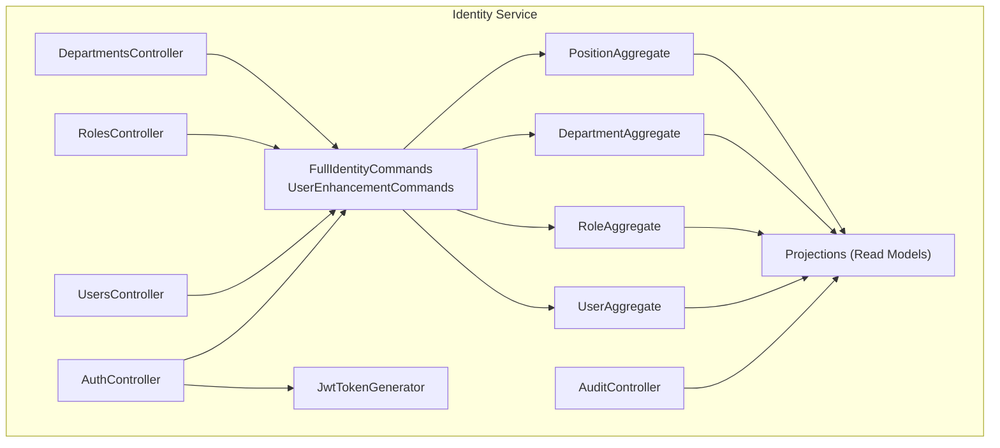

**Diagram sources**
- [Program.cs](file://src/Services/Identity/ErpSystem.Identity/Program.cs#L11-L71)
- [AuthController.cs](file://src/Services/Identity/ErpSystem.Identity/API/AuthController.cs#L9-L31)
- [UsersController.cs](file://src/Services/Identity/ErpSystem.Identity/API/UsersController.cs#L11-L55)
- [RolesController.cs](file://src/Services/Identity/ErpSystem.Identity/API/RolesController.cs#L12-L55)
- [DepartmentsController.cs](file://src/Services/Identity/ErpSystem.Identity/API/DepartmentsController.cs#L11-L36)
- [AuditController.cs](file://src/Services/Identity/ErpSystem.Identity/API/AuditController.cs#L9-L24)
- [FullIdentityCommands.cs](file://src/Services/Identity/ErpSystem.Identity/Application/FullIdentityCommands.cs#L27-L122)
- [UserEnhancementCommands.cs](file://src/Services/Identity/ErpSystem.Identity/Application/UserEnhancementCommands.cs#L17-L63)
- [JwtTokenGenerator.cs](file://src/Services/Identity/ErpSystem.Identity/Infrastructure/JwtTokenGenerator.cs#L8-L37)
- [Projections.cs](file://src/Services/Identity/ErpSystem.Identity/Infrastructure/Projections.cs#L73-L88)
- [UserAggregate.cs](file://src/Services/Identity/ErpSystem.Identity/Domain/UserAggregate.cs#L55-L163)
- [RoleAggregate.cs](file://src/Services/Identity/ErpSystem.Identity/Domain/RoleAggregate.cs#L42-L92)
- [DepartmentAggregate.cs](file://src/Services/Identity/ErpSystem.Identity/Domain/DepartmentAggregate.cs#L19-L54)
- [PositionAggregate.cs](file://src/Services/Identity/ErpSystem.Identity/Domain/PositionAggregate.cs#L13-L35)

**Section sources**
- [Program.cs](file://src/Services/Identity/ErpSystem.Identity/Program.cs#L11-L71)

## Core Components
- Authentication endpoints: register, login
- User management: create, list, get by id, update profile, lock/unlock, assign role
- Role and permission management: create role, assign permission, configure data permissions
- Departments and positions: create, list, move department
- Audit logs: query audit log entries with filters
- JWT token generation for authenticated sessions
- Read models for efficient querying and audit trail
- Authentication middleware for signed requests
- Multi-tenancy support for tenant isolation

**Section sources**
- [AuthController.cs](file://src/Services/Identity/ErpSystem.Identity/API/AuthController.cs#L9-L31)
- [UsersController.cs](file://src/Services/Identity/ErpSystem.Identity/API/UsersController.cs#L11-L55)
- [RolesController.cs](file://src/Services/Identity/ErpSystem.Identity/API/RolesController.cs#L12-L55)
- [DepartmentsController.cs](file://src/Services/Identity/ErpSystem.Identity/API/DepartmentsController.cs#L11-L36)
- [AuditController.cs](file://src/Services/Identity/ErpSystem.Identity/API/AuditController.cs#L9-L24)
- [JwtTokenGenerator.cs](file://src/Services/Identity/ErpSystem.Identity/Infrastructure/JwtTokenGenerator.cs#L8-L37)
- [Projections.cs](file://src/Services/Identity/ErpSystem.Identity/Infrastructure/Projections.cs#L73-L88)
- [SignatureVerificationMiddleware.cs](file://src/BuildingBlocks/ErpSystem.BuildingBlocks/Auth/SignatureVerificationMiddleware.cs#L14-L76)
- [MultiTenancy.cs](file://src/BuildingBlocks/ErpSystem.BuildingBlocks/MultiTenancy/MultiTenancy.cs#L12-L63)

## Architecture Overview
The Identity service uses:
- HTTP API controllers exposing REST endpoints
- MediatR for CQRS command handling
- Event-sourced aggregates with domain events
- Projection layer maintaining read models
- JWT tokens for session-based authentication
- Middleware for request signature verification
- Multi-tenancy applied via global query filters and save interceptor

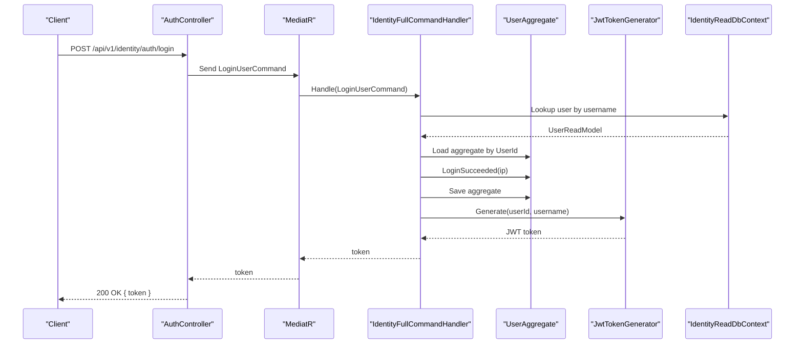

**Diagram sources**
- [AuthController.cs](file://src/Services/Identity/ErpSystem.Identity/API/AuthController.cs#L18-L30)
- [FullIdentityCommands.cs](file://src/Services/Identity/ErpSystem.Identity/Application/FullIdentityCommands.cs#L77-L89)
- [JwtTokenGenerator.cs](file://src/Services/Identity/ErpSystem.Identity/Infrastructure/JwtTokenGenerator.cs#L15-L36)
- [Projections.cs](file://src/Services/Identity/ErpSystem.Identity/Infrastructure/Projections.cs#L90-L134)

## Detailed Component Analysis

### Authentication Endpoints
- POST /api/v1/identity/auth/register
  - Request: RegisterUserCommand (username, email, password, display name)
  - Response: 200 OK with created user id
- POST /api/v1/identity/auth/login
  - Request: LoginUserCommand (username, password)
  - Response: 200 OK with JWT token; Unauthorized on invalid credentials

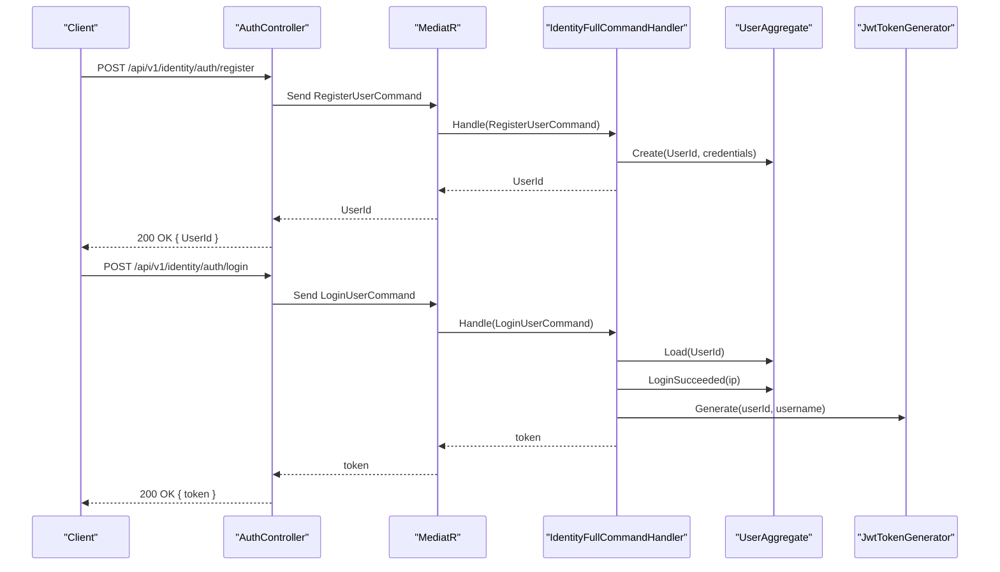

**Diagram sources**
- [AuthController.cs](file://src/Services/Identity/ErpSystem.Identity/API/AuthController.cs#L11-L30)
- [FullIdentityCommands.cs](file://src/Services/Identity/ErpSystem.Identity/Application/FullIdentityCommands.cs#L68-L89)
- [JwtTokenGenerator.cs](file://src/Services/Identity/ErpSystem.Identity/Infrastructure/JwtTokenGenerator.cs#L15-L36)

**Section sources**
- [AuthController.cs](file://src/Services/Identity/ErpSystem.Identity/API/AuthController.cs#L9-L31)
- [FullIdentityCommands.cs](file://src/Services/Identity/ErpSystem.Identity/Application/FullIdentityCommands.cs#L15-L17)
- [JwtTokenGenerator.cs](file://src/Services/Identity/ErpSystem.Identity/Infrastructure/JwtTokenGenerator.cs#L8-L37)

### User Management Endpoints
- POST /api/v1/identity/users
  - Create a user; returns created user id
- GET /api/v1/identity/users
  - List all users from read model
- GET /api/v1/identity/users/{id}
  - Get user by id
- PUT /api/v1/identity/users/{id}/profile
  - Update user profile (department, position, phone)
- POST /api/v1/identity/users/{id}/lock
  - Lock user account (demo: 15 min)
- POST /api/v1/identity/users/{id}/unlock
  - Unlock user account
- POST /api/v1/identity/users/{id}/roles
  - Assign role to user

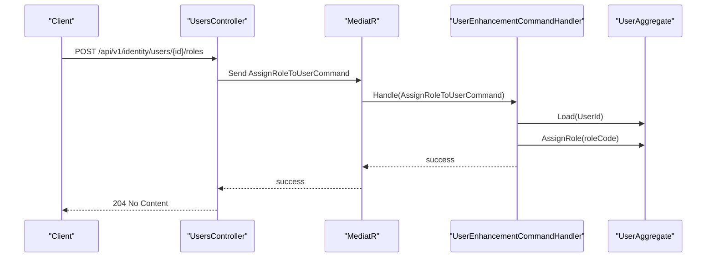

**Diagram sources**
- [UsersController.cs](file://src/Services/Identity/ErpSystem.Identity/API/UsersController.cs#L49-L54)
- [UserEnhancementCommands.cs](file://src/Services/Identity/ErpSystem.Identity/Application/UserEnhancementCommands.cs#L54-L62)
- [UserAggregate.cs](file://src/Services/Identity/ErpSystem.Identity/Domain/UserAggregate.cs#L108-L114)

**Section sources**
- [UsersController.cs](file://src/Services/Identity/ErpSystem.Identity/API/UsersController.cs#L11-L55)
- [UserEnhancementCommands.cs](file://src/Services/Identity/ErpSystem.Identity/Application/UserEnhancementCommands.cs#L8-L21)

### Role and Permission Management
- POST /api/v1/identity/roles
  - Create role (name, code, system flag)
- GET /api/v1/identity/roles
  - List roles from read model
- POST /api/v1/identity/roles/{id}/permissions
  - Assign permission to role
- POST /api/v1/identity/roles/{id}/data-permissions
  - Configure data permissions for a role (domain, scope type, allowed ids)

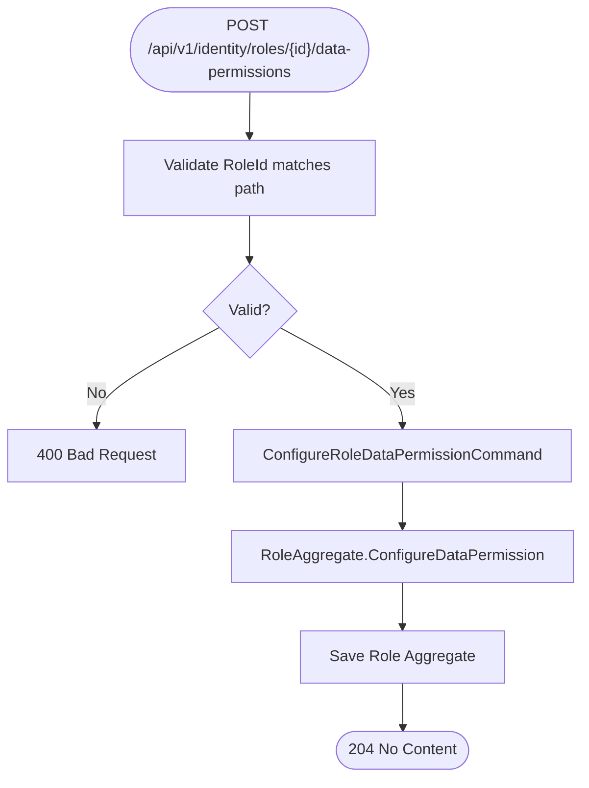

**Diagram sources**
- [RolesController.cs](file://src/Services/Identity/ErpSystem.Identity/API/RolesController.cs#L31-L37)
- [FullIdentityCommands.cs](file://src/Services/Identity/ErpSystem.Identity/Application/FullIdentityCommands.cs#L60-L66)
- [RoleAggregate.cs](file://src/Services/Identity/ErpSystem.Identity/Domain/RoleAggregate.cs#L66-L69)

**Section sources**
- [RolesController.cs](file://src/Services/Identity/ErpSystem.Identity/API/RolesController.cs#L12-L55)
- [RoleAggregate.cs](file://src/Services/Identity/ErpSystem.Identity/Domain/RoleAggregate.cs#L29-L37)

### Departments and Positions
- POST /api/v1/identity/departments
  - Create department (name, parent id, order)
- GET /api/v1/identity/departments
  - List departments (flat list with parent-child via ParentId)
- POST /api/v1/identity/departments/{id}/move
  - Move department under a new parent
- POST /api/v1/identity/positions
  - Create position (name, description)
- GET /api/v1/identity/positions
  - List positions

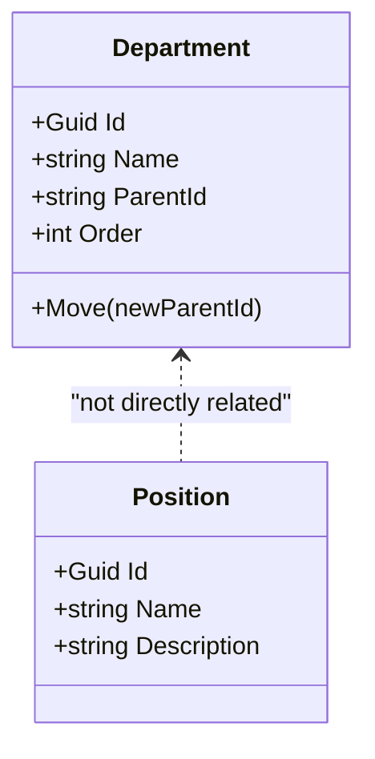

**Diagram sources**
- [DepartmentAggregate.cs](file://src/Services/Identity/ErpSystem.Identity/Domain/DepartmentAggregate.cs#L19-L54)
- [PositionAggregate.cs](file://src/Services/Identity/ErpSystem.Identity/Domain/PositionAggregate.cs#L13-L35)

**Section sources**
- [DepartmentsController.cs](file://src/Services/Identity/ErpSystem.Identity/API/DepartmentsController.cs#L11-L36)
- [DepartmentAggregate.cs](file://src/Services/Identity/ErpSystem.Identity/Domain/DepartmentAggregate.cs#L19-L54)
- [PositionAggregate.cs](file://src/Services/Identity/ErpSystem.Identity/Domain/PositionAggregate.cs#L13-L35)

### Audit Trail Endpoints
- GET /api/v1/identity/audit-logs
  - Query parameters: fromDate, toDate, eventType
  - Returns latest 100 audit log entries ordered by timestamp

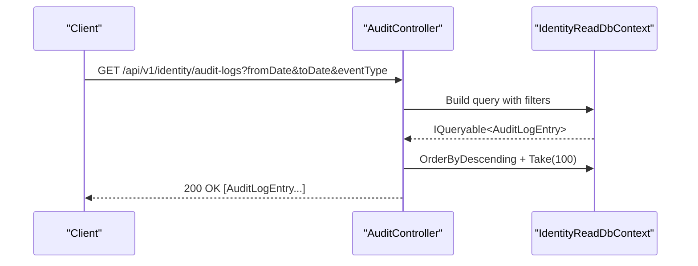

**Diagram sources**
- [AuditController.cs](file://src/Services/Identity/ErpSystem.Identity/API/AuditController.cs#L11-L23)
- [Projections.cs](file://src/Services/Identity/ErpSystem.Identity/Infrastructure/Projections.cs#L199-L208)

**Section sources**
- [AuditController.cs](file://src/Services/Identity/ErpSystem.Identity/API/AuditController.cs#L9-L24)
- [Projections.cs](file://src/Services/Identity/ErpSystem.Identity/Infrastructure/Projections.cs#L61-L71)

### JWT Token Handling
- Token generation includes subject, name, and jti claims
- Expiration set to 2 hours from issuance
- Used after successful login to authorize subsequent requests

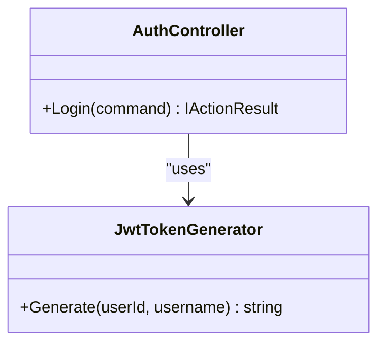

**Diagram sources**
- [JwtTokenGenerator.cs](file://src/Services/Identity/ErpSystem.Identity/Infrastructure/JwtTokenGenerator.cs#L8-L37)
- [AuthController.cs](file://src/Services/Identity/ErpSystem.Identity/API/AuthController.cs#L18-L30)

**Section sources**
- [JwtTokenGenerator.cs](file://src/Services/Identity/ErpSystem.Identity/Infrastructure/JwtTokenGenerator.cs#L8-L37)
- [FullIdentityCommands.cs](file://src/Services/Identity/ErpSystem.Identity/Application/FullIdentityCommands.cs#L86-L88)

### Authentication Middleware and Security Headers
- Signature verification middleware enforces:
  - X-AppId, X-Timestamp, X-Nonce, X-Signature headers
  - Timestamp within 5-minute window
  - HMAC-SHA256 signature computed over appId + timestamp + nonce + body
- Client repository resolves shared secret per appId

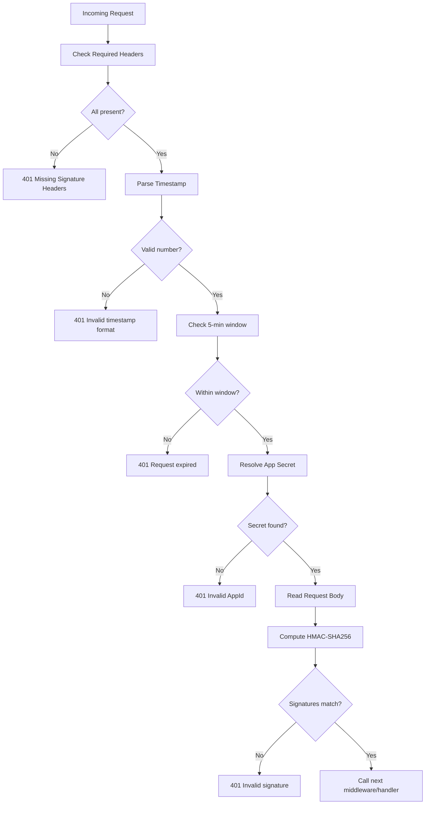

**Diagram sources**
- [SignatureVerificationMiddleware.cs](file://src/BuildingBlocks/ErpSystem.BuildingBlocks/Auth/SignatureVerificationMiddleware.cs#L14-L76)

**Section sources**
- [SignatureVerificationMiddleware.cs](file://src/BuildingBlocks/ErpSystem.BuildingBlocks/Auth/SignatureVerificationMiddleware.cs#L14-L76)

### Multi-Tenant User Isolation
- Tenant context exposes current TenantId
- Global query filters ensure read models scoped to tenant
- Save changes interceptor auto-assigns TenantId on new multi-tenant entities

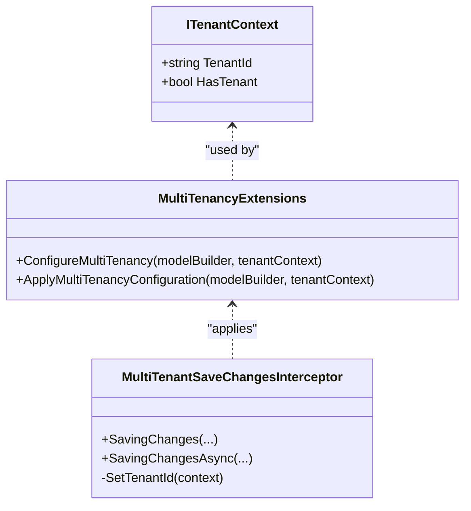

**Diagram sources**
- [MultiTenancy.cs](file://src/BuildingBlocks/ErpSystem.BuildingBlocks/MultiTenancy/MultiTenancy.cs#L12-L63)
- [MultiTenancy.cs](file://src/BuildingBlocks/ErpSystem.BuildingBlocks/MultiTenancy/MultiTenancy.cs#L68-L99)

**Section sources**
- [MultiTenancy.cs](file://src/BuildingBlocks/ErpSystem.BuildingBlocks/MultiTenancy/MultiTenancy.cs#L12-L63)
- [MultiTenancy.cs](file://src/BuildingBlocks/ErpSystem.BuildingBlocks/MultiTenancy/MultiTenancy.cs#L68-L99)

### RBAC Implementation and Data Permissions
- Roles maintain permissions and data permissions per domain
- Scope types include self, department, department and subordinates, all, and custom
- Data permissions restrict access to specific identifiers within a domain

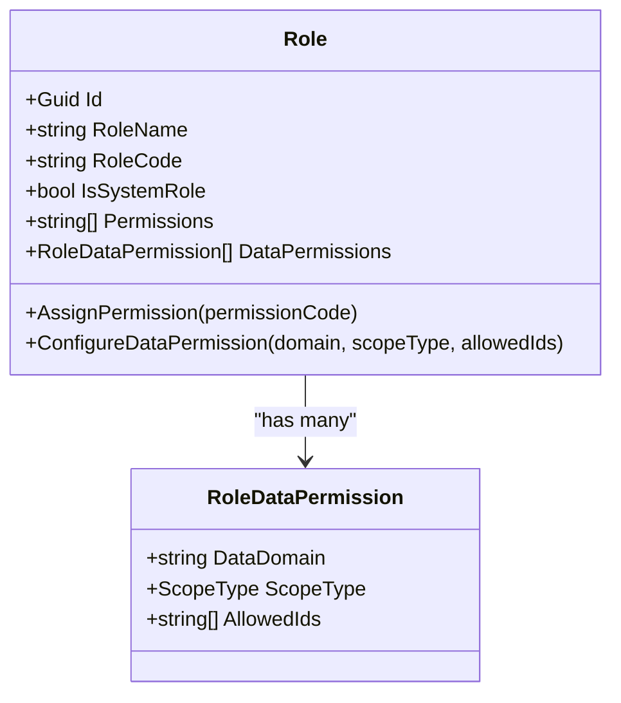

**Diagram sources**
- [RoleAggregate.cs](file://src/Services/Identity/ErpSystem.Identity/Domain/RoleAggregate.cs#L42-L92)
- [RoleAggregate.cs](file://src/Services/Identity/ErpSystem.Identity/Domain/RoleAggregate.cs#L29-L37)

**Section sources**
- [RoleAggregate.cs](file://src/Services/Identity/ErpSystem.Identity/Domain/RoleAggregate.cs#L29-L37)
- [RolesController.cs](file://src/Services/Identity/ErpSystem.Identity/API/RolesController.cs#L31-L37)

### Session Management Patterns
- JWT tokens issued on successful login
- Subsequent requests should include Authorization header with bearer token
- Token expiration enforced server-side (2 hours)
- Logout is handled client-side by discarding the token

[No sources needed since this section provides general guidance]

## Dependency Analysis
The service relies on:
- ASP.NET Core for HTTP pipeline and controllers
- Entity Framework Core for event store and read models
- MediatR for command handling
- Dapr event bus for cross-service integration
- JWT for token-based authentication
- Middleware for request signature verification
- Multi-tenancy extensions for tenant isolation

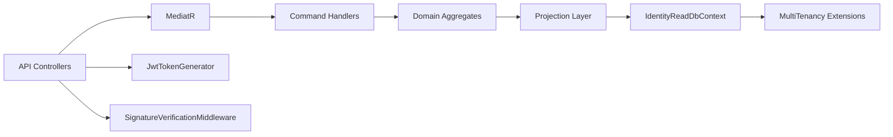

**Diagram sources**
- [Program.cs](file://src/Services/Identity/ErpSystem.Identity/Program.cs#L21-L41)
- [AuthController.cs](file://src/Services/Identity/ErpSystem.Identity/API/AuthController.cs#L9-L31)
- [FullIdentityCommands.cs](file://src/Services/Identity/ErpSystem.Identity/Application/FullIdentityCommands.cs#L27-L42)
- [Projections.cs](file://src/Services/Identity/ErpSystem.Identity/Infrastructure/Projections.cs#L73-L88)
- [SignatureVerificationMiddleware.cs](file://src/BuildingBlocks/ErpSystem.BuildingBlocks/Auth/SignatureVerificationMiddleware.cs#L14-L76)
- [MultiTenancy.cs](file://src/BuildingBlocks/ErpSystem.BuildingBlocks/MultiTenancy/MultiTenancy.cs#L29-L62)

**Section sources**
- [Program.cs](file://src/Services/Identity/ErpSystem.Identity/Program.cs#L13-L41)

## Performance Considerations
- Use read models for listing and querying to avoid heavy aggregate reconstruction
- Apply appropriate filters and limits on audit log queries
- Keep JWT token lifetime reasonable to reduce refresh overhead
- Consider caching for frequently accessed role and permission data
- Ensure database indexes on tenant-id and commonly queried fields

[No sources needed since this section provides general guidance]

## Troubleshooting Guide
- Login fails with unauthorized
  - Verify credentials against read model and password hash
  - Confirm user aggregate loads and login succeeded event applies
- Missing signature headers or invalid signature
  - Ensure X-AppId, X-Timestamp, X-Nonce, X-Signature are present and valid
  - Check timestamp is within 5 minutes and signature computed correctly
- Multi-tenant data not isolated
  - Confirm tenant context is set and global query filters applied
  - Verify new entities have TenantId set on save
- Audit logs not appearing
  - Ensure domain events are published and audit projection saves entries

**Section sources**
- [FullIdentityCommands.cs](file://src/Services/Identity/ErpSystem.Identity/Application/FullIdentityCommands.cs#L77-L89)
- [SignatureVerificationMiddleware.cs](file://src/BuildingBlocks/ErpSystem.BuildingBlocks/Auth/SignatureVerificationMiddleware.cs#L16-L76)
- [MultiTenancy.cs](file://src/BuildingBlocks/ErpSystem.BuildingBlocks/MultiTenancy/MultiTenancy.cs#L34-L62)
- [Projections.cs](file://src/Services/Identity/ErpSystem.Identity/Infrastructure/Projections.cs#L199-L208)

## Conclusion
The Identity service provides a robust foundation for user management, authentication, and authorization with clear separation of concerns through CQRS and event sourcing. It supports role-based and data-permission-based access control, maintains audit trails, and offers multi-tenant isolation. The documented endpoints and patterns enable secure, scalable integrations with external identity providers and internal services.

## Appendices
- CORS configuration: Not explicitly configured in the provided files; configure via ASP.NET Core services if needed
- Token refresh: Not implemented; clients should re-authenticate after token expiry
- External identity provider integration: Not shown in the provided files; integrate via custom authentication handler or middleware

[No sources needed since this section provides general guidance]