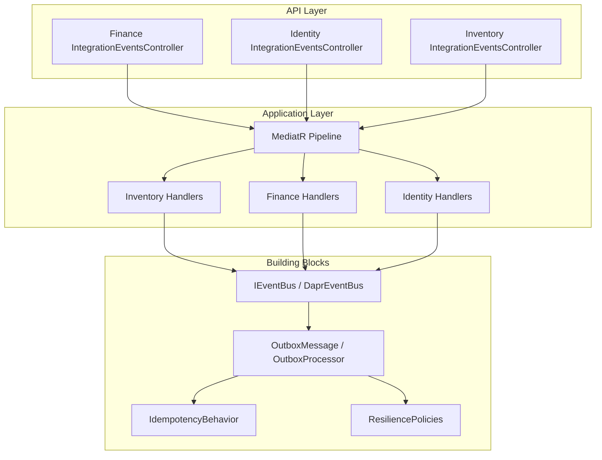
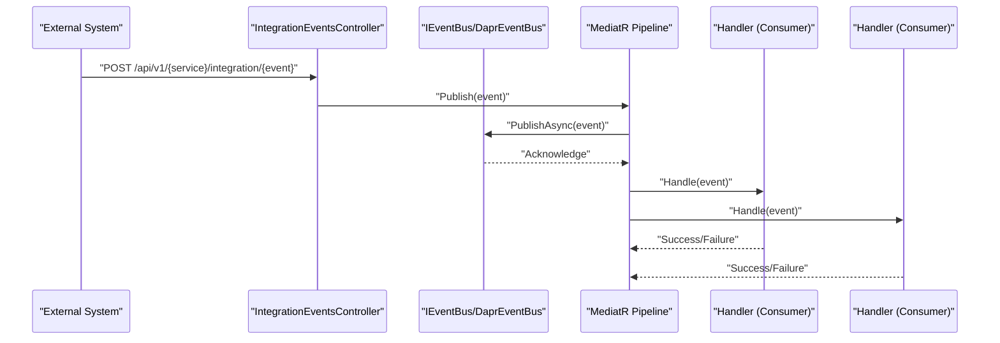
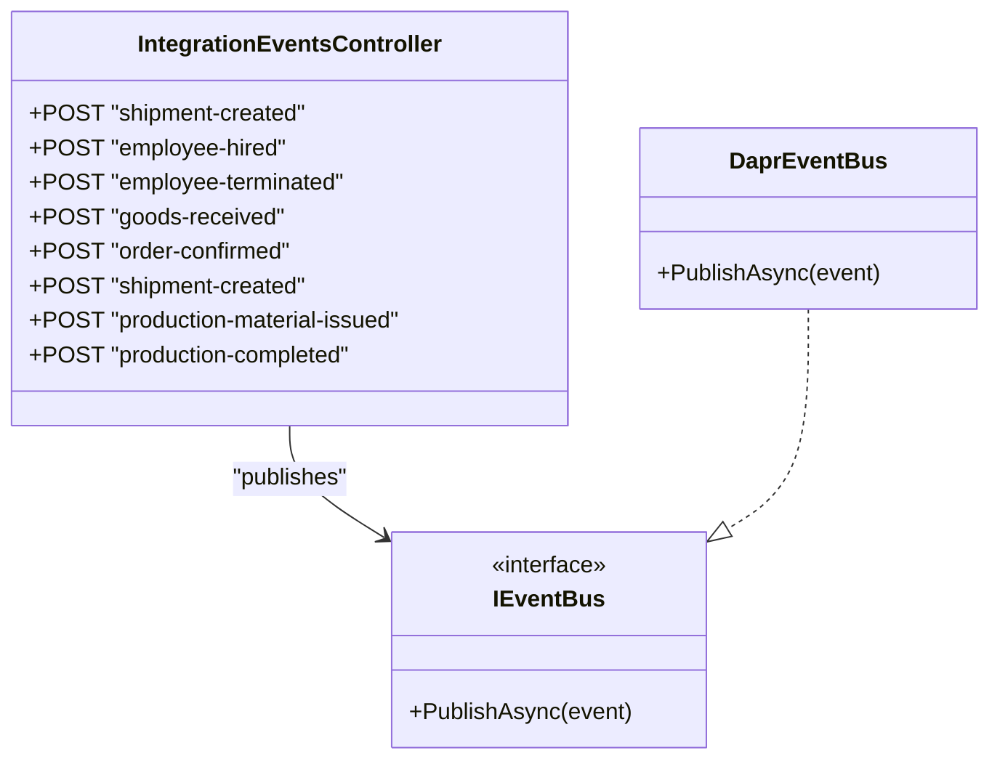
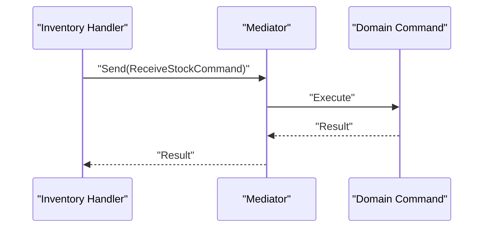
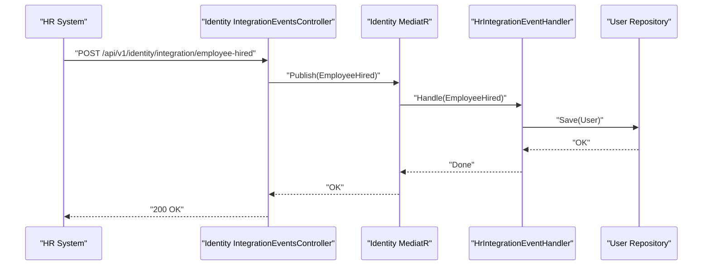
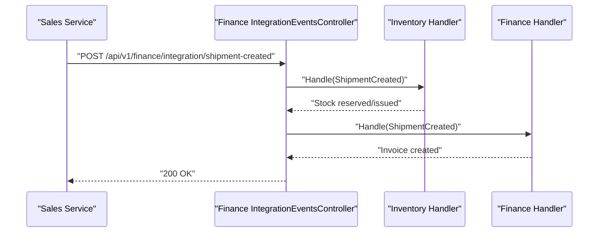
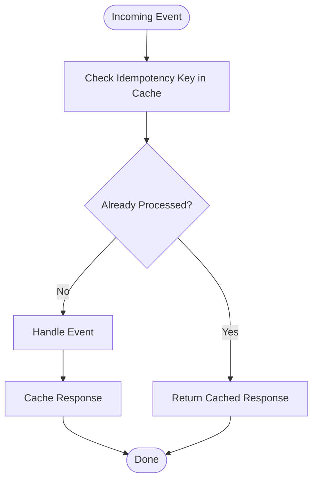
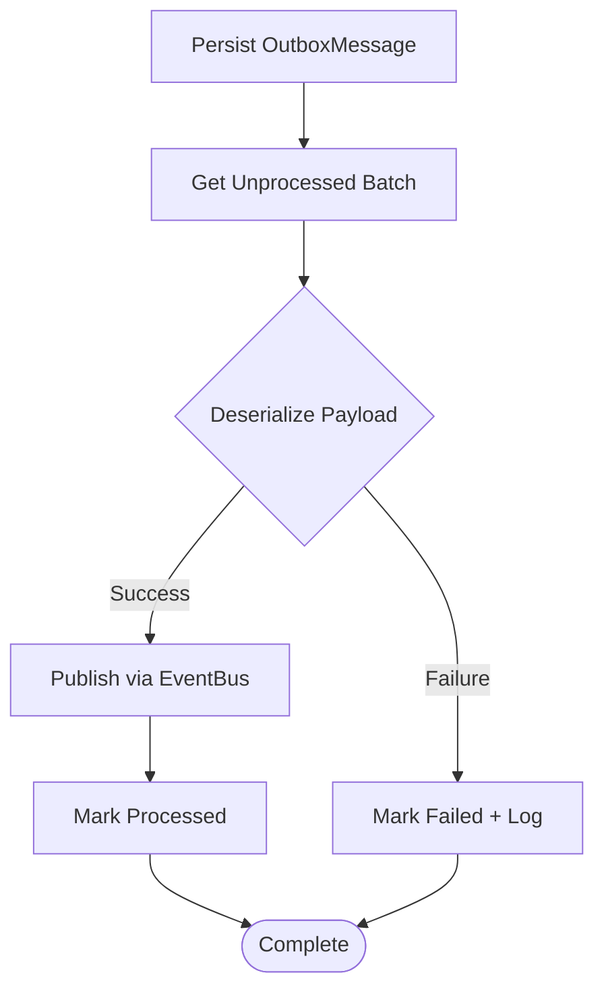
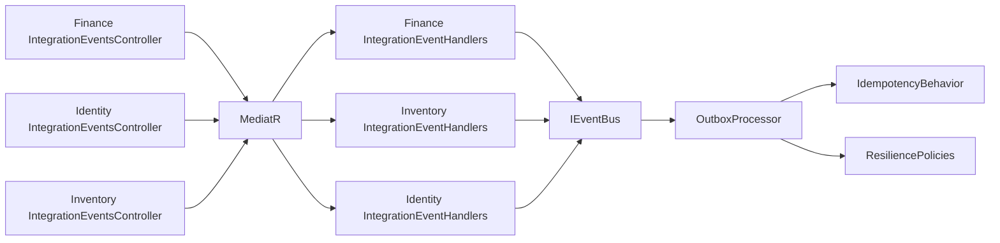

# Integration Events Endpoints

<cite>
**Referenced Files in This Document**
- [IntegrationEventsController.cs](file://src/Services/Finance/ErpSystem.Finance/API/IntegrationEventsController.cs)
- [IntegrationEventsController.cs](file://src/Services/Identity/ErpSystem.Identity/API/IntegrationEventsController.cs)
- [IntegrationEventsController.cs](file://src/Services/Inventory/ErpSystem.Inventory/API/IntegrationEventsController.cs)
- [DaprEventBus.cs](file://src/BuildingBlocks/ErpSystem.BuildingBlocks/EventBus/DaprEventBus.cs)
- [EventBusExtensions.cs](file://src/BuildingBlocks/ErpSystem.BuildingBlocks/EventBus/EventBusExtensions.cs)
- [OutboxMessage.cs](file://src/BuildingBlocks/ErpSystem.BuildingBlocks/Outbox/OutboxMessage.cs)
- [OutboxProcessor.cs](file://src/BuildingBlocks/ErpSystem.BuildingBlocks/Outbox/OutboxProcessor.cs)
- [IdempotencyBehavior.cs](file://src/BuildingBlocks/ErpSystem.BuildingBlocks/Behaviors/IdempotencyBehavior.cs)
- [ResiliencePolicies.cs](file://src/BuildingBlocks/ErpSystem.BuildingBlocks/Resilience/ResiliencePolicies.cs)
- [HRIntegrationEvents.cs](file://src/Services/Identity/ErpSystem.Identity/Application/IntegrationEvents/HRIntegrationEvents.cs)
- [HREvents.cs](file://src/Services/HR/ErpSystem.HR/Domain/HREvents.cs)
- [SalesEvents.cs](file://src/Services/Sales/ErpSystem.Sales/Domain/SalesEvents.cs)
- [ProcurementEvents.cs](file://src/Services/Procurement/ErpSystem.Procurement/Domain/ProcurementEvents.cs)
- [ProductionEvents.cs](file://src/Services/Production/ErpSystem.Production/Domain/ProductionEvents.cs)
- [IntegrationEventHandlers.cs](file://src/Services/Inventory/ErpSystem.Inventory/Application/IntegrationEventHandlers.cs)
- [IntegrationEventHandlers.cs](file://src/Services/Finance/ErpSystem.Finance/Application/IntegrationEventHandlers.cs)
- [IntegrationEventHandlers.cs](file://src/Services/Identity/ErpSystem.Identity/Application/IntegrationEventHandlers.cs)
- [ProductionOrderCommands.cs](file://src/Services/Production/ErpSystem.Production/Application/ProductionOrderCommands.cs)
- [IntegrationTestBase.cs](file://src/Tests/ErpSystem.IntegrationTests/IntegrationTestBase.cs)
</cite>

## Table of Contents
1. [Introduction](#introduction)
2. [Project Structure](#project-structure)
3. [Core Components](#core-components)
4. [Architecture Overview](#architecture-overview)
5. [Detailed Component Analysis](#detailed-component-analysis)
6. [Dependency Analysis](#dependency-analysis)
7. [Performance Considerations](#performance-considerations)
8. [Troubleshooting Guide](#troubleshooting-guide)
9. [Conclusion](#conclusion)

## Introduction
This document describes the integration event endpoints and event-driven architecture across the ERP microservices. It focuses on how services publish and consume integration events to coordinate work with external systems and internal services. Covered topics include:
- API endpoints for receiving integration events
- Event publishing patterns via the building blocks
- Subscription mechanisms using MediatR handlers
- Event-driven workflows for HR system integration, user provisioning, and cross-service notifications
- Retry mechanisms, error handling, idempotency, ordering guarantees, and monitoring patterns

## Project Structure
The integration event endpoints are exposed by dedicated controllers per service, each accepting integration events and delegating to the MediatR pipeline for dispatch. The building blocks provide the event bus abstraction and outbox pattern for reliable delivery.

**Diagram sources**
- [IntegrationEventsController.cs](file://src/Services/Finance/ErpSystem.Finance/API/IntegrationEventsController.cs#L1-L22)
- [IntegrationEventsController.cs](file://src/Services/Identity/ErpSystem.Identity/API/IntegrationEventsController.cs#L1-L31)
- [IntegrationEventsController.cs](file://src/Services/Inventory/ErpSystem.Inventory/API/IntegrationEventsController.cs#L1-L54)
- [DaprEventBus.cs](file://src/BuildingBlocks/ErpSystem.BuildingBlocks/EventBus/DaprEventBus.cs#L1-L43)
- [OutboxMessage.cs](file://src/BuildingBlocks/ErpSystem.BuildingBlocks/Outbox/OutboxMessage.cs#L1-L81)
- [OutboxProcessor.cs](file://src/BuildingBlocks/ErpSystem.BuildingBlocks/Outbox/OutboxProcessor.cs#L41-L79)
- [IdempotencyBehavior.cs](file://src/BuildingBlocks/ErpSystem.BuildingBlocks/Behaviors/IdempotencyBehavior.cs#L1-L77)
- [ResiliencePolicies.cs](file://src/BuildingBlocks/ErpSystem.BuildingBlocks/Resilience/ResiliencePolicies.cs#L1-L111)

**Section sources**
- [IntegrationEventsController.cs](file://src/Services/Finance/ErpSystem.Finance/API/IntegrationEventsController.cs#L1-L22)
- [IntegrationEventsController.cs](file://src/Services/Identity/ErpSystem.Identity/API/IntegrationEventsController.cs#L1-L31)
- [IntegrationEventsController.cs](file://src/Services/Inventory/ErpSystem.Inventory/API/IntegrationEventsController.cs#L1-L54)
- [DaprEventBus.cs](file://src/BuildingBlocks/ErpSystem.BuildingBlocks/EventBus/DaprEventBus.cs#L1-L43)
- [EventBusExtensions.cs](file://src/BuildingBlocks/ErpSystem.BuildingBlocks/EventBus/EventBusExtensions.cs#L1-L14)

## Core Components
- IntegrationEventsController: Exposes HTTP endpoints for integration events in each service.
- IEventBus/DaprEventBus: Abstraction and implementation for publishing events to the pub/sub system.
- OutboxMessage/OutboxProcessor: Reliable delivery mechanism ensuring events are persisted and published after local transactions.
- IdempotencyBehavior: Prevents duplicate processing using distributed caching keyed by request identity.
- ResiliencePolicies: Provides retry, circuit breaker, and timeout policies for resilient operations.
- Integration event models: Strongly-typed records representing cross-service events (e.g., employee lifecycle, sales, procurement, production).

**Section sources**
- [IntegrationEventsController.cs](file://src/Services/Finance/ErpSystem.Finance/API/IntegrationEventsController.cs#L1-L22)
- [IntegrationEventsController.cs](file://src/Services/Identity/ErpSystem.Identity/API/IntegrationEventsController.cs#L1-L31)
- [IntegrationEventsController.cs](file://src/Services/Inventory/ErpSystem.Inventory/API/IntegrationEventsController.cs#L1-L54)
- [DaprEventBus.cs](file://src/BuildingBlocks/ErpSystem.BuildingBlocks/EventBus/DaprEventBus.cs#L1-L43)
- [OutboxMessage.cs](file://src/BuildingBlocks/ErpSystem.BuildingBlocks/Outbox/OutboxMessage.cs#L1-L81)
- [OutboxProcessor.cs](file://src/BuildingBlocks/ErpSystem.BuildingBlocks/Outbox/OutboxProcessor.cs#L41-L79)
- [IdempotencyBehavior.cs](file://src/BuildingBlocks/ErpSystem.BuildingBlocks/Behaviors/IdempotencyBehavior.cs#L1-L77)
- [ResiliencePolicies.cs](file://src/BuildingBlocks/ErpSystem.BuildingBlocks/Resilience/ResiliencePolicies.cs#L1-L111)

## Architecture Overview
The integration event architecture follows a publish-subscribe model:
- Publishers (controllers) accept integration events and publish them via IEventBus.
- Consumers (MediatR handlers) subscribe to specific integration events and execute bounded-context-specific actions.
- Outbox ensures eventual delivery and retry semantics.
- IdempotencyBehavior prevents duplicate processing.
- ResiliencePolicies govern retries and circuit breaking.

**Diagram sources**
- [IntegrationEventsController.cs](file://src/Services/Finance/ErpSystem.Finance/API/IntegrationEventsController.cs#L10-L16)
- [IntegrationEventsController.cs](file://src/Services/Identity/ErpSystem.Identity/API/IntegrationEventsController.cs#L11-L25)
- [IntegrationEventsController.cs](file://src/Services/Inventory/ErpSystem.Inventory/API/IntegrationEventsController.cs#L10-L48)
- [DaprEventBus.cs](file://src/BuildingBlocks/ErpSystem.BuildingBlocks/EventBus/DaprEventBus.cs#L15-L21)
- [OutboxProcessor.cs](file://src/BuildingBlocks/ErpSystem.BuildingBlocks/Outbox/OutboxProcessor.cs#L45-L70)

## Detailed Component Analysis

### API Endpoints for Integration Events
Each service exposes HTTP endpoints under a versioned route to receive integration events from external systems or other services. The controllers publish the received event into the MediatR pipeline.

- Finance Integration Endpoint
  - Route: api/v1/finance/integration
  - Endpoint: POST /shipment-created
  - Purpose: Receives ShipmentCreatedIntegrationEvent and publishes it for downstream consumers (e.g., Finance invoice creation).

- Identity Integration Endpoints
  - Route: api/v1/identity/integration
  - Endpoints:
    - POST /employee-hired
    - POST /employee-terminated
  - Purpose: Receives HR lifecycle events and triggers user provisioning or deactivation.

- Inventory Integration Endpoints
  - Route: api/v1/inventory/integration
  - Endpoints:
    - POST /goods-received
    - POST /order-confirmed
    - POST /shipment-created
    - POST /production-material-issued
    - POST /production-completed
  - Purpose: Coordinates stock receipts, reservations, issues, and completions across procurement, sales, and production.

**Section sources**
- [IntegrationEventsController.cs](file://src/Services/Finance/ErpSystem.Finance/API/IntegrationEventsController.cs#L1-L22)
- [IntegrationEventsController.cs](file://src/Services/Identity/ErpSystem.Identity/API/IntegrationEventsController.cs#L1-L31)
- [IntegrationEventsController.cs](file://src/Services/Inventory/ErpSystem.Inventory/API/IntegrationEventsController.cs#L1-L54)

### Event Publishing Patterns
- Controllers receive integration events and publish them to the MediatR pipeline.
- The building blocks provide an IEventBus abstraction. The current implementation uses a dummy bus by default, but the design supports plugging in Dapr or other pub/sub providers.

**Diagram sources**
- [IntegrationEventsController.cs](file://src/Services/Finance/ErpSystem.Finance/API/IntegrationEventsController.cs#L1-L22)
- [IntegrationEventsController.cs](file://src/Services/Identity/ErpSystem.Identity/API/IntegrationEventsController.cs#L1-L31)
- [IntegrationEventsController.cs](file://src/Services/Inventory/ErpSystem.Inventory/API/IntegrationEventsController.cs#L1-L54)
- [DaprEventBus.cs](file://src/BuildingBlocks/ErpSystem.BuildingBlocks/EventBus/DaprEventBus.cs#L6-L21)

**Section sources**
- [DaprEventBus.cs](file://src/BuildingBlocks/ErpSystem.BuildingBlocks/EventBus/DaprEventBus.cs#L1-L43)
- [EventBusExtensions.cs](file://src/BuildingBlocks/ErpSystem.BuildingBlocks/EventBus/EventBusExtensions.cs#L1-L14)

### Subscription Mechanisms and Handlers
Handlers subscribe to integration events and orchestrate domain commands within their bounded contexts.

- Inventory Service Handlers
  - ProcurementIntegrationEvents.GoodsReceivedIntegrationEvent → ReceiveStockCommand
  - SalesIntegrationEvents.OrderConfirmedIntegrationEvent → ReserveStockCommand
  - SalesIntegrationEvents.ShipmentCreatedIntegrationEvent → IssueStockCommand
  - ProductionIntegrationEvents.ProductionMaterialIssuedIntegrationEvent → IssueStockCommand
  - ProductionIntegrationEvents.ProductionCompletedIntegrationEvent → ReceiveStockCommand

- Finance Service Handler
  - SalesIntegrationEvents.ShipmentCreatedIntegrationEvent → CreateInvoiceCommand

- Identity Service Handler
  - HrIntegrationEvents.EmployeeHiredIntegrationEvent → User creation/update
  - HrIntegrationEvents.EmployeeTerminatedIntegrationEvent → User lock

**Diagram sources**
- [IntegrationEventHandlers.cs](file://src/Services/Inventory/ErpSystem.Inventory/Application/IntegrationEventHandlers.cs#L14-L32)
- [IntegrationEventHandlers.cs](file://src/Services/Inventory/ErpSystem.Inventory/Application/IntegrationEventHandlers.cs#L34-L74)
- [IntegrationEventHandlers.cs](file://src/Services/Inventory/ErpSystem.Inventory/Application/IntegrationEventHandlers.cs#L76-L112)
- [IntegrationEventHandlers.cs](file://src/Services/Finance/ErpSystem.Finance/Application/IntegrationEventHandlers.cs#L6-L32)
- [IntegrationEventHandlers.cs](file://src/Services/Identity/ErpSystem.Identity/Application/IntegrationEventHandlers.cs#L8-L32)

**Section sources**
- [IntegrationEventHandlers.cs](file://src/Services/Inventory/ErpSystem.Inventory/Application/IntegrationEventHandlers.cs#L1-L112)
- [IntegrationEventHandlers.cs](file://src/Services/Finance/ErpSystem.Finance/Application/IntegrationEventHandlers.cs#L1-L33)
- [IntegrationEventHandlers.cs](file://src/Services/Identity/ErpSystem.Identity/Application/IntegrationEventHandlers.cs#L1-L33)

### Event-Driven Workflows

#### HR System Integration and User Provisioning
- External HR system publishes EmployeeHiredIntegrationEvent or EmployeeTerminatedIntegrationEvent.
- Identity service controller receives the event and publishes it to the MediatR pipeline.
- Identity handler creates or locks the user account accordingly.

**Diagram sources**
- [IntegrationEventsController.cs](file://src/Services/Identity/ErpSystem.Identity/API/IntegrationEventsController.cs#L11-L17)
- [IntegrationEventHandlers.cs](file://src/Services/Identity/ErpSystem.Identity/Application/IntegrationEventHandlers.cs#L12-L21)
- [HRIntegrationEvents.cs](file://src/Services/Identity/ErpSystem.Identity/Application/IntegrationEvents/HRIntegrationEvents.cs#L7-L14)
- [HREvents.cs](file://src/Services/HR/ErpSystem.HR/Domain/HREvents.cs#L7-L14)

**Section sources**
- [IntegrationEventsController.cs](file://src/Services/Identity/ErpSystem.Identity/API/IntegrationEventsController.cs#L1-L31)
- [IntegrationEventHandlers.cs](file://src/Services/Identity/ErpSystem.Identity/Application/IntegrationEventHandlers.cs#L1-L33)
- [HRIntegrationEvents.cs](file://src/Services/Identity/ErpSystem.Identity/Application/IntegrationEvents/HRIntegrationEvents.cs#L1-L22)
- [HREvents.cs](file://src/Services/HR/ErpSystem.HR/Domain/HREvents.cs#L1-L22)

#### Cross-Service Notifications (Sales → Inventory → Finance)
- Sales service publishes ShipmentCreatedIntegrationEvent.
- Inventory handler reserves or issues stock based on warehouse and material.
- Finance handler auto-creates an invoice upon shipment creation.

**Diagram sources**
- [IntegrationEventsController.cs](file://src/Services/Finance/ErpSystem.Finance/API/IntegrationEventsController.cs#L10-L16)
- [IntegrationEventHandlers.cs](file://src/Services/Inventory/ErpSystem.Inventory/Application/IntegrationEventHandlers.cs#L57-L73)
- [IntegrationEventHandlers.cs](file://src/Services/Finance/ErpSystem.Finance/Application/IntegrationEventHandlers.cs#L8-L32)
- [SalesEvents.cs](file://src/Services/Sales/ErpSystem.Sales/Domain/SalesEvents.cs#L19-L31)

**Section sources**
- [IntegrationEventsController.cs](file://src/Services/Finance/ErpSystem.Finance/API/IntegrationEventsController.cs#L1-L22)
- [IntegrationEventHandlers.cs](file://src/Services/Inventory/ErpSystem.Inventory/Application/IntegrationEventHandlers.cs#L1-L112)
- [IntegrationEventHandlers.cs](file://src/Services/Finance/ErpSystem.Finance/Application/IntegrationEventHandlers.cs#L1-L33)
- [SalesEvents.cs](file://src/Services/Sales/ErpSystem.Sales/Domain/SalesEvents.cs#L1-L31)

### Event Ordering Guarantees and Idempotency
- Ordering guarantees: Events are published and handled asynchronously; ordering across services is not guaranteed by the current design.
- Idempotency: The building blocks include an idempotency behavior that caches responses keyed by request identity to prevent duplicate processing.

**Diagram sources**
- [IdempotencyBehavior.cs](file://src/BuildingBlocks/ErpSystem.BuildingBlocks/Behaviors/IdempotencyBehavior.cs#L20-L50)

**Section sources**
- [IdempotencyBehavior.cs](file://src/BuildingBlocks/ErpSystem.BuildingBlocks/Behaviors/IdempotencyBehavior.cs#L1-L77)

### Retry Mechanisms and Error Handling
- Outbox pattern: Events are persisted in the same transaction as domain changes, then asynchronously dispatched by OutboxProcessor.
- Retry logic: On failure, OutboxProcessor increments retry count and stores error details; subsequent runs continue processing.
- Resilience policies: Pre-configured retry, circuit breaker, and timeout policies support robust external calls.

**Diagram sources**
- [OutboxMessage.cs](file://src/BuildingBlocks/ErpSystem.BuildingBlocks/Outbox/OutboxMessage.cs#L22-L48)
- [OutboxProcessor.cs](file://src/BuildingBlocks/ErpSystem.BuildingBlocks/Outbox/OutboxProcessor.cs#L45-L70)
- [ResiliencePolicies.cs](file://src/BuildingBlocks/ErpSystem.BuildingBlocks/Resilience/ResiliencePolicies.cs#L18-L90)

**Section sources**
- [OutboxMessage.cs](file://src/BuildingBlocks/ErpSystem.BuildingBlocks/Outbox/OutboxMessage.cs#L1-L81)
- [OutboxProcessor.cs](file://src/BuildingBlocks/ErpSystem.BuildingBlocks/Outbox/OutboxProcessor.cs#L41-L79)
- [ResiliencePolicies.cs](file://src/BuildingBlocks/ErpSystem.BuildingBlocks/Resilience/ResiliencePolicies.cs#L1-L111)

### Integration Monitoring Patterns
- OutboxProcessor logs successful and failed processing attempts, enabling monitoring dashboards.
- Test harness demonstrates substituting a test event bus to validate event flows during integration tests.

**Section sources**
- [OutboxProcessor.cs](file://src/BuildingBlocks/ErpSystem.BuildingBlocks/Outbox/OutboxProcessor.cs#L61-L68)
- [IntegrationTestBase.cs](file://src/Tests/ErpSystem.IntegrationTests/IntegrationTestBase.cs#L179-L186)

## Dependency Analysis
The integration endpoints depend on MediatR for dispatch and building block abstractions for event bus and outbox. Handlers depend on domain commands and repositories.

**Diagram sources**
- [IntegrationEventsController.cs](file://src/Services/Finance/ErpSystem.Finance/API/IntegrationEventsController.cs#L1-L22)
- [IntegrationEventsController.cs](file://src/Services/Identity/ErpSystem.Identity/API/IntegrationEventsController.cs#L1-L31)
- [IntegrationEventsController.cs](file://src/Services/Inventory/ErpSystem.Inventory/API/IntegrationEventsController.cs#L1-L54)
- [IntegrationEventHandlers.cs](file://src/Services/Finance/ErpSystem.Finance/Application/IntegrationEventHandlers.cs#L1-L33)
- [IntegrationEventHandlers.cs](file://src/Services/Inventory/ErpSystem.Inventory/Application/IntegrationEventHandlers.cs#L1-L112)
- [IntegrationEventHandlers.cs](file://src/Services/Identity/ErpSystem.Identity/Application/IntegrationEventHandlers.cs#L1-L33)
- [DaprEventBus.cs](file://src/BuildingBlocks/ErpSystem.BuildingBlocks/EventBus/DaprEventBus.cs#L1-L43)
- [OutboxProcessor.cs](file://src/BuildingBlocks/ErpSystem.BuildingBlocks/Outbox/OutboxProcessor.cs#L41-L79)
- [IdempotencyBehavior.cs](file://src/BuildingBlocks/ErpSystem.BuildingBlocks/Behaviors/IdempotencyBehavior.cs#L1-L77)
- [ResiliencePolicies.cs](file://src/BuildingBlocks/ErpSystem.BuildingBlocks/Resilience/ResiliencePolicies.cs#L1-L111)

**Section sources**
- [IntegrationEventsController.cs](file://src/Services/Finance/ErpSystem.Finance/API/IntegrationEventsController.cs#L1-L22)
- [IntegrationEventsController.cs](file://src/Services/Identity/ErpSystem.Identity/API/IntegrationEventsController.cs#L1-L31)
- [IntegrationEventsController.cs](file://src/Services/Inventory/ErpSystem.Inventory/API/IntegrationEventsController.cs#L1-L54)
- [IntegrationEventHandlers.cs](file://src/Services/Finance/ErpSystem.Finance/Application/IntegrationEventHandlers.cs#L1-L33)
- [IntegrationEventHandlers.cs](file://src/Services/Inventory/ErpSystem.Inventory/Application/IntegrationEventHandlers.cs#L1-L112)
- [IntegrationEventHandlers.cs](file://src/Services/Identity/ErpSystem.Identity/Application/IntegrationEventHandlers.cs#L1-L33)
- [DaprEventBus.cs](file://src/BuildingBlocks/ErpSystem.BuildingBlocks/EventBus/DaprEventBus.cs#L1-L43)
- [OutboxProcessor.cs](file://src/BuildingBlocks/ErpSystem.BuildingBlocks/Outbox/OutboxProcessor.cs#L41-L79)
- [IdempotencyBehavior.cs](file://src/BuildingBlocks/ErpSystem.BuildingBlocks/Behaviors/IdempotencyBehavior.cs#L1-L77)
- [ResiliencePolicies.cs](file://src/BuildingBlocks/ErpSystem.BuildingBlocks/Resilience/ResiliencePolicies.cs#L1-L111)

## Performance Considerations
- Asynchronous event processing improves throughput by decoupling producers and consumers.
- Batch processing via OutboxProcessor reduces database load.
- Circuit breaker and retry policies mitigate transient failures and protect downstream services.
- Idempotency reduces redundant work and improves resilience.

[No sources needed since this section provides general guidance]

## Troubleshooting Guide
- Verify Outbox entries: Check OutboxMessage persistence and processed timestamps to confirm delivery attempts.
- Inspect handler logs: Look for exceptions thrown by handlers and review error fields for diagnostics.
- Validate idempotency keys: Confirm duplicate requests are being short-circuited by the idempotency cache.
- Test event flows: Use the test event bus pattern to simulate event publishing and consumption during integration tests.

**Section sources**
- [OutboxMessage.cs](file://src/BuildingBlocks/ErpSystem.BuildingBlocks/Outbox/OutboxMessage.cs#L1-L81)
- [OutboxProcessor.cs](file://src/BuildingBlocks/ErpSystem.BuildingBlocks/Outbox/OutboxProcessor.cs#L41-L79)
- [IdempotencyBehavior.cs](file://src/BuildingBlocks/ErpSystem.BuildingBlocks/Behaviors/IdempotencyBehavior.cs#L1-L77)
- [IntegrationTestBase.cs](file://src/Tests/ErpSystem.IntegrationTests/IntegrationTestBase.cs#L179-L186)

## Conclusion
The integration event endpoints provide a scalable, event-driven foundation for cross-service coordination. By combining HTTP-triggered event ingestion, MediatR handlers, and building block patterns (outbox, idempotency, resilience), the system achieves reliable, observable, and maintainable integration with external systems and internal services.