# Roles and Permissions Endpoints

<cite>
**Referenced Files in This Document**
- [RolesController.cs](file://src/Services/Identity/ErpSystem.Identity/API/RolesController.cs)
- [RoleAggregate.cs](file://src/Services/Identity/ErpSystem.Identity/Domain/RoleAggregate.cs)
- [UserAggregate.cs](file://src/Services/Identity/ErpSystem.Identity/Domain/UserAggregate.cs)
- [FullIdentityCommands.cs](file://src/Services/Identity/ErpSystem.Identity/Application/FullIdentityCommands.cs)
- [DataPermissionQueries.cs](file://src/Services/Identity/ErpSystem.Identity/Application/DataPermissionQueries.cs)
- [Projections.cs](file://src/Services/Identity/ErpSystem.Identity/Infrastructure/Projections.cs)
- [UserEnhancementCommands.cs](file://src/Services/Identity/ErpSystem.Identity/Application/UserEnhancementCommands.cs)
- [IntegrationEventsController.cs](file://src/Services/Identity/ErpSystem.Identity/API/IntegrationEventsController.cs)
- [IntegrationEventHandlers.cs](file://src/Services/Identity/ErpSystem.Identity/Application/IntegrationEventHandlers.cs)
- [AuditLog.cs](file://src/BuildingBlocks/ErpSystem.BuildingBlocks/Auditing/AuditLog.cs)
- [MultiTenancy.cs](file://src/BuildingBlocks/ErpSystem.BuildingBlocks/MultiTenancy/MultiTenancy.cs)
</cite>

## Table of Contents
1. [Introduction](#introduction)
2. [Project Structure](#project-structure)
3. [Core Components](#core-components)
4. [Architecture Overview](#architecture-overview)
5. [Detailed Component Analysis](#detailed-component-analysis)
6. [Dependency Analysis](#dependency-analysis)
7. [Performance Considerations](#performance-considerations)
8. [Troubleshooting Guide](#troubleshooting-guide)
9. [Conclusion](#conclusion)

## Introduction
This document describes the roles and permissions endpoints for identity management, focusing on role creation, permission assignment, and role-to-user mapping. It also documents the underlying RBAC implementation patterns, including hierarchical role structures, dynamic permission evaluation, permission scoping, and tenant-aware configurations. Integration with external systems via event-driven synchronization and audit logging for access control changes are covered.

## Project Structure
The RBAC capabilities are implemented in the Identity service, with API endpoints, domain aggregates, application commands/queries, projections for read models, and cross-cutting concerns such as auditing and multi-tenancy.

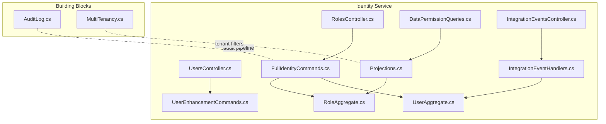

**Diagram sources**
- [RolesController.cs](file://src/Services/Identity/ErpSystem.Identity/API/RolesController.cs#L10-L38)
- [UserAggregate.cs](file://src/Services/Identity/ErpSystem.Identity/Domain/UserAggregate.cs#L55-L164)
- [RoleAggregate.cs](file://src/Services/Identity/ErpSystem.Identity/Domain/RoleAggregate.cs#L42-L94)
- [FullIdentityCommands.cs](file://src/Services/Identity/ErpSystem.Identity/Application/FullIdentityCommands.cs#L27-L122)
- [DataPermissionQueries.cs](file://src/Services/Identity/ErpSystem.Identity/Application/DataPermissionQueries.cs#L26-L78)
- [Projections.cs](file://src/Services/Identity/ErpSystem.Identity/Infrastructure/Projections.cs#L73-L209)
- [IntegrationEventsController.cs](file://src/Services/Identity/ErpSystem.Identity/API/IntegrationEventsController.cs#L9-L26)
- [IntegrationEventHandlers.cs](file://src/Services/Identity/ErpSystem.Identity/Application/IntegrationEventHandlers.cs#L8-L32)
- [AuditLog.cs](file://src/BuildingBlocks/ErpSystem.BuildingBlocks/Auditing/AuditLog.cs#L65-L101)
- [MultiTenancy.cs](file://src/BuildingBlocks/ErpSystem.BuildingBlocks/MultiTenancy/MultiTenancy.cs#L29-L62)

**Section sources**
- [RolesController.cs](file://src/Services/Identity/ErpSystem.Identity/API/RolesController.cs#L10-L38)
- [Projections.cs](file://src/Services/Identity/ErpSystem.Identity/Infrastructure/Projections.cs#L73-L88)

## Core Components
- RolesController: Exposes endpoints for role creation, listing roles, assigning permissions to a role, and configuring data permissions for a role.
- Role aggregate: Encapsulates role state, permission lists, and data permission configurations, applying domain events to evolve state.
- User aggregate: Tracks user roles and profile attributes; supports role assignment.
- Application commands and queries: Implement role creation, permission assignment, data permission configuration, and user role mapping.
- Read model projections: Persist role definitions and permissions into JSONB-backed read models for efficient querying.
- Data permission resolution: Merges multiple role permissions and data scopes for a user.
- Integration events: Enable synchronization with external systems (e.g., HR) for user lifecycle events.
- Audit and multi-tenancy: Provide audit logging for access control changes and tenant isolation.

**Section sources**
- [RolesController.cs](file://src/Services/Identity/ErpSystem.Identity/API/RolesController.cs#L14-L37)
- [RoleAggregate.cs](file://src/Services/Identity/ErpSystem.Identity/Domain/RoleAggregate.cs#L42-L94)
- [UserAggregate.cs](file://src/Services/Identity/ErpSystem.Identity/Domain/UserAggregate.cs#L55-L164)
- [FullIdentityCommands.cs](file://src/Services/Identity/ErpSystem.Identity/Application/FullIdentityCommands.cs#L91-L104)
- [DataPermissionQueries.cs](file://src/Services/Identity/ErpSystem.Identity/Application/DataPermissionQueries.cs#L11-L78)
- [Projections.cs](file://src/Services/Identity/ErpSystem.Identity/Infrastructure/Projections.cs#L137-L170)
- [IntegrationEventsController.cs](file://src/Services/Identity/ErpSystem.Identity/API/IntegrationEventsController.cs#L11-L25)
- [IntegrationEventHandlers.cs](file://src/Services/Identity/ErpSystem.Identity/Application/IntegrationEventHandlers.cs#L12-L31)
- [AuditLog.cs](file://src/BuildingBlocks/ErpSystem.BuildingBlocks/Auditing/AuditLog.cs#L65-L101)
- [MultiTenancy.cs](file://src/BuildingBlocks/ErpSystem.BuildingBlocks/MultiTenancy/MultiTenancy.cs#L29-L62)

## Architecture Overview
The RBAC architecture follows CQRS and event sourcing:
- Commands mutate aggregates and publish domain events.
- Projections materialize read models for fast queries.
- Queries resolve effective permissions and data scopes for users.
- Integration events synchronize with external systems.
- Audit behavior logs auditable requests.
- Multi-tenancy ensures tenant isolation.

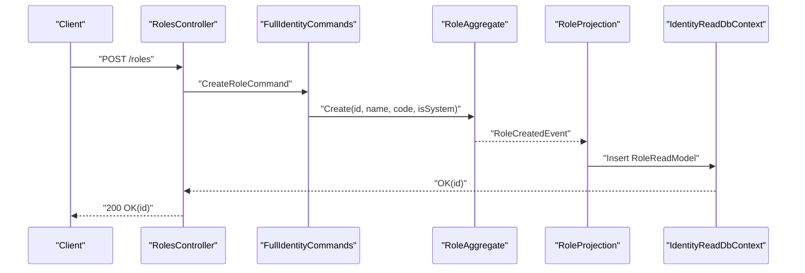

**Diagram sources**
- [RolesController.cs](file://src/Services/Identity/ErpSystem.Identity/API/RolesController.cs#L14-L19)
- [FullIdentityCommands.cs](file://src/Services/Identity/ErpSystem.Identity/Application/FullIdentityCommands.cs#L91-L97)
- [RoleAggregate.cs](file://src/Services/Identity/ErpSystem.Identity/Domain/RoleAggregate.cs#L51-L56)
- [Projections.cs](file://src/Services/Identity/ErpSystem.Identity/Infrastructure/Projections.cs#L142-L146)
- [Projections.cs](file://src/Services/Identity/ErpSystem.Identity/Infrastructure/Projections.cs#L73-L88)

## Detailed Component Analysis

### RolesController API Endpoints
- POST /api/v1/identity/roles
  - Purpose: Create a new role.
  - Request body: CreateRoleCommand (name, code, isSystem).
  - Response: 200 OK with new role identifier.
- GET /api/v1/identity/roles
  - Purpose: Retrieve all roles from the read model.
  - Response: 200 OK with list of roles.
- POST /api/v1/identity/roles/{id}/permissions
  - Purpose: Assign a permission to a role.
  - Path parameter: id (roleId).
  - Request body: permissionCode (string).
  - Response: 204 No Content.
- POST /api/v1/identity/roles/{id}/data-permissions
  - Purpose: Configure data permissions for a role.
  - Path parameter: id (roleId).
  - Request body: ConfigureDataPermissionRequest (roleId, dataDomain, scopeType, allowedIds).
  - Response: 204 No Content.

Notes:
- The controller delegates to MediatR handlers for command execution.
- The data-permission endpoint validates that the roleId matches the path id.

**Section sources**
- [RolesController.cs](file://src/Services/Identity/ErpSystem.Identity/API/RolesController.cs#L14-L37)

### Role Aggregate and Events
- Role aggregate maintains:
  - Role metadata: name, code, isSystem.
  - Permissions: list of permission codes.
  - Data permissions: per-domain scope and allowed identifiers.
- Domain events:
  - RoleCreatedEvent
  - RolePermissionAssignedEvent
  - RoleDataPermissionConfiguredEvent
- Apply logic updates state based on events and prevents duplicates for permissions.

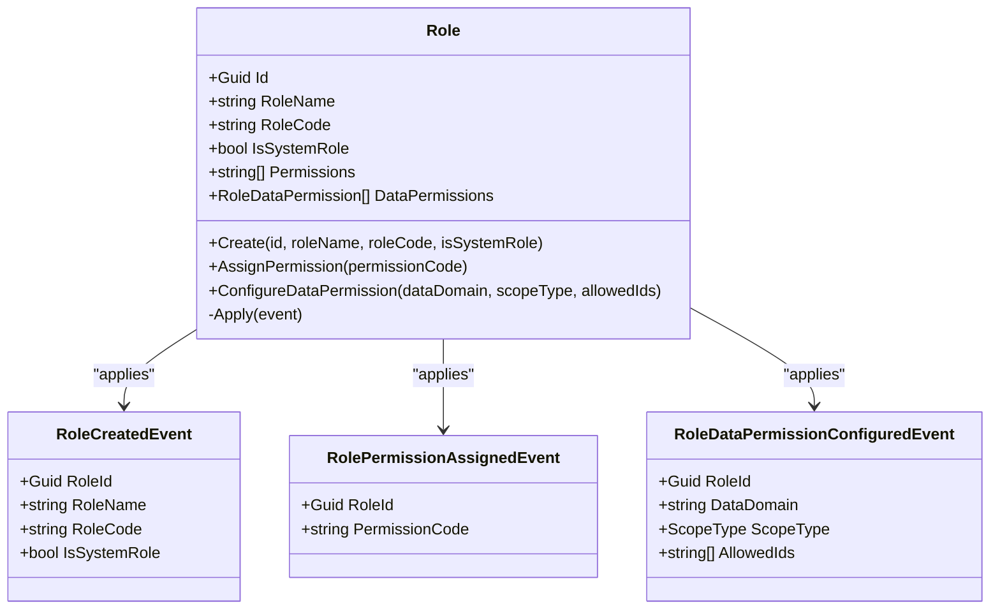

**Diagram sources**
- [RoleAggregate.cs](file://src/Services/Identity/ErpSystem.Identity/Domain/RoleAggregate.cs#L42-L94)

**Section sources**
- [RoleAggregate.cs](file://src/Services/Identity/ErpSystem.Identity/Domain/RoleAggregate.cs#L42-L94)

### Permission Assignment Workflow
- Endpoint: POST /roles/{id}/permissions
- Steps:
  1. Validate input (permissionCode).
  2. Send AssignRolePermissionCommand to mediator.
  3. Command handler loads role, assigns permission, persists aggregate.
  4. Role projection updates RoleReadModel.Permissions.

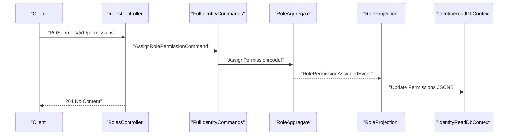

**Diagram sources**
- [RolesController.cs](file://src/Services/Identity/ErpSystem.Identity/API/RolesController.cs#L24-L29)
- [FullIdentityCommands.cs](file://src/Services/Identity/ErpSystem.Identity/Application/FullIdentityCommands.cs#L99-L104)
- [Projections.cs](file://src/Services/Identity/ErpSystem.Identity/Infrastructure/Projections.cs#L148-L156)

**Section sources**
- [RolesController.cs](file://src/Services/Identity/ErpSystem.Identity/API/RolesController.cs#L24-L29)
- [FullIdentityCommands.cs](file://src/Services/Identity/ErpSystem.Identity/Application/FullIdentityCommands.cs#L99-L104)
- [Projections.cs](file://src/Services/Identity/ErpSystem.Identity/Infrastructure/Projections.cs#L148-L156)

### Data Permission Configuration
- Endpoint: POST /roles/{id}/data-permissions
- Request payload includes:
  - RoleId
  - DataDomain
  - ScopeType (Self, Department, DepartmentAndSub, All, Custom)
  - AllowedIds (list of identifiers)
- Steps:
  1. Validate roleId equals path id.
  2. Send ConfigureRoleDataPermissionCommand.
  3. Command handler applies data permission change to role.
  4. Projection updates RoleReadModel.DataPermissions.

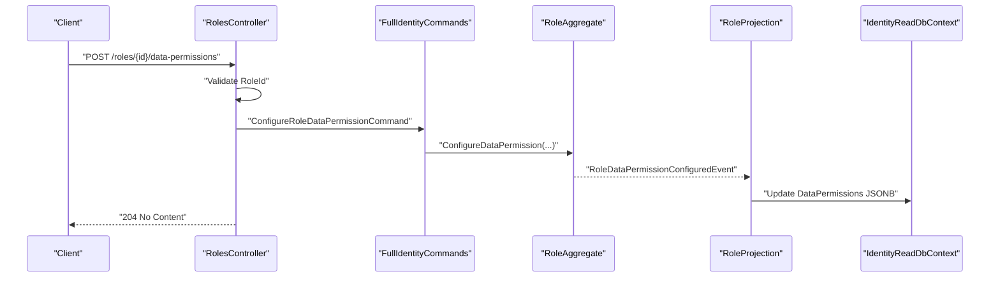

**Diagram sources**
- [RolesController.cs](file://src/Services/Identity/ErpSystem.Identity/API/RolesController.cs#L31-L37)
- [FullIdentityCommands.cs](file://src/Services/Identity/ErpSystem.Identity/Application/FullIdentityCommands.cs#L60-L66)
- [Projections.cs](file://src/Services/Identity/ErpSystem.Identity/Infrastructure/Projections.cs#L158-L169)

**Section sources**
- [RolesController.cs](file://src/Services/Identity/ErpSystem.Identity/API/RolesController.cs#L31-L37)
- [FullIdentityCommands.cs](file://src/Services/Identity/ErpSystem.Identity/Application/FullIdentityCommands.cs#L60-L66)
- [Projections.cs](file://src/Services/Identity/ErpSystem.Identity/Infrastructure/Projections.cs#L158-L169)

### Dynamic Permission Evaluation
- Query: GetUserDataPermissionsQuery(userId, dataDomain)
- Resolution logic:
  1. Load user to obtain assigned role codes.
  2. Load role definitions from read model filtered by role codes.
  3. Merge permissions and data permissions across roles.
  4. Determine final scope based on ScopeType comparison.
- Current behavior merges permissions and scopes; the resolved data permission object captures the final scope.

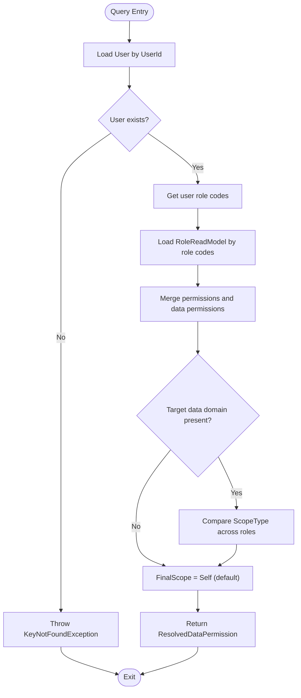

**Diagram sources**
- [DataPermissionQueries.cs](file://src/Services/Identity/ErpSystem.Identity/Application/DataPermissionQueries.cs#L28-L74)

**Section sources**
- [DataPermissionQueries.cs](file://src/Services/Identity/ErpSystem.Identity/Application/DataPermissionQueries.cs#L11-L78)

### Role-to-User Mapping
- Endpoint: POST /users/{userId}/roles (mapped via UserEnhancementCommands)
- Command: AssignRoleToUserCommand(userId, roleCode)
- Behavior:
  - Loads user aggregate.
  - Assigns role code if not already assigned.
  - Persists user aggregate.
- This enables role inheritance by association: a user’s effective permissions are the union of all permissions across their roles.

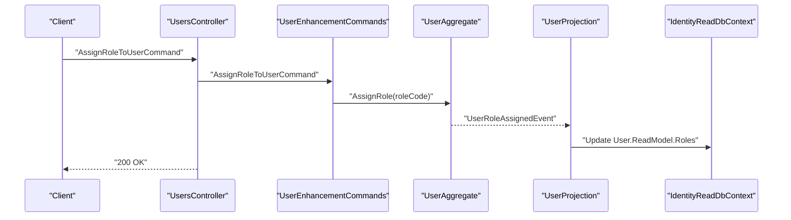

**Diagram sources**
- [UserEnhancementCommands.cs](file://src/Services/Identity/ErpSystem.Identity/Application/UserEnhancementCommands.cs#L54-L62)
- [UserAggregate.cs](file://src/Services/Identity/ErpSystem.Identity/Domain/UserAggregate.cs#L108-L114)
- [Projections.cs](file://src/Services/Identity/ErpSystem.Identity/Infrastructure/Projections.cs#L91-L134)

**Section sources**
- [UserEnhancementCommands.cs](file://src/Services/Identity/ErpSystem.Identity/Application/UserEnhancementCommands.cs#L14-L62)
- [UserAggregate.cs](file://src/Services/Identity/ErpSystem.Identity/Domain/UserAggregate.cs#L70-L114)

### Hierarchical Role Structures and Inheritance
- The current implementation supports role inheritance by mapping multiple roles to a user. Effective permissions are the union of all role permissions.
- Data permission scoping is resolved per domain and compared across roles; the highest applicable scope is selected for the final result.
- There is no explicit parent-child role relationship modeled in the domain yet; inheritance is achieved through multiple role assignments.

**Section sources**
- [UserAggregate.cs](file://src/Services/Identity/ErpSystem.Identity/Domain/UserAggregate.cs#L70-L114)
- [DataPermissionQueries.cs](file://src/Services/Identity/ErpSystem.Identity/Application/DataPermissionQueries.cs#L44-L66)

### Permission Scoping and Tenant-Specific Configurations
- ScopeType enumeration defines scoping levels: Self, Department, DepartmentAndSub, All, Custom.
- Data permissions are stored as JSONB in the read model, enabling flexible per-domain scoping.
- Multi-tenancy is enforced via global query filters and automatic tenant-id setting on save, ensuring tenant isolation for all multi-tenant entities.

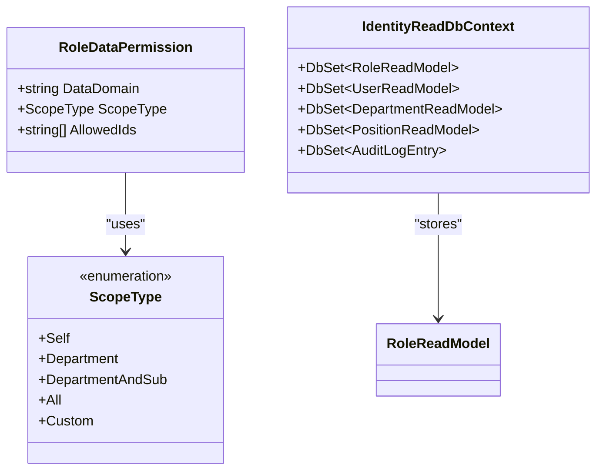

**Diagram sources**
- [RoleAggregate.cs](file://src/Services/Identity/ErpSystem.Identity/Domain/RoleAggregate.cs#L30-L37)
- [Projections.cs](file://src/Services/Identity/ErpSystem.Identity/Infrastructure/Projections.cs#L30-L40)
- [MultiTenancy.cs](file://src/BuildingBlocks/ErpSystem.BuildingBlocks/MultiTenancy/MultiTenancy.cs#L29-L62)

**Section sources**
- [RoleAggregate.cs](file://src/Services/Identity/ErpSystem.Identity/Domain/RoleAggregate.cs#L30-L37)
- [Projections.cs](file://src/Services/Identity/ErpSystem.Identity/Infrastructure/Projections.cs#L30-L40)
- [MultiTenancy.cs](file://src/BuildingBlocks/ErpSystem.BuildingBlocks/MultiTenancy/MultiTenancy.cs#L29-L62)

### Integration with External Systems
- Integration events:
  - EmployeeHiredIntegrationEvent: Creates a user and updates profile on HR hire.
  - EmployeeTerminatedIntegrationEvent: Locks a user account on termination.
- Endpoints:
  - POST /integration/employee-hired
  - POST /integration/employee-terminated
- Handlers publish events to the mediator, which invokes integration handlers.

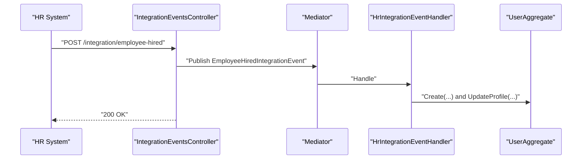

**Diagram sources**
- [IntegrationEventsController.cs](file://src/Services/Identity/ErpSystem.Identity/API/IntegrationEventsController.cs#L11-L16)
- [IntegrationEventHandlers.cs](file://src/Services/Identity/ErpSystem.Identity/Application/IntegrationEventHandlers.cs#L12-L21)

**Section sources**
- [IntegrationEventsController.cs](file://src/Services/Identity/ErpSystem.Identity/API/IntegrationEventsController.cs#L11-L25)
- [IntegrationEventHandlers.cs](file://src/Services/Identity/ErpSystem.Identity/Application/IntegrationEventHandlers.cs#L8-L32)

### Audit Logging for Access Control Changes
- Audit behavior intercepts auditable requests and writes audit log entries with entity type, entity id, action, and user context.
- Applied as a pipeline behavior around command execution to capture role and permission changes.

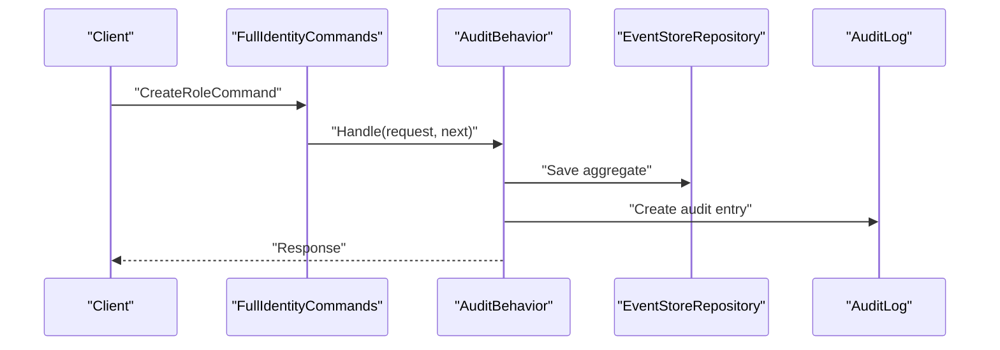

**Diagram sources**
- [AuditLog.cs](file://src/BuildingBlocks/ErpSystem.BuildingBlocks/Auditing/AuditLog.cs#L65-L101)
- [FullIdentityCommands.cs](file://src/Services/Identity/ErpSystem.Identity/Application/FullIdentityCommands.cs#L91-L97)

**Section sources**
- [AuditLog.cs](file://src/BuildingBlocks/ErpSystem.BuildingBlocks/Auditing/AuditLog.cs#L65-L101)
- [FullIdentityCommands.cs](file://src/Services/Identity/ErpSystem.Identity/Application/FullIdentityCommands.cs#L91-L97)

## Dependency Analysis
- RolesController depends on MediatR and the read database for listing roles.
- FullIdentityCommands orchestrates role and user aggregates and persists changes.
- RoleProjection and UserProjection maintain read models for efficient querying.
- DataPermissionQueries resolves effective permissions and scopes using read models.
- IntegrationEventHandlers react to HR events and update user aggregates.
- AuditBehavior and MultiTenancy are cross-cutting concerns applied at the pipeline and persistence layers.

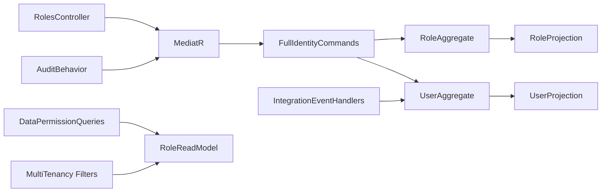

**Diagram sources**
- [RolesController.cs](file://src/Services/Identity/ErpSystem.Identity/API/RolesController.cs#L12-L22)
- [FullIdentityCommands.cs](file://src/Services/Identity/ErpSystem.Identity/Application/FullIdentityCommands.cs#L27-L42)
- [Projections.cs](file://src/Services/Identity/ErpSystem.Identity/Infrastructure/Projections.cs#L137-L170)
- [DataPermissionQueries.cs](file://src/Services/Identity/ErpSystem.Identity/Application/DataPermissionQueries.cs#L26-L58)
- [IntegrationEventHandlers.cs](file://src/Services/Identity/ErpSystem.Identity/Application/IntegrationEventHandlers.cs#L8-L32)
- [AuditLog.cs](file://src/BuildingBlocks/ErpSystem.BuildingBlocks/Auditing/AuditLog.cs#L65-L101)
- [MultiTenancy.cs](file://src/BuildingBlocks/ErpSystem.BuildingBlocks/MultiTenancy/MultiTenancy.cs#L29-L62)

**Section sources**
- [RolesController.cs](file://src/Services/Identity/ErpSystem.Identity/API/RolesController.cs#L12-L22)
- [FullIdentityCommands.cs](file://src/Services/Identity/ErpSystem.Identity/Application/FullIdentityCommands.cs#L27-L42)
- [Projections.cs](file://src/Services/Identity/ErpSystem.Identity/Infrastructure/Projections.cs#L137-L170)
- [DataPermissionQueries.cs](file://src/Services/Identity/ErpSystem.Identity/Application/DataPermissionQueries.cs#L26-L58)
- [IntegrationEventHandlers.cs](file://src/Services/Identity/ErpSystem.Identity/Application/IntegrationEventHandlers.cs#L8-L32)
- [AuditLog.cs](file://src/BuildingBlocks/ErpSystem.BuildingBlocks/Auditing/AuditLog.cs#L65-L101)
- [MultiTenancy.cs](file://src/BuildingBlocks/ErpSystem.BuildingBlocks/MultiTenancy/MultiTenancy.cs#L29-L62)

## Performance Considerations
- Read model projections store permissions and data permissions as JSONB for fast retrieval.
- Queries load roles by role codes rather than iterating aggregates, reducing latency.
- Scope comparisons are simple enum comparisons; consider caching resolved scopes for hot paths.
- Audit logging occurs asynchronously via pipeline behavior; ensure audit storage is indexed appropriately.

[No sources needed since this section provides general guidance]

## Troubleshooting Guide
- Role not found when assigning permissions:
  - Ensure the role exists and the id is correct.
  - Verify the read model is up to date after role creation.
- Permission not reflected:
  - Confirm the role projection updated Permissions JSONB.
  - Check that the user has the role assigned.
- Data permission scope not applied:
  - Verify ConfigureDataPermissionRequest matches the role id and data domain.
  - Confirm the projection updated DataPermissions JSONB.
- User locked after failed logins:
  - The User aggregate locks accounts after repeated failures; unlock via user enhancement commands.
- Integration events not processed:
  - Ensure integration endpoints receive events and handlers are registered.

**Section sources**
- [FullIdentityCommands.cs](file://src/Services/Identity/ErpSystem.Identity/Application/FullIdentityCommands.cs#L99-L104)
- [Projections.cs](file://src/Services/Identity/ErpSystem.Identity/Infrastructure/Projections.cs#L148-L169)
- [UserEnhancementCommands.cs](file://src/Services/Identity/ErpSystem.Identity/Application/UserEnhancementCommands.cs#L23-L41)
- [IntegrationEventsController.cs](file://src/Services/Identity/ErpSystem.Identity/API/IntegrationEventsController.cs#L11-L25)

## Conclusion
The Identity service provides a robust foundation for RBAC with role creation, permission assignment, and data-scoped permissions. Dynamic evaluation combines multiple role permissions and scopes to derive effective access for users. Integration events enable synchronization with external systems, while audit logging and multi-tenancy support compliance and tenant isolation. Future enhancements could include explicit role hierarchy modeling and richer permission expression languages.