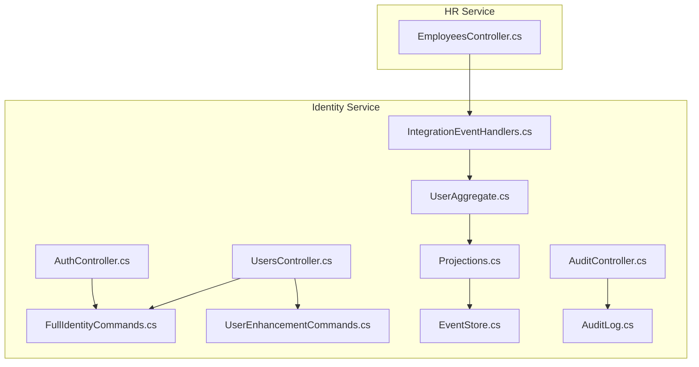
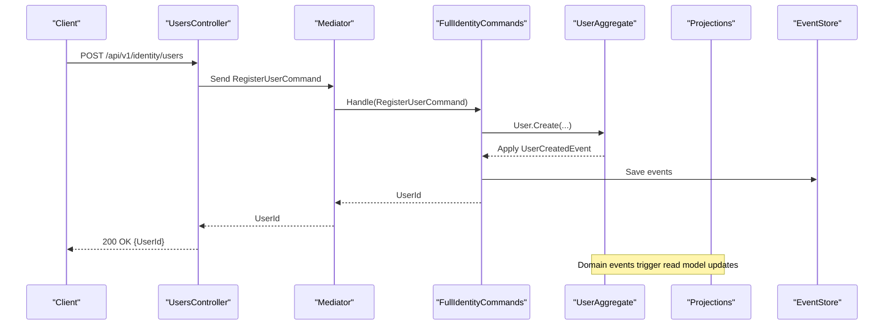
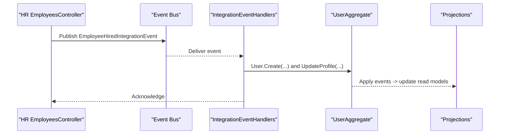
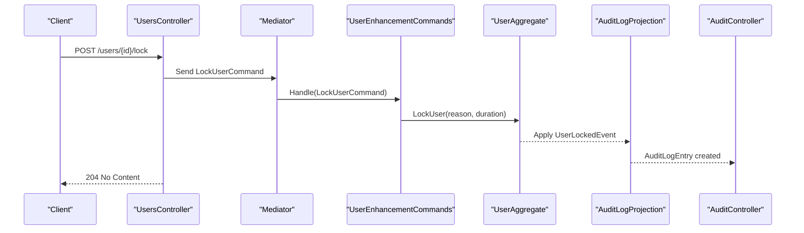
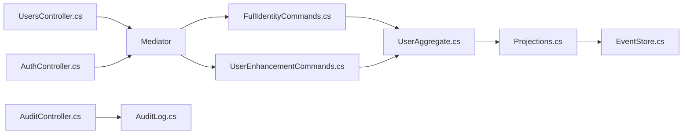
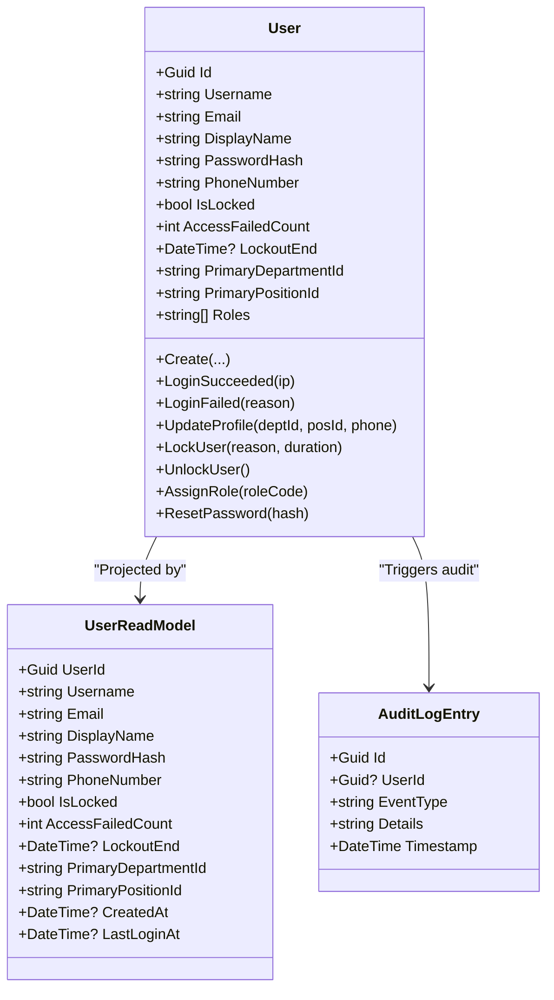

# User Management Endpoints

<cite>
**Referenced Files in This Document**
- [UsersController.cs](file://src/Services/Identity/ErpSystem.Identity/API/UsersController.cs)
- [AuthController.cs](file://src/Services/Identity/ErpSystem.Identity/API/AuthController.cs)
- [FullIdentityCommands.cs](file://src/Services/Identity/ErpSystem.Identity/Application/FullIdentityCommands.cs)
- [UserEnhancementCommands.cs](file://src/Services/Identity/ErpSystem.Identity/Application/UserEnhancementCommands.cs)
- [IntegrationEventHandlers.cs](file://src/Services/Identity/ErpSystem.Identity/Application/IntegrationEventHandlers.cs)
- [UserAggregate.cs](file://src/Services/Identity/ErpSystem.Identity/Domain/UserAggregate.cs)
- [Projections.cs](file://src/Services/Identity/ErpSystem.Identity/Infrastructure/Projections.cs)
- [EventStore.cs](file://src/Services/Identity/ErpSystem.Identity/Infrastructure/EventStore.cs)
- [AuditController.cs](file://src/Services/Identity/ErpSystem.Identity/API/AuditController.cs)
- [AuditLog.cs](file://src/BuildingBlocks/ErpSystem.BuildingBlocks/Auditing/AuditLog.cs)
- [EmployeesController.cs](file://src/Services/HR/ErpSystem.HR/API/EmployeesController.cs)
</cite>

## Table of Contents
1. [Introduction](#introduction)
2. [Project Structure](#project-structure)
3. [Core Components](#core-components)
4. [Architecture Overview](#architecture-overview)
5. [Detailed Component Analysis](#detailed-component-analysis)
6. [Dependency Analysis](#dependency-analysis)
7. [Performance Considerations](#performance-considerations)
8. [Troubleshooting Guide](#troubleshooting-guide)
9. [Conclusion](#conclusion)
10. [Appendices](#appendices)

## Introduction
This document provides API documentation for user management endpoints within the Identity service, focusing on:
- CRUD operations for users
- User search capabilities
- Profile updates
- User status management (lock/unlock)
- Role assignment
- Bulk user operations (conceptual)
- User deactivation procedures
- Search filters and pagination
- Data validation rules
- Examples of user creation workflows and profile update scenarios
- Integration with HR systems for automatic user provisioning
- Privacy, PII handling, and audit trail requirements

## Project Structure
The user management APIs are primarily implemented in the Identity service, with supporting domain events, projections, and integration handlers. The HR service exposes employee-related endpoints that can trigger identity actions via integration events.

**Diagram sources**
- [UsersController.cs](file://src/Services/Identity/ErpSystem.Identity/API/UsersController.cs#L1-L56)
- [AuthController.cs](file://src/Services/Identity/ErpSystem.Identity/API/AuthController.cs#L1-L32)
- [FullIdentityCommands.cs](file://src/Services/Identity/ErpSystem.Identity/Application/FullIdentityCommands.cs#L1-L130)
- [UserEnhancementCommands.cs](file://src/Services/Identity/ErpSystem.Identity/Application/UserEnhancementCommands.cs#L1-L64)
- [IntegrationEventHandlers.cs](file://src/Services/Identity/ErpSystem.Identity/Application/IntegrationEventHandlers.cs#L1-L33)
- [UserAggregate.cs](file://src/Services/Identity/ErpSystem.Identity/Domain/UserAggregate.cs#L1-L164)
- [Projections.cs](file://src/Services/Identity/ErpSystem.Identity/Infrastructure/Projections.cs#L1-L209)
- [EventStore.cs](file://src/Services/Identity/ErpSystem.Identity/Infrastructure/EventStore.cs#L1-L19)
- [AuditController.cs](file://src/Services/Identity/ErpSystem.Identity/API/AuditController.cs#L1-L25)
- [AuditLog.cs](file://src/BuildingBlocks/ErpSystem.BuildingBlocks/Auditing/AuditLog.cs#L1-L135)
- [EmployeesController.cs](file://src/Services/HR/ErpSystem.HR/API/EmployeesController.cs#L1-L48)

**Section sources**
- [UsersController.cs](file://src/Services/Identity/ErpSystem.Identity/API/UsersController.cs#L1-L56)
- [AuthController.cs](file://src/Services/Identity/ErpSystem.Identity/API/AuthController.cs#L1-L32)
- [FullIdentityCommands.cs](file://src/Services/Identity/ErpSystem.Identity/Application/FullIdentityCommands.cs#L1-L130)
- [UserEnhancementCommands.cs](file://src/Services/Identity/ErpSystem.Identity/Application/UserEnhancementCommands.cs#L1-L64)
- [IntegrationEventHandlers.cs](file://src/Services/Identity/ErpSystem.Identity/Application/IntegrationEventHandlers.cs#L1-L33)
- [UserAggregate.cs](file://src/Services/Identity/ErpSystem.Identity/Domain/UserAggregate.cs#L1-L164)
- [Projections.cs](file://src/Services/Identity/ErpSystem.Identity/Infrastructure/Projections.cs#L1-L209)
- [EventStore.cs](file://src/Services/Identity/ErpSystem.Identity/Infrastructure/EventStore.cs#L1-L19)
- [AuditController.cs](file://src/Services/Identity/ErpSystem.Identity/API/AuditController.cs#L1-L25)
- [AuditLog.cs](file://src/BuildingBlocks/ErpSystem.BuildingBlocks/Auditing/AuditLog.cs#L1-L135)
- [EmployeesController.cs](file://src/Services/HR/ErpSystem.HR/API/EmployeesController.cs#L1-L48)

## Core Components
- UsersController: Exposes endpoints for user creation, retrieval, profile updates, role assignment, and user lock/unlock.
- AuthController: Provides registration and login endpoints.
- FullIdentityCommands: Implements user creation, login, and profile update commands.
- UserEnhancementCommands: Handles user lock/unlock, password reset, and role assignment.
- IntegrationEventHandlers: Processes HR integration events to auto-provision users and deactivate terminated employees.
- UserAggregate: Defines user domain model, state transitions, and domain events.
- Projections: Maintains read models and audit logs from domain events.
- AuditController and AuditLog: Supports audit log retrieval and audit behavior pipeline.

**Section sources**
- [UsersController.cs](file://src/Services/Identity/ErpSystem.Identity/API/UsersController.cs#L1-L56)
- [AuthController.cs](file://src/Services/Identity/ErpSystem.Identity/API/AuthController.cs#L1-L32)
- [FullIdentityCommands.cs](file://src/Services/Identity/ErpSystem.Identity/Application/FullIdentityCommands.cs#L1-L130)
- [UserEnhancementCommands.cs](file://src/Services/Identity/ErpSystem.Identity/Application/UserEnhancementCommands.cs#L1-L64)
- [IntegrationEventHandlers.cs](file://src/Services/Identity/ErpSystem.Identity/Application/IntegrationEventHandlers.cs#L1-L33)
- [UserAggregate.cs](file://src/Services/Identity/ErpSystem.Identity/Domain/UserAggregate.cs#L1-L164)
- [Projections.cs](file://src/Services/Identity/ErpSystem.Identity/Infrastructure/Projections.cs#L1-L209)
- [AuditController.cs](file://src/Services/Identity/ErpSystem.Identity/API/AuditController.cs#L1-L25)
- [AuditLog.cs](file://src/BuildingBlocks/ErpSystem.BuildingBlocks/Auditing/AuditLog.cs#L1-L135)

## Architecture Overview
The user management system follows CQRS and event sourcing:
- Write model: Controllers dispatch commands to handlers that mutate aggregates.
- Read model: Projections maintain denormalized read models from domain events.
- Audit: Audit behavior captures auditable command execution; domain events also project audit entries.

**Diagram sources**
- [UsersController.cs](file://src/Services/Identity/ErpSystem.Identity/API/UsersController.cs#L13-L18)
- [FullIdentityCommands.cs](file://src/Services/Identity/ErpSystem.Identity/Application/FullIdentityCommands.cs#L68-L75)
- [UserAggregate.cs](file://src/Services/Identity/ErpSystem.Identity/Domain/UserAggregate.cs#L72-L77)
- [Projections.cs](file://src/Services/Identity/ErpSystem.Identity/Infrastructure/Projections.cs#L99-L103)
- [EventStore.cs](file://src/Services/Identity/ErpSystem.Identity/Infrastructure/EventStore.cs#L6-L18)

## Detailed Component Analysis

### User Management Endpoints

#### Base Path
- Identity service base path: `/api/v1/identity`

#### Authentication and Registration
- POST /auth/register
  - Purpose: Register a new user account.
  - Request body: RegisterUserCommand (fields: username, email, password, displayName).
  - Response: 200 OK with { userId }.
  - Notes: Password is hashed before persistence.

- POST /auth/login
  - Purpose: Authenticate user and issue a JWT token.
  - Request body: LoginUserCommand (fields: username, password).
  - Response: 200 OK with { token } or 401 Unauthorized on failure.

**Section sources**
- [AuthController.cs](file://src/Services/Identity/ErpSystem.Identity/API/AuthController.cs#L11-L30)
- [FullIdentityCommands.cs](file://src/Services/Identity/ErpSystem.Identity/Application/FullIdentityCommands.cs#L15-L17)
- [FullIdentityCommands.cs](file://src/Services/Identity/ErpSystem.Identity/Application/FullIdentityCommands.cs#L68-L89)

#### User CRUD Operations
- POST /users
  - Purpose: Create a new user.
  - Request body: RegisterUserCommand.
  - Response: 200 OK with { userId }.

- GET /users
  - Purpose: Retrieve all users (read model).
  - Response: 200 OK with array of UserReadModel.

- GET /users/{id}
  - Purpose: Retrieve a user by ID (read model).
  - Response: 200 OK with UserReadModel.

- PUT /users/{id}/profile
  - Purpose: Update user profile (department, position, phone).
  - Request body: UpdateUserProfileCommand (fields: userId, deptId, posId, phone).
  - Response: 204 No Content.

- POST /users/{id}/lock
  - Purpose: Lock user account with a reason (demo duration).
  - Request body: string reason.
  - Response: 204 No Content.

- POST /users/{id}/unlock
  - Purpose: Unlock user account.
  - Response: 204 No Content.

- POST /users/{id}/roles
  - Purpose: Assign a role to the user.
  - Request body: string roleCode.
  - Response: 204 No Content.

Notes:
- Profile updates validate that the id matches the command’s UserId.
- Lock/unlock endpoints use domain methods that apply appropriate events and update read models.
- Role assignment applies a domain event and updates read models accordingly.

**Section sources**
- [UsersController.cs](file://src/Services/Identity/ErpSystem.Identity/API/UsersController.cs#L13-L54)
- [FullIdentityCommands.cs](file://src/Services/Identity/ErpSystem.Identity/Application/FullIdentityCommands.cs#L11-L11)
- [FullIdentityCommands.cs](file://src/Services/Identity/ErpSystem.Identity/Application/FullIdentityCommands.cs#L52-L58)
- [UserEnhancementCommands.cs](file://src/Services/Identity/ErpSystem.Identity/Application/UserEnhancementCommands.cs#L8-L14)
- [UserEnhancementCommands.cs](file://src/Services/Identity/ErpSystem.Identity/Application/UserEnhancementCommands.cs#L23-L41)
- [UserEnhancementCommands.cs](file://src/Services/Identity/ErpSystem.Identity/Application/UserEnhancementCommands.cs#L54-L62)
- [UserAggregate.cs](file://src/Services/Identity/ErpSystem.Identity/Domain/UserAggregate.cs#L93-L119)
- [Projections.cs](file://src/Services/Identity/ErpSystem.Identity/Infrastructure/Projections.cs#L129-L133)

#### User Search and Pagination
- GET /users
  - Purpose: Retrieve all users (read model).
  - Response: 200 OK with array of UserReadModel.
  - Pagination: Not implemented in this endpoint; consider adding page and pageSize query parameters if needed.

Note: The HR service provides a search endpoint with pagination and filters that can be used to query employees and then map to user identities.

**Section sources**
- [UsersController.cs](file://src/Services/Identity/ErpSystem.Identity/API/UsersController.cs#L20-L21)
- [EmployeesController.cs](file://src/Services/HR/ErpSystem.HR/API/EmployeesController.cs#L17-L20)

#### HR Integration for Automatic Provisioning
- When an employee is hired, the HR service publishes an integration event. The Identity service handles it by:
  - Creating a user with default password.
  - Updating profile with department and position.
  - Saving the aggregate and allowing projections to update read models.

- When an employee is terminated, the HR integration handler locks the user account for an extended period.

**Diagram sources**
- [IntegrationEventHandlers.cs](file://src/Services/Identity/ErpSystem.Identity/Application/IntegrationEventHandlers.cs#L12-L21)
- [UserAggregate.cs](file://src/Services/Identity/ErpSystem.Identity/Domain/UserAggregate.cs#L72-L96)
- [Projections.cs](file://src/Services/Identity/ErpSystem.Identity/Infrastructure/Projections.cs#L99-L133)

**Section sources**
- [IntegrationEventHandlers.cs](file://src/Services/Identity/ErpSystem.Identity/Application/IntegrationEventHandlers.cs#L1-L33)
- [EmployeesController.cs](file://src/Services/HR/ErpSystem.HR/API/EmployeesController.cs#L11-L12)

### Data Validation Rules
- Registration:
  - Required fields: username, email, password, displayName.
  - Password is hashed using a secure hashing mechanism before storage.
- Profile Update:
  - Required fields: userId, deptId, posId, phone.
  - Validation ensures id equality between path and command.
- Lock/Unlock/Roles:
  - Required fields: id in path, reason for lock (string), roleCode for assignment.
  - Non-existent user raises a not-found error.

**Section sources**
- [FullIdentityCommands.cs](file://src/Services/Identity/ErpSystem.Identity/Application/FullIdentityCommands.cs#L15-L17)
- [FullIdentityCommands.cs](file://src/Services/Identity/ErpSystem.Identity/Application/FullIdentityCommands.cs#L11-L11)
- [UsersController.cs](file://src/Services/Identity/ErpSystem.Identity/API/UsersController.cs#L29-L29)
- [UserEnhancementCommands.cs](file://src/Services/Identity/ErpSystem.Identity/Application/UserEnhancementCommands.cs#L54-L57)
- [UserEnhancementCommands.cs](file://src/Services/Identity/ErpSystem.Identity/Application/UserEnhancementCommands.cs#L23-L28)

### Audit Trail and Compliance
- Audit logs capture auditable command execution via a pipeline behavior.
- Domain events are also projected into a generic audit log table for compliance and debugging.
- Audit retrieval supports filtering by date range and event type.

**Diagram sources**
- [AuditLog.cs](file://src/BuildingBlocks/ErpSystem.BuildingBlocks/Auditing/AuditLog.cs#L65-L101)
- [AuditLog.cs](file://src/BuildingBlocks/ErpSystem.BuildingBlocks/Auditing/AuditLog.cs#L28-L53)
- [UserEnhancementCommands.cs](file://src/Services/Identity/ErpSystem.Identity/Application/UserEnhancementCommands.cs#L23-L31)
- [UserAggregate.cs](file://src/Services/Identity/ErpSystem.Identity/Domain/UserAggregate.cs#L98-L101)
- [Projections.cs](file://src/Services/Identity/ErpSystem.Identity/Infrastructure/Projections.cs#L200-L208)
- [AuditController.cs](file://src/Services/Identity/ErpSystem.Identity/API/AuditController.cs#L11-L23)

**Section sources**
- [AuditLog.cs](file://src/BuildingBlocks/ErpSystem.BuildingBlocks/Auditing/AuditLog.cs#L1-L135)
- [AuditController.cs](file://src/Services/Identity/ErpSystem.Identity/API/AuditController.cs#L1-L25)
- [Projections.cs](file://src/Services/Identity/ErpSystem.Identity/Infrastructure/Projections.cs#L200-L208)

## Dependency Analysis
- Controllers depend on MediatR to dispatch commands.
- Handlers depend on the event-sourced repository to load/save aggregates.
- Projections depend on domain events to update read models and audit logs.
- Audit behavior depends on user context and audit repository.

**Diagram sources**
- [UsersController.cs](file://src/Services/Identity/ErpSystem.Identity/API/UsersController.cs#L1-L56)
- [AuthController.cs](file://src/Services/Identity/ErpSystem.Identity/API/AuthController.cs#L1-L32)
- [FullIdentityCommands.cs](file://src/Services/Identity/ErpSystem.Identity/Application/FullIdentityCommands.cs#L1-L130)
- [UserEnhancementCommands.cs](file://src/Services/Identity/ErpSystem.Identity/Application/UserEnhancementCommands.cs#L1-L64)
- [UserAggregate.cs](file://src/Services/Identity/ErpSystem.Identity/Domain/UserAggregate.cs#L1-L164)
- [Projections.cs](file://src/Services/Identity/ErpSystem.Identity/Infrastructure/Projections.cs#L1-L209)
- [EventStore.cs](file://src/Services/Identity/ErpSystem.Identity/Infrastructure/EventStore.cs#L1-L19)
- [AuditController.cs](file://src/Services/Identity/ErpSystem.Identity/API/AuditController.cs#L1-L25)
- [AuditLog.cs](file://src/BuildingBlocks/ErpSystem.BuildingBlocks/Auditing/AuditLog.cs#L1-L135)

**Section sources**
- [UsersController.cs](file://src/Services/Identity/ErpSystem.Identity/API/UsersController.cs#L1-L56)
- [AuthController.cs](file://src/Services/Identity/ErpSystem.Identity/API/AuthController.cs#L1-L32)
- [FullIdentityCommands.cs](file://src/Services/Identity/ErpSystem.Identity/Application/FullIdentityCommands.cs#L1-L130)
- [UserEnhancementCommands.cs](file://src/Services/Identity/ErpSystem.Identity/Application/UserEnhancementCommands.cs#L1-L64)
- [UserAggregate.cs](file://src/Services/Identity/ErpSystem.Identity/Domain/UserAggregate.cs#L1-L164)
- [Projections.cs](file://src/Services/Identity/ErpSystem.Identity/Infrastructure/Projections.cs#L1-L209)
- [EventStore.cs](file://src/Services/Identity/ErpSystem.Identity/Infrastructure/EventStore.cs#L1-L19)
- [AuditController.cs](file://src/Services/Identity/ErpSystem.Identity/API/AuditController.cs#L1-L25)
- [AuditLog.cs](file://src/BuildingBlocks/ErpSystem.BuildingBlocks/Auditing/AuditLog.cs#L1-L135)

## Performance Considerations
- Read scalability: Use read models for user listings and profile reads to avoid aggregate reconstruction.
- Event sourcing: Event store writes are append-only; ensure indexing on event stream keys.
- Audit overhead: Audit logging adds latency; consider batching or sampling for high-volume operations.
- Pagination: Implement page and pageSize for listing endpoints to limit payload sizes.

[No sources needed since this section provides general guidance]

## Troubleshooting Guide
- 400 Bad Request on profile update: Ensure the id in the path matches the UserId in the request body.
- 404 Not Found on lock/unlock/assign-role: The target user does not exist.
- 401 Unauthorized on login: Invalid credentials; verify username/password.
- Audit logs not appearing: Confirm domain events are being published and the audit projection is running.

**Section sources**
- [UsersController.cs](file://src/Services/Identity/ErpSystem.Identity/API/UsersController.cs#L29-L29)
- [UserEnhancementCommands.cs](file://src/Services/Identity/ErpSystem.Identity/Application/UserEnhancementCommands.cs#L26-L26)
- [AuthController.cs](file://src/Services/Identity/ErpSystem.Identity/API/AuthController.cs#L26-L28)
- [AuditController.cs](file://src/Services/Identity/ErpSystem.Identity/API/AuditController.cs#L11-L23)

## Conclusion
The Identity service provides a robust foundation for user management with clear separation between write and read concerns, strong auditability, and integration hooks for HR systems. The current implementation covers essential CRUD, profile updates, status management, and role assignment. Extending search and pagination, along with formalizing bulk operations and enhanced privacy controls, would further align the API with enterprise-grade requirements.

[No sources needed since this section summarizes without analyzing specific files]

## Appendices

### API Definitions

- POST /api/v1/identity/auth/register
  - Request: RegisterUserCommand
  - Response: 200 OK { userId }

- POST /api/v1/identity/auth/login
  - Request: LoginUserCommand
  - Response: 200 OK { token }, 401 Unauthorized

- POST /api/v1/identity/users
  - Request: RegisterUserCommand
  - Response: 200 OK { userId }

- GET /api/v1/identity/users
  - Response: 200 OK [UserReadModel]

- GET /api/v1/identity/users/{id}
  - Response: 200 OK UserReadModel

- PUT /api/v1/identity/users/{id}/profile
  - Request: UpdateUserProfileCommand
  - Response: 204 No Content

- POST /api/v1/identity/users/{id}/lock
  - Request: string reason
  - Response: 204 No Content

- POST /api/v1/identity/users/{id}/unlock
  - Response: 204 No Content

- POST /api/v1/identity/users/{id}/roles
  - Request: string roleCode
  - Response: 204 No Content

- GET /api/v1/identity/audit-logs
  - Query: fromDate, toDate, eventType
  - Response: 200 OK [AuditLogEntry]

**Section sources**
- [AuthController.cs](file://src/Services/Identity/ErpSystem.Identity/API/AuthController.cs#L11-L30)
- [UsersController.cs](file://src/Services/Identity/ErpSystem.Identity/API/UsersController.cs#L13-L54)
- [AuditController.cs](file://src/Services/Identity/ErpSystem.Identity/API/AuditController.cs#L11-L23)

### Data Models

**Diagram sources**
- [UserAggregate.cs](file://src/Services/Identity/ErpSystem.Identity/Domain/UserAggregate.cs#L55-L164)
- [Projections.cs](file://src/Services/Identity/ErpSystem.Identity/Infrastructure/Projections.cs#L11-L71)