# Inventory Service API

<cite>
**Referenced Files in This Document**
- [InventoryController.cs](file://src/Services/Inventory/ErpSystem.Inventory/API/InventoryController.cs)
- [IntegrationEventsController.cs](file://src/Services/Inventory/ErpSystem.Inventory/API/IntegrationEventsController.cs)
- [InventoryCommands.cs](file://src/Services/Inventory/ErpSystem.Inventory/Application/InventoryCommands.cs)
- [InventoryQueries.cs](file://src/Services/Inventory/ErpSystem.Inventory/Application/InventoryQueries.cs)
- [InventoryItemAggregate.cs](file://src/Services/Inventory/ErpSystem.Inventory/Domain/InventoryItemAggregate.cs)
- [Persistence.cs](file://src/Services/Inventory/ErpSystem.Inventory/Infrastructure/Persistence.cs)
- [Projections.cs](file://src/Services/Inventory/ErpSystem.Inventory/Infrastructure/Projections.cs)
- [InventoryForecastService.cs](file://src/Services/Inventory/ErpSystem.Inventory/Domain/Services/InventoryForecastService.cs)
- [WarehouseAggregate.cs](file://src/Services/MasterData/ErpSystem.MasterData/Domain/WarehouseAggregate.cs)
- [LocationAggregate.cs](file://src/Services/MasterData/ErpSystem.MasterData/Domain/LocationAggregate.cs)
- [Program.cs](file://src/Services/Inventory/ErpSystem.Inventory/Program.cs)
- [inventory.yaml](file://deploy/k8s/services/inventory.yaml)
- [PRD-05-Inventory-Service.md](file://docs/PRD-05-Inventory-Service.md)
</cite>

## Table of Contents
1. [Introduction](#introduction)
2. [Project Structure](#project-structure)
3. [Core Components](#core-components)
4. [Architecture Overview](#architecture-overview)
5. [Detailed Component Analysis](#detailed-component-analysis)
6. [API Reference](#api-reference)
7. [Inventory Valuation and Cost Layers](#inventory-valuation-and-cost-layers)
8. [Location Management and Slotting](#location-management-and-slotting)
9. [Integration Points](#integration-points)
10. [Forecasting and Safety Stock](#forecasting-and-safety-stock)
11. [Cycle Counting and Physical Inventory](#cycle-counting-and-physical-inventory)
12. [Barcode and RFID Integration](#barcode-and-rfid-integration)
13. [Dependency Analysis](#dependency-analysis)
14. [Performance Considerations](#performance-considerations)
15. [Troubleshooting Guide](#troubleshooting-guide)
16. [Conclusion](#conclusion)

## Introduction
This document provides comprehensive API documentation for the Inventory service, focusing on stock management, warehouse operations, and inventory valuation. It covers inventory transactions (receipts, issues, transfers, adjustments), location management, bin assignments, slotting optimization, valuation methods, cost layers, periodic inventory processes, cycle counting, physical inventory, and inventory reconciliations. It also documents integrations with warehouse management systems, barcode scanning, RFID technologies, forecasting, safety stock calculations, and stockout prevention mechanisms.

## Project Structure
The Inventory service follows a clean architecture with separate concerns for API, Application, Domain, and Infrastructure layers. It uses CQRS with MediatR for commands and queries, Event Sourcing with projections for read models, and integrates with external services via Dapr pub/sub.

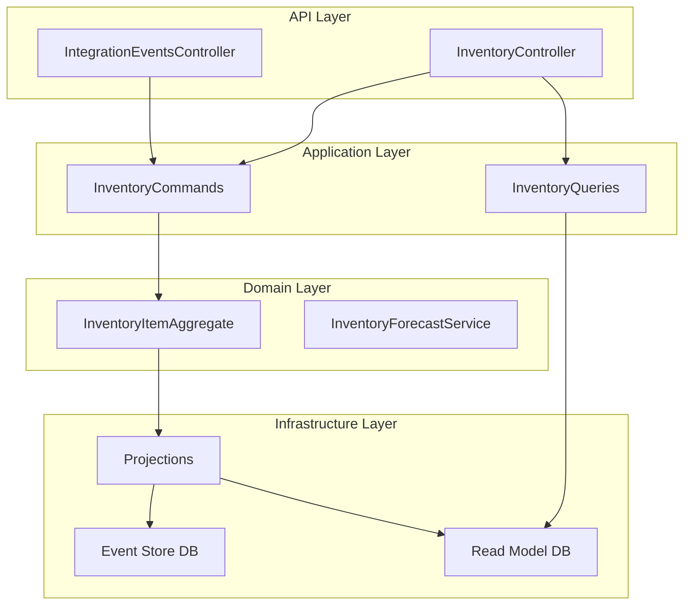

**Diagram sources**
- [InventoryController.cs](file://src/Services/Inventory/ErpSystem.Inventory/API/InventoryController.cs#L1-L44)
- [IntegrationEventsController.cs](file://src/Services/Inventory/ErpSystem.Inventory/API/IntegrationEventsController.cs#L1-L50)
- [InventoryCommands.cs](file://src/Services/Inventory/ErpSystem.Inventory/Application/InventoryCommands.cs#L1-L142)
- [InventoryQueries.cs](file://src/Services/Inventory/ErpSystem.Inventory/Application/InventoryQueries.cs#L1-L50)
- [InventoryItemAggregate.cs](file://src/Services/Inventory/ErpSystem.Inventory/Domain/InventoryItemAggregate.cs#L1-L255)
- [Persistence.cs](file://src/Services/Inventory/ErpSystem.Inventory/Infrastructure/Persistence.cs#L1-L79)
- [Projections.cs](file://src/Services/Inventory/ErpSystem.Inventory/Infrastructure/Projections.cs#L1-L211)

**Section sources**
- [InventoryController.cs](file://src/Services/Inventory/ErpSystem.Inventory/API/InventoryController.cs#L1-L44)
- [IntegrationEventsController.cs](file://src/Services/Inventory/ErpSystem.Inventory/API/IntegrationEventsController.cs#L1-L50)
- [Program.cs](file://src/Services/Inventory/ErpSystem.Inventory/Program.cs#L1-L74)

## Core Components
- API Controllers: Expose REST endpoints for inventory operations and integration events.
- Application Layer: Defines commands, queries, handlers, and read models.
- Domain: Implements the InventoryItem aggregate with stock movements and cost layering.
- Infrastructure: Provides event sourcing persistence and projection-based read models.

Key capabilities:
- Stock receipt, issue, transfer, and adjustment
- Reservation and release
- Transaction history and read model queries
- Forecasting service for stock depletion predictions

**Section sources**
- [InventoryCommands.cs](file://src/Services/Inventory/ErpSystem.Inventory/Application/InventoryCommands.cs#L1-L142)
- [InventoryQueries.cs](file://src/Services/Inventory/ErpSystem.Inventory/Application/InventoryQueries.cs#L1-L50)
- [InventoryItemAggregate.cs](file://src/Services/Inventory/ErpSystem.Inventory/Domain/InventoryItemAggregate.cs#L1-L255)
- [Projections.cs](file://src/Services/Inventory/ErpSystem.Inventory/Infrastructure/Projections.cs#L1-L211)

## Architecture Overview
The service employs Event Sourcing with CQRS:
- Commands trigger domain events applied to aggregates.
- Projections update denormalized read models for efficient querying.
- Integration events enable loose coupling with other services.

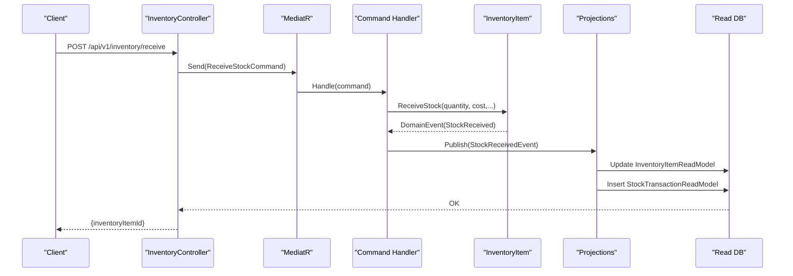

**Diagram sources**
- [InventoryController.cs](file://src/Services/Inventory/ErpSystem.Inventory/API/InventoryController.cs#L21-L22)
- [InventoryCommands.cs](file://src/Services/Inventory/ErpSystem.Inventory/Application/InventoryCommands.cs#L68-L89)
- [Projections.cs](file://src/Services/Inventory/ErpSystem.Inventory/Infrastructure/Projections.cs#L39-L81)
- [Persistence.cs](file://src/Services/Inventory/ErpSystem.Inventory/Infrastructure/Persistence.cs#L39-L79)

## Detailed Component Analysis

### Inventory Item Aggregate
The InventoryItem aggregate manages stock quantities, reservations, and cost layers. It enforces business rules for stock availability and calculates costs using FIFO.

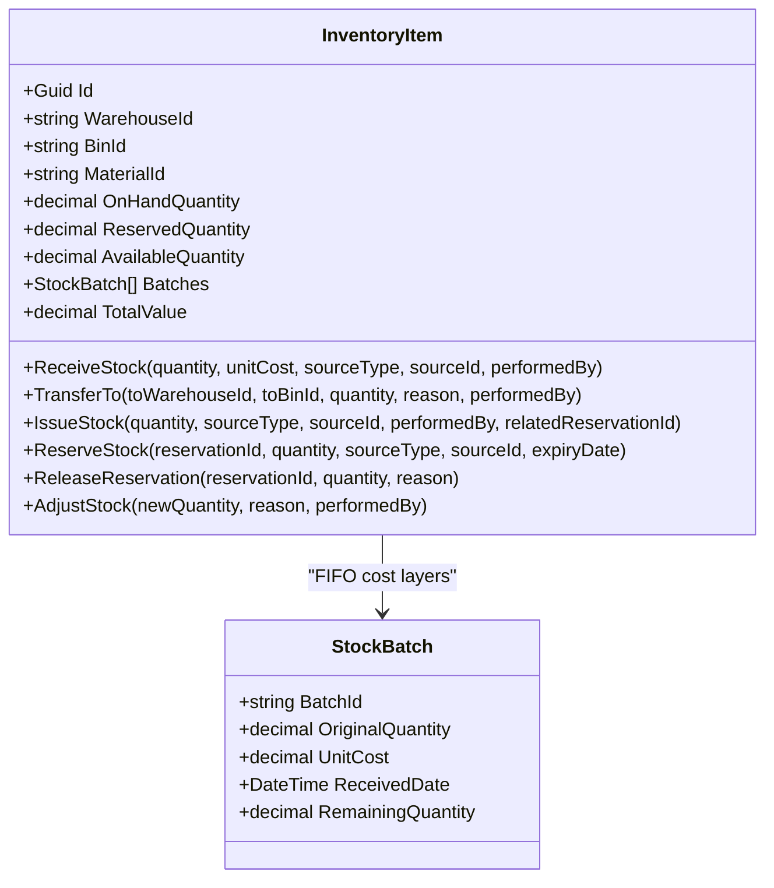

**Diagram sources**
- [InventoryItemAggregate.cs](file://src/Services/Inventory/ErpSystem.Inventory/Domain/InventoryItemAggregate.cs#L91-L255)

**Section sources**
- [InventoryItemAggregate.cs](file://src/Services/Inventory/ErpSystem.Inventory/Domain/InventoryItemAggregate.cs#L91-L255)

### Command Handlers
Command handlers orchestrate domain operations and persist aggregates. They validate preconditions and publish domain events.

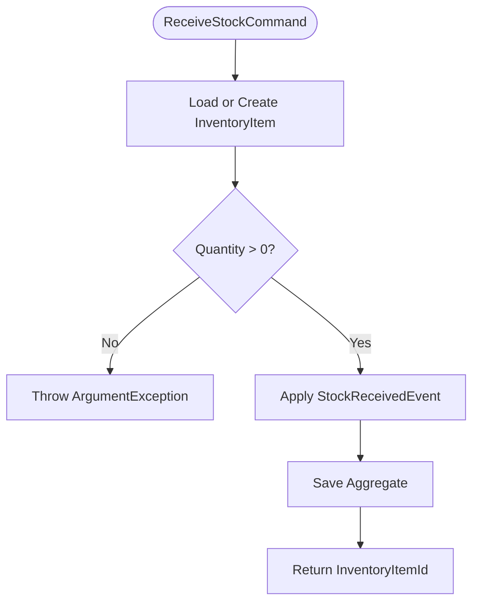

**Diagram sources**
- [InventoryCommands.cs](file://src/Services/Inventory/ErpSystem.Inventory/Application/InventoryCommands.cs#L68-L89)

**Section sources**
- [InventoryCommands.cs](file://src/Services/Inventory/ErpSystem.Inventory/Application/InventoryCommands.cs#L60-L142)

### Projection Pipeline
Projections maintain read models and transaction logs from domain events.

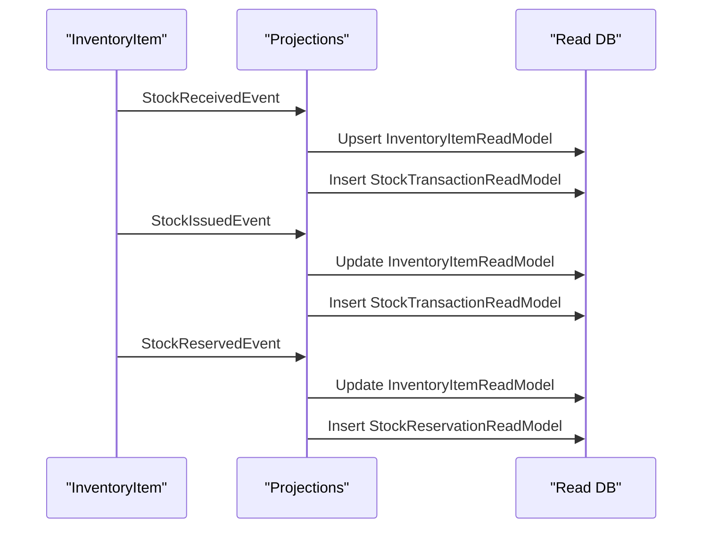

**Diagram sources**
- [Projections.cs](file://src/Services/Inventory/ErpSystem.Inventory/Infrastructure/Projections.cs#L16-L210)
- [Persistence.cs](file://src/Services/Inventory/ErpSystem.Inventory/Infrastructure/Persistence.cs#L39-L79)

**Section sources**
- [Projections.cs](file://src/Services/Inventory/ErpSystem.Inventory/Infrastructure/Projections.cs#L1-L211)
- [Persistence.cs](file://src/Services/Inventory/ErpSystem.Inventory/Infrastructure/Persistence.cs#L1-L79)

## API Reference

### Inventory Endpoints
- GET /api/v1/inventory/items
  - Query parameters: warehouseId, binId, materialCode, page
  - Returns paginated list of inventory items
- GET /api/v1/inventory/available
  - Query parameters: warehouseId, binId, materialId
  - Returns single inventory item read model
- POST /api/v1/inventory/receive
  - Request body: ReceiveStockCommand
  - Returns inventory item identifier
- POST /api/v1/inventory/transfer
  - Request body: TransferStockCommand
  - Returns boolean success
- POST /api/v1/inventory/issue
  - Request body: IssueStockCommand
  - Returns boolean success
- POST /api/v1/inventory/reservations
  - Request body: ReserveStockCommand
  - Returns reservation identifier
- POST /api/v1/inventory/reservations/release
  - Request body: ReleaseReservationCommand
  - Returns boolean success
- POST /api/v1/inventory/adjust
  - Request body: AdjustStockCommand
  - Returns boolean success
- GET /api/v1/inventory/items/{id}/transactions
  - Path parameter: id (inventory item identifier)
  - Query parameters: page
  - Returns paginated stock transactions

**Section sources**
- [InventoryController.cs](file://src/Services/Inventory/ErpSystem.Inventory/API/InventoryController.cs#L11-L42)
- [InventoryCommands.cs](file://src/Services/Inventory/ErpSystem.Inventory/Application/InventoryCommands.cs#L9-L58)
- [InventoryQueries.cs](file://src/Services/Inventory/ErpSystem.Inventory/Application/InventoryQueries.cs#L7-L11)

### Integration Events Endpoints
- POST /api/v1/inventory/integration/goods-received
- POST /api/v1/inventory/integration/order-confirmed
- POST /api/v1/inventory/integration/shipment-created
- POST /api/v1/inventory/integration/production-material-issued
- POST /api/v1/inventory/integration/production-completed

These endpoints accept integration events from Procurement, Sales, and Production services.

**Section sources**
- [IntegrationEventsController.cs](file://src/Services/Inventory/ErpSystem.Inventory/API/IntegrationEventsController.cs#L10-L48)

## Inventory Valuation and Cost Layers
- FIFO Cost Layers: Each receipt creates a new stock batch with unit cost and received date. Issues consume batches in FIFO order.
- Value Calculation: Total value equals sum of (remaining quantity × unit cost) across all batches.
- Transaction Cost: Issuing stock calculates total cost amount for the issued quantity based on consumed batches.

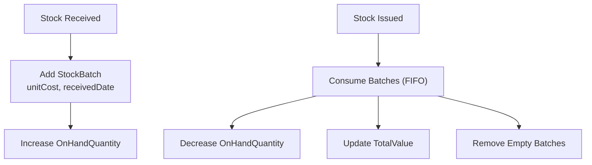

**Diagram sources**
- [InventoryItemAggregate.cs](file://src/Services/Inventory/ErpSystem.Inventory/Domain/InventoryItemAggregate.cs#L116-L190)
- [Projections.cs](file://src/Services/Inventory/ErpSystem.Inventory/Infrastructure/Projections.cs#L83-L118)

**Section sources**
- [InventoryItemAggregate.cs](file://src/Services/Inventory/ErpSystem.Inventory/Domain/InventoryItemAggregate.cs#L100-L105)
- [Projections.cs](file://src/Services/Inventory/ErpSystem.Inventory/Infrastructure/Projections.cs#L83-L118)

## Location Management and Slotting
- Warehouse and Location Aggregates: Define warehouse hierarchy and location types (area, shelf, bin).
- Inventory Item Binding: Each inventory item is bound to a specific warehouse and bin combination.
- Indexing: Composite unique index on (warehouseId, binId, materialId) ensures uniqueness and fast lookups.

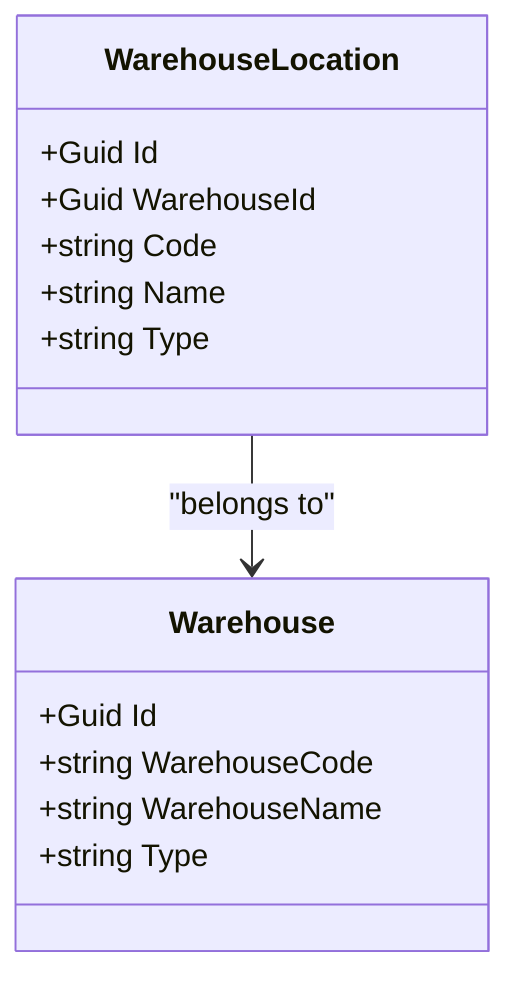

**Diagram sources**
- [WarehouseAggregate.cs](file://src/Services/MasterData/ErpSystem.MasterData/Domain/WarehouseAggregate.cs#L18-L43)
- [LocationAggregate.cs](file://src/Services/MasterData/ErpSystem.MasterData/Domain/LocationAggregate.cs#L21-L48)

**Section sources**
- [WarehouseAggregate.cs](file://src/Services/MasterData/ErpSystem.MasterData/Domain/WarehouseAggregate.cs#L1-L44)
- [LocationAggregate.cs](file://src/Services/MasterData/ErpSystem.MasterData/Domain/LocationAggregate.cs#L1-L49)
- [Persistence.cs](file://src/Services/Inventory/ErpSystem.Inventory/Infrastructure/Persistence.cs#L32-L36)

## Integration Points
- Procurement: Goods received events trigger stock receipt.
- Sales: Order confirmed and shipment created events coordinate reservations and issues.
- Production: Material issued and production completed events manage issues and receipts.
- Finance: Receives transaction data for cost accounting.

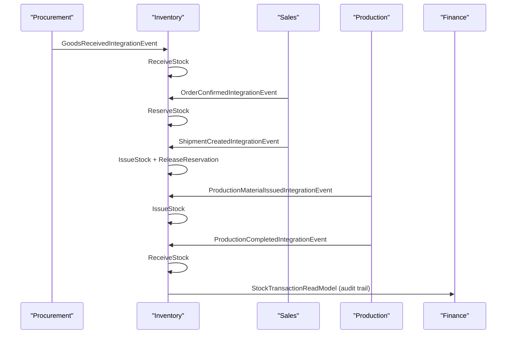

**Diagram sources**
- [IntegrationEventsController.cs](file://src/Services/Inventory/ErpSystem.Inventory/API/IntegrationEventsController.cs#L10-L48)
- [Projections.cs](file://src/Services/Inventory/ErpSystem.Inventory/Infrastructure/Projections.cs#L120-L157)

**Section sources**
- [IntegrationEventsController.cs](file://src/Services/Inventory/ErpSystem.Inventory/API/IntegrationEventsController.cs#L1-L50)
- [Projections.cs](file://src/Services/Inventory/ErpSystem.Inventory/Infrastructure/Projections.cs#L1-L211)

## Forecasting and Safety Stock
- Forecasting Service: Predicts stock depletion using time-series models (simulated in current implementation).
- Safety Stock: Can be maintained at the master data level and used by downstream planning (MRP) to suggest replenishments.
- Stockout Prevention: Forecast results provide confidence scores and predicted stockout dates to trigger alerts and actions.

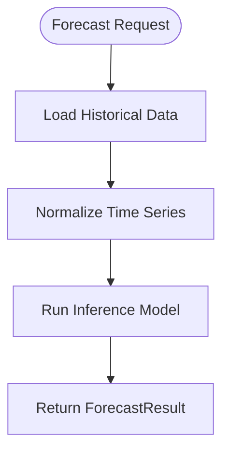

**Diagram sources**
- [InventoryForecastService.cs](file://src/Services/Inventory/ErpSystem.Inventory/Domain/Services/InventoryForecastService.cs#L17-L42)

**Section sources**
- [InventoryForecastService.cs](file://src/Services/Inventory/ErpSystem.Inventory/Domain/Services/InventoryForecastService.cs#L1-L52)
- [PRD-05-Inventory-Service.md](file://docs/PRD-05-Inventory-Service.md#L517-L520)

## Cycle Counting and Physical Inventory
- Manual Adjustment: Supports adjusting inventory quantities to reconcile discrepancies.
- Transaction Logging: Every adjustment generates a transaction record for auditability.
- Cycle Counting: Can be implemented by periodically selecting items for physical count and applying adjustments accordingly.

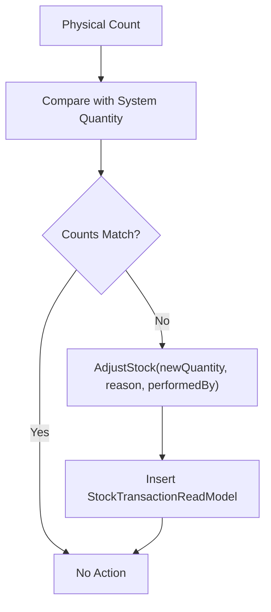

**Diagram sources**
- [InventoryCommands.cs](file://src/Services/Inventory/ErpSystem.Inventory/Application/InventoryCommands.cs#L132-L140)
- [Projections.cs](file://src/Services/Inventory/ErpSystem.Inventory/Infrastructure/Projections.cs#L159-L183)

**Section sources**
- [InventoryCommands.cs](file://src/Services/Inventory/ErpSystem.Inventory/Application/InventoryCommands.cs#L53-L58)
- [Projections.cs](file://src/Services/Inventory/ErpSystem.Inventory/Infrastructure/Projections.cs#L159-L183)

## Barcode and RFID Integration
- Scanning Workflow: Barcode/RFID scans return material identifiers and optionally bin locations.
- API Usage: Use GET /api/v1/inventory/available with materialId and binId to confirm availability before issuing.
- Integration Pattern: External scanners can call inventory APIs or publish integration events to trigger operations.

[No sources needed since this section provides general guidance]

## Dependency Analysis
The service relies on:
- Entity Framework Core for event sourcing and read models
- MediatR for CQRS
- Dapr for event bus integration
- PostgreSQL for persistence

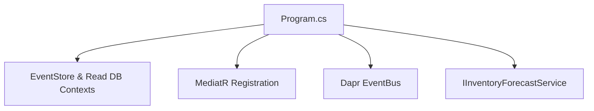

**Diagram sources**
- [Program.cs](file://src/Services/Inventory/ErpSystem.Inventory/Program.cs#L14-L48)

**Section sources**
- [Program.cs](file://src/Services/Inventory/ErpSystem.Inventory/Program.cs#L1-L74)
- [inventory.yaml](file://deploy/k8s/services/inventory.yaml#L1-L66)

## Performance Considerations
- Query Optimization: Unique composite index on (warehouseId, binId, materialId) improves lookup performance.
- Pagination: Queries support pagination to limit response sizes.
- Asynchronous Processing: Handlers and projections operate asynchronously to minimize latency.
- Forecasting Latency: Forecast service simulates inference; production deployments should optimize model execution.

[No sources needed since this section provides general guidance]

## Troubleshooting Guide
Common issues and resolutions:
- Insufficient Available Stock: Verify AvailableQuantity before issuing; check active reservations.
- Missing Inventory Item: Ensure correct warehouseId/binId/materialId combination exists.
- Adjustment Conflicts: When reducing OnHandQuantity below ReservedQuantity, adjust reservations accordingly.
- Event Replay: Use event store to rebuild read models if inconsistencies arise.

**Section sources**
- [InventoryItemAggregate.cs](file://src/Services/Inventory/ErpSystem.Inventory/Domain/InventoryItemAggregate.cs#L122-L135)
- [Projections.cs](file://src/Services/Inventory/ErpSystem.Inventory/Infrastructure/Projections.cs#L159-L183)

## Conclusion
The Inventory service provides a robust foundation for stock management with clear separation of concerns, strong business rule enforcement, and extensible integration points. Its event-driven architecture supports scalability, auditability, and seamless collaboration with Procurement, Sales, and Production services. Future enhancements can include advanced slotting, barcode/RFID integration, and expanded forecasting capabilities.