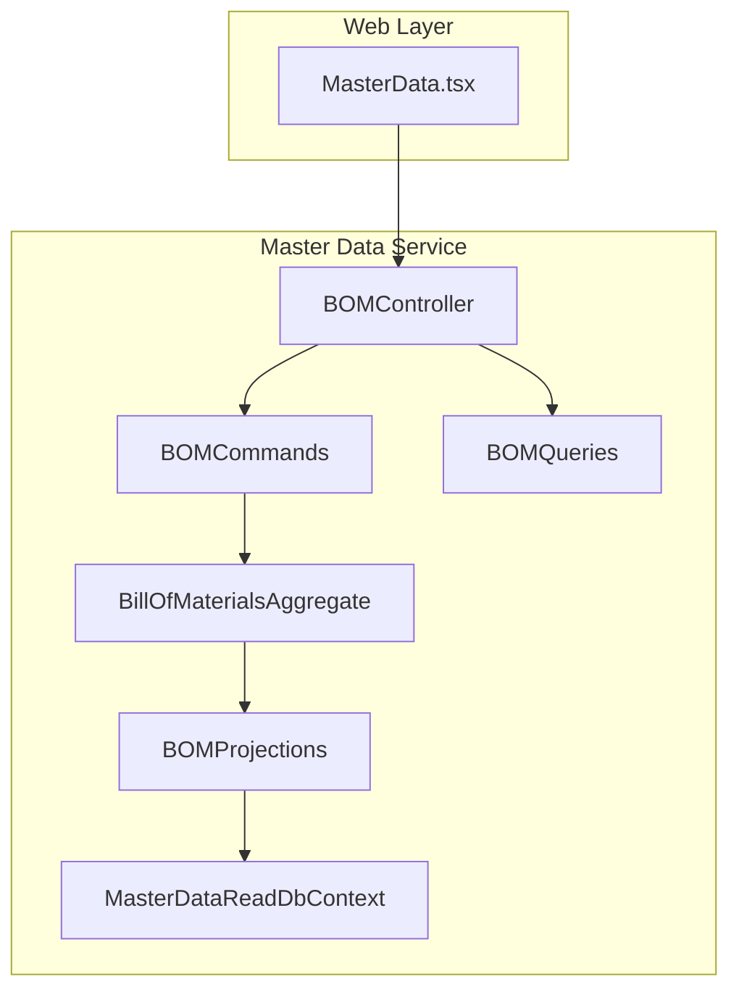
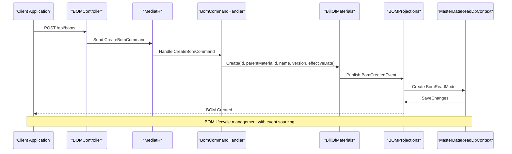
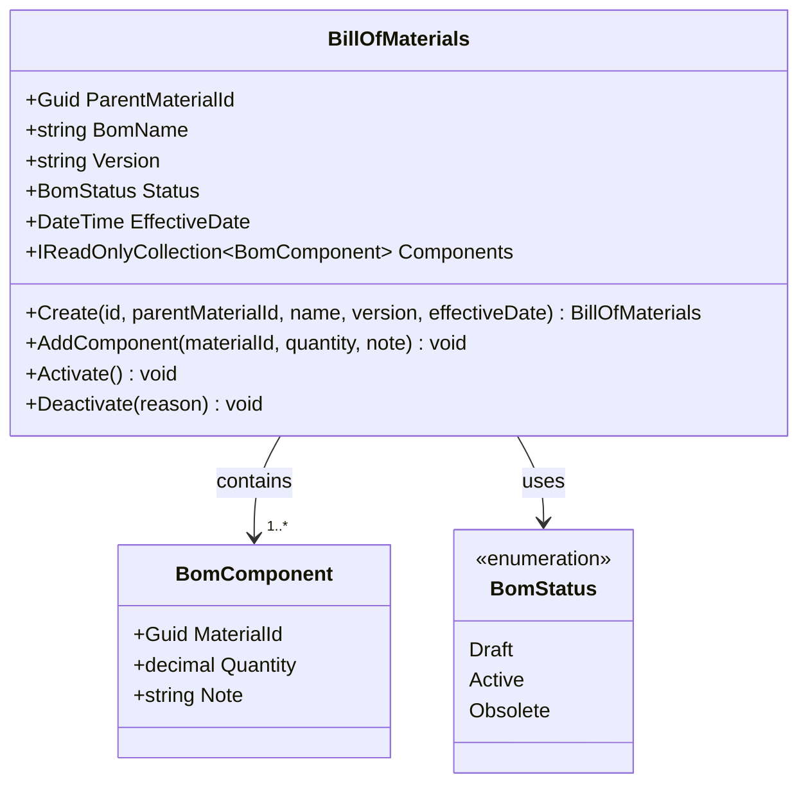
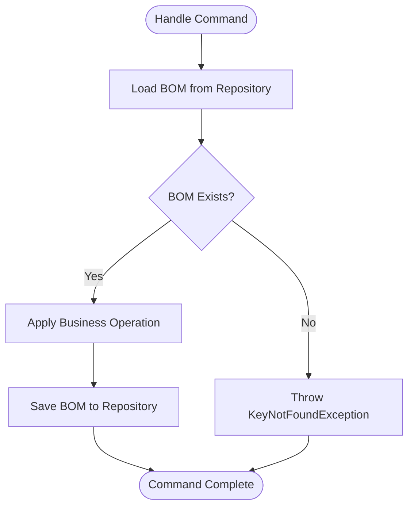
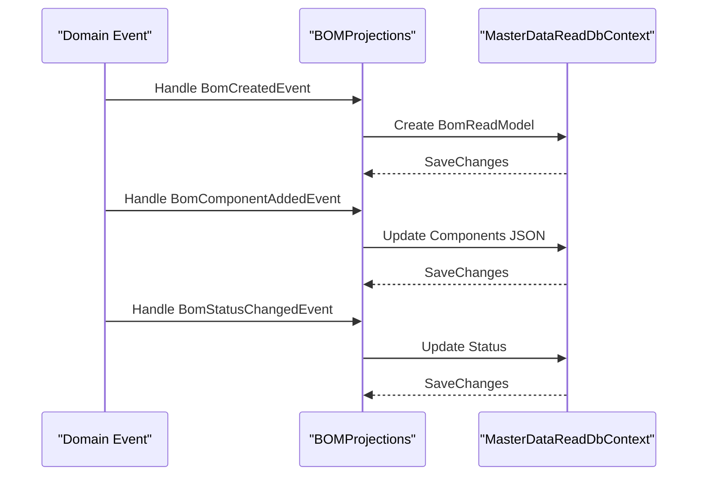
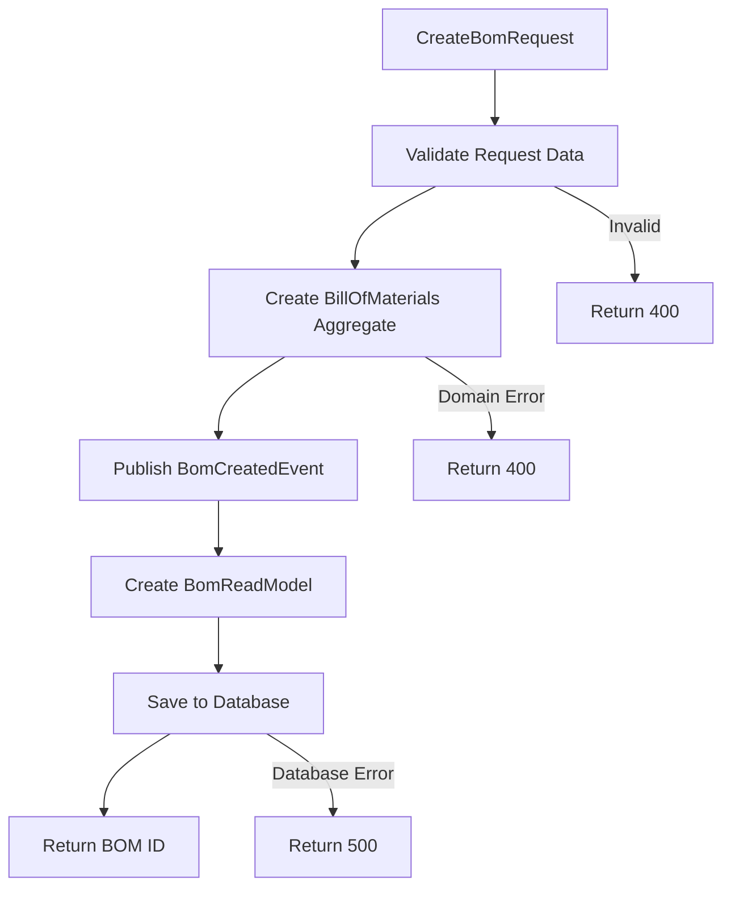
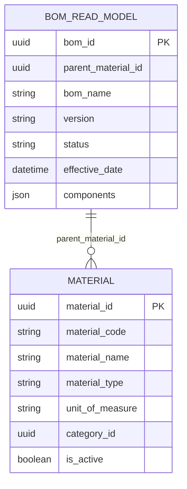
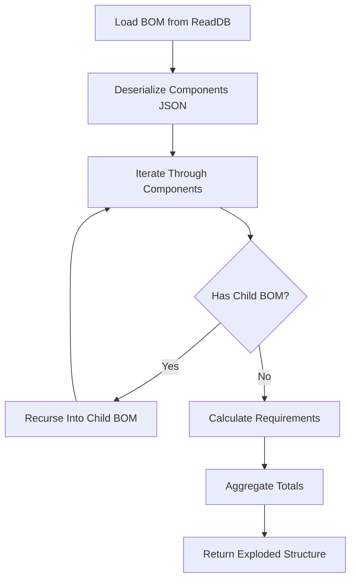
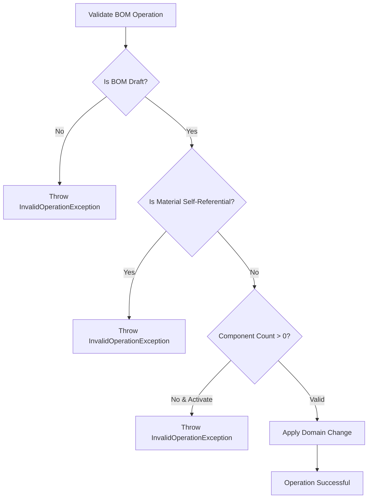
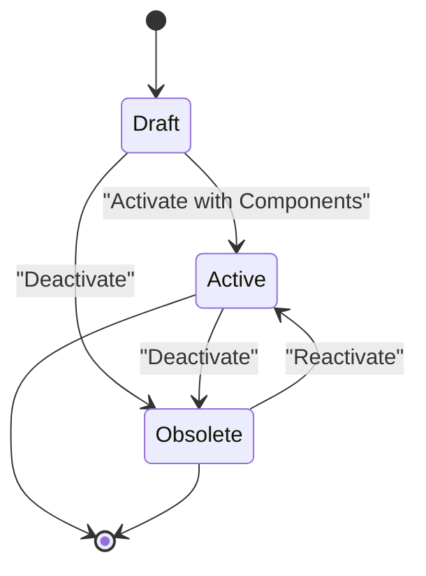

# Bill of Materials API

<cite>
**Referenced Files in This Document**
- [BOMController.cs](file://src/Services/MasterData/ErpSystem.MasterData/Controllers/BOMController.cs)
- [BOMCommands.cs](file://src/Services/MasterData/ErpSystem.MasterData/Application/BOMCommands.cs)
- [BOMQueries.cs](file://src/Services/MasterData/ErpSystem.MasterData/Application/BOMQueries.cs)
- [BillOfMaterialsAggregate.cs](file://src/Services/MasterData/ErpSystem.MasterData/Domain/BillOfMaterialsAggregate.cs)
- [BOMProjections.cs](file://src/Services/MasterData/ErpSystem.MasterData/Infrastructure/BOMProjections.cs)
- [ReadDbContext.cs](file://src/Services/MasterData/ErpSystem.MasterData/Infrastructure/ReadDbContext.cs)
- [MaterialAggregate.cs](file://src/Services/MasterData/ErpSystem.MasterData/Domain/MaterialAggregate.cs)
- [MasterData.tsx](file://src/Web/ErpSystem.Web/src/pages/MasterData.tsx)
</cite>

## Table of Contents
1. [Introduction](#introduction)
2. [Project Structure](#project-structure)
3. [Core Components](#core-components)
4. [Architecture Overview](#architecture-overview)
5. [Detailed Component Analysis](#detailed-component-analysis)
6. [API Reference](#api-reference)
7. [BOM Operations](#bom-operations)
8. [Hierarchical Structure Management](#hierarchical-structure-management)
9. [Material Substitution and Alternatives](#material-substitution-and-alternatives)
10. [Phantom Assemblies and Configurable Products](#phantom-assemblies-and-configurable-products)
11. [BOM Explosion and Impact Analysis](#bom-explosion-and-impact-analysis)
12. [BOM Validation and Recursive Checking](#bom-validation-and-recursive-checking)
13. [Integration with Manufacturing and Procurement](#integration-with-manufacturing-and-procurement)
14. [Search and Filtering](#search-and-filtering)
15. [Versioning and Engineering Changes](#versioning-and-engineering-changes)
16. [Performance Considerations](#performance-considerations)
17. [Troubleshooting Guide](#troubleshooting-guide)
18. [Conclusion](#conclusion)

## Introduction
This document provides comprehensive API documentation for Bill of Materials (BOM) operations within the ERP microservice architecture. It covers BOM creation, component assembly, hierarchical structure management, material substitution rules, routing associations, alternative configurations, BOM explosion operations, phantom assemblies, and configurable products. The documentation also addresses BOM validation, recursive structure checking, integration with manufacturing and procurement processes, BOM search capabilities, filtering by date ranges, and impact analysis for design changes.

## Project Structure
The BOM functionality is implemented within the Master Data service, following Clean Architecture principles with separate concerns for controllers, application commands/queries, domain aggregates, and infrastructure projections.

**Diagram sources**
- [BOMController.cs](file://src/Services/MasterData/ErpSystem.MasterData/Controllers/BOMController.cs#L1-L54)
- [BOMCommands.cs](file://src/Services/MasterData/ErpSystem.MasterData/Application/BOMCommands.cs#L1-L49)
- [BOMQueries.cs](file://src/Services/MasterData/ErpSystem.MasterData/Application/BOMQueries.cs#L1-L41)
- [BillOfMaterialsAggregate.cs](file://src/Services/MasterData/ErpSystem.MasterData/Domain/BillOfMaterialsAggregate.cs#L1-L125)
- [BOMProjections.cs](file://src/Services/MasterData/ErpSystem.MasterData/Infrastructure/BOMProjections.cs#L1-L50)
- [ReadDbContext.cs](file://src/Services/MasterData/ErpSystem.MasterData/Infrastructure/ReadDbContext.cs#L1-L125)

**Section sources**
- [BOMController.cs](file://src/Services/MasterData/ErpSystem.MasterData/Controllers/BOMController.cs#L1-L54)
- [ReadDbContext.cs](file://src/Services/MasterData/ErpSystem.MasterData/Infrastructure/ReadDbContext.cs#L1-L125)

## Core Components
The BOM system consists of several key components working together to manage product structure and materials:

### Domain Model
The BillOfMaterials aggregate serves as the central domain entity, managing BOM lifecycle and component relationships.

### Application Layer
- **Commands**: Handle BOM creation, component addition, and activation operations
- **Queries**: Provide read-only access to BOM data and filtering capabilities

### Infrastructure Layer
- **Projections**: Convert domain events to read models for efficient querying
- **Read Database Context**: Manages the read-side database schema and JSON storage

**Section sources**
- [BillOfMaterialsAggregate.cs](file://src/Services/MasterData/ErpSystem.MasterData/Domain/BillOfMaterialsAggregate.cs#L55-L125)
- [BOMCommands.cs](file://src/Services/MasterData/ErpSystem.MasterData/Application/BOMCommands.cs#L27-L49)
- [BOMQueries.cs](file://src/Services/MasterData/ErpSystem.MasterData/Application/BOMQueries.cs#L10-L41)
- [BOMProjections.cs](file://src/Services/MasterData/ErpSystem.MasterData/Infrastructure/BOMProjections.cs#L7-L50)

## Architecture Overview
The BOM system follows CQRS (Command Query Responsibility Segregation) pattern with event sourcing for maintaining audit trails and historical data.

**Diagram sources**
- [BOMController.cs](file://src/Services/MasterData/ErpSystem.MasterData/Controllers/BOMController.cs#L32-L37)
- [BOMCommands.cs](file://src/Services/MasterData/ErpSystem.MasterData/Application/BOMCommands.cs#L27-L49)
- [BillOfMaterialsAggregate.cs](file://src/Services/MasterData/ErpSystem.MasterData/Domain/BillOfMaterialsAggregate.cs#L66-L76)
- [BOMProjections.cs](file://src/Services/MasterData/ErpSystem.MasterData/Infrastructure/BOMProjections.cs#L12-L26)

## Detailed Component Analysis

### BillOfMaterials Aggregate
The core domain aggregate manages BOM lifecycle and enforces business rules.

**Diagram sources**
- [BillOfMaterialsAggregate.cs](file://src/Services/MasterData/ErpSystem.MasterData/Domain/BillOfMaterialsAggregate.cs#L55-L125)

**Section sources**
- [BillOfMaterialsAggregate.cs](file://src/Services/MasterData/ErpSystem.MasterData/Domain/BillOfMaterialsAggregate.cs#L55-L125)

### Command Handler Implementation
Handles BOM operations through the command pattern with proper error handling and validation.

**Diagram sources**
- [BOMCommands.cs](file://src/Services/MasterData/ErpSystem.MasterData/Application/BOMCommands.cs#L31-L47)

**Section sources**
- [BOMCommands.cs](file://src/Services/MasterData/ErpSystem.MasterData/Application/BOMCommands.cs#L27-L49)

### Projection System
Manages read model updates through event handling for real-time query performance.

**Diagram sources**
- [BOMProjections.cs](file://src/Services/MasterData/ErpSystem.MasterData/Infrastructure/BOMProjections.cs#L12-L48)

**Section sources**
- [BOMProjections.cs](file://src/Services/MasterData/ErpSystem.MasterData/Infrastructure/BOMProjections.cs#L7-L50)

## API Reference

### BOM Endpoints

#### GET /api/boms
Retrieve all BOMs in the system.

**Response**: Array of BOMReadModel objects
- 200 OK: Successful retrieval
- 500 Internal Server Error: Database or system error

#### GET /api/boms/{id}
Retrieve a specific BOM by ID.

**Path Parameters**:
- `id` (string): Unique identifier of the BOM

**Response**: BOMReadModel object
- 200 OK: BOM found
- 404 Not Found: BOM does not exist

#### GET /api/boms/material/{materialId}
Get all BOMs associated with a parent material.

**Path Parameters**:
- `materialId` (string): Material identifier

**Response**: Array of BOMReadModel objects
- 200 OK: BOMs found
- 404 Not Found: No BOMs for material

#### POST /api/boms
Create a new BOM.

**Request Body**: CreateBomRequest
- `parentMaterialId` (string): Material ID this BOM describes
- `name` (string): Human-readable BOM name
- `version` (string): BOM version identifier
- `effectiveDate` (string): ISO 8601 date when BOM becomes effective

**Response**: String (BOM ID)
- 201 Created: BOM created successfully
- 400 Bad Request: Invalid request data
- 500 Internal Server Error: Creation failed

#### POST /api/boms/{id}/components
Add a component to an existing BOM.

**Path Parameters**:
- `id` (string): BOM identifier

**Request Body**: AddBomComponentCommand
- `bomId` (string): BOM identifier
- `materialId` (string): Component material identifier
- `quantity` (number): Quantity required per assembly
- `note` (string): Optional component note

**Response**: Empty response
- 200 OK: Component added successfully
- 400 Bad Request: ID mismatch or invalid data
- 404 Not Found: BOM not found

#### POST /api/boms/{id}/activate
Activate a BOM to make it usable for production.

**Path Parameters**:
- `id` (string): BOM identifier

**Response**: Empty response
- 200 OK: BOM activated
- 404 Not Found: BOM not found
- 400 Bad Request: Cannot activate empty BOM or already active

**Section sources**
- [BOMController.cs](file://src/Services/MasterData/ErpSystem.MasterData/Controllers/BOMController.cs#L12-L52)

## BOM Operations

### BOM Creation Workflow
The BOM creation process involves several validation steps and event publishing.

**Diagram sources**
- [BOMController.cs](file://src/Services/MasterData/ErpSystem.MasterData/Controllers/BOMController.cs#L32-L37)
- [BOMCommands.cs](file://src/Services/MasterData/ErpSystem.MasterData/Application/BOMCommands.cs#L66-L76)
- [BOMProjections.cs](file://src/Services/MasterData/ErpSystem.MasterData/Infrastructure/BOMProjections.cs#L12-L26)

### Component Assembly Process
Adding components to a BOM follows strict business rules and validation.

**Validation Rules**:
- BOM must be in Draft status
- Component material cannot be the same as parent material
- Quantity must be positive

**Section sources**
- [BillOfMaterialsAggregate.cs](file://src/Services/MasterData/ErpSystem.MasterData/Domain/BillOfMaterialsAggregate.cs#L78-L87)

### BOM Activation Process
BOM activation requires meeting specific criteria before becoming usable.

**Activation Requirements**:
- BOM must contain at least one component
- BOM must be in Draft status
- Activation triggers status change to Active

**Section sources**
- [BillOfMaterialsAggregate.cs](file://src/Services/MasterData/ErpSystem.MasterData/Domain/BillOfMaterialsAggregate.cs#L89-L96)

## Hierarchical Structure Management
The BOM system supports hierarchical relationships through parent-child material associations and JSON-based component storage.

### Component Storage Architecture
Components are stored as JSON arrays in the read model for flexible querying and efficient serialization.

**Diagram sources**
- [ReadDbContext.cs](file://src/Services/MasterData/ErpSystem.MasterData/Infrastructure/ReadDbContext.cs#L115-L124)
- [MaterialAggregate.cs](file://src/Services/MasterData/ErpSystem.MasterData/Domain/MaterialAggregate.cs#L84-L178)

**Section sources**
- [ReadDbContext.cs](file://src/Services/MasterData/ErpSystem.MasterData/Infrastructure/ReadDbContext.cs#L41-L46)
- [BOMProjections.cs](file://src/Services/MasterData/ErpSystem.MasterData/Infrastructure/BOMProjections.cs#L28-L38)

## Material Substitution and Alternatives
The current implementation focuses on direct material-to-BOM relationships without explicit substitution rules. Alternative configurations would require extending the component model.

### Proposed Extension Points
- **Substitution Groups**: Group components that can replace each other
- **Alternative Routes**: Different assembly sequences for the same component
- **Priority Rules**: Define precedence for substitutions

**Section sources**
- [BillOfMaterialsAggregate.cs](file://src/Services/MasterData/ErpSystem.MasterData/Domain/BillOfMaterialsAggregate.cs#L7-L7)

## Phantom Assemblies and Configurable Products
The system currently supports standard BOM structures. Phantom assemblies and configurable products would require additional modeling approaches.

### Configuration Strategies
- **Configurable Attributes**: Store product configuration options
- **Variant Management**: Track different product variants
- **Assembly Sequences**: Define optional assembly steps

**Section sources**
- [MaterialAggregate.cs](file://src/Services/MasterData/ErpSystem.MasterData/Domain/MaterialAggregate.cs#L12-L12)

## BOM Explosion and Impact Analysis
The read model architecture supports efficient BOM explosion through JSON deserialization and component enumeration.

### Explosion Process

**Diagram sources**
- [BOMProjections.cs](file://src/Services/MasterData/ErpSystem.MasterData/Infrastructure/BOMProjections.cs#L28-L38)

**Section sources**
- [BOMProjections.cs](file://src/Services/MasterData/ErpSystem.MasterData/Infrastructure/BOMProjections.cs#L28-L38)

## BOM Validation and Recursive Checking
The domain layer implements comprehensive validation for BOM integrity and recursive structure checking.

### Validation Rules

**Diagram sources**
- [BillOfMaterialsAggregate.cs](file://src/Services/MasterData/ErpSystem.MasterData/Domain/BillOfMaterialsAggregate.cs#L78-L102)

**Section sources**
- [BillOfMaterialsAggregate.cs](file://src/Services/MasterData/ErpSystem.MasterData/Domain/BillOfMaterialsAggregate.cs#L78-L102)

## Integration with Manufacturing and Procurement
The BOM system integrates with downstream services through event-driven architecture and shared read models.

### Integration Points
- **Manufacturing Orders**: Use active BOMs for production planning
- **Procurement System**: Generate purchase requisitions from BOM components
- **Inventory Management**: Track component availability against BOM requirements

**Section sources**
- [MaterialAggregate.cs](file://src/Services/MasterData/ErpSystem.MasterData/Domain/MaterialAggregate.cs#L84-L178)

## Search and Filtering
The BOM API provides multiple search and filtering capabilities through dedicated endpoints and query methods.

### Search Capabilities
- **List All BOMs**: GET /api/boms
- **Filter by Material**: GET /api/boms/material/{materialId}
- **Individual Lookup**: GET /api/boms/{id}

### Filtering Features
The current implementation supports basic filtering by parent material. Advanced filtering would require extending the query layer.

**Section sources**
- [BOMQueries.cs](file://src/Services/MasterData/ErpSystem.MasterData/Application/BOMQueries.cs#L16-L39)
- [BOMController.cs](file://src/Services/MasterData/ErpSystem.MasterData/Controllers/BOMController.cs#L12-L30)

## Versioning and Engineering Changes
The BOM system supports versioning through separate BOM records with effective dates.

### Version Management

**Diagram sources**
- [BillOfMaterialsAggregate.cs](file://src/Services/MasterData/ErpSystem.MasterData/Domain/BillOfMaterialsAggregate.cs#L46-L51)

### Engineering Change Process
- Create new BOM version with updated components
- Maintain historical versions for audit trail
- Use effective dates for controlled rollouts

**Section sources**
- [BillOfMaterialsAggregate.cs](file://src/Services/MasterData/ErpSystem.MasterData/Domain/BillOfMaterialsAggregate.cs#L66-L76)

## Performance Considerations
The BOM system is optimized for read-heavy operations through projection-based architecture.

### Performance Optimizations
- **JSON Storage**: Efficient component storage using JSONB columns
- **Event Sourcing**: Separate write/read models for optimal performance
- **Caching**: Potential for implementing read model caching
- **Indexing**: Database indexes on frequently queried fields

### Scalability Guidelines
- Monitor projection update latency
- Consider batch operations for bulk component additions
- Implement pagination for large BOM lists

## Troubleshooting Guide

### Common Issues and Solutions

#### BOM Creation Failures
**Symptoms**: 400 Bad Request during BOM creation
**Causes**: Invalid request data, missing required fields
**Solutions**: Validate input data, ensure parent material exists

#### Component Addition Errors
**Symptoms**: 400 Bad Request when adding components
**Causes**: BOM not in Draft status, self-referential materials, invalid quantities
**Solutions**: Verify BOM status, check material relationships, validate numeric inputs

#### Activation Failures
**Symptoms**: 400 Bad Request during BOM activation
**Causes**: Empty BOM, already active status
**Solutions**: Add components before activation, check current status

#### Query Performance Issues
**Symptoms**: Slow BOM retrieval operations
**Causes**: Large component lists, missing database indexes
**Solutions**: Implement pagination, add database indexes, consider read model caching

**Section sources**
- [BOMCommands.cs](file://src/Services/MasterData/ErpSystem.MasterData/Application/BOMCommands.cs#L31-L47)
- [BillOfMaterialsAggregate.cs](file://src/Services/MasterData/ErpSystem.MasterData/Domain/BillOfMaterialsAggregate.cs#L78-L102)

## Conclusion
The BOM API provides a robust foundation for managing product structures within the ERP system. The event-driven architecture ensures data consistency and auditability while supporting efficient querying through projection-based read models. The current implementation covers core BOM operations including creation, component assembly, activation, and hierarchical management. Future enhancements could include advanced substitution rules, phantom assembly support, and configurable product capabilities to meet enterprise-grade requirements.

The modular design allows for extension while maintaining separation of concerns, enabling integration with manufacturing, procurement, and inventory systems through well-defined interfaces and event streams.