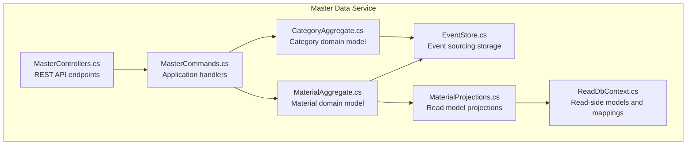
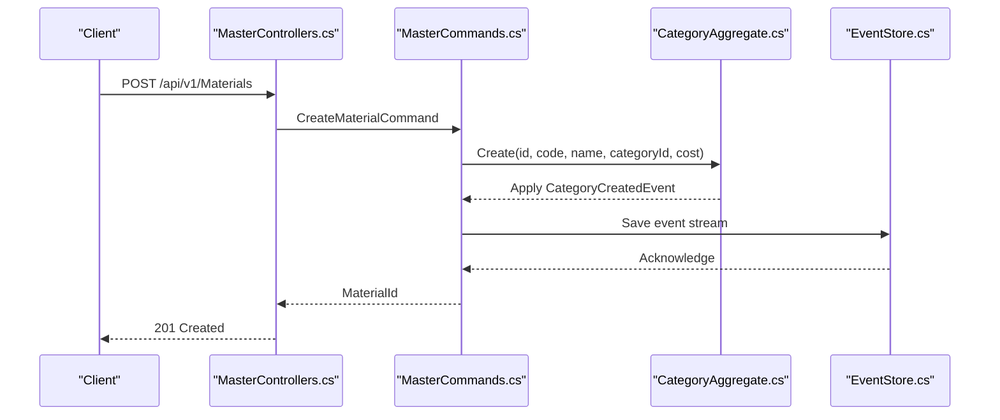
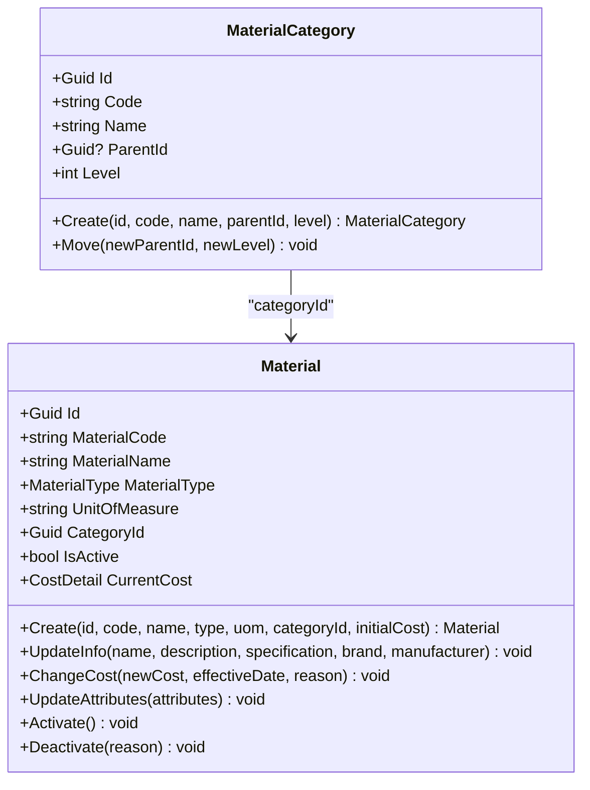
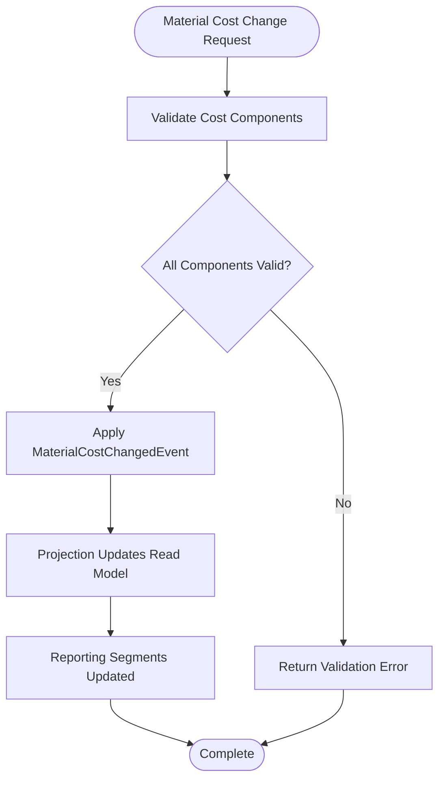
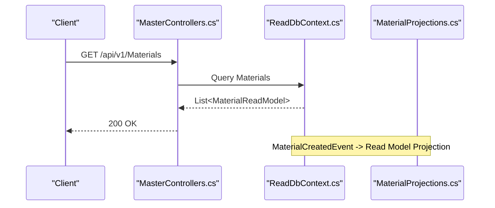
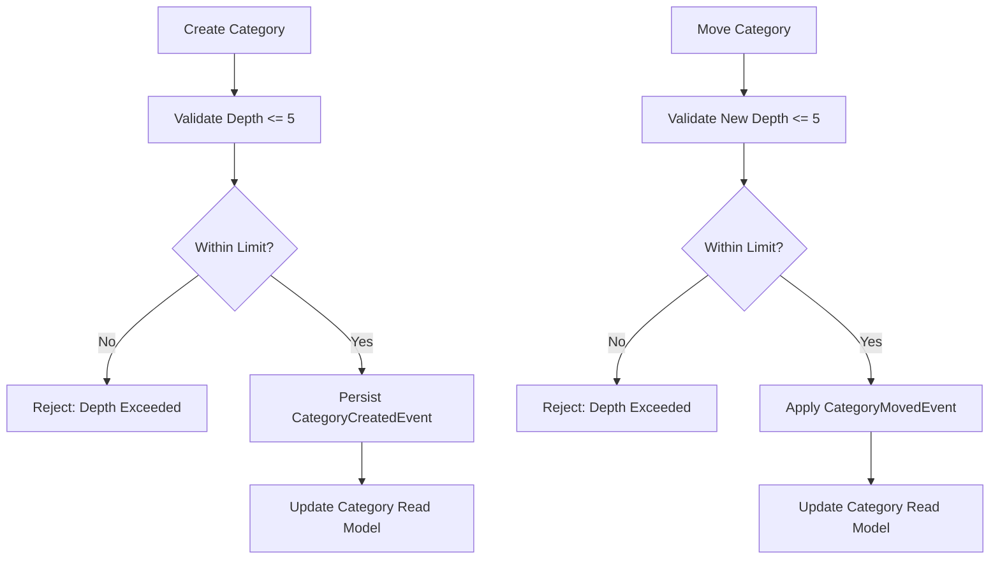
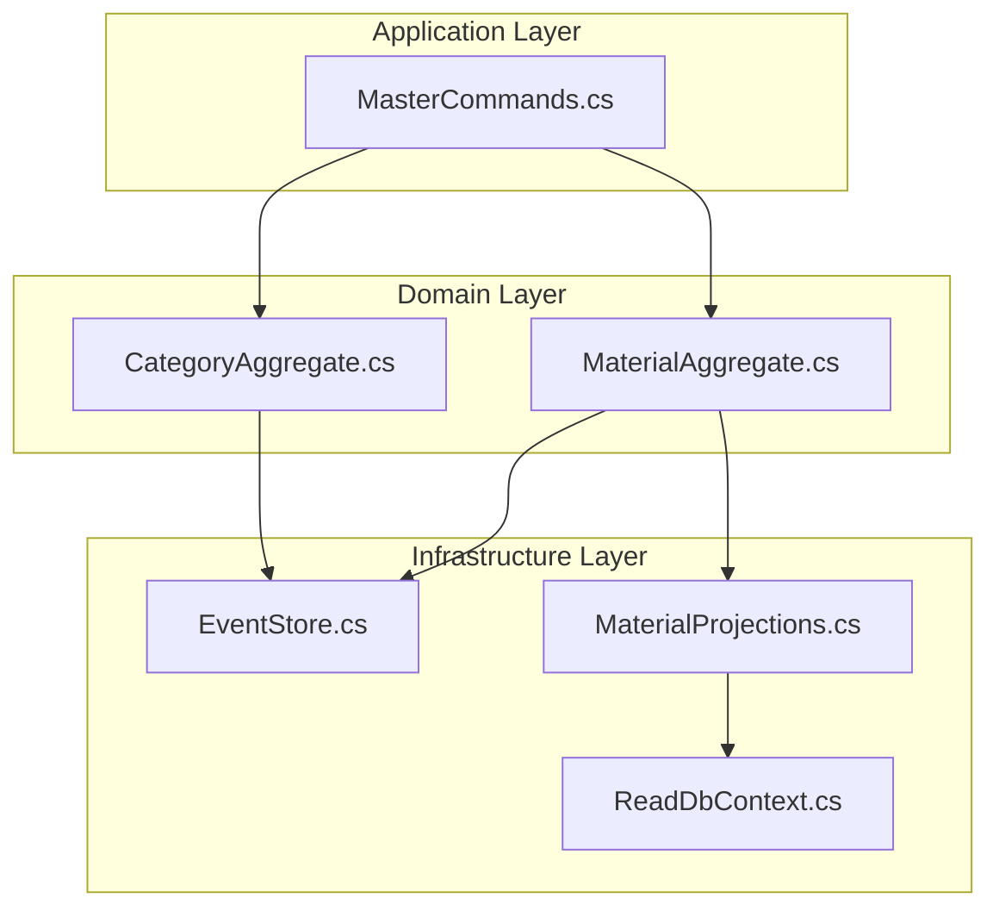

# Category and Classification API

<cite>
**Referenced Files in This Document**
- [CategoryAggregate.cs](file://src/Services/MasterData/ErpSystem.MasterData/Domain/CategoryAggregate.cs)
- [MaterialAggregate.cs](file://src/Services/MasterData/ErpSystem.MasterData/Domain/MaterialAggregate.cs)
- [MasterCommands.cs](file://src/Services/MasterData/ErpSystem.MasterData/Application/MasterCommands.cs)
- [ReadDbContext.cs](file://src/Services/MasterData/ErpSystem.MasterData/Infrastructure/ReadDbContext.cs)
- [EventStore.cs](file://src/Services/MasterData/ErpSystem.MasterData/Infrastructure/EventStore.cs)
- [MasterControllers.cs](file://src/Services/MasterData/ErpSystem.MasterData/Controllers/MasterControllers.cs)
- [MaterialProjections.cs](file://src/Services/MasterData/ErpSystem.MasterData/Infrastructure/MaterialProjections.cs)
</cite>

## Table of Contents
1. [Introduction](#introduction)
2. [Project Structure](#project-structure)
3. [Core Components](#core-components)
4. [Architecture Overview](#architecture-overview)
5. [Detailed Component Analysis](#detailed-component-analysis)
6. [Dependency Analysis](#dependency-analysis)
7. [Performance Considerations](#performance-considerations)
8. [Troubleshooting Guide](#troubleshooting-guide)
9. [Conclusion](#conclusion)

## Introduction
This document provides comprehensive API documentation for Category and Classification management within the Master Data service. It covers hierarchical category creation, parent-child relationships, classification rules, category-based pricing and cost tracking, tax assignments, reporting segments, category search operations, product categorization workflows, multi-level classification structures, category analytics, classification inheritance, and integration with product catalogs. It also addresses category validation, naming conventions, and business rule enforcement for consistent classification across the system.

## Project Structure
The Category and Classification API resides in the Master Data service and follows a clean architecture pattern with domain events, projections, and read models. The primary components include:
- Domain aggregates for categories and materials
- Application commands for category creation and updates
- Infrastructure projections and read models for querying
- Controllers exposing REST endpoints for CRUD operations

**Diagram sources**
- [MasterControllers.cs](file://src/Services/MasterData/ErpSystem.MasterData/Controllers/MasterControllers.cs#L1-L79)
- [MasterCommands.cs](file://src/Services/MasterData/ErpSystem.MasterData/Application/MasterCommands.cs#L1-L110)
- [CategoryAggregate.cs](file://src/Services/MasterData/ErpSystem.MasterData/Domain/CategoryAggregate.cs#L1-L67)
- [MaterialAggregate.cs](file://src/Services/MasterData/ErpSystem.MasterData/Domain/MaterialAggregate.cs#L1-L178)
- [MaterialProjections.cs](file://src/Services/MasterData/ErpSystem.MasterData/Infrastructure/MaterialProjections.cs#L1-L37)
- [ReadDbContext.cs](file://src/Services/MasterData/ErpSystem.MasterData/Infrastructure/ReadDbContext.cs#L1-L125)
- [EventStore.cs](file://src/Services/MasterData/ErpSystem.MasterData/Infrastructure/EventStore.cs#L1-L19)

**Section sources**
- [MasterControllers.cs](file://src/Services/MasterData/ErpSystem.MasterData/Controllers/MasterControllers.cs#L1-L79)
- [MasterCommands.cs](file://src/Services/MasterData/ErpSystem.MasterData/Application/MasterCommands.cs#L1-L110)
- [CategoryAggregate.cs](file://src/Services/MasterData/ErpSystem.MasterData/Domain/CategoryAggregate.cs#L1-L67)
- [MaterialAggregate.cs](file://src/Services/MasterData/ErpSystem.MasterData/Domain/MaterialAggregate.cs#L1-L178)
- [ReadDbContext.cs](file://src/Services/MasterData/ErpSystem.MasterData/Infrastructure/ReadDbContext.cs#L1-L125)
- [EventStore.cs](file://src/Services/MasterData/ErpSystem.MasterData/Infrastructure/EventStore.cs#L1-L19)

## Core Components
- Category aggregate: Defines hierarchical categories with parent-child relationships, level tracking, and validation rules.
- Material aggregate: Tracks category association, cost details, and attributes for product categorization.
- Application commands: Handles category creation and updates via domain events.
- Read models and projections: Provide efficient querying of categories and materials for reporting and search.

Key capabilities:
- Hierarchical category creation with enforced depth limits
- Parent-child relationship management
- Category-based pricing and cost tracking
- Material categorization and attribute management
- Read-side projections for search and reporting

**Section sources**
- [CategoryAggregate.cs](file://src/Services/MasterData/ErpSystem.MasterData/Domain/CategoryAggregate.cs#L27-L66)
- [MaterialAggregate.cs](file://src/Services/MasterData/ErpSystem.MasterData/Domain/MaterialAggregate.cs#L84-L178)
- [MasterCommands.cs](file://src/Services/MasterData/ErpSystem.MasterData/Application/MasterCommands.cs#L92-L99)
- [ReadDbContext.cs](file://src/Services/MasterData/ErpSystem.MasterData/Infrastructure/ReadDbContext.cs#L67-L74)

## Architecture Overview
The Category and Classification API follows event-sourcing and CQRS principles:
- Domain events capture state changes for categories and materials
- Command handlers orchestrate business logic and persist domain events
- Projections transform domain events into read models for querying
- REST controllers expose endpoints for client interactions

**Diagram sources**
- [MasterControllers.cs](file://src/Services/MasterData/ErpSystem.MasterData/Controllers/MasterControllers.cs#L13-L18)
- [MasterCommands.cs](file://src/Services/MasterData/ErpSystem.MasterData/Application/MasterCommands.cs#L92-L99)
- [CategoryAggregate.cs](file://src/Services/MasterData/ErpSystem.MasterData/Domain/CategoryAggregate.cs#L34-L41)
- [EventStore.cs](file://src/Services/MasterData/ErpSystem.MasterData/Infrastructure/EventStore.cs#L6-L18)

## Detailed Component Analysis

### Category Management API
The Category Management API enables hierarchical category creation and parent-child relationship management with strict validation rules.

Endpoints:
- POST /api/v1/Materials - Create a new material with category association
- GET /api/v1/Materials - Retrieve all materials
- GET /api/v1/Materials/{id} - Retrieve a material by ID
- PUT /api/v1/Materials/{id}/info - Update material information
- PUT /api/v1/Materials/{id}/attributes - Update material attributes

Category-specific workflows:
- Hierarchical category creation with enforced depth limits
- Parent-child relationship updates with level recalculations
- Category-based pricing and cost tracking integration

**Diagram sources**
- [CategoryAggregate.cs](file://src/Services/MasterData/ErpSystem.MasterData/Domain/CategoryAggregate.cs#L27-L66)
- [MaterialAggregate.cs](file://src/Services/MasterData/ErpSystem.MasterData/Domain/MaterialAggregate.cs#L84-L178)

**Section sources**
- [MasterControllers.cs](file://src/Services/MasterData/ErpSystem.MasterData/Controllers/MasterControllers.cs#L11-L44)
- [CategoryAggregate.cs](file://src/Services/MasterData/ErpSystem.MasterData/Domain/CategoryAggregate.cs#L34-L47)
- [MaterialAggregate.cs](file://src/Services/MasterData/ErpSystem.MasterData/Domain/MaterialAggregate.cs#L102-L129)

### Category-Based Pricing and Tax Assignments
Category-based pricing integrates with material cost tracking and reporting segments:
- CostDetail records total and component costs (material, labor, overhead)
- Category association enables segment-based reporting
- Material status changes trigger cost change events

**Diagram sources**
- [MaterialAggregate.cs](file://src/Services/MasterData/ErpSystem.MasterData/Domain/MaterialAggregate.cs#L121-L124)
- [MaterialProjections.cs](file://src/Services/MasterData/ErpSystem.MasterData/Infrastructure/MaterialProjections.cs#L14-L30)

**Section sources**
- [MaterialAggregate.cs](file://src/Services/MasterData/ErpSystem.MasterData/Domain/MaterialAggregate.cs#L7-L10)
- [MaterialAggregate.cs](file://src/Services/MasterData/ErpSystem.MasterData/Domain/MaterialAggregate.cs#L121-L124)
- [MaterialProjections.cs](file://src/Services/MasterData/ErpSystem.MasterData/Infrastructure/MaterialProjections.cs#L14-L30)

### Category Search Operations and Product Categorization
Search and categorization workflows leverage read models for efficient querying:
- CategoryReadModel supports hierarchical queries
- MaterialReadModel includes category associations for filtering
- JSONB fields enable flexible attribute storage

**Diagram sources**
- [MasterControllers.cs](file://src/Services/MasterData/ErpSystem.MasterData/Controllers/MasterControllers.cs#L20-L28)
- [ReadDbContext.cs](file://src/Services/MasterData/ErpSystem.MasterData/Infrastructure/ReadDbContext.cs#L51-L65)
- [MaterialProjections.cs](file://src/Services/MasterData/ErpSystem.MasterData/Infrastructure/MaterialProjections.cs#L14-L30)

**Section sources**
- [ReadDbContext.cs](file://src/Services/MasterData/ErpSystem.MasterData/Infrastructure/ReadDbContext.cs#L67-L74)
- [ReadDbContext.cs](file://src/Services/MasterData/ErpSystem.MasterData/Infrastructure/ReadDbContext.cs#L51-L65)

### Multi-Level Classification Structures
Multi-level classification enforces business rules and maintains hierarchy integrity:
- Maximum depth limit of 5 levels
- Parent-child relationship validation
- Level recalculations during moves

**Diagram sources**
- [CategoryAggregate.cs](file://src/Services/MasterData/ErpSystem.MasterData/Domain/CategoryAggregate.cs#L34-L47)

**Section sources**
- [CategoryAggregate.cs](file://src/Services/MasterData/ErpSystem.MasterData/Domain/CategoryAggregate.cs#L34-L47)

### Category Analytics and Inheritance
Classification inheritance enables reporting across category hierarchies:
- CategoryReadModel supports parent-child queries
- MaterialReadModel inherits category metadata for analytics
- JSONB storage allows flexible attribute inheritance patterns

Integration points:
- Category hierarchy for drill-down analytics
- Material attributes for detailed categorization
- Cost components for profitability analysis

**Section sources**
- [ReadDbContext.cs](file://src/Services/MasterData/ErpSystem.MasterData/Infrastructure/ReadDbContext.cs#L67-L74)
- [MaterialAggregate.cs](file://src/Services/MasterData/ErpSystem.MasterData/Domain/MaterialAggregate.cs#L12-L12)

### Business Rule Enforcement and Naming Conventions
Business rules ensure consistent classification:
- Category depth validation (max 5 levels)
- Unique category codes generated during creation
- Material category associations enforced during creation
- Naming conventions for codes and names maintained by system

Validation mechanisms:
- Domain-level validation in category creation
- Command handler code generation for category identifiers
- Read model constraints for consistent querying

**Section sources**
- [CategoryAggregate.cs](file://src/Services/MasterData/ErpSystem.MasterData/Domain/CategoryAggregate.cs#L34-L36)
- [MasterCommands.cs](file://src/Services/MasterData/ErpSystem.MasterData/Application/MasterCommands.cs#L94-L96)

## Dependency Analysis
The Category and Classification API exhibits strong separation of concerns with clear boundaries between domain, application, and infrastructure layers.

**Diagram sources**
- [CategoryAggregate.cs](file://src/Services/MasterData/ErpSystem.MasterData/Domain/CategoryAggregate.cs#L1-L67)
- [MaterialAggregate.cs](file://src/Services/MasterData/ErpSystem.MasterData/Domain/MaterialAggregate.cs#L1-L178)
- [MasterCommands.cs](file://src/Services/MasterData/ErpSystem.MasterData/Application/MasterCommands.cs#L1-L110)
- [ReadDbContext.cs](file://src/Services/MasterData/ErpSystem.MasterData/Infrastructure/ReadDbContext.cs#L1-L125)
- [EventStore.cs](file://src/Services/MasterData/ErpSystem.MasterData/Infrastructure/EventStore.cs#L1-L19)
- [MaterialProjections.cs](file://src/Services/MasterData/ErpSystem.MasterData/Infrastructure/MaterialProjections.cs#L1-L37)

**Section sources**
- [MasterCommands.cs](file://src/Services/MasterData/ErpSystem.MasterData/Application/MasterCommands.cs#L44-L57)
- [EventStore.cs](file://src/Services/MasterData/ErpSystem.MasterData/Infrastructure/EventStore.cs#L6-L18)

## Performance Considerations
- Event-sourcing with JSONB payloads ensures scalable write operations
- Read models optimized for querying with indexed fields
- Material and category read models support efficient filtering and aggregation
- Projections decouple write and read workloads for improved scalability

## Troubleshooting Guide
Common issues and resolutions:
- Category depth exceeded: Ensure new category levels do not exceed 5
- Invalid category associations: Verify CategoryId exists in CategoryReadModel
- Material creation failures: Confirm category exists before material creation
- Projection synchronization delays: Monitor MaterialCreatedEvent processing

Diagnostic steps:
- Check EventStore for persisted category and material events
- Verify ReadDbContext contains expected read models
- Review MaterialProjections for event handling errors

**Section sources**
- [CategoryAggregate.cs](file://src/Services/MasterData/ErpSystem.MasterData/Domain/CategoryAggregate.cs#L34-L36)
- [EventStore.cs](file://src/Services/MasterData/ErpSystem.MasterData/Infrastructure/EventStore.cs#L10-L16)
- [MaterialProjections.cs](file://src/Services/MasterData/ErpSystem.MasterData/Infrastructure/MaterialProjections.cs#L14-L30)

## Conclusion
The Category and Classification API provides a robust foundation for hierarchical classification, category-based pricing, and integration with product catalogs. Its event-sourced architecture ensures auditability and scalability while maintaining strong business rule enforcement. The separation of concerns enables maintainable extensions for advanced analytics, reporting, and multi-level classification workflows.