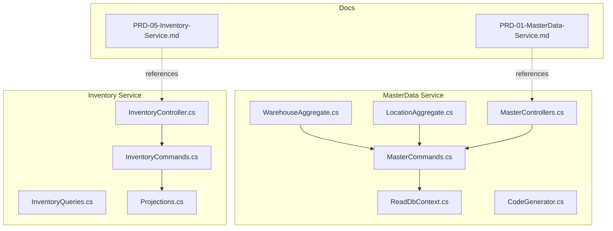
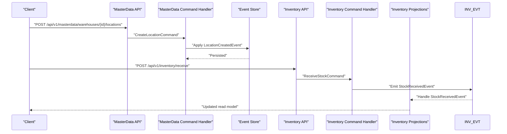
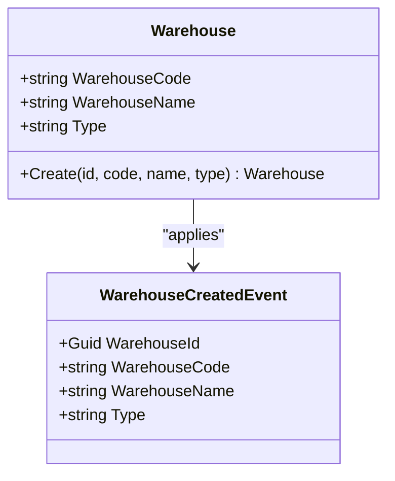
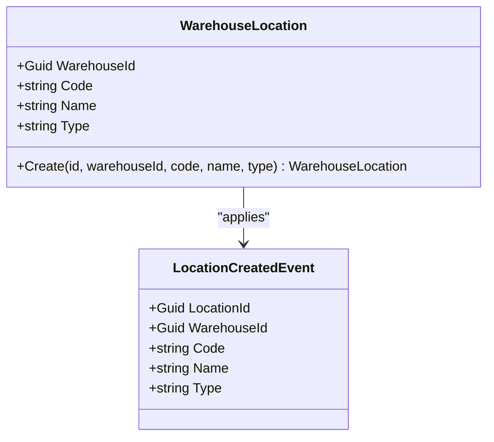
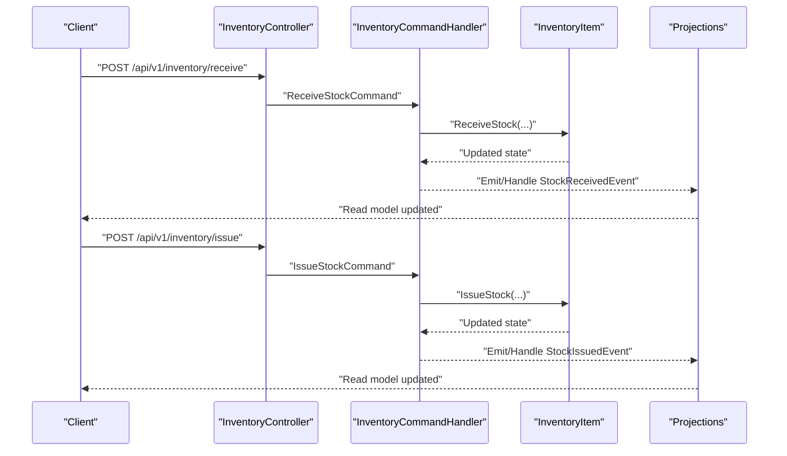
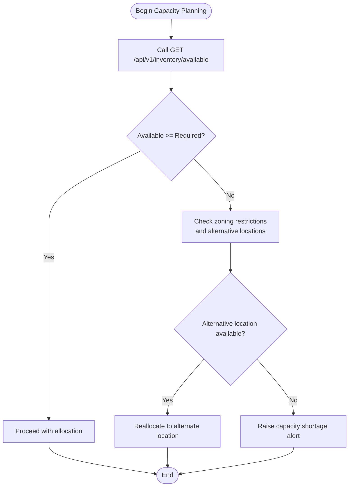
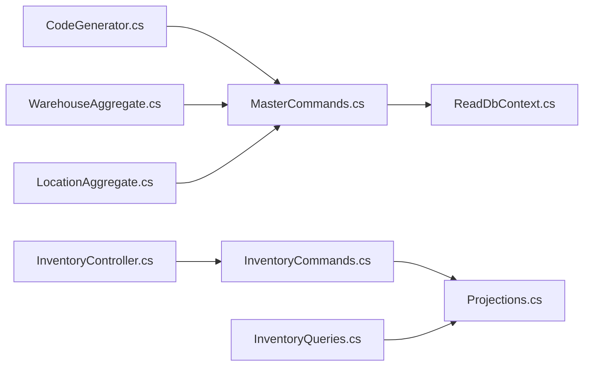

# Location and Warehouse API

<cite>
**Referenced Files in This Document**
- [WarehouseAggregate.cs](file://src/Services/MasterData/ErpSystem.MasterData/Domain/WarehouseAggregate.cs)
- [LocationAggregate.cs](file://src/Services/MasterData/ErpSystem.MasterData/Domain/LocationAggregate.cs)
- [MasterCommands.cs](file://src/Services/MasterData/ErpSystem.MasterData/Application/MasterCommands.cs)
- [MasterControllers.cs](file://src/Services/MasterData/ErpSystem.MasterData/Controllers/MasterControllers.cs)
- [ReadDbContext.cs](file://src/Services/MasterData/ErpSystem.MasterData/Infrastructure/ReadDbContext.cs)
- [CodeGenerator.cs](file://src/Services/MasterData/ErpSystem.MasterData/Domain/CodeGenerator.cs)
- [InventoryController.cs](file://src/Services/Inventory/ErpSystem.Inventory/API/InventoryController.cs)
- [InventoryCommands.cs](file://src/Services/Inventory/ErpSystem.Inventory/Application/InventoryCommands.cs)
- [InventoryQueries.cs](file://src/Services/Inventory/ErpSystem.Inventory/Application/InventoryQueries.cs)
- [Projections.cs](file://src/Services/Inventory/ErpSystem.Inventory/Infrastructure/Projections.cs)
- [PRD-01-MasterData-Service.md](file://docs/PRD-01-MasterData-Service.md)
- [PRD-05-Inventory-Service.md](file://docs/PRD-05-Inventory-Service.md)
- [Inventory.tsx](file://src/Web/ErpSystem.Web/src/pages/Inventory.tsx)
</cite>

## Table of Contents
1. [Introduction](#introduction)
2. [Project Structure](#project-structure)
3. [Core Components](#core-components)
4. [Architecture Overview](#architecture-overview)
5. [Detailed Component Analysis](#detailed-component-analysis)
6. [Dependency Analysis](#dependency-analysis)
7. [Performance Considerations](#performance-considerations)
8. [Troubleshooting Guide](#troubleshooting-guide)
9. [Conclusion](#conclusion)
10. [Appendices](#appendices)

## Introduction
This document provides comprehensive API documentation for Location and Warehouse management operations within the ERP microservices. It covers:
- Warehouse creation and lifecycle events
- Location assignment and hierarchical modeling
- Storage zone configuration and bin management
- Location hierarchy management, capacity planning, and inventory allocation rules
- Warehouse transfer operations and internal movement
- Location-specific pricing and regional distribution considerations
- Examples of warehouse capacity monitoring, location-based reporting, and multi-location inventory tracking
- Location validation, zoning restrictions, and integration with inventory and logistics services

## Project Structure
The Location and Warehouse capabilities are primarily implemented in the MasterData service (domain aggregates, commands, and read models) and integrated with the Inventory service for stock movements and reporting.

**Diagram sources**
- [WarehouseAggregate.cs](file://src/Services/MasterData/ErpSystem.MasterData/Domain/WarehouseAggregate.cs#L1-L44)
- [LocationAggregate.cs](file://src/Services/MasterData/ErpSystem.MasterData/Domain/LocationAggregate.cs#L1-L49)
- [MasterCommands.cs](file://src/Services/MasterData/ErpSystem.MasterData/Application/MasterCommands.cs#L1-L110)
- [MasterControllers.cs](file://src/Services/MasterData/ErpSystem.MasterData/Controllers/MasterControllers.cs#L1-L79)
- [ReadDbContext.cs](file://src/Services/MasterData/ErpSystem.MasterData/Infrastructure/ReadDbContext.cs#L105-L126)
- [CodeGenerator.cs](file://src/Services/MasterData/ErpSystem.MasterData/Domain/CodeGenerator.cs#L1-L21)
- [InventoryController.cs](file://src/Services/Inventory/ErpSystem.Inventory/API/InventoryController.cs#L1-L32)
- [InventoryCommands.cs](file://src/Services/Inventory/ErpSystem.Inventory/Application/InventoryCommands.cs#L1-L142)
- [InventoryQueries.cs](file://src/Services/Inventory/ErpSystem.Inventory/Application/InventoryQueries.cs#L1-L50)
- [Projections.cs](file://src/Services/Inventory/ErpSystem.Inventory/Infrastructure/Projections.cs#L172-L216)
- [PRD-01-MasterData-Service.md](file://docs/PRD-01-MasterData-Service.md#L654-L666)
- [PRD-05-Inventory-Service.md](file://docs/PRD-05-Inventory-Service.md#L375-L443)

**Section sources**
- [WarehouseAggregate.cs](file://src/Services/MasterData/ErpSystem.MasterData/Domain/WarehouseAggregate.cs#L1-L44)
- [LocationAggregate.cs](file://src/Services/MasterData/ErpSystem.MasterData/Domain/LocationAggregate.cs#L1-L49)
- [MasterCommands.cs](file://src/Services/MasterData/ErpSystem.MasterData/Application/MasterCommands.cs#L101-L108)
- [MasterControllers.cs](file://src/Services/MasterData/ErpSystem.MasterData/Controllers/MasterControllers.cs#L1-L79)
- [ReadDbContext.cs](file://src/Services/MasterData/ErpSystem.MasterData/Infrastructure/ReadDbContext.cs#L105-L126)
- [CodeGenerator.cs](file://src/Services/MasterData/ErpSystem.MasterData/Domain/CodeGenerator.cs#L1-L21)
- [InventoryController.cs](file://src/Services/Inventory/ErpSystem.Inventory/API/InventoryController.cs#L1-L32)
- [InventoryCommands.cs](file://src/Services/Inventory/ErpSystem.Inventory/Application/InventoryCommands.cs#L1-L142)
- [InventoryQueries.cs](file://src/Services/Inventory/ErpSystem.Inventory/Application/InventoryQueries.cs#L1-L50)
- [Projections.cs](file://src/Services/Inventory/ErpSystem.Inventory/Infrastructure/Projections.cs#L172-L216)
- [PRD-01-MasterData-Service.md](file://docs/PRD-01-MasterData-Service.md#L654-L666)
- [PRD-05-Inventory-Service.md](file://docs/PRD-05-Inventory-Service.md#L375-L443)

## Core Components
- WarehouseAggregate: Defines warehouse identity, type, and the domain event for creation.
- WarehouseLocation (LocationAggregate): Defines location identity, warehouse association, code/name/type, and the domain event for creation.
- MasterCommands: Provides CreateLocationCommand and handler to create locations under a warehouse.
- MasterControllers: Exposes REST endpoints for master data operations (notably materials/partners).
- InventoryController: Exposes REST endpoints for inventory operations including receive, issue, reserve, adjust, and transfer.
- InventoryCommands: Defines commands for stock operations and handlers implementing business logic.
- InventoryQueries: Provides queries for inventory items and transactions.
- Projections: Reads inventory item and transaction changes and updates read models.
- ReadDbContext: Declares read models for locations and other master data projections.
- CodeGenerator: Generates standardized codes for entities including warehouses.

Key API surfaces for Location and Warehouse:
- Create warehouse: See PRD endpoint reference.
- Create location: POST /api/v1/masterdata/warehouses/{id}/locations
- Get locations: GET /api/v1/masterdata/warehouses/{id}/locations

Inventory APIs:
- Receive stock: POST /api/v1/inventory/receive
- Issue stock: POST /api/v1/inventory/issue
- Reserve stock: POST /api/v1/inventory/reservations
- Release reservation: POST /api/v1/inventory/reservations/release
- Adjust stock: POST /api/v1/inventory/adjustments
- Transfer stock: POST /api/v1/inventory/transfer
- Query available: GET /api/v1/inventory/available
- List items: GET /api/v1/inventory/items

**Section sources**
- [WarehouseAggregate.cs](file://src/Services/MasterData/ErpSystem.MasterData/Domain/WarehouseAggregate.cs#L5-L15)
- [LocationAggregate.cs](file://src/Services/MasterData/ErpSystem.MasterData/Domain/LocationAggregate.cs#L7-L17)
- [MasterCommands.cs](file://src/Services/MasterData/ErpSystem.MasterData/Application/MasterCommands.cs#L40-L41)
- [MasterCommands.cs](file://src/Services/MasterData/ErpSystem.MasterData/Application/MasterCommands.cs#L101-L108)
- [MasterControllers.cs](file://src/Services/MasterData/ErpSystem.MasterData/Controllers/MasterControllers.cs#L1-L79)
- [InventoryController.cs](file://src/Services/Inventory/ErpSystem.Inventory/API/InventoryController.cs#L11-L32)
- [InventoryCommands.cs](file://src/Services/Inventory/ErpSystem.Inventory/Application/InventoryCommands.cs#L9-L58)
- [InventoryQueries.cs](file://src/Services/Inventory/ErpSystem.Inventory/Application/InventoryQueries.cs#L7-L11)
- [Projections.cs](file://src/Services/Inventory/ErpSystem.Inventory/Infrastructure/Projections.cs#L172-L216)
- [ReadDbContext.cs](file://src/Services/MasterData/ErpSystem.MasterData/Infrastructure/ReadDbContext.cs#L105-L126)
- [CodeGenerator.cs](file://src/Services/MasterData/ErpSystem.MasterData/Domain/CodeGenerator.cs#L1-L21)
- [PRD-01-MasterData-Service.md](file://docs/PRD-01-MasterData-Service.md#L654-L666)
- [PRD-05-Inventory-Service.md](file://docs/PRD-05-Inventory-Service.md#L375-L443)

## Architecture Overview
The system follows a CQRS and event-sourced pattern:
- MasterData service manages warehouse and location entities and publishes domain events.
- Inventory service orchestrates stock movements and maintains read models for reporting and queries.
- Projections update read-side models upon receiving domain events and command outcomes.

**Diagram sources**
- [MasterControllers.cs](file://src/Services/MasterData/ErpSystem.MasterData/Controllers/MasterControllers.cs#L1-L79)
- [MasterCommands.cs](file://src/Services/MasterData/ErpSystem.MasterData/Application/MasterCommands.cs#L101-L108)
- [LocationAggregate.cs](file://src/Services/MasterData/ErpSystem.MasterData/Domain/LocationAggregate.cs#L7-L17)
- [InventoryController.cs](file://src/Services/Inventory/ErpSystem.Inventory/API/InventoryController.cs#L21-L22)
- [InventoryCommands.cs](file://src/Services/Inventory/ErpSystem.Inventory/Application/InventoryCommands.cs#L68-L89)
- [Projections.cs](file://src/Services/Inventory/ErpSystem.Inventory/Infrastructure/Projections.cs#L172-L216)

## Detailed Component Analysis

### Warehouse Management
- Domain: WarehouseAggregate encapsulates warehouse identity and type, and emits a WarehouseCreatedEvent upon creation.
- Code generation: DefaultCodeGenerator produces standardized warehouse codes.
- Lifecycle: Creation via command handler persists the aggregate and applies the creation event.

**Diagram sources**
- [WarehouseAggregate.cs](file://src/Services/MasterData/ErpSystem.MasterData/Domain/WarehouseAggregate.cs#L18-L42)
- [WarehouseAggregate.cs](file://src/Services/MasterData/ErpSystem.MasterData/Domain/WarehouseAggregate.cs#L6-L15)
- [CodeGenerator.cs](file://src/Services/MasterData/ErpSystem.MasterData/Domain/CodeGenerator.cs#L20)

**Section sources**
- [WarehouseAggregate.cs](file://src/Services/MasterData/ErpSystem.MasterData/Domain/WarehouseAggregate.cs#L1-L44)
- [CodeGenerator.cs](file://src/Services/MasterData/ErpSystem.MasterData/Domain/CodeGenerator.cs#L1-L21)

### Location and Storage Zone Management
- Domain: WarehouseLocation defines location identity, warehouse association, and type (e.g., Area, Shelf, Bin). It emits a LocationCreatedEvent upon creation.
- Command: CreateLocationCommand creates a new location under a warehouse and persists it.
- Read model: LocationReadModel exposes location attributes for querying and reporting.

**Diagram sources**
- [LocationAggregate.cs](file://src/Services/MasterData/ErpSystem.MasterData/Domain/LocationAggregate.cs#L21-L47)
- [LocationAggregate.cs](file://src/Services/MasterData/ErpSystem.MasterData/Domain/LocationAggregate.cs#L7-L17)
- [ReadDbContext.cs](file://src/Services/MasterData/ErpSystem.MasterData/Infrastructure/ReadDbContext.cs#L105-L113)

**Section sources**
- [LocationAggregate.cs](file://src/Services/MasterData/ErpSystem.MasterData/Domain/LocationAggregate.cs#L1-L49)
- [MasterCommands.cs](file://src/Services/MasterData/ErpSystem.MasterData/Application/MasterCommands.cs#L101-L108)
- [ReadDbContext.cs](file://src/Services/MasterData/ErpSystem.MasterData/Infrastructure/ReadDbContext.cs#L105-L126)

### Inventory Allocation and Movement
- Receive stock: Creates or updates an inventory item and increases OnHand, recalculating Available.
- Issue stock: Decreases OnHand and releases reservations if applicable.
- Reserve stock: Creates a reservation linked to a source (e.g., sales order), increasing Reserved and decreasing Available.
- Adjust stock: Corrects OnHand to match physical counts.
- Transfer stock: Moves stock between warehouses/bins while recording a transfer transaction.

**Diagram sources**
- [InventoryController.cs](file://src/Services/Inventory/ErpSystem.Inventory/API/InventoryController.cs#L21-L29)
- [InventoryCommands.cs](file://src/Services/Inventory/ErpSystem.Inventory/Application/InventoryCommands.cs#L68-L109)
- [Projections.cs](file://src/Services/Inventory/ErpSystem.Inventory/Infrastructure/Projections.cs#L172-L216)

**Section sources**
- [InventoryController.cs](file://src/Services/Inventory/ErpSystem.Inventory/API/InventoryController.cs#L1-L32)
- [InventoryCommands.cs](file://src/Services/Inventory/ErpSystem.Inventory/Application/InventoryCommands.cs#L1-L142)
- [InventoryQueries.cs](file://src/Services/Inventory/ErpSystem.Inventory/Application/InventoryQueries.cs#L1-L50)
- [Projections.cs](file://src/Services/Inventory/ErpSystem.Inventory/Infrastructure/Projections.cs#L172-L216)

### Capacity Planning and Zoning Restrictions
- Capacity planning: Use GET /api/v1/inventory/available to check Available quantities per warehouse/bin/material combination.
- Zoning restrictions: Locations are typed (Area/Shelf/Bin). Business rules can enforce storage zone policies (e.g., temperature-controlled areas) at the application level via command handlers and validations.
- Multi-location tracking: Use GET /api/v1/inventory/items with filters (warehouseId, binId, materialCode) to monitor stock across locations.

**Diagram sources**
- [InventoryController.cs](file://src/Services/Inventory/ErpSystem.Inventory/API/InventoryController.cs#L16-L19)
- [InventoryQueries.cs](file://src/Services/Inventory/ErpSystem.Inventory/Application/InventoryQueries.cs#L18-L23)
- [LocationAggregate.cs](file://src/Services/MasterData/ErpSystem.MasterData/Domain/LocationAggregate.cs#L26)

**Section sources**
- [InventoryController.cs](file://src/Services/Inventory/ErpSystem.Inventory/API/InventoryController.cs#L16-L19)
- [InventoryQueries.cs](file://src/Services/Inventory/ErpSystem.Inventory/Application/InventoryQueries.cs#L18-L23)
- [LocationAggregate.cs](file://src/Services/MasterData/ErpSystem.MasterData/Domain/LocationAggregate.cs#L26)

### Regional Distribution Networks and Pricing
- Regional distribution: Warehouse-level segregation supports regional distribution strategies. Use warehouseId filters to isolate regional inventories.
- Location-specific pricing: While not explicitly modeled in the current code, pricing can be associated at the material level and applied regionally via external services or extensions to the inventory read model.

[No sources needed since this section provides conceptual guidance]

### Examples and Use Cases
- Warehouse capacity monitoring: Poll GET /api/v1/inventory/available for key SKUs across warehouses to detect low stock or over-allocation.
- Location-based reporting: Use GET /api/v1/inventory/items with warehouseId and binId filters to generate reports on stock distribution by zone.
- Multi-location inventory tracking: Combine filtering by warehouseId and binId to track stock movement across zones and generate variance reports.

**Section sources**
- [InventoryController.cs](file://src/Services/Inventory/ErpSystem.Inventory/API/InventoryController.cs#L11-L14)
- [InventoryQueries.cs](file://src/Services/Inventory/ErpSystem.Inventory/Application/InventoryQueries.cs#L25-L37)
- [Inventory.tsx](file://src/Web/ErpSystem.Web/src/pages/Inventory.tsx#L28-L43)

## Dependency Analysis
- MasterData depends on:
  - Domain aggregates (WarehouseAggregate, WarehouseLocation)
  - Command handlers (MasterCommands)
  - ReadDbContext for read models
  - CodeGenerator for entity codes
- Inventory depends on:
  - Command handlers (InventoryCommands)
  - Queries (InventoryQueries)
  - Projections (Projections) to maintain read models
- Integration:
  - Inventory receives stock and issues stock based on commands/events.
  - MasterData creates locations that can later be assigned to inventory items.

**Diagram sources**
- [CodeGenerator.cs](file://src/Services/MasterData/ErpSystem.MasterData/Domain/CodeGenerator.cs#L1-L21)
- [MasterCommands.cs](file://src/Services/MasterData/ErpSystem.MasterData/Application/MasterCommands.cs#L101-L108)
- [WarehouseAggregate.cs](file://src/Services/MasterData/ErpSystem.MasterData/Domain/WarehouseAggregate.cs#L18-L42)
- [LocationAggregate.cs](file://src/Services/MasterData/ErpSystem.MasterData/Domain/LocationAggregate.cs#L21-L47)
- [ReadDbContext.cs](file://src/Services/MasterData/ErpSystem.MasterData/Infrastructure/ReadDbContext.cs#L105-L126)
- [InventoryCommands.cs](file://src/Services/Inventory/ErpSystem.Inventory/Application/InventoryCommands.cs#L60-L142)
- [Projections.cs](file://src/Services/Inventory/ErpSystem.Inventory/Infrastructure/Projections.cs#L172-L216)
- [InventoryController.cs](file://src/Services/Inventory/ErpSystem.Inventory/API/InventoryController.cs#L1-L32)

**Section sources**
- [MasterCommands.cs](file://src/Services/MasterData/ErpSystem.MasterData/Application/MasterCommands.cs#L101-L108)
- [InventoryCommands.cs](file://src/Services/Inventory/ErpSystem.Inventory/Application/InventoryCommands.cs#L60-L142)
- [Projections.cs](file://src/Services/Inventory/ErpSystem.Inventory/Infrastructure/Projections.cs#L172-L216)

## Performance Considerations
- Indexing: Ensure read models (InventoryItemReadModel, StockTransactionReadModel) are indexed on frequently queried fields (warehouseId, binId, materialId).
- Pagination: Use page and pageSize parameters in inventory listing queries to limit payload sizes.
- Asynchronous projections: Keep projections lightweight and asynchronous to avoid blocking write operations.

[No sources needed since this section provides general guidance]

## Troubleshooting Guide
- 404 Not Found: Inventory item not found during issue/transfer/adjustment indicates incorrect InventoryItemId or missing read model synchronization.
- 400 Bad Request: Validation errors on requests (e.g., negative quantities, missing required fields).
- 409 Conflict: Reservation conflicts or zoning policy violations (handled at command handler level).
- Read model lag: If inventory availability appears stale, verify projections are running and up-to-date.

**Section sources**
- [InventoryCommands.cs](file://src/Services/Inventory/ErpSystem.Inventory/Application/InventoryCommands.cs#L91-L99)
- [InventoryQueries.cs](file://src/Services/Inventory/ErpSystem.Inventory/Application/InventoryQueries.cs#L18-L23)

## Conclusion
The Location and Warehouse API enables robust warehouse creation, location assignment, and inventory movement across storage zones. By leveraging the Inventory service’s receive, issue, reserve, adjust, and transfer endpoints alongside MasterData’s location creation, organizations can implement capacity planning, zoning controls, and regional distribution strategies. Extending the read models and command handlers allows for location-specific pricing and advanced reporting.

[No sources needed since this section summarizes without analyzing specific files]

## Appendices

### API Reference Summary
- Create location: POST /api/v1/masterdata/warehouses/{id}/locations
- Get locations: GET /api/v1/masterdata/warehouses/{id}/locations
- Receive stock: POST /api/v1/inventory/receive
- Issue stock: POST /api/v1/inventory/issue
- Reserve stock: POST /api/v1/inventory/reservations
- Release reservation: POST /api/v1/inventory/reservations/release
- Adjust stock: POST /api/v1/inventory/adjustments
- Transfer stock: POST /api/v1/inventory/transfer
- Query available: GET /api/v1/inventory/available
- List items: GET /api/v1/inventory/items

**Section sources**
- [PRD-01-MasterData-Service.md](file://docs/PRD-01-MasterData-Service.md#L654-L666)
- [PRD-05-Inventory-Service.md](file://docs/PRD-05-Inventory-Service.md#L375-L443)
- [InventoryController.cs](file://src/Services/Inventory/ErpSystem.Inventory/API/InventoryController.cs#L11-L32)