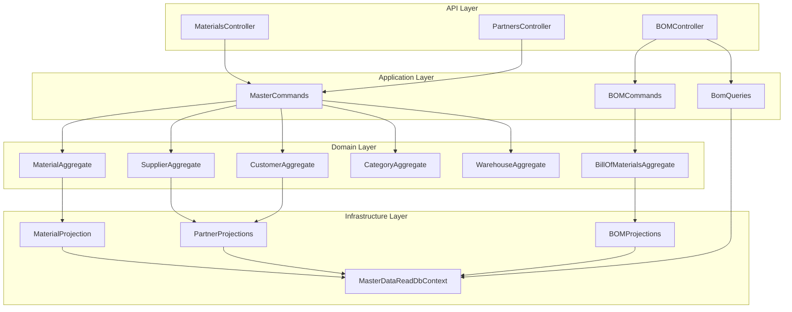
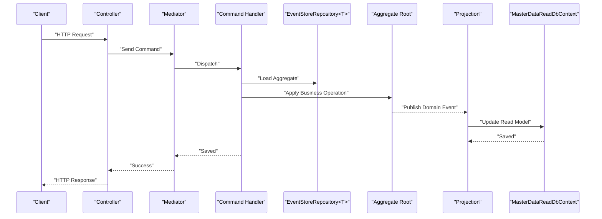
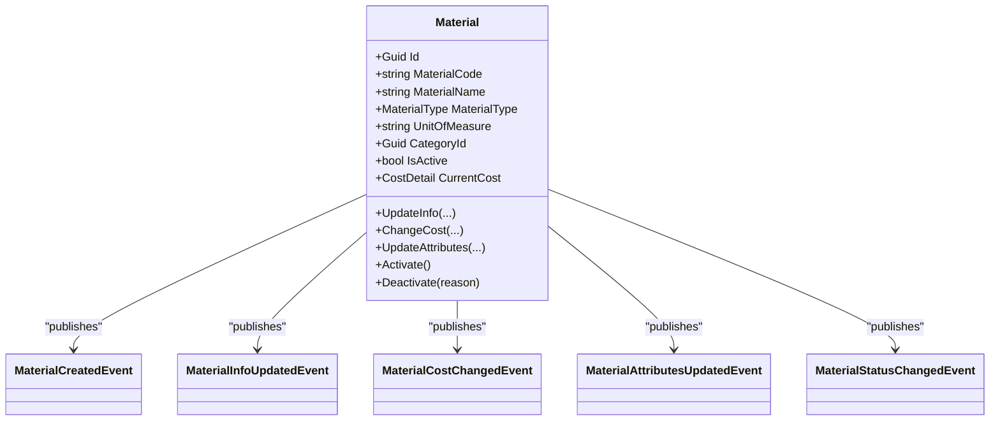
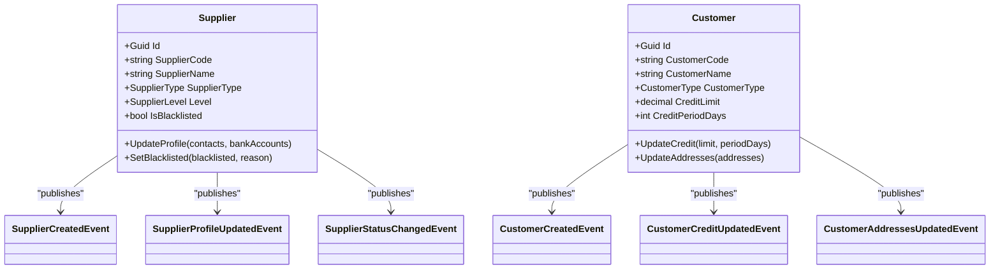
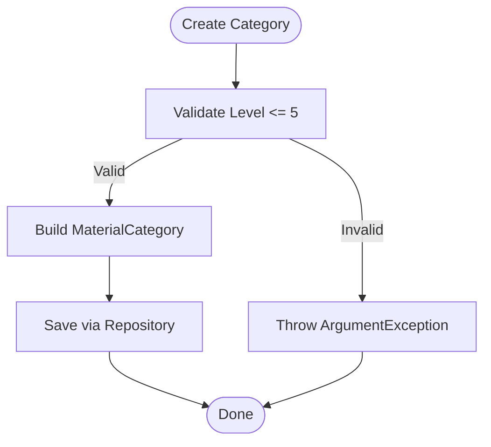
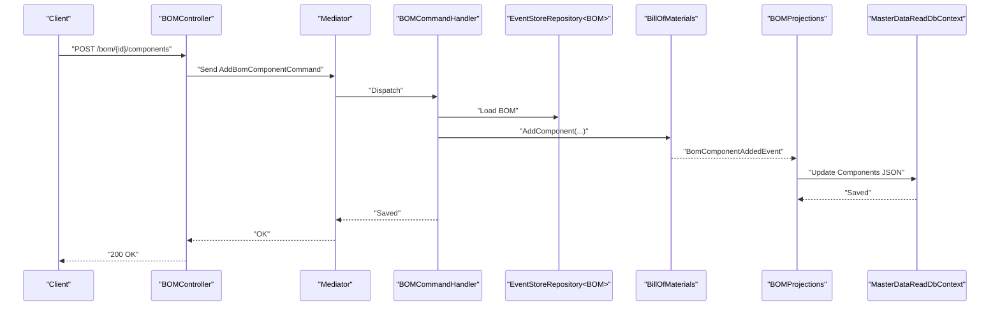
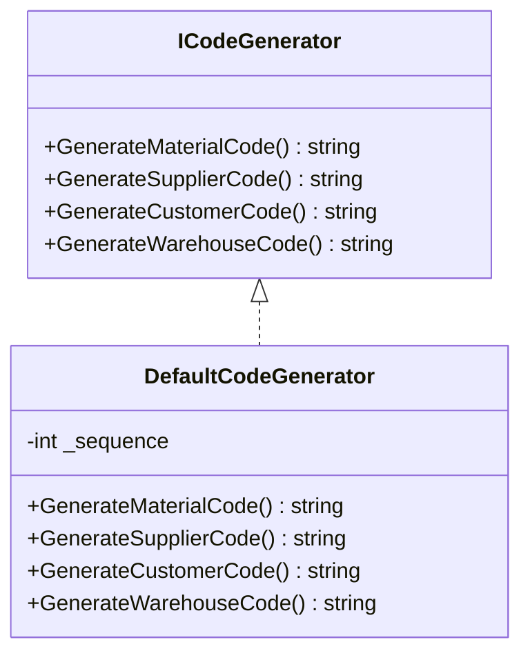
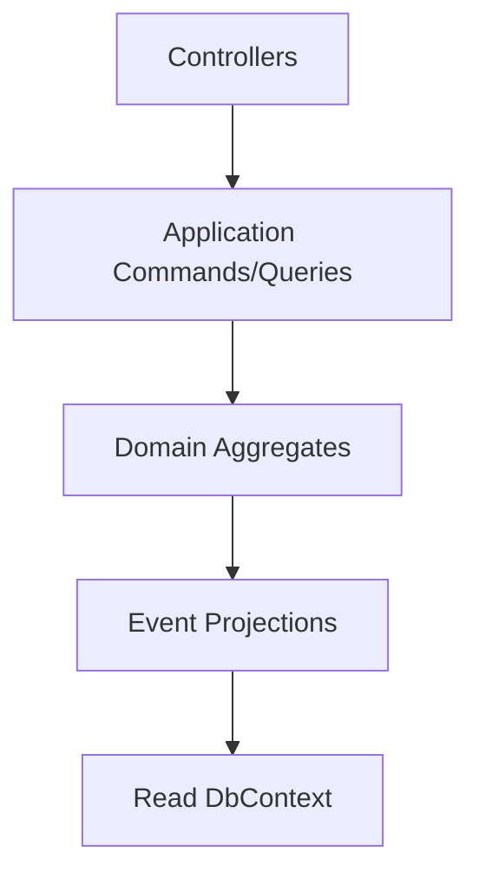

# Master Data Service API

<cite>
**Referenced Files in This Document**
- [Program.cs](file://src/Services/MasterData/ErpSystem.MasterData/Program.cs)
- [MasterControllers.cs](file://src/Services/MasterData/ErpSystem.MasterData/Controllers/MasterControllers.cs)
- [BOMController.cs](file://src/Services/MasterData/ErpSystem.MasterData/Controllers/BOMController.cs)
- [MasterCommands.cs](file://src/Services/MasterData/ErpSystem.MasterData/Application/MasterCommands.cs)
- [BOMCommands.cs](file://src/Services/MasterData/ErpSystem.MasterData/Application/BOMCommands.cs)
- [BOMQueries.cs](file://src/Services/MasterData/ErpSystem.MasterData/Application/BOMQueries.cs)
- [MaterialAggregate.cs](file://src/Services/MasterData/ErpSystem.MasterData/Domain/MaterialAggregate.cs)
- [SupplierAggregate.cs](file://src/Services/MasterData/ErpSystem.MasterData/Domain/SupplierAggregate.cs)
- [CustomerAggregate.cs](file://src/Services/MasterData/ErpSystem.MasterData/Domain/CustomerAggregate.cs)
- [CategoryAggregate.cs](file://src/Services/MasterData/ErpSystem.MasterData/Domain/CategoryAggregate.cs)
- [WarehouseAggregate.cs](file://src/Services/MasterData/ErpSystem.MasterData/Domain/WarehouseAggregate.cs)
- [BillOfMaterialsAggregate.cs](file://src/Services/MasterData/ErpSystem.MasterData/Domain/BillOfMaterialsAggregate.cs)
- [MaterialProjections.cs](file://src/Services/MasterData/ErpSystem.MasterData/Infrastructure/MaterialProjections.cs)
- [PartnerProjections.cs](file://src/Services/MasterData/ErpSystem.MasterData/Infrastructure/PartnerProjections.cs)
- [BOMProjections.cs](file://src/Services/MasterData/ErpSystem.MasterData/Infrastructure/BOMProjections.cs)
- [ReadDbContext.cs](file://src/Services/MasterData/ErpSystem.MasterData/Infrastructure/ReadDbContext.cs)
- [CodeGenerator.cs](file://src/Services/MasterData/ErpSystem.MasterData/Domain/CodeGenerator.cs)
</cite>

## Table of Contents
1. [Introduction](#introduction)
2. [Project Structure](#project-structure)
3. [Core Components](#core-components)
4. [Architecture Overview](#architecture-overview)
5. [Detailed Component Analysis](#detailed-component-analysis)
6. [Dependency Analysis](#dependency-analysis)
7. [Performance Considerations](#performance-considerations)
8. [Troubleshooting Guide](#troubleshooting-guide)
9. [Conclusion](#conclusion)
10. [Appendices](#appendices)

## Introduction
This document provides comprehensive API documentation for the Master Data service. It covers core business entities and classification hierarchies, including material master data management, supplier and customer maintenance, warehouse and location management, unit of measure definitions, and bill of materials (BOM) operations. It also documents product categorization, pricing structures, supplier relationship management, data validation rules, code generation patterns, and master data synchronization across services. Examples of bulk operations, import/export workflows, and integration with external ERP systems are outlined, along with data quality controls, duplicate detection strategies, and change management processes.

## Project Structure
The Master Data service follows a clean architecture with separate concerns for application orchestration, domain modeling, and infrastructure projections. Key areas:
- Controllers expose REST endpoints for CRUD operations and queries.
- Application layer defines commands, requests, and handlers.
- Domain layer encapsulates business logic and events.
- Infrastructure layer handles projections, read models, and persistence.

**Diagram sources**
- [MasterControllers.cs](file://src/Services/MasterData/ErpSystem.MasterData/Controllers/MasterControllers.cs#L11-L78)
- [BOMController.cs](file://src/Services/MasterData/ErpSystem.MasterData/Controllers/BOMController.cs#L10-L53)
- [MasterCommands.cs](file://src/Services/MasterData/ErpSystem.MasterData/Application/MasterCommands.cs#L44-L109)
- [BOMCommands.cs](file://src/Services/MasterData/ErpSystem.MasterData/Application/BOMCommands.cs#L27-L48)
- [BOMQueries.cs](file://src/Services/MasterData/ErpSystem.MasterData/Application/BOMQueries.cs#L10-L40)
- [MaterialAggregate.cs](file://src/Services/MasterData/ErpSystem.MasterData/Domain/MaterialAggregate.cs#L84-L177)
- [SupplierAggregate.cs](file://src/Services/MasterData/ErpSystem.MasterData/Domain/SupplierAggregate.cs#L66-L124)
- [CustomerAggregate.cs](file://src/Services/MasterData/ErpSystem.MasterData/Domain/CustomerAggregate.cs#L46-L95)
- [CategoryAggregate.cs](file://src/Services/MasterData/ErpSystem.MasterData/Domain/CategoryAggregate.cs#L27-L66)
- [WarehouseAggregate.cs](file://src/Services/MasterData/ErpSystem.MasterData/Domain/WarehouseAggregate.cs#L18-L43)
- [BillOfMaterialsAggregate.cs](file://src/Services/MasterData/ErpSystem.MasterData/Domain/BillOfMaterialsAggregate.cs#L55-L124)
- [MaterialProjections.cs](file://src/Services/MasterData/ErpSystem.MasterData/Infrastructure/MaterialProjections.cs#L7-L74)
- [PartnerProjections.cs](file://src/Services/MasterData/ErpSystem.MasterData/Infrastructure/PartnerProjections.cs#L7-L79)
- [BOMProjections.cs](file://src/Services/MasterData/ErpSystem.MasterData/Infrastructure/BOMProjections.cs#L7-L49)
- [ReadDbContext.cs](file://src/Services/MasterData/ErpSystem.MasterData/Infrastructure/ReadDbContext.cs#L5-L47)

**Section sources**
- [Program.cs](file://src/Services/MasterData/ErpSystem.MasterData/Program.cs#L9-L67)
- [MasterControllers.cs](file://src/Services/MasterData/ErpSystem.MasterData/Controllers/MasterControllers.cs#L11-L78)
- [BOMController.cs](file://src/Services/MasterData/ErpSystem.MasterData/Controllers/BOMController.cs#L10-L53)

## Core Components
- Controllers
  - MaterialsController: Create, update info/attributes, list, and get material records.
  - PartnersController: Create suppliers/customers, update supplier profile, list suppliers/customers.
  - BOMController: Query BOMs, get by ID, get by parent material, create BOM, add components, activate BOM.
- Application
  - Commands: CreateMaterialRequest, UpdateMaterialInfoCommand, UpdateMaterialAttributesCommand, CreateSupplierRequest, UpdateSupplierProfileCommand, CreateCustomerRequest, UpdateCustomerAddressesCommand, CreateCategoryCommand, CreateLocationCommand, CreateBomRequest, AddBomComponentCommand, ActivateBomCommand.
  - Queries: BomQueries for retrieving BOM read models.
- Domain Aggregates
  - Material, Supplier, Customer, MaterialCategory, Warehouse, BillOfMaterials with associated value objects and events.
- Infrastructure
  - MasterDataReadDbContext with JSONB-backed read models.
  - Projections for Material, Supplier/Customer, and BOM.

**Section sources**
- [MasterControllers.cs](file://src/Services/MasterData/ErpSystem.MasterData/Controllers/MasterControllers.cs#L11-L78)
- [BOMController.cs](file://src/Services/MasterData/ErpSystem.MasterData/Controllers/BOMController.cs#L10-L53)
- [MasterCommands.cs](file://src/Services/MasterData/ErpSystem.MasterData/Application/MasterCommands.cs#L9-L109)
- [BOMCommands.cs](file://src/Services/MasterData/ErpSystem.MasterData/Application/BOMCommands.cs#L9-L48)
- [BOMQueries.cs](file://src/Services/MasterData/ErpSystem.MasterData/Application/BOMQueries.cs#L10-L40)
- [MaterialAggregate.cs](file://src/Services/MasterData/ErpSystem.MasterData/Domain/MaterialAggregate.cs#L84-L177)
- [SupplierAggregate.cs](file://src/Services/MasterData/ErpSystem.MasterData/Domain/SupplierAggregate.cs#L66-L124)
- [CustomerAggregate.cs](file://src/Services/MasterData/ErpSystem.MasterData/Domain/CustomerAggregate.cs#L46-L95)
- [CategoryAggregate.cs](file://src/Services/MasterData/ErpSystem.MasterData/Domain/CategoryAggregate.cs#L27-L66)
- [WarehouseAggregate.cs](file://src/Services/MasterData/ErpSystem.MasterData/Domain/WarehouseAggregate.cs#L18-L43)
- [BillOfMaterialsAggregate.cs](file://src/Services/MasterData/ErpSystem.MasterData/Domain/BillOfMaterialsAggregate.cs#L55-L124)
- [ReadDbContext.cs](file://src/Services/MasterData/ErpSystem.MasterData/Infrastructure/ReadDbContext.cs#L5-L47)

## Architecture Overview
The service uses CQRS with event sourcing and projection-based read models. Commands are handled via MediatR handlers; domain aggregates publish events that are projected into relational read models for efficient querying.

**Diagram sources**
- [Program.cs](file://src/Services/MasterData/ErpSystem.MasterData/Program.cs#L23-L36)
- [MasterCommands.cs](file://src/Services/MasterData/ErpSystem.MasterData/Application/MasterCommands.cs#L44-L109)
- [MaterialProjections.cs](file://src/Services/MasterData/ErpSystem.MasterData/Infrastructure/MaterialProjections.cs#L7-L74)
- [PartnerProjections.cs](file://src/Services/MasterData/ErpSystem.MasterData/Infrastructure/PartnerProjections.cs#L7-L79)
- [BOMProjections.cs](file://src/Services/MasterData/ErpSystem.MasterData/Infrastructure/BOMProjections.cs#L7-L49)
- [ReadDbContext.cs](file://src/Services/MasterData/ErpSystem.MasterData/Infrastructure/ReadDbContext.cs#L5-L47)

## Detailed Component Analysis

### Materials API
- Endpoints
  - POST /api/v1/materials
  - GET /api/v1/materials
  - GET /api/v1/materials/{id}
  - PUT /api/v1/materials/{id}/info
  - PUT /api/v1/materials/{id}/attributes
- Requests and Commands
  - CreateMaterialRequest: name, type, uoM, categoryId, initialCost
  - UpdateMaterialInfoCommand: name, description, specification, brand, manufacturer
  - UpdateMaterialAttributesCommand: attributes list
- Domain Behavior
  - Material aggregate supports info updates, cost changes, attribute updates, activation/deactivation.
  - Events: MaterialCreatedEvent, MaterialInfoUpdatedEvent, MaterialCostChangedEvent, MaterialAttributesUpdatedEvent, MaterialStatusChangedEvent.
- Read Model
  - MaterialReadModel persisted with JSONB fields for attributes and cost detail.

**Diagram sources**
- [MaterialAggregate.cs](file://src/Services/MasterData/ErpSystem.MasterData/Domain/MaterialAggregate.cs#L84-L177)

**Section sources**
- [MasterControllers.cs](file://src/Services/MasterData/ErpSystem.MasterData/Controllers/MasterControllers.cs#L11-L45)
- [MasterCommands.cs](file://src/Services/MasterData/ErpSystem.MasterData/Application/MasterCommands.cs#L9-L24)
- [MaterialAggregate.cs](file://src/Services/MasterData/ErpSystem.MasterData/Domain/MaterialAggregate.cs#L84-L177)
- [MaterialProjections.cs](file://src/Services/MasterData/ErpSystem.MasterData/Infrastructure/MaterialProjections.cs#L7-L74)
- [ReadDbContext.cs](file://src/Services/MasterData/ErpSystem.MasterData/Infrastructure/ReadDbContext.cs#L51-L65)

### Partners API (Suppliers and Customers)
- Endpoints
  - POST /api/v1/partners/suppliers
  - PUT /api/v1/partners/suppliers/{id}/profile
  - POST /api/v1/partners/customers
  - GET /api/v1/partners/suppliers
  - GET /api/v1/partners/customers
- Requests and Commands
  - CreateSupplierRequest, UpdateSupplierProfileCommand
  - CreateCustomerRequest, UpdateCustomerAddressesCommand
- Domain Behavior
  - Supplier: contact persons, bank accounts, blacklist status, level.
  - Customer: shipping addresses, credit limit, credit period.
- Read Model
  - SupplierReadModel and CustomerReadModel with JSONB fields for contacts/bank accounts and addresses.

**Diagram sources**
- [SupplierAggregate.cs](file://src/Services/MasterData/ErpSystem.MasterData/Domain/SupplierAggregate.cs#L66-L124)
- [CustomerAggregate.cs](file://src/Services/MasterData/ErpSystem.MasterData/Domain/CustomerAggregate.cs#L46-L95)

**Section sources**
- [MasterControllers.cs](file://src/Services/MasterData/ErpSystem.MasterData/Controllers/MasterControllers.cs#L49-L78)
- [MasterCommands.cs](file://src/Services/MasterData/ErpSystem.MasterData/Application/MasterCommands.cs#L28-L34)
- [SupplierAggregate.cs](file://src/Services/MasterData/ErpSystem.MasterData/Domain/SupplierAggregate.cs#L66-L124)
- [CustomerAggregate.cs](file://src/Services/MasterData/ErpSystem.MasterData/Domain/CustomerAggregate.cs#L46-L95)
- [PartnerProjections.cs](file://src/Services/MasterData/ErpSystem.MasterData/Infrastructure/PartnerProjections.cs#L7-L79)
- [ReadDbContext.cs](file://src/Services/MasterData/ErpSystem.MasterData/Infrastructure/ReadDbContext.cs#L76-L96)

### Categories and Locations
- Endpoints
  - CreateCategoryCommand handler exposed via command processing.
  - CreateLocationCommand handler exposed via command processing.
- Domain Behavior
  - MaterialCategory enforces max depth (level ≤ 5).
  - WarehouseLocation creation supported.

**Diagram sources**
- [CategoryAggregate.cs](file://src/Services/MasterData/ErpSystem.MasterData/Domain/CategoryAggregate.cs#L34-L47)
- [MasterCommands.cs](file://src/Services/MasterData/ErpSystem.MasterData/Application/MasterCommands.cs#L92-L108)

**Section sources**
- [MasterCommands.cs](file://src/Services/MasterData/ErpSystem.MasterData/Application/MasterCommands.cs#L38-L108)
- [CategoryAggregate.cs](file://src/Services/MasterData/ErpSystem.MasterData/Domain/CategoryAggregate.cs#L27-L66)
- [WarehouseAggregate.cs](file://src/Services/MasterData/ErpSystem.MasterData/Domain/WarehouseAggregate.cs#L18-L43)

### BOM API
- Endpoints
  - GET /api/bom
  - GET /api/bom/{id}
  - GET /api/bom/material/{materialId}
  - POST /api/bom
  - POST /api/bom/{id}/components
  - POST /api/bom/{id}/activate
- Requests and Commands
  - CreateBomRequest: parentMaterialId, name, version, effectiveDate
  - AddBomComponentCommand: bomId, materialId, quantity, note
  - ActivateBomCommand: bomId
- Domain Behavior
  - BOM lifecycle: Draft → Active (requires components), Obsolete.
  - Validation: components can only be added to Draft; cannot self-reference; activation requires components.

**Diagram sources**
- [BOMController.cs](file://src/Services/MasterData/ErpSystem.MasterData/Controllers/BOMController.cs#L39-L45)
- [BOMCommands.cs](file://src/Services/MasterData/ErpSystem.MasterData/Application/BOMCommands.cs#L27-L48)
- [BOMProjections.cs](file://src/Services/MasterData/ErpSystem.MasterData/Infrastructure/BOMProjections.cs#L28-L48)
- [ReadDbContext.cs](file://src/Services/MasterData/ErpSystem.MasterData/Infrastructure/ReadDbContext.cs#L115-L124)

**Section sources**
- [BOMController.cs](file://src/Services/MasterData/ErpSystem.MasterData/Controllers/BOMController.cs#L10-L53)
- [BOMCommands.cs](file://src/Services/MasterData/ErpSystem.MasterData/Application/BOMCommands.cs#L9-L48)
- [BillOfMaterialsAggregate.cs](file://src/Services/MasterData/ErpSystem.MasterData/Domain/BillOfMaterialsAggregate.cs#L55-L124)
- [BOMProjections.cs](file://src/Services/MasterData/ErpSystem.MasterData/Infrastructure/BOMProjections.cs#L7-L49)
- [ReadDbContext.cs](file://src/Services/MasterData/ErpSystem.MasterData/Infrastructure/ReadDbContext.cs#L115-L124)

### Code Generation Patterns
- ICodeGenerator interface defines methods for generating codes for materials, suppliers, customers, and warehouses.
- DefaultCodeGenerator simulates a date-sequence pattern for demo purposes.

**Diagram sources**
- [CodeGenerator.cs](file://src/Services/MasterData/ErpSystem.MasterData/Domain/CodeGenerator.cs#L3-L21)

**Section sources**
- [CodeGenerator.cs](file://src/Services/MasterData/ErpSystem.MasterData/Domain/CodeGenerator.cs#L3-L21)
- [MasterCommands.cs](file://src/Services/MasterData/ErpSystem.MasterData/Application/MasterCommands.cs#L92-L108)

### Data Validation Rules
- Category depth: enforced at MaterialCategory.Create and Move.
- BOM integrity: Draft-only component addition, no self-reference, activation requires components.
- Material cost: computed total from CostDetail.
- Supplier/Customer profile updates: replace entire collections on update.

**Section sources**
- [CategoryAggregate.cs](file://src/Services/MasterData/ErpSystem.MasterData/Domain/CategoryAggregate.cs#L34-L47)
- [BillOfMaterialsAggregate.cs](file://src/Services/MasterData/ErpSystem.MasterData/Domain/BillOfMaterialsAggregate.cs#L78-L102)
- [MaterialAggregate.cs](file://src/Services/MasterData/ErpSystem.MasterData/Domain/MaterialAggregate.cs#L7-L10)
- [SupplierAggregate.cs](file://src/Services/MasterData/ErpSystem.MasterData/Domain/SupplierAggregate.cs#L88-L91)
- [CustomerAggregate.cs](file://src/Services/MasterData/ErpSystem.MasterData/Domain/CustomerAggregate.cs#L65-L73)

### Master Data Synchronization Across Services
- Event-driven projections keep read models up-to-date.
- Projections serialize domain events into JSONB fields for flexible querying.
- External systems can subscribe to domain events via the event bus.

**Diagram sources**
- [Program.cs](file://src/Services/MasterData/ErpSystem.MasterData/Program.cs#L28-L36)
- [MaterialProjections.cs](file://src/Services/MasterData/ErpSystem.MasterData/Infrastructure/MaterialProjections.cs#L7-L74)
- [PartnerProjections.cs](file://src/Services/MasterData/ErpSystem.MasterData/Infrastructure/PartnerProjections.cs#L7-L79)
- [BOMProjections.cs](file://src/Services/MasterData/ErpSystem.MasterData/Infrastructure/BOMProjections.cs#L7-L49)

**Section sources**
- [Program.cs](file://src/Services/MasterData/ErpSystem.MasterData/Program.cs#L28-L36)
- [MaterialProjections.cs](file://src/Services/MasterData/ErpSystem.MasterData/Infrastructure/MaterialProjections.cs#L7-L74)
- [PartnerProjections.cs](file://src/Services/MasterData/ErpSystem.MasterData/Infrastructure/PartnerProjections.cs#L7-L79)
- [BOMProjections.cs](file://src/Services/MasterData/ErpSystem.MasterData/Infrastructure/BOMProjections.cs#L7-L49)

### Bulk Operations, Import/Export, and ERP Integration
- Bulk operations: Issue multiple commands via batched HTTP requests or background jobs; ensure idempotency where applicable.
- Import/export: Serialize read models (JSON) for export; deserialize and map to write models for import; validate against domain rules before saving.
- ERP integration: Publish domain events to an event bus for downstream systems; consume events to maintain referential integrity.

[No sources needed since this section provides general guidance]

### Data Quality Controls, Duplicate Detection, and Change Management
- Data quality: Enforce enums and value object constraints at the domain level; validate hierarchical structures (categories).
- Duplicate detection: Use unique identifiers and business keys; consider uniqueness constraints in projections.
- Change management: Track domain events for audit trails; maintain immutable history via event sourcing.

[No sources needed since this section provides general guidance]

## Dependency Analysis
The service exhibits low coupling and high cohesion:
- Controllers depend on MediatR and read contexts.
- Handlers depend on repositories and code generators.
- Projections depend on domain events and the read database.
- No circular dependencies observed among major components.

**Diagram sources**
- [Program.cs](file://src/Services/MasterData/ErpSystem.MasterData/Program.cs#L23-L36)
- [ReadDbContext.cs](file://src/Services/MasterData/ErpSystem.MasterData/Infrastructure/ReadDbContext.cs#L5-L47)

**Section sources**
- [Program.cs](file://src/Services/MasterData/ErpSystem.MasterData/Program.cs#L23-L36)
- [ReadDbContext.cs](file://src/Services/MasterData/ErpSystem.MasterData/Infrastructure/ReadDbContext.cs#L5-L47)

## Performance Considerations
- Use projections for read-heavy workloads; avoid N+1 queries by leveraging pre-built read models.
- Batch writes in projections to reduce round-trips.
- Index JSONB fields if frequent filtering is required.
- Apply pagination for list endpoints.

[No sources needed since this section provides general guidance]

## Troubleshooting Guide
- 404 Not Found: Verify resource IDs and existence in read models.
- 400 Bad Request: Check payload shape and ID matching in update endpoints.
- Domain exceptions: Category depth violations, BOM state transitions, missing aggregates trigger exceptions in handlers.

**Section sources**
- [MasterControllers.cs](file://src/Services/MasterData/ErpSystem.MasterData/Controllers/MasterControllers.cs#L23-L44)
- [BOMController.cs](file://src/Services/MasterData/ErpSystem.MasterData/Controllers/BOMController.cs#L18-L30)
- [BOMCommands.cs](file://src/Services/MasterData/ErpSystem.MasterData/Application/BOMCommands.cs#L31-L47)
- [CategoryAggregate.cs](file://src/Services/MasterData/ErpSystem.MasterData/Domain/CategoryAggregate.cs#L36-L46)

## Conclusion
The Master Data service provides a robust foundation for managing core business entities with strong domain modeling, event-driven projections, and clear separation of concerns. Its APIs support essential master data operations, while built-in validations and projections ensure data integrity and cross-service synchronization.

## Appendices

### API Reference Summary

- Materials
  - POST /api/v1/materials
  - GET /api/v1/materials
  - GET /api/v1/materials/{id}
  - PUT /api/v1/materials/{id}/info
  - PUT /api/v1/materials/{id}/attributes

- Partners
  - POST /api/v1/partners/suppliers
  - PUT /api/v1/partners/suppliers/{id}/profile
  - POST /api/v1/partners/customers
  - GET /api/v1/partners/suppliers
  - GET /api/v1/partners/customers

- BOM
  - GET /api/bom
  - GET /api/bom/{id}
  - GET /api/bom/material/{materialId}
  - POST /api/bom
  - POST /api/bom/{id}/components
  - POST /api/bom/{id}/activate

**Section sources**
- [MasterControllers.cs](file://src/Services/MasterData/ErpSystem.MasterData/Controllers/MasterControllers.cs#L11-L78)
- [BOMController.cs](file://src/Services/MasterData/ErpSystem.MasterData/Controllers/BOMController.cs#L10-L53)