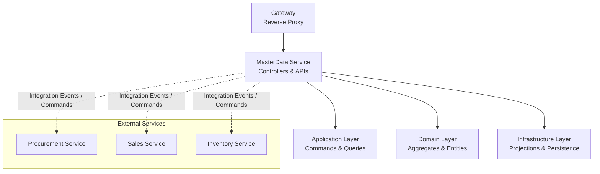
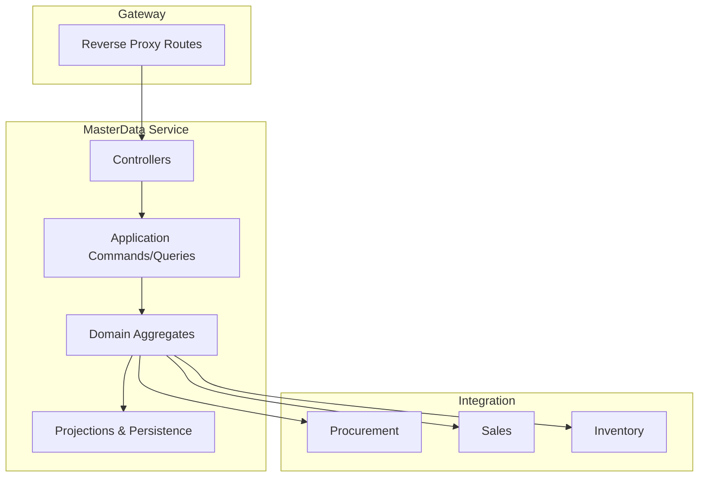
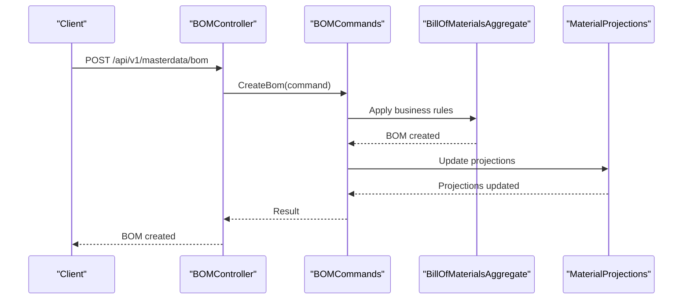
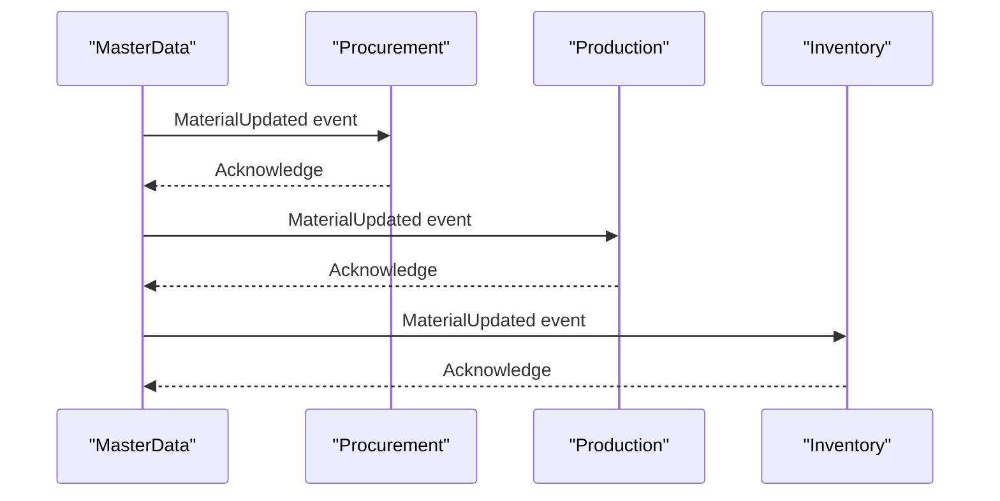
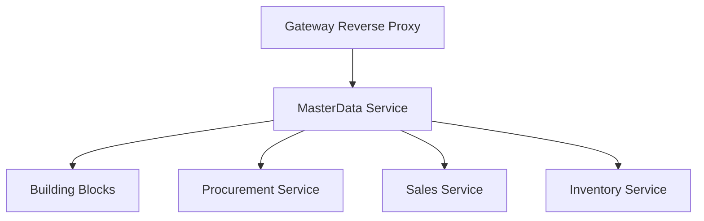

# Material Master Data API

<cite>
**Referenced Files in This Document**
- [ErpSystem.MasterData.csproj](file://src/Services/MasterData/ErpSystem.MasterData/ErpSystem.MasterData.csproj)
- [Program.cs](file://src/Gateways/ErpSystem.Gateway/Program.cs)
- [appsettings.json](file://src/Gateways/ErpSystem.Gateway/appsettings.json)
- [MasterControllers.cs](file://src/Services/MasterData/ErpSystem.MasterData/Controllers/MasterControllers.cs)
- [MaterialAggregate.cs](file://src/Services/MasterData/ErpSystem.MasterData/Domain/MaterialAggregate.cs)
- [CategoryAggregate.cs](file://src/Services/MasterData/ErpSystem.MasterData/Domain/CategoryAggregate.cs)
- [CodeGenerator.cs](file://src/Services/MasterData/ErpSystem.MasterData/Domain/CodeGenerator.cs)
- [MaterialProjections.cs](file://src/Services/MasterData/ErpSystem.MasterData/Infrastructure/MaterialProjections.cs)
- [ReadDbContext.cs](file://src/Services/MasterData/ErpSystem.MasterData/Infrastructure/ReadDbContext.cs)
- [MasterCommands.cs](file://src/Services/MasterData/ErpSystem.MasterData/Application/MasterCommands.cs)
- [BOMController.cs](file://src/Services/MasterData/ErpSystem.MasterData/Controllers/BOMController.cs)
- [BOMCommands.cs](file://src/Services/MasterData/ErpSystem.MasterData/Application/BOMCommands.cs)
- [BillOfMaterialsAggregate.cs](file://src/Services/MasterData/ErpSystem.MasterData/Domain/BillOfMaterialsAggregate.cs)
- [ProcurementController.cs](file://src/Services/Procurement/ErpSystem.Procurement/API/ProcurementController.cs)
- [PurchaseOrderAggregate.cs](file://src/Services/Procurement/ErpSystem.Procurement/Domain/PurchaseOrderAggregate.cs)
- [SalesOrdersController.cs](file://src/Services/Sales/ErpSystem.Sales/API/SalesOrdersController.cs)
- [ShipmentAggregate.cs](file://src/Services/Sales/ErpSystem.Sales/Domain/ShipmentAggregate.cs)
- [InventoryController.cs](file://src/Services/Inventory/ErpSystem.Inventory/API/InventoryController.cs)
- [InventoryItemAggregate.cs](file://src/Services/Inventory/ErpSystem.Inventory/Domain/InventoryItemAggregate.cs)
</cite>

## Table of Contents
1. [Introduction](#introduction)
2. [Project Structure](#project-structure)
3. [Core Components](#core-components)
4. [Architecture Overview](#architecture-overview)
5. [Detailed Component Analysis](#detailed-component-analysis)
6. [Dependency Analysis](#dependency-analysis)
7. [Performance Considerations](#performance-considerations)
8. [Troubleshooting Guide](#troubleshooting-guide)
9. [Conclusion](#conclusion)

## Introduction
This document provides comprehensive API documentation for Material Master Data operations within the ERP microservices ecosystem. It covers CRUD endpoints for materials, including creation with unique material codes, updates, and attribute modifications. It also documents material classification, unit of measure associations, procurement attributes, and sales/purchase configurations. Examples of bulk material imports, material hierarchy management via Bill of Materials, and integrations with procurement and production services are included. The document addresses material validation rules, duplicate detection, and code generation patterns, along with request/response schemas for material creation, updates, and retrieval queries.

## Project Structure
The Material Master Data service is implemented as a dedicated microservice with supporting domain, application, and infrastructure layers. The gateway routes traffic to the master data service under the path prefix `/api/v1/masterdata`. The service exposes controllers for materials and Bill of Materials, with projections and read models for efficient querying.

**Diagram sources**
- [appsettings.json](file://src/Gateways/ErpSystem.Gateway/appsettings.json#L17-L22)
- [ErpSystem.MasterData.csproj](file://src/Services/MasterData/ErpSystem.MasterData/ErpSystem.MasterData.csproj#L1-L25)

**Section sources**
- [appsettings.json](file://src/Gateways/ErpSystem.Gateway/appsettings.json#L1-L229)
- [ErpSystem.MasterData.csproj](file://src/Services/MasterData/ErpSystem.MasterData/ErpSystem.MasterData.csproj#L1-L25)

## Core Components
- MaterialAggregate: Core entity representing a material with attributes such as material code, name, category, unit of measure, procurement attributes, and sales/purchase configurations.
- CategoryAggregate: Defines material categories for classification and grouping.
- CodeGenerator: Generates unique material codes based on configurable patterns.
- MaterialProjections: Read-side projections for efficient querying and filtering of materials.
- MasterCommands: Application commands for creating, updating, and deleting materials.
- BOMController and BOMCommands: Manage material hierarchy and Bill of Materials.
- Integration points: Procurement, Sales, and Inventory services consume or produce events related to materials.

**Section sources**
- [MaterialAggregate.cs](file://src/Services/MasterData/ErpSystem.MasterData/Domain/MaterialAggregate.cs)
- [CategoryAggregate.cs](file://src/Services/MasterData/ErpSystem.MasterData/Domain/CategoryAggregate.cs)
- [CodeGenerator.cs](file://src/Services/MasterData/ErpSystem.MasterData/Domain/CodeGenerator.cs)
- [MaterialProjections.cs](file://src/Services/MasterData/ErpSystem.MasterData/Infrastructure/MaterialProjections.cs)
- [MasterCommands.cs](file://src/Services/MasterData/ErpSystem.MasterData/Application/MasterCommands.cs)
- [BOMController.cs](file://src/Services/MasterData/ErpSystem.MasterData/Controllers/BOMController.cs)
- [BOMCommands.cs](file://src/Services/MasterData/ErpSystem.MasterData/Application/BOMCommands.cs)

## Architecture Overview
The Material Master Data API follows a layered architecture:
- Gateway routes requests to the MasterData service.
- Controllers expose HTTP endpoints for CRUD operations and hierarchy management.
- Application layer handles commands and queries.
- Domain layer encapsulates business logic and validation.
- Infrastructure layer manages projections and persistence.

**Diagram sources**
- [Program.cs](file://src/Gateways/ErpSystem.Gateway/Program.cs#L22-L24)
- [appsettings.json](file://src/Gateways/ErpSystem.Gateway/appsettings.json#L17-L22)

## Detailed Component Analysis

### Material CRUD Endpoints
The Material Master Data service exposes endpoints for creating, retrieving, updating, and deleting materials. The gateway routes these requests under `/api/v1/masterdata`.

- Create Material
  - Endpoint: POST /api/v1/masterdata/materials
  - Purpose: Create a new material with a unique material code and associated attributes.
  - Request body: Material creation payload (see Request Schema below).
  - Response: Created material object with generated identifiers.

- Get Material by ID
  - Endpoint: GET /api/v1/masterdata/materials/{id}
  - Purpose: Retrieve a single material by its identifier.
  - Response: Material object.

- Get Materials with Filters
  - Endpoint: GET /api/v1/masterdata/materials
  - Query parameters: filter criteria supported by the read model (see Retrieval Query Schema below).
  - Response: List of materials matching filters.

- Update Material
  - Endpoint: PUT /api/v1/masterdata/materials/{id}
  - Purpose: Update material attributes such as name, category, unit of measure, procurement attributes, and sales/purchase configurations.
  - Request body: Material update payload (see Response Schema below).
  - Response: Updated material object.

- Delete Material
  - Endpoint: DELETE /api/v1/masterdata/materials/{id}
  - Purpose: Remove a material record.
  - Response: Deletion confirmation.

Validation and Duplicate Detection
- Unique Material Code: The system enforces uniqueness of material codes during creation and updates.
- Validation Rules: Business validations ensure required fields are present and values are within acceptable ranges.
- Duplicate Detection: Attempts to create or update with existing material codes are rejected with appropriate error responses.

Code Generation Patterns
- Automatic Code Generation: The system can generate unique material codes based on configurable patterns.
- Manual Override: Clients may optionally provide a material code; validation ensures uniqueness.

Bulk Import
- Bulk Import Endpoint: POST /api/v1/masterdata/materials/bulk
- Purpose: Import multiple materials in a single request.
- Request body: Array of material creation payloads.
- Response: Import summary with success and failure counts per item.

Integration with Procurement and Production
- Procurement Attributes: Materials carry procurement-related attributes enabling purchase order creation and supplier management.
- Production Attributes: Materials include attributes for production planning and Bill of Materials usage.
- Integration Events: Creation and updates emit integration events consumed by Procurement and Production services.

Request/Response Schemas

- Material Creation Request
  - Fields: materialCode (optional), name, description, categoryId, baseUomId, procurementAttributes, salesAttributes, purchaseConfig, productionConfig
  - Notes: If materialCode is omitted, the system generates a unique code.

- Material Update Request
  - Fields: name, description, categoryId, baseUomId, procurementAttributes, salesAttributes, purchaseConfig, productionConfig

- Material Retrieval Response
  - Fields: id, materialCode, name, description, categoryId, categoryName, baseUomId, baseUomName, procurementAttributes, salesAttributes, purchaseConfig, productionConfig, createdAt, updatedAt

- Bulk Import Request
  - Fields: items (array of creation payloads)

- Bulk Import Response
  - Fields: total, successCount, failures (array of {index, error})

**Section sources**
- [MasterControllers.cs](file://src/Services/MasterData/ErpSystem.MasterData/Controllers/MasterControllers.cs)
- [MasterCommands.cs](file://src/Services/MasterData/ErpSystem.MasterData/Application/MasterCommands.cs)
- [MaterialAggregate.cs](file://src/Services/MasterData/ErpSystem.MasterData/Domain/MaterialAggregate.cs)
- [CodeGenerator.cs](file://src/Services/MasterData/ErpSystem.MasterData/Domain/CodeGenerator.cs)
- [MaterialProjections.cs](file://src/Services/MasterData/ErpSystem.MasterData/Infrastructure/MaterialProjections.cs)

### Material Classification and Categories
- Categories: Materials are classified using CategoryAggregate, enabling hierarchical categorization and filtering.
- Category Management: Categories can be created, updated, and retrieved independently, supporting dynamic classification strategies.

**Section sources**
- [CategoryAggregate.cs](file://src/Services/MasterData/ErpSystem.MasterData/Domain/CategoryAggregate.cs)
- [MasterControllers.cs](file://src/Services/MasterData/ErpSystem.MasterData/Controllers/MasterControllers.cs)

### Unit of Measure Associations
- Base UOM: Each material defines a base unit of measure (baseUomId) for consistent quantity calculations.
- UOM Conversion: The system supports conversions between units for procurement, sales, and inventory transactions.

**Section sources**
- [MaterialAggregate.cs](file://src/Services/MasterData/ErpSystem.MasterData/Domain/MaterialAggregate.cs)

### Procurement Attributes and Purchase Configurations
- Procurement Attributes: Include supplier information, minimum order quantities, lead times, and pricing details.
- Purchase Configurations: Define sourcing rules, preferred suppliers, and purchasing constraints.
- Integration: Procurement service consumes material updates to maintain accurate sourcing data.

**Section sources**
- [MaterialAggregate.cs](file://src/Services/MasterData/ErpSystem.MasterData/Domain/MaterialAggregate.cs)
- [ProcurementController.cs](file://src/Services/Procurement/ErpSystem.Procurement/API/ProcurementController.cs)
- [PurchaseOrderAggregate.cs](file://src/Services/Procurement/ErpSystem.Procurement/Domain/PurchaseOrderAggregate.cs)

### Sales/Purchase Configurations
- Sales Attributes: Include sales units of measure, pricing tiers, and customer-specific configurations.
- Purchase Configurations: Align with procurement attributes for seamless order processing.
- Integration: Sales service uses material configurations for quoting and shipping.

**Section sources**
- [MaterialAggregate.cs](file://src/Services/MasterData/ErpSystem.MasterData/Domain/MaterialAggregate.cs)
- [SalesOrdersController.cs](file://src/Services/Sales/ErpSystem.Sales/API/SalesOrdersController.cs)
- [ShipmentAggregate.cs](file://src/Services/Sales/ErpSystem.Sales/Domain/ShipmentAggregate.cs)

### Material Hierarchy Management (Bill of Materials)
- BOMController: Manages Bill of Materials structures linking parent assemblies to child components.
- BOMCommands: Handles creation, updates, and deletions of BOM entries.
- BillOfMaterialsAggregate: Represents BOM entities with quantities, units, and routing information.

**Diagram sources**
- [BOMController.cs](file://src/Services/MasterData/ErpSystem.MasterData/Controllers/BOMController.cs)
- [BOMCommands.cs](file://src/Services/MasterData/ErpSystem.MasterData/Application/BOMCommands.cs)
- [BillOfMaterialsAggregate.cs](file://src/Services/MasterData/ErpSystem.MasterData/Domain/BillOfMaterialsAggregate.cs)
- [MaterialProjections.cs](file://src/Services/MasterData/ErpSystem.MasterData/Infrastructure/MaterialProjections.cs)

**Section sources**
- [BOMController.cs](file://src/Services/MasterData/ErpSystem.MasterData/Controllers/BOMController.cs)
- [BOMCommands.cs](file://src/Services/MasterData/ErpSystem.MasterData/Application/BOMCommands.cs)
- [BillOfMaterialsAggregate.cs](file://src/Services/MasterData/ErpSystem.MasterData/Domain/BillOfMaterialsAggregate.cs)

### Retrieval Queries and Filtering
- Read Model: MaterialProjections provide optimized read-side models for efficient querying.
- Query Endpoints: GET /api/v1/masterdata/materials supports filtering by category, code range, and other attributes.
- Sorting and Pagination: Responses support sorting and pagination for large datasets.

**Section sources**
- [MaterialProjections.cs](file://src/Services/MasterData/ErpSystem.MasterData/Infrastructure/MaterialProjections.cs)
- [ReadDbContext.cs](file://src/Services/MasterData/ErpSystem.MasterData/Infrastructure/ReadDbContext.cs)
- [MasterControllers.cs](file://src/Services/MasterData/ErpSystem.MasterData/Controllers/MasterControllers.cs)

### Integration with Procurement and Production Services
- Procurement Integration: Material updates trigger sourcing and supplier data synchronization.
- Production Integration: Material configurations feed production planning and BOM consumption.
- Inventory Integration: Material definitions integrate with inventory valuation and stock control.

**Diagram sources**
- [MaterialAggregate.cs](file://src/Services/MasterData/ErpSystem.MasterData/Domain/MaterialAggregate.cs)
- [ProcurementController.cs](file://src/Services/Procurement/ErpSystem.Procurement/API/ProcurementController.cs)
- [SalesOrdersController.cs](file://src/Services/Sales/ErpSystem.Sales/API/SalesOrdersController.cs)
- [InventoryController.cs](file://src/Services/Inventory/ErpSystem.Inventory/API/InventoryController.cs)

## Dependency Analysis
The Material Master Data service depends on the shared building blocks and integrates with other services through events and commands. The gateway configuration routes requests to the master data cluster.

**Diagram sources**
- [appsettings.json](file://src/Gateways/ErpSystem.Gateway/appsettings.json#L114-L128)
- [ErpSystem.MasterData.csproj](file://src/Services/MasterData/ErpSystem.MasterData/ErpSystem.MasterData.csproj#L21-L22)

**Section sources**
- [appsettings.json](file://src/Gateways/ErpSystem.Gateway/appsettings.json#L1-L229)
- [ErpSystem.MasterData.csproj](file://src/Services/MasterData/ErpSystem.MasterData/ErpSystem.MasterData.csproj#L1-L25)

## Performance Considerations
- Read Model Optimization: Projections enable fast reads and filtering for material queries.
- Asynchronous Processing: Integration events are processed asynchronously to avoid blocking primary operations.
- Caching: Consider caching frequently accessed categories and UOM lists to reduce database load.
- Bulk Operations: Use bulk endpoints for importing large sets of materials to minimize round trips.

## Troubleshooting Guide
- Duplicate Material Code: Ensure material codes are unique; attempts to reuse existing codes will fail.
- Validation Errors: Verify required fields and constraints before submitting requests.
- Integration Delays: Monitor integration events to ensure Procurement, Sales, and Inventory services receive updates.
- Gateway Routing: Confirm gateway routes are configured correctly for `/api/v1/masterdata`.

**Section sources**
- [MasterCommands.cs](file://src/Services/MasterData/ErpSystem.MasterData/Application/MasterCommands.cs)
- [MaterialProjections.cs](file://src/Services/MasterData/ErpSystem.MasterData/Infrastructure/MaterialProjections.cs)
- [appsettings.json](file://src/Gateways/ErpSystem.Gateway/appsettings.json#L17-L22)

## Conclusion
The Material Master Data API provides a robust foundation for managing materials across the enterprise. It supports comprehensive CRUD operations, classification, unit of measure associations, procurement and sales configurations, and hierarchical structures via Bill of Materials. Integrations with Procurement, Sales, and Inventory services ensure data consistency across domains. By leveraging projections, asynchronous processing, and bulk operations, the API delivers scalable and efficient material management capabilities.