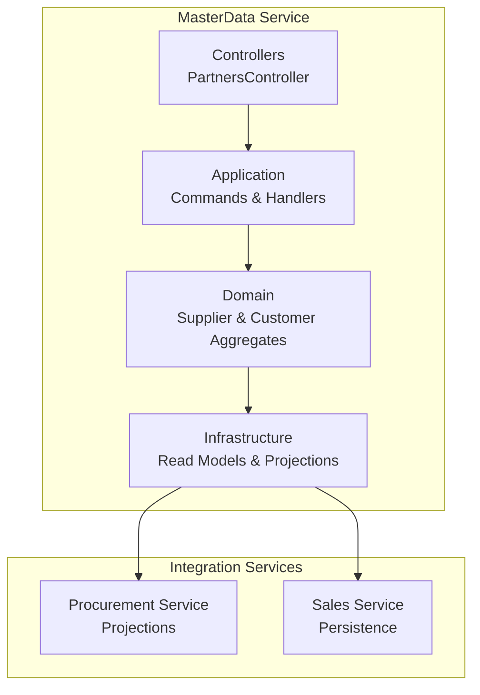
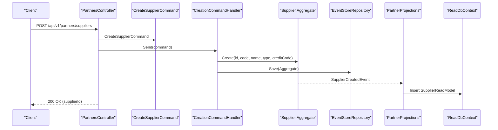
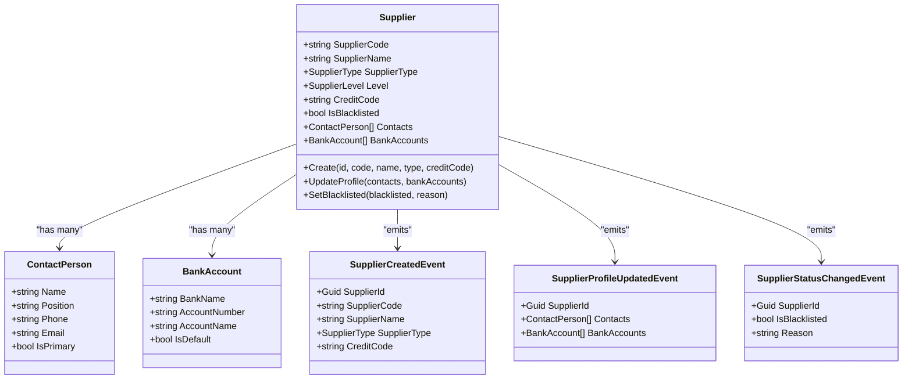
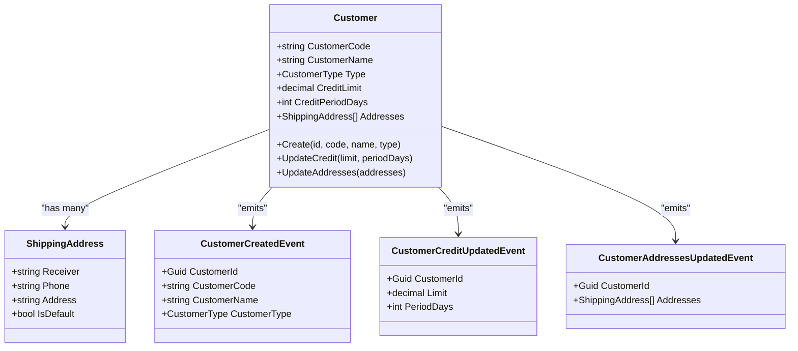
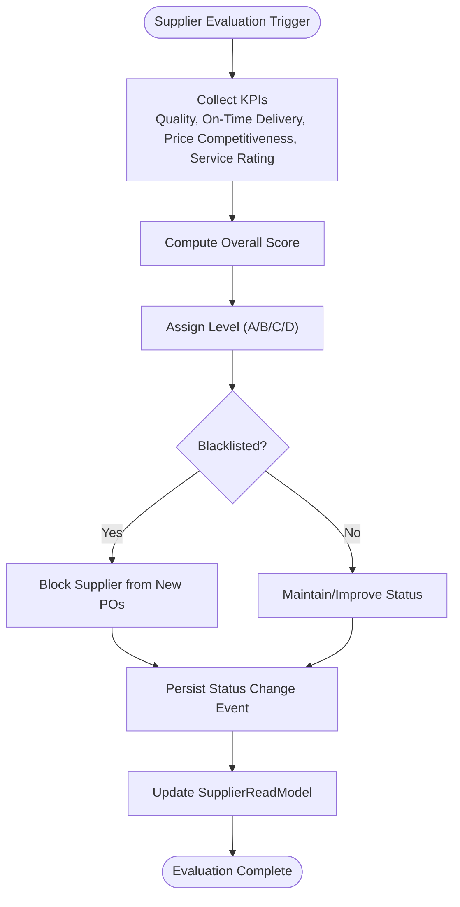
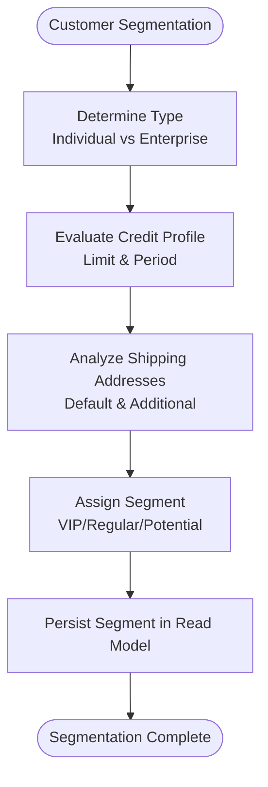
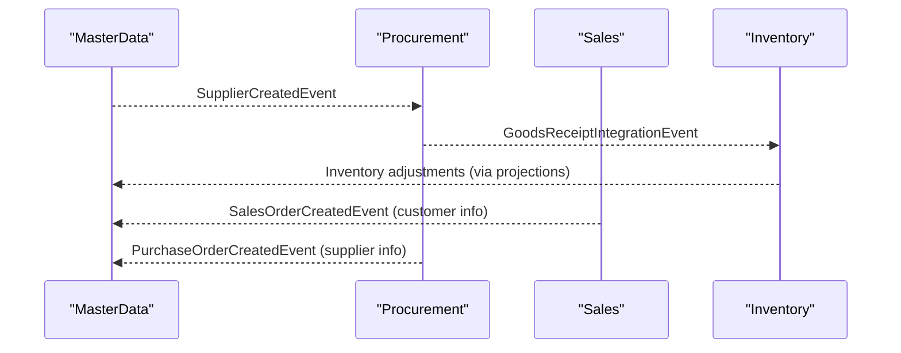
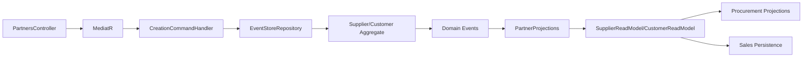

# Partner Master Data API

<cite>
**Referenced Files in This Document**
- [README.md](file://README.md)
- [PRD-01-MasterData-Service.md](file://docs/PRD-01-MasterData-Service.md)
- [MasterControllers.cs](file://src/Services/MasterData/ErpSystem.MasterData/Controllers/MasterControllers.cs)
- [MasterCommands.cs](file://src/Services/MasterData/ErpSystem.MasterData/Application/MasterCommands.cs)
- [CreationHandlers.cs](file://src/Services/MasterData/ErpSystem.MasterData/Application/CreationHandlers.cs)
- [SupplierAggregate.cs](file://src/Services/MasterData/ErpSystem.MasterData/Domain/SupplierAggregate.cs)
- [CustomerAggregate.cs](file://src/Services/MasterData/ErpSystem.MasterData/Domain/CustomerAggregate.cs)
- [PartnerProjections.cs](file://src/Services/MasterData/ErpSystem.MasterData/Infrastructure/PartnerProjections.cs)
- [ReadDbContext.cs](file://src/Services/MasterData/ErpSystem.MasterData/Infrastructure/ReadDbContext.cs)
- [Procurement Projections.cs](file://src/Services/Procurement/ErpSystem.Procurement/Infrastructure/Projections.cs)
- [Sales Persistence.cs](file://src/Services/Sales/ErpSystem.Sales/Infrastructure/Persistence.cs)
</cite>

## Table of Contents
1. [Introduction](#introduction)
2. [Project Structure](#project-structure)
3. [Core Components](#core-components)
4. [Architecture Overview](#architecture-overview)
5. [Detailed Component Analysis](#detailed-component-analysis)
6. [Dependency Analysis](#dependency-analysis)
7. [Performance Considerations](#performance-considerations)
8. [Troubleshooting Guide](#troubleshooting-guide)
9. [Conclusion](#conclusion)
10. [Appendices](#appendices)

## Introduction
This document provides comprehensive API documentation for Partner Master Data, focusing on suppliers and customers management. It covers supplier creation with contact information, payment terms, and supply capabilities; customer registration with billing addresses, pricing tiers, and credit limits; supplier profile updates; customer account management; and partner relationship tracking. It also includes examples of partner search operations, supplier evaluation workflows, and customer segmentation, along with validation rules, tax identification requirements, and integrations with procurement and sales modules.

## Project Structure
The Partner Master Data API resides in the MasterData service and follows a clean architecture with separation of concerns:
- Controllers expose HTTP endpoints for partner operations
- Application layer handles commands and orchestrates domain operations
- Domain aggregates encapsulate business logic and events
- Infrastructure projects read models and projections for efficient querying
- Integration with Procurement and Sales services occurs via domain events

**Diagram sources**
- [MasterControllers.cs](file://src/Services/MasterData/ErpSystem.MasterData/Controllers/MasterControllers.cs#L49-L78)
- [MasterCommands.cs](file://src/Services/MasterData/ErpSystem.MasterData/Application/MasterCommands.cs#L26-L34)
- [SupplierAggregate.cs](file://src/Services/MasterData/ErpSystem.MasterData/Domain/SupplierAggregate.cs#L66-L124)
- [CustomerAggregate.cs](file://src/Services/MasterData/ErpSystem.MasterData/Domain/CustomerAggregate.cs#L46-L95)
- [PartnerProjections.cs](file://src/Services/MasterData/ErpSystem.MasterData/Infrastructure/PartnerProjections.cs#L7-L13)
- [Procurement Projections.cs](file://src/Services/Procurement/ErpSystem.Procurement/Infrastructure/Projections.cs#L66-L101)
- [Sales Persistence.cs](file://src/Services/Sales/ErpSystem.Sales/Infrastructure/Persistence.cs#L34-L43)

**Section sources**
- [README.md](file://README.md#L130-L183)
- [MasterControllers.cs](file://src/Services/MasterData/ErpSystem.MasterData/Controllers/MasterControllers.cs#L1-L79)
- [MasterCommands.cs](file://src/Services/MasterData/ErpSystem.MasterData/Application/MasterCommands.cs#L1-L110)

## Core Components
- PartnersController: Exposes endpoints for supplier and customer operations
- CreateSupplierCommand/CreateCustomerCommand: Creation handlers that initialize aggregates
- Supplier/Customer aggregates: Encapsulate partner business logic and emit domain events
- PartnerProjections: Maintains read models for suppliers and customers
- ReadDbContext: Provides read-side models for querying partners

Key responsibilities:
- Supplier creation with contact and bank account profiles
- Customer creation with shipping addresses and credit information
- Profile updates for suppliers and customer address management
- Projection of domain events into read models for search and display

**Section sources**
- [MasterControllers.cs](file://src/Services/MasterData/ErpSystem.MasterData/Controllers/MasterControllers.cs#L49-L78)
- [CreationHandlers.cs](file://src/Services/MasterData/ErpSystem.MasterData/Application/CreationHandlers.cs#L9-L11)
- [SupplierAggregate.cs](file://src/Services/MasterData/ErpSystem.MasterData/Domain/SupplierAggregate.cs#L66-L124)
- [CustomerAggregate.cs](file://src/Services/MasterData/ErpSystem.MasterData/Domain/CustomerAggregate.cs#L46-L95)
- [PartnerProjections.cs](file://src/Services/MasterData/ErpSystem.MasterData/Infrastructure/PartnerProjections.cs#L7-L79)
- [ReadDbContext.cs](file://src/Services/MasterData/ErpSystem.MasterData/Infrastructure/ReadDbContext.cs#L76-L96)

## Architecture Overview
The Partner Master Data API follows CQRS with Event Sourcing:
- Write model: Controllers accept requests, dispatch commands, and persist domain events
- Read model: Projections transform domain events into read-side models
- Integration: Domain events propagate to Procurement and Sales services for downstream effects

**Diagram sources**
- [MasterControllers.cs](file://src/Services/MasterData/ErpSystem.MasterData/Controllers/MasterControllers.cs#L51-L56)
- [CreationHandlers.cs](file://src/Services/MasterData/ErpSystem.MasterData/Application/CreationHandlers.cs#L9-L11)
- [SupplierAggregate.cs](file://src/Services/MasterData/ErpSystem.MasterData/Domain/SupplierAggregate.cs#L81-L86)
- [PartnerProjections.cs](file://src/Services/MasterData/ErpSystem.MasterData/Infrastructure/PartnerProjections.cs#L15-L24)
- [ReadDbContext.cs](file://src/Services/MasterData/ErpSystem.MasterData/Infrastructure/ReadDbContext.cs#L76-L86)

## Detailed Component Analysis

### Supplier Management API
Endpoints:
- POST /api/v1/partners/suppliers: Create a supplier with basic information and tax code
- PUT /api/v1/partners/suppliers/{id}/profile: Update supplier contact and bank account profiles
- GET /api/v1/partners/suppliers: Retrieve all suppliers (read model)

Supplier domain model:
- Core attributes: supplier code/name/type/level/credit code/blacklisted flag
- Profiles: contacts (primary contact, position, phone, email) and bank accounts (default selection)
- Events: SupplierCreatedEvent, SupplierProfileUpdatedEvent, SupplierStatusChangedEvent, SupplierLevelChangedEvent

**Diagram sources**
- [SupplierAggregate.cs](file://src/Services/MasterData/ErpSystem.MasterData/Domain/SupplierAggregate.cs#L66-L124)

Supplier creation workflow:
- Controller receives CreateSupplierRequest
- Command handler creates Supplier aggregate and persists events
- Projection inserts SupplierReadModel for search and listing

Supplier profile update workflow:
- Controller receives UpdateSupplierProfileCommand
- Command handler loads Supplier, applies profile changes, saves events
- Projection updates SupplierReadModel contacts and bank accounts

**Section sources**
- [MasterControllers.cs](file://src/Services/MasterData/ErpSystem.MasterData/Controllers/MasterControllers.cs#L51-L64)
- [MasterCommands.cs](file://src/Services/MasterData/ErpSystem.MasterData/Application/MasterCommands.cs#L28-L30)
- [SupplierAggregate.cs](file://src/Services/MasterData/ErpSystem.MasterData/Domain/SupplierAggregate.cs#L81-L96)
- [PartnerProjections.cs](file://src/Services/MasterData/ErpSystem.MasterData/Infrastructure/PartnerProjections.cs#L15-L36)

### Customer Management API
Endpoints:
- POST /api/v1/partners/customers: Create a customer with type
- PUT /api/v1/partners/customers/{id}/addresses: Update customer shipping addresses
- GET /api/v1/partners/customers: Retrieve all customers (read model)

Customer domain model:
- Core attributes: customer code/name/type
- Credit: credit limit and credit period days
- Addresses: list of shipping addresses with default selection
- Events: CustomerCreatedEvent, CustomerCreditUpdatedEvent, CustomerAddressesUpdatedEvent

**Diagram sources**
- [CustomerAggregate.cs](file://src/Services/MasterData/ErpSystem.MasterData/Domain/CustomerAggregate.cs#L46-L95)

Customer creation workflow:
- Controller receives CreateCustomerRequest
- Command handler creates Customer aggregate and persists events
- Projection inserts CustomerReadModel for search and listing

Customer address update workflow:
- Controller receives UpdateCustomerAddressesCommand
- Command handler loads Customer, applies address changes, saves events
- Projection updates CustomerReadModel addresses

**Section sources**
- [MasterControllers.cs](file://src/Services/MasterData/ErpSystem.MasterData/Controllers/MasterControllers.cs#L66-L77)
- [MasterCommands.cs](file://src/Services/MasterData/ErpSystem.MasterData/Application/MasterCommands.cs#L32-L34)
- [CustomerAggregate.cs](file://src/Services/MasterData/ErpSystem.MasterData/Domain/CustomerAggregate.cs#L58-L73)
- [PartnerProjections.cs](file://src/Services/MasterData/ErpSystem.MasterData/Infrastructure/PartnerProjections.cs#L48-L78)

### Partner Search Operations
- GET /api/v1/partners/suppliers: Returns SupplierReadModel list
- GET /api/v1/partners/customers: Returns CustomerReadModel list

Read models include:
- SupplierReadModel: SupplierId, SupplierCode, SupplierName, SupplierType, Level, IsBlacklisted, Contacts, BankAccounts
- CustomerReadModel: CustomerId, CustomerCode, CustomerName, Type, CreditLimit, Addresses

These endpoints support partner search and discovery across the system.

**Section sources**
- [MasterControllers.cs](file://src/Services/MasterData/ErpSystem.MasterData/Controllers/MasterControllers.cs#L73-L77)
- [ReadDbContext.cs](file://src/Services/MasterData/ErpSystem.MasterData/Infrastructure/ReadDbContext.cs#L76-L96)

### Supplier Evaluation Workflows
Supplier evaluation is supported by domain events and read model updates:
- SupplierCreatedEvent initializes supplier with default level
- SupplierStatusChangedEvent toggles blacklist status
- SupplierProfileUpdatedEvent updates contact and bank account profiles

Evaluation-related fields in the domain model include:
- SupplierLevel enumeration (A/B/C/D)
- IsBlacklisted flag
- Performance metrics (not shown in current controller but present in domain)

**Diagram sources**
- [SupplierAggregate.cs](file://src/Services/MasterData/ErpSystem.MasterData/Domain/SupplierAggregate.cs#L48-L62)
- [SupplierAggregate.cs](file://src/Services/MasterData/ErpSystem.MasterData/Domain/SupplierAggregate.cs#L93-L96)
- [PartnerProjections.cs](file://src/Services/MasterData/ErpSystem.MasterData/Infrastructure/PartnerProjections.cs#L38-L46)

**Section sources**
- [SupplierAggregate.cs](file://src/Services/MasterData/ErpSystem.MasterData/Domain/SupplierAggregate.cs#L48-L62)
- [SupplierAggregate.cs](file://src/Services/MasterData/ErpSystem.MasterData/Domain/SupplierAggregate.cs#L93-L96)
- [PartnerProjections.cs](file://src/Services/MasterData/ErpSystem.MasterData/Infrastructure/PartnerProjections.cs#L38-L46)

### Customer Segmentation
Segmentation is supported by:
- Customer type (individual or enterprise)
- Credit limit and credit period
- Addresses for billing/shipping segmentation

**Diagram sources**
- [CustomerAggregate.cs](file://src/Services/MasterData/ErpSystem.MasterData/Domain/CustomerAggregate.cs#L38-L42)
- [CustomerAggregate.cs](file://src/Services/MasterData/ErpSystem.MasterData/Domain/CustomerAggregate.cs#L52-L53)
- [CustomerAggregate.cs](file://src/Services/MasterData/ErpSystem.MasterData/Domain/CustomerAggregate.cs#L55-L56)
- [PartnerProjections.cs](file://src/Services/MasterData/ErpSystem.MasterData/Infrastructure/PartnerProjections.cs#L60-L67)

**Section sources**
- [CustomerAggregate.cs](file://src/Services/MasterData/ErpSystem.MasterData/Domain/CustomerAggregate.cs#L38-L42)
- [CustomerAggregate.cs](file://src/Services/MasterData/ErpSystem.MasterData/Domain/CustomerAggregate.cs#L52-L56)
- [PartnerProjections.cs](file://src/Services/MasterData/ErpSystem.MasterData/Infrastructure/PartnerProjections.cs#L60-L78)

### Tax Identification Requirements
- Supplier credit code is captured during supplier creation
- Customer type distinguishes individual vs enterprise, enabling appropriate tax handling

**Section sources**
- [SupplierAggregate.cs](file://src/Services/MasterData/ErpSystem.MasterData/Domain/SupplierAggregate.cs#L70-L71)
- [CustomerAggregate.cs](file://src/Services/MasterData/ErpSystem.MasterData/Domain/CustomerAggregate.cs#L49-L50)

### Integration with Procurement and Sales Modules
- Procurement integration: Goods receipt events trigger inventory stock receipts, indirectly affecting supplier performance tracking
- Sales integration: Order confirmed and shipment created events drive inventory reservations and shipping, impacting customer segmentation and credit utilization

**Diagram sources**
- [PartnerProjections.cs](file://src/Services/MasterData/ErpSystem.MasterData/Infrastructure/PartnerProjections.cs#L15-L24)
- [Procurement Projections.cs](file://src/Services/Procurement/ErpSystem.Procurement/Infrastructure/Projections.cs#L66-L101)
- [Sales Persistence.cs](file://src/Services/Sales/ErpSystem.Sales/Infrastructure/Persistence.cs#L34-L43)

**Section sources**
- [PartnerProjections.cs](file://src/Services/MasterData/ErpSystem.MasterData/Infrastructure/PartnerProjections.cs#L15-L78)
- [Procurement Projections.cs](file://src/Services/Procurement/ErpSystem.Procurement/Infrastructure/Projections.cs#L66-L101)
- [Sales Persistence.cs](file://src/Services/Sales/ErpSystem.Sales/Infrastructure/Persistence.cs#L34-L43)

## Dependency Analysis
- Controllers depend on MediatR for command dispatch
- Command handlers depend on EventStoreRepository for persistence
- Domain aggregates emit events consumed by projections
- Projections update read models for fast querying
- Integration services consume domain events for cross-service coordination

**Diagram sources**
- [MasterControllers.cs](file://src/Services/MasterData/ErpSystem.MasterData/Controllers/MasterControllers.cs#L49-L78)
- [MasterCommands.cs](file://src/Services/MasterData/ErpSystem.MasterData/Application/MasterCommands.cs#L44-L57)
- [CreationHandlers.cs](file://src/Services/MasterData/ErpSystem.MasterData/Application/CreationHandlers.cs#L15-L25)
- [SupplierAggregate.cs](file://src/Services/MasterData/ErpSystem.MasterData/Domain/SupplierAggregate.cs#L66-L124)
- [CustomerAggregate.cs](file://src/Services/MasterData/ErpSystem.MasterData/Domain/CustomerAggregate.cs#L46-L95)
- [PartnerProjections.cs](file://src/Services/MasterData/ErpSystem.MasterData/Infrastructure/PartnerProjections.cs#L7-L13)
- [ReadDbContext.cs](file://src/Services/MasterData/ErpSystem.MasterData/Infrastructure/ReadDbContext.cs#L76-L96)

**Section sources**
- [MasterControllers.cs](file://src/Services/MasterData/ErpSystem.MasterData/Controllers/MasterControllers.cs#L49-L78)
- [MasterCommands.cs](file://src/Services/MasterData/ErpSystem.MasterData/Application/MasterCommands.cs#L44-L57)
- [CreationHandlers.cs](file://src/Services/MasterData/ErpSystem.MasterData/Application/CreationHandlers.cs#L15-L25)
- [PartnerProjections.cs](file://src/Services/MasterData/ErpSystem.MasterData/Infrastructure/PartnerProjections.cs#L7-L13)

## Performance Considerations
- Read models are optimized for querying suppliers and customers
- Domain events enable eventual consistency and scalable projections
- Event sourcing supports audit trails and temporal queries
- Consider indexing SupplierReadModel and CustomerReadModel fields for frequent searches

## Troubleshooting Guide
Common issues and resolutions:
- Supplier creation fails: Verify supplier type and credit code are provided
- Profile update errors: Ensure supplier ID matches command ID and payload is valid
- Customer creation fails: Confirm customer type is set appropriately
- Address update errors: Validate address list structure and defaults
- Integration delays: Check event bus connectivity and outbox processing

**Section sources**
- [MasterControllers.cs](file://src/Services/MasterData/ErpSystem.MasterData/Controllers/MasterControllers.cs#L51-L64)
- [MasterControllers.cs](file://src/Services/MasterData/ErpSystem.MasterData/Controllers/MasterControllers.cs#L66-L77)
- [MasterCommands.cs](file://src/Services/MasterData/ErpSystem.MasterData/Application/MasterCommands.cs#L77-L89)

## Conclusion
The Partner Master Data API provides robust supplier and customer management with clear separation of concerns, event-driven architecture, and seamless integration with procurement and sales modules. The documented endpoints, domain models, and workflows enable comprehensive partner lifecycle management, evaluation, and segmentation while maintaining data integrity and scalability.

## Appendices

### API Reference Summary
- POST /api/v1/partners/suppliers: Create supplier
- PUT /api/v1/partners/suppliers/{id}/profile: Update supplier profile
- POST /api/v1/partners/customers: Create customer
- PUT /api/v1/partners/customers/{id}/addresses: Update customer addresses
- GET /api/v1/partners/suppliers: List suppliers
- GET /api/v1/partners/customers: List customers

**Section sources**
- [MasterControllers.cs](file://src/Services/MasterData/ErpSystem.MasterData/Controllers/MasterControllers.cs#L51-L77)