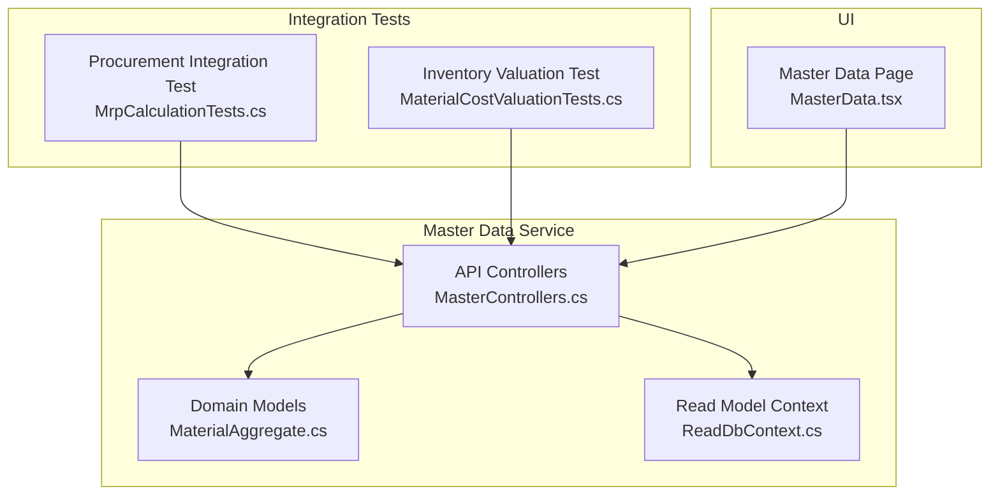
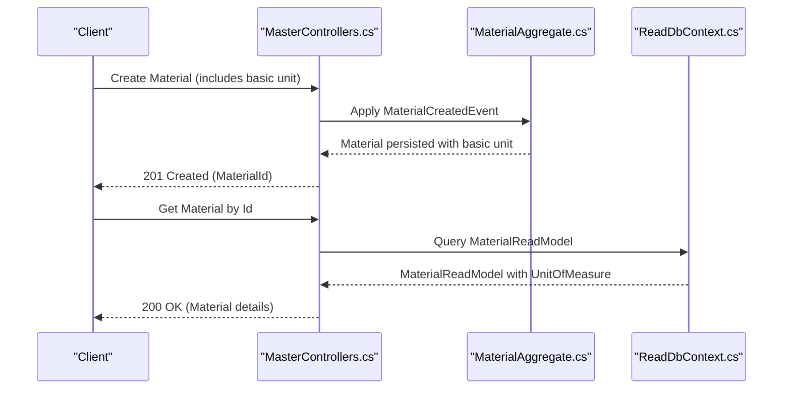
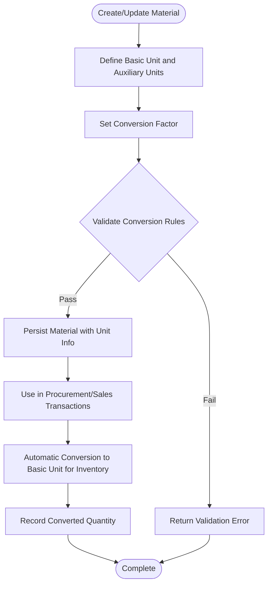
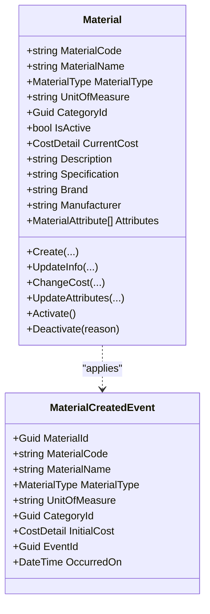
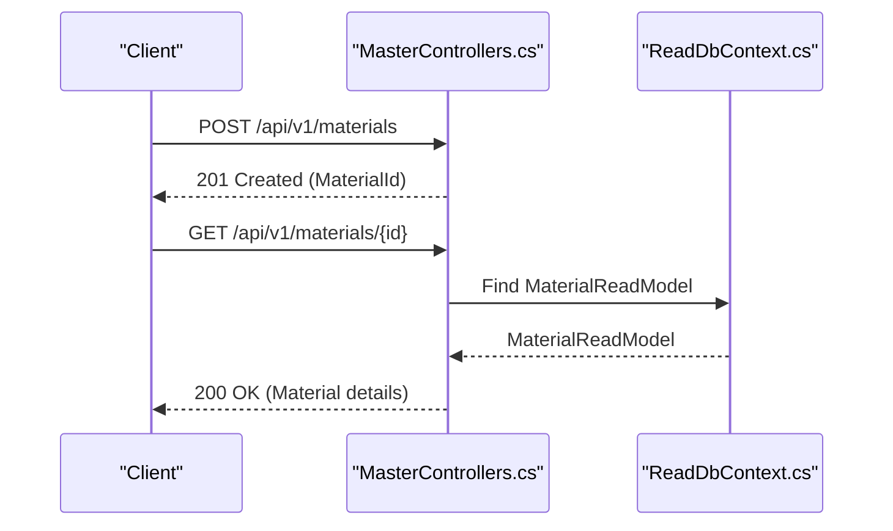
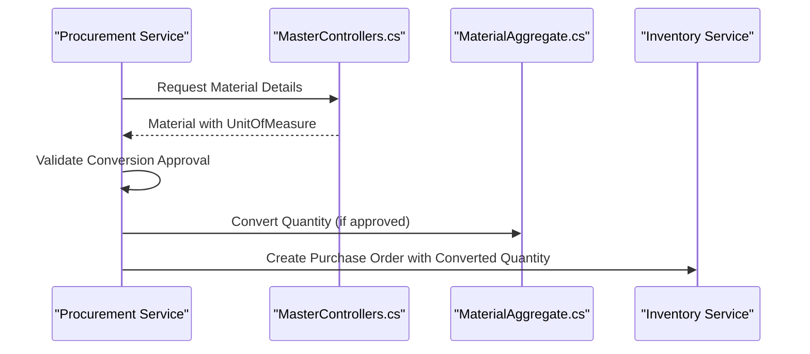
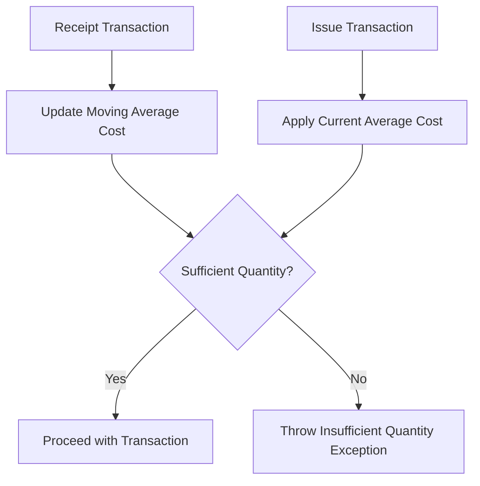
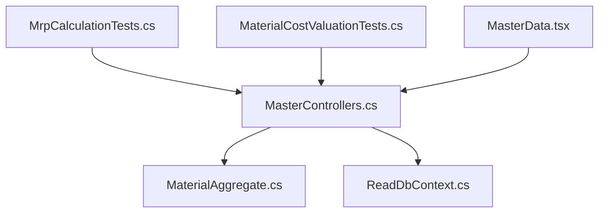

# Unit of Measure API

<cite>
**Referenced Files in This Document**
- [PRD-01-MasterData-Service.md](file://docs/PRD-01-MasterData-Service.md)
- [MasterControllers.cs](file://src/Services/MasterData/ErpSystem.MasterData/Controllers/MasterControllers.cs)
- [MaterialAggregate.cs](file://src/Services/MasterData/ErpSystem.MasterData/Domain/MaterialAggregate.cs)
- [ReadDbContext.cs](file://src/Services/MasterData/ErpSystem.MasterData/Infrastructure/ReadDbContext.cs)
- [MaterialCostValuationTests.cs](file://src/tests/ErpSystem.IntegrationTests/Finance/MaterialCostValuationTests.cs)
- [MrpCalculationTests.cs](file://src/tests/ErpSystem.IntegrationTests/Mrp/MrpCalculationTests.cs)
- [MasterData.tsx](file://src/Web/ErpSystem.Web/src/pages/MasterData.tsx)
</cite>

## Table of Contents
1. [Introduction](#introduction)
2. [Project Structure](#project-structure)
3. [Core Components](#core-components)
4. [Architecture Overview](#architecture-overview)
5. [Detailed Component Analysis](#detailed-component-analysis)
6. [Dependency Analysis](#dependency-analysis)
7. [Performance Considerations](#performance-considerations)
8. [Troubleshooting Guide](#troubleshooting-guide)
9. [Conclusion](#conclusion)

## Introduction
This document provides comprehensive API documentation for Unit of Measure (UoM) management within the ERP system. It covers UoM definition, conversion rules, base unit relationships, precision handling, validation and dimensional consistency, international standards alignment, localization considerations, rounding strategies, and integration with procurement and sales transactions. The content is derived from the Master Data Service PRD and the actual implementation in the codebase.

## Project Structure
The UoM management functionality is primarily defined in the Master Data Service and reflected in supporting components:
- Product Requirements Definition (PRD) documents the functional specifications for UoM conversion and management.
- The Master Data API exposes CRUD endpoints for materials, including the basic unit field used for inventory.
- Domain models define the material entity and its basic unit property.
- Read models and projections support querying materials with unit information.
- Integration tests demonstrate usage patterns and validation rules in procurement and inventory contexts.

**Diagram sources**
- [MasterControllers.cs](file://src/Services/MasterData/ErpSystem.MasterData/Controllers/MasterControllers.cs#L1-L79)
- [MaterialAggregate.cs](file://src/Services/MasterData/ErpSystem.MasterData/Domain/MaterialAggregate.cs#L84-L178)
- [ReadDbContext.cs](file://src/Services/MasterData/ErpSystem.MasterData/Infrastructure/ReadDbContext.cs#L1-L36)
- [MrpCalculationTests.cs](file://src/tests/ErpSystem.IntegrationTests/Mrp/MrpCalculationTests.cs#L121-L160)
- [MaterialCostValuationTests.cs](file://src/tests/ErpSystem.IntegrationTests/Finance/MaterialCostValuationTests.cs#L1-L109)
- [MasterData.tsx](file://src/Web/ErpSystem.Web/src/pages/MasterData.tsx#L121-L141)

**Section sources**
- [PRD-01-MasterData-Service.md](file://docs/PRD-01-MasterData-Service.md#L155-L171)
- [MasterControllers.cs](file://src/Services/MasterData/ErpSystem.MasterData/Controllers/MasterControllers.cs#L1-L79)
- [MaterialAggregate.cs](file://src/Services/MasterData/ErpSystem.MasterData/Domain/MaterialAggregate.cs#L84-L178)
- [ReadDbContext.cs](file://src/Services/MasterData/ErpSystem.MasterData/Infrastructure/ReadDbContext.cs#L1-L36)
- [MasterData.tsx](file://src/Web/ErpSystem.Web/src/pages/MasterData.tsx#L121-L141)

## Core Components
- Unit of Measure Conversion (PRD-defined):
  - Basic unit vs. auxiliary units
  - Conversion relationship configuration
  - Dynamic conversion rates
  - Business rules: inventory uses basic unit; procurement/sales may use auxiliary units; automatic conversion and recording; precision loss control
- Material Entity:
  - Contains the basic unit property used for inventory accounting
- API Endpoints:
  - Create, update, and query materials via the Master Data API
- Read Model:
  - Provides material read models with unit information for queries
- Integration Tests:
  - Demonstrate conversion usage in procurement suggestions and inventory valuation workflows

**Section sources**
- [PRD-01-MasterData-Service.md](file://docs/PRD-01-MasterData-Service.md#L155-L171)
- [MaterialAggregate.cs](file://src/Services/MasterData/ErpSystem.MasterData/Domain/MaterialAggregate.cs#L84-L178)
- [MasterControllers.cs](file://src/Services/MasterData/ErpSystem.MasterData/Controllers/MasterControllers.cs#L13-L44)
- [ReadDbContext.cs](file://src/Services/MasterData/ErpSystem.MasterData/Infrastructure/ReadDbContext.cs#L15-L36)
- [MrpCalculationTests.cs](file://src/tests/ErpSystem.IntegrationTests/Mrp/MrpCalculationTests.cs#L121-L160)
- [MaterialCostValuationTests.cs](file://src/tests/ErpSystem.IntegrationTests/Finance/MaterialCostValuationTests.cs#L1-L109)

## Architecture Overview
The UoM management architecture centers on the Master Data Service:
- API layer exposes material management endpoints
- Domain layer defines the material aggregate and its basic unit
- Read model layer supports efficient querying of materials with unit data
- Integration tests validate conversion behavior in procurement and inventory contexts

**Diagram sources**
- [MasterControllers.cs](file://src/Services/MasterData/ErpSystem.MasterData/Controllers/MasterControllers.cs#L13-L28)
- [MaterialAggregate.cs](file://src/Services/MasterData/ErpSystem.MasterData/Domain/MaterialAggregate.cs#L102-L114)
- [ReadDbContext.cs](file://src/Services/MasterData/ErpSystem.MasterData/Infrastructure/ReadDbContext.cs#L15-L22)

## Detailed Component Analysis

### Unit of Measure Conversion API
- Purpose: Define and manage unit conversion relationships for materials, ensuring inventory uses basic units while procurement and sales can use auxiliary units.
- Key Concepts:
  - Basic unit: primary unit for inventory accounting
  - Auxiliary units: alternative units for procurement/sales
  - Conversion factor: ratio between basic and auxiliary units
  - Dynamic conversion rate: per-instance conversion (e.g., roll length)
- Business Rules:
  - Inventory management uses basic unit
  - Procurement/Sales may use auxiliary units
  - Automatic conversion and recording
  - Precision loss control

**Diagram sources**
- [PRD-01-MasterData-Service.md](file://docs/PRD-01-MasterData-Service.md#L155-L171)

**Section sources**
- [PRD-01-MasterData-Service.md](file://docs/PRD-01-MasterData-Service.md#L155-L171)

### Material Entity and Basic Unit
- The material aggregate stores the basic unit used for inventory.
- Domain events capture creation and updates, including the basic unit.

**Diagram sources**
- [MaterialAggregate.cs](file://src/Services/MasterData/ErpSystem.MasterData/Domain/MaterialAggregate.cs#L84-L178)

**Section sources**
- [MaterialAggregate.cs](file://src/Services/MasterData/ErpSystem.MasterData/Domain/MaterialAggregate.cs#L84-L178)

### API Endpoints for Materials
- Create Material: Accepts material details including basic unit and returns the created identifier.
- Get Material by Id: Returns material details including the basic unit.
- Update Material Info/Attributes: Updates material information and attributes.

**Diagram sources**
- [MasterControllers.cs](file://src/Services/MasterData/ErpSystem.MasterData/Controllers/MasterControllers.cs#L13-L28)
- [ReadDbContext.cs](file://src/Services/MasterData/ErpSystem.MasterData/Infrastructure/ReadDbContext.cs#L15-L22)

**Section sources**
- [MasterControllers.cs](file://src/Services/MasterData/ErpSystem.MasterData/Controllers/MasterControllers.cs#L13-L44)
- [ReadDbContext.cs](file://src/Services/MasterData/ErpSystem.MasterData/Infrastructure/ReadDbContext.cs#L15-L22)

### Integration with Procurement and Sales
- Procurement Integration:
  - Procurement suggestions rely on approved conversions; attempting conversion without approval raises an exception.
- Sales Integration:
  - Sales orders and shipments reference materials; inventory valuation uses the basic unit for cost calculations.

**Diagram sources**
- [MrpCalculationTests.cs](file://src/tests/ErpSystem.IntegrationTests/Mrp/MrpCalculationTests.cs#L121-L160)

**Section sources**
- [MrpCalculationTests.cs](file://src/tests/ErpSystem.IntegrationTests/Mrp/MrpCalculationTests.cs#L121-L160)

### Inventory Valuation and Precision Handling
- Inventory valuation uses the basic unit for cost calculations.
- Moving average cost maintains precision during receipts and issues.
- Insufficient quantity triggers exceptions to prevent negative inventory.

**Diagram sources**
- [MaterialCostValuationTests.cs](file://src/tests/ErpSystem.IntegrationTests/Finance/MaterialCostValuationTests.cs#L11-L109)

**Section sources**
- [MaterialCostValuationTests.cs](file://src/tests/ErpSystem.IntegrationTests/Finance/MaterialCostValuationTests.cs#L11-L109)

### UI Representation of Base Unit
- The Master Data UI displays materials and their base units, confirming the presence of unit information in the read model.

**Section sources**
- [MasterData.tsx](file://src/Web/ErpSystem.Web/src/pages/MasterData.tsx#L121-L141)

## Dependency Analysis
- API depends on domain models and read models for material data.
- Integration tests depend on API and domain behaviors to validate conversion and valuation logic.
- UI depends on API for displaying material base units.

**Diagram sources**
- [MasterControllers.cs](file://src/Services/MasterData/ErpSystem.MasterData/Controllers/MasterControllers.cs#L1-L79)
- [MaterialAggregate.cs](file://src/Services/MasterData/ErpSystem.MasterData/Domain/MaterialAggregate.cs#L84-L178)
- [ReadDbContext.cs](file://src/Services/MasterData/ErpSystem.MasterData/Infrastructure/ReadDbContext.cs#L1-L36)
- [MrpCalculationTests.cs](file://src/tests/ErpSystem.IntegrationTests/Mrp/MrpCalculationTests.cs#L121-L160)
- [MaterialCostValuationTests.cs](file://src/tests/ErpSystem.IntegrationTests/Finance/MaterialCostValuationTests.cs#L1-L109)
- [MasterData.tsx](file://src/Web/ErpSystem.Web/src/pages/MasterData.tsx#L121-L141)

**Section sources**
- [MasterControllers.cs](file://src/Services/MasterData/ErpSystem.MasterData/Controllers/MasterControllers.cs#L1-L79)
- [MaterialAggregate.cs](file://src/Services/MasterData/ErpSystem.MasterData/Domain/MaterialAggregate.cs#L84-L178)
- [ReadDbContext.cs](file://src/Services/MasterData/ErpSystem.MasterData/Infrastructure/ReadDbContext.cs#L1-L36)
- [MrpCalculationTests.cs](file://src/tests/ErpSystem.IntegrationTests/Mrp/MrpCalculationTests.cs#L121-L160)
- [MaterialCostValuationTests.cs](file://src/tests/ErpSystem.IntegrationTests/Finance/MaterialCostValuationTests.cs#L1-L109)
- [MasterData.tsx](file://src/Web/ErpSystem.Web/src/pages/MasterData.tsx#L121-L141)

## Performance Considerations
- API response times for material queries should remain under 200 ms as per non-functional requirements.
- The read model context uses JSONB for attributes and cost details to optimize storage and retrieval.
- Ensure indexing on frequently queried fields (e.g., material code, category) to maintain performance at scale.

[No sources needed since this section provides general guidance]

## Troubleshooting Guide
- Conversion Approval Required:
  - Attempting to mark a procurement suggestion as converted without prior approval will fail with an exception indicating approval is required.
- Insufficient Quantity:
  - Inventory issue operations throw exceptions when requested quantities exceed available balances.
- Precision Loss:
  - Business rules specify precision loss control during unit conversions; ensure conversion factors and rounding align with documented rules.

**Section sources**
- [MrpCalculationTests.cs](file://src/tests/ErpSystem.IntegrationTests/Mrp/MrpCalculationTests.cs#L121-L160)
- [MaterialCostValuationTests.cs](file://src/tests/ErpSystem.IntegrationTests/Finance/MaterialCostValuationTests.cs#L67-L85)
- [PRD-01-MasterData-Service.md](file://docs/PRD-01-MasterData-Service.md#L155-L171)

## Conclusion
The Unit of Measure management in the Master Data Service provides a robust foundation for defining basic and auxiliary units, configuring conversion relationships, and enforcing business rules around inventory accounting and transaction processing. The API, domain models, read models, and integration tests collectively ensure accurate conversion handling, dimensional consistency, and compliance with operational requirements. Extending support for dynamic conversion rates and advanced rounding strategies can further enhance precision and usability across procurement and sales workflows.