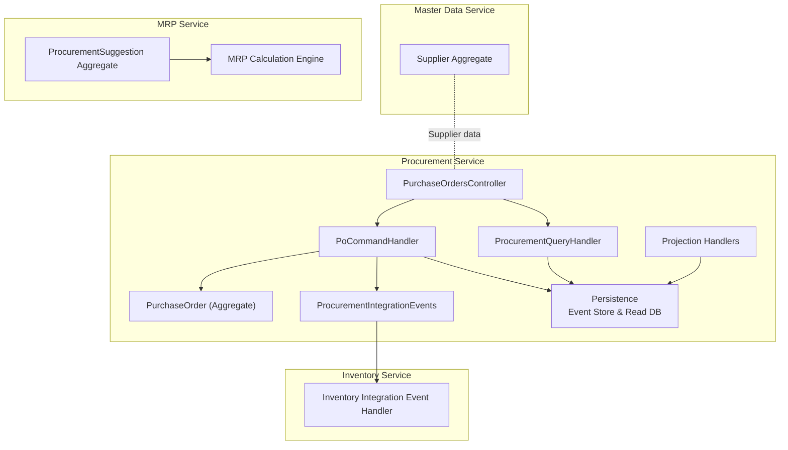
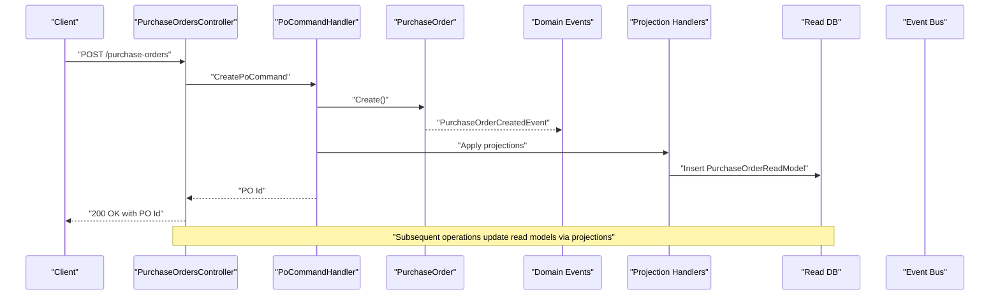
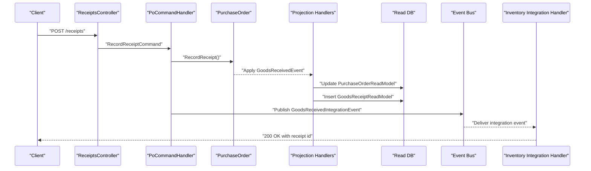
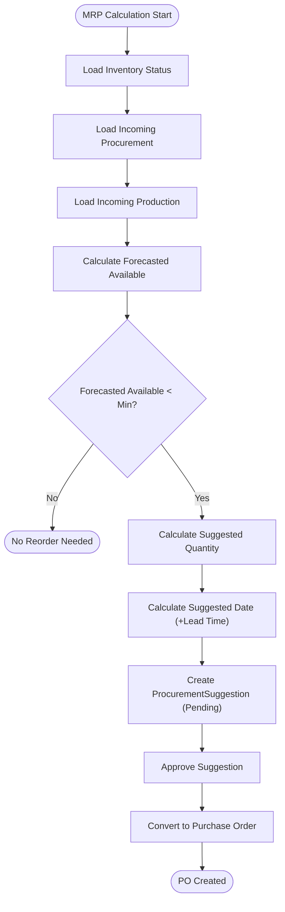
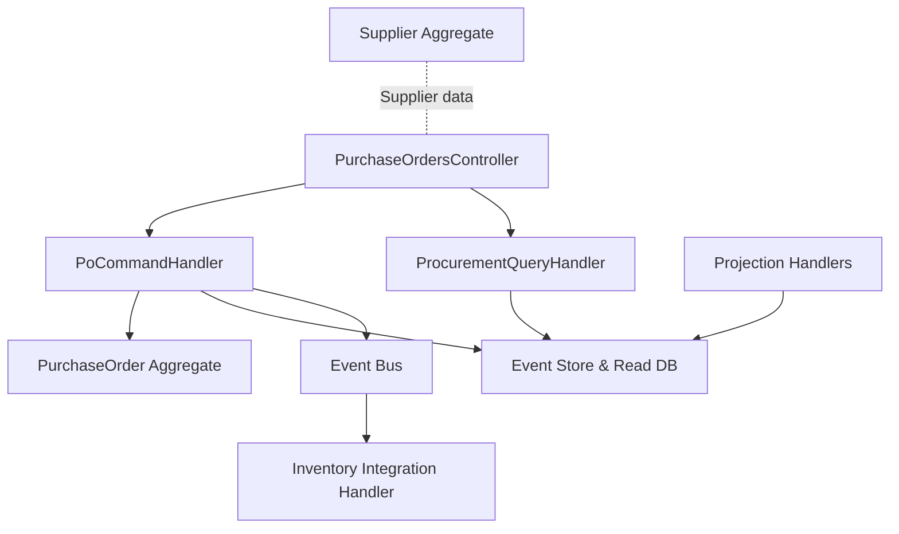
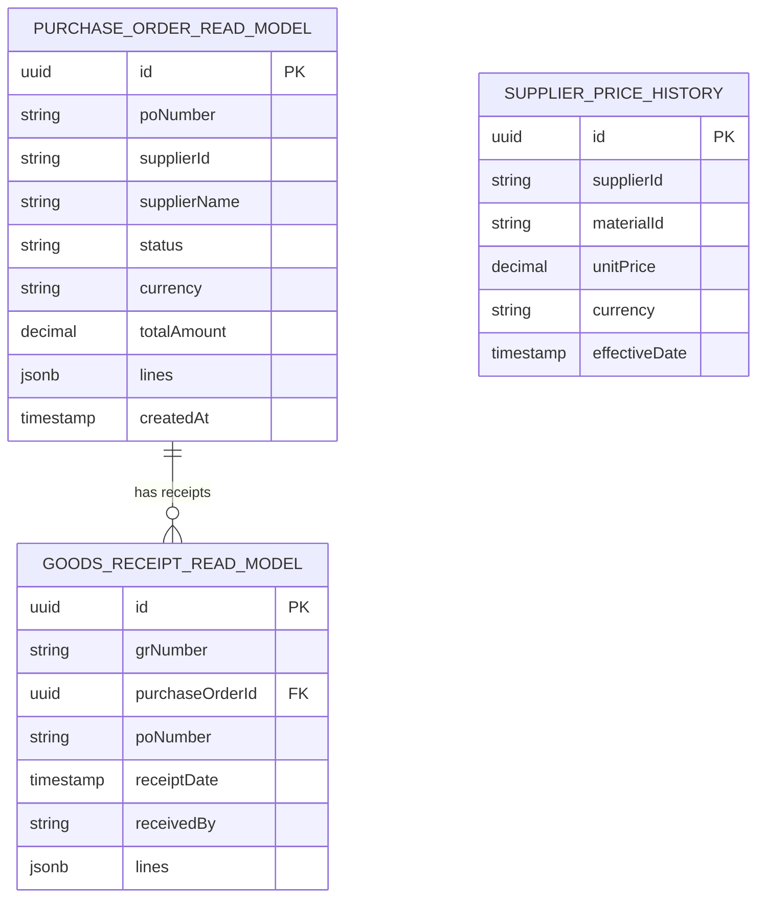

# Procurement Service API

<cite>
**Referenced Files in This Document**
- [ProcurementController.cs](file://src/Services/Procurement/ErpSystem.Procurement/API/ProcurementController.cs)
- [PurchaseOrderCommands.cs](file://src/Services/Procurement/ErpSystem.Procurement/Application/PurchaseOrderCommands.cs)
- [ProcurementQueries.cs](file://src/Services/Procurement/ErpSystem.Procurement/Application/ProcurementQueries.cs)
- [PurchaseOrderAggregate.cs](file://src/Services/Procurement/ErpSystem.Procurement/Domain/PurchaseOrderAggregate.cs)
- [ProcurementEvents.cs](file://src/Services/Procurement/ErpSystem.Procurement/Domain/ProcurementEvents.cs)
- [Persistence.cs](file://src/Services/Procurement/ErpSystem.Procurement/Infrastructure/Persistence.cs)
- [Projections.cs](file://src/Services/Procurement/ErpSystem.Procurement/Infrastructure/Projections.cs)
- [Program.cs](file://src/Services/Procurement/ErpSystem.Procurement/Program.cs)
- [SupplierAggregate.cs](file://src/Services/MasterData/ErpSystem.MasterData/Domain/SupplierAggregate.cs)
- [ProcurementSuggestionAggregate.cs](file://src/Services/Mrp/ErpSystem.Mrp/Domain/ProcurementSuggestionAggregate.cs)
- [MrpCalculationEngine.cs](file://src/Services/Mrp/ErpSystem.Mrp/Application/MrpCalculationEngine.cs)
- [ProcurementToInventoryTests.cs](file://src/Tests/ErpSystem.IntegrationTests/ProcurementToInventoryTests.cs)
- [IntegrationEventHandlers.cs](file://src/Services/Inventory/ErpSystem.Inventory/Application/IntegrationEventHandlers.cs)
- [PRD-01-MasterData-Service.md](file://docs/PRD-01-MasterData-Service.md)
</cite>

## Table of Contents
1. [Introduction](#introduction)
2. [Project Structure](#project-structure)
3. [Core Components](#core-components)
4. [Architecture Overview](#architecture-overview)
5. [Detailed Component Analysis](#detailed-component-analysis)
6. [Dependency Analysis](#dependency-analysis)
7. [Performance Considerations](#performance-considerations)
8. [Troubleshooting Guide](#troubleshooting-guide)
9. [Conclusion](#conclusion)
10. [Appendices](#appendices)

## Introduction
This document provides comprehensive API documentation for the Procurement service, focusing on purchase order management, vendor collaboration, and procurement workflows. It covers purchase requisition processing, supplier selection, purchase order creation and modification, goods receipt procedures, and invoice matching. It also documents supplier performance tracking, spend analysis, and procurement analytics endpoints, along with integrations to supplier portals, e-procurement systems, and automated reorder processes. Examples of approval workflows, budget checking, and compliance validation are included, alongside supplier onboarding, qualification processes, and risk assessment APIs.

## Project Structure
The Procurement service is implemented as a microservice using CQRS and event sourcing. It exposes REST endpoints for purchase order lifecycle management and integrates with inventory via integration events. Supporting services include Master Data for supplier master data and MRP for automated reorder suggestions.

**Diagram sources**
- [ProcurementController.cs](file://src/Services/Procurement/ErpSystem.Procurement/API/ProcurementController.cs#L1-L62)
- [PurchaseOrderCommands.cs](file://src/Services/Procurement/ErpSystem.Procurement/Application/PurchaseOrderCommands.cs#L27-L117)
- [ProcurementQueries.cs](file://src/Services/Procurement/ErpSystem.Procurement/Application/ProcurementQueries.cs#L13-L44)
- [PurchaseOrderAggregate.cs](file://src/Services/Procurement/ErpSystem.Procurement/Domain/PurchaseOrderAggregate.cs#L85-L199)
- [ProcurementEvents.cs](file://src/Services/Procurement/ErpSystem.Procurement/Domain/ProcurementEvents.cs#L5-L21)
- [Persistence.cs](file://src/Services/Procurement/ErpSystem.Procurement/Infrastructure/Persistence.cs#L6-L66)
- [Projections.cs](file://src/Services/Procurement/ErpSystem.Procurement/Infrastructure/Projections.cs#L7-L118)
- [SupplierAggregate.cs](file://src/Services/MasterData/ErpSystem.MasterData/Domain/SupplierAggregate.cs#L66-L125)
- [ProcurementSuggestionAggregate.cs](file://src/Services/Mrp/ErpSystem.Mrp/Domain/ProcurementSuggestionAggregate.cs#L8-L102)
- [MrpCalculationEngine.cs](file://src/Services/Mrp/ErpSystem.Mrp/Application/MrpCalculationEngine.cs#L9-L160)
- [IntegrationEventHandlers.cs](file://src/Services/Inventory/ErpSystem.Inventory/Application/IntegrationEventHandlers.cs#L14-L32)

**Section sources**
- [Program.cs](file://src/Services/Procurement/ErpSystem.Procurement/Program.cs#L11-L72)
- [ProcurementController.cs](file://src/Services/Procurement/ErpSystem.Procurement/API/ProcurementController.cs#L1-L62)

## Core Components
- Purchase Orders Controller: Exposes endpoints for creating, searching, retrieving, updating, and closing purchase orders, plus price history lookup.
- Purchase Order Commands: Handles purchase order lifecycle commands (create, submit, approve, send, record receipt, close, cancel).
- Purchase Order Queries: Provides read-side queries for purchase order search, retrieval, and supplier price history.
- Purchase Order Aggregate: Defines purchase order state transitions, validation rules, and domain events.
- Integration Events: Publishes goods receipt events consumed by inventory.
- Persistence: Event store for domain events and read database for projections.
- Projection Handlers: Update read models for purchase orders, receipts, and price history.
- Supplier Aggregate: Maintains supplier profile, contact persons, bank accounts, level, blacklist status.
- Procurement Suggestion Aggregate and MRP Engine: Generates automated reorder suggestions and converts them to purchase orders.

**Section sources**
- [ProcurementController.cs](file://src/Services/Procurement/ErpSystem.Procurement/API/ProcurementController.cs#L7-L62)
- [PurchaseOrderCommands.cs](file://src/Services/Procurement/ErpSystem.Procurement/Application/PurchaseOrderCommands.cs#L8-L117)
- [ProcurementQueries.cs](file://src/Services/Procurement/ErpSystem.Procurement/Application/ProcurementQueries.cs#L7-L44)
- [PurchaseOrderAggregate.cs](file://src/Services/Procurement/ErpSystem.Procurement/Domain/PurchaseOrderAggregate.cs#L5-L199)
- [ProcurementEvents.cs](file://src/Services/Procurement/ErpSystem.Procurement/Domain/ProcurementEvents.cs#L5-L21)
- [Persistence.cs](file://src/Services/Procurement/ErpSystem.Procurement/Infrastructure/Persistence.cs#L6-L66)
- [Projections.cs](file://src/Services/Procurement/ErpSystem.Procurement/Infrastructure/Projections.cs#L7-L118)
- [SupplierAggregate.cs](file://src/Services/MasterData/ErpSystem.MasterData/Domain/SupplierAggregate.cs#L66-L125)
- [ProcurementSuggestionAggregate.cs](file://src/Services/Mrp/ErpSystem.Mrp/Domain/ProcurementSuggestionAggregate.cs#L8-L102)
- [MrpCalculationEngine.cs](file://src/Services/Mrp/ErpSystem.Mrp/Application/MrpCalculationEngine.cs#L9-L160)

## Architecture Overview
The Procurement service follows CQRS with event sourcing. Commands mutate the domain aggregate and publish domain events. Projection handlers update read models for efficient querying. Integration events decouple inventory from procurement.

**Diagram sources**
- [ProcurementController.cs](file://src/Services/Procurement/ErpSystem.Procurement/API/ProcurementController.cs#L11-L12)
- [PurchaseOrderCommands.cs](file://src/Services/Procurement/ErpSystem.Procurement/Application/PurchaseOrderCommands.cs#L36-L43)
- [PurchaseOrderAggregate.cs](file://src/Services/Procurement/ErpSystem.Procurement/Domain/PurchaseOrderAggregate.cs#L95-L107)
- [Projections.cs](file://src/Services/Procurement/ErpSystem.Procurement/Infrastructure/Projections.cs#L16-L32)
- [Persistence.cs](file://src/Services/Procurement/ErpSystem.Procurement/Infrastructure/Persistence.cs#L20-L31)

## Detailed Component Analysis

### Purchase Order Management API
Endpoints for purchase order lifecycle management:
- POST /api/v1/procurement/purchase-orders: Create a purchase order
- GET /api/v1/procurement/purchase-orders: Search purchase orders by supplier and status
- GET /api/v1/procurement/purchase-orders/{id}: Retrieve a purchase order by ID
- POST /api/v1/procurement/purchase-orders/{id}/submit: Submit a draft purchase order
- POST /api/v1/procurement/purchase-orders/{id}/approve: Approve a purchase order
- POST /api/v1/procurement/purchase-orders/{id}/send: Send a purchase order to supplier
- POST /api/v1/procurement/purchase-orders/{id}/close: Close a purchase order
- POST /api/v1/procurement/purchase-orders/{id}/cancel: Cancel a purchase order
- GET /api/v1/procurement/purchase-orders/prices: Get supplier price history for a material

Request/response examples (paths only):
- Create purchase order: [CreatePoCommand](file://src/Services/Procurement/ErpSystem.Procurement/Application/PurchaseOrderCommands.cs#L8-L13)
- Approve purchase order: [ApprovePoCommand](file://src/Services/Procurement/ErpSystem.Procurement/Application/PurchaseOrderCommands.cs#L17-L17), [ApproveRequest](file://src/Services/Procurement/ErpSystem.Procurement/API/ProcurementController.cs#L51-L51)
- Record goods receipt: [RecordReceiptCommand](file://src/Services/Procurement/ErpSystem.Procurement/Application/PurchaseOrderCommands.cs#L21-L21), [ReceiptsController](file://src/Services/Procurement/ErpSystem.Procurement/API/ProcurementController.cs#L57-L61)

Purchase order status transitions:
- Draft → PendingApproval (submit)
- PendingApproval → Approved (approve)
- Approved → SentToSupplier (send)
- SentToSupplier/PartiallyReceived → PartiallyReceived/FullyReceived (record receipt)
- Closed (manual close)
- Cancelled (cancel with validation)

Validation rules:
- Submit: Only Draft PO can be submitted
- Approve: Only PendingApproval PO can be approved
- Send: Only Approved PO can be sent
- Record receipt: PO must be in SentToSupplier or PartiallyReceived; receipt lines must match PO line numbers
- Cancel: PO must be in Draft/PendingApproval/Approved and no goods received

Integration event publishing:
- Goods receipt triggers a GoodsReceivedIntegrationEvent published to the event bus, consumed by inventory.

**Section sources**
- [ProcurementController.cs](file://src/Services/Procurement/ErpSystem.Procurement/API/ProcurementController.cs#L7-L62)
- [PurchaseOrderCommands.cs](file://src/Services/Procurement/ErpSystem.Procurement/Application/PurchaseOrderCommands.cs#L27-L117)
- [PurchaseOrderAggregate.cs](file://src/Services/Procurement/ErpSystem.Procurement/Domain/PurchaseOrderAggregate.cs#L85-L157)
- [ProcurementEvents.cs](file://src/Services/Procurement/ErpSystem.Procurement/Domain/ProcurementEvents.cs#L5-L21)
- [Projections.cs](file://src/Services/Procurement/ErpSystem.Procurement/Infrastructure/Projections.cs#L69-L104)

### Goods Receipt Procedures
- Endpoint: POST /api/v1/procurement/receipts
- Command: RecordReceiptCommand with PO ID, receipt date, received by, and receipt lines
- Validation: Ensures PO exists and receipt lines correspond to PO line numbers
- Read model updates: Creates GoodsReceiptReadModel and updates PurchaseOrderReadModel quantities and status
- Integration: Publishes GoodsReceivedIntegrationEvent with items for inventory consumption

**Diagram sources**
- [ProcurementController.cs](file://src/Services/Procurement/ErpSystem.Procurement/API/ProcurementController.cs#L57-L61)
- [PurchaseOrderCommands.cs](file://src/Services/Procurement/ErpSystem.Procurement/Application/PurchaseOrderCommands.cs#L72-L97)
- [Projections.cs](file://src/Services/Procurement/ErpSystem.Procurement/Infrastructure/Projections.cs#L69-L104)
- [ProcurementEvents.cs](file://src/Services/Procurement/ErpSystem.Procurement/Domain/ProcurementEvents.cs#L7-L20)
- [IntegrationEventHandlers.cs](file://src/Services/Inventory/ErpSystem.Inventory/Application/IntegrationEventHandlers.cs#L14-L32)

**Section sources**
- [ProcurementController.cs](file://src/Services/Procurement/ErpSystem.Procurement/API/ProcurementController.cs#L57-L61)
- [PurchaseOrderCommands.cs](file://src/Services/Procurement/ErpSystem.Procurement/Application/PurchaseOrderCommands.cs#L72-L97)
- [Projections.cs](file://src/Services/Procurement/ErpSystem.Procurement/Infrastructure/Projections.cs#L69-L104)
- [ProcurementToInventoryTests.cs](file://src/Tests/ErpSystem.IntegrationTests/ProcurementToInventoryTests.cs#L1-L37)

### Supplier Selection and Management
Supplier master data maintained in Master Data service:
- Supplier aggregate includes supplier code/name/type/level, contacts, bank accounts, blacklist flag, and performance metrics
- Supplier profile updates and status changes are captured as domain events

Supplier performance tracking and risk assessment:
- PRD defines supplier KPIs (quality, on-time delivery, pricing, responsiveness, cooperation), evaluation cycles, and actions (promotion, maintain, warning, reduction, suspension, blacklist)
- Blacklist status prevents new purchase orders and requires elevated approvals

Supplier onboarding and qualification:
- Supplier creation with basic info and credit code
- Profile updates with contact persons and bank accounts
- Qualification via performance metrics and risk assessment

**Section sources**
- [SupplierAggregate.cs](file://src/Services/MasterData/ErpSystem.MasterData/Domain/SupplierAggregate.cs#L66-L125)
- [PRD-01-MasterData-Service.md](file://docs/PRD-01-MasterData-Service.md#L252-L279)

### Automated Reorder Processes
Automated reorder suggestions generated by MRP:
- MRP engine calculates forecasted availability and creates ProcurementSuggestion aggregates
- Suggestions move through Pending → Approved → Converted (to PO) workflow
- Conversion to PO triggers purchase order creation

**Diagram sources**
- [MrpCalculationEngine.cs](file://src/Services/Mrp/ErpSystem.Mrp/Application/MrpCalculationEngine.cs#L19-L95)
- [ProcurementSuggestionAggregate.cs](file://src/Services/Mrp/ErpSystem.Mrp/Domain/ProcurementSuggestionAggregate.cs#L20-L73)

**Section sources**
- [MrpCalculationEngine.cs](file://src/Services/Mrp/ErpSystem.Mrp/Application/MrpCalculationEngine.cs#L9-L160)
- [ProcurementSuggestionAggregate.cs](file://src/Services/Mrp/ErpSystem.Mrp/Domain/ProcurementSuggestionAggregate.cs#L8-L102)

### Spend Analysis and Procurement Analytics Endpoints
- Supplier price history endpoint: GET /api/v1/procurement/purchase-orders/prices
- Read model for price history stored in read database
- Integration events enable downstream analytics services to consume procurement data

**Section sources**
- [ProcurementController.cs](file://src/Services/Procurement/ErpSystem.Procurement/API/ProcurementController.cs#L45-L48)
- [ProcurementQueries.cs](file://src/Services/Procurement/ErpSystem.Procurement/Application/ProcurementQueries.cs#L11-L16)
- [Persistence.cs](file://src/Services/Procurement/ErpSystem.Procurement/Infrastructure/Persistence.cs#L24-L24)

### Approval Workflows, Budget Checking, and Compliance Validation
- Approval workflow: Draft → PendingApproval → Approved → SentToSupplier
- Budget checking and compliance validation are recommended extensions to enforce budget limits and policy rules during submit/approve operations
- Integration events can trigger downstream compliance checks and financial validations

**Section sources**
- [PurchaseOrderAggregate.cs](file://src/Services/Procurement/ErpSystem.Procurement/Domain/PurchaseOrderAggregate.cs#L109-L125)
- [Projections.cs](file://src/Services/Procurement/ErpSystem.Procurement/Infrastructure/Projections.cs#L34-L61)

### Integration with Supplier Portals and E-procurement Systems
- Purchase order status updates are reflected in read models for external systems
- Integration events (goods receipt) enable real-time synchronization with inventory and downstream systems
- Supplier portal integration can leverage read models for visibility into PO status and receipts

**Section sources**
- [Projections.cs](file://src/Services/Procurement/ErpSystem.Procurement/Infrastructure/Projections.cs#L34-L116)
- [ProcurementEvents.cs](file://src/Services/Procurement/ErpSystem.Procurement/Domain/ProcurementEvents.cs#L7-L20)

## Dependency Analysis
The Procurement service depends on:
- Event store for persistence of domain events
- Read database for projections and queries
- Event bus for integration events
- Master Data service for supplier information
- Inventory service for goods receipt integration

**Diagram sources**
- [Program.cs](file://src/Services/Procurement/ErpSystem.Procurement/Program.cs#L15-L46)
- [Persistence.cs](file://src/Services/Procurement/ErpSystem.Procurement/Infrastructure/Persistence.cs#L6-L31)
- [Projections.cs](file://src/Services/Procurement/ErpSystem.Procurement/Infrastructure/Projections.cs#L7-L118)
- [SupplierAggregate.cs](file://src/Services/MasterData/ErpSystem.MasterData/Domain/SupplierAggregate.cs#L66-L125)
- [IntegrationEventHandlers.cs](file://src/Services/Inventory/ErpSystem.Inventory/Application/IntegrationEventHandlers.cs#L14-L32)

**Section sources**
- [Program.cs](file://src/Services/Procurement/ErpSystem.Procurement/Program.cs#L15-L46)
- [Persistence.cs](file://src/Services/Procurement/ErpSystem.Procurement/Infrastructure/Persistence.cs#L6-L31)

## Performance Considerations
- Event sourcing with projection handlers enables scalable read models optimized for search and reporting
- JSONB storage for complex line items supports flexible querying while maintaining performance
- Asynchronous integration event publishing decouples services and improves throughput
- Pagination in search queries prevents large result sets and reduces memory overhead

## Troubleshooting Guide
Common issues and resolutions:
- PO not found: Handlers throw exceptions when attempting operations on missing purchase orders
- Invalid state transitions: Submit/Approve/Send/Cancel enforce strict state validation
- Receipt validation errors: Receipt lines must match PO line numbers; ensure correct line numbers are used
- Integration event delivery: Verify event bus configuration and consumer handlers are running

**Section sources**
- [PurchaseOrderCommands.cs](file://src/Services/Procurement/ErpSystem.Procurement/Application/PurchaseOrderCommands.cs#L47-L48)
- [PurchaseOrderAggregate.cs](file://src/Services/Procurement/ErpSystem.Procurement/Domain/PurchaseOrderAggregate.cs#L111-L118)
- [PurchaseOrderAggregate.cs](file://src/Services/Procurement/ErpSystem.Procurement/Domain/PurchaseOrderAggregate.cs#L129-L137)

## Conclusion
The Procurement service provides a robust, event-driven API for managing the complete purchase order lifecycle, integrating seamlessly with inventory and supporting automated reorder processes. Its modular design enables supplier collaboration, performance tracking, and analytics while maintaining clear separation of concerns and scalability.

## Appendices

### API Definitions

- Purchase Orders
  - POST /api/v1/procurement/purchase-orders
    - Request: CreatePoCommand
      - Fields: supplierId, supplierName, orderDate, currency, lines[]
    - Response: Purchase order identifier
  - GET /api/v1/procurement/purchase-orders
    - Query: supplierId, status, page
    - Response: List of purchase order read models
  - GET /api/v1/procurement/purchase-orders/{id}
    - Path: id
    - Response: Purchase order read model
  - POST /api/v1/procurement/purchase-orders/{id}/submit
    - Path: id
    - Response: Boolean success
  - POST /api/v1/procurement/purchase-orders/{id}/approve
    - Path: id
    - Request: ApproveRequest { approvedBy, comment }
    - Response: Boolean success
  - POST /api/v1/procurement/purchase-orders/{id}/send
    - Path: id
    - Request: SendRequest { sentBy, method }
    - Response: Boolean success
  - POST /api/v1/procurement/purchase-orders/{id}/close
    - Path: id
    - Request: String reason
    - Response: Boolean success
  - POST /api/v1/procurement/purchase-orders/{id}/cancel
    - Path: id
    - Request: String reason
    - Response: Boolean success
  - GET /api/v1/procurement/purchase-orders/prices
    - Query: materialId, supplierId
    - Response: List of supplier price history entries

- Goods Receipts
  - POST /api/v1/procurement/receipts
    - Request: RecordReceiptCommand { poId, receiptDate, receivedBy, lines[] }
    - Response: Receipt identifier

**Section sources**
- [ProcurementController.cs](file://src/Services/Procurement/ErpSystem.Procurement/API/ProcurementController.cs#L11-L61)
- [PurchaseOrderCommands.cs](file://src/Services/Procurement/ErpSystem.Procurement/Application/PurchaseOrderCommands.cs#L8-L21)
- [ProcurementQueries.cs](file://src/Services/Procurement/ErpSystem.Procurement/Application/ProcurementQueries.cs#L7-L11)

### Data Models

**Diagram sources**
- [Persistence.cs](file://src/Services/Procurement/ErpSystem.Procurement/Infrastructure/Persistence.cs#L33-L65)