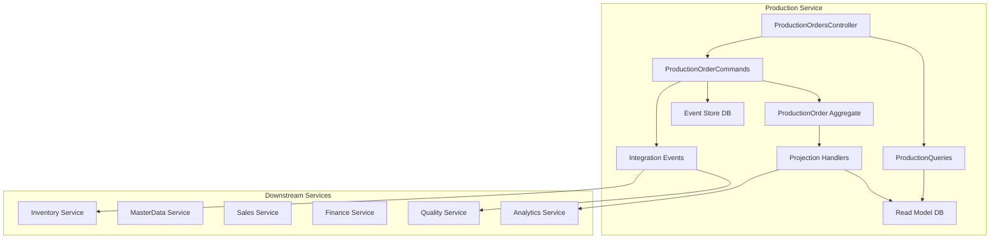
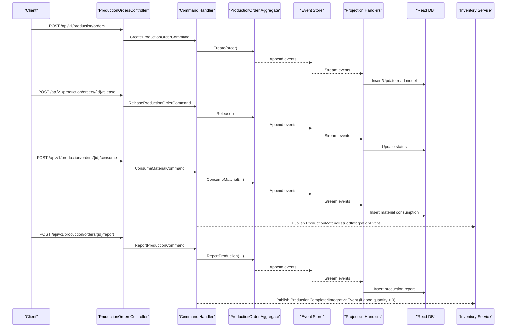
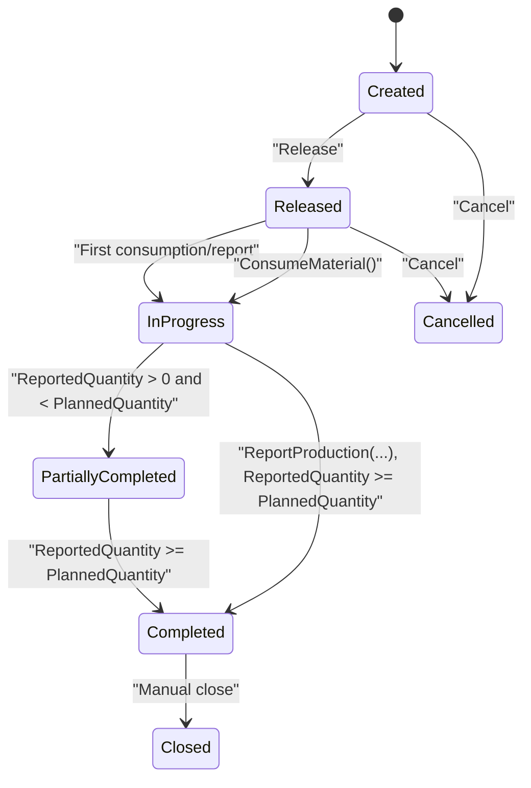
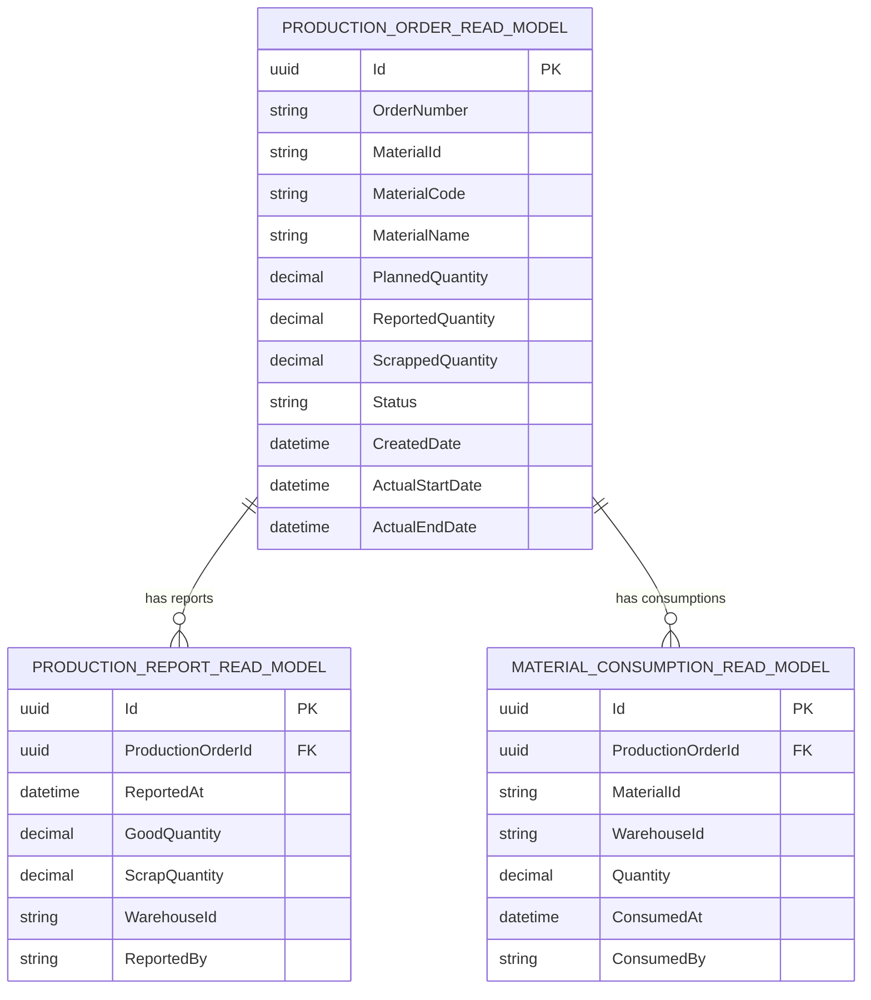
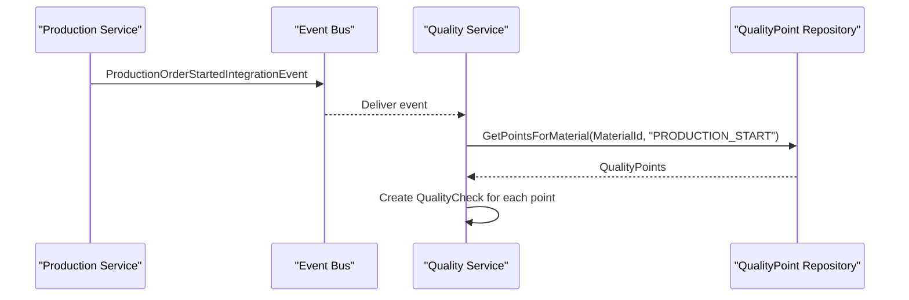
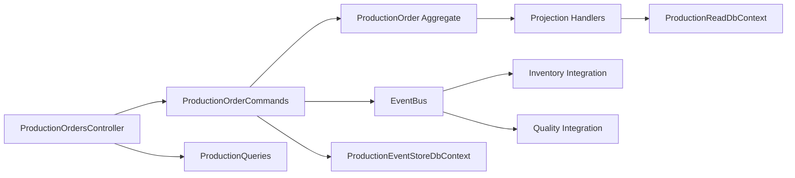

# Production Service API

<cite>
**Referenced Files in This Document**
- [Program.cs](file://src/Services/Production/ErpSystem.Production/Program.cs)
- [ProductionOrdersController.cs](file://src/Services/Production/ErpSystem.Production/API/ProductionOrdersController.cs)
- [ProductionOrderCommands.cs](file://src/Services/Production/ErpSystem.Production/Application/ProductionOrderCommands.cs)
- [ProductionQueries.cs](file://src/Services/Production/ErpSystem.Production/Application/ProductionQueries.cs)
- [ProductionOrderAggregate.cs](file://src/Services/Production/ErpSystem.Production/Domain/ProductionOrderAggregate.cs)
- [Persistence.cs](file://src/Services/Production/ErpSystem.Production/Infrastructure/Persistence.cs)
- [Projections.cs](file://src/Services/Production/ErpSystem.Production/Infrastructure/Projections.cs)
- [ProductionEvents.cs](file://src/Services/Production/ErpSystem.Production/Domain/ProductionEvents.cs)
- [PRD-07-Production-Service.md](file://docs/PRD-07-Production-Service.md)
- [ErpSystem.Gateway.http](file://src/Gateways/ErpSystem.Gateway/ErpSystem.Gateway.http)
- [QualityEventHandlers.cs](file://src/Services/Quality/ErpSystem.Quality/Application/QualityEventHandlers.cs)
- [QualityPointAggregate.cs](file://src/Services/Quality/ErpSystem.Quality/Domain/QualityPointAggregate.cs)
- [BiAnalyticsService.cs](file://src/Services/Analytics/ErpSystem.Analytics/Infrastructure/BiAnalyticsService.cs)
</cite>

## Table of Contents
1. [Introduction](#introduction)
2. [Project Structure](#project-structure)
3. [Core Components](#core-components)
4. [Architecture Overview](#architecture-overview)
5. [Detailed Component Analysis](#detailed-component-analysis)
6. [Dependency Analysis](#dependency-analysis)
7. [Performance Considerations](#performance-considerations)
8. [Troubleshooting Guide](#troubleshooting-guide)
9. [Conclusion](#conclusion)
10. [Appendices](#appendices)

## Introduction
This document provides comprehensive API documentation for the Production service focused on production order management, manufacturing execution, and work-in-progress tracking. It covers production order creation, release, material consumption, production reporting, and WIP visibility. It also outlines integration touchpoints with Inventory, MasterData, Sales, and Finance, and highlights current limitations around routing, capacity planning, and quality inspection points. The documentation includes endpoint definitions, request/response considerations, state transitions, and operational flows.

## Project Structure
The Production service is implemented as a .NET microservice using CQRS and event sourcing. It exposes REST endpoints via ASP.NET Core, persists events in PostgreSQL, projects read models for queries, and publishes integration events to integrate with downstream services.

**Diagram sources**
- [Program.cs](file://src/Services/Production/ErpSystem.Production/Program.cs#L1-L72)
- [ProductionOrdersController.cs](file://src/Services/Production/ErpSystem.Production/API/ProductionOrdersController.cs#L1-L46)
- [ProductionOrderCommands.cs](file://src/Services/Production/ErpSystem.Production/Application/ProductionOrderCommands.cs#L1-L99)
- [ProductionQueries.cs](file://src/Services/Production/ErpSystem.Production/Application/ProductionQueries.cs#L1-L44)
- [ProductionOrderAggregate.cs](file://src/Services/Production/ErpSystem.Production/Domain/ProductionOrderAggregate.cs#L1-L142)
- [Projections.cs](file://src/Services/Production/ErpSystem.Production/Infrastructure/Projections.cs#L1-L107)
- [Persistence.cs](file://src/Services/Production/ErpSystem.Production/Infrastructure/Persistence.cs#L1-L71)
- [ProductionEvents.cs](file://src/Services/Production/ErpSystem.Production/Domain/ProductionEvents.cs#L1-L24)

**Section sources**
- [Program.cs](file://src/Services/Production/ErpSystem.Production/Program.cs#L1-L72)
- [ProductionOrdersController.cs](file://src/Services/Production/ErpSystem.Production/API/ProductionOrdersController.cs#L1-L46)
- [Persistence.cs](file://src/Services/Production/ErpSystem.Production/Infrastructure/Persistence.cs#L1-L71)

## Core Components
- API Controller: Exposes endpoints for production order lifecycle and WIP queries.
- Commands: Encapsulate production actions (create, release, consume, report).
- Queries: Provide read-side access to production orders and WIP lists.
- Aggregate: Enforces production order state machine and domain rules.
- Projection Handlers: Update read models from domain events.
- Integration Events: Decouple Production from Inventory and Quality.

Key capabilities:
- Create production orders with generated order numbers.
- Release orders to enable execution.
- Consume materials and publish material issued events.
- Report production output (good and scrap) and publish completion events.
- Query orders by filters and retrieve WIP status.

**Section sources**
- [ProductionOrdersController.cs](file://src/Services/Production/ErpSystem.Production/API/ProductionOrdersController.cs#L1-L46)
- [ProductionOrderCommands.cs](file://src/Services/Production/ErpSystem.Production/Application/ProductionOrderCommands.cs#L1-L99)
- [ProductionQueries.cs](file://src/Services/Production/ErpSystem.Production/Application/ProductionQueries.cs#L1-L44)
- [ProductionOrderAggregate.cs](file://src/Services/Production/ErpSystem.Production/Domain/ProductionOrderAggregate.cs#L1-L142)
- [Projections.cs](file://src/Services/Production/ErpSystem.Production/Infrastructure/Projections.cs#L1-L107)
- [ProductionEvents.cs](file://src/Services/Production/ErpSystem.Production/Domain/ProductionEvents.cs#L1-L24)

## Architecture Overview
The service follows CQRS with event sourcing:
- Write model: Commands mutate the ProductionOrder aggregate, which emits domain events.
- Event store: Persisted as JSONB payloads keyed by aggregate ID and version.
- Read model: Projection handlers update relational read tables for efficient querying.
- Integration: Domain events trigger integration notifications consumed by Inventory and Quality.

**Diagram sources**
- [ProductionOrdersController.cs](file://src/Services/Production/ErpSystem.Production/API/ProductionOrdersController.cs#L1-L46)
- [ProductionOrderCommands.cs](file://src/Services/Production/ErpSystem.Production/Application/ProductionOrderCommands.cs#L1-L99)
- [ProductionOrderAggregate.cs](file://src/Services/Production/ErpSystem.Production/Domain/ProductionOrderAggregate.cs#L1-L142)
- [Projections.cs](file://src/Services/Production/ErpSystem.Production/Infrastructure/Projections.cs#L1-L107)
- [ProductionEvents.cs](file://src/Services/Production/ErpSystem.Production/Domain/ProductionEvents.cs#L1-L24)

## Detailed Component Analysis

### API Endpoints

- Create Production Order
  - Method: POST
  - Path: /api/v1/production/orders
  - Request: Fields include material identity and planned quantity.
  - Response: New order identifier.
  - Notes: Generates order number and initial status Created.

- Get Production Order by ID
  - Method: GET
  - Path: /api/v1/production/orders/{id}
  - Response: Read model of the order.

- Search Production Orders
  - Method: GET
  - Path: /api/v1/production/orders
  - Query parameters: materialId, status, page.
  - Response: Paginated list of orders filtered by criteria.

- Release Production Order
  - Method: POST
  - Path: /api/v1/production/orders/{id}/release
  - Response: Boolean success indicator.

- Consume Materials
  - Method: POST
  - Path: /api/v1/production/orders/{id}/consume
  - Request: OrderId, MaterialId, WarehouseId, Quantity, ConsumedBy.
  - Response: Boolean success indicator.
  - Notes: Publishes integration event to Inventory.

- Report Production
  - Method: POST
  - Path: /api/v1/production/orders/{id}/report
  - Request: OrderId, GoodQuantity, ScrapQuantity, WarehouseId, ReportedBy.
  - Response: Boolean success indicator.
  - Notes: Publishes integration event to Inventory when good quantity > 0.

- Get Work-in-Progress (WIP)
  - Method: GET
  - Path: /api/v1/production/orders/wip
  - Query parameters: materialId.
  - Response: List of orders in Released, InProgress, or PartiallyCompleted statuses.

**Section sources**
- [ProductionOrdersController.cs](file://src/Services/Production/ErpSystem.Production/API/ProductionOrdersController.cs#L1-L46)
- [ProductionOrderCommands.cs](file://src/Services/Production/ErpSystem.Production/Application/ProductionOrderCommands.cs#L1-L99)
- [ProductionQueries.cs](file://src/Services/Production/ErpSystem.Production/Application/ProductionQueries.cs#L1-L44)

### Production Order State Machine

**Diagram sources**
- [ProductionOrderAggregate.cs](file://src/Services/Production/ErpSystem.Production/Domain/ProductionOrderAggregate.cs#L1-L142)

**Section sources**
- [ProductionOrderAggregate.cs](file://src/Services/Production/ErpSystem.Production/Domain/ProductionOrderAggregate.cs#L1-L142)

### Data Models and Read Views

**Diagram sources**
- [Persistence.cs](file://src/Services/Production/ErpSystem.Production/Infrastructure/Persistence.cs#L34-L71)

**Section sources**
- [Persistence.cs](file://src/Services/Production/ErpSystem.Production/Infrastructure/Persistence.cs#L1-L71)

### Integration Events

- ProductionMaterialIssuedIntegrationEvent
  - Triggered when materials are consumed against a production order.
  - Carries order identity, warehouse, and issued items.

- ProductionCompletedIntegrationEvent
  - Triggered when production output is reported with positive good quantity.
  - Carries order identity, material, warehouse, and quantity.

These events decouple Production from Inventory and enable asynchronous processing.

**Section sources**
- [ProductionEvents.cs](file://src/Services/Production/ErpSystem.Production/Domain/ProductionEvents.cs#L1-L24)
- [ProductionOrderCommands.cs](file://src/Services/Production/ErpSystem.Production/Application/ProductionOrderCommands.cs#L65-L96)

### Quality Inspection Integration
Quality checkpoints can be triggered by production events. The Quality service listens for production start events and creates mandatory process quality control checks per material and operation type.

**Diagram sources**
- [QualityEventHandlers.cs](file://src/Services/Quality/ErpSystem.Quality/Application/QualityEventHandlers.cs#L1-L66)
- [QualityPointAggregate.cs](file://src/Services/Quality/ErpSystem.Quality/Domain/QualityPointAggregate.cs#L1-L43)

**Section sources**
- [QualityEventHandlers.cs](file://src/Services/Quality/ErpSystem.Quality/Application/QualityEventHandlers.cs#L1-L66)
- [QualityPointAggregate.cs](file://src/Services/Quality/ErpSystem.Quality/Domain/QualityPointAggregate.cs#L1-L43)

### Manufacturing Execution and Shop Floor Tracking
- Material consumption updates WIP and actual start date upon first consumption.
- Production reporting increments reported and scrapped quantities, advances status, and records actual end date upon completion.
- Read models support WIP queries by material and status.

**Section sources**
- [Projections.cs](file://src/Services/Production/ErpSystem.Production/Infrastructure/Projections.cs#L40-L105)
- [ProductionQueries.cs](file://src/Services/Production/ErpSystem.Production/Application/ProductionQueries.cs#L35-L42)

### Capacity Planning and Scheduling
- Current implementation does not include detailed routing, capacity constraints, or advanced scheduling (APS).
- Future iterations plan to introduce routing and capacity planning features.

**Section sources**
- [PRD-07-Production-Service.md](file://docs/PRD-07-Production-Service.md#L58-L64)

### Efficiency Metrics and Bottleneck Monitoring
- The Analytics service provides OEE dashboards with simulated availability, performance, and quality metrics.
- Production events can feed analytics for deeper bottleneck identification and capacity utilization monitoring.

**Section sources**
- [BiAnalyticsService.cs](file://src/Services/Analytics/ErpSystem.Analytics/Infrastructure/BiAnalyticsService.cs#L68-L94)

## Dependency Analysis

**Diagram sources**
- [Program.cs](file://src/Services/Production/ErpSystem.Production/Program.cs#L1-L72)
- [ProductionOrdersController.cs](file://src/Services/Production/ErpSystem.Production/API/ProductionOrdersController.cs#L1-L46)
- [ProductionOrderCommands.cs](file://src/Services/Production/ErpSystem.Production/Application/ProductionOrderCommands.cs#L1-L99)
- [Projections.cs](file://src/Services/Production/ErpSystem.Production/Infrastructure/Projections.cs#L1-L107)
- [Persistence.cs](file://src/Services/Production/ErpSystem.Production/Infrastructure/Persistence.cs#L1-L71)

**Section sources**
- [Program.cs](file://src/Services/Production/ErpSystem.Production/Program.cs#L1-L72)
- [Persistence.cs](file://src/Services/Production/ErpSystem.Production/Infrastructure/Persistence.cs#L1-L71)

## Performance Considerations
- Event sourcing with JSONB payloads supports scalable append-only writes.
- Read models are optimized for filtering and pagination.
- Integration events enable asynchronous downstream processing to avoid synchronous latency.

[No sources needed since this section provides general guidance]

## Troubleshooting Guide
Common issues and resolutions:
- Order not found: Handlers throw exceptions when attempting operations on non-existent orders.
- Invalid state transitions: Operations enforce strict state checks (e.g., only Created orders can be released; only Released/InProgress can consume materials; only eligible states can report production).
- Integration failures: Verify EventBus wiring and downstream service connectivity for inventory receipts and quality checks.

**Section sources**
- [ProductionOrderCommands.cs](file://src/Services/Production/ErpSystem.Production/Application/ProductionOrderCommands.cs#L48-L97)
- [ProductionOrderAggregate.cs](file://src/Services/Production/ErpSystem.Production/Domain/ProductionOrderAggregate.cs#L85-L111)

## Conclusion
The Production service provides a robust foundation for production order management, execution, and WIP tracking. Its CQRS/event-sourcing design enables clear state transitions, reliable audit trails, and clean integrations with Inventory and Quality. While advanced routing and capacity planning are planned for future iterations, the current API supports end-to-end production workflows from order creation to material consumption and production reporting.

[No sources needed since this section summarizes without analyzing specific files]

## Appendices

### Endpoint Reference Summary
- POST /api/v1/production/orders
- GET /api/v1/production/orders/{id}
- GET /api/v1/production/orders
- POST /api/v1/production/orders/{id}/release
- POST /api/v1/production/orders/{id}/consume
- POST /api/v1/production/orders/{id}/report
- GET /api/v1/production/orders/wip

**Section sources**
- [ProductionOrdersController.cs](file://src/Services/Production/ErpSystem.Production/API/ProductionOrdersController.cs#L1-L46)

### Integration Touchpoints
- Inventory: Material issuance and completion receipts via integration events.
- Quality: Mandatory quality checks triggered by production start events.
- MasterData/Sales/Finance: Referenced for broader ecosystem alignment.

**Section sources**
- [ProductionEvents.cs](file://src/Services/Production/ErpSystem.Production/Domain/ProductionEvents.cs#L1-L24)
- [QualityEventHandlers.cs](file://src/Services/Quality/ErpSystem.Quality/Application/QualityEventHandlers.cs#L1-L66)
- [PRD-07-Production-Service.md](file://docs/PRD-07-Production-Service.md#L16-L21)