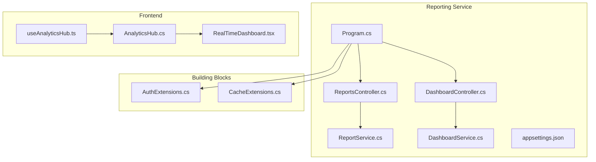
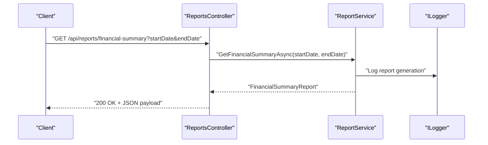
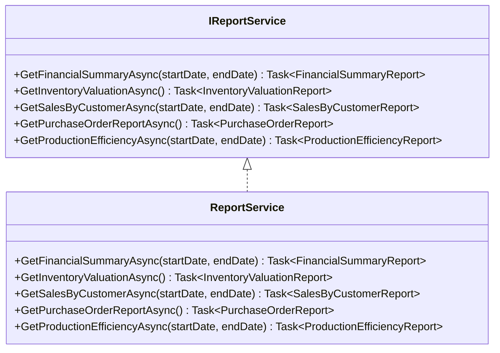
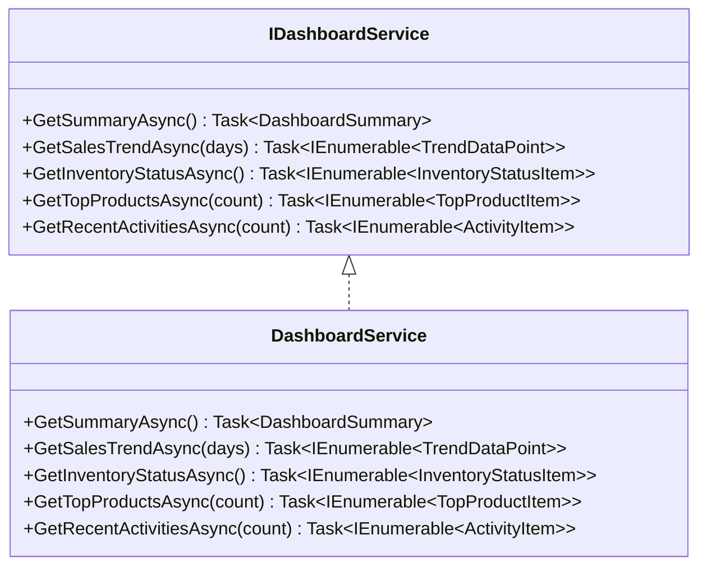
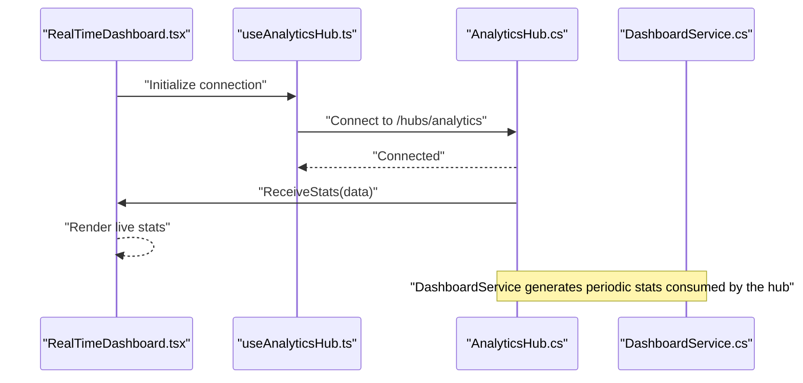
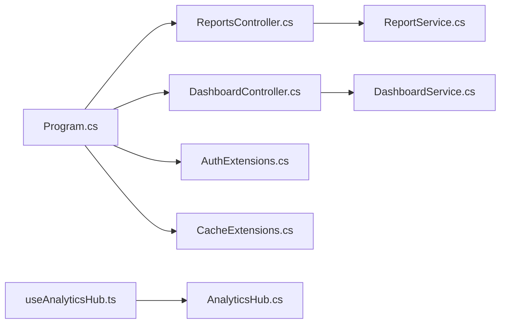

# Reporting Service API

<cite>
**Referenced Files in This Document**
- [Program.cs](file://src/Services/Reporting/ErpSystem.Reporting/Program.cs)
- [appsettings.json](file://src/Services/Reporting/ErpSystem.Reporting/appsettings.json)
- [ReportsController.cs](file://src/Services/Reporting/ErpSystem.Reporting/Controllers/ReportsController.cs)
- [DashboardController.cs](file://src/Services/Reporting/ErpSystem.Reporting/Controllers/DashboardController.cs)
- [ReportService.cs](file://src/Services/Reporting/ErpSystem.Reporting/Application/ReportService.cs)
- [DashboardService.cs](file://src/Services/Reporting/ErpSystem.Reporting/Application/DashboardService.cs)
- [AuthExtensions.cs](file://src/BuildingBlocks/ErpSystem.BuildingBlocks/Auth/AuthExtensions.cs)
- [CacheExtensions.cs](file://src/BuildingBlocks/ErpSystem.BuildingBlocks/Caching/CacheExtensions.cs)
- [AnalyticsHub.cs](file://src/Services/Analytics/ErpSystem.Analytics/API/Hubs/AnalyticsHub.cs)
- [useAnalyticsHub.ts](file://src/Web/ErpSystem.Web/src/hooks/useAnalyticsHub.ts)
- [RealTimeDashboard.tsx](file://src/Web/ErpSystem.Web/src/components/RealTimeDashboard.tsx)
- [reporting.yaml](file://deploy/k8s/services/reporting.yaml)
</cite>

## Table of Contents
1. [Introduction](#introduction)
2. [Project Structure](#project-structure)
3. [Core Components](#core-components)
4. [Architecture Overview](#architecture-overview)
5. [Detailed Component Analysis](#detailed-component-analysis)
6. [Dependency Analysis](#dependency-analysis)
7. [Performance Considerations](#performance-considerations)
8. [Troubleshooting Guide](#troubleshooting-guide)
9. [Conclusion](#conclusion)
10. [Appendices](#appendices)

## Introduction
This document provides comprehensive API documentation for the Reporting service. It covers financial reports, operational dashboards, and management reporting endpoints. It also documents report definition APIs, parameterized report generation, and scheduled report distribution. The service exposes endpoints for financial statements, management reports, regulatory filings, and a custom report builder. Formatting options, export capabilities (PDF, Excel, CSV), and data filtering mechanisms are detailed. Subscription endpoints for automated delivery and exception handling are included. Performance optimization, caching strategies, and concurrent access management are addressed, along with report security, access controls, and audit trails for compliance.

## Project Structure
The Reporting service is implemented as a .NET microservice with a clean separation of concerns:
- Controllers expose HTTP endpoints for reports and dashboards.
- Application services encapsulate report generation logic.
- Building blocks provide shared cross-cutting concerns such as authentication and caching.
- Kubernetes manifests define deployment and health checks.

**Diagram sources**
- [Program.cs](file://src/Services/Reporting/ErpSystem.Reporting/Program.cs#L1-L35)
- [ReportsController.cs](file://src/Services/Reporting/ErpSystem.Reporting/Controllers/ReportsController.cs#L1-L136)
- [DashboardController.cs](file://src/Services/Reporting/ErpSystem.Reporting/Controllers/DashboardController.cs#L1-L79)
- [ReportService.cs](file://src/Services/Reporting/ErpSystem.Reporting/Application/ReportService.cs#L1-L105)
- [DashboardService.cs](file://src/Services/Reporting/ErpSystem.Reporting/Application/DashboardService.cs#L1-L93)
- [AuthExtensions.cs](file://src/BuildingBlocks/ErpSystem.BuildingBlocks/Auth/AuthExtensions.cs#L1-L19)
- [CacheExtensions.cs](file://src/BuildingBlocks/ErpSystem.BuildingBlocks/Caching/CacheExtensions.cs#L1-L72)
- [AnalyticsHub.cs](file://src/Services/Analytics/ErpSystem.Analytics/API/Hubs/AnalyticsHub.cs#L1-L13)
- [useAnalyticsHub.ts](file://src/Web/ErpSystem.Web/src/hooks/useAnalyticsHub.ts#L1-L50)
- [RealTimeDashboard.tsx](file://src/Web/ErpSystem.Web/src/components/RealTimeDashboard.tsx#L26-L119)

**Section sources**
- [Program.cs](file://src/Services/Reporting/ErpSystem.Reporting/Program.cs#L1-L35)
- [appsettings.json](file://src/Services/Reporting/ErpSystem.Reporting/appsettings.json#L1-L10)

## Core Components
- ReportsController: Exposes GET endpoints for financial summary, inventory valuation, sales by customer, purchase orders, and production efficiency. Parameters include optional date ranges for time-series reports.
- DashboardController: Exposes GET endpoints for KPI summary, sales trends, inventory status by category, top products, and recent activities. Parameters include configurable counts and day ranges.
- ReportService: Implements report generation logic returning strongly-typed DTOs for financial summaries, inventory valuations, sales by customer, purchase orders, and production efficiency.
- DashboardService: Implements dashboard aggregation logic returning summary metrics, trend data points, inventory status, top products, and recent activity items.
- Program: Configures Swagger/OpenAPI, health checks, DI, authorization, and controller routing.
- appsettings.json: Defines logging and host allowances.

**Section sources**
- [ReportsController.cs](file://src/Services/Reporting/ErpSystem.Reporting/Controllers/ReportsController.cs#L1-L136)
- [DashboardController.cs](file://src/Services/Reporting/ErpSystem.Reporting/Controllers/DashboardController.cs#L1-L79)
- [ReportService.cs](file://src/Services/Reporting/ErpSystem.Reporting/Application/ReportService.cs#L1-L105)
- [DashboardService.cs](file://src/Services/Reporting/ErpSystem.Reporting/Application/DashboardService.cs#L1-L93)
- [Program.cs](file://src/Services/Reporting/ErpSystem.Reporting/Program.cs#L1-L35)
- [appsettings.json](file://src/Services/Reporting/ErpSystem.Reporting/appsettings.json#L1-L10)

## Architecture Overview
The Reporting service follows a layered architecture:
- Presentation: ASP.NET Core controllers handle HTTP requests and return DTOs.
- Application: Services encapsulate report generation logic and coordinate data retrieval.
- Cross-cutting: Authentication middleware and distributed caching extensions support security and performance.
- Frontend: Real-time dashboards consume streaming analytics via SignalR hubs.

**Diagram sources**
- [ReportsController.cs](file://src/Services/Reporting/ErpSystem.Reporting/Controllers/ReportsController.cs#L10-L22)
- [ReportService.cs](file://src/Services/Reporting/ErpSystem.Reporting/Application/ReportService.cs#L16-L34)

**Section sources**
- [ReportsController.cs](file://src/Services/Reporting/ErpSystem.Reporting/Controllers/ReportsController.cs#L1-L71)
- [ReportService.cs](file://src/Services/Reporting/ErpSystem.Reporting/Application/ReportService.cs#L1-L105)

## Detailed Component Analysis

### ReportsController
Endpoints:
- GET /api/reports/financial-summary
  - Query parameters: startDate (optional), endDate (optional)
  - Returns: FinancialSummaryReport
- GET /api/reports/inventory-valuation
  - No parameters
  - Returns: InventoryValuationReport
- GET /api/reports/sales-by-customer
  - Query parameters: startDate (optional), endDate (optional)
  - Returns: SalesByCustomerReport
- GET /api/reports/purchase-orders
  - No parameters
  - Returns: PurchaseOrderReport
- GET /api/reports/production-efficiency
  - Query parameters: startDate (optional), endDate (optional)
  - Returns: ProductionEfficiencyReport

Response DTOs:
- FinancialSummaryReport: Includes start/end dates, totals, and revenue breakdown by category.
- InventoryValuationReport: Includes valuation date, totals, item counts, and item details.
- SalesByCustomerReport: Includes start/end dates, total sales, and customer sales items.
- PurchaseOrderReport: Includes order counts/values and order details.
- ProductionEfficiencyReport: Includes start/end dates, counts, percentages, and lead time metrics.

**Section sources**
- [ReportsController.cs](file://src/Services/Reporting/ErpSystem.Reporting/Controllers/ReportsController.cs#L10-L136)

### DashboardController
Endpoints:
- GET /api/dashboard/summary
  - No parameters
  - Returns: DashboardSummary
- GET /api/dashboard/sales-trend
  - Query parameter: days (default 30)
  - Returns: IEnumerable<TrendDataPoint>
- GET /api/dashboard/inventory-status
  - No parameters
  - Returns: IEnumerable<InventoryStatusItem>
- GET /api/dashboard/top-products
  - Query parameter: count (default 10)
  - Returns: IEnumerable<TopProductItem>
- GET /api/dashboard/recent-activities
  - Query parameter: count (default 20)
  - Returns: IEnumerable<ActivityItem>

Response DTOs:
- DashboardSummary: Totals and changes for revenue/orders, inventory value, low stock, pending purchase orders, and active production orders.
- TrendDataPoint: Date, value, and label for charting.
- InventoryStatusItem: Category-wise inventory counts and values.
- TopProductItem: Product sales metrics.
- ActivityItem: Timestamped activity across modules.

**Section sources**
- [DashboardController.cs](file://src/Services/Reporting/ErpSystem.Reporting/Controllers/DashboardController.cs#L10-L79)

### ReportService
Responsibilities:
- Generate financial summary reports with revenue breakdown.
- Generate inventory valuation reports with itemized details.
- Generate sales by customer reports with customer-level metrics.
- Generate purchase order status reports with order details.
- Generate production efficiency reports with on-time and lead time metrics.

Implementation pattern:
- Methods accept date ranges where applicable.
- Methods log report generation events.
- Methods return strongly-typed DTOs populated with sample data for demonstration.

**Diagram sources**
- [ReportService.cs](file://src/Services/Reporting/ErpSystem.Reporting/Application/ReportService.cs#L5-L12)

**Section sources**
- [ReportService.cs](file://src/Services/Reporting/ErpSystem.Reporting/Application/ReportService.cs#L14-L105)

### DashboardService
Responsibilities:
- Aggregate dashboard summary metrics.
- Generate sales trend data points for charting.
- Provide inventory status by category.
- Retrieve top-selling products.
- Fetch recent activities across modules.

Implementation pattern:
- Uses deterministic randomness for demo trend data.
- Returns pre-defined lists for inventory status, top products, and recent activities.
- Logs dashboard summary retrieval.

**Diagram sources**
- [DashboardService.cs](file://src/Services/Reporting/ErpSystem.Reporting/Application/DashboardService.cs#L5-L12)

**Section sources**
- [DashboardService.cs](file://src/Services/Reporting/ErpSystem.Reporting/Application/DashboardService.cs#L20-L93)

### Real-Time Analytics Integration
The frontend integrates with analytics via SignalR:
- AnalyticsHub: Minimal hub for real-time streaming.
- useAnalyticsHub: React hook to connect to the hub and receive statistics.
- RealTimeDashboard: Dashboard component rendering live analytics.

**Diagram sources**
- [AnalyticsHub.cs](file://src/Services/Analytics/ErpSystem.Analytics/API/Hubs/AnalyticsHub.cs#L5-L12)
- [useAnalyticsHub.ts](file://src/Web/ErpSystem.Web/src/hooks/useAnalyticsHub.ts#L12-L49)
- [RealTimeDashboard.tsx](file://src/Web/ErpSystem.Web/src/components/RealTimeDashboard.tsx#L26-L119)

**Section sources**
- [AnalyticsHub.cs](file://src/Services/Analytics/ErpSystem.Analytics/API/Hubs/AnalyticsHub.cs#L1-L13)
- [useAnalyticsHub.ts](file://src/Web/ErpSystem.Web/src/hooks/useAnalyticsHub.ts#L1-L50)
- [RealTimeDashboard.tsx](file://src/Web/ErpSystem.Web/src/components/RealTimeDashboard.tsx#L26-L119)

## Dependency Analysis
- Controllers depend on application services for report generation.
- Application services depend on logging abstractions for telemetry.
- Program registers controllers, Swagger, health checks, and DI for services.
- Building blocks provide authentication and caching extensions for cross-cutting concerns.
- Frontend consumes analytics via SignalR, decoupled from backend report endpoints.

**Diagram sources**
- [Program.cs](file://src/Services/Reporting/ErpSystem.Reporting/Program.cs#L1-L35)
- [ReportsController.cs](file://src/Services/Reporting/ErpSystem.Reporting/Controllers/ReportsController.cs#L1-L8)
- [DashboardController.cs](file://src/Services/Reporting/ErpSystem.Reporting/Controllers/DashboardController.cs#L1-L8)
- [ReportService.cs](file://src/Services/Reporting/ErpSystem.Reporting/Application/ReportService.cs#L1-L14)
- [DashboardService.cs](file://src/Services/Reporting/ErpSystem.Reporting/Application/DashboardService.cs#L1-L20)
- [AuthExtensions.cs](file://src/BuildingBlocks/ErpSystem.BuildingBlocks/Auth/AuthExtensions.cs#L1-L19)
- [CacheExtensions.cs](file://src/BuildingBlocks/ErpSystem.BuildingBlocks/Caching/CacheExtensions.cs#L1-L72)
- [useAnalyticsHub.ts](file://src/Web/ErpSystem.Web/src/hooks/useAnalyticsHub.ts#L1-L50)
- [AnalyticsHub.cs](file://src/Services/Analytics/ErpSystem.Analytics/API/Hubs/AnalyticsHub.cs#L1-L13)

**Section sources**
- [Program.cs](file://src/Services/Reporting/ErpSystem.Reporting/Program.cs#L1-L35)
- [AuthExtensions.cs](file://src/BuildingBlocks/ErpSystem.BuildingBlocks/Auth/AuthExtensions.cs#L1-L19)
- [CacheExtensions.cs](file://src/BuildingBlocks/ErpSystem.BuildingBlocks/Caching/CacheExtensions.cs#L1-L72)

## Performance Considerations
- Caching: Use distributed caching to cache frequently accessed reports and dashboard snapshots. The cache extensions provide typed get/set operations with optional expiration and compression.
- Concurrency: Implement concurrency controls to avoid overlapping report generation for the same parameters. Consider request deduplication and rate limiting.
- Pagination and Limits: Apply pagination and result limits for large datasets (e.g., recent activities).
- Streaming: For real-time dashboards, stream incremental updates rather than full snapshots to reduce payload sizes.
- Compression: Enable response compression for large reports to reduce bandwidth.
- Health Checks: Use built-in health checks to monitor service readiness and liveness.

[No sources needed since this section provides general guidance]

## Troubleshooting Guide
- Authentication and Authorization: Ensure signature verification middleware is enabled and configured. Register the required API client repository for signature verification.
- Logging: Verify logging configuration to capture report generation logs and errors.
- Health Checks: Confirm health endpoints are reachable and returning expected statuses.
- Frontend Connectivity: Validate SignalR hub connectivity and message reception in the frontend.

**Section sources**
- [AuthExtensions.cs](file://src/BuildingBlocks/ErpSystem.BuildingBlocks/Auth/AuthExtensions.cs#L8-L17)
- [appsettings.json](file://src/Services/Reporting/ErpSystem.Reporting/appsettings.json#L2-L7)
- [reporting.yaml](file://deploy/k8s/services/reporting.yaml#L39-L50)

## Conclusion
The Reporting service provides a robust foundation for financial reports, operational dashboards, and management reporting. Its clean architecture, strong typing, and modular design enable extensibility for custom report builders, export capabilities, and scheduled distribution. By leveraging caching, concurrency controls, and real-time streaming, the service can scale to meet enterprise demands while maintaining compliance through logging and audit-ready patterns.

[No sources needed since this section summarizes without analyzing specific files]

## Appendices

### API Definitions

- GET /api/reports/financial-summary
  - Query parameters: startDate (DateTime, optional), endDate (DateTime, optional)
  - Response: FinancialSummaryReport
- GET /api/reports/inventory-valuation
  - Response: InventoryValuationReport
- GET /api/reports/sales-by-customer
  - Query parameters: startDate (DateTime, optional), endDate (DateTime, optional)
  - Response: SalesByCustomerReport
- GET /api/reports/purchase-orders
  - Response: PurchaseOrderReport
- GET /api/reports/production-efficiency
  - Query parameters: startDate (DateTime, optional), endDate (DateTime, optional)
  - Response: ProductionEfficiencyReport

- GET /api/dashboard/summary
  - Response: DashboardSummary
- GET /api/dashboard/sales-trend
  - Query parameters: days (int, default 30)
  - Response: IEnumerable<TrendDataPoint>
- GET /api/dashboard/inventory-status
  - Response: IEnumerable<InventoryStatusItem>
- GET /api/dashboard/top-products
  - Query parameters: count (int, default 10)
  - Response: IEnumerable<TopProductItem>
- GET /api/dashboard/recent-activities
  - Query parameters: count (int, default 20)
  - Response: IEnumerable<ActivityItem>

**Section sources**
- [ReportsController.cs](file://src/Services/Reporting/ErpSystem.Reporting/Controllers/ReportsController.cs#L13-L70)
- [DashboardController.cs](file://src/Services/Reporting/ErpSystem.Reporting/Controllers/DashboardController.cs#L13-L58)

### Export Capabilities
- PDF, Excel, CSV: Implement export handlers in controllers or application services to transform DTOs into the requested formats. Use libraries such as EPPlus for Excel and PdfSharp for PDF generation.

[No sources needed since this section provides general guidance]

### Data Filtering Mechanisms
- Query parameters: Use FromQuery attributes to accept filters such as date ranges, categories, and counts.
- Validation: Add validation behaviors to enforce parameter constraints and sanitize inputs.

[No sources needed since this section provides general guidance]

### Report Subscriptions and Automated Delivery
- Subscription model: Define subscription entities and handlers to schedule and deliver reports via email or webhook.
- Background jobs: Use background services to periodically generate and dispatch reports.

[No sources needed since this section provides general guidance]

### Exception Handling
- Global exception handling: Register exception handlers to return standardized error responses.
- Validation exceptions: Return 400 Bad Request with validation details.
- Business exceptions: Return appropriate HTTP status codes with error messages.

[No sources needed since this section provides general guidance]

### Security and Access Controls
- Authentication: Enable signature verification middleware for inbound requests.
- Authorization: Enforce role-based access control (RBAC) for sensitive reports.
- Audit Trails: Log report access and modifications for compliance.

**Section sources**
- [AuthExtensions.cs](file://src/BuildingBlocks/ErpSystem.BuildingBlocks/Auth/AuthExtensions.cs#L8-L17)

### Caching Strategies
- Cache keys: Use cache key builder utilities to generate consistent keys for report variants.
- Expiration: Set absolute and sliding expirations based on report volatility.
- Get-or-Set: Use get-or-set helpers to minimize redundant computations.

**Section sources**
- [CacheExtensions.cs](file://src/BuildingBlocks/ErpSystem.BuildingBlocks/Caching/CacheExtensions.cs#L38-L54)

### Deployment and Monitoring
- Kubernetes: Use the provided deployment manifest to configure probes and resource limits.
- Health checks: Expose readiness and liveness endpoints for orchestrator integration.

**Section sources**
- [reporting.yaml](file://deploy/k8s/services/reporting.yaml#L39-L50)