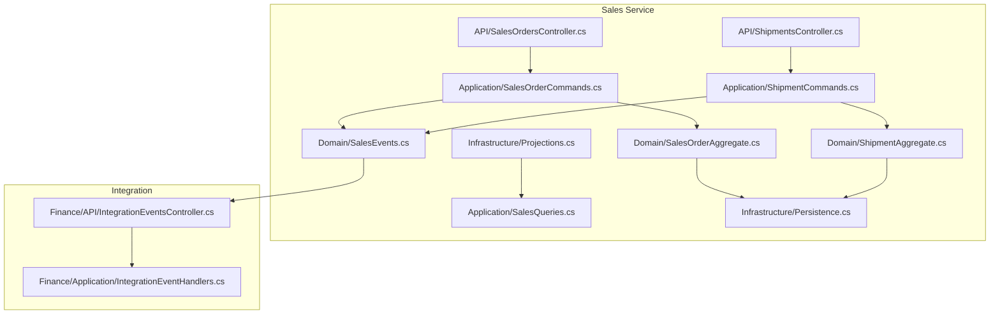
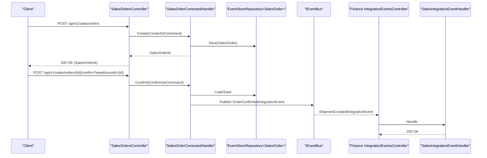
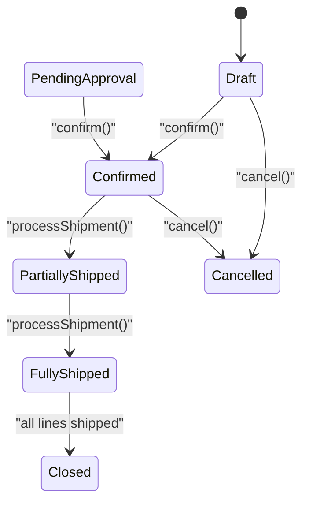
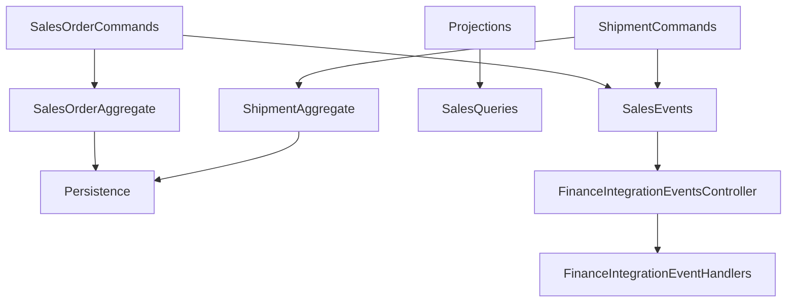
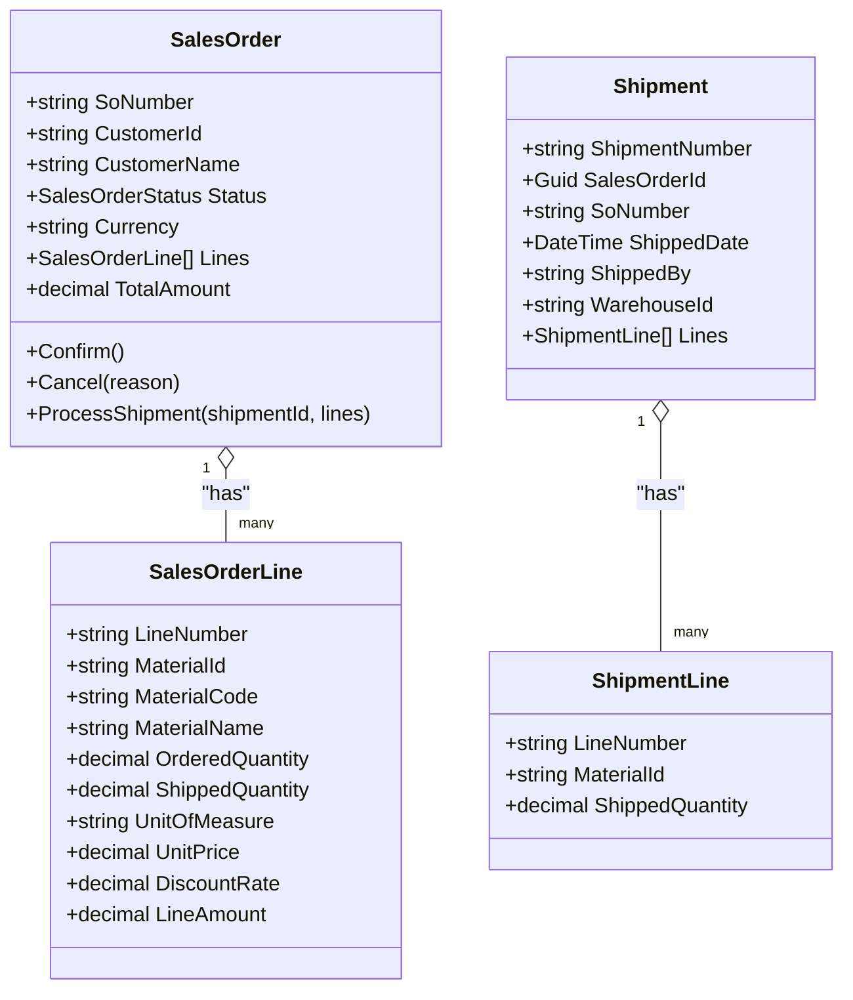

# Sales Service API

<cite>
**Referenced Files in This Document**
- [SalesOrdersController.cs](file://src/Services/Sales/ErpSystem.Sales/API/SalesOrdersController.cs)
- [ShipmentsController.cs](file://src/Services/Sales/ErpSystem.Sales/API/ShipmentsController.cs)
- [SalesOrderCommands.cs](file://src/Services/Sales/ErpSystem.Sales/Application/SalesOrderCommands.cs)
- [ShipmentCommands.cs](file://src/Services/Sales/ErpSystem.Sales/Application/ShipmentCommands.cs)
- [SalesQueries.cs](file://src/Services/Sales/ErpSystem.Sales/Application/SalesQueries.cs)
- [SalesOrderAggregate.cs](file://src/Services/Sales/ErpSystem.Sales/Domain/SalesOrderAggregate.cs)
- [ShipmentAggregate.cs](file://src/Services/Sales/ErpSystem.Sales/Domain/ShipmentAggregate.cs)
- [SalesEvents.cs](file://src/Services/Sales/ErpSystem.Sales/Domain/SalesEvents.cs)
- [Persistence.cs](file://src/Services/Sales/ErpSystem.Sales/Infrastructure/Persistence.cs)
- [Projections.cs](file://src/Services/Sales/ErpSystem.Sales/Infrastructure/Projections.cs)
- [IntegrationEventsController.cs](file://src/Services/Finance/ErpSystem.Finance/API/IntegrationEventsController.cs)
- [IntegrationEventHandlers.cs](file://src/Services/Finance/ErpSystem.Finance/Application/IntegrationEventHandlers.cs)
- [DashboardController.cs](file://src/Services/Reporting/ErpSystem.Reporting/Controllers/DashboardController.cs)
</cite>

## Table of Contents
1. [Introduction](#introduction)
2. [Project Structure](#project-structure)
3. [Core Components](#core-components)
4. [Architecture Overview](#architecture-overview)
5. [Detailed Component Analysis](#detailed-component-analysis)
6. [Dependency Analysis](#dependency-analysis)
7. [Performance Considerations](#performance-considerations)
8. [Troubleshooting Guide](#troubleshooting-guide)
9. [Conclusion](#conclusion)
10. [Appendices](#appendices)

## Introduction
This document provides comprehensive API documentation for the Sales service, focusing on sales order management, customer order processing, and shipment coordination. It covers the sales order lifecycle from quote to delivery, customer order modifications, and cancellation procedures. It also documents pricing calculations, discount management, contract validation, shipping coordination, delivery scheduling, and proof of delivery capture. Additionally, it outlines endpoints for customer relationship management, sales analytics, and performance tracking, along with integrations to CRM systems, e-commerce platforms, and shipping carriers. Finally, it addresses sales commission calculations, territory management, and channel partner integration.

## Project Structure
The Sales service follows a clean architecture with separate concerns for API controllers, application commands and queries, domain aggregates and events, and infrastructure persistence and projections. The service leverages CQRS with MediatR for requests and handlers, Event Sourcing for auditability, and Dapr-based event bus for cross-service integration.

**Diagram sources**
- [SalesOrdersController.cs](file://src/Services/Sales/ErpSystem.Sales/API/SalesOrdersController.cs#L1-L45)
- [ShipmentsController.cs](file://src/Services/Sales/ErpSystem.Sales/API/ShipmentsController.cs#L1-L45)
- [SalesOrderCommands.cs](file://src/Services/Sales/ErpSystem.Sales/Application/SalesOrderCommands.cs#L1-L67)
- [ShipmentCommands.cs](file://src/Services/Sales/ErpSystem.Sales/Application/ShipmentCommands.cs#L1-L61)
- [SalesQueries.cs](file://src/Services/Sales/ErpSystem.Sales/Application/SalesQueries.cs#L1-L78)
- [SalesOrderAggregate.cs](file://src/Services/Sales/ErpSystem.Sales/Domain/SalesOrderAggregate.cs#L1-L148)
- [ShipmentAggregate.cs](file://src/Services/Sales/ErpSystem.Sales/Domain/ShipmentAggregate.cs#L1-L61)
- [SalesEvents.cs](file://src/Services/Sales/ErpSystem.Sales/Domain/SalesEvents.cs#L1-L32)
- [Persistence.cs](file://src/Services/Sales/ErpSystem.Sales/Infrastructure/Persistence.cs#L1-L56)
- [Projections.cs](file://src/Services/Sales/ErpSystem.Sales/Infrastructure/Projections.cs#L1-L88)
- [IntegrationEventsController.cs](file://src/Services/Finance/ErpSystem.Finance/API/IntegrationEventsController.cs#L1-L22)
- [IntegrationEventHandlers.cs](file://src/Services/Finance/ErpSystem.Finance/Application/IntegrationEventHandlers.cs#L1-L37)

**Section sources**
- [SalesOrdersController.cs](file://src/Services/Sales/ErpSystem.Sales/API/SalesOrdersController.cs#L1-L45)
- [ShipmentsController.cs](file://src/Services/Sales/ErpSystem.Sales/API/ShipmentsController.cs#L1-L45)
- [SalesOrderCommands.cs](file://src/Services/Sales/ErpSystem.Sales/Application/SalesOrderCommands.cs#L1-L67)
- [ShipmentCommands.cs](file://src/Services/Sales/ErpSystem.Sales/Application/ShipmentCommands.cs#L1-L61)
- [SalesQueries.cs](file://src/Services/Sales/ErpSystem.Sales/Application/SalesQueries.cs#L1-L78)
- [SalesOrderAggregate.cs](file://src/Services/Sales/ErpSystem.Sales/Domain/SalesOrderAggregate.cs#L1-L148)
- [ShipmentAggregate.cs](file://src/Services/Sales/ErpSystem.Sales/Domain/ShipmentAggregate.cs#L1-L61)
- [SalesEvents.cs](file://src/Services/Sales/ErpSystem.Sales/Domain/SalesEvents.cs#L1-L32)
- [Persistence.cs](file://src/Services/Sales/ErpSystem.Sales/Infrastructure/Persistence.cs#L1-L56)
- [Projections.cs](file://src/Services/Sales/ErpSystem.Sales/Infrastructure/Projections.cs#L1-L88)
- [IntegrationEventsController.cs](file://src/Services/Finance/ErpSystem.Finance/API/IntegrationEventsController.cs#L1-L22)
- [IntegrationEventHandlers.cs](file://src/Services/Finance/ErpSystem.Finance/Application/IntegrationEventHandlers.cs#L1-L37)

## Core Components
- Sales Orders API: Handles creation, retrieval, search, confirmation, cancellation, and billable line calculation for sales orders.
- Shipments API: Manages shipment creation and links shipments to sales orders.
- Application Commands: Encapsulate business operations for sales order lifecycle and shipment processing.
- Domain Aggregates: Define sales order and shipment state transitions and business rules.
- Integration Events: Enable cross-service communication with Inventory and Finance services.
- Read Model Projection: Maintains a denormalized read model for efficient querying and reporting.
- Finance Integration: Automatically generates invoices upon shipment creation.

**Section sources**
- [SalesOrdersController.cs](file://src/Services/Sales/ErpSystem.Sales/API/SalesOrdersController.cs#L1-L45)
- [ShipmentsController.cs](file://src/Services/Sales/ErpSystem.Sales/API/ShipmentsController.cs#L1-L45)
- [SalesOrderCommands.cs](file://src/Services/Sales/ErpSystem.Sales/Application/SalesOrderCommands.cs#L1-L67)
- [ShipmentCommands.cs](file://src/Services/Sales/ErpSystem.Sales/Application/ShipmentCommands.cs#L1-L61)
- [SalesOrderAggregate.cs](file://src/Services/Sales/ErpSystem.Sales/Domain/SalesOrderAggregate.cs#L1-L148)
- [ShipmentAggregate.cs](file://src/Services/Sales/ErpSystem.Sales/Domain/ShipmentAggregate.cs#L1-L61)
- [SalesEvents.cs](file://src/Services/Sales/ErpSystem.Sales/Domain/SalesEvents.cs#L1-L32)
- [Persistence.cs](file://src/Services/Sales/ErpSystem.Sales/Infrastructure/Persistence.cs#L1-L56)
- [Projections.cs](file://src/Services/Sales/ErpSystem.Sales/Infrastructure/Projections.cs#L1-L88)
- [IntegrationEventsController.cs](file://src/Services/Finance/ErpSystem.Finance/API/IntegrationEventsController.cs#L1-L22)
- [IntegrationEventHandlers.cs](file://src/Services/Finance/ErpSystem.Finance/Application/IntegrationEventHandlers.cs#L1-L37)

## Architecture Overview
The Sales service employs CQRS with MediatR for request handling, Event Sourcing for immutable audit trails, and Dapr-based event publishing for decoupled integration with downstream services. The write model updates domain aggregates and publishes domain events, while the read model is projected from these events for fast querying.

**Diagram sources**
- [SalesOrdersController.cs](file://src/Services/Sales/ErpSystem.Sales/API/SalesOrdersController.cs#L1-L45)
- [SalesOrderCommands.cs](file://src/Services/Sales/ErpSystem.Sales/Application/SalesOrderCommands.cs#L1-L67)
- [SalesEvents.cs](file://src/Services/Sales/ErpSystem.Sales/Domain/SalesEvents.cs#L1-L32)
- [IntegrationEventsController.cs](file://src/Services/Finance/ErpSystem.Finance/API/IntegrationEventsController.cs#L1-L22)
- [IntegrationEventHandlers.cs](file://src/Services/Finance/ErpSystem.Finance/Application/IntegrationEventHandlers.cs#L1-L37)

## Detailed Component Analysis

### Sales Orders API
Endpoints for managing sales orders:
- POST /api/v1/sales/orders: Create a new sales order.
- GET /api/v1/sales/orders/{id}: Retrieve a sales order by ID.
- GET /api/v1/sales/orders: Search sales orders by customer ID and status with pagination.
- POST /api/v1/sales/orders/{id}/confirm?warehouseId={id}: Confirm an order to trigger inventory reservation.
- POST /api/v1/sales/orders/{id}/cancel: Cancel an order with a reason.
- GET /api/v1/sales/orders/{id}/billable-lines: Calculate billable lines for invoicing.

Key behaviors:
- Creation generates a unique sales order number and persists the aggregate.
- Confirmation validates state and publishes integration events for inventory reservation.
- Cancellation enforces state constraints and updates status.
- Billable lines endpoint deserializes stored lines and computes billable quantities.

**Section sources**
- [SalesOrdersController.cs](file://src/Services/Sales/ErpSystem.Sales/API/SalesOrdersController.cs#L1-L45)
- [SalesOrderCommands.cs](file://src/Services/Sales/ErpSystem.Sales/Application/SalesOrderCommands.cs#L1-L67)
- [SalesQueries.cs](file://src/Services/Sales/ErpSystem.Sales/Application/SalesQueries.cs#L1-L78)
- [SalesOrderAggregate.cs](file://src/Services/Sales/ErpSystem.Sales/Domain/SalesOrderAggregate.cs#L1-L148)

### Shipments API
Endpoint for managing shipments:
- POST /api/v1/sales/shipments: Create a shipment linked to a sales order.

Processing logic:
- Validates existence of the associated sales order.
- Generates a shipment number and creates a shipment aggregate.
- Updates the sales order's shipped quantity and status.
- Publishes integration events for inventory issue and downstream invoice generation.

**Section sources**
- [ShipmentsController.cs](file://src/Services/Sales/ErpSystem.Sales/API/ShipmentsController.cs#L1-L45)
- [ShipmentCommands.cs](file://src/Services/Sales/ErpSystem.Sales/Application/ShipmentCommands.cs#L1-L61)
- [SalesOrderAggregate.cs](file://src/Services/Sales/ErpSystem.Sales/Domain/SalesOrderAggregate.cs#L1-L148)
- [ShipmentAggregate.cs](file://src/Services/Sales/ErpSystem.Sales/Domain/ShipmentAggregate.cs#L1-L61)

### Pricing Calculations and Discount Management
- Line amount computation considers unit price and discount rate per line item.
- Total order amount is derived from line amounts.
- Billable quantity is computed from shipped quantities for invoicing.

Note: Contract validation and pricing tiers are not present in the current implementation and would require extension of domain models and application logic.

**Section sources**
- [SalesOrderAggregate.cs](file://src/Services/Sales/ErpSystem.Sales/Domain/SalesOrderAggregate.cs#L1-L148)
- [SalesQueries.cs](file://src/Services/Sales/ErpSystem.Sales/Application/SalesQueries.cs#L1-L78)

### Sales Order Lifecycle

**Diagram sources**
- [SalesOrderAggregate.cs](file://src/Services/Sales/ErpSystem.Sales/Domain/SalesOrderAggregate.cs#L1-L148)

### Shipping Coordination and Delivery Scheduling
- Shipment creation updates sales order shipped quantities and status.
- Integration events propagate to downstream systems for inventory and financial processing.
- Delivery scheduling and proof of delivery capture are not implemented in the current codebase and would require additional domain events and handlers.

**Section sources**
- [ShipmentCommands.cs](file://src/Services/Sales/ErpSystem.Sales/Application/ShipmentCommands.cs#L1-L61)
- [SalesOrderAggregate.cs](file://src/Services/Sales/ErpSystem.Sales/Domain/SalesOrderAggregate.cs#L1-L148)
- [SalesEvents.cs](file://src/Services/Sales/ErpSystem.Sales/Domain/SalesEvents.cs#L1-L32)

### Integration with CRM Systems, E-commerce Platforms, and Shipping Carriers
- Order confirmation triggers inventory reservation via integration events.
- Shipment creation triggers invoice generation in Finance, enabling AR processing.
- Additional integrations (CRM, e-commerce, carriers) are not present in the current codebase and would require extending integration events and handlers.

**Section sources**
- [SalesEvents.cs](file://src/Services/Sales/ErpSystem.Sales/Domain/SalesEvents.cs#L1-L32)
- [IntegrationEventsController.cs](file://src/Services/Finance/ErpSystem.Finance/API/IntegrationEventsController.cs#L1-L22)
- [IntegrationEventHandlers.cs](file://src/Services/Finance/ErpSystem.Finance/Application/IntegrationEventHandlers.cs#L1-L37)

### Sales Analytics and Performance Tracking
- Reporting service exposes endpoints for sales trends and KPI dashboards.
- These endpoints complement the Sales service by providing analytical insights.

**Section sources**
- [DashboardController.cs](file://src/Services/Reporting/ErpSystem.Reporting/Controllers/DashboardController.cs#L1-L47)

### Sales Commission Calculations, Territory Management, and Channel Partner Integration
These capabilities are not implemented in the current codebase and would require:
- Extension of domain models to include commission rules and territories.
- Addition of application services and handlers for commission computations.
- Integration with CRM and channel partner systems via additional integration events.

[No sources needed since this section provides conceptual guidance]

## Dependency Analysis
The Sales service depends on:
- Domain events for cross-service integration.
- Event store for persistence and projections for read model updates.
- MediatR for command/query dispatching.
- Dapr event bus for reliable messaging.

**Diagram sources**
- [SalesOrderCommands.cs](file://src/Services/Sales/ErpSystem.Sales/Application/SalesOrderCommands.cs#L1-L67)
- [ShipmentCommands.cs](file://src/Services/Sales/ErpSystem.Sales/Application/ShipmentCommands.cs#L1-L61)
- [SalesOrderAggregate.cs](file://src/Services/Sales/ErpSystem.Sales/Domain/SalesOrderAggregate.cs#L1-L148)
- [ShipmentAggregate.cs](file://src/Services/Sales/ErpSystem.Sales/Domain/ShipmentAggregate.cs#L1-L61)
- [Persistence.cs](file://src/Services/Sales/ErpSystem.Sales/Infrastructure/Persistence.cs#L1-L56)
- [Projections.cs](file://src/Services/Sales/ErpSystem.Sales/Infrastructure/Projections.cs#L1-L88)
- [SalesEvents.cs](file://src/Services/Sales/ErpSystem.Sales/Domain/SalesEvents.cs#L1-L32)
- [IntegrationEventsController.cs](file://src/Services/Finance/ErpSystem.Finance/API/IntegrationEventsController.cs#L1-L22)
- [IntegrationEventHandlers.cs](file://src/Services/Finance/ErpSystem.Finance/Application/IntegrationEventHandlers.cs#L1-L37)

**Section sources**
- [SalesOrderCommands.cs](file://src/Services/Sales/ErpSystem.Sales/Application/SalesOrderCommands.cs#L1-L67)
- [ShipmentCommands.cs](file://src/Services/Sales/ErpSystem.Sales/Application/ShipmentCommands.cs#L1-L61)
- [SalesOrderAggregate.cs](file://src/Services/Sales/ErpSystem.Sales/Domain/SalesOrderAggregate.cs#L1-L148)
- [ShipmentAggregate.cs](file://src/Services/Sales/ErpSystem.Sales/Domain/ShipmentAggregate.cs#L1-L61)
- [Persistence.cs](file://src/Services/Sales/ErpSystem.Sales/Infrastructure/Persistence.cs#L1-L56)
- [Projections.cs](file://src/Services/Sales/ErpSystem.Sales/Infrastructure/Projections.cs#L1-L88)
- [SalesEvents.cs](file://src/Services/Sales/ErpSystem.Sales/Domain/SalesEvents.cs#L1-L32)
- [IntegrationEventsController.cs](file://src/Services/Finance/ErpSystem.Finance/API/IntegrationEventsController.cs#L1-L22)
- [IntegrationEventHandlers.cs](file://src/Services/Finance/ErpSystem.Finance/Application/IntegrationEventHandlers.cs#L1-L37)

## Performance Considerations
- CQRS with separate read/write models improves scalability and query performance.
- Event sourcing enables temporal queries but requires careful projection maintenance.
- Pagination in search endpoints prevents excessive payload sizes.
- Consider caching frequently accessed customer and product data to reduce latency.

[No sources needed since this section provides general guidance]

## Troubleshooting Guide
Common issues and resolutions:
- Order not found during confirmation/cancellation: Ensure the sales order exists and the ID is correct.
- Invalid state transitions: Confirm orders must be in Draft or PendingApproval; cancellations are not allowed for shipped or closed orders.
- Shipment validation errors: Verify the sales order exists and lines match the original order.
- Integration event delivery failures: Check event bus connectivity and handler logs.

**Section sources**
- [SalesOrderCommands.cs](file://src/Services/Sales/ErpSystem.Sales/Application/SalesOrderCommands.cs#L1-L67)
- [ShipmentCommands.cs](file://src/Services/Sales/ErpSystem.Sales/Application/ShipmentCommands.cs#L1-L61)
- [SalesOrderAggregate.cs](file://src/Services/Sales/ErpSystem.Sales/Domain/SalesOrderAggregate.cs#L1-L148)

## Conclusion
The Sales service provides a robust foundation for sales order management, shipment coordination, and integration with downstream systems. Its CQRS and Event Sourcing design supports scalability and auditability. Future enhancements can include contract validation, delivery scheduling, proof of delivery capture, sales commission calculations, and expanded CRM and e-commerce integrations.

[No sources needed since this section summarizes without analyzing specific files]

## Appendices

### API Reference

- POST /api/v1/sales/orders
  - Description: Create a new sales order.
  - Request body: CreateSoCommand with customer details, order date, currency, and lines.
  - Response: 200 OK with SalesOrderId.

- GET /api/v1/sales/orders/{id}
  - Description: Retrieve a sales order by ID.
  - Response: 200 OK with SalesOrderReadModel.

- GET /api/v1/sales/orders
  - Description: Search sales orders by customer ID and status with pagination.
  - Query parameters: customerId (optional), status (optional), page (default 1).
  - Response: 200 OK with list of SalesOrderReadModel.

- POST /api/v1/sales/orders/{id}/confirm?warehouseId={id}
  - Description: Confirm an order to trigger inventory reservation.
  - Path parameters: id (order ID), warehouseId (warehouse identifier).
  - Response: 200 OK with boolean success.

- POST /api/v1/sales/orders/{id}/cancel
  - Description: Cancel an order with a reason.
  - Path parameters: id (order ID).
  - Request body: reason (string).
  - Response: 200 OK with boolean success.

- GET /api/v1/sales/orders/{id}/billable-lines
  - Description: Calculate billable lines for invoicing.
  - Path parameters: id (order ID).
  - Response: 200 OK with BillableLinesResult.

- POST /api/v1/sales/shipments
  - Description: Create a shipment linked to a sales order.
  - Request body: CreateShipmentCommand with shipment details and lines.
  - Response: 200 OK with ShipmentId.

**Section sources**
- [SalesOrdersController.cs](file://src/Services/Sales/ErpSystem.Sales/API/SalesOrdersController.cs#L1-L45)
- [ShipmentsController.cs](file://src/Services/Sales/ErpSystem.Sales/API/ShipmentsController.cs#L1-L45)
- [SalesOrderCommands.cs](file://src/Services/Sales/ErpSystem.Sales/Application/SalesOrderCommands.cs#L1-L67)
- [ShipmentCommands.cs](file://src/Services/Sales/ErpSystem.Sales/Application/ShipmentCommands.cs#L1-L61)
- [SalesQueries.cs](file://src/Services/Sales/ErpSystem.Sales/Application/SalesQueries.cs#L1-L78)

### Data Models

**Diagram sources**
- [SalesOrderAggregate.cs](file://src/Services/Sales/ErpSystem.Sales/Domain/SalesOrderAggregate.cs#L1-L148)
- [ShipmentAggregate.cs](file://src/Services/Sales/ErpSystem.Sales/Domain/ShipmentAggregate.cs#L1-L61)