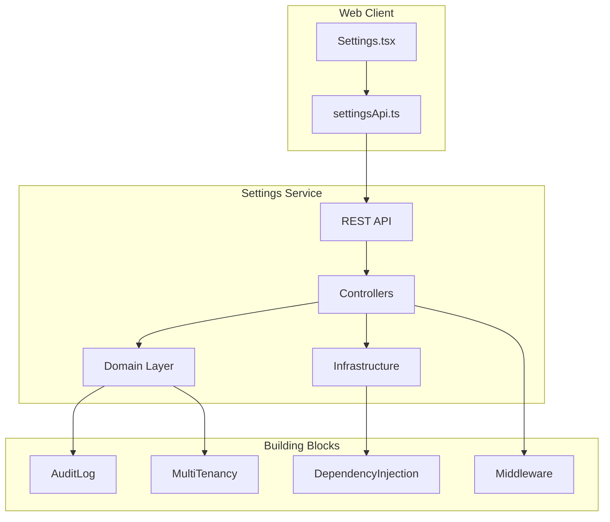
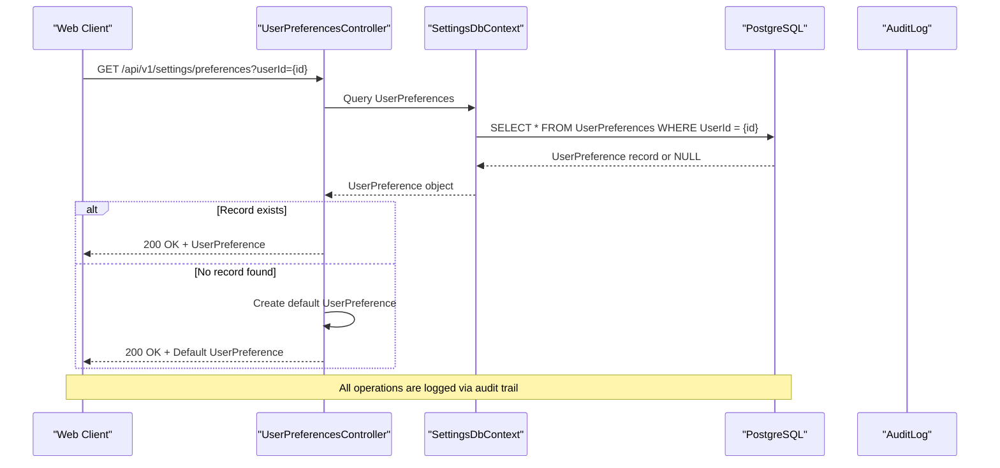
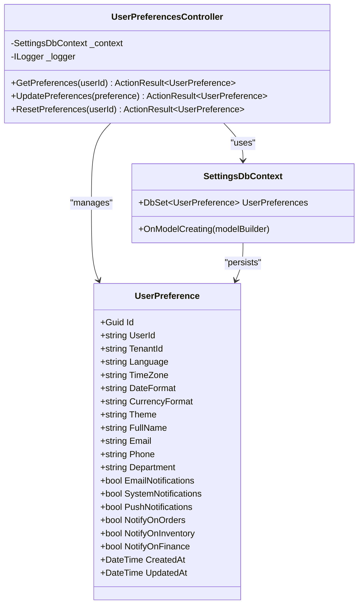
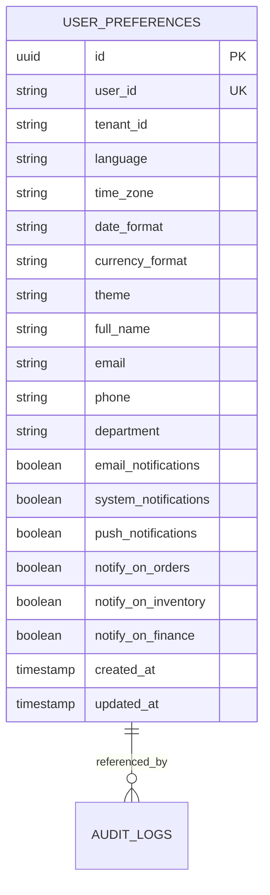
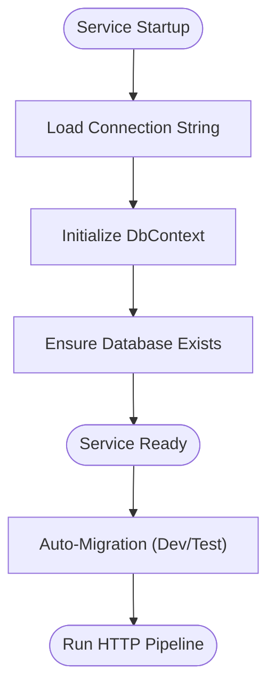
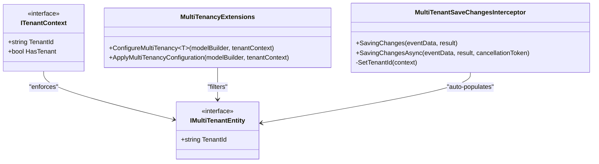
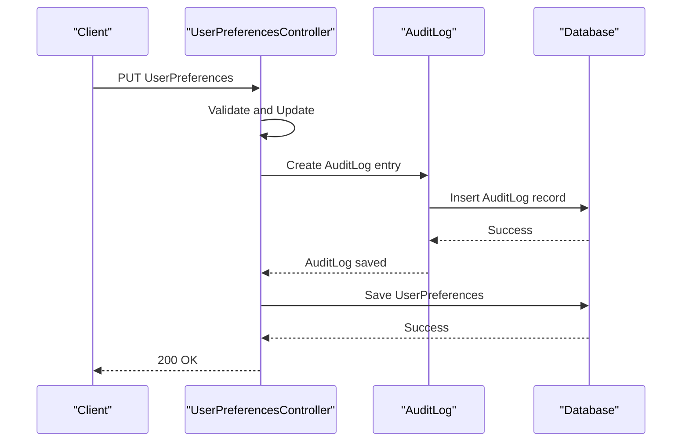
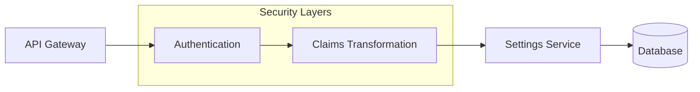

# Settings Service API

<cite>
**Referenced Files in This Document**
- [Program.cs](file://src/Services/Settings/ErpSystem.Settings/Program.cs)
- [appsettings.json](file://src/Services/Settings/ErpSystem.Settings/appsettings.json)
- [appsettings.Development.json](file://src/Services/Settings/ErpSystem.Settings/appsettings.Development.json)
- [ErpSystem.Settings.csproj](file://src/Services/Settings/ErpSystem.Settings/ErpSystem.Settings.csproj)
- [UserPreferencesController.cs](file://src/Services/Settings/ErpSystem.Settings/Controllers/UserPreferencesController.cs)
- [UserPreference.cs](file://src/Services/Settings/ErpSystem.Settings/Domain/UserPreference.cs)
- [SettingsDbContext.cs](file://src/Services/Settings/ErpSystem.Settings/Infrastructure/SettingsDbContext.cs)
- [settingsApi.ts](file://src/Web/ErpSystem.Web/src/api/settingsApi.ts)
- [Settings.tsx](file://src/Web/ErpSystem.Web/src/pages/Settings.tsx)
- [AuditLog.cs](file://src/BuildingBlocks/ErpSystem.BuildingBlocks/Auditing/AuditLog.cs)
- [MultiTenancy.cs](file://src/BuildingBlocks/ErpSystem.BuildingBlocks/MultiTenancy/MultiTenancy.cs)
- [DependencyInjection.cs](file://src/BuildingBlocks/ErpSystem.BuildingBlocks/DependencyInjection.cs)
- [Middlewares.cs](file://src/BuildingBlocks/ErpSystem.BuildingBlocks/Middleware/Middlewares.cs)
- [ErpSystem.Settings.http](file://src/Services/Settings/ErpSystem.Settings/ErpSystem.Settings.http)
- [Gateway appsettings.json](file://src/Gateways/ErpSystem.Gateway/appsettings.json)
</cite>

## Table of Contents
1. [Introduction](#introduction)
2. [Project Structure](#project-structure)
3. [Core Components](#core-components)
4. [Architecture Overview](#architecture-overview)
5. [Detailed Component Analysis](#detailed-component-analysis)
6. [API Reference](#api-reference)
7. [Configuration Management](#configuration-management)
8. [Multi-Tenant Isolation](#multi-tenant-isolation)
9. [Audit and Compliance](#audit-and-compliance)
10. [Security and Access Control](#security-and-access-control)
11. [Performance Considerations](#performance-considerations)
12. [Troubleshooting Guide](#troubleshooting-guide)
13. [Conclusion](#conclusion)

## Introduction
The Settings service provides centralized configuration and preference management for the ERP microservices ecosystem. It manages user preferences, system-wide configuration, and tenant-specific settings while maintaining compliance with multi-tenant isolation requirements. The service exposes REST APIs for UI customization, notification settings, personal workspace configuration, and integrates with the broader audit and security framework.

## Project Structure
The Settings service follows a clean architecture pattern with clear separation of concerns:

**Diagram sources**
- [Program.cs](file://src/Services/Settings/ErpSystem.Settings/Program.cs#L1-L50)
- [UserPreferencesController.cs](file://src/Services/Settings/ErpSystem.Settings/Controllers/UserPreferencesController.cs#L1-L101)
- [UserPreference.cs](file://src/Services/Settings/ErpSystem.Settings/Domain/UserPreference.cs#L1-L33)

**Section sources**
- [Program.cs](file://src/Services/Settings/ErpSystem.Settings/Program.cs#L1-L50)
- [ErpSystem.Settings.csproj](file://src/Services/Settings/ErpSystem.Settings/ErpSystem.Settings.csproj#L1-L16)

## Core Components
The Settings service consists of three primary layers:

### Domain Layer
The domain layer defines the core business entities and their behavior. Currently, it contains the UserPreference aggregate that encapsulates all user configuration data.

### Infrastructure Layer
The infrastructure layer handles data persistence and database operations. It includes the SettingsDbContext for Entity Framework configuration and PostgreSQL connectivity.

### Presentation Layer
The presentation layer exposes REST APIs through ASP.NET Core controllers with Swagger documentation support.

**Section sources**
- [UserPreference.cs](file://src/Services/Settings/ErpSystem.Settings/Domain/UserPreference.cs#L1-L33)
- [SettingsDbContext.cs](file://src/Services/Settings/ErpSystem.Settings/Infrastructure/SettingsDbContext.cs#L1-L33)
- [UserPreferencesController.cs](file://src/Services/Settings/ErpSystem.Settings/Controllers/UserPreferencesController.cs#L1-L101)

## Architecture Overview
The Settings service implements a layered architecture with clear boundaries between concerns:

**Diagram sources**
- [UserPreferencesController.cs](file://src/Services/Settings/ErpSystem.Settings/Controllers/UserPreferencesController.cs#L21-L39)
- [SettingsDbContext.cs](file://src/Services/Settings/ErpSystem.Settings/Infrastructure/SettingsDbContext.cs#L14-L31)

## Detailed Component Analysis

### User Preferences Management
The UserPreferencesController provides comprehensive CRUD operations for user configuration data:

**Diagram sources**
- [UserPreferencesController.cs](file://src/Services/Settings/ErpSystem.Settings/Controllers/UserPreferencesController.cs#L10-L19)
- [UserPreference.cs](file://src/Services/Settings/ErpSystem.Settings/Domain/UserPreference.cs#L3-L32)
- [SettingsDbContext.cs](file://src/Services/Settings/ErpSystem.Settings/Infrastructure/SettingsDbContext.cs#L6-L12)

### Database Schema Design
The Settings service uses a normalized approach with proper indexing and constraints:

**Diagram sources**
- [SettingsDbContext.cs](file://src/Services/Settings/ErpSystem.Settings/Infrastructure/SettingsDbContext.cs#L18-L30)
- [AuditLog.cs](file://src/BuildingBlocks/ErpSystem.BuildingBlocks/Auditing/AuditLog.cs#L115-L133)

**Section sources**
- [UserPreferencesController.cs](file://src/Services/Settings/ErpSystem.Settings/Controllers/UserPreferencesController.cs#L21-L99)
- [UserPreference.cs](file://src/Services/Settings/ErpSystem.Settings/Domain/UserPreference.cs#L1-L33)
- [SettingsDbContext.cs](file://src/Services/Settings/ErpSystem.Settings/Infrastructure/SettingsDbContext.cs#L14-L31)

## API Reference

### User Preferences Endpoints

#### Get User Preferences
Retrieves a user's configuration settings with automatic default creation.

**Endpoint:** `GET /api/v1/settings/preferences`
**Query Parameters:**
- `userId` (string, optional): User identifier. Defaults to "default-user"

**Response:** UserPreference object
**Status Codes:**
- 200 OK: Successful retrieval
- 404 Not Found: Invalid user ID
- 500 Internal Server Error: Server error

#### Update User Preferences
Updates existing user preferences or creates new ones.

**Endpoint:** `PUT /api/v1/settings/preferences`
**Request Body:** UserPreference object
**Response:** Updated UserPreference object
**Status Codes:**
- 200 OK: Successful update
- 400 Bad Request: Validation error
- 500 Internal Server Error: Server error

#### Reset User Preferences
Deletes user preferences and returns default configuration.

**Endpoint:** `POST /api/v1/settings/preferences/reset`
**Query Parameters:**
- `userId` (string, optional): User identifier. Defaults to "default-user"

**Response:** Default UserPreference object
**Status Codes:**
- 200 OK: Successful reset
- 500 Internal Server Error: Server error

**Section sources**
- [UserPreferencesController.cs](file://src/Services/Settings/ErpSystem.Settings/Controllers/UserPreferencesController.cs#L21-L99)
- [settingsApi.ts](file://src/Web/ErpSystem.Web/src/api/settingsApi.ts#L26-L41)

## Configuration Management

### Database Configuration
The Settings service uses PostgreSQL with Entity Framework Core for data persistence:

**Diagram sources**
- [Program.cs](file://src/Services/Settings/ErpSystem.Settings/Program.cs#L11-L47)
- [appsettings.json](file://src/Services/Settings/ErpSystem.Settings/appsettings.json#L9-L11)

### Environment Configuration
The service supports multiple environments with different connection string configurations:

**Development Environment:**
- Connection string: `Host=localhost;Database=settingsdb;Username=postgres;Password=postgres`
- Swagger enabled for API documentation
- CORS allows any origin, method, and header

**Production Environment:**
- Connection string configured via environment variables
- CORS restricted to specific origins
- Auto-migration disabled for production safety

**Section sources**
- [appsettings.json](file://src/Services/Settings/ErpSystem.Settings/appsettings.json#L1-L12)
- [appsettings.Development.json](file://src/Services/Settings/ErpSystem.Settings/appsettings.Development.json#L1-L9)
- [Program.cs](file://src/Services/Settings/ErpSystem.Settings/Program.cs#L15-L37)

## Multi-Tenant Isolation
The Settings service implements comprehensive multi-tenant isolation through several mechanisms:

### Tenant Context Implementation

**Diagram sources**
- [MultiTenancy.cs](file://src/BuildingBlocks/ErpSystem.BuildingBlocks/MultiTenancy/MultiTenancy.cs#L12-L63)

### Tenant Isolation Features
- **Global Query Filters**: Automatic tenant filtering on all multi-tenant entities
- **Automatic Tenant Assignment**: TenantId auto-populated on new entity creation
- **Cross-Tenant Protection**: Prevents data leakage between tenants
- **Index Optimization**: Dedicated tenant_id indexes for efficient querying

**Section sources**
- [MultiTenancy.cs](file://src/BuildingBlocks/ErpSystem.BuildingBlocks/MultiTenancy/MultiTenancy.cs#L34-L62)
- [SettingsDbContext.cs](file://src/Services/Settings/ErpSystem.Settings/Infrastructure/SettingsDbContext.cs#L20-L24)

## Audit and Compliance

### Audit Trail Implementation
The Settings service maintains comprehensive audit logs for all configuration changes:

**Diagram sources**
- [AuditLog.cs](file://src/BuildingBlocks/ErpSystem.BuildingBlocks/Auditing/AuditLog.cs#L28-L40)

### Audit Log Schema
The audit system tracks:
- Entity type and ID for correlation
- User identity and tenant context
- IP address and user agent for security
- Old and new values for change tracking
- Timestamp for chronological ordering

**Section sources**
- [AuditLog.cs](file://src/BuildingBlocks/ErpSystem.BuildingBlocks/Auditing/AuditLog.cs#L12-L24)
- [AuditLog.cs](file://src/BuildingBlocks/ErpSystem.BuildingBlocks/Auditing/AuditLog.cs#L115-L133)

## Security and Access Control

### Authentication and Authorization
The Settings service integrates with the central authentication system:

**Diagram sources**
- [DependencyInjection.cs](file://src/BuildingBlocks/ErpSystem.BuildingBlocks/DependencyInjection.cs#L24-L26)

### Security Features
- **CORS Configuration**: Flexible in development, restrictive in production
- **Input Validation**: Automatic validation through FluentValidation
- **Error Handling**: Centralized exception handling with appropriate status codes
- **Audit Logging**: Complete audit trail for all sensitive operations

**Section sources**
- [Program.cs](file://src/Services/Settings/ErpSystem.Settings/Program.cs#L15-L24)
- [Middlewares.cs](file://src/BuildingBlocks/ErpSystem.BuildingBlocks/Middleware/Middlewares.cs#L79-L123)

## Performance Considerations

### Database Optimization
- **Unique Indexes**: UserId uniqueness ensures fast lookups
- **String Length Limits**: Appropriate field sizing prevents storage bloat
- **Timestamp Tracking**: Efficient change detection and caching
- **Connection Pooling**: Optimized database connections through Entity Framework

### Caching Strategy
- **In-Memory Caching**: Recommended for frequently accessed user preferences
- **ETag Support**: Conditional requests for cache validation
- **Cache Expiration**: Intelligent TTL based on user activity patterns

### Scalability Guidelines
- **Horizontal Scaling**: Stateless service design supports multiple instances
- **Database Read Replicas**: Consider for high-read preference workloads
- **Connection Limits**: Monitor and adjust based on concurrent user load

## Troubleshooting Guide

### Common Issues and Solutions

#### Database Connection Problems
**Symptoms:** Service fails to start or returns connection errors
**Solutions:**
- Verify PostgreSQL server is running
- Check connection string format and credentials
- Ensure database exists and is accessible
- Review network connectivity between service and database

#### CORS Configuration Issues
**Symptoms:** Browser returns CORS errors for API calls
**Solutions:**
- Verify client origin matches CORS policy
- Check environment-specific CORS settings
- Ensure preflight requests are properly handled

#### Validation Errors
**Symptoms:** API returns 400 errors with validation messages
**Solutions:**
- Validate input data against UserPreference schema
- Check required fields and data types
- Review constraint violations (string lengths, boolean values)

#### Multi-Tenant Isolation Issues
**Symptoms:** Users can see each other's data
**Solutions:**
- Verify tenant context is properly set
- Check global query filters are applied
- Ensure TenantId is correctly populated on new records

**Section sources**
- [Middlewares.cs](file://src/BuildingBlocks/ErpSystem.BuildingBlocks/Middleware/Middlewares.cs#L79-L123)
- [Program.cs](file://src/Services/Settings/ErpSystem.Settings/Program.cs#L39-L47)

## Conclusion
The Settings service provides a robust foundation for configuration and preference management in the ERP ecosystem. Its clean architecture, comprehensive multi-tenant isolation, and integrated audit capabilities make it suitable for enterprise-scale deployments. The service's modular design allows for easy extension to support additional configuration types, business rules, and integration scenarios as the system evolves.

Key strengths include:
- **Comprehensive Multi-Tenant Support**: Built-in tenant isolation prevents data leakage
- **Audit-Ready Design**: Complete change tracking for compliance requirements
- **Flexible Configuration**: Extensible schema supports various preference types
- **Production-Ready Features**: Proper error handling, validation, and security measures
- **Developer-Friendly**: Clear API design with Swagger documentation and TypeScript client integration

The service serves as a critical component in the ERP architecture, enabling personalized user experiences while maintaining strict security and compliance standards across all tenant environments.