# Architecture Documentation

<cite>
**Referenced Files in This Document**
- [README.md](file://README.md)
- [Program.cs](file://src/Gateways/ErpSystem.Gateway/Program.cs)
- [Program.cs](file://src/Services/Finance/ErpSystem.Finance/Program.cs)
- [Program.cs](file://src/Services/Identity/ErpSystem.Identity/Program.cs)
- [DependencyInjection.cs](file://src/BuildingBlocks/ErpSystem.BuildingBlocks/DependencyInjection.cs)
- [DaprEventBus.cs](file://src/BuildingBlocks/ErpSystem.BuildingBlocks/EventBus/DaprEventBus.cs)
- [DDDBase.cs](file://src/BuildingBlocks/ErpSystem.BuildingBlocks/Domain/DDDBase.cs)
- [Abstractions.cs](file://src/BuildingBlocks/ErpSystem.BuildingBlocks/CQRS/Abstractions.cs)
- [MultiTenancy.cs](file://src/BuildingBlocks/ErpSystem.BuildingBlocks/MultiTenancy/MultiTenancy.cs)
- [OutboxProcessor.cs](file://src/BuildingBlocks/ErpSystem.BuildingBlocks/Outbox/OutboxProcessor.cs)
- [ResiliencePolicies.cs](file://src/BuildingBlocks/ErpSystem.BuildingBlocks/Resilience/ResiliencePolicies.cs)
- [ObservabilityExtensions.cs](file://src/BuildingBlocks/ErpSystem.BuildingBlocks/Observability/ObservabilityExtensions.cs)
- [pubsub.yaml](file://components/pubsub.yaml)
- [gateway.yaml](file://deploy/k8s/services/gateway.yaml)
- [values.yaml](file://deploy/helm/erp-system/values.yaml)
</cite>

## Table of Contents
1. [Introduction](#introduction)
2. [Project Structure](#project-structure)
3. [Core Components](#core-components)
4. [Architecture Overview](#architecture-overview)
5. [Detailed Component Analysis](#detailed-component-analysis)
6. [Dependency Analysis](#dependency-analysis)
7. [Performance Considerations](#performance-considerations)
8. [Troubleshooting Guide](#troubleshooting-guide)
9. [Conclusion](#conclusion)
10. [Appendices](#appendices)

## Introduction
This document describes the architecture of a cloud-native ERP microservices system built with .NET 10, Dapr, and Kubernetes. It explains the high-level design patterns (Event-Driven Architecture, Domain-Driven Design, CQRS, and Clean Architecture) and documents the microservices ecosystem, inter-service communication via Dapr’s publish-subscribe, the gateway layer using YARP, service discovery and load balancing, enterprise building blocks (shared kernel), resilience strategies, multi-tenancy, and deployment topology. Cross-cutting concerns such as security, observability, and disaster recovery are addressed.

## Project Structure
The repository is organized around a solution containing:
- A shared building blocks library implementing enterprise patterns and infrastructure
- A YARP gateway service
- 15+ independently deployable microservices grouped by business capabilities
- Kubernetes and Helm artifacts for deployment

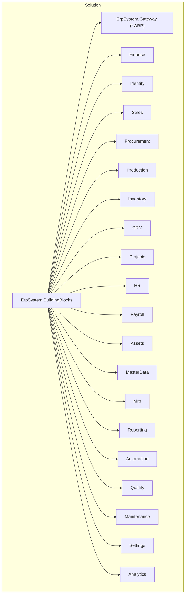

**Diagram sources**
- [README.md](file://README.md#L289-L322)
- [Program.cs](file://src/Gateways/ErpSystem.Gateway/Program.cs#L1-L107)
- [Program.cs](file://src/Services/Finance/ErpSystem.Finance/Program.cs#L1-L86)
- [Program.cs](file://src/Services/Identity/ErpSystem.Identity/Program.cs#L1-L71)

**Section sources**
- [README.md](file://README.md#L289-L322)

## Core Components
- Shared Kernel (Enterprise Building Blocks): Provides cross-cutting concerns including CQRS abstractions, DDD base classes, event bus, outbox, multi-tenancy, resilience policies, caching, auditing, middleware, and observability extensions.
- Microservices: Each service encapsulates a bounded context with separate write/read models, event sourcing, and domain-driven design.
- Gateway: YARP reverse proxy with resilience policies and rate limiting.
- Dapr Integration: Event bus via Redis pub/sub, enabling decoupled inter-service messaging.

Key implementation references:
- CQRS abstractions: [Abstractions.cs](file://src/BuildingBlocks/ErpSystem.BuildingBlocks/CQRS/Abstractions.cs#L1-L39)
- DDD base classes and event store: [DDDBase.cs](file://src/BuildingBlocks/ErpSystem.BuildingBlocks/Domain/DDDBase.cs#L1-L137)
- Event bus abstraction and implementation: [DaprEventBus.cs](file://src/BuildingBlocks/ErpSystem.BuildingBlocks/EventBus/DaprEventBus.cs#L1-L31)
- Outbox background processor: [OutboxProcessor.cs](file://src/BuildingBlocks/ErpSystem.BuildingBlocks/Outbox/OutboxProcessor.cs#L1-L72)
- Multi-tenancy helpers: [MultiTenancy.cs](file://src/BuildingBlocks/ErpSystem.BuildingBlocks/MultiTenancy/MultiTenancy.cs#L1-L100)
- Resilience policies: [ResiliencePolicies.cs](file://src/BuildingBlocks/ErpSystem.BuildingBlocks/Resilience/ResiliencePolicies.cs#L1-L111)
- Observability extensions: [ObservabilityExtensions.cs](file://src/BuildingBlocks/ErpSystem.BuildingBlocks/Observability/ObservabilityExtensions.cs#L1-L44)

**Section sources**
- [Abstractions.cs](file://src/BuildingBlocks/ErpSystem.BuildingBlocks/CQRS/Abstractions.cs#L1-L39)
- [DDDBase.cs](file://src/BuildingBlocks/ErpSystem.BuildingBlocks/Domain/DDDBase.cs#L1-L137)
- [DaprEventBus.cs](file://src/BuildingBlocks/ErpSystem.BuildingBlocks/EventBus/DaprEventBus.cs#L1-L31)
- [OutboxProcessor.cs](file://src/BuildingBlocks/ErpSystem.BuildingBlocks/Outbox/OutboxProcessor.cs#L1-L72)
- [MultiTenancy.cs](file://src/BuildingBlocks/ErpSystem.BuildingBlocks/MultiTenancy/MultiTenancy.cs#L1-L100)
- [ResiliencePolicies.cs](file://src/BuildingBlocks/ErpSystem.BuildingBlocks/Resilience/ResiliencePolicies.cs#L1-L111)
- [ObservabilityExtensions.cs](file://src/BuildingBlocks/ErpSystem.BuildingBlocks/Observability/ObservabilityExtensions.cs#L1-L44)

## Architecture Overview
The system follows:
- Event-Driven Architecture: Services publish domain events via Dapr pub/sub; consumers subscribe and react asynchronously.
- Domain-Driven Design: Aggregates, domain events, and repositories encapsulate business logic.
- CQRS: Separate command and query handlers with MediatR; event sourcing for auditability and temporal queries.
- Clean Architecture: Presentation (controllers), Application (commands/queries), Domain (models/events), Infrastructure (persistence, projections).

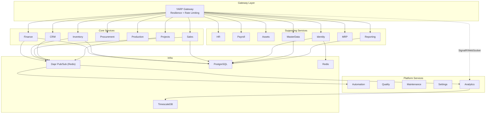

**Diagram sources**
- [README.md](file://README.md#L130-L183)
- [Program.cs](file://src/Gateways/ErpSystem.Gateway/Program.cs#L22-L58)
- [pubsub.yaml](file://components/pubsub.yaml#L1-L13)

**Section sources**
- [README.md](file://README.md#L130-L183)

## Detailed Component Analysis

### Gateway Layer (YARP)
- Purpose: Central entrypoint for client traffic, routing to backend services, resilience, rate limiting, and health checks.
- Resilience: Standardized retry, circuit breaker, and timeout pipelines configured for outgoing HTTP calls.
- Load Balancing: Kubernetes service exposes gateway as a LoadBalancer; multiple replicas provide HA.
- Security: HTTPS redirection and CORS configured; health endpoint exposed for probes.

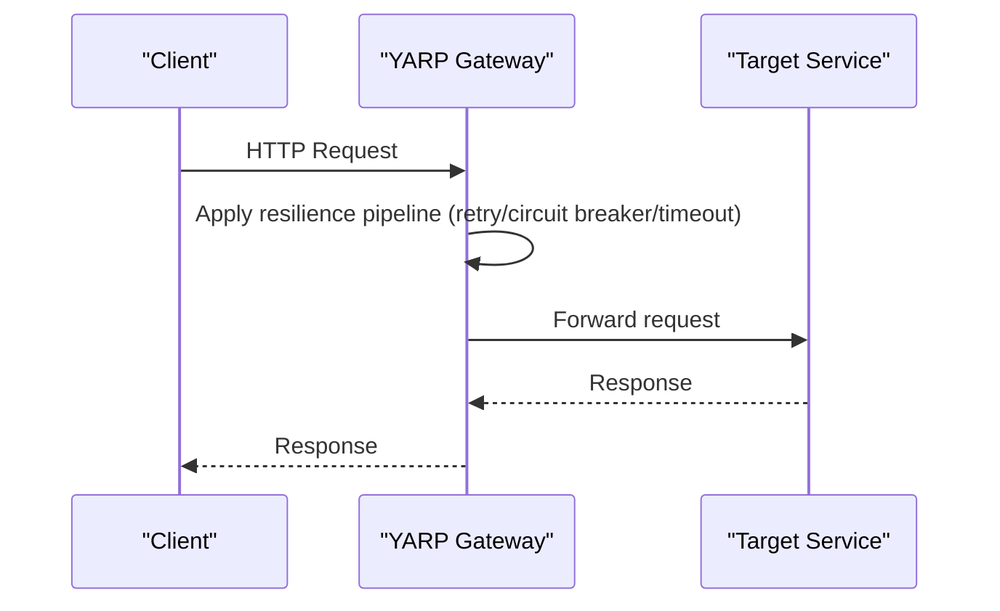

**Diagram sources**
- [Program.cs](file://src/Gateways/ErpSystem.Gateway/Program.cs#L31-L58)
- [gateway.yaml](file://deploy/k8s/services/gateway.yaml#L48-L60)

**Section sources**
- [Program.cs](file://src/Gateways/ErpSystem.Gateway/Program.cs#L1-L107)
- [gateway.yaml](file://deploy/k8s/services/gateway.yaml#L1-L60)

### Event Bus and Inter-Service Communication
- Event Bus: Dapr pub/sub component backed by Redis; services publish domain events using a shared IEventBus abstraction.
- Topics: Topic names derived from event type names; subscribers consume asynchronously.
- Outbox: Background processor publishes pending outbox messages reliably.

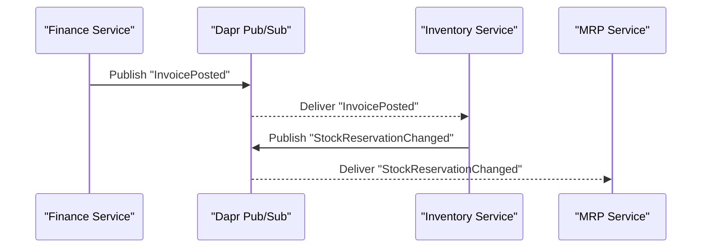

**Diagram sources**
- [DaprEventBus.cs](file://src/BuildingBlocks/ErpSystem.BuildingBlocks/EventBus/DaprEventBus.cs#L11-L21)
- [pubsub.yaml](file://components/pubsub.yaml#L1-L13)
- [OutboxProcessor.cs](file://src/BuildingBlocks/ErpSystem.BuildingBlocks/Outbox/OutboxProcessor.cs#L29-L70)

**Section sources**
- [DaprEventBus.cs](file://src/BuildingBlocks/ErpSystem.BuildingBlocks/EventBus/DaprEventBus.cs#L1-L31)
- [pubsub.yaml](file://components/pubsub.yaml#L1-L13)
- [OutboxProcessor.cs](file://src/BuildingBlocks/ErpSystem.BuildingBlocks/Outbox/OutboxProcessor.cs#L1-L72)

### Domain-Driven Design and Event Sourcing
- Aggregates and Domain Events: Base classes define aggregate roots, change tracking, and event replay.
- Event Store: Persists event streams and publishes domain events to the bus; also triggers MediatR notifications.
- Repositories: Typed repositories wrap the event store for aggregates.

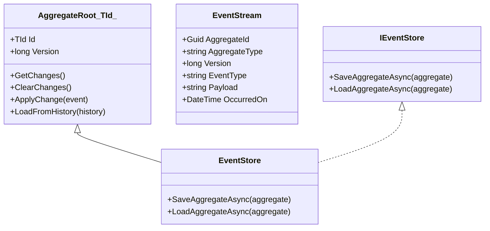

**Diagram sources**
- [DDDBase.cs](file://src/BuildingBlocks/ErpSystem.BuildingBlocks/Domain/DDDBase.cs#L14-L120)

**Section sources**
- [DDDBase.cs](file://src/BuildingBlocks/ErpSystem.BuildingBlocks/Domain/DDDBase.cs#L1-L137)

### CQRS Implementation
- Commands and Queries: Strongly-typed abstractions for write/read operations.
- Handlers: MediatR handlers implement application use cases; infrastructure handlers excluded from some services as needed.
- Finance Example: MediatR configured with handlers from application assemblies; event store repository injected for persistence.

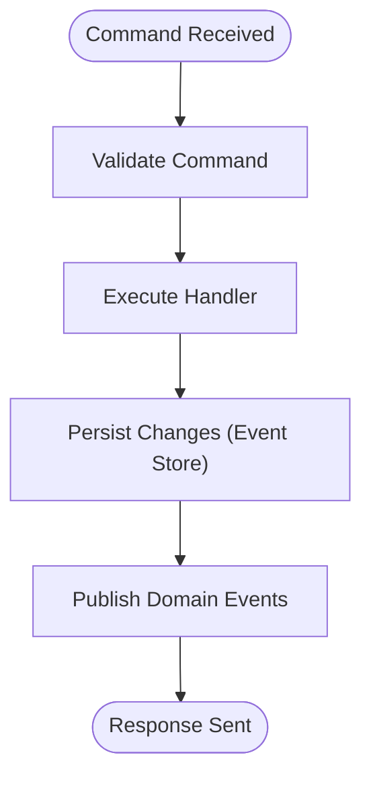

**Diagram sources**
- [Abstractions.cs](file://src/BuildingBlocks/ErpSystem.BuildingBlocks/CQRS/Abstractions.cs#L7-L38)
- [Program.cs](file://src/Services/Finance/ErpSystem.Finance/Program.cs#L30-L35)

**Section sources**
- [Abstractions.cs](file://src/BuildingBlocks/ErpSystem.BuildingBlocks/CQRS/Abstractions.cs#L1-L39)
- [Program.cs](file://src/Services/Finance/ErpSystem.Finance/Program.cs#L29-L35)

### Multi-Tenancy
- Tenant Isolation: Global query filters and save-change interceptor ensure all multi-tenant entities are scoped to the current tenant.
- Usage: Configure tenant context in model building; interceptor sets TenantId on new entities.

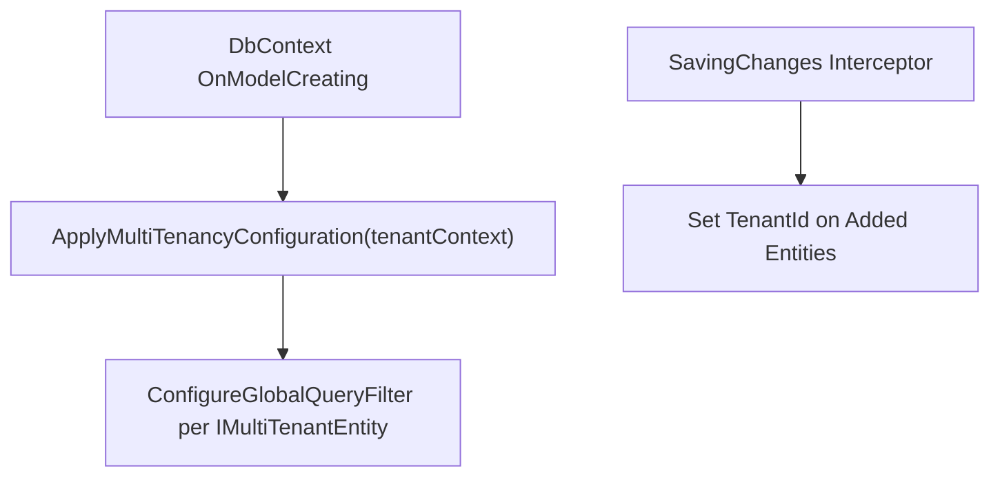

**Diagram sources**
- [MultiTenancy.cs](file://src/BuildingBlocks/ErpSystem.BuildingBlocks/MultiTenancy/MultiTenancy.cs#L29-L63)
- [MultiTenancy.cs](file://src/BuildingBlocks/ErpSystem.BuildingBlocks/MultiTenancy/MultiTenancy.cs#L68-L99)

**Section sources**
- [MultiTenancy.cs](file://src/BuildingBlocks/ErpSystem.BuildingBlocks/MultiTenancy/MultiTenancy.cs#L1-L100)

### Resilience Strategies
- Policies: Pre-built resilience pipelines for retry, circuit breaker, and timeout using Polly and the new ResiliencePipelineBuilder.
- Gateway: Standardized resilience pipeline applied to all outbound calls.
- HTTP Pipelines: Dedicated pipelines handle transient HTTP errors.

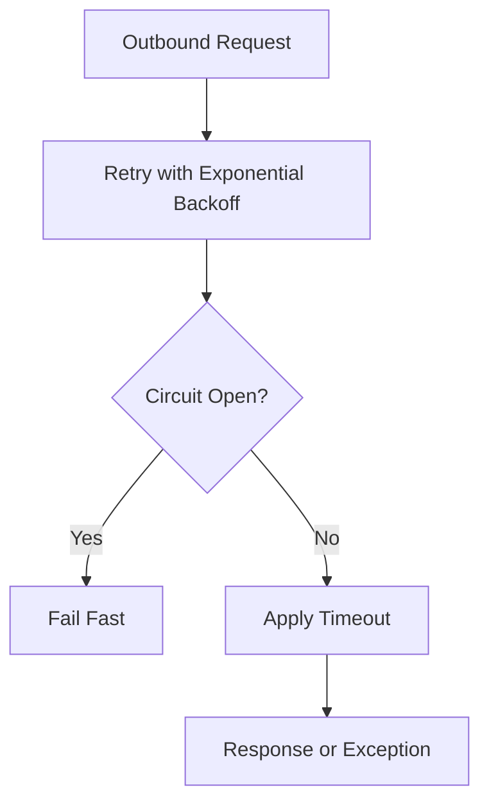

**Diagram sources**
- [ResiliencePolicies.cs](file://src/BuildingBlocks/ErpSystem.BuildingBlocks/Resilience/ResiliencePolicies.cs#L18-L90)
- [Program.cs](file://src/Gateways/ErpSystem.Gateway/Program.cs#L31-L58)

**Section sources**
- [ResiliencePolicies.cs](file://src/BuildingBlocks/ErpSystem.BuildingBlocks/Resilience/ResiliencePolicies.cs#L1-L111)
- [Program.cs](file://src/Gateways/ErpSystem.Gateway/Program.cs#L29-L58)

### Observability
- Logging, Metrics, Tracing: OpenTelemetry integration for logs, metrics, and distributed tracing.
- Exporters: OTLP exporter configured; set environment variable for endpoint in deployment.
- Service Tagging: Resource builder adds service name for telemetry correlation.

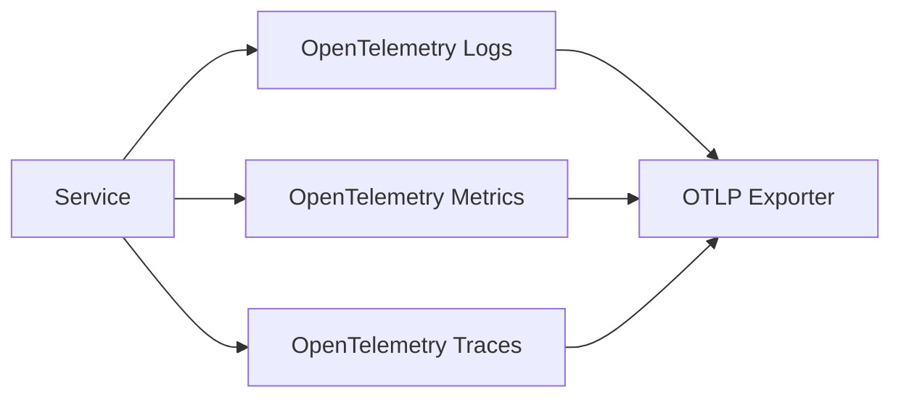

**Diagram sources**
- [ObservabilityExtensions.cs](file://src/BuildingBlocks/ErpSystem.BuildingBlocks/Observability/ObservabilityExtensions.cs#L12-L42)

**Section sources**
- [ObservabilityExtensions.cs](file://src/BuildingBlocks/ErpSystem.BuildingBlocks/Observability/ObservabilityExtensions.cs#L1-L44)

### Deployment Topology
- Kubernetes: Namespace, configmaps/secrets, ingress, and per-service deployments.
- Helm: Chart with service replicas, images, ingress, PostgreSQL/Redis, and Dapr configuration.
- Gateway: Exposed via LoadBalancer service; replicas for HA.

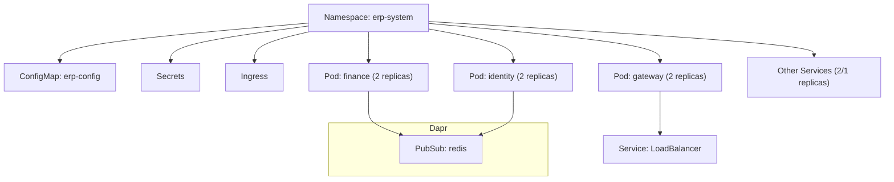

**Diagram sources**
- [values.yaml](file://deploy/helm/erp-system/values.yaml#L1-L127)
- [gateway.yaml](file://deploy/k8s/services/gateway.yaml#L1-L60)

**Section sources**
- [values.yaml](file://deploy/helm/erp-system/values.yaml#L1-L127)
- [gateway.yaml](file://deploy/k8s/services/gateway.yaml#L1-L60)

## Dependency Analysis
The shared building blocks library is consumed by all services and the gateway. Services depend on Dapr for eventing and on databases for persistence. The gateway depends on resilience policies and rate limiting.

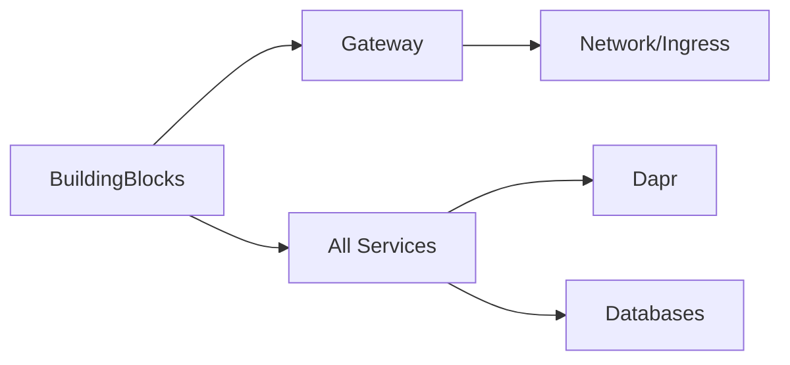

**Diagram sources**
- [DependencyInjection.cs](file://src/BuildingBlocks/ErpSystem.BuildingBlocks/DependencyInjection.cs#L10-L29)
- [Program.cs](file://src/Services/Finance/ErpSystem.Finance/Program.cs#L26-L46)
- [Program.cs](file://src/Services/Identity/ErpSystem.Identity/Program.cs#L26-L37)

**Section sources**
- [DependencyInjection.cs](file://src/BuildingBlocks/ErpSystem.BuildingBlocks/DependencyInjection.cs#L1-L31)
- [Program.cs](file://src/Services/Finance/ErpSystem.Finance/Program.cs#L26-L46)
- [Program.cs](file://src/Services/Identity/ErpSystem.Identity/Program.cs#L26-L37)

## Performance Considerations
- Event Sourcing: Efficient for auditability and temporal queries; batch writes and controlled replay improve performance.
- CQRS: Separation reduces contention; optimize projections and read models for frequent queries.
- Resilience: Proper backoff and circuit breaking prevent cascading failures and reduce tail latency.
- Caching: Distributed cache extensions support hot-path reads; tune TTL and invalidation strategies.
- Observability: Instrument critical paths; use metrics to detect hotspots and traces for latency analysis.

## Troubleshooting Guide
- Event Delivery Issues:
  - Verify Dapr pub/sub component configuration and Redis connectivity.
  - Confirm topic names match event type names.
  - Inspect outbox processor logs for failed messages and retry behavior.
- Multi-Tenant Data Leakage:
  - Ensure tenant context is set for all requests.
  - Validate global query filters and interceptor behavior.
- Resilience Failures:
  - Review circuit breaker state and recent failures.
  - Adjust retry attempts and timeouts based on service SLAs.
- Observability Gaps:
  - Confirm OTLP exporter endpoint and service name tagging.
  - Enable structured logging and ensure scopes are included.

**Section sources**
- [pubsub.yaml](file://components/pubsub.yaml#L1-L13)
- [OutboxProcessor.cs](file://src/BuildingBlocks/ErpSystem.BuildingBlocks/Outbox/OutboxProcessor.cs#L1-L72)
- [MultiTenancy.cs](file://src/BuildingBlocks/ErpSystem.BuildingBlocks/MultiTenancy/MultiTenancy.cs#L1-L100)
- [ResiliencePolicies.cs](file://src/BuildingBlocks/ErpSystem.BuildingBlocks/Resilience/ResiliencePolicies.cs#L1-L111)
- [ObservabilityExtensions.cs](file://src/BuildingBlocks/ErpSystem.BuildingBlocks/Observability/ObservabilityExtensions.cs#L1-L44)

## Conclusion
The ERP system employs robust cloud-native patterns: Event-Driven Architecture with Dapr pub/sub, Domain-Driven Design with event sourcing, CQRS with MediatR, and Clean Architecture layered services. The shared building blocks encapsulate enterprise-grade cross-cutting concerns including multi-tenancy, resilience, observability, and outbox processing. The gateway provides centralized routing, resilience, and security, while Kubernetes and Helm enable scalable, repeatable deployments.

## Appendices
- Additional service examples:
  - Identity service bootstrapping and event store registration: [Program.cs](file://src/Services/Identity/ErpSystem.Identity/Program.cs#L11-L41)
  - Finance service event store and mediator configuration: [Program.cs](file://src/Services/Finance/ErpSystem.Finance/Program.cs#L20-L49)
- Shared kernel initialization:
  - Building blocks registration across assemblies: [DependencyInjection.cs](file://src/BuildingBlocks/ErpSystem.BuildingBlocks/DependencyInjection.cs#L12-L28)