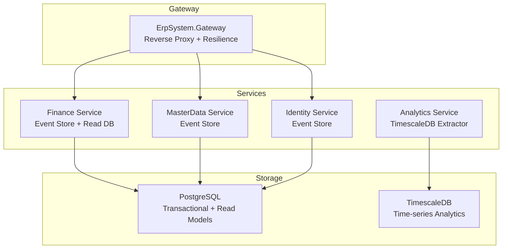
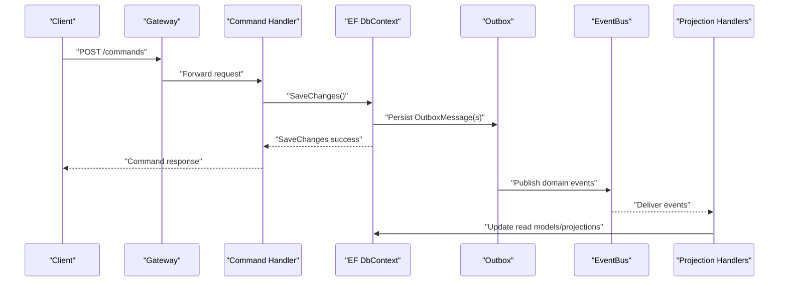
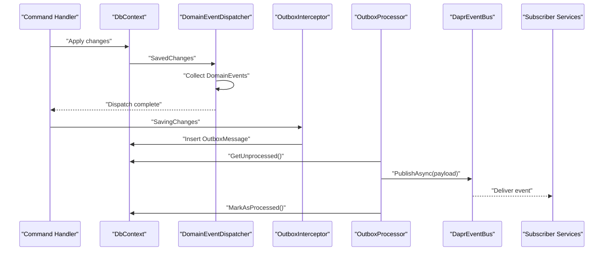
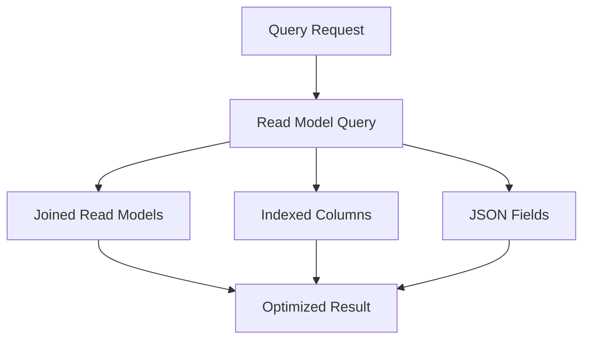
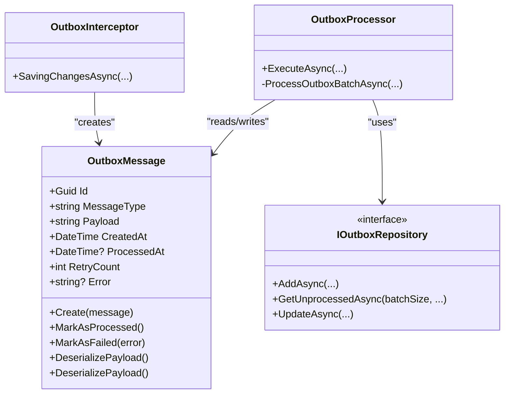
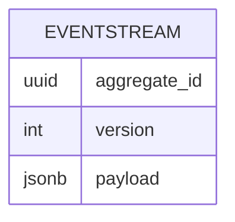
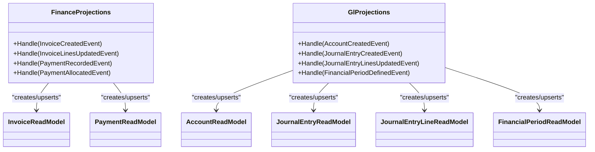
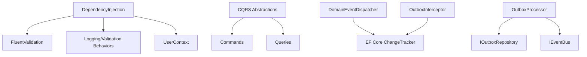

# Data Flow and Storage Design

<cite>
**Referenced Files in This Document**
- [Program.cs](file://src/Gateways/ErpSystem.Gateway/Program.cs)
- [DependencyInjection.cs](file://src/BuildingBlocks/ErpSystem.BuildingBlocks/DependencyInjection.cs)
- [Abstractions.cs](file://src/BuildingBlocks/ErpSystem.BuildingBlocks/CQRS/Abstractions.cs)
- [DomainEventDispatcher.cs](file://src/BuildingBlocks/ErpSystem.BuildingBlocks/Domain/DomanEventDispatcher.cs)
- [OutboxMessage.cs](file://src/BuildingBlocks/ErpSystem.BuildingBlocks/Outbox/OutboxMessage.cs)
- [OutboxInterceptor.cs](file://src/BuildingBlocks/ErpSystem.BuildingBlocks/Outbox/OutboxInterceptor.cs)
- [OutboxProcessor.cs](file://src/BuildingBlocks/ErpSystem.BuildingBlocks/Outbox/OutboxProcessor.cs)
- [DaprEventBus.cs](file://src/BuildingBlocks/ErpSystem.BuildingBlocks/EventBus/DaprEventBus.cs)
- [Persistence.cs](file://src/Services/Finance/ErpSystem.Finance/Infrastructure/Persistence.cs)
- [Projections.cs](file://src/Services/Finance/ErpSystem.Finance/Infrastructure/Projections.cs)
- [GLProjections.cs](file://src/Services/Finance/ErpSystem.Finance/Infrastructure/GLProjections.cs)
- [EventStore.cs](file://src/Services/MasterData/ErpSystem.MasterData/Infrastructure/EventStore.cs)
- [EventStore.cs](file://src/Services/Identity/ErpSystem.Identity/Infrastructure/EventStore.cs)
- [TimescaleDataExtractor.cs](file://src/Services/Analytics/ErpSystem.Analytics/Infrastructure/TimescaleDataExtractor.cs)
</cite>

## Table of Contents
1. [Introduction](#introduction)
2. [Project Structure](#project-structure)
3. [Core Components](#core-components)
4. [Architecture Overview](#architecture-overview)
5. [Detailed Component Analysis](#detailed-component-analysis)
6. [Dependency Analysis](#dependency-analysis)
7. [Performance Considerations](#performance-considerations)
8. [Troubleshooting Guide](#troubleshooting-guide)
9. [Conclusion](#conclusion)
10. [Appendices](#appendices)

## Introduction
This document explains the data flow architecture and storage design across the enterprise ERP microservices. It covers the write path from client requests through the API Gateway to service commands, event sourcing, and the Outbox pattern for reliable event publishing. It also documents the read path from queries to optimized read models and projection tables, the dual-database strategy using PostgreSQL for transactional data and TimescaleDB for time-series analytics, event sourcing with complete audit trails and temporal queries, projection strategies, consistency patterns, eventual consistency handling, conflict resolution, data migrations, schema evolution, and backup/recovery procedures.

## Project Structure
The system is organized into:
- Gateways: Centralized reverse proxy and resilience policies
- Building Blocks: Cross-cutting concerns (CQRS, Outbox, Domain Events, EventBus)
- Services: Feature-specific bounded contexts with separate event stores and read models
- Analytics: TimescaleDB-backed extraction for time-series analytics



**Diagram sources**
- [Program.cs](file://src/Gateways/ErpSystem.Gateway/Program.cs#L22-L24)
- [Persistence.cs](file://src/Services/Finance/ErpSystem.Finance/Infrastructure/Persistence.cs#L6-L50)
- [EventStore.cs](file://src/Services/MasterData/ErpSystem.MasterData/Infrastructure/EventStore.cs#L6-L18)
- [EventStore.cs](file://src/Services/Identity/ErpSystem.Identity/Infrastructure/EventStore.cs#L6-L18)
- [TimescaleDataExtractor.cs](file://src/Services/Analytics/ErpSystem.Analytics/Infrastructure/TimescaleDataExtractor.cs#L8-L10)

**Section sources**
- [Program.cs](file://src/Gateways/ErpSystem.Gateway/Program.cs#L1-L107)
- [Persistence.cs](file://src/Services/Finance/ErpSystem.Finance/Infrastructure/Persistence.cs#L1-L132)
- [EventStore.cs](file://src/Services/MasterData/ErpSystem.MasterData/Infrastructure/EventStore.cs#L1-L19)
- [EventStore.cs](file://src/Services/Identity/ErpSystem.Identity/Infrastructure/EventStore.cs#L1-L19)
- [TimescaleDataExtractor.cs](file://src/Services/Analytics/ErpSystem.Analytics/Infrastructure/TimescaleDataExtractor.cs#L1-L142)

## Core Components
- CQRS abstractions define command/query contracts used by all services
- Domain Event Dispatcher publishes domain events after SaveChanges
- Outbox pattern persists events alongside writes and asynchronously publishes them
- Dapr EventBus integrates with Pub/Sub for cross-service messaging
- Event Stores persist immutable event streams per aggregate
- Read databases host normalized read models and optimized indexes
- Analytics extractor queries TimescaleDB for time-series insights

**Section sources**
- [Abstractions.cs](file://src/BuildingBlocks/ErpSystem.BuildingBlocks/CQRS/Abstractions.cs#L1-L39)
- [DomainEventDispatcher.cs](file://src/BuildingBlocks/ErpSystem.BuildingBlocks/Domain/DomainEventDispatcher.cs#L1-L72)
- [OutboxMessage.cs](file://src/BuildingBlocks/ErpSystem.BuildingBlocks/Outbox/OutboxMessage.cs#L1-L82)
- [OutboxInterceptor.cs](file://src/BuildingBlocks/ErpSystem.BuildingBlocks/Outbox/OutboxInterceptor.cs#L1-L51)
- [OutboxProcessor.cs](file://src/BuildingBlocks/ErpSystem.BuildingBlocks/Outbox/OutboxProcessor.cs#L1-L72)
- [DaprEventBus.cs](file://src/BuildingBlocks/ErpSystem.BuildingBlocks/EventBus/DaprEventBus.cs#L1-L31)
- [EventStore.cs](file://src/Services/MasterData/ErpSystem.MasterData/Infrastructure/EventStore.cs#L6-L18)
- [EventStore.cs](file://src/Services/Identity/ErpSystem.Identity/Infrastructure/EventStore.cs#L6-L18)
- [Persistence.cs](file://src/Services/Finance/ErpSystem.Finance/Infrastructure/Persistence.cs#L6-L50)
- [TimescaleDataExtractor.cs](file://src/Services/Analytics/ErpSystem.Analytics/Infrastructure/TimescaleDataExtractor.cs#L8-L10)

## Architecture Overview
The system follows a CQRS + Event Sourcing architecture with a dual-database strategy:
- Write path: Clients send commands via the Gateway; handlers apply domain changes, emit domain events, persist them in the Outbox, and publish via EventBus. Event handlers update read models and projection tables.
- Read path: Queries target read-optimized models with indexes and JSON fields for denormalized views.
- Analytics: TimescaleDB ingests time-series data for forecasting and dashboards.



**Diagram sources**
- [Program.cs](file://src/Gateways/ErpSystem.Gateway/Program.cs#L22-L24)
- [DomainEventDispatcher.cs](file://src/BuildingBlocks/ErpSystem.BuildingBlocks/Domain/DomainEventDispatcher.cs#L17-L43)
- [OutboxInterceptor.cs](file://src/BuildingBlocks/ErpSystem.BuildingBlocks/Outbox/OutboxInterceptor.cs#L8-L50)
- [OutboxProcessor.cs](file://src/BuildingBlocks/ErpSystem.BuildingBlocks/Outbox/OutboxProcessor.cs#L8-L72)
- [DaprEventBus.cs](file://src/BuildingBlocks/ErpSystem.BuildingBlocks/EventBus/DaprEventBus.cs#L11-L21)
- [Projections.cs](file://src/Services/Finance/ErpSystem.Finance/Infrastructure/Projections.cs#L7-L122)

## Detailed Component Analysis

### Write Path: Commands, Domain Events, Outbox, EventBus
- Command handlers execute in service boundaries and trigger domain events.
- DomainEventDispatcher saves events after SaveChanges and clears them to avoid duplicates.
- OutboxInterceptor captures emitted domain events and inserts OutboxMessage entities during the same DbContext transaction.
- OutboxProcessor periodically reads unprocessed messages, deserializes payloads, publishes via EventBus, and marks messages processed.



**Diagram sources**
- [DomainEventDispatcher.cs](file://src/BuildingBlocks/ErpSystem.BuildingBlocks/Domain/DomainEventDispatcher.cs#L17-L62)
- [OutboxInterceptor.cs](file://src/BuildingBlocks/ErpSystem.BuildingBlocks/Outbox/OutboxInterceptor.cs#L8-L50)
- [OutboxProcessor.cs](file://src/BuildingBlocks/ErpSystem.BuildingBlocks/Outbox/OutboxProcessor.cs#L8-L72)
- [DaprEventBus.cs](file://src/BuildingBlocks/ErpSystem.BuildingBlocks/EventBus/DaprEventBus.cs#L11-L21)

**Section sources**
- [DomainEventDispatcher.cs](file://src/BuildingBlocks/ErpSystem.BuildingBlocks/Domain/DomainEventDispatcher.cs#L1-L72)
- [OutboxMessage.cs](file://src/BuildingBlocks/ErpSystem.BuildingBlocks/Outbox/OutboxMessage.cs#L1-L82)
- [OutboxInterceptor.cs](file://src/BuildingBlocks/ErpSystem.BuildingBlocks/Outbox/OutboxInterceptor.cs#L1-L51)
- [OutboxProcessor.cs](file://src/BuildingBlocks/ErpSystem.BuildingBlocks/Outbox/OutboxProcessor.cs#L1-L72)
- [DaprEventBus.cs](file://src/BuildingBlocks/ErpSystem.BuildingBlocks/EventBus/DaprEventBus.cs#L1-L31)

### Read Path: Queries to Optimized Read Models and Projection Tables
- Finance service maintains a dedicated read database with indexed entities for invoices, payments, and GL.
- Projection handlers update read models upon receiving domain events.
- Additional projections (e.g., GL) enrich read models with joined data and statuses.



**Diagram sources**
- [Persistence.cs](file://src/Services/Finance/ErpSystem.Finance/Infrastructure/Persistence.cs#L20-L50)
- [Projections.cs](file://src/Services/Finance/ErpSystem.Finance/Infrastructure/Projections.cs#L7-L122)
- [GLProjections.cs](file://src/Services/Finance/ErpSystem.Finance/Infrastructure/GLProjections.cs#L7-L151)

**Section sources**
- [Persistence.cs](file://src/Services/Finance/ErpSystem.Finance/Infrastructure/Persistence.cs#L1-L132)
- [Projections.cs](file://src/Services/Finance/ErpSystem.Finance/Infrastructure/Projections.cs#L1-L122)
- [GLProjections.cs](file://src/Services/Finance/ErpSystem.Finance/Infrastructure/GLProjections.cs#L1-L151)

### Outbox Pattern Implementation with Entity Framework Core
- OutboxMessage entity stores serialized domain events with metadata and retry tracking.
- EF Core configuration defines table mapping, keys, lengths, and filtered index on ProcessedAt.
- OutboxInterceptor automatically creates OutboxMessage entries for each emitted domain event during SaveChanges.
- OutboxProcessor runs as a background service, batches unprocessed messages, publishes via EventBus, and updates status.



**Diagram sources**
- [OutboxMessage.cs](file://src/BuildingBlocks/ErpSystem.BuildingBlocks/Outbox/OutboxMessage.cs#L10-L82)
- [OutboxInterceptor.cs](file://src/BuildingBlocks/ErpSystem.BuildingBlocks/Outbox/OutboxInterceptor.cs#L8-L50)
- [OutboxProcessor.cs](file://src/BuildingBlocks/ErpSystem.BuildingBlocks/Outbox/OutboxProcessor.cs#L8-L72)

**Section sources**
- [OutboxMessage.cs](file://src/BuildingBlocks/ErpSystem.BuildingBlocks/Outbox/OutboxMessage.cs#L1-L82)
- [OutboxInterceptor.cs](file://src/BuildingBlocks/ErpSystem.BuildingBlocks/Outbox/OutboxInterceptor.cs#L1-L51)
- [OutboxProcessor.cs](file://src/BuildingBlocks/ErpSystem.BuildingBlocks/Outbox/OutboxProcessor.cs#L1-L72)

### Dual Database Strategy: PostgreSQL and TimescaleDB
- PostgreSQL hosts transactional data and read models for operational workloads.
- TimescaleDB powers time-series analytics with hypertables and toolkit functions.
- Analytics service extracts time-series data for dashboards and forecasting.

```mermaid
graph LR
PG["PostgreSQL<br/>Operational DB"] <- --> |"Read Models & Projections"| Read["Read DB"]
PG <- --> ES["Event Streams"]
TS["TimescaleDB<br/>Analytics DB"] <- --> Extract["TimescaleDataExtractor"]
Extract --> Dash["Analytics Dashboards"]
```

**Diagram sources**
- [Persistence.cs](file://src/Services/Finance/ErpSystem.Finance/Infrastructure/Persistence.cs#L6-L50)
- [EventStore.cs](file://src/Services/MasterData/ErpSystem.MasterData/Infrastructure/EventStore.cs#L6-L18)
- [TimescaleDataExtractor.cs](file://src/Services/Analytics/ErpSystem.Analytics/Infrastructure/TimescaleDataExtractor.cs#L8-L10)

**Section sources**
- [Persistence.cs](file://src/Services/Finance/ErpSystem.Finance/Infrastructure/Persistence.cs#L1-L132)
- [EventStore.cs](file://src/Services/MasterData/ErpSystem.MasterData/Infrastructure/EventStore.cs#L1-L19)
- [TimescaleDataExtractor.cs](file://src/Services/Analytics/ErpSystem.Analytics/Infrastructure/TimescaleDataExtractor.cs#L1-L142)

### Event Sourcing: Audit Trails and Temporal Queries
- Event streams are stored per aggregate with composite keys (AggregateId, Version) and JSONB payloads.
- Services maintain separate event stores for MasterData and Identity.
- Read models and projections enable current-state queries; event streams support audit trails and temporal analysis.



**Diagram sources**
- [EventStore.cs](file://src/Services/MasterData/ErpSystem.MasterData/Infrastructure/EventStore.cs#L10-L17)
- [EventStore.cs](file://src/Services/Identity/ErpSystem.Identity/Infrastructure/EventStore.cs#L10-L17)

**Section sources**
- [EventStore.cs](file://src/Services/MasterData/ErpSystem.MasterData/Infrastructure/EventStore.cs#L1-L19)
- [EventStore.cs](file://src/Services/Identity/ErpSystem.Identity/Infrastructure/EventStore.cs#L1-L19)

### Projection Strategies for Read-Optimized Models
- Finance projections maintain invoices, payments, and GL read models with JSON fields for nested structures.
- GL projections synchronize account hierarchy, journal entries, and posting status.
- Asset projections track lifecycle events and maintain denormalized read models.



**Diagram sources**
- [Projections.cs](file://src/Services/Finance/ErpSystem.Finance/Infrastructure/Projections.cs#L7-L122)
- [GLProjections.cs](file://src/Services/Finance/ErpSystem.Finance/Infrastructure/GLProjections.cs#L7-L151)
- [Persistence.cs](file://src/Services/Finance/ErpSystem.Finance/Infrastructure/Persistence.cs#L52-L131)

**Section sources**
- [Projections.cs](file://src/Services/Finance/ErpSystem.Finance/Infrastructure/Projections.cs#L1-L122)
- [GLProjections.cs](file://src/Services/Finance/ErpSystem.Finance/Infrastructure/GLProjections.cs#L1-L151)
- [Persistence.cs](file://src/Services/Finance/ErpSystem.Finance/Infrastructure/Persistence.cs#L1-L132)

### Data Consistency Patterns, Eventual Consistency, and Conflict Resolution
- Strong consistency for writes: commands execute within a single service boundary; SaveChanges ensures atomicity.
- Eventual consistency for reads: Outbox and projections update read models asynchronously; clients should tolerate short delays.
- Conflict resolution:
  - Use optimistic concurrency via versioned event streams and idempotent handlers.
  - Deduplicate events using OutboxMessage.ProcessedAt and dedupe topics/routing keys.
  - Apply idempotency checks in handlers for retried events.

[No sources needed since this section provides general guidance]

### Data Migration Approaches, Schema Evolution, and Backup/Recovery
- Schema evolution:
  - Use EF Core migrations for read databases and event store schemas.
  - Maintain backward-compatible JSONB payloads for events; evolve read models via additive changes.
- Migration approaches:
  - Zero-downtime: introduce new read models and projections; gradually switch queries; deprecate old models.
  - Bulk reindexing: rebuild filtered indexes or JSON fields as needed.
- Backup/recovery:
  - PostgreSQL: logical backups for read models and event stores; point-in-time recovery.
  - TimescaleDB: continuous archiving and replication; restore from backups aligned with time-series retention.

[No sources needed since this section provides general guidance]

## Dependency Analysis
The building blocks coordinate across services:
- DependencyInjection registers validators, behaviors, and user context across assemblies.
- CQRS abstractions unify command/query contracts.
- DomainEventDispatcher and OutboxInterceptor integrate with EF Core change tracking.
- OutboxProcessor depends on IOutboxRepository and IEventBus.



**Diagram sources**
- [DependencyInjection.cs](file://src/BuildingBlocks/ErpSystem.BuildingBlocks/DependencyInjection.cs#L10-L31)
- [Abstractions.cs](file://src/BuildingBlocks/ErpSystem.BuildingBlocks/CQRS/Abstractions.cs#L10-L39)
- [DomainEventDispatcher.cs](file://src/BuildingBlocks/ErpSystem.BuildingBlocks/Domain/DomainEventDispatcher.cs#L17-L62)
- [OutboxInterceptor.cs](file://src/BuildingBlocks/ErpSystem.BuildingBlocks/Outbox/OutboxInterceptor.cs#L8-L50)
- [OutboxProcessor.cs](file://src/BuildingBlocks/ErpSystem.BuildingBlocks/Outbox/OutboxProcessor.cs#L8-L72)

**Section sources**
- [DependencyInjection.cs](file://src/BuildingBlocks/ErpSystem.BuildingBlocks/DependencyInjection.cs#L1-L31)
- [Abstractions.cs](file://src/BuildingBlocks/ErpSystem.BuildingBlocks/CQRS/Abstractions.cs#L1-L39)
- [DomainEventDispatcher.cs](file://src/BuildingBlocks/ErpSystem.BuildingBlocks/Domain/DomainEventDispatcher.cs#L1-L72)
- [OutboxInterceptor.cs](file://src/BuildingBlocks/ErpSystem.BuildingBlocks/Outbox/OutboxInterceptor.cs#L1-L51)
- [OutboxProcessor.cs](file://src/BuildingBlocks/ErpSystem.BuildingBlocks/Outbox/OutboxProcessor.cs#L1-L72)

## Performance Considerations
- Indexing: Use filtered indexes on OutboxMessage.ProcessedAt and composite indexes on read models (e.g., JournalEntryLine.AccountId).
- JSONB: Store denormalized arrays/lists in JSON fields for invoice lines to reduce joins.
- Batch processing: OutboxProcessor processes in small batches with periodic delays to balance throughput and latency.
- Resilience: Gateway applies retry, circuit breaker, and timeout policies to downstream calls.

[No sources needed since this section provides general guidance]

## Troubleshooting Guide
- Outbox stuck messages:
  - Verify IOutboxRepository registration and filtered index on ProcessedAt.
  - Check OutboxProcessor logs for exceptions and retry counts.
- Duplicate events:
  - Confirm DomainEventDispatcher clears events before publishing.
  - Ensure OutboxMessage creation occurs only once per event emission.
- EventBus delivery failures:
  - Inspect Dapr Pub/Sub configuration and topic names derived from event types.
- Read model lag:
  - Monitor projection handler execution and database write performance.
  - Consider increasing batch sizes or adding parallelism cautiously.

**Section sources**
- [OutboxMessage.cs](file://src/BuildingBlocks/ErpSystem.BuildingBlocks/Outbox/OutboxMessage.cs#L67-L82)
- [OutboxProcessor.cs](file://src/BuildingBlocks/ErpSystem.BuildingBlocks/Outbox/OutboxProcessor.cs#L8-L72)
- [DomainEventDispatcher.cs](file://src/BuildingBlocks/ErpSystem.BuildingBlocks/Domain/DomainEventDispatcher.cs#L17-L62)
- [DaprEventBus.cs](file://src/BuildingBlocks/ErpSystem.BuildingBlocks/EventBus/DaprEventBus.cs#L11-L21)

## Conclusion
The system employs a robust CQRS + Event Sourcing architecture with a dual-database strategy. The Outbox pattern guarantees reliable event delivery, while projections keep read models fresh and optimized. PostgreSQL supports transactional writes and read models, and TimescaleDB enables advanced analytics. Consistency is achieved through strong write transactions, eventual consistency for reads, and idempotent handlers. The documented patterns provide a foundation for scalable migrations, schema evolution, and resilient operations.

## Appendices
- Gateway resilience configuration includes retry, circuit breaker, and rate limiting.
- Analytics extractor demonstrates time-series queries and real-time statistics retrieval.

**Section sources**
- [Program.cs](file://src/Gateways/ErpSystem.Gateway/Program.cs#L30-L68)
- [TimescaleDataExtractor.cs](file://src/Services/Analytics/ErpSystem.Analytics/Infrastructure/TimescaleDataExtractor.cs#L85-L131)