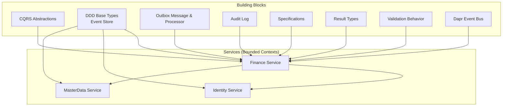
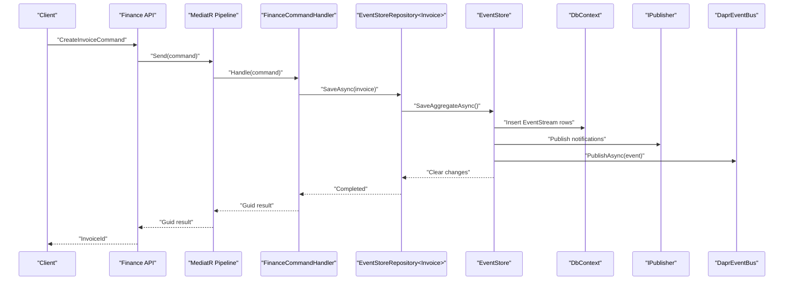
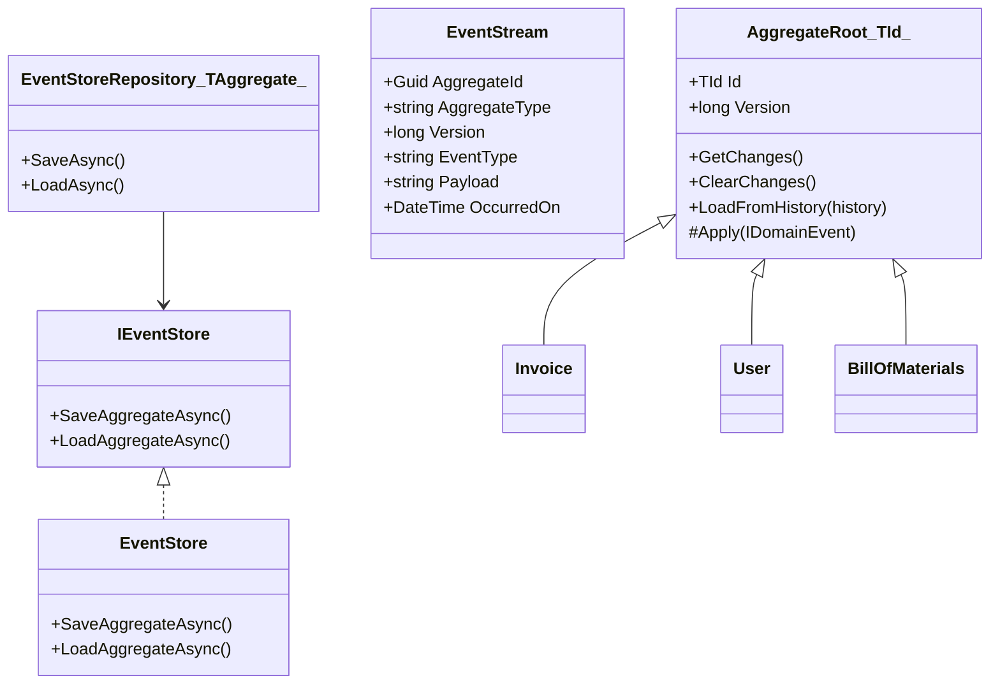
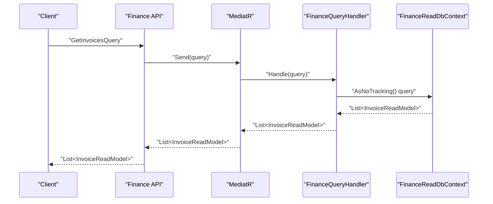
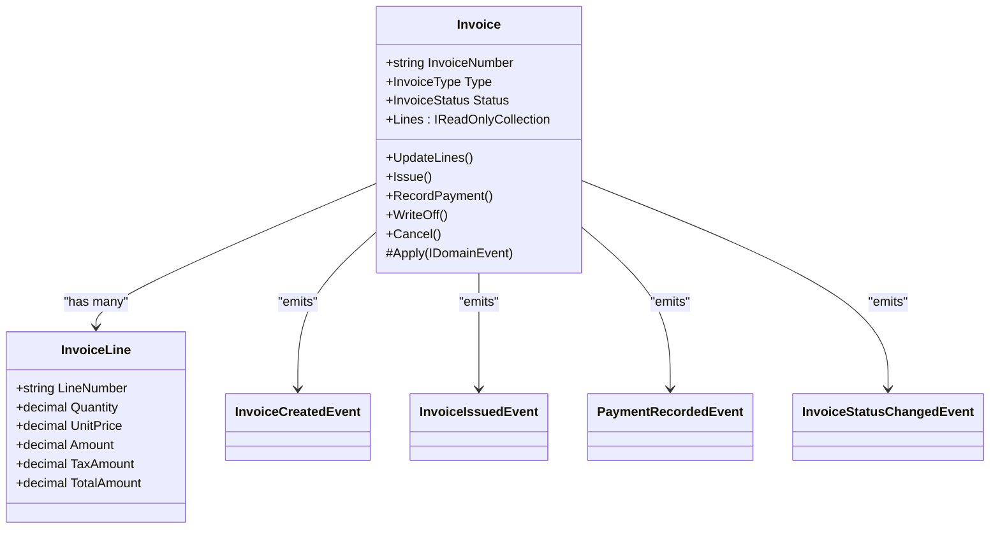
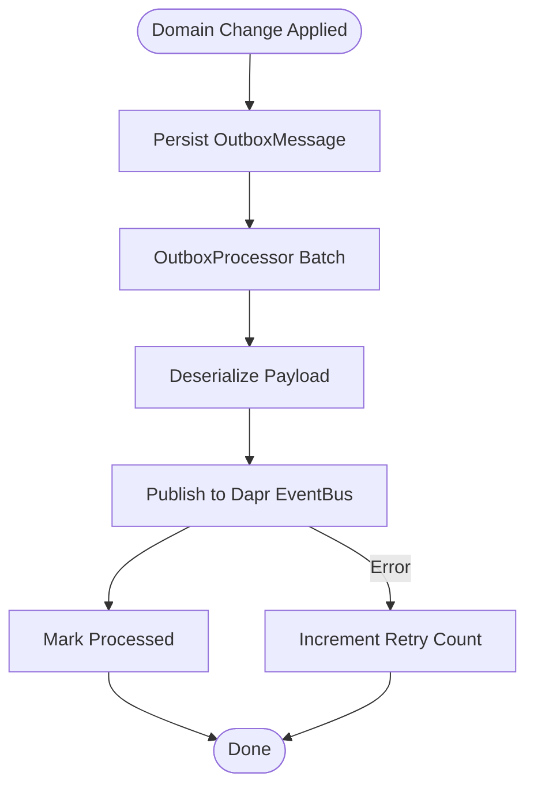
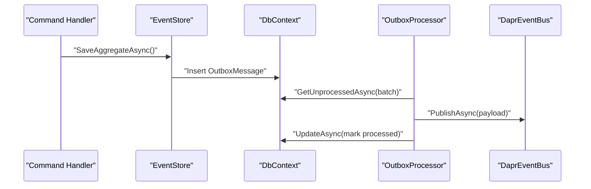
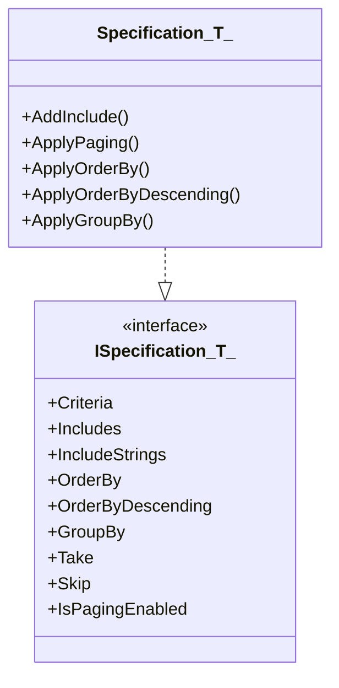
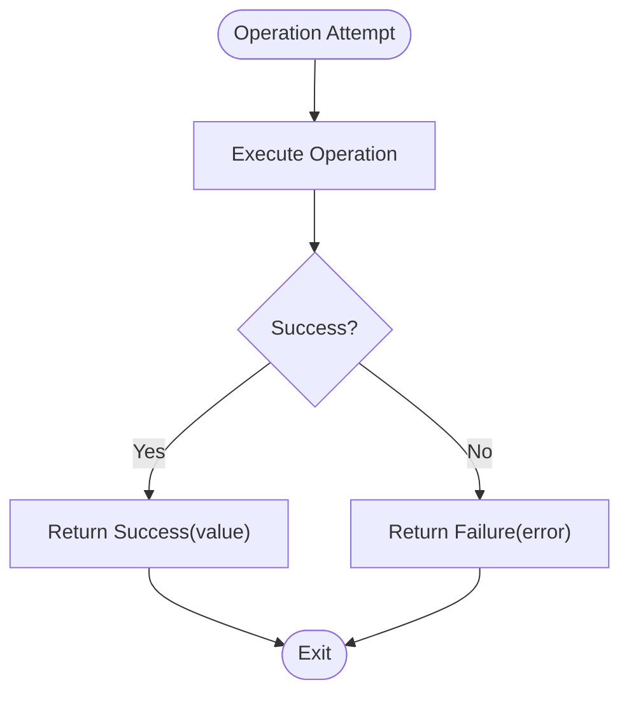
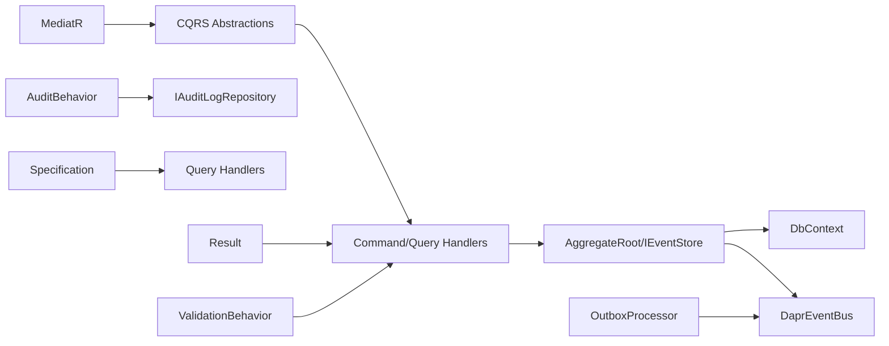

# Design Patterns

<cite>
**Referenced Files in This Document**
- [Abstractions.cs](file://src/BuildingBlocks/ErpSystem.BuildingBlocks/CQRS/Abstractions.cs)
- [Result.cs](file://src/BuildingBlocks/ErpSystem.BuildingBlocks/Common/Result.cs)
- [DDDBase.cs](file://src/BuildingBlocks/ErpSystem.BuildingBlocks/Domain/DDDBase.cs)
- [ISpecification.cs](file://src/BuildingBlocks/ErpSystem.BuildingBlocks/Domain/Specifications/ISpecification.cs)
- [Specification.cs](file://src/BuildingBlocks/ErpSystem.BuildingBlocks/Domain/Specifications/Specification.cs)
- [DaprEventBus.cs](file://src/BuildingBlocks/ErpSystem.BuildingBlocks/EventBus/DaprEventBus.cs)
- [OutboxMessage.cs](file://src/BuildingBlocks/ErpSystem.BuildingBlocks/Outbox/OutboxMessage.cs)
- [OutboxProcessor.cs](file://src/BuildingBlocks/ErpSystem.BuildingBlocks/Outbox/OutboxProcessor.cs)
- [AuditLog.cs](file://src/BuildingBlocks/ErpSystem.BuildingBlocks/Auditing/AuditLog.cs)
- [ValidationBehavior.cs](file://src/BuildingBlocks/ErpSystem.BuildingBlocks/Behaviors/ValidationBehavior.cs)
- [InvoiceAggregate.cs](file://src/Services/Finance/ErpSystem.Finance/Domain/InvoiceAggregate.cs)
- [FinanceCommands.cs](file://src/Services/Finance/ErpSystem.Finance/Application/FinanceCommands.cs)
- [FinanceQueries.cs](file://src/Services/Finance/ErpSystem.Finance/Application/FinanceQueries.cs)
- [UserAggregate.cs](file://src/Services/Identity/ErpSystem.Identity/Domain/UserAggregate.cs)
- [BillOfMaterialsAggregate.cs](file://src/Services/MasterData/ErpSystem.MasterData/Domain/BillOfMaterialsAggregate.cs)
</cite>

## Table of Contents
1. [Introduction](#introduction)
2. [Project Structure](#project-structure)
3. [Core Components](#core-components)
4. [Architecture Overview](#architecture-overview)
5. [Detailed Component Analysis](#detailed-component-analysis)
6. [Dependency Analysis](#dependency-analysis)
7. [Performance Considerations](#performance-considerations)
8. [Troubleshooting Guide](#troubleshooting-guide)
9. [Conclusion](#conclusion)

## Introduction
This document explains the enterprise design patterns implemented across the ERP system’s building blocks and services. It focuses on:
- Event Sourcing with complete audit trails and temporal queries
- CQRS with separate read/write models using MediatR handlers
- Domain-Driven Design principles (aggregates, value objects, domain events, bounded contexts)
- Saga orchestration for distributed transactions via Dapr
- Outbox pattern for reliable event publishing
- Specification pattern for reusable query logic
- Result pattern for railway-oriented error handling

The goal is to help both technical and non-technical readers understand how these patterns are structured, how they interact, and how they enable scalability, reliability, and maintainability at enterprise scale.

## Project Structure
The solution is organized into:
- Building Blocks: Cross-cutting concerns and reusable patterns (CQRS abstractions, DDD building blocks, event bus, outbox, auditing, validation, specifications, result types)
- Services: Feature-focused bounded contexts (Finance, Identity, MasterData, and others), each with API, Application, Domain, and Infrastructure layers
- Gateway: Centralized entrypoint for routing and exposure
- Deploy: Kubernetes/Helm configurations for containerized deployment

**Section sources**
- [Abstractions.cs](file://src/BuildingBlocks/ErpSystem.BuildingBlocks/CQRS/Abstractions.cs#L1-L39)
- [DDDBase.cs](file://src/BuildingBlocks/ErpSystem.BuildingBlocks/Domain/DDDBase.cs#L1-L137)
- [OutboxMessage.cs](file://src/BuildingBlocks/ErpSystem.BuildingBlocks/Outbox/OutboxMessage.cs#L1-L82)
- [OutboxProcessor.cs](file://src/BuildingBlocks/ErpSystem.BuildingBlocks/Outbox/OutboxProcessor.cs#L1-L72)
- [AuditLog.cs](file://src/BuildingBlocks/ErpSystem.BuildingBlocks/Auditing/AuditLog.cs#L1-L135)
- [ISpecification.cs](file://src/BuildingBlocks/ErpSystem.BuildingBlocks/Domain/Specifications/ISpecification.cs#L1-L18)
- [Specification.cs](file://src/BuildingBlocks/ErpSystem.BuildingBlocks/Domain/Specifications/Specification.cs#L1-L50)
- [Result.cs](file://src/BuildingBlocks/ErpSystem.BuildingBlocks/Common/Result.cs#L1-L56)
- [ValidationBehavior.cs](file://src/BuildingBlocks/ErpSystem.BuildingBlocks/Behaviors/ValidationBehavior.cs#L1-L34)
- [DaprEventBus.cs](file://src/BuildingBlocks/ErpSystem.BuildingBlocks/EventBus/DaprEventBus.cs#L1-L31)

## Core Components
- CQRS Abstractions: Strongly-typed interfaces for commands, queries, and their handlers to enforce separation of write/read responsibilities.
- DDD Building Blocks: AggregateRoot base, event stream persistence, event store abstraction, and repository wrapper for event sourcing.
- Event Bus: Dapr-backed publish mechanism with a dummy fallback for local development.
- Outbox: Reliable asynchronous event publishing with background processing and retry/error tracking.
- Auditing: Automatic audit logging around auditable requests with user context and tenant metadata.
- Specifications: Composable query criteria with paging, ordering, grouping, and includes.
- Result Pattern: Railway-oriented success/failure modeling with typed values and explicit error semantics.
- Validation Pipeline: FluentValidation integration via MediatR pipeline behavior.

**Section sources**
- [Abstractions.cs](file://src/BuildingBlocks/ErpSystem.BuildingBlocks/CQRS/Abstractions.cs#L1-L39)
- [DDDBase.cs](file://src/BuildingBlocks/ErpSystem.BuildingBlocks/Domain/DDDBase.cs#L1-L137)
- [DaprEventBus.cs](file://src/BuildingBlocks/ErpSystem.BuildingBlocks/EventBus/DaprEventBus.cs#L1-L31)
- [OutboxMessage.cs](file://src/BuildingBlocks/ErpSystem.BuildingBlocks/Outbox/OutboxMessage.cs#L1-L82)
- [OutboxProcessor.cs](file://src/BuildingBlocks/ErpSystem.BuildingBlocks/Outbox/OutboxProcessor.cs#L1-L72)
- [AuditLog.cs](file://src/BuildingBlocks/ErpSystem.BuildingBlocks/Auditing/AuditLog.cs#L1-L135)
- [ISpecification.cs](file://src/BuildingBlocks/ErpSystem.BuildingBlocks/Domain/Specifications/ISpecification.cs#L1-L18)
- [Specification.cs](file://src/BuildingBlocks/ErpSystem.BuildingBlocks/Domain/Specifications/Specification.cs#L1-L50)
- [Result.cs](file://src/BuildingBlocks/ErpSystem.BuildingBlocks/Common/Result.cs#L1-L56)
- [ValidationBehavior.cs](file://src/BuildingBlocks/ErpSystem.BuildingBlocks/Behaviors/ValidationBehavior.cs#L1-L34)

## Architecture Overview
The system applies CQRS with MediatR, DDD with Event Sourcing, and reliable messaging via the Outbox pattern. Commands mutate aggregates via Event Store, which publishes domain events through both MediatR and the Dapr event bus. Read models are projections maintained in dedicated read databases and queried via strongly-typed queries.

**Diagram sources**
- [FinanceCommands.cs](file://src/Services/Finance/ErpSystem.Finance/Application/FinanceCommands.cs#L45-L62)
- [DDDBase.cs](file://src/BuildingBlocks/ErpSystem.BuildingBlocks/Domain/DDDBase.cs#L59-L99)
- [DaprEventBus.cs](file://src/BuildingBlocks/ErpSystem.BuildingBlocks/EventBus/DaprEventBus.cs#L11-L21)

## Detailed Component Analysis

### Event Sourcing with Audit Trails and Temporal Queries
- AggregateRoot maintains a change log and supports loading from history to reconstruct state at any version.
- EventStore persists event streams and publishes domain events through both MediatR and Dapr.
- AuditLog captures auditable command execution with user, tenant, IP, and serialized request payload.

**Diagram sources**
- [DDDBase.cs](file://src/BuildingBlocks/ErpSystem.BuildingBlocks/Domain/DDDBase.cs#L14-L120)

Key benefits:
- Complete audit trail via event streams and audit logs
- Temporal queries by loading aggregates at historical versions
- Decoupled read model updates via domain events

**Section sources**
- [DDDBase.cs](file://src/BuildingBlocks/ErpSystem.BuildingBlocks/Domain/DDDBase.cs#L14-L120)
- [AuditLog.cs](file://src/BuildingBlocks/ErpSystem.BuildingBlocks/Auditing/AuditLog.cs#L28-L53)

### CQRS with MediatR Handlers and Separate Read/Write Models
- Commands and queries are strongly typed with dedicated handler interfaces.
- Application layer composes domain operations and coordinates projections.
- Read models are projected into dedicated read databases and queried via strongly-typed handlers.

**Diagram sources**
- [FinanceQueries.cs](file://src/Services/Finance/ErpSystem.Finance/Application/FinanceQueries.cs#L23-L52)
- [Abstractions.cs](file://src/BuildingBlocks/ErpSystem.BuildingBlocks/CQRS/Abstractions.cs#L7-L38)

**Section sources**
- [Abstractions.cs](file://src/BuildingBlocks/ErpSystem.BuildingBlocks/CQRS/Abstractions.cs#L1-L39)
- [FinanceCommands.cs](file://src/Services/Finance/ErpSystem.Finance/Application/FinanceCommands.cs#L45-L142)
- [FinanceQueries.cs](file://src/Services/Finance/ErpSystem.Finance/Application/FinanceQueries.cs#L23-L110)

### Domain-Driven Design Principles
- Aggregates encapsulate invariants and expose methods that emit domain events.
- Value Objects represent immutable, equality-based data (e.g., invoice line items).
- Domain Events carry causality and are handled by event handlers and projections.
- Bounded contexts isolate services (Finance, Identity, MasterData) with their own aggregates and events.

**Diagram sources**
- [InvoiceAggregate.cs](file://src/Services/Finance/ErpSystem.Finance/Domain/InvoiceAggregate.cs#L67-L176)

Additional DDD examples:
- Identity User aggregate with lifecycle events (login, lock/unlock, roles)
- MasterData BillOfMaterials aggregate with component management and status transitions

**Section sources**
- [InvoiceAggregate.cs](file://src/Services/Finance/ErpSystem.Finance/Domain/InvoiceAggregate.cs#L67-L176)
- [UserAggregate.cs](file://src/Services/Identity/ErpSystem.Identity/Domain/UserAggregate.cs#L55-L164)
- [BillOfMaterialsAggregate.cs](file://src/Services/MasterData/ErpSystem.MasterData/Domain/BillOfMaterialsAggregate.cs#L55-L125)

### Saga Pattern for Distributed Transactions via Dapr
- Domain events trigger cross-service reactions through the Dapr event bus.
- Outbox ensures reliable delivery by persisting messages in the same transaction as domain changes.
- OutboxProcessor asynchronously dispatches messages to the event bus with retry and error tracking.

**Diagram sources**
- [OutboxMessage.cs](file://src/BuildingBlocks/ErpSystem.BuildingBlocks/Outbox/OutboxMessage.cs#L22-L54)
- [OutboxProcessor.cs](file://src/BuildingBlocks/ErpSystem.BuildingBlocks/Outbox/OutboxProcessor.cs#L29-L70)
- [DaprEventBus.cs](file://src/BuildingBlocks/ErpSystem.BuildingBlocks/EventBus/DaprEventBus.cs#L11-L21)

Benefits:
- Exactly-once delivery guarantees for cross-context operations
- Non-blocking, resilient event propagation
- Operational observability via retry counts and error fields

**Section sources**
- [DaprEventBus.cs](file://src/BuildingBlocks/ErpSystem.BuildingBlocks/EventBus/DaprEventBus.cs#L1-L31)
- [OutboxMessage.cs](file://src/BuildingBlocks/ErpSystem.BuildingBlocks/Outbox/OutboxMessage.cs#L1-L82)
- [OutboxProcessor.cs](file://src/BuildingBlocks/ErpSystem.BuildingBlocks/Outbox/OutboxProcessor.cs#L1-L72)

### Outbox Pattern for Reliable Event Publishing
- OutboxMessage stores serialized events with metadata and retry counters.
- OutboxProcessor runs as a background service, fetching unprocessed messages and publishing them.
- Supports graceful degradation: if no repository is registered, the processor remains idle.

**Diagram sources**
- [OutboxProcessor.cs](file://src/BuildingBlocks/ErpSystem.BuildingBlocks/Outbox/OutboxProcessor.cs#L29-L70)
- [OutboxMessage.cs](file://src/BuildingBlocks/ErpSystem.BuildingBlocks/Outbox/OutboxMessage.cs#L57-L82)

**Section sources**
- [OutboxProcessor.cs](file://src/BuildingBlocks/ErpSystem.BuildingBlocks/Outbox/OutboxProcessor.cs#L1-L72)
- [OutboxMessage.cs](file://src/BuildingBlocks/ErpSystem.BuildingBlocks/Outbox/OutboxMessage.cs#L1-L82)

### Specification Pattern for Reusable Query Logic
- ISpecification defines criteria, includes, ordering, paging, and grouping.
- Specification<T> provides a fluent base to compose reusable query conditions.
- Read models and repositories can accept specifications to encapsulate query complexity.

**Diagram sources**
- [ISpecification.cs](file://src/BuildingBlocks/ErpSystem.BuildingBlocks/Domain/Specifications/ISpecification.cs#L5-L17)
- [Specification.cs](file://src/BuildingBlocks/ErpSystem.BuildingBlocks/Domain/Specifications/Specification.cs#L5-L49)

**Section sources**
- [ISpecification.cs](file://src/BuildingBlocks/ErpSystem.BuildingBlocks/Domain/Specifications/ISpecification.cs#L1-L18)
- [Specification.cs](file://src/BuildingBlocks/ErpSystem.BuildingBlocks/Domain/Specifications/Specification.cs#L1-L50)

### Result Pattern for Railway-Oriented Error Handling
- Result and Result<TValue> provide explicit success/failure semantics.
- Railway-oriented composition avoids nested conditionals and centralizes error handling.
- Used across application services to return typed results consistently.

**Diagram sources**
- [Result.cs](file://src/BuildingBlocks/ErpSystem.BuildingBlocks/Common/Result.cs#L11-L56)

**Section sources**
- [Result.cs](file://src/BuildingBlocks/ErpSystem.BuildingBlocks/Common/Result.cs#L1-L56)

### Validation Pipeline Behavior
- ValidationBehavior integrates FluentValidation into the MediatR pipeline.
- Validates incoming requests before invoking handlers, aggregating failures and throwing a single exception if needed.

**Section sources**
- [ValidationBehavior.cs](file://src/BuildingBlocks/ErpSystem.BuildingBlocks/Behaviors/ValidationBehavior.cs#L1-L34)

## Dependency Analysis
- CQRS depends on MediatR for request/response handling.
- DDD building blocks depend on Entity Framework Core for event stream persistence and on the event bus for publishing.
- Outbox depends on the event bus and repository abstractions.
- Audit behavior depends on user context and audit repository.
- Queries depend on read-side DbContexts and projection models.

**Diagram sources**
- [Abstractions.cs](file://src/BuildingBlocks/ErpSystem.BuildingBlocks/CQRS/Abstractions.cs#L1-L39)
- [DDDBase.cs](file://src/BuildingBlocks/ErpSystem.BuildingBlocks/Domain/DDDBase.cs#L59-L120)
- [DaprEventBus.cs](file://src/BuildingBlocks/ErpSystem.BuildingBlocks/EventBus/DaprEventBus.cs#L11-L21)
- [OutboxProcessor.cs](file://src/BuildingBlocks/ErpSystem.BuildingBlocks/Outbox/OutboxProcessor.cs#L8-L43)
- [AuditLog.cs](file://src/BuildingBlocks/ErpSystem.BuildingBlocks/Auditing/AuditLog.cs#L65-L101)
- [ISpecification.cs](file://src/BuildingBlocks/ErpSystem.BuildingBlocks/Domain/Specifications/ISpecification.cs#L5-L17)
- [Result.cs](file://src/BuildingBlocks/ErpSystem.BuildingBlocks/Common/Result.cs#L11-L56)
- [ValidationBehavior.cs](file://src/BuildingBlocks/ErpSystem.BuildingBlocks/Behaviors/ValidationBehavior.cs#L7-L32)

**Section sources**
- [Abstractions.cs](file://src/BuildingBlocks/ErpSystem.BuildingBlocks/CQRS/Abstractions.cs#L1-L39)
- [DDDBase.cs](file://src/BuildingBlocks/ErpSystem.BuildingBlocks/Domain/DDDBase.cs#L1-L137)
- [DaprEventBus.cs](file://src/BuildingBlocks/ErpSystem.BuildingBlocks/EventBus/DaprEventBus.cs#L1-L31)
- [OutboxProcessor.cs](file://src/BuildingBlocks/ErpSystem.BuildingBlocks/Outbox/OutboxProcessor.cs#L1-L72)
- [AuditLog.cs](file://src/BuildingBlocks/ErpSystem.BuildingBlocks/Auditing/AuditLog.cs#L1-L135)
- [ISpecification.cs](file://src/BuildingBlocks/ErpSystem.BuildingBlocks/Domain/Specifications/ISpecification.cs#L1-L18)
- [Result.cs](file://src/BuildingBlocks/ErpSystem.BuildingBlocks/Common/Result.cs#L1-L56)
- [ValidationBehavior.cs](file://src/BuildingBlocks/ErpSystem.BuildingBlocks/Behaviors/ValidationBehavior.cs#L1-L34)

## Performance Considerations
- Event Sourcing: Favor snapshotting older versions for aggregates with long histories to reduce load-from-history cost.
- Outbox: Tune batch size and delay intervals based on throughput; monitor retry counts and error rates.
- Read Models: Use projection-specific indexes and pagination; avoid N+1 queries via includes in specifications.
- Validation: Keep validator sets minimal per request; leverage caching for repeated validations where safe.
- Event Bus: Use topic-based partitioning and backpressure controls in Dapr pub/sub for high-volume scenarios.

## Troubleshooting Guide
- Outbox Failures: Inspect retry count and error fields on OutboxMessage; verify event bus connectivity and topic names.
- Audit Logging: Ensure user context is available and audit repository is configured; check indexes for query performance.
- Validation Errors: Review aggregated validation failures thrown by ValidationBehavior; fix input contracts accordingly.
- Event Delivery: Confirm event types are resolvable by the event store’s type resolver and payloads serialize/deserialize correctly.

**Section sources**
- [OutboxProcessor.cs](file://src/BuildingBlocks/ErpSystem.BuildingBlocks/Outbox/OutboxProcessor.cs#L12-L70)
- [OutboxMessage.cs](file://src/BuildingBlocks/ErpSystem.BuildingBlocks/Outbox/OutboxMessage.cs#L34-L54)
- [AuditLog.cs](file://src/BuildingBlocks/ErpSystem.BuildingBlocks/Auditing/AuditLog.cs#L72-L101)
- [ValidationBehavior.cs](file://src/BuildingBlocks/ErpSystem.BuildingBlocks/Behaviors/ValidationBehavior.cs#L10-L32)

## Conclusion
The ERP system demonstrates a cohesive application of enterprise design patterns:
- Event Sourcing with robust audit trails and temporal capabilities
- Clean CQRS boundaries enforced by MediatR
- Rich DDD models with aggregates, value objects, and domain events
- Reliable cross-service coordination via Dapr and Outbox
- Composable query logic with Specifications
- Explicit error handling with Result types
- Operational safeguards via validation and auditing

These patterns collectively support scalability, resilience, and maintainability across the enterprise-grade microservices ecosystem.