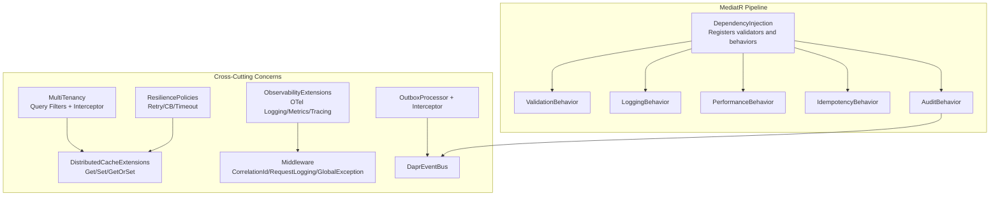
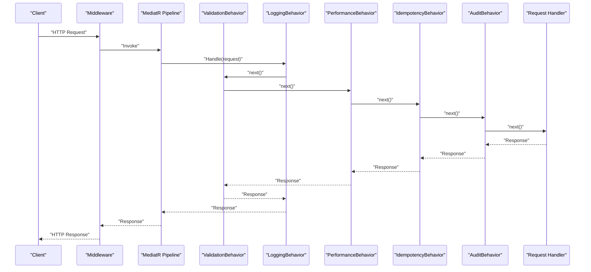
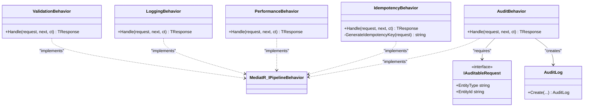
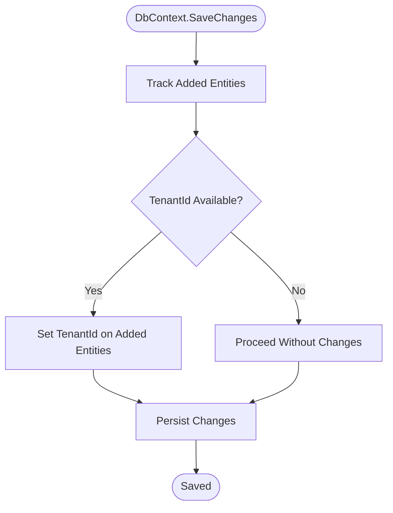
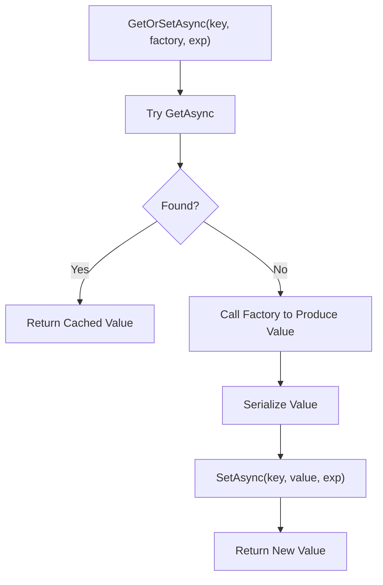
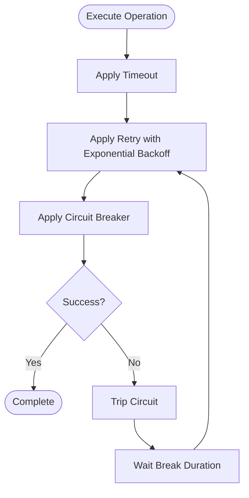
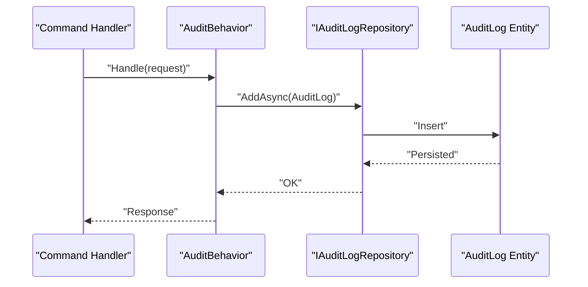
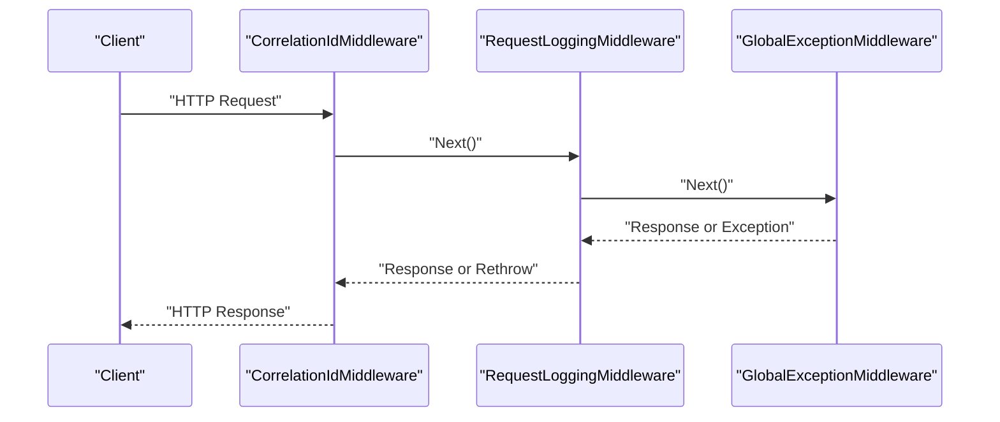
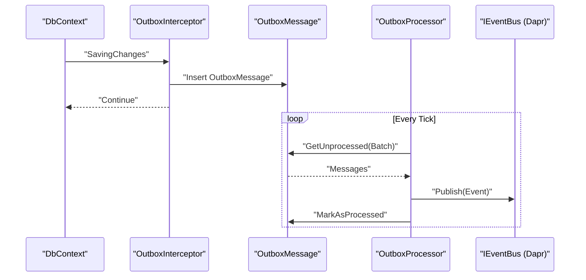
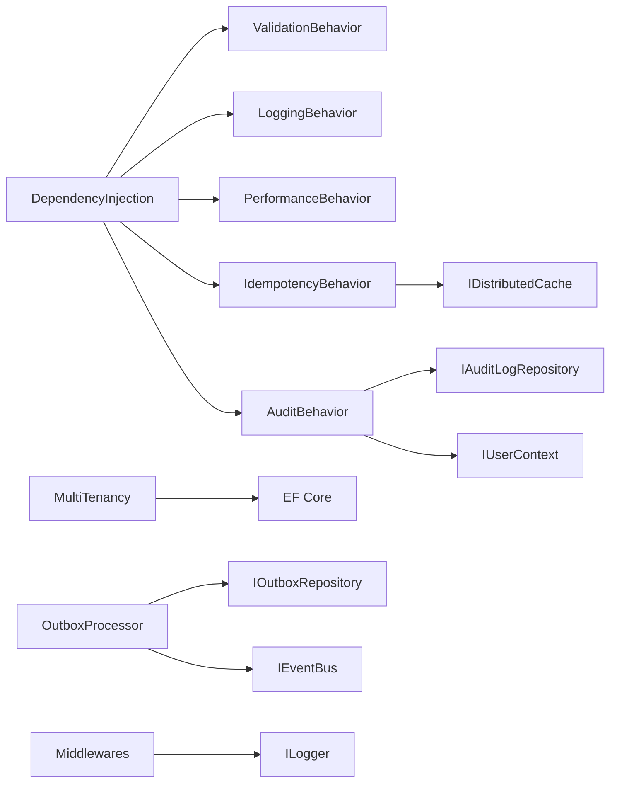

# Enterprise Building Blocks

<cite>
**Referenced Files in This Document**
- [DependencyInjection.cs](file://src/BuildingBlocks/ErpSystem.BuildingBlocks/DependencyInjection.cs)
- [ValidationBehavior.cs](file://src/BuildingBlocks/ErpSystem.BuildingBlocks/Behaviors/ValidationBehavior.cs)
- [LoggingBehavior.cs](file://src/BuildingBlocks/ErpSystem.BuildingBlocks/Behaviors/LoggingBehavior.cs)
- [IdempotencyBehavior.cs](file://src/BuildingBlocks/ErpSystem.BuildingBlocks/Behaviors/IdempotencyBehavior.cs)
- [PerformanceBehavior.cs](file://src/BuildingBlocks/ErpSystem.BuildingBlocks/Behaviors/PerformanceBehavior.cs)
- [AuditLog.cs](file://src/BuildingBlocks/ErpSystem.BuildingBlocks/Auditing/AuditLog.cs)
- [MultiTenancy.cs](file://src/BuildingBlocks/ErpSystem.BuildingBlocks/MultiTenancy/MultiTenancy.cs)
- [CacheExtensions.cs](file://src/BuildingBlocks/ErpSystem.BuildingBlocks/Caching/CacheExtensions.cs)
- [ResiliencePolicies.cs](file://src/BuildingBlocks/ErpSystem.BuildingBlocks/Resilience/ResiliencePolicies.cs)
- [Middlewares.cs](file://src/BuildingBlocks/ErpSystem.BuildingBlocks/Middleware/Middlewares.cs)
- [UserContext.cs](file://src/BuildingBlocks/ErpSystem.BuildingBlocks/Auth/UserContext.cs)
- [IUserContext.cs](file://src/BuildingBlocks/ErpSystem.BuildingBlocks/Auth/IUserContext.cs)
- [DaprEventBus.cs](file://src/BuildingBlocks/ErpSystem.BuildingBlocks/EventBus/DaprEventBus.cs)
- [OutboxInterceptor.cs](file://src/BuildingBlocks/ErpSystem.BuildingBlocks/Outbox/OutboxInterceptor.cs)
- [OutboxMessage.cs](file://src/BuildingBlocks/ErpSystem.BuildingBlocks/Outbox/OutboxMessage.cs)
- [OutboxProcessor.cs](file://src/BuildingBlocks/ErpSystem.BuildingBlocks/Outbox/OutboxProcessor.cs)
- [ObservabilityExtensions.cs](file://src/BuildingBlocks/ErpSystem.BuildingBlocks/Observability/ObservabilityExtensions.cs)
- [Abstractions.cs](file://src/BuildingBlocks/ErpSystem.BuildingBlocks/CQRS/Abstractions.cs)
</cite>

## Table of Contents
1. [Introduction](#introduction)
2. [Project Structure](#project-structure)
3. [Core Components](#core-components)
4. [Architecture Overview](#architecture-overview)
5. [Detailed Component Analysis](#detailed-component-analysis)
6. [Dependency Analysis](#dependency-analysis)
7. [Performance Considerations](#performance-considerations)
8. [Troubleshooting Guide](#troubleshooting-guide)
9. [Conclusion](#conclusion)
10. [Appendices](#appendices)

## Introduction
This document describes the enterprise building blocks that provide production-ready cross-cutting concerns across the platform. It focuses on the MediatR pipeline behaviors (validation, logging, idempotency, audit, performance monitoring), multi-tenant architecture with tenant isolation, resilience patterns using Polly V8, caching strategies with distributed cache extensions and GetOrSet patterns, auditing implementation with automatic audit logging and compliance tracking, and the middleware pipeline for correlation IDs, request logging, and global exception handling. Practical examples show how to implement and customize these building blocks in new services.

## Project Structure
The building blocks are organized by concern under a single project with clear separation of behaviors, multi-tenancy, caching, resilience, middleware, auditing, outbox/eventing, observability, and CQRS abstractions. Dependency injection wiring registers validators and MediatR pipeline behaviors centrally, while other concerns are provided as reusable extensions and interceptors.

**Diagram sources**
- [DependencyInjection.cs](file://src/BuildingBlocks/ErpSystem.BuildingBlocks/DependencyInjection.cs#L12-L29)
- [ValidationBehavior.cs](file://src/BuildingBlocks/ErpSystem.BuildingBlocks/Behaviors/ValidationBehavior.cs#L7-L34)
- [LoggingBehavior.cs](file://src/BuildingBlocks/ErpSystem.BuildingBlocks/Behaviors/LoggingBehavior.cs#L6-L22)
- [PerformanceBehavior.cs](file://src/BuildingBlocks/ErpSystem.BuildingBlocks/Behaviors/PerformanceBehavior.cs#L11-L40)
- [IdempotencyBehavior.cs](file://src/BuildingBlocks/ErpSystem.BuildingBlocks/Behaviors/IdempotencyBehavior.cs#L14-L50)
- [AuditLog.cs](file://src/BuildingBlocks/ErpSystem.BuildingBlocks/Auditing/AuditLog.cs#L65-L101)
- [MultiTenancy.cs](file://src/BuildingBlocks/ErpSystem.BuildingBlocks/MultiTenancy/MultiTenancy.cs#L29-L63)
- [CacheExtensions.cs](file://src/BuildingBlocks/ErpSystem.BuildingBlocks/Caching/CacheExtensions.cs#L9-L55)
- [ResiliencePolicies.cs](file://src/BuildingBlocks/ErpSystem.BuildingBlocks/Resilience/ResiliencePolicies.cs#L13-L111)
- [ObservabilityExtensions.cs](file://src/BuildingBlocks/ErpSystem.BuildingBlocks/Observability/ObservabilityExtensions.cs#L10-L44)
- [DaprEventBus.cs](file://src/BuildingBlocks/ErpSystem.BuildingBlocks/EventBus/DaprEventBus.cs#L6-L31)
- [OutboxProcessor.cs](file://src/BuildingBlocks/ErpSystem.BuildingBlocks/Outbox/OutboxProcessor.cs#L8-L72)
- [Middlewares.cs](file://src/BuildingBlocks/ErpSystem.BuildingBlocks/Middleware/Middlewares.cs#L10-L125)

**Section sources**
- [DependencyInjection.cs](file://src/BuildingBlocks/ErpSystem.BuildingBlocks/DependencyInjection.cs#L1-L31)

## Core Components
- MediatR pipeline registrations and behaviors:
  - Validators registration via assembly scanning.
  - Pipeline behaviors: logging, validation, performance, idempotency, and audit.
- Multi-tenancy:
  - Global query filters and an interceptor to enforce tenant isolation and auto-set TenantId on inserts.
- Caching:
  - Typed Get/Set/GetOrSet helpers and cache key builders for consistent keys.
- Resilience:
  - Pre-configured Polly V8 resilience pipelines: retry, circuit breaker, timeout, and combined HTTP retry.
- Observability:
  - OpenTelemetry logging, metrics, and tracing extensions.
- Outbox and Event Bus:
  - Outbox interceptor captures domain events; OutboxProcessor publishes them via Dapr event bus.
- Middleware:
  - Correlation ID propagation, request logging with timing, and global exception handling.
- CQRS Abstractions:
  - Base interfaces for commands, queries, and handlers.

**Section sources**
- [DependencyInjection.cs](file://src/BuildingBlocks/ErpSystem.BuildingBlocks/DependencyInjection.cs#L12-L29)
- [ValidationBehavior.cs](file://src/BuildingBlocks/ErpSystem.BuildingBlocks/Behaviors/ValidationBehavior.cs#L7-L34)
- [LoggingBehavior.cs](file://src/BuildingBlocks/ErpSystem.BuildingBlocks/Behaviors/LoggingBehavior.cs#L6-L22)
- [PerformanceBehavior.cs](file://src/BuildingBlocks/ErpSystem.BuildingBlocks/Behaviors/PerformanceBehavior.cs#L11-L40)
- [IdempotencyBehavior.cs](file://src/BuildingBlocks/ErpSystem.BuildingBlocks/Behaviors/IdempotencyBehavior.cs#L14-L50)
- [AuditLog.cs](file://src/BuildingBlocks/ErpSystem.BuildingBlocks/Auditing/AuditLog.cs#L65-L101)
- [MultiTenancy.cs](file://src/BuildingBlocks/ErpSystem.BuildingBlocks/MultiTenancy/MultiTenancy.cs#L29-L63)
- [CacheExtensions.cs](file://src/BuildingBlocks/ErpSystem.BuildingBlocks/Caching/CacheExtensions.cs#L9-L55)
- [ResiliencePolicies.cs](file://src/BuildingBlocks/ErpSystem.BuildingBlocks/Resilience/ResiliencePolicies.cs#L13-L111)
- [ObservabilityExtensions.cs](file://src/BuildingBlocks/ErpSystem.BuildingBlocks/Observability/ObservabilityExtensions.cs#L10-L44)
- [DaprEventBus.cs](file://src/BuildingBlocks/ErpSystem.BuildingBlocks/EventBus/DaprEventBus.cs#L6-L31)
- [OutboxProcessor.cs](file://src/BuildingBlocks/ErpSystem.BuildingBlocks/Outbox/OutboxProcessor.cs#L8-L72)
- [Middlewares.cs](file://src/BuildingBlocks/ErpSystem.BuildingBlocks/Middleware/Middlewares.cs#L10-L125)
- [Abstractions.cs](file://src/BuildingBlocks/ErpSystem.BuildingBlocks/CQRS/Abstractions.cs#L7-L39)

## Architecture Overview
The building blocks integrate at three layers:
- Application startup: DI wires validators and pipeline behaviors.
- Runtime: MediatR pipeline applies cross-cutting behaviors around handlers.
- Infrastructure: Multi-tenancy, caching, resilience, observability, outbox/eventing, and middleware operate independently but coordinate with the application.

**Diagram sources**
- [DependencyInjection.cs](file://src/BuildingBlocks/ErpSystem.BuildingBlocks/DependencyInjection.cs#L20-L26)
- [ValidationBehavior.cs](file://src/BuildingBlocks/ErpSystem.BuildingBlocks/Behaviors/ValidationBehavior.cs#L10-L32)
- [LoggingBehavior.cs](file://src/BuildingBlocks/ErpSystem.BuildingBlocks/Behaviors/LoggingBehavior.cs#L9-L20)
- [PerformanceBehavior.cs](file://src/BuildingBlocks/ErpSystem.BuildingBlocks/Behaviors/PerformanceBehavior.cs#L17-L39)
- [IdempotencyBehavior.cs](file://src/BuildingBlocks/ErpSystem.BuildingBlocks/Behaviors/IdempotencyBehavior.cs#L20-L50)
- [AuditLog.cs](file://src/BuildingBlocks/ErpSystem.BuildingBlocks/Auditing/AuditLog.cs#L72-L100)

## Detailed Component Analysis

### MediatR Pipeline Behaviors
- ValidationBehavior
  - Validates incoming requests using all discovered validators in scanned assemblies.
  - Aggregates failures and throws a single validation exception if any fail.
- LoggingBehavior
  - Logs request start and completion with structured logging.
- PerformanceBehavior
  - Measures elapsed time and warns for slow requests exceeding a threshold.
- IdempotencyBehavior
  - Detects duplicate requests using a hashed key derived from request type and idempotency key.
  - Stores serialized response in distributed cache for the duration of the default expiration.
- AuditBehavior
  - Creates audit log entries for auditable requests and persists them via repository abstraction.

**Diagram sources**
- [ValidationBehavior.cs](file://src/BuildingBlocks/ErpSystem.BuildingBlocks/Behaviors/ValidationBehavior.cs#L7-L34)
- [LoggingBehavior.cs](file://src/BuildingBlocks/ErpSystem.BuildingBlocks/Behaviors/LoggingBehavior.cs#L6-L22)
- [PerformanceBehavior.cs](file://src/BuildingBlocks/ErpSystem.BuildingBlocks/Behaviors/PerformanceBehavior.cs#L11-L40)
- [IdempotencyBehavior.cs](file://src/BuildingBlocks/ErpSystem.BuildingBlocks/Behaviors/IdempotencyBehavior.cs#L14-L62)
- [AuditLog.cs](file://src/BuildingBlocks/ErpSystem.BuildingBlocks/Auditing/AuditLog.cs#L65-L110)

**Section sources**
- [ValidationBehavior.cs](file://src/BuildingBlocks/ErpSystem.BuildingBlocks/Behaviors/ValidationBehavior.cs#L7-L34)
- [LoggingBehavior.cs](file://src/BuildingBlocks/ErpSystem.BuildingBlocks/Behaviors/LoggingBehavior.cs#L6-L22)
- [PerformanceBehavior.cs](file://src/BuildingBlocks/ErpSystem.BuildingBlocks/Behaviors/PerformanceBehavior.cs#L11-L40)
- [IdempotencyBehavior.cs](file://src/BuildingBlocks/ErpSystem.BuildingBlocks/Behaviors/IdempotencyBehavior.cs#L14-L62)
- [AuditLog.cs](file://src/BuildingBlocks/ErpSystem.BuildingBlocks/Auditing/AuditLog.cs#L65-L101)

### Multi-Tenancy Architecture
- Tenant context abstraction exposes current TenantId and availability.
- Global query filters ensure all queries for tenant-scoped entities are filtered by TenantId.
- SaveChanges interceptor automatically sets TenantId on newly added tenant-aware entities.
- Extension method applies multi-tenancy configuration across all entity types implementing the tenant marker.

**Diagram sources**
- [MultiTenancy.cs](file://src/BuildingBlocks/ErpSystem.BuildingBlocks/MultiTenancy/MultiTenancy.cs#L68-L99)

**Section sources**
- [MultiTenancy.cs](file://src/BuildingBlocks/ErpSystem.BuildingBlocks/MultiTenancy/MultiTenancy.cs#L12-L63)
- [MultiTenancy.cs](file://src/BuildingBlocks/ErpSystem.BuildingBlocks/MultiTenancy/MultiTenancy.cs#L68-L99)

### Caching Strategies
- Distributed cache extensions provide typed GetAsync/SetAsync with JSON serialization and optional expiration.
- GetOrSetAsync pattern ensures cache-first reads with lazy factory-backed population and cache write-through.
- CacheKeyBuilder offers consistent key composition for entities and lists.

**Diagram sources**
- [CacheExtensions.cs](file://src/BuildingBlocks/ErpSystem.BuildingBlocks/Caching/CacheExtensions.cs#L38-L55)

**Section sources**
- [CacheExtensions.cs](file://src/BuildingBlocks/ErpSystem.BuildingBlocks/Caching/CacheExtensions.cs#L9-L55)

### Resilience Patterns with Polly V8
- Retry pipeline with exponential backoff and configurable attempts.
- Circuit breaker pipeline with failure ratio, sampling duration, minimum throughput, and break duration.
- Timeout pipeline with configurable timeout.
- Combined pipeline chaining timeout, retry, and circuit breaker.
- HTTP-specific retry pipeline handles transient errors and specific HTTP statuses.

**Diagram sources**
- [ResiliencePolicies.cs](file://src/BuildingBlocks/ErpSystem.BuildingBlocks/Resilience/ResiliencePolicies.cs#L18-L90)

**Section sources**
- [ResiliencePolicies.cs](file://src/BuildingBlocks/ErpSystem.BuildingBlocks/Resilience/ResiliencePolicies.cs#L13-L111)

### Auditing Implementation
- AuditLog captures entity type, entity ID, action, old/new values, user, tenant, IP, agent, and timestamp.
- AuditBehavior creates and persists audit entries for requests implementing IAuditableRequest.
- EF Core configuration defines table schema, indexes, and constraints for audit logs.

**Diagram sources**
- [AuditLog.cs](file://src/BuildingBlocks/ErpSystem.BuildingBlocks/Auditing/AuditLog.cs#L65-L101)
- [AuditLog.cs](file://src/BuildingBlocks/ErpSystem.BuildingBlocks/Auditing/AuditLog.cs#L115-L134)

**Section sources**
- [AuditLog.cs](file://src/BuildingBlocks/ErpSystem.BuildingBlocks/Auditing/AuditLog.cs#L12-L54)
- [AuditLog.cs](file://src/BuildingBlocks/ErpSystem.BuildingBlocks/Auditing/AuditLog.cs#L56-L61)
- [AuditLog.cs](file://src/BuildingBlocks/ErpSystem.BuildingBlocks/Auditing/AuditLog.cs#L115-L134)

### Middleware Pipeline
- CorrelationIdMiddleware injects a correlation ID into request/response headers and context items.
- RequestLoggingMiddleware logs request start/complete/failure with timing and status code.
- GlobalExceptionMiddleware converts known exceptions into structured JSON responses and logs unhandled errors.

**Diagram sources**
- [Middlewares.cs](file://src/BuildingBlocks/ErpSystem.BuildingBlocks/Middleware/Middlewares.cs#L10-L125)

**Section sources**
- [Middlewares.cs](file://src/BuildingBlocks/ErpSystem.BuildingBlocks/Middleware/Middlewares.cs#L10-L125)

### Outbox and Event Bus
- OutboxInterceptor captures domain events raised by aggregates during SaveChanges and writes them to the OutboxMessage table.
- OutboxProcessor periodically reads unprocessed messages, publishes them via IEventBus (Dapr), and updates message state.
- DaprEventBus publishes events to a PubSub with topic derived from event type name.

**Diagram sources**
- [OutboxInterceptor.cs](file://src/BuildingBlocks/ErpSystem.BuildingBlocks/Outbox/OutboxInterceptor.cs#L8-L50)
- [OutboxMessage.cs](file://src/BuildingBlocks/ErpSystem.BuildingBlocks/Outbox/OutboxMessage.cs#L10-L55)
- [OutboxProcessor.cs](file://src/BuildingBlocks/ErpSystem.BuildingBlocks/Outbox/OutboxProcessor.cs#L8-L72)
- [DaprEventBus.cs](file://src/BuildingBlocks/ErpSystem.BuildingBlocks/EventBus/DaprEventBus.cs#L11-L21)

**Section sources**
- [OutboxInterceptor.cs](file://src/BuildingBlocks/ErpSystem.BuildingBlocks/Outbox/OutboxInterceptor.cs#L8-L50)
- [OutboxMessage.cs](file://src/BuildingBlocks/ErpSystem.BuildingBlocks/Outbox/OutboxMessage.cs#L10-L55)
- [OutboxProcessor.cs](file://src/BuildingBlocks/ErpSystem.BuildingBlocks/Outbox/OutboxProcessor.cs#L8-L72)
- [DaprEventBus.cs](file://src/BuildingBlocks/ErpSystem.BuildingBlocks/EventBus/DaprEventBus.cs#L6-L31)

### Observability
- ObservabilityExtensions configures OpenTelemetry logging, ASP.NET Core and HttpClient instrumentation, runtime metrics, and tracing with OTLP export.

**Section sources**
- [ObservabilityExtensions.cs](file://src/BuildingBlocks/ErpSystem.BuildingBlocks/Observability/ObservabilityExtensions.cs#L10-L44)

### CQRS Abstractions
- Base interfaces for commands, queries, and their handlers unify command/query semantics and handler contracts.

**Section sources**
- [Abstractions.cs](file://src/BuildingBlocks/ErpSystem.BuildingBlocks/CQRS/Abstractions.cs#L7-L39)

## Dependency Analysis
- DependencyInjection centralizes registration of validators and MediatR pipeline behaviors.
- AuditBehavior depends on IAuditLogRepository and IUserContext.
- MultiTenancy relies on ITenantContext and EF Core interception APIs.
- IdempotencyBehavior depends on IDistributedCache and JSON serialization.
- OutboxProcessor depends on IOutboxRepository and IEventBus.
- Middleware components depend on ILogger and HttpContext.

**Diagram sources**
- [DependencyInjection.cs](file://src/BuildingBlocks/ErpSystem.BuildingBlocks/DependencyInjection.cs#L20-L29)
- [AuditLog.cs](file://src/BuildingBlocks/ErpSystem.BuildingBlocks/Auditing/AuditLog.cs#L65-L68)
- [MultiTenancy.cs](file://src/BuildingBlocks/ErpSystem.BuildingBlocks/MultiTenancy/MultiTenancy.cs#L68-L69)
- [IdempotencyBehavior.cs](file://src/BuildingBlocks/ErpSystem.BuildingBlocks/Behaviors/IdempotencyBehavior.cs#L14-L14)
- [OutboxProcessor.cs](file://src/BuildingBlocks/ErpSystem.BuildingBlocks/Outbox/OutboxProcessor.cs#L34-L35)
- [Middlewares.cs](file://src/BuildingBlocks/ErpSystem.BuildingBlocks/Middleware/Middlewares.cs#L10-L11)

**Section sources**
- [DependencyInjection.cs](file://src/BuildingBlocks/ErpSystem.BuildingBlocks/DependencyInjection.cs#L12-L29)
- [AuditLog.cs](file://src/BuildingBlocks/ErpSystem.BuildingBlocks/Auditing/AuditLog.cs#L65-L68)
- [MultiTenancy.cs](file://src/BuildingBlocks/ErpSystem.BuildingBlocks/MultiTenancy/MultiTenancy.cs#L68-L69)
- [IdempotencyBehavior.cs](file://src/BuildingBlocks/ErpSystem.BuildingBlocks/Behaviors/IdempotencyBehavior.cs#L14-L14)
- [OutboxProcessor.cs](file://src/BuildingBlocks/ErpSystem.BuildingBlocks/Outbox/OutboxProcessor.cs#L34-L35)
- [Middlewares.cs](file://src/BuildingBlocks/ErpSystem.BuildingBlocks/Middleware/Middlewares.cs#L10-L11)

## Performance Considerations
- Prefer GetOrSetAsync for expensive reads to reduce load and improve latency.
- Tune slow request threshold in PerformanceBehavior to match service SLAs.
- Use appropriate cache expiration and sliding expiration to balance freshness and performance.
- Circuit breaker thresholds should reflect service health and traffic patterns.
- Ensure observability is enabled to monitor latency, error rates, and throughput.

## Troubleshooting Guide
- Validation failures:
  - FluentValidation exceptions are aggregated and thrown; inspect logs for property-level errors.
- Audit logging failures:
  - AuditBehavior catches and logs exceptions; verify repository implementation and database connectivity.
- Idempotency collisions:
  - Duplicate detection uses hashed keys; ensure IdempotencyKey uniqueness per operation.
- Multi-tenant data leakage:
  - Confirm ITenantContext is populated and query filters are applied via model configuration.
- Outbox delivery issues:
  - Check OutboxProcessor logs and message state transitions; verify IEventBus implementation.
- Middleware errors:
  - GlobalExceptionMiddleware returns structured JSON for known exceptions; unhandled errors are logged and returned as internal server errors.

**Section sources**
- [ValidationBehavior.cs](file://src/BuildingBlocks/ErpSystem.BuildingBlocks/Behaviors/ValidationBehavior.cs#L26-L29)
- [AuditLog.cs](file://src/BuildingBlocks/ErpSystem.BuildingBlocks/Auditing/AuditLog.cs#L94-L97)
- [IdempotencyBehavior.cs](file://src/BuildingBlocks/ErpSystem.BuildingBlocks/Behaviors/IdempotencyBehavior.cs#L31-L35)
- [MultiTenancy.cs](file://src/BuildingBlocks/ErpSystem.BuildingBlocks/MultiTenancy/MultiTenancy.cs#L38-L42)
- [OutboxProcessor.cs](file://src/BuildingBlocks/ErpSystem.BuildingBlocks/Outbox/OutboxProcessor.cs#L20-L27)
- [Middlewares.cs](file://src/BuildingBlocks/ErpSystem.BuildingBlocks/Middleware/Middlewares.cs#L81-L123)

## Conclusion
These building blocks provide a cohesive foundation for production-grade microservices: robust MediatR pipeline behaviors, tenant-aware persistence, resilient HTTP operations, efficient caching, comprehensive auditing, reliable eventing via outbox, and observability. They are designed for reuse across services with minimal customization required.

## Appendices

### Practical Examples and Customization Tips
- Implementing a new auditable command:
  - Define a command implementing IAuditableRequest with EntityType and EntityId.
  - Ensure an implementation of IAuditLogRepository is registered.
  - Reference: [AuditLog.cs](file://src/BuildingBlocks/ErpSystem.BuildingBlocks/Auditing/AuditLog.cs#L106-L110), [AuditLog.cs](file://src/BuildingBlocks/ErpSystem.BuildingBlocks/Auditing/AuditLog.cs#L65-L101)
- Enabling multi-tenancy:
  - Implement ITenantContext and mark tenant entities with IMultiTenantEntity.
  - Apply model configuration using the provided extension.
  - Reference: [MultiTenancy.cs](file://src/BuildingBlocks/ErpSystem.BuildingBlocks/MultiTenancy/MultiTenancy.cs#L12-L24), [MultiTenancy.cs](file://src/BuildingBlocks/ErpSystem.BuildingBlocks/MultiTenancy/MultiTenancy.cs#L34-L42)
- Using distributed cache:
  - Use GetOrSetAsync for computed or remote resource reads.
  - Reference: [CacheExtensions.cs](file://src/BuildingBlocks/ErpSystem.BuildingBlocks/Caching/CacheExtensions.cs#L38-L55)
- Applying resilience:
  - Choose a predefined pipeline or combine strategies for specific clients.
  - Reference: [ResiliencePolicies.cs](file://src/BuildingBlocks/ErpSystem.BuildingBlocks/Resilience/ResiliencePolicies.cs#L18-L90)
- Adding correlation IDs and request logging:
  - Register middlewares in the HTTP pipeline.
  - Reference: [Middlewares.cs](file://src/BuildingBlocks/ErpSystem.BuildingBlocks/Middleware/Middlewares.cs#L54-L68), [Middlewares.cs](file://src/BuildingBlocks/ErpSystem.BuildingBlocks/Middleware/Middlewares.cs#L12-L49)
- Enabling observability:
  - Add telemetry configuration during application builder setup.
  - Reference: [ObservabilityExtensions.cs](file://src/BuildingBlocks/ErpSystem.BuildingBlocks/Observability/ObservabilityExtensions.cs#L12-L42)
- Wiring up MediatR behaviors:
  - Use the provided extension to register validators and behaviors.
  - Reference: [DependencyInjection.cs](file://src/BuildingBlocks/ErpSystem.BuildingBlocks/DependencyInjection.cs#L12-L29)
- Defining CQRS contracts:
  - Use base interfaces for commands, queries, and handlers.
  - Reference: [Abstractions.cs](file://src/BuildingBlocks/ErpSystem.BuildingBlocks/CQRS/Abstractions.cs#L7-L39)