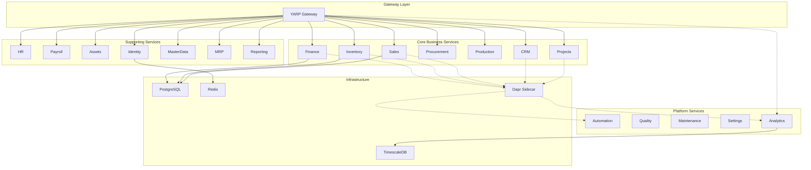
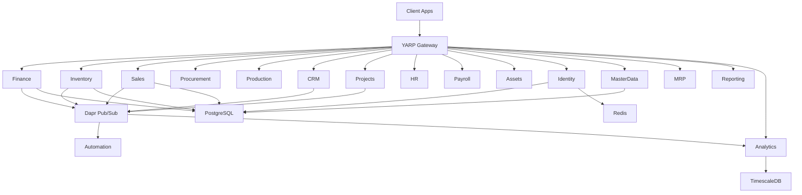
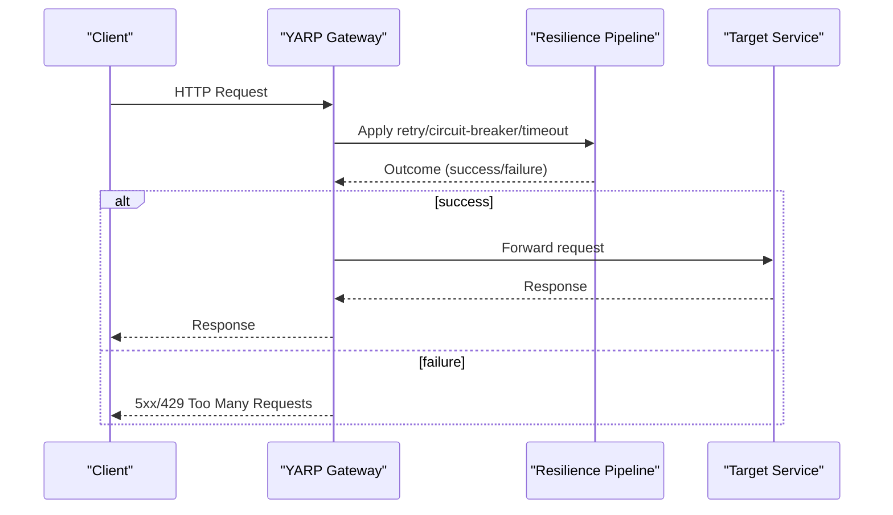
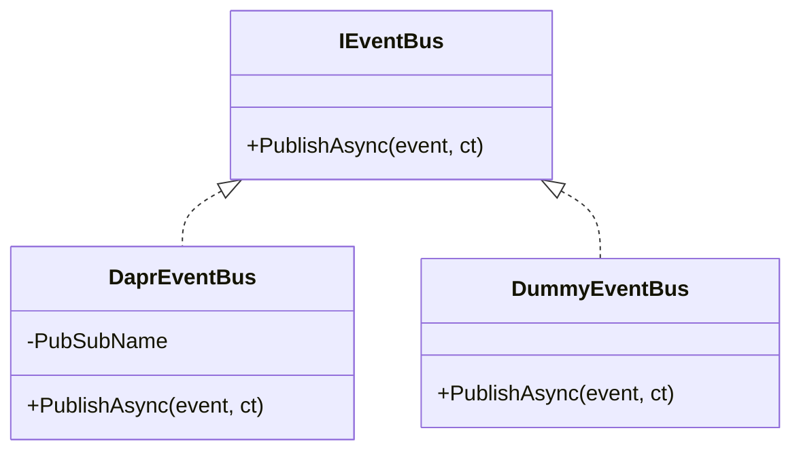
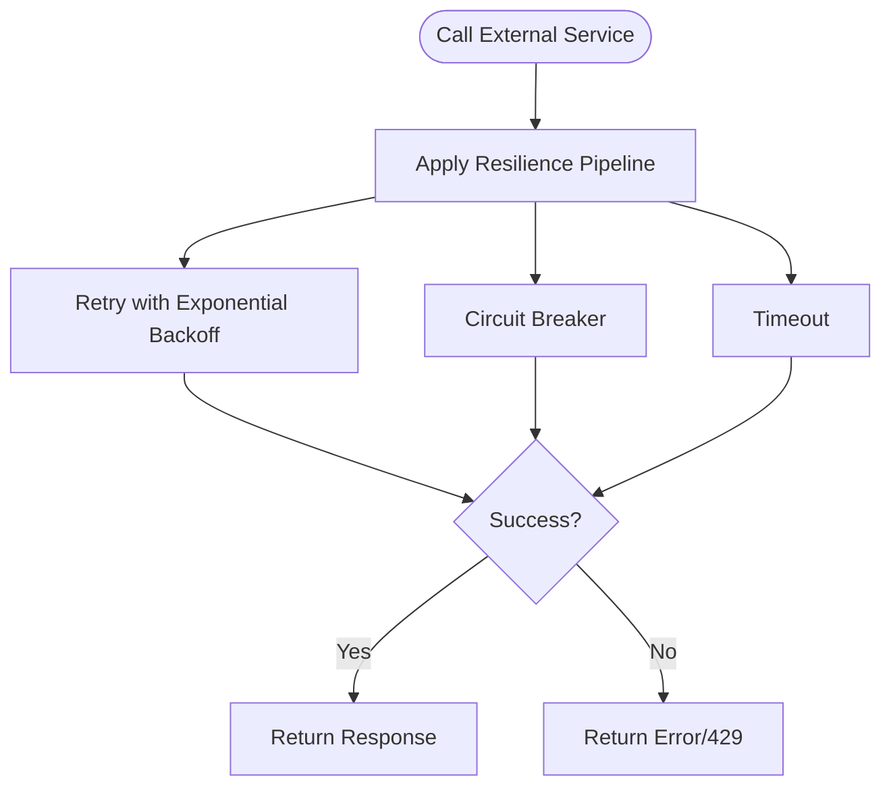
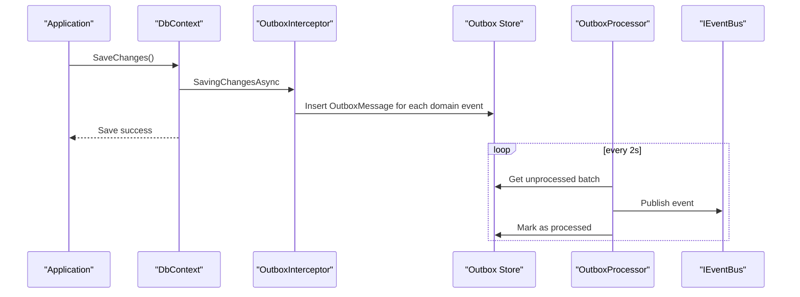
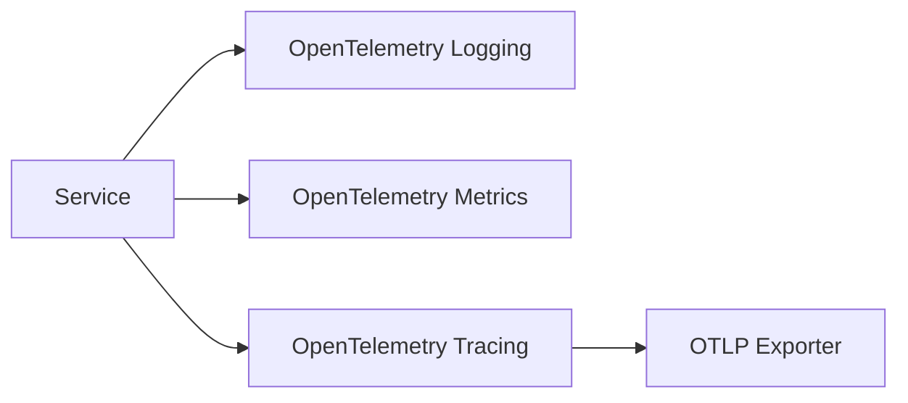
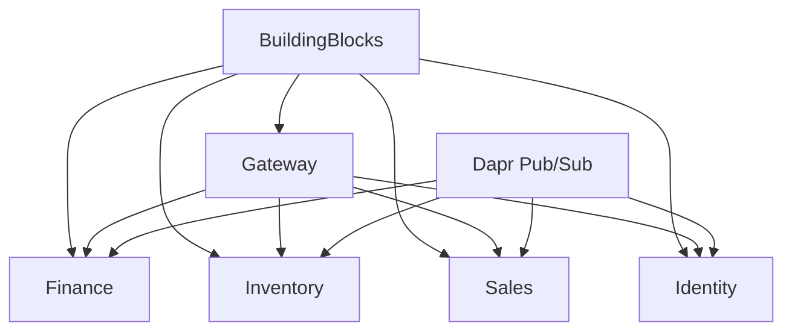
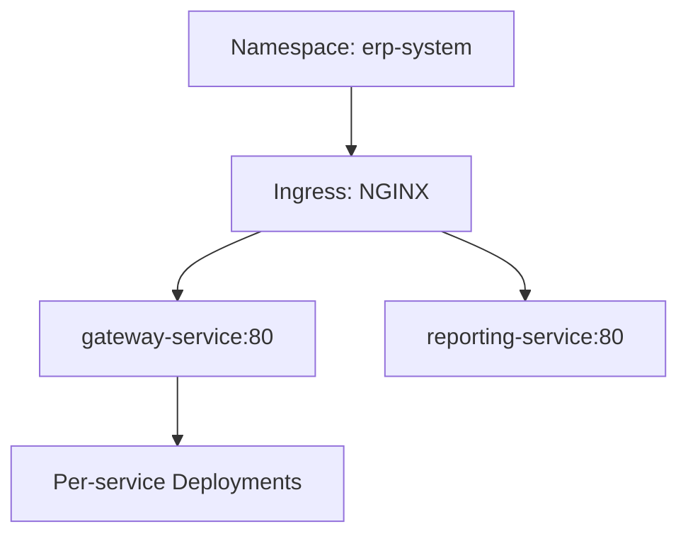

# Microservices Architecture

<cite>
**Referenced Files in This Document**
- [README.md](file://README.md)
- [Program.cs](file://src/Gateways/ErpSystem.Gateway/Program.cs)
- [DaprEventBus.cs](file://src/BuildingBlocks/ErpSystem.BuildingBlocks/EventBus/DaprEventBus.cs)
- [ResiliencePolicies.cs](file://src/BuildingBlocks/ErpSystem.BuildingBlocks/Resilience/ResiliencePolicies.cs)
- [ObservabilityExtensions.cs](file://src/BuildingBlocks/ErpSystem.BuildingBlocks/Observability/ObservabilityExtensions.cs)
- [pubsub.yaml](file://components/pubsub.yaml)
- [Program.cs](file://src/Services/Finance/ErpSystem.Finance/Program.cs)
- [Program.cs](file://src/Services/Inventory/ErpSystem.Inventory/Program.cs)
- [Program.cs](file://src/Services/Sales/ErpSystem.Sales/Program.cs)
- [Program.cs](file://src/Services/MasterData/ErpSystem.MasterData/Program.cs)
- [Program.cs](file://src/Services/Identity/ErpSystem.Identity/Program.cs)
- [Program.cs](file://src/Services/Analytics/ErpSystem.Analytics/Program.cs)
- [OutboxProcessor.cs](file://src/BuildingBlocks/ErpSystem.BuildingBlocks/Outbox/OutboxProcessor.cs)
- [OutboxInterceptor.cs](file://src/BuildingBlocks/ErpSystem.BuildingBlocks/Outbox/OutboxInterceptor.cs)
- [ingress.yaml](file://deploy/k8s/ingress.yaml)
- [namespace.yaml](file://deploy/k8s/namespace.yaml)
</cite>

## Table of Contents
1. [Introduction](#introduction)
2. [Project Structure](#project-structure)
3. [Core Components](#core-components)
4. [Architecture Overview](#architecture-overview)
5. [Detailed Component Analysis](#detailed-component-analysis)
6. [Dependency Analysis](#dependency-analysis)
7. [Performance Considerations](#performance-considerations)
8. [Troubleshooting Guide](#troubleshooting-guide)
9. [Conclusion](#conclusion)
10. [Appendices](#appendices)

## Introduction
This document explains the microservices architecture of the ERP system, detailing 15+ independently deployable services, their responsibilities, and cross-cutting patterns. It covers:
- Service communication via Dapr event bus for loose coupling and asynchronous messaging
- YARP API Gateway for routing, load balancing, and request aggregation
- Service discovery, circuit breaker, and resilience strategies
- Inter-service data flow, event-driven communication, and eventual consistency
- Deployment topology, scaling, and monitoring
- Distributed tracing, correlation IDs, and logging across services

## Project Structure
The repository organizes the system into:
- Shared building blocks (resilience, observability, event bus, outbox)
- 15+ business services (Finance, Inventory, Sales, Procurement, Production, CRM, Projects, HR, Payroll, Assets, Identity, MasterData, MRP, Reporting, Analytics, Automation, Quality, Maintenance, Settings)
- Gateway (YARP) for routing and resilience
- Kubernetes manifests and Helm chart for deployment

**Diagram sources**
- [README.md](file://README.md#L130-L183)
- [Program.cs](file://src/Gateways/ErpSystem.Gateway/Program.cs#L22-L24)

**Section sources**
- [README.md](file://README.md#L289-L322)

## Core Components
- Dapr event bus: Asynchronous, topic-based publish/subscribe decouples services.
- Resilience policies: Retry, circuit breaker, and timeout configured via Polly and the new ResiliencePipelineBuilder.
- Observability: OpenTelemetry-based logging, metrics, and tracing integrated across services.
- Outbox pattern: Ensures reliable event publishing within transactional boundaries.

Key building block files:
- Dapr event bus abstraction and implementation
- Resilience policies factory
- Observability extensions
- Outbox processor and interceptor

**Section sources**
- [DaprEventBus.cs](file://src/BuildingBlocks/ErpSystem.BuildingBlocks/EventBus/DaprEventBus.cs#L6-L30)
- [ResiliencePolicies.cs](file://src/BuildingBlocks/ErpSystem.BuildingBlocks/Resilience/ResiliencePolicies.cs#L13-L110)
- [ObservabilityExtensions.cs](file://src/BuildingBlocks/ErpSystem.BuildingBlocks/Observability/ObservabilityExtensions.cs#L10-L43)
- [OutboxProcessor.cs](file://src/BuildingBlocks/ErpSystem.BuildingBlocks/Outbox/OutboxProcessor.cs#L8-L71)
- [OutboxInterceptor.cs](file://src/BuildingBlocks/ErpSystem.BuildingBlocks/Outbox/OutboxInterceptor.cs#L8-L50)

## Architecture Overview
The system uses:
- YARP Gateway for inbound routing and outbound resilience
- Dapr pub/sub for event-driven communication
- PostgreSQL for relational event/read stores
- TimescaleDB for time-series analytics
- Redis-backed Dapr pub/sub component

**Diagram sources**
- [README.md](file://README.md#L130-L183)
- [Program.cs](file://src/Gateways/ErpSystem.Gateway/Program.cs#L22-L58)
- [pubsub.yaml](file://components/pubsub.yaml#L1-L13)

## Detailed Component Analysis

### YARP API Gateway
Responsibilities:
- Reverse proxy for all business services
- Centralized resilience: retry, circuit breaker, timeout, rate limiting
- Health checks and development OpenAPI exposure

Implementation highlights:
- Configures a default resilience pipeline with retry, circuit breaker, and timeout
- Adds rate limiter to protect backend services
- Uses LoadFromConfig with a section named ReverseProxy

**Diagram sources**
- [Program.cs](file://src/Gateways/ErpSystem.Gateway/Program.cs#L31-L58)

**Section sources**
- [Program.cs](file://src/Gateways/ErpSystem.Gateway/Program.cs#L1-L107)

### Dapr Event Bus and Pub/Sub
Responsibilities:
- Provide a uniform event publishing interface
- Topic naming convention derived from event type names
- Support dummy bus for local/non-Dapr environments

**Diagram sources**
- [DaprEventBus.cs](file://src/BuildingBlocks/ErpSystem.BuildingBlocks/EventBus/DaprEventBus.cs#L6-L30)

**Section sources**
- [DaprEventBus.cs](file://src/BuildingBlocks/ErpSystem.BuildingBlocks/EventBus/DaprEventBus.cs#L11-L21)
- [pubsub.yaml](file://components/pubsub.yaml#L1-L13)

### Resilience Policies
Responsibilities:
- Provide reusable resilience pipelines for retries, circuit breaking, timeouts, and combined strategies
- Used by services and gateway for fault tolerance

**Diagram sources**
- [ResiliencePolicies.cs](file://src/BuildingBlocks/ErpSystem.BuildingBlocks/Resilience/ResiliencePolicies.cs#L18-L90)

**Section sources**
- [ResiliencePolicies.cs](file://src/BuildingBlocks/ErpSystem.BuildingBlocks/Resilience/ResiliencePolicies.cs#L13-L110)

### Outbox Pattern
Responsibilities:
- Capture domain events during DbContext.SaveChanges and enqueue them for publishing
- Background processing publishes outbox messages reliably

**Diagram sources**
- [OutboxInterceptor.cs](file://src/BuildingBlocks/ErpSystem.BuildingBlocks/Outbox/OutboxInterceptor.cs#L8-L50)
- [OutboxProcessor.cs](file://src/BuildingBlocks/ErpSystem.BuildingBlocks/Outbox/OutboxProcessor.cs#L8-L71)

**Section sources**
- [OutboxInterceptor.cs](file://src/BuildingBlocks/ErpSystem.BuildingBlocks/Outbox/OutboxInterceptor.cs#L8-L50)
- [OutboxProcessor.cs](file://src/BuildingBlocks/ErpSystem.BuildingBlocks/Outbox/OutboxProcessor.cs#L8-L71)

### Observability and Distributed Tracing
Responsibilities:
- Unified logging, metrics, and tracing via OpenTelemetry
- Service-scoped resource naming and OTLP export

**Diagram sources**
- [ObservabilityExtensions.cs](file://src/BuildingBlocks/ErpSystem.BuildingBlocks/Observability/ObservabilityExtensions.cs#L12-L42)

**Section sources**
- [ObservabilityExtensions.cs](file://src/BuildingBlocks/ErpSystem.BuildingBlocks/Observability/ObservabilityExtensions.cs#L10-L43)

### Service Implementations Overview
Each business service follows a similar bootstrap pattern:
- Entity Framework contexts for event and read stores
- Dapr event bus registration
- MediatR setup and IPublisher binding
- Event store composition and repositories
- Swagger in development

Examples:
- Finance: registers event store and mediator handlers
- Inventory: registers forecast service and event handlers
- Sales: registers event store and mediator handlers
- MasterData: registers domain services and projections
- Identity: integrates with HR via event bus
- Analytics: SignalR hub and forecasting services

**Section sources**
- [Program.cs](file://src/Services/Finance/ErpSystem.Finance/Program.cs#L13-L74)
- [Program.cs](file://src/Services/Inventory/ErpSystem.Inventory/Program.cs#L14-L73)
- [Program.cs](file://src/Services/Sales/ErpSystem.Sales/Program.cs#L13-L71)
- [Program.cs](file://src/Services/MasterData/ErpSystem.MasterData/Program.cs#L9-L67)
- [Program.cs](file://src/Services/Identity/ErpSystem.Identity/Program.cs#L13-L69)
- [Program.cs](file://src/Services/Analytics/ErpSystem.Analytics/Program.cs#L9-L65)

## Dependency Analysis
- Services depend on the shared building blocks for resilience, observability, event bus, and outbox
- Gateway depends on Dapr pub/sub for internal service notifications and SignalR for real-time dashboards
- Infrastructure components (PostgreSQL, TimescaleDB, Redis) are provisioned via Dapr components and Kubernetes manifests

**Diagram sources**
- [Program.cs](file://src/Services/Finance/ErpSystem.Finance/Program.cs#L27-L46)
- [Program.cs](file://src/Services/Inventory/ErpSystem.Inventory/Program.cs#L27-L35)
- [Program.cs](file://src/Services/Sales/ErpSystem.Sales/Program.cs#L25-L39)
- [Program.cs](file://src/Services/Identity/ErpSystem.Identity/Program.cs#L29-L37)
- [Program.cs](file://src/Gateways/ErpSystem.Gateway/Program.cs#L22-L24)

**Section sources**
- [README.md](file://README.md#L199-L213)

## Performance Considerations
- Use the gateway’s resilience pipeline to avoid thundering herd and protect downstream services
- Tune circuit breaker thresholds and retry delays per service SLAs
- Batch outbox processing reduces event publishing overhead
- Prefer asynchronous event processing to keep request paths short
- Use database connection pooling and optimize read models for reporting/analytics

## Troubleshooting Guide
Common areas to inspect:
- Dapr pub/sub connectivity and topic subscriptions
- Outbox stuck messages and processor logs
- Circuit breaker tripping and retry bursts
- Gateway health checks and rate limit rejections
- Database migrations and connection strings

Operational checks:
- Verify Dapr pub/sub component configuration
- Inspect outbox repository for failed messages and update timestamps
- Review gateway logs for 429 responses and circuit breaker open events
- Confirm database readiness and migrations

**Section sources**
- [pubsub.yaml](file://components/pubsub.yaml#L1-L13)
- [OutboxProcessor.cs](file://src/BuildingBlocks/ErpSystem.BuildingBlocks/Outbox/OutboxProcessor.cs#L12-L27)
- [Program.cs](file://src/Gateways/ErpSystem.Gateway/Program.cs#L60-L68)

## Conclusion
The ERP system applies proven microservices patterns:
- Loose coupling via Dapr event bus and outbox
- Fault tolerance with resilient pipelines
- Observability with unified telemetry
- Scalable deployment via Kubernetes and Helm
- Event-driven, eventually consistent data flow across 15+ services

## Appendices

### Service Communication Patterns
- Asynchronous messaging: Services publish domain events to topics; subscribers handle integrations
- Request aggregation: Gateway routes and aggregates requests across multiple services
- Saga orchestration: Dapr enables coordinated workflows across services

**Section sources**
- [README.md](file://README.md#L130-L183)
- [DaprEventBus.cs](file://src/BuildingBlocks/ErpSystem.BuildingBlocks/EventBus/DaprEventBus.cs#L15-L20)

### Deployment Topology and Scaling
- Namespace and ingress define the cluster boundary and external routing
- Services are deployed independently; each manages its own persistence
- Horizontal scaling supported via Kubernetes Deployments and Dapr sidecars

**Diagram sources**
- [namespace.yaml](file://deploy/k8s/namespace.yaml#L1-L8)
- [ingress.yaml](file://deploy/k8s/ingress.yaml#L1-L37)

**Section sources**
- [namespace.yaml](file://deploy/k8s/namespace.yaml#L1-L8)
- [ingress.yaml](file://deploy/k8s/ingress.yaml#L1-L37)