# Auditing and Observability

<cite>
**Referenced Files in This Document**
- [AuditLog.cs](file://src/BuildingBlocks/ErpSystem.BuildingBlocks/Auditing/AuditLog.cs)
- [ObservabilityExtensions.cs](file://src/BuildingBlocks/ErpSystem.BuildingBlocks/Observability/ObservabilityExtensions.cs)
- [Middlewares.cs](file://src/BuildingBlocks/ErpSystem.BuildingBlocks/Middleware/Middlewares.cs)
- [LoggingBehavior.cs](file://src/BuildingBlocks/ErpSystem.BuildingBlocks/Behaviors/LoggingBehavior.cs)
- [PerformanceBehavior.cs](file://src/BuildingBlocks/ErpSystem.BuildingBlocks/Behaviors/PerformanceBehavior.cs)
- [OutboxMessage.cs](file://src/BuildingBlocks/ErpSystem.BuildingBlocks/Outbox/OutboxMessage.cs)
- [OutboxInterceptor.cs](file://src/BuildingBlocks/ErpSystem.BuildingBlocks/Outbox/OutboxInterceptor.cs)
- [OutboxProcessor.cs](file://src/BuildingBlocks/ErpSystem.BuildingBlocks/Outbox/OutboxProcessor.cs)
- [UserContext.cs](file://src/BuildingBlocks/ErpSystem.BuildingBlocks/Auth/UserContext.cs)
- [DependencyInjection.cs](file://src/BuildingBlocks/ErpSystem.BuildingBlocks/DependencyInjection.cs)
- [DDDBase.cs](file://src/BuildingBlocks/ErpSystem.BuildingBlocks/Domain/DDDBase.cs)
- [DomainEventDispatcher.cs](file://src/BuildingBlocks/ErpSystem.BuildingBlocks/Domain/DomainEventDispatcher.cs)
- [AuditController.cs](file://src/Services/Identity/ErpSystem.Identity/API/AuditController.cs)
</cite>

## Table of Contents
1. [Introduction](#introduction)
2. [Project Structure](#project-structure)
3. [Core Components](#core-components)
4. [Architecture Overview](#architecture-overview)
5. [Detailed Component Analysis](#detailed-component-analysis)
6. [Dependency Analysis](#dependency-analysis)
7. [Performance Considerations](#performance-considerations)
8. [Troubleshooting Guide](#troubleshooting-guide)
9. [Conclusion](#conclusion)
10. [Appendices](#appendices)

## Introduction
This document explains the auditing and observability implementations in the ERP microservices system. It covers:
- Audit logging mechanisms, trail tracking, and compliance-ready structures
- Observability patterns including metrics, distributed tracing, and health monitoring
- Middleware for cross-cutting concerns such as request logging, performance monitoring, and error tracking
- Practical examples for implementing audit trails for critical operations
- Guidance for monitoring dashboards and integrating with observability platforms
- Security considerations for audit data, log aggregation, and real-time alerting

## Project Structure
The auditing and observability capabilities are primarily implemented in the Building Blocks library and consumed by individual services. Key areas:
- Auditing: Audit log model, repository abstraction, pipeline behavior, and read-side controller
- Observability: OpenTelemetry integration for logs, metrics, and traces
- Middleware: Request logging, correlation ID propagation, and global exception handling
- Pipeline behaviors: Logging, validation, performance monitoring, and unhandled exception handling
- Outbox pattern: Reliable event delivery supporting audit and event sourcing integrations
- Domain foundation: Aggregate roots, domain events, and event store/streaming

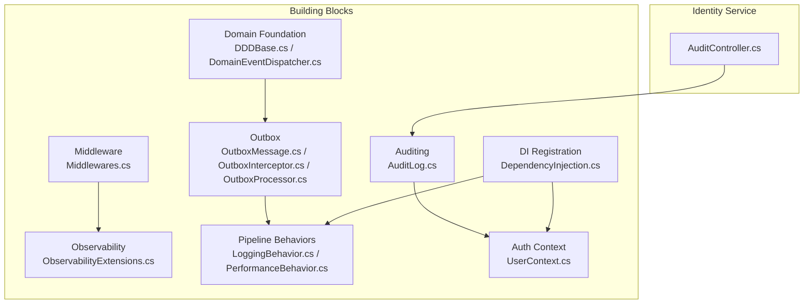

**Diagram sources**
- [AuditLog.cs](file://src/BuildingBlocks/ErpSystem.BuildingBlocks/Auditing/AuditLog.cs#L1-L135)
- [ObservabilityExtensions.cs](file://src/BuildingBlocks/ErpSystem.BuildingBlocks/Observability/ObservabilityExtensions.cs#L1-L44)
- [Middlewares.cs](file://src/BuildingBlocks/ErpSystem.BuildingBlocks/Middleware/Middlewares.cs#L1-L125)
- [LoggingBehavior.cs](file://src/BuildingBlocks/ErpSystem.BuildingBlocks/Behaviors/LoggingBehavior.cs#L1-L22)
- [PerformanceBehavior.cs](file://src/BuildingBlocks/ErpSystem.BuildingBlocks/Behaviors/PerformanceBehavior.cs#L1-L68)
- [OutboxMessage.cs](file://src/BuildingBlocks/ErpSystem.BuildingBlocks/Outbox/OutboxMessage.cs#L1-L82)
- [OutboxInterceptor.cs](file://src/BuildingBlocks/ErpSystem.BuildingBlocks/Outbox/OutboxInterceptor.cs#L1-L51)
- [OutboxProcessor.cs](file://src/BuildingBlocks/ErpSystem.BuildingBlocks/Outbox/OutboxProcessor.cs#L1-L72)
- [DDDBase.cs](file://src/BuildingBlocks/ErpSystem.BuildingBlocks/Domain/DDDBase.cs#L1-L137)
- [DomainEventDispatcher.cs](file://src/BuildingBlocks/ErpSystem.BuildingBlocks/Domain/DomainEventDispatcher.cs#L1-L72)
- [UserContext.cs](file://src/BuildingBlocks/ErpSystem.BuildingBlocks/Auth/UserContext.cs#L1-L34)
- [DependencyInjection.cs](file://src/BuildingBlocks/ErpSystem.BuildingBlocks/DependencyInjection.cs#L1-L31)
- [AuditController.cs](file://src/Services/Identity/ErpSystem.Identity/API/AuditController.cs#L1-L25)

**Section sources**
- [AuditLog.cs](file://src/BuildingBlocks/ErpSystem.BuildingBlocks/Auditing/AuditLog.cs#L1-L135)
- [ObservabilityExtensions.cs](file://src/BuildingBlocks/ErpSystem.BuildingBlocks/Observability/ObservabilityExtensions.cs#L1-L44)
- [Middlewares.cs](file://src/BuildingBlocks/ErpSystem.BuildingBlocks/Middleware/Middlewares.cs#L1-L125)
- [LoggingBehavior.cs](file://src/BuildingBlocks/ErpSystem.BuildingBlocks/Behaviors/LoggingBehavior.cs#L1-L22)
- [PerformanceBehavior.cs](file://src/BuildingBlocks/ErpSystem.BuildingBlocks/Behaviors/PerformanceBehavior.cs#L1-L68)
- [OutboxMessage.cs](file://src/BuildingBlocks/ErpSystem.BuildingBlocks/Outbox/OutboxMessage.cs#L1-L82)
- [OutboxInterceptor.cs](file://src/BuildingBlocks/ErpSystem.BuildingBlocks/Outbox/OutboxInterceptor.cs#L1-L51)
- [OutboxProcessor.cs](file://src/BuildingBlocks/ErpSystem.BuildingBlocks/Outbox/OutboxProcessor.cs#L1-L72)
- [DDDBase.cs](file://src/BuildingBlocks/ErpSystem.BuildingBlocks/Domain/DDDBase.cs#L1-L137)
- [DomainEventDispatcher.cs](file://src/BuildingBlocks/ErpSystem.BuildingBlocks/Domain/DomainEventDispatcher.cs#L1-L72)
- [UserContext.cs](file://src/BuildingBlocks/ErpSystem.BuildingBlocks/Auth/UserContext.cs#L1-L34)
- [DependencyInjection.cs](file://src/BuildingBlocks/ErpSystem.BuildingBlocks/DependencyInjection.cs#L1-L31)
- [AuditController.cs](file://src/Services/Identity/ErpSystem.Identity/API/AuditController.cs#L1-L25)

## Core Components
- AuditLog model and repository abstraction define the audit trail structure and persistence contract.
- AuditBehavior automatically captures auditable commands and persists them via the repository.
- ObservabilityExtensions integrates OpenTelemetry for logs, metrics, and traces.
- Middleware stack provides request logging, correlation IDs, and global exception handling.
- Pipeline behaviors add logging, validation, performance monitoring, and unhandled exception handling around CQRS handlers.
- Outbox pattern ensures reliable event delivery and supports audit/event sourcing integrations.
- Domain foundation supports event streaming and event store persistence.

**Section sources**
- [AuditLog.cs](file://src/BuildingBlocks/ErpSystem.BuildingBlocks/Auditing/AuditLog.cs#L12-L135)
- [ObservabilityExtensions.cs](file://src/BuildingBlocks/ErpSystem.BuildingBlocks/Observability/ObservabilityExtensions.cs#L10-L44)
- [Middlewares.cs](file://src/BuildingBlocks/ErpSystem.BuildingBlocks/Middleware/Middlewares.cs#L10-L125)
- [LoggingBehavior.cs](file://src/BuildingBlocks/ErpSystem.BuildingBlocks/Behaviors/LoggingBehavior.cs#L6-L22)
- [PerformanceBehavior.cs](file://src/BuildingBlocks/ErpSystem.BuildingBlocks/Behaviors/PerformanceBehavior.cs#L11-L68)
- [OutboxMessage.cs](file://src/BuildingBlocks/ErpSystem.BuildingBlocks/Outbox/OutboxMessage.cs#L10-L82)
- [DDDBase.cs](file://src/BuildingBlocks/ErpSystem.BuildingBlocks/Domain/DDDBase.cs#L14-L137)

## Architecture Overview
The system implements a layered approach:
- HTTP layer: RequestLoggingMiddleware, CorrelationIdMiddleware, GlobalExceptionMiddleware
- Application layer: MediatR pipeline behaviors (logging, validation, performance, exception handling)
- Domain layer: Aggregate roots, domain events, event store/streaming
- Outbox: SaveChanges interceptor captures domain events and persists them; OutboxProcessor publishes them asynchronously
- Audit: AuditBehavior intercepts auditable commands and writes AuditLog entries
- Observability: OpenTelemetry configured for logs, metrics, and traces

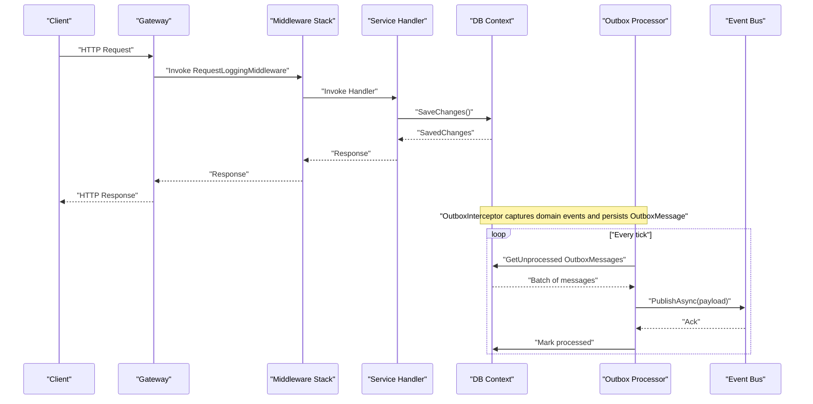

**Diagram sources**
- [Middlewares.cs](file://src/BuildingBlocks/ErpSystem.BuildingBlocks/Middleware/Middlewares.cs#L10-L125)
- [OutboxInterceptor.cs](file://src/BuildingBlocks/ErpSystem.BuildingBlocks/Outbox/OutboxInterceptor.cs#L8-L51)
- [OutboxProcessor.cs](file://src/BuildingBlocks/ErpSystem.BuildingBlocks/Outbox/OutboxProcessor.cs#L8-L72)
- [DDDBase.cs](file://src/BuildingBlocks/ErpSystem.BuildingBlocks/Domain/DDDBase.cs#L59-L120)

## Detailed Component Analysis

### Audit Trail Implementation
- AuditLog defines the audit record schema with entity metadata, action, serialized values, user context, and timestamps.
- IAuditLogRepository abstracts persistence for adding entries and querying by entity.
- AuditBehavior<TRequest,TResponse> is a MediatR pipeline behavior that:
  - Checks if the incoming request implements IAuditableRequest
  - Executes the handler
  - Creates an AuditLog entry with current user context and optional IP/User-Agent
  - Persists the audit log via the repository
  - Logs failures without failing the request
- IAuditableRequest marker interface enables selective auditing of commands.
- Identity service exposes an endpoint to query audit logs with date range and event type filters.

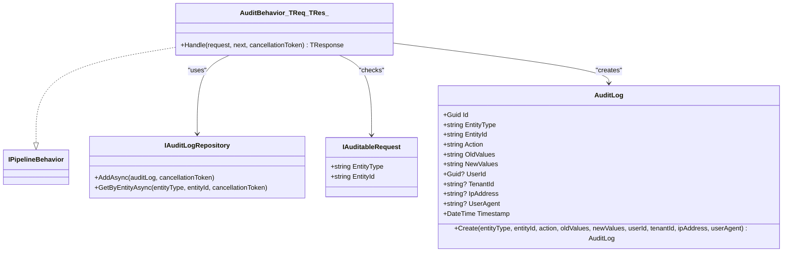

**Diagram sources**
- [AuditLog.cs](file://src/BuildingBlocks/ErpSystem.BuildingBlocks/Auditing/AuditLog.cs#L12-L135)

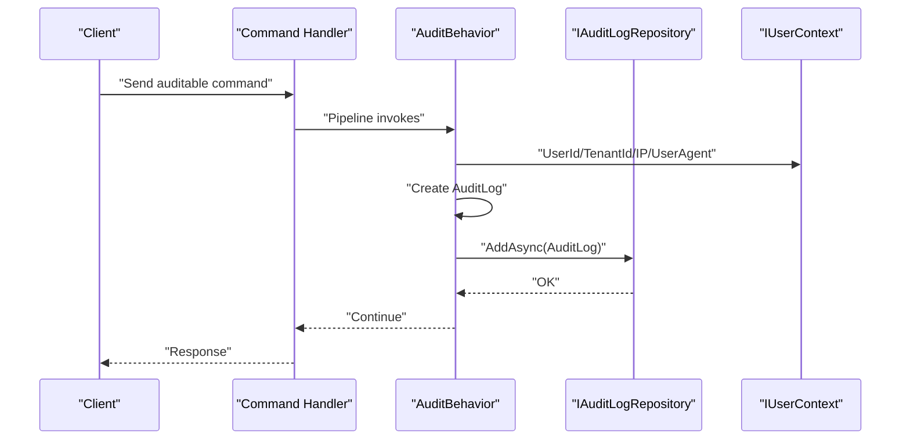

**Diagram sources**
- [AuditLog.cs](file://src/BuildingBlocks/ErpSystem.BuildingBlocks/Auditing/AuditLog.cs#L65-L101)
- [UserContext.cs](file://src/BuildingBlocks/ErpSystem.BuildingBlocks/Auth/UserContext.cs#L6-L34)

Implementation notes:
- To enable auditing for a command, mark it with the IAuditableRequest interface and ensure the AuditBehavior is registered in the pipeline.
- The audit log captures the request payload (new values) and stores it as JSON for later inspection.
- The repository abstraction allows swapping storage backends (e.g., relational, time-series, or event store).

**Section sources**
- [AuditLog.cs](file://src/BuildingBlocks/ErpSystem.BuildingBlocks/Auditing/AuditLog.cs#L12-L135)
- [UserContext.cs](file://src/BuildingBlocks/ErpSystem.BuildingBlocks/Auth/UserContext.cs#L6-L34)
- [AuditController.cs](file://src/Services/Identity/ErpSystem.Identity/API/AuditController.cs#L9-L25)

### Observability Patterns
- ObservabilityExtensions configures:
  - Structured logging with OpenTelemetry
  - Metrics instrumentation for ASP.NET Core, HttpClient, and runtime
  - Tracing instrumentation for ASP.NET Core, HttpClient, and a named source
  - OTLP exporter for exporting telemetry to backends (Jaeger, Aspire Dashboard, Seq, Elastic)
- Services can call AddObservability during startup to enable telemetry.

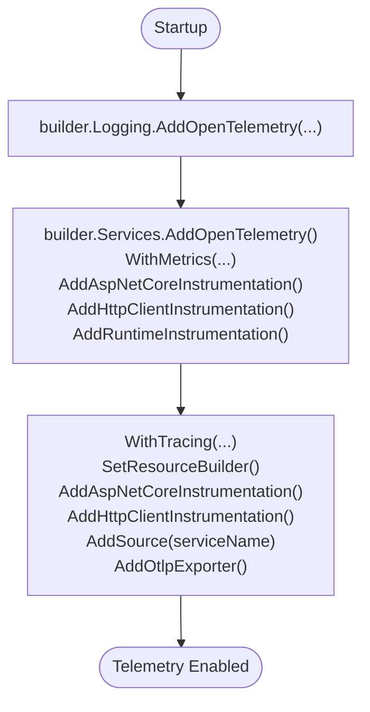

**Diagram sources**
- [ObservabilityExtensions.cs](file://src/BuildingBlocks/ErpSystem.BuildingBlocks/Observability/ObservabilityExtensions.cs#L12-L42)

Operational guidance:
- Set OTEL_EXPORTER_OTLP_ENDPOINT in deployments to route telemetry to your backend.
- Use resource attributes (service name) to distinguish services in dashboards.
- Combine correlation IDs with trace IDs for end-to-end visibility.

**Section sources**
- [ObservabilityExtensions.cs](file://src/BuildingBlocks/ErpSystem.BuildingBlocks/Observability/ObservabilityExtensions.cs#L10-L44)

### Middleware Implementations
- RequestLoggingMiddleware logs request start, completion with status code, and failure with exception details. It generates a short RequestId for correlation.
- CorrelationIdMiddleware injects X-Correlation-ID header and propagates it in responses.
- GlobalExceptionMiddleware standardizes error responses by type and status, and logs unhandled exceptions.

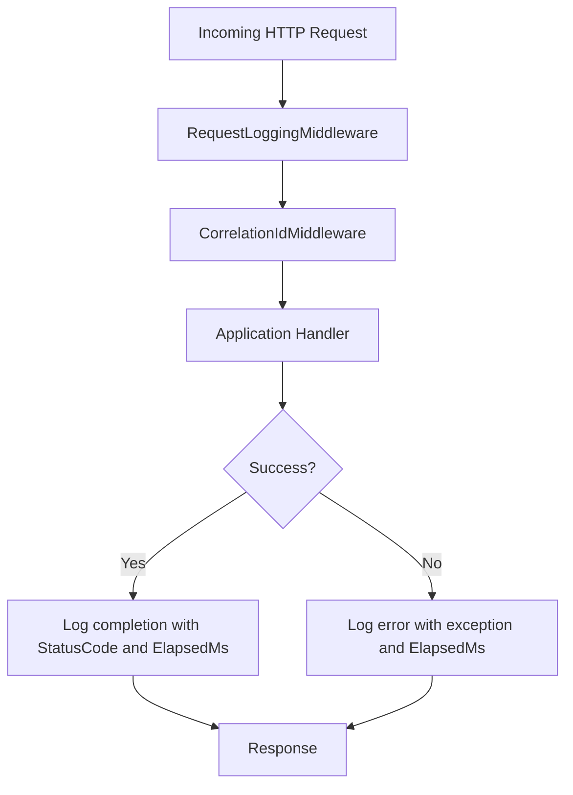

**Diagram sources**
- [Middlewares.cs](file://src/BuildingBlocks/ErpSystem.BuildingBlocks/Middleware/Middlewares.cs#L10-L125)

Best practices:
- Place RequestLoggingMiddleware early in the pipeline to capture all downstream errors.
- Use correlation IDs to join logs, traces, and metrics for a single request flow.

**Section sources**
- [Middlewares.cs](file://src/BuildingBlocks/ErpSystem.BuildingBlocks/Middleware/Middlewares.cs#L10-L125)

### Pipeline Behaviors for Cross-Cutting Concerns
- LoggingBehavior logs request start and completion with request payload.
- ValidationBehavior integrates FluentValidation (registered via DI).
- PerformanceBehavior measures handler duration and warns on slow requests.
- UnhandledExceptionBehavior centralizes exception logging and rethrows.

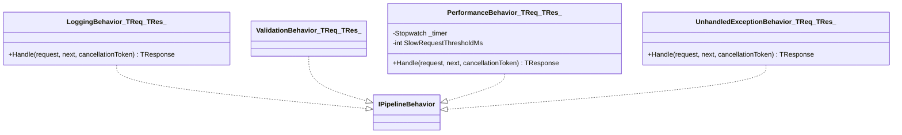

**Diagram sources**
- [LoggingBehavior.cs](file://src/BuildingBlocks/ErpSystem.BuildingBlocks/Behaviors/LoggingBehavior.cs#L6-L22)
- [PerformanceBehavior.cs](file://src/BuildingBlocks/ErpSystem.BuildingBlocks/Behaviors/PerformanceBehavior.cs#L11-L68)

**Section sources**
- [LoggingBehavior.cs](file://src/BuildingBlocks/ErpSystem.BuildingBlocks/Behaviors/LoggingBehavior.cs#L6-L22)
- [PerformanceBehavior.cs](file://src/BuildingBlocks/ErpSystem.BuildingBlocks/Behaviors/PerformanceBehavior.cs#L11-L68)
- [DependencyInjection.cs](file://src/BuildingBlocks/ErpSystem.BuildingBlocks/DependencyInjection.cs#L20-L28)

### Outbox Pattern for Reliable Delivery
- OutboxMessage encapsulates typed events with serialization, retry tracking, and processing state.
- OutboxInterceptor captures domain events during SaveChanges and persists OutboxMessage entries.
- OutboxProcessor periodically reads unprocessed messages, deserializes payloads, publishes via IEventBus, and updates state.

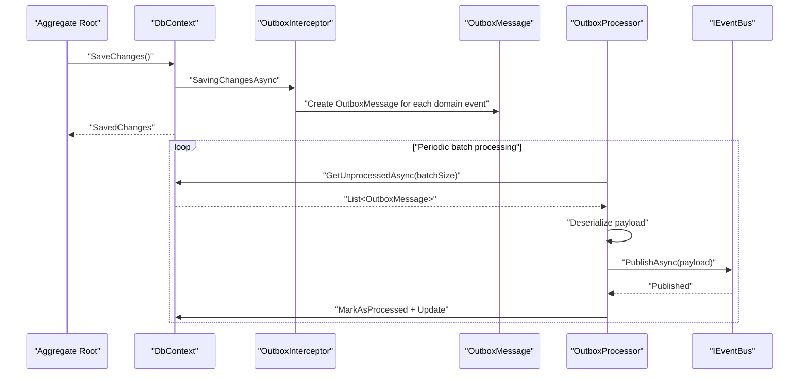

**Diagram sources**
- [OutboxMessage.cs](file://src/BuildingBlocks/ErpSystem.BuildingBlocks/Outbox/OutboxMessage.cs#L10-L82)
- [OutboxInterceptor.cs](file://src/BuildingBlocks/ErpSystem.BuildingBlocks/Outbox/OutboxInterceptor.cs#L8-L51)
- [OutboxProcessor.cs](file://src/BuildingBlocks/ErpSystem.BuildingBlocks/Outbox/OutboxProcessor.cs#L8-L72)

**Section sources**
- [OutboxMessage.cs](file://src/BuildingBlocks/ErpSystem.BuildingBlocks/Outbox/OutboxMessage.cs#L10-L82)
- [OutboxInterceptor.cs](file://src/BuildingBlocks/ErpSystem.BuildingBlocks/Outbox/OutboxInterceptor.cs#L8-L51)
- [OutboxProcessor.cs](file://src/BuildingBlocks/ErpSystem.BuildingBlocks/Outbox/OutboxProcessor.cs#L8-L72)

### Domain Events and Event Store Integration
- AggregateRoot<TId> maintains a change log and applies domain events.
- EventStore persists event streams and publishes domain events to both MediatR and IEventBus.
- DomainEventDispatcher and DomainEventDispatcherInterceptor coordinate event publishing after SaveChanges.

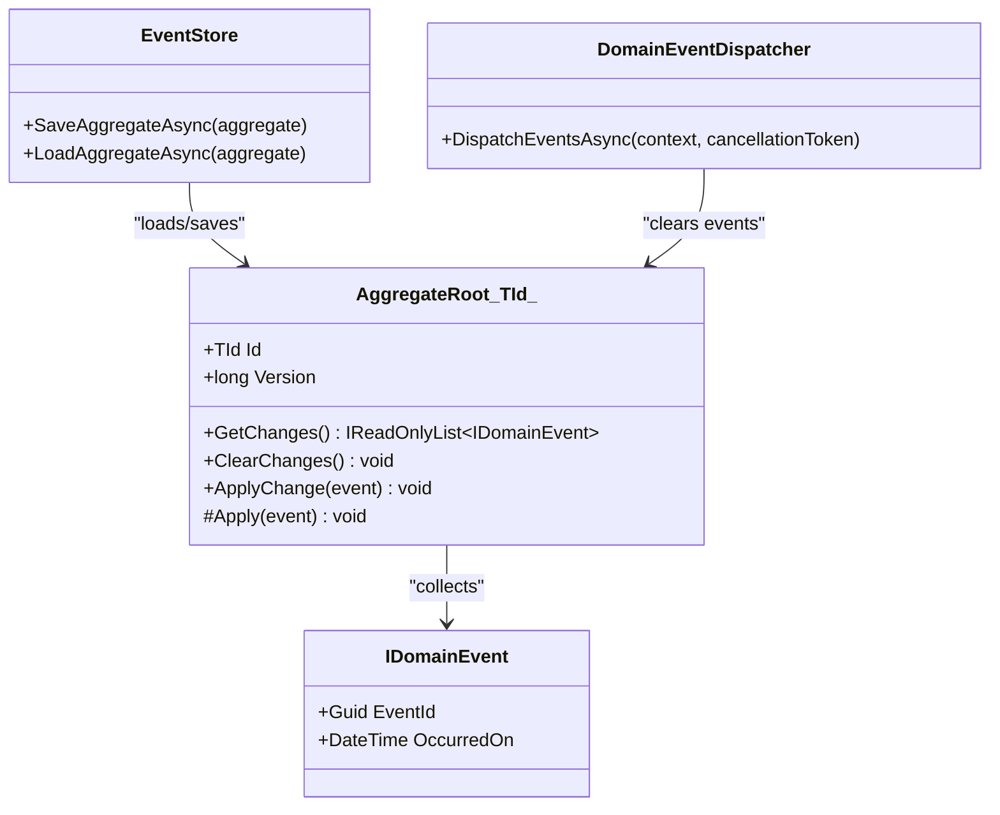

**Diagram sources**
- [DDDBase.cs](file://src/BuildingBlocks/ErpSystem.BuildingBlocks/Domain/DDDBase.cs#L14-L120)
- [DomainEventDispatcher.cs](file://src/BuildingBlocks/ErpSystem.BuildingBlocks/Domain/DomainEventDispatcher.cs#L17-L62)

**Section sources**
- [DDDBase.cs](file://src/BuildingBlocks/ErpSystem.BuildingBlocks/Domain/DDDBase.cs#L14-L137)
- [DomainEventDispatcher.cs](file://src/BuildingBlocks/ErpSystem.BuildingBlocks/Domain/DomainEventDispatcher.cs#L17-L62)

### Audit Log Query Endpoint
- Identity service provides an audit log endpoint allowing filtering by date range and event type, returning recent entries.

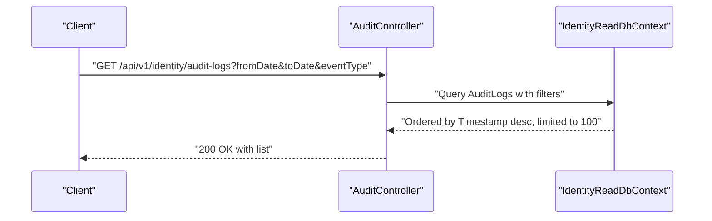

**Diagram sources**
- [AuditController.cs](file://src/Services/Identity/ErpSystem.Identity/API/AuditController.cs#L9-L25)

**Section sources**
- [AuditController.cs](file://src/Services/Identity/ErpSystem.Identity/API/AuditController.cs#L9-L25)

## Dependency Analysis
- DI registration wires up validators, pipeline behaviors, and user context.
- AuditBehavior depends on IAuditLogRepository and IUserContext.
- OutboxProcessor depends on IOutboxRepository and IEventBus.
- ObservabilityExtensions depends on OpenTelemetry packages and environment configuration.

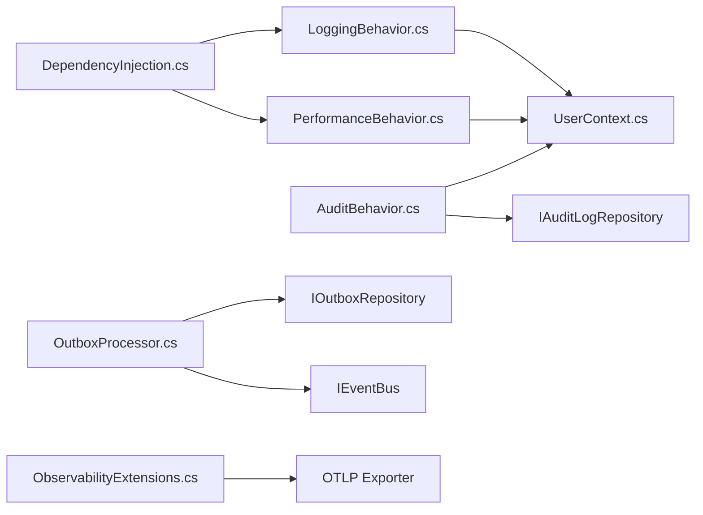

**Diagram sources**
- [DependencyInjection.cs](file://src/BuildingBlocks/ErpSystem.BuildingBlocks/DependencyInjection.cs#L10-L31)
- [AuditLog.cs](file://src/BuildingBlocks/ErpSystem.BuildingBlocks/Auditing/AuditLog.cs#L65-L101)
- [OutboxProcessor.cs](file://src/BuildingBlocks/ErpSystem.BuildingBlocks/Outbox/OutboxProcessor.cs#L8-L72)
- [ObservabilityExtensions.cs](file://src/BuildingBlocks/ErpSystem.BuildingBlocks/Observability/ObservabilityExtensions.cs#L12-L42)

**Section sources**
- [DependencyInjection.cs](file://src/BuildingBlocks/ErpSystem.BuildingBlocks/DependencyInjection.cs#L10-L31)
- [AuditLog.cs](file://src/BuildingBlocks/ErpSystem.BuildingBlocks/Auditing/AuditLog.cs#L65-L101)
- [OutboxProcessor.cs](file://src/BuildingBlocks/ErpSystem.BuildingBlocks/Outbox/OutboxProcessor.cs#L8-L72)
- [ObservabilityExtensions.cs](file://src/BuildingBlocks/ErpSystem.BuildingBlocks/Observability/ObservabilityExtensions.cs#L12-L42)

## Performance Considerations
- AuditBehavior serializes request payloads; avoid auditing extremely large payloads to reduce storage and processing overhead.
- OutboxProcessor runs at a fixed interval; tune delay and batch size based on throughput and latency targets.
- PerformanceBehavior uses a fixed threshold; adjust threshold according to service SLAs.
- ObservabilityExtensions instruments HTTP clients and ASP.NET Core; ensure exporters are configured efficiently in production.

[No sources needed since this section provides general guidance]

## Troubleshooting Guide
Common issues and resolutions:
- Audit logs not appearing:
  - Verify the command implements IAuditableRequest and AuditBehavior is registered in the pipeline.
  - Confirm IAuditLogRepository is implemented and registered.
- Excessive audit volume:
  - Scope auditing to critical commands and entities.
  - Consider partitioning or offloading audit logs to a separate database or time-series store.
- Telemetry not exported:
  - Ensure OTEL_EXPORTER_OTLP_ENDPOINT is set in the environment.
  - Validate service name resource configuration.
- Outbox messages stuck:
  - Check OutboxProcessor logs for deserialization or publishing errors.
  - Confirm IEventBus implementation and target topic/channel availability.
- Middleware exceptions:
  - GlobalExceptionMiddleware standardizes error responses; inspect logs for underlying causes.

**Section sources**
- [AuditLog.cs](file://src/BuildingBlocks/ErpSystem.BuildingBlocks/Auditing/AuditLog.cs#L65-L101)
- [OutboxProcessor.cs](file://src/BuildingBlocks/ErpSystem.BuildingBlocks/Outbox/OutboxProcessor.cs#L8-L72)
- [ObservabilityExtensions.cs](file://src/BuildingBlocks/ErpSystem.BuildingBlocks/Observability/ObservabilityExtensions.cs#L12-L42)
- [Middlewares.cs](file://src/BuildingBlocks/ErpSystem.BuildingBlocks/Middleware/Middlewares.cs#L73-L125)

## Conclusion
The system provides a robust, extensible foundation for auditing and observability:
- AuditTrail: Structured audit logs with automatic capture for auditable commands, repository abstraction, and a dedicated query endpoint.
- Observability: OpenTelemetry integration for logs, metrics, and traces with configurable exporters.
- Middleware and pipeline behaviors: Consistent request logging, correlation, performance monitoring, and error handling.
- Outbox pattern: Reliable event delivery supporting audit and event sourcing integrations.
Adopt these patterns to meet compliance requirements, improve operational visibility, and maintain system reliability.

[No sources needed since this section summarizes without analyzing specific files]

## Appendices

### Audit Log Structure and Fields
- Entity metadata: EntityType, EntityId
- Action: Command/operation name
- Serialized values: OldValues, NewValues
- User context: UserId, TenantId, IpAddress, UserAgent
- Timestamp: UTC timestamp
- Indexes: EntityType+EntityId, Timestamp, UserId

**Section sources**
- [AuditLog.cs](file://src/BuildingBlocks/ErpSystem.BuildingBlocks/Auditing/AuditLog.cs#L12-L135)

### Implementing Audit Trails for Critical Operations
- Mark commands implementing IAuditableRequest with appropriate EntityType and EntityId.
- Ensure AuditBehavior is registered in the MediatR pipeline.
- Persist audit logs via IAuditLogRepository implementation.
- Use the Identity service audit endpoint to query recent events.

**Section sources**
- [AuditLog.cs](file://src/BuildingBlocks/ErpSystem.BuildingBlocks/Auditing/AuditLog.cs#L65-L101)
- [AuditController.cs](file://src/Services/Identity/ErpSystem.Identity/API/AuditController.cs#L9-L25)

### Monitoring Dashboards and Platform Integration
- Configure ObservabilityExtensions with your platform’s OTLP endpoint.
- Use correlation IDs to join logs, traces, and metrics.
- Instrument custom metrics for business KPIs and export via OpenTelemetry Metrics.

**Section sources**
- [ObservabilityExtensions.cs](file://src/BuildingBlocks/ErpSystem.BuildingBlocks/Observability/ObservabilityExtensions.cs#L12-L42)

### Security Considerations
- Protect audit data access with least privilege and role-based authorization.
- Sanitize sensitive fields before storing audit logs; consider redaction policies.
- Encrypt audit data at rest and in transit; rotate keys regularly.
- Centralize log aggregation securely and apply retention policies aligned with compliance.

[No sources needed since this section provides general guidance]