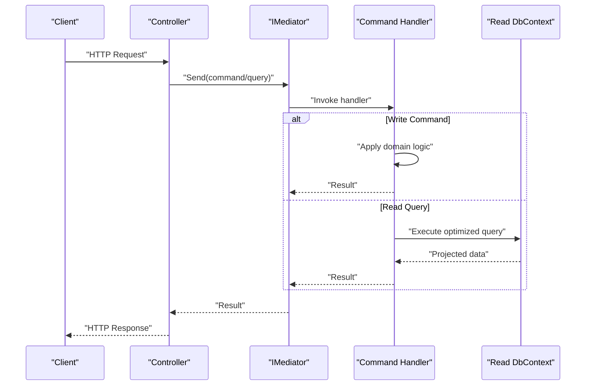
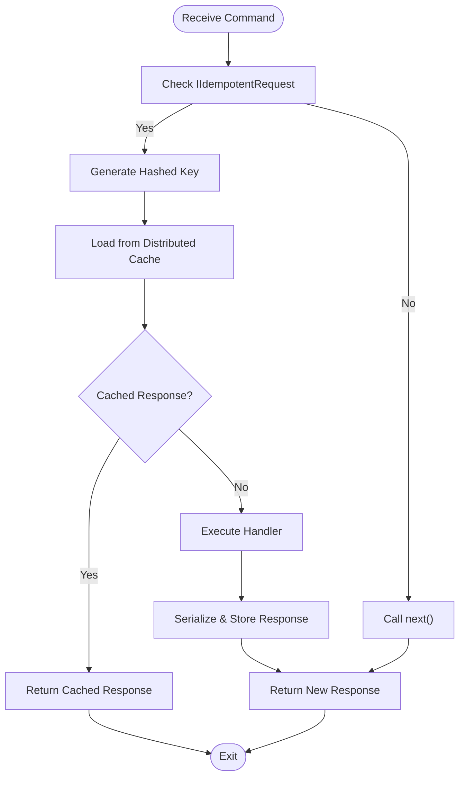
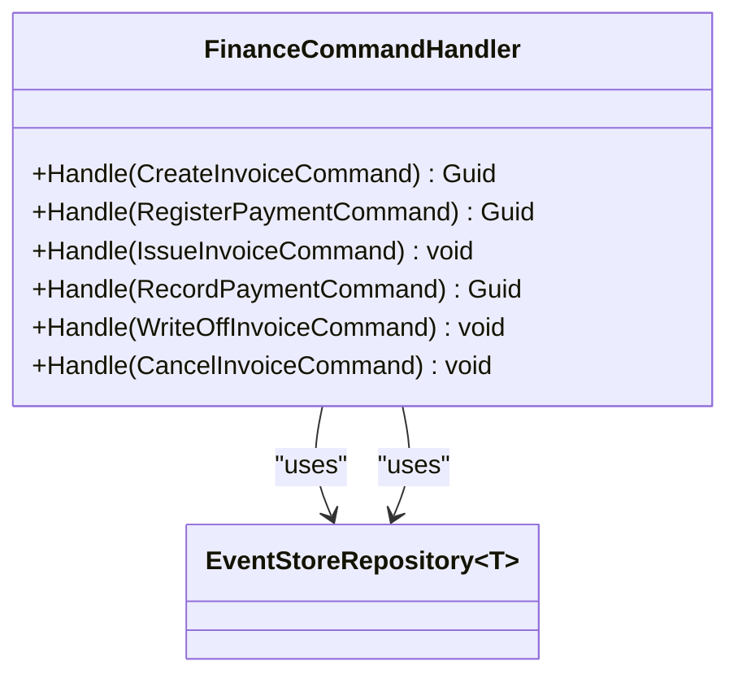
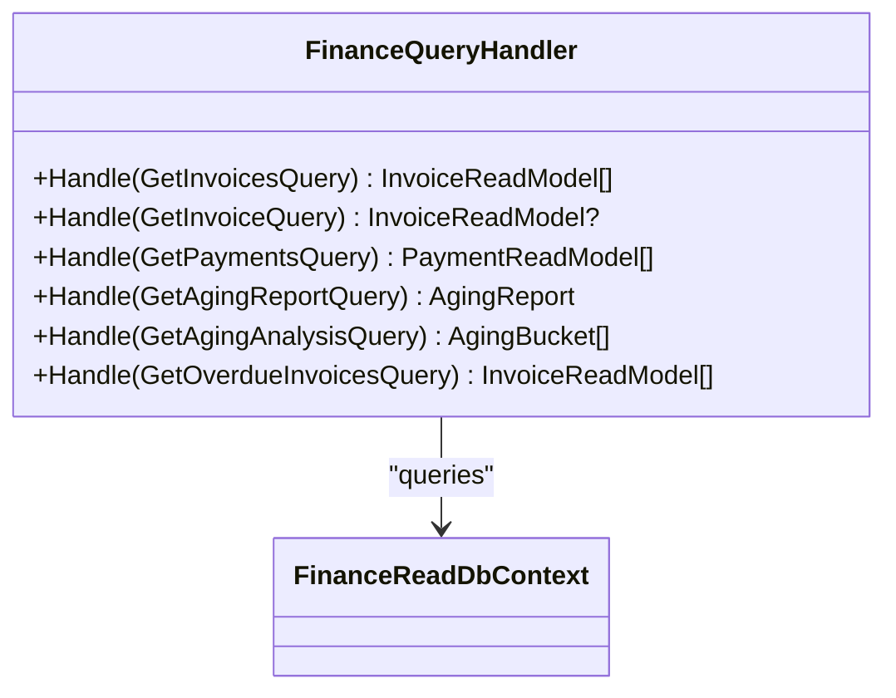
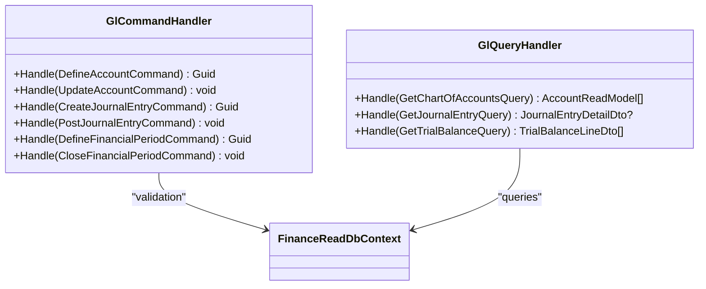
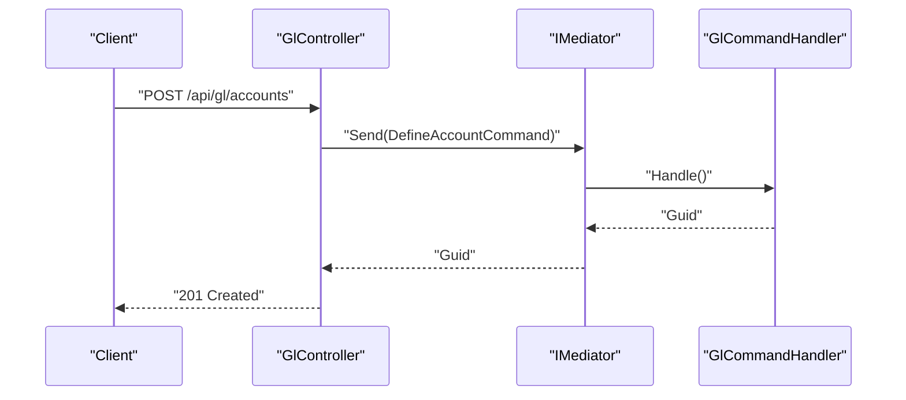
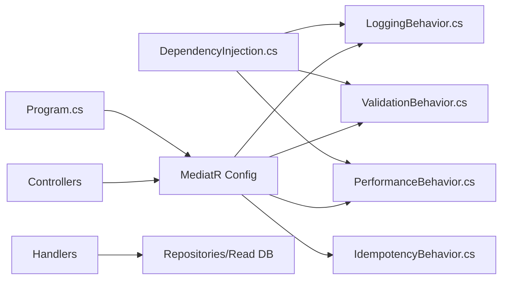

# CQRS Pattern Implementation

<cite>
**Referenced Files in This Document**
- [Abstractions.cs](file://src/BuildingBlocks/ErpSystem.BuildingBlocks/CQRS/Abstractions.cs)
- [LoggingBehavior.cs](file://src/BuildingBlocks/ErpSystem.BuildingBlocks/Behaviors/LoggingBehavior.cs)
- [ValidationBehavior.cs](file://src/BuildingBlocks/ErpSystem.BuildingBlocks/Behaviors/ValidationBehavior.cs)
- [PerformanceBehavior.cs](file://src/BuildingBlocks/ErpSystem.BuildingBlocks/Behaviors/PerformanceBehavior.cs)
- [IdempotencyBehavior.cs](file://src/BuildingBlocks/ErpSystem.BuildingBlocks/Behaviors/IdempotencyBehavior.cs)
- [DependencyInjection.cs](file://src/BuildingBlocks/ErpSystem.BuildingBlocks/DependencyInjection.cs)
- [CacheExtensions.cs](file://src/BuildingBlocks/ErpSystem.BuildingBlocks/Caching/CacheExtensions.cs)
- [FinanceCommands.cs](file://src/Services/Finance/ErpSystem.Finance/Application/FinanceCommands.cs)
- [FinanceQueries.cs](file://src/Services/Finance/ErpSystem.Finance/Application/FinanceQueries.cs)
- [GLCommands.cs](file://src/Services/Finance/ErpSystem.Finance/Application/GLCommands.cs)
- [GLQueries.cs](file://src/Services/Finance/ErpSystem.Finance/Application/GLQueries.cs)
- [Program.cs](file://src/Services/Finance/ErpSystem.Finance/Program.cs)
- [GLController.cs](file://src/Services/Finance/ErpSystem.Finance/API/GLController.cs)
- [InvoicesController.cs](file://src/Services/Finance/ErpSystem.Finance/API/InvoicesController.cs)
</cite>

## Table of Contents
1. [Introduction](#introduction)
2. [Project Structure](#project-structure)
3. [Core Components](#core-components)
4. [Architecture Overview](#architecture-overview)
5. [Detailed Component Analysis](#detailed-component-analysis)
6. [Dependency Analysis](#dependency-analysis)
7. [Performance Considerations](#performance-considerations)
8. [Troubleshooting Guide](#troubleshooting-guide)
9. [Conclusion](#conclusion)
10. [Appendices](#appendices)

## Introduction
This document explains how the Command Query Responsibility Segregation (CQRS) pattern is implemented across the ERP microservices using MediatR abstractions. It covers how commands and queries are separated, how handlers are structured, and how cross-cutting concerns such as logging, validation, performance monitoring, and idempotency are applied via pipeline behaviors. It also documents read model optimization, eventual consistency patterns, and practical examples for registration, handler implementation, and error handling strategies.

## Project Structure
The CQRS implementation spans shared building blocks and per-service application logic:
- Shared building blocks define CQRS abstractions and reusable pipeline behaviors.
- Each service defines commands and queries with dedicated handlers and exposes them via controllers.
- Finance service demonstrates both write-side commands (event-sourced aggregates) and read-side queries (optimized read models).

```mermaid
graph TB
subgraph "Building Blocks"
BB_Abs["CQRS Abstractions<br/>Abstractions.cs"]
BB_Log["LoggingBehavior<br/>LoggingBehavior.cs"]
BB_Val["ValidationBehavior<br/>ValidationBehavior.cs"]
BB_Perf["PerformanceBehavior<br/>PerformanceBehavior.cs"]
BB_Idem["IdempotencyBehavior<br/>IdempotencyBehavior.cs"]
BB_DI["DependencyInjection<br/>DependencyInjection.cs"]
BB_Cache["CacheExtensions<br/>CacheExtensions.cs"]
end
subgraph "Finance Service"
F_Program["Program.cs"]
F_GL_API["GLController.cs"]
F_INV_API["InvoicesController.cs"]
F_GL_Cmd["GLCommands.cs"]
F_GL_Query["GLQueries.cs"]
F_Fin_Cmd["FinanceCommands.cs"]
F_Fin_Query["FinanceQueries.cs"]
end
BB_DI --> F_Program
BB_Log --> F_Program
BB_Val --> F_Program
BB_Perf --> F_Program
BB_Idem --> F_Program
BB_Cache --> F_Program
F_GL_API --> F_Program
F_INV_API --> F_Program
F_GL_Cmd --> F_Program
F_GL_Query --> F_Program
F_Fin_Cmd --> F_Program
F_Fin_Query --> F_Program
```

**Diagram sources**
- [Abstractions.cs](file://src/BuildingBlocks/ErpSystem.BuildingBlocks/CQRS/Abstractions.cs#L1-L39)
- [LoggingBehavior.cs](file://src/BuildingBlocks/ErpSystem.BuildingBlocks/Behaviors/LoggingBehavior.cs#L1-L22)
- [ValidationBehavior.cs](file://src/BuildingBlocks/ErpSystem.BuildingBlocks/Behaviors/ValidationBehavior.cs#L1-L34)
- [PerformanceBehavior.cs](file://src/BuildingBlocks/ErpSystem.BuildingBlocks/Behaviors/PerformanceBehavior.cs#L1-L68)
- [IdempotencyBehavior.cs](file://src/BuildingBlocks/ErpSystem.BuildingBlocks/Behaviors/IdempotencyBehavior.cs#L1-L71)
- [DependencyInjection.cs](file://src/BuildingBlocks/ErpSystem.BuildingBlocks/DependencyInjection.cs#L1-L31)
- [CacheExtensions.cs](file://src/BuildingBlocks/ErpSystem.BuildingBlocks/Caching/CacheExtensions.cs#L1-L72)
- [Program.cs](file://src/Services/Finance/ErpSystem.Finance/Program.cs#L1-L86)
- [GLController.cs](file://src/Services/Finance/ErpSystem.Finance/API/GLController.cs#L1-L76)
- [InvoicesController.cs](file://src/Services/Finance/ErpSystem.Finance/API/InvoicesController.cs#L1-L74)
- [GLCommands.cs](file://src/Services/Finance/ErpSystem.Finance/Application/GLCommands.cs#L1-L98)
- [GLQueries.cs](file://src/Services/Finance/ErpSystem.Finance/Application/GLQueries.cs#L1-L80)
- [FinanceCommands.cs](file://src/Services/Finance/ErpSystem.Finance/Application/FinanceCommands.cs#L1-L142)
- [FinanceQueries.cs](file://src/Services/Finance/ErpSystem.Finance/Application/FinanceQueries.cs#L1-L110)

**Section sources**
- [Program.cs](file://src/Services/Finance/ErpSystem.Finance/Program.cs#L29-L35)
- [DependencyInjection.cs](file://src/BuildingBlocks/ErpSystem.BuildingBlocks/DependencyInjection.cs#L12-L28)

## Core Components
- CQRS Abstractions: Defines marker interfaces for commands, queries, and their handlers to enforce separation of concerns.
- Pipeline Behaviors: Cross-cutting concerns applied around handler execution:
  - LoggingBehavior: Logs request lifecycle.
  - ValidationBehavior: Aggregates and throws FluentValidation errors.
  - PerformanceBehavior: Measures and warns on slow requests.
  - IdempotencyBehavior: Prevents duplicate command execution using distributed cache.
- Read Model Utilities: CacheExtensions provide typed get/set and get-or-set helpers for caching read models.

Benefits of separation:
- Write operations (commands) focus on domain mutations and event sourcing.
- Read operations (queries) focus on optimized projections and fast retrieval.
- Clear boundaries enable independent scaling and evolution of write/read paths.

**Section sources**
- [Abstractions.cs](file://src/BuildingBlocks/ErpSystem.BuildingBlocks/CQRS/Abstractions.cs#L7-L38)
- [LoggingBehavior.cs](file://src/BuildingBlocks/ErpSystem.BuildingBlocks/Behaviors/LoggingBehavior.cs#L6-L21)
- [ValidationBehavior.cs](file://src/BuildingBlocks/ErpSystem.BuildingBlocks/Behaviors/ValidationBehavior.cs#L7-L33)
- [PerformanceBehavior.cs](file://src/BuildingBlocks/ErpSystem.BuildingBlocks/Behaviors/PerformanceBehavior.cs#L11-L39)
- [IdempotencyBehavior.cs](file://src/BuildingBlocks/ErpSystem.BuildingBlocks/Behaviors/IdempotencyBehavior.cs#L14-L50)
- [CacheExtensions.cs](file://src/BuildingBlocks/ErpSystem.BuildingBlocks/Caching/CacheExtensions.cs#L9-L55)

## Architecture Overview
The Finance service illustrates CQRS end-to-end:
- Controllers accept HTTP requests and delegate to MediatR.
- Commands trigger write-side handlers that mutate aggregates and publish events.
- Queries target read-side projections for optimized reads.
- Pipeline behaviors wrap handler execution for logging, validation, performance, and idempotency.

**Diagram sources**
- [GLController.cs](file://src/Services/Finance/ErpSystem.Finance/API/GLController.cs#L10-L75)
- [InvoicesController.cs](file://src/Services/Finance/ErpSystem.Finance/API/InvoicesController.cs#L11-L73)
- [GLCommands.cs](file://src/Services/Finance/ErpSystem.Finance/Application/GLCommands.cs#L24-L97)
- [GLQueries.cs](file://src/Services/Finance/ErpSystem.Finance/Application/GLQueries.cs#L19-L79)
- [FinanceCommands.cs](file://src/Services/Finance/ErpSystem.Finance/Application/FinanceCommands.cs#L45-L141)
- [FinanceQueries.cs](file://src/Services/Finance/ErpSystem.Finance/Application/FinanceQueries.cs#L23-L109)

## Detailed Component Analysis

### CQRS Abstractions
- Command interfaces: ICommand and ICommand<TResult>.
- Query interface: IQuery<TResult>.
- Handler interfaces: ICommandHandler<TCommand>, ICommandHandler<TCommand,TResult>, IQueryHandler<TQuery,TResult>.

These abstractions decouple command/query definitions from their execution, enabling consistent registration and behavior application.

**Section sources**
- [Abstractions.cs](file://src/BuildingBlocks/ErpSystem.BuildingBlocks/CQRS/Abstractions.cs#L7-L38)

### Pipeline Behaviors

#### LoggingBehavior
- Logs before and after handler execution.
- Useful for observability and debugging.

**Section sources**
- [LoggingBehavior.cs](file://src/BuildingBlocks/ErpSystem.BuildingBlocks/Behaviors/LoggingBehavior.cs#L6-L21)

#### ValidationBehavior
- Validates incoming requests using FluentValidation.
- Aggregates failures and throws a single exception if any validator fails.

**Section sources**
- [ValidationBehavior.cs](file://src/BuildingBlocks/ErpSystem.BuildingBlocks/Behaviors/ValidationBehavior.cs#L7-L33)

#### PerformanceBehavior
- Tracks elapsed time and logs warnings for slow requests.
- Includes an unhandled exception behavior that logs and rethrows.

**Section sources**
- [PerformanceBehavior.cs](file://src/BuildingBlocks/ErpSystem.BuildingBlocks/Behaviors/PerformanceBehavior.cs#L11-L39)
- [PerformanceBehavior.cs](file://src/BuildingBlocks/ErpSystem.BuildingBlocks/Behaviors/PerformanceBehavior.cs#L45-L67)

#### IdempotencyBehavior
- Prevents duplicate command execution using a distributed cache.
- Requires commands to implement a marker interface with an idempotency key.

**Diagram sources**
- [IdempotencyBehavior.cs](file://src/BuildingBlocks/ErpSystem.BuildingBlocks/Behaviors/IdempotencyBehavior.cs#L14-L50)

**Section sources**
- [IdempotencyBehavior.cs](file://src/BuildingBlocks/ErpSystem.BuildingBlocks/Behaviors/IdempotencyBehavior.cs#L14-L71)

### Read Model Utilities
- Typed cache helpers: GetAsync/SetAsync with JSON serialization.
- GetOrSetAsync to avoid repeated computation.
- CacheKeyBuilder to construct consistent keys.

**Section sources**
- [CacheExtensions.cs](file://src/BuildingBlocks/ErpSystem.BuildingBlocks/Caching/CacheExtensions.cs#L9-L71)

### Finance Service: Commands and Handlers

#### General Finance Commands
- CreateInvoiceCommand, RegisterPaymentCommand, IssueInvoiceCommand, RecordPaymentCommand, WriteOffInvoiceCommand, CancelInvoiceCommand.
- Handler orchestrates domain aggregates and repositories.

**Diagram sources**
- [FinanceCommands.cs](file://src/Services/Finance/ErpSystem.Finance/Application/FinanceCommands.cs#L45-L141)

**Section sources**
- [FinanceCommands.cs](file://src/Services/Finance/ErpSystem.Finance/Application/FinanceCommands.cs#L7-L141)

#### General Finance Queries
- GetInvoicesQuery, GetInvoiceQuery, GetPaymentsQuery, AgingReport queries.
- Handlers query read models with AsNoTracking for performance.

**Diagram sources**
- [FinanceQueries.cs](file://src/Services/Finance/ErpSystem.Finance/Application/FinanceQueries.cs#L23-L109)

**Section sources**
- [FinanceQueries.cs](file://src/Services/Finance/ErpSystem.Finance/Application/FinanceQueries.cs#L7-L109)

#### General Ledger Commands and Queries
- DefineAccountCommand, CreateJournalEntryCommand, PostJournalEntryCommand, DefineFinancialPeriodCommand, CloseFinancialPeriodCommand.
- GetChartOfAccountsQuery, GetJournalEntryQuery, GetTrialBalanceQuery.

**Diagram sources**
- [GLCommands.cs](file://src/Services/Finance/ErpSystem.Finance/Application/GLCommands.cs#L24-L97)
- [GLQueries.cs](file://src/Services/Finance/ErpSystem.Finance/Application/GLQueries.cs#L19-L79)

**Section sources**
- [GLCommands.cs](file://src/Services/Finance/ErpSystem.Finance/Application/GLCommands.cs#L9-L97)
- [GLQueries.cs](file://src/Services/Finance/ErpSystem.Finance/Application/GLQueries.cs#L8-L79)

### API Controllers and Registration
- Controllers expose endpoints that send commands and queries to MediatR.
- Program.cs registers MediatR and behaviors, and wires up event store and read databases.

**Diagram sources**
- [GLController.cs](file://src/Services/Finance/ErpSystem.Finance/API/GLController.cs#L10-L24)
- [GLCommands.cs](file://src/Services/Finance/ErpSystem.Finance/Application/GLCommands.cs#L24-L43)
- [Program.cs](file://src/Services/Finance/ErpSystem.Finance/Program.cs#L29-L35)

**Section sources**
- [GLController.cs](file://src/Services/Finance/ErpSystem.Finance/API/GLController.cs#L10-L75)
- [InvoicesController.cs](file://src/Services/Finance/ErpSystem.Finance/API/InvoicesController.cs#L11-L73)
- [Program.cs](file://src/Services/Finance/ErpSystem.Finance/Program.cs#L29-L46)

## Dependency Analysis
- Building blocks register validators and behaviors globally.
- Finance service configures MediatR to scan application assemblies and applies pipeline behaviors.
- Controllers depend on IMediator; handlers depend on repositories and read databases.

**Diagram sources**
- [DependencyInjection.cs](file://src/BuildingBlocks/ErpSystem.BuildingBlocks/DependencyInjection.cs#L12-L28)
- [Program.cs](file://src/Services/Finance/ErpSystem.Finance/Program.cs#L29-L35)
- [GLController.cs](file://src/Services/Finance/ErpSystem.Finance/API/GLController.cs#L10-L75)
- [GLCommands.cs](file://src/Services/Finance/ErpSystem.Finance/Application/GLCommands.cs#L24-L97)

**Section sources**
- [DependencyInjection.cs](file://src/BuildingBlocks/ErpSystem.BuildingBlocks/DependencyInjection.cs#L12-L28)
- [Program.cs](file://src/Services/Finance/ErpSystem.Finance/Program.cs#L29-L46)

## Performance Considerations
- Prefer read models with AsNoTracking for queries to reduce change tracking overhead.
- Use projection-specific DTOs to minimize payload sizes.
- Apply IdempotencyBehavior for idempotent commands to reduce retries and duplicate work.
- Monitor slow requests with PerformanceBehavior and optimize hotspots.
- Cache frequently accessed read data using CacheExtensions GetOrSetAsync to reduce database load.

[No sources needed since this section provides general guidance]

## Troubleshooting Guide
- Validation failures: ValidationBehavior aggregates errors; inspect thrown exceptions and request payloads.
- Slow requests: PerformanceBehavior logs warnings; investigate handler bottlenecks.
- Duplicate commands: IdempotencyBehavior detects duplicates; ensure commands implement the idempotency key contract.
- Domain exceptions: Handlers may throw exceptions for invalid states; controllers map to appropriate HTTP statuses.

**Section sources**
- [ValidationBehavior.cs](file://src/BuildingBlocks/ErpSystem.BuildingBlocks/Behaviors/ValidationBehavior.cs#L26-L28)
- [PerformanceBehavior.cs](file://src/BuildingBlocks/ErpSystem.BuildingBlocks/Behaviors/PerformanceBehavior.cs#L27-L36)
- [IdempotencyBehavior.cs](file://src/BuildingBlocks/ErpSystem.BuildingBlocks/Behaviors/IdempotencyBehavior.cs#L31-L35)
- [GLController.cs](file://src/Services/Finance/ErpSystem.Finance/API/GLController.cs#L36-L44)

## Conclusion
The ERP system’s CQRS implementation cleanly separates write and read concerns using MediatR abstractions. Pipeline behaviors provide robust cross-cutting capabilities for logging, validation, performance monitoring, and idempotency. Finance service handlers demonstrate practical patterns for event-sourced writes and optimized read projections. These patterns improve scalability, maintainability, and domain clarity while supporting eventual consistency through projections and caching.

[No sources needed since this section summarizes without analyzing specific files]

## Appendices

### Practical Examples Index
- Command/query registration: See MediatR configuration in Program.cs.
- Handler implementation patterns: FinanceCommands.cs and FinanceQueries.cs.
- Error handling strategies: Controller actions and exception handling in handlers.
- Caching strategies: CacheExtensions usage for read models.

**Section sources**
- [Program.cs](file://src/Services/Finance/ErpSystem.Finance/Program.cs#L29-L35)
- [FinanceCommands.cs](file://src/Services/Finance/ErpSystem.Finance/Application/FinanceCommands.cs#L45-L141)
- [FinanceQueries.cs](file://src/Services/Finance/ErpSystem.Finance/Application/FinanceQueries.cs#L23-L109)
- [GLController.cs](file://src/Services/Finance/ErpSystem.Finance/API/GLController.cs#L36-L44)
- [CacheExtensions.cs](file://src/BuildingBlocks/ErpSystem.BuildingBlocks/Caching/CacheExtensions.cs#L38-L54)