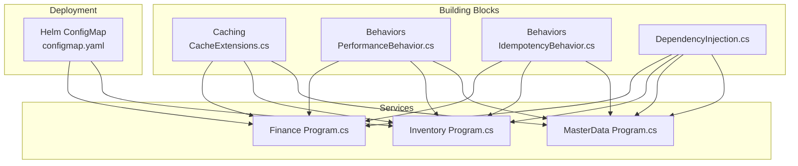
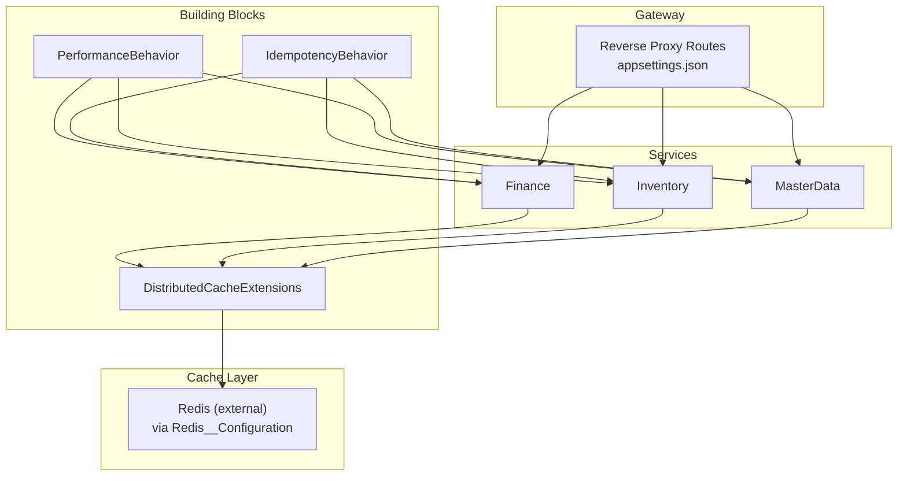
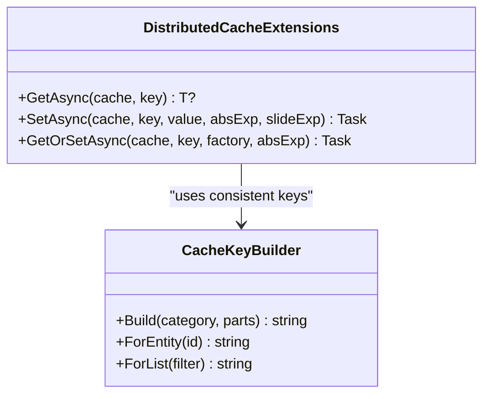
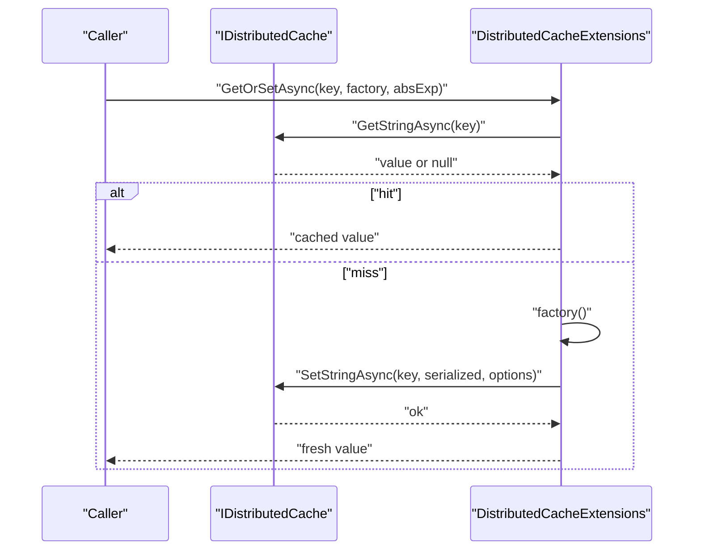
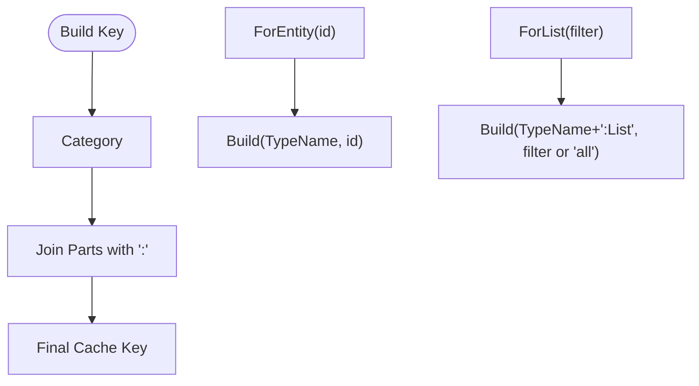
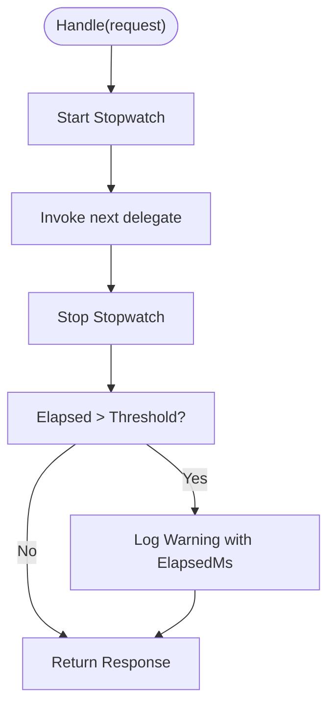
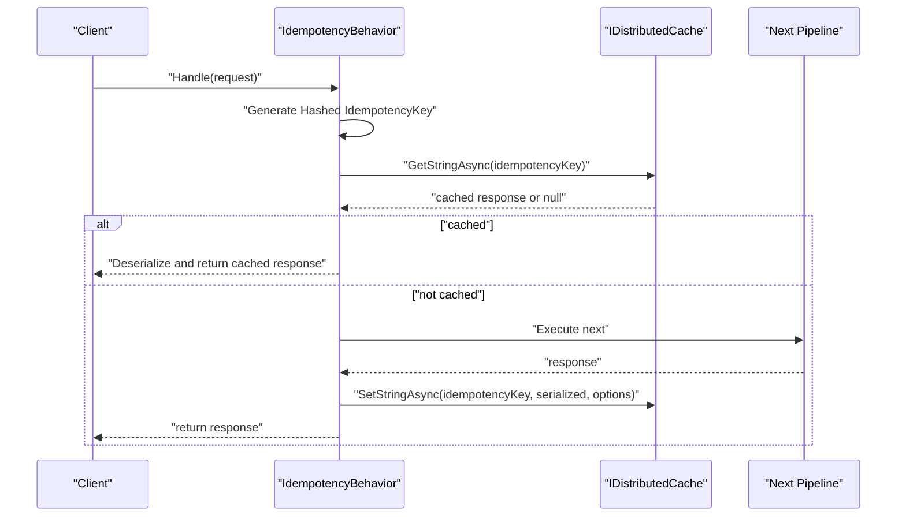
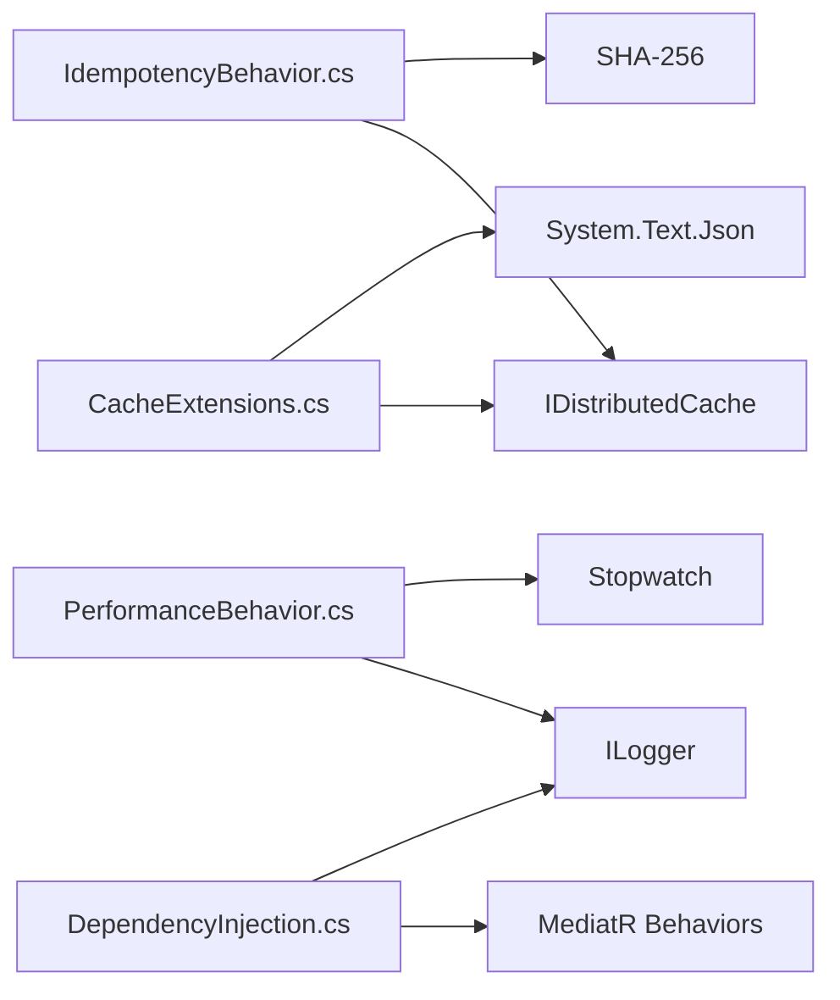

# Caching and Performance Optimization

<cite>
**Referenced Files in This Document**
- [CacheExtensions.cs](file://src/BuildingBlocks/ErpSystem.BuildingBlocks/Caching/CacheExtensions.cs)
- [PerformanceBehavior.cs](file://src/BuildingBlocks/ErpSystem.BuildingBlocks/Behaviors/PerformanceBehavior.cs)
- [IdempotencyBehavior.cs](file://src/BuildingBlocks/ErpSystem.BuildingBlocks/Behaviors/IdempotencyBehavior.cs)
- [DependencyInjection.cs](file://src/BuildingBlocks/ErpSystem.BuildingBlocks/DependencyInjection.cs)
- [configmap.yaml](file://deploy/helm/erp-system/templates/configmap.yaml)
- [appsettings.json](file://src/Gateways/ErpSystem.Gateway/appsettings.json)
- [Program.cs (Finance)](file://src/Services/Finance/ErpSystem.Finance/Program.cs)
- [Program.cs (Inventory)](file://src/Services/Inventory/ErpSystem.Inventory/Program.cs)
- [Program.cs (MasterData)](file://src/Services/MasterData/ErpSystem.MasterData/Program.cs)
</cite>

## Table of Contents
1. [Introduction](#introduction)
2. [Project Structure](#project-structure)
3. [Core Components](#core-components)
4. [Architecture Overview](#architecture-overview)
5. [Detailed Component Analysis](#detailed-component-analysis)
6. [Dependency Analysis](#dependency-analysis)
7. [Performance Considerations](#performance-considerations)
8. [Troubleshooting Guide](#troubleshooting-guide)
9. [Conclusion](#conclusion)
10. [Appendices](#appendices)

## Introduction
This document explains caching strategies and performance optimization patterns implemented in the ERP microservices. It focuses on distributed caching via Microsoft.Extensions.Caching.Distributed, cache-first and cache-aside patterns, cache invalidation strategies, and distributed caching considerations. It also documents cache extensions and helper methods, performance monitoring, cache warming strategies, and integration with Redis and other caching providers. Practical guidance is provided for caching read models, optimizing frequently accessed data, managing cache coherence, cache partitioning, tagging, and expiration policies.

## Project Structure
The caching and performance features are primarily implemented in the Building Blocks library and consumed by service applications. The Helm chart defines a Redis configuration key for enabling distributed caching across services.

**Diagram sources**
- [CacheExtensions.cs](file://src/BuildingBlocks/ErpSystem.BuildingBlocks/Caching/CacheExtensions.cs#L1-L72)
- [PerformanceBehavior.cs](file://src/BuildingBlocks/ErpSystem.BuildingBlocks/Behaviors/PerformanceBehavior.cs#L1-L68)
- [IdempotencyBehavior.cs](file://src/BuildingBlocks/ErpSystem.BuildingBlocks/Behaviors/IdempotencyBehavior.cs#L1-L77)
- [DependencyInjection.cs](file://src/BuildingBlocks/ErpSystem.BuildingBlocks/DependencyInjection.cs#L1-L31)
- [configmap.yaml](file://deploy/helm/erp-system/templates/configmap.yaml#L1-L19)
- [Program.cs (Finance)](file://src/Services/Finance/ErpSystem.Finance/Program.cs#L1-L86)
- [Program.cs (Inventory)](file://src/Services/Inventory/ErpSystem.Inventory/Program.cs#L1-L74)
- [Program.cs (MasterData)](file://src/Services/MasterData/ErpSystem.MasterData/Program.cs#L1-L68)

**Section sources**
- [CacheExtensions.cs](file://src/BuildingBlocks/ErpSystem.BuildingBlocks/Caching/CacheExtensions.cs#L1-L72)
- [PerformanceBehavior.cs](file://src/BuildingBlocks/ErpSystem.BuildingBlocks/Behaviors/PerformanceBehavior.cs#L1-L68)
- [IdempotencyBehavior.cs](file://src/BuildingBlocks/ErpSystem.BuildingBlocks/Behaviors/IdempotencyBehavior.cs#L1-L77)
- [DependencyInjection.cs](file://src/BuildingBlocks/ErpSystem.BuildingBlocks/DependencyInjection.cs#L1-L31)
- [configmap.yaml](file://deploy/helm/erp-system/templates/configmap.yaml#L1-L19)
- [Program.cs (Finance)](file://src/Services/Finance/ErpSystem.Finance/Program.cs#L1-L86)
- [Program.cs (Inventory)](file://src/Services/Inventory/ErpSystem.Inventory/Program.cs#L1-L74)
- [Program.cs (MasterData)](file://src/Services/MasterData/ErpSystem.MasterData/Program.cs#L1-L68)

## Core Components
- Distributed cache extensions provide typed get, set, and get-or-set helpers with JSON serialization and optional absolute/sliding expiration.
- Cache key builder offers consistent key construction for entity and list caches.
- Performance behavior monitors request latency and logs slow requests.
- Idempotency behavior prevents duplicate command execution using distributed cache keys with SHA-256 hashing and a default expiration.
- Dependency injection registers building blocks and MediatR pipeline behaviors.

**Section sources**
- [CacheExtensions.cs](file://src/BuildingBlocks/ErpSystem.BuildingBlocks/Caching/CacheExtensions.cs#L1-L72)
- [PerformanceBehavior.cs](file://src/BuildingBlocks/ErpSystem.BuildingBlocks/Behaviors/PerformanceBehavior.cs#L1-L68)
- [IdempotencyBehavior.cs](file://src/BuildingBlocks/ErpSystem.BuildingBlocks/Behaviors/IdempotencyBehavior.cs#L1-L77)
- [DependencyInjection.cs](file://src/BuildingBlocks/ErpSystem.BuildingBlocks/DependencyInjection.cs#L1-L31)

## Architecture Overview
The system integrates distributed caching across services using Microsoft.Extensions.Caching.Distributed. Services rely on building blocks for cache operations and performance monitoring. The Helm chart exposes a Redis configuration key to enable distributed caching across environments.

**Diagram sources**
- [appsettings.json](file://src/Gateways/ErpSystem.Gateway/appsettings.json#L1-L229)
- [configmap.yaml](file://deploy/helm/erp-system/templates/configmap.yaml#L1-L19)
- [CacheExtensions.cs](file://src/BuildingBlocks/ErpSystem.BuildingBlocks/Caching/CacheExtensions.cs#L1-L72)
- [PerformanceBehavior.cs](file://src/BuildingBlocks/ErpSystem.BuildingBlocks/Behaviors/PerformanceBehavior.cs#L1-L68)
- [IdempotencyBehavior.cs](file://src/BuildingBlocks/ErpSystem.BuildingBlocks/Behaviors/IdempotencyBehavior.cs#L1-L77)

## Detailed Component Analysis

### Distributed Cache Extensions
- Purpose: Typed cache operations with JSON serialization and configurable expiration.
- Operations:
  - GetAsync<T>: Deserializes stored JSON to strongly-typed objects.
  - SetAsync<T>: Serializes objects and stores with absolute/sliding expiration.
  - GetOrSetAsync<T>: Implements cache-aside pattern with lazy population.
- Design: Uses IDistributedCache.GetString/SetString internally for storage and JSON serialization for transport.

**Diagram sources**
- [CacheExtensions.cs](file://src/BuildingBlocks/ErpSystem.BuildingBlocks/Caching/CacheExtensions.cs#L1-L72)

**Section sources**
- [CacheExtensions.cs](file://src/BuildingBlocks/ErpSystem.BuildingBlocks/Caching/CacheExtensions.cs#L1-L72)

### Cache-Aside Pattern Implementation
- The GetOrSetAsync method implements cache-aside semantics:
  - Attempt to load from cache.
  - If missing, compute value via factory and write to cache.
- This pattern is ideal for read-heavy workloads and reduces database pressure.

**Diagram sources**
- [CacheExtensions.cs](file://src/BuildingBlocks/ErpSystem.BuildingBlocks/Caching/CacheExtensions.cs#L38-L54)

**Section sources**
- [CacheExtensions.cs](file://src/BuildingBlocks/ErpSystem.BuildingBlocks/Caching/CacheExtensions.cs#L38-L54)

### Cache Key Builder
- Ensures consistent, hierarchical cache keys:
  - Build: Joins category and parts with a colon separator.
  - ForEntity<T>(id): Keys entity caches by type and identifier.
  - ForList<T>(filter): Keys list caches by type and filter.
- Use this to avoid collisions and simplify cache management.

**Diagram sources**
- [CacheExtensions.cs](file://src/BuildingBlocks/ErpSystem.BuildingBlocks/Caching/CacheExtensions.cs#L60-L71)

**Section sources**
- [CacheExtensions.cs](file://src/BuildingBlocks/ErpSystem.BuildingBlocks/Caching/CacheExtensions.cs#L60-L71)

### Performance Monitoring Pipeline Behavior
- Tracks request duration and logs warnings for slow requests exceeding a threshold.
- Integrates with logging to surface performance issues.

**Diagram sources**
- [PerformanceBehavior.cs](file://src/BuildingBlocks/ErpSystem.BuildingBlocks/Behaviors/PerformanceBehavior.cs#L17-L39)

**Section sources**
- [PerformanceBehavior.cs](file://src/BuildingBlocks/ErpSystem.BuildingBlocks/Behaviors/PerformanceBehavior.cs#L1-L68)

### Idempotency Behavior
- Prevents duplicate command execution using a hashed idempotency key derived from request type and id.
- Stores serialized response in cache with a default expiration to short-circuit subsequent identical requests.

**Diagram sources**
- [IdempotencyBehavior.cs](file://src/BuildingBlocks/ErpSystem.BuildingBlocks/Behaviors/IdempotencyBehavior.cs#L20-L49)

**Section sources**
- [IdempotencyBehavior.cs](file://src/BuildingBlocks/ErpSystem.BuildingBlocks/Behaviors/IdempotencyBehavior.cs#L1-L77)

### Dependency Injection Registration
- Registers building block behaviors (logging, validation, performance, idempotency) with MediatR.
- Adds HttpContext accessor and user context.

**Section sources**
- [DependencyInjection.cs](file://src/BuildingBlocks/ErpSystem.BuildingBlocks/DependencyInjection.cs#L1-L31)

## Dependency Analysis
- Cache extensions depend on IDistributedCache and JSON serialization.
- Idempotency behavior depends on SHA-256 hashing and cache storage.
- Performance behavior depends on logging and timing.
- Services integrate building blocks via dependency injection and use cache extensions for read models and projections.

**Diagram sources**
- [CacheExtensions.cs](file://src/BuildingBlocks/ErpSystem.BuildingBlocks/Caching/CacheExtensions.cs#L1-L72)
- [PerformanceBehavior.cs](file://src/BuildingBlocks/ErpSystem.BuildingBlocks/Behaviors/PerformanceBehavior.cs#L1-L68)
- [IdempotencyBehavior.cs](file://src/BuildingBlocks/ErpSystem.BuildingBlocks/Behaviors/IdempotencyBehavior.cs#L1-L77)
- [DependencyInjection.cs](file://src/BuildingBlocks/ErpSystem.BuildingBlocks/DependencyInjection.cs#L1-L31)

**Section sources**
- [CacheExtensions.cs](file://src/BuildingBlocks/ErpSystem.BuildingBlocks/Caching/CacheExtensions.cs#L1-L72)
- [PerformanceBehavior.cs](file://src/BuildingBlocks/ErpSystem.BuildingBlocks/Behaviors/PerformanceBehavior.cs#L1-L68)
- [IdempotencyBehavior.cs](file://src/BuildingBlocks/ErpSystem.BuildingBlocks/Behaviors/IdempotencyBehavior.cs#L1-L77)
- [DependencyInjection.cs](file://src/BuildingBlocks/ErpSystem.BuildingBlocks/DependencyInjection.cs#L1-L31)

## Performance Considerations
- Use cache-aside for read-heavy queries to reduce database load.
- Prefer cache-first for hot read models to minimize latency.
- Apply absolute expiration for stable data and sliding expiration for frequently accessed but volatile data.
- Partition caches per tenant or domain boundary to improve isolation and reduce contention.
- Tag or group keys by domain or feature to simplify bulk invalidation.
- Warm caches during startup for critical read models to avoid cold-start spikes.
- Monitor slow requests with the performance behavior to identify bottlenecks.
- Ensure cache coherence by invalidating or updating cache entries after write operations.

[No sources needed since this section provides general guidance]

## Troubleshooting Guide
- Slow requests: Investigate logs for warnings emitted by the performance behavior when requests exceed the threshold.
- Duplicate commands: Verify idempotency keys and cache entries for repeated requests; confirm default expiration is sufficient.
- Serialization errors: Ensure cached types are serializable and compatible across service versions.
- Cache misses: Confirm cache keys are built consistently using the cache key builder and that filters are normalized.

**Section sources**
- [PerformanceBehavior.cs](file://src/BuildingBlocks/ErpSystem.BuildingBlocks/Behaviors/PerformanceBehavior.cs#L17-L39)
- [IdempotencyBehavior.cs](file://src/BuildingBlocks/ErpSystem.BuildingBlocks/Behaviors/IdempotencyBehavior.cs#L20-L49)
- [CacheExtensions.cs](file://src/BuildingBlocks/ErpSystem.BuildingBlocks/Caching/CacheExtensions.cs#L11-L36)

## Conclusion
The ERP system leverages a clean, reusable caching layer with typed helpers, consistent key building, and performance monitoring. The cache-aside pattern and idempotency behavior provide robust mechanisms for read scalability and operational safety. Distributed caching is integrated via Helm configuration, enabling Redis-backed caches across services. By applying cache partitioning, tagging, and warming strategies, teams can achieve predictable performance and strong cache coherence.

[No sources needed since this section summarizes without analyzing specific files]

## Appendices

### Cache Patterns and Strategies
- Cache-First: Serve reads from cache; fallback to compute/store if miss.
- Cache-Aside: Compute value off the critical path; populate cache asynchronously.
- Cache-Invalidation: Evict or update cache entries after writes; consider write-through or delayed invalidation.
- Coherence: Use cache tags or groups to invalidate by domain; apply versioned keys for cache-busting.

[No sources needed since this section provides general guidance]

### Cache Warming During Startup
- Preload frequently accessed read models during service startup to reduce initial latency.
- Use cache-aside to fetch and persist data for hot keys.

[No sources needed since this section provides general guidance]

### Cache Expiration Policies
- Absolute expiration: Suitable for stable data with known TTL windows.
- Sliding expiration: Keeps frequently accessed items fresh without absolute TTL limits.

[No sources needed since this section provides general guidance]

### Integration with Redis and Other Providers
- Redis configuration key is exposed via Helm for enabling distributed caching across services.
- Ensure IDistributedCache is registered with the chosen provider (e.g., Redis) in the hosting environment.

**Section sources**
- [configmap.yaml](file://deploy/helm/erp-system/templates/configmap.yaml#L17-L19)

### Example Usage Scenarios
- Caching read models: Use cache key builder to construct keys for entities and lists; apply cache-aside to hydrate on demand.
- Optimizing frequently accessed data: Use sliding expiration for hot keys; warm caches at startup.
- Managing cache coherence: Invalidate cache entries after write operations; consider tagging for batch invalidation.

[No sources needed since this section provides general guidance]