# Core Building Blocks

<cite>
**Referenced Files in This Document**
- [DependencyInjection.cs](file://src/BuildingBlocks/ErpSystem.BuildingBlocks/DependencyInjection.cs)
- [Abstractions.cs](file://src/BuildingBlocks/ErpSystem.BuildingBlocks/CQRS/Abstractions.cs)
- [Result.cs](file://src/BuildingBlocks/ErpSystem.BuildingBlocks/Common/Result.cs)
- [DDDBase.cs](file://src/BuildingBlocks/ErpSystem.BuildingBlocks/Domain/DDDBase.cs)
- [DomainEventDispatcher.cs](file://src/BuildingBlocks/ErpSystem.BuildingBlocks/Domain/DomainEventDispatcher.cs)
- [ISpecification.cs](file://src/BuildingBlocks/ErpSystem.BuildingBlocks/Domain/Specifications/ISpecification.cs)
- [LoggingBehavior.cs](file://src/BuildingBlocks/ErpSystem.BuildingBlocks/Behaviors/LoggingBehavior.cs)
- [ValidationBehavior.cs](file://src/BuildingBlocks/ErpSystem.BuildingBlocks/Behaviors/ValidationBehavior.cs)
- [UserContext.cs](file://src/BuildingBlocks/ErpSystem.BuildingBlocks/Auth/UserContext.cs)
- [MultiTenancy.cs](file://src/BuildingBlocks/ErpSystem.BuildingBlocks/MultiTenancy/MultiTenancy.cs)
- [ResiliencePolicies.cs](file://src/BuildingBlocks/ErpSystem.BuildingBlocks/Resilience/ResiliencePolicies.cs)
- [CacheExtensions.cs](file://src/BuildingBlocks/ErpSystem.BuildingBlocks/Caching/CacheExtensions.cs)
- [AuditLog.cs](file://src/BuildingBlocks/ErpSystem.BuildingBlocks/Auditing/AuditLog.cs)
- [OutboxMessage.cs](file://src/BuildingBlocks/ErpSystem.BuildingBlocks/Outbox/OutboxMessage.cs)
- [OutboxProcessor.cs](file://src/BuildingBlocks/ErpSystem.BuildingBlocks/Outbox/OutboxProcessor.cs)
- [DaprEventBus.cs](file://src/BuildingBlocks/ErpSystem.BuildingBlocks/EventBus/DaprEventBus.cs)
- [EventBusExtensions.cs](file://src/BuildingBlocks/ErpSystem.BuildingBlocks/EventBus/EventBusExtensions.cs)
- [ObservabilityExtensions.cs](file://src/BuildingBlocks/ErpSystem.BuildingBlocks/Observability/ObservabilityExtensions.cs)
- [Middlewares.cs](file://src/BuildingBlocks/ErpSystem.BuildingBlocks/Middleware/Middlewares.cs)
- [SignatureVerificationMiddleware.cs](file://src/BuildingBlocks/ErpSystem.BuildingBlocks/Auth/SignatureVerificationMiddleware.cs)
- [FinanceCommands.cs](file://src/Services/Finance/ErpSystem.Finance/Application/FinanceCommands.cs)
- [GLCommands.cs](file://src/Services/Finance/ErpSystem.Finance/Application/GLCommands.cs)
- [FinanceQueries.cs](file://src/Services/Finance/ErpSystem.Finance/Application/FinanceQueries.cs)
- [GLQueries.cs](file://src/Services/Finance/ErpSystem.Finance/Application/GLQueries.cs)
- [AccountAggregate.cs](file://src/Services/Finance/ErpSystem.Finance/Domain/AccountAggregate.cs)
- [InvoiceAggregate.cs](file://src/Services/Finance/ErpSystem.Finance/Domain/InvoiceAggregate.cs)
- [JournalEntryAggregate.cs](file://src/Services/Finance/ErpSystem.Finance/Domain/JournalEntryAggregate.cs)
- [FinancialPeriodAggregate.cs](file://src/Services/Finance/ErpSystem.Finance/Domain/FinancialPeriodAggregate.cs)
- [PaymentAggregate.cs](file://src/Services/Finance/ErpSystem.Finance/Domain/PaymentAggregate.cs)
- [MaterialCostValuationAggregate.cs](file://src/Services/Finance/ErpSystem.Finance/Domain/MaterialCostValuationAggregate.cs)
- [MasterCommands.cs](file://src/Services/MasterData/ErpSystem.MasterData/Application/MasterCommands.cs)
- [BOMCommands.cs](file://src/Services/MasterData/ErpSystem.MasterData/Application/BOMCommands.cs)
- [BOMQueries.cs](file://src/Services/MasterData/ErpSystem.MasterData/Application/BOMQueries.cs)
- [BillOfMaterialsAggregate.cs](file://src/Services/MasterData/ErpSystem.MasterData/Domain/BillOfMaterialsAggregate.cs)
- [CategoryAggregate.cs](file://src/Services/MasterData/ErpSystem.MasterData/Domain/CategoryAggregate.cs)
- [CustomerAggregate.cs](file://src/Services/MasterData/ErpSystem.MasterData/Domain/CustomerAggregate.cs)
- [LocationAggregate.cs](file://src/Services/MasterData/ErpSystem.MasterData/Domain/LocationAggregate.cs)
- [MaterialAggregate.cs](file://src/Services/MasterData/ErpSystem.MasterData/Domain/MaterialAggregate.cs)
- [SupplierAggregate.cs](file://src/Services/MasterData/ErpSystem.MasterData/Domain/SupplierAggregate.cs)
- [WarehouseAggregate.cs](file://src/Services/MasterData/ErpSystem.MasterData/Domain/WarehouseAggregate.cs)
- [EmployeeAggregate.cs](file://src/Services/HR/ErpSystem.HR/Domain/EmployeeAggregate.cs)
- [EmployeeCommands.cs](file://src/Services/HR/ErpSystem.HR/Application/EmployeeCommands.cs)
- [EmployeeQueries.cs](file://src/Services/HR/ErpSystem.HR/Application/EmployeeQueries.cs)
- [UserAggregate.cs](file://src/Services/Identity/ErpSystem.Identity/Domain/UserAggregate.cs)
- [DepartmentAggregate.cs](file://src/Services/Identity/ErpSystem.Identity/Domain/DepartmentAggregate.cs)
</cite>

## Table of Contents
1. [Introduction](#introduction)
2. [Project Structure](#project-structure)
3. [Core Components](#core-components)
4. [Architecture Overview](#architecture-overview)
5. [Detailed Component Analysis](#detailed-component-analysis)
6. [Dependency Analysis](#dependency-analysis)
7. [Performance Considerations](#performance-considerations)
8. [Troubleshooting Guide](#troubleshooting-guide)
9. [Conclusion](#conclusion)
10. [Appendices](#appendices)

## Introduction
This document describes the shared kernel that underpins the enterprise ERP system’s microservices. It focuses on the core building blocks that enable scalable, maintainable, and resilient services. These include:
- CQRS with MediatR abstractions and pipeline behaviors
- Domain-Driven Design with aggregate roots, domain events, and event sourcing
- Multi-tenant isolation, resilience via Polly, caching, auditing, and middleware
- Common patterns such as Result<T> for railway-oriented error handling, the specification pattern, and the outbox pattern for reliable event publishing

The goal is to explain how these building blocks are implemented, how they integrate across services, and how to extend them for new functionality.

## Project Structure
The BuildingBlocks library centralizes cross-cutting concerns and reusable patterns. Services consume these building blocks through DI registration and by implementing the provided abstractions.

```mermaid
graph TB
subgraph "BuildingBlocks"
BB_CQRS["CQRS Abstractions"]
BB_Common["Common Types<br/>Result<T>, Error"]
BB_Domain["DDD Base<br/>Aggregates, Events, Event Store"]
BB_Behaviors["MediatR Behaviors<br/>Logging, Validation, Audit"]
BB_Auth["Auth & UserContext"]
BB_Tenant["Multi-Tenancy<br/>EF Interceptors"]
BB_Resilience["Polly Resilience Pipelines"]
BB_Cache["Distributed Cache Extensions"]
BB_Audit["Audit Log"]
BB_Outbox["Outbox Message & Processor"]
BB_EventBus["Event Bus (Dapr)"]
BB_Observ["Observability"]
BB_MW["Middleware"]
end
subgraph "Services"
SVC_Finance["Finance Service"]
SVC_MasterData["MasterData Service"]
SVC_HR["HR Service"]
SVC_Identity["Identity Service"]
end
SVC_Finance --> BB_CQRS
SVC_Finance --> BB_Common
SVC_Finance --> BB_Domain
SVC_Finance --> BB_Behaviors
SVC_Finance --> BB_Audit
SVC_Finance --> BB_Outbox
SVC_Finance --> BB_EventBus
SVC_MasterData --> BB_CQRS
SVC_MasterData --> BB_Common
SVC_MasterData --> BB_Domain
SVC_MasterData --> BB_Behaviors
SVC_MasterData --> BB_Tenant
SVC_MasterData --> BB_Cache
SVC_HR --> BB_CQRS
SVC_HR --> BB_Domain
SVC_HR --> BB_Behaviors
SVC_HR --> BB_Audit
SVC_Identity --> BB_CQRS
SVC_Identity --> BB_Domain
SVC_Identity --> BB_Auth
SVC_Identity --> BB_Tenant
SVC_Identity --> BB_EventBus
```

**Diagram sources**
- [DependencyInjection.cs](file://src/BuildingBlocks/ErpSystem.BuildingBlocks/DependencyInjection.cs#L12-L29)
- [Abstractions.cs](file://src/BuildingBlocks/ErpSystem.BuildingBlocks/CQRS/Abstractions.cs#L10-L38)
- [Result.cs](file://src/BuildingBlocks/ErpSystem.BuildingBlocks/Common/Result.cs#L3-L55)
- [DDDBase.cs](file://src/BuildingBlocks/ErpSystem.BuildingBlocks/Domain/DDDBase.cs#L14-L137)
- [DomainEventDispatcher.cs](file://src/BuildingBlocks/ErpSystem.BuildingBlocks/Domain/DomainEventDispatcher.cs#L17-L62)
- [LoggingBehavior.cs](file://src/BuildingBlocks/ErpSystem.BuildingBlocks/Behaviors/LoggingBehavior.cs#L6-L21)
- [ValidationBehavior.cs](file://src/BuildingBlocks/ErpSystem.BuildingBlocks/Behaviors/ValidationBehavior.cs#L7-L33)
- [UserContext.cs](file://src/BuildingBlocks/ErpSystem.BuildingBlocks/Auth/UserContext.cs#L6-L33)
- [MultiTenancy.cs](file://src/BuildingBlocks/ErpSystem.BuildingBlocks/MultiTenancy/MultiTenancy.cs#L68-L99)
- [ResiliencePolicies.cs](file://src/BuildingBlocks/ErpSystem.BuildingBlocks/Resilience/ResiliencePolicies.cs#L13-L110)
- [CacheExtensions.cs](file://src/BuildingBlocks/ErpSystem.BuildingBlocks/Caching/CacheExtensions.cs#L9-L71)
- [AuditLog.cs](file://src/BuildingBlocks/ErpSystem.BuildingBlocks/Auditing/AuditLog.cs#L65-L101)
- [OutboxMessage.cs](file://src/BuildingBlocks/ErpSystem.BuildingBlocks/Outbox/OutboxMessage.cs#L10-L55)
- [OutboxProcessor.cs](file://src/BuildingBlocks/ErpSystem.BuildingBlocks/Outbox/OutboxProcessor.cs#L8-L71)
- [DaprEventBus.cs](file://src/BuildingBlocks/ErpSystem.BuildingBlocks/EventBus/DaprEventBus.cs)
- [EventBusExtensions.cs](file://src/BuildingBlocks/ErpSystem.BuildingBlocks/EventBus/EventBusExtensions.cs)
- [ObservabilityExtensions.cs](file://src/BuildingBlocks/ErpSystem.BuildingBlocks/Observability/ObservabilityExtensions.cs)
- [Middlewares.cs](file://src/BuildingBlocks/ErpSystem.BuildingBlocks/Middleware/Middlewares.cs)
- [SignatureVerificationMiddleware.cs](file://src/BuildingBlocks/ErpSystem.BuildingBlocks/Auth/SignatureVerificationMiddleware.cs)

**Section sources**
- [DependencyInjection.cs](file://src/BuildingBlocks/ErpSystem.BuildingBlocks/DependencyInjection.cs#L12-L29)

## Core Components
This section outlines the primary building blocks and their roles.

- CQRS Abstractions
  - Defines marker interfaces for commands, queries, and their handlers to separate write/read concerns.
  - Enables consistent MediatR usage across services.

- Railway-Oriented Error Handling with Result<T>
  - Provides a strongly-typed Result and Result<T> to model success/failure without throwing exceptions for expected conditions.
  - Encourages explicit error propagation and safe unwrapping.

- Domain-Driven Design Base
  - AggregateRoot<TId> manages in-memory changes and applies domain events.
  - EventStore persists and loads event streams, publishing events via MediatR and the event bus.
  - DomainEventDispatcher integrates with EF Core to publish domain events after SaveChanges.

- Specification Pattern
  - ISpecification<T> encapsulates query criteria, includes, ordering, paging, and grouping for reusable query logic.

- MediatR Pipeline Behaviors
  - LoggingBehavior logs request lifecycle.
  - ValidationBehavior validates incoming requests using FluentValidation.
  - AuditBehavior optionally records auditable command executions.

- Authentication and Authorization
  - UserContext extracts tenant-aware identity claims from HTTP context.

- Multi-Tenant Isolation
  - ITenantContext and IMultiTenantEntity define tenant boundaries.
  - Global query filters and SaveChanges interceptors enforce tenant isolation.

- Resilience with Polly
  - Preconfigured resilience pipelines for retries, circuit breaking, timeouts, and combined strategies.

- Caching
  - Distributed cache extensions provide typed get/set and get-or-set helpers with JSON serialization.

- Auditing
  - AuditLog captures entity changes with user, tenant, IP, and agent metadata.
  - AuditBehavior records auditable requests around command execution.

- Outbox Pattern
  - OutboxMessage persists domain events alongside writes.
  - OutboxProcessor asynchronously publishes messages via the event bus.

- Event Bus (Dapr)
  - Dapr-backed event publishing and extension methods for service integration.

- Observability and Middleware
  - ObservabilityExtensions registers telemetry.
  - SignatureVerificationMiddleware secures inbound requests.

**Section sources**
- [Abstractions.cs](file://src/BuildingBlocks/ErpSystem.BuildingBlocks/CQRS/Abstractions.cs#L10-L38)
- [Result.cs](file://src/BuildingBlocks/ErpSystem.BuildingBlocks/Common/Result.cs#L3-L55)
- [DDDBase.cs](file://src/BuildingBlocks/ErpSystem.BuildingBlocks/Domain/DDDBase.cs#L14-L137)
- [DomainEventDispatcher.cs](file://src/BuildingBlocks/ErpSystem.BuildingBlocks/Domain/DomainEventDispatcher.cs#L17-L62)
- [ISpecification.cs](file://src/BuildingBlocks/ErpSystem.BuildingBlocks/Domain/Specifications/ISpecification.cs#L5-L17)
- [LoggingBehavior.cs](file://src/BuildingBlocks/ErpSystem.BuildingBlocks/Behaviors/LoggingBehavior.cs#L6-L21)
- [ValidationBehavior.cs](file://src/BuildingBlocks/ErpSystem.BuildingBlocks/Behaviors/ValidationBehavior.cs#L7-L33)
- [UserContext.cs](file://src/BuildingBlocks/ErpSystem.BuildingBlocks/Auth/UserContext.cs#L6-L33)
- [MultiTenancy.cs](file://src/BuildingBlocks/ErpSystem.BuildingBlocks/MultiTenancy/MultiTenancy.cs#L12-L63)
- [ResiliencePolicies.cs](file://src/BuildingBlocks/ErpSystem.BuildingBlocks/Resilience/ResiliencePolicies.cs#L13-L110)
- [CacheExtensions.cs](file://src/BuildingBlocks/ErpSystem.BuildingBlocks/Caching/CacheExtensions.cs#L9-L71)
- [AuditLog.cs](file://src/BuildingBlocks/ErpSystem.BuildingBlocks/Auditing/AuditLog.cs#L65-L101)
- [OutboxMessage.cs](file://src/BuildingBlocks/ErpSystem.BuildingBlocks/Outbox/OutboxMessage.cs#L10-L55)
- [OutboxProcessor.cs](file://src/BuildingBlocks/ErpSystem.BuildingBlocks/Outbox/OutboxProcessor.cs#L8-L71)
- [DaprEventBus.cs](file://src/BuildingBlocks/ErpSystem.BuildingBlocks/EventBus/DaprEventBus.cs)
- [EventBusExtensions.cs](file://src/BuildingBlocks/ErpSystem.BuildingBlocks/EventBus/EventBusExtensions.cs)
- [ObservabilityExtensions.cs](file://src/BuildingBlocks/ErpSystem.BuildingBlocks/Observability/ObservabilityExtensions.cs)
- [Middlewares.cs](file://src/BuildingBlocks/ErpSystem.BuildingBlocks/Middleware/Middlewares.cs)
- [SignatureVerificationMiddleware.cs](file://src/BuildingBlocks/ErpSystem.BuildingBlocks/Auth/SignatureVerificationMiddleware.cs)

## Architecture Overview
The shared kernel orchestrates cross-service concerns. Commands and queries traverse MediatR with behaviors, aggregates apply domain events, and persistence is handled by EF Core with interceptors. Events are published either directly via MediatR or through the outbox for eventual consistency.

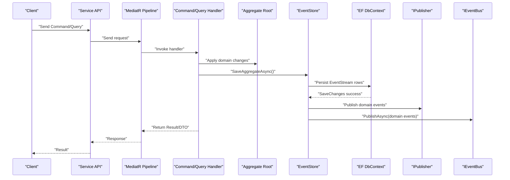

**Diagram sources**
- [DDDBase.cs](file://src/BuildingBlocks/ErpSystem.BuildingBlocks/Domain/DDDBase.cs#L62-L99)
- [DomainEventDispatcher.cs](file://src/BuildingBlocks/ErpSystem.BuildingBlocks/Domain/DomainEventDispatcher.cs#L19-L42)
- [DaprEventBus.cs](file://src/BuildingBlocks/ErpSystem.BuildingBlocks/EventBus/DaprEventBus.cs)

## Detailed Component Analysis

### CQRS with MediatR
- Abstractions define command/query contracts and handler interfaces.
- Dependency injection registers validators and pipeline behaviors.
- Handlers return Result<T> to unify success/failure paths.

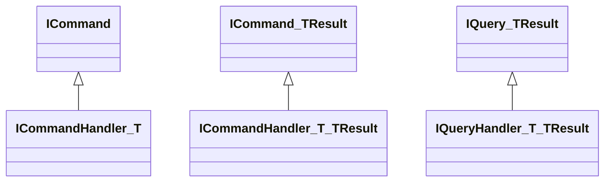

**Diagram sources**
- [Abstractions.cs](file://src/BuildingBlocks/ErpSystem.BuildingBlocks/CQRS/Abstractions.cs#L10-L38)

**Section sources**
- [Abstractions.cs](file://src/BuildingBlocks/ErpSystem.BuildingBlocks/CQRS/Abstractions.cs#L10-L38)
- [DependencyInjection.cs](file://src/BuildingBlocks/ErpSystem.BuildingBlocks/DependencyInjection.cs#L12-L29)

### Railway-Oriented Error Handling with Result<T>
- Error encapsulates failure codes/names.
- Result.Success/Failure and Result<T> provide explicit control flow.
- Implicit operators simplify conversions from domain values.

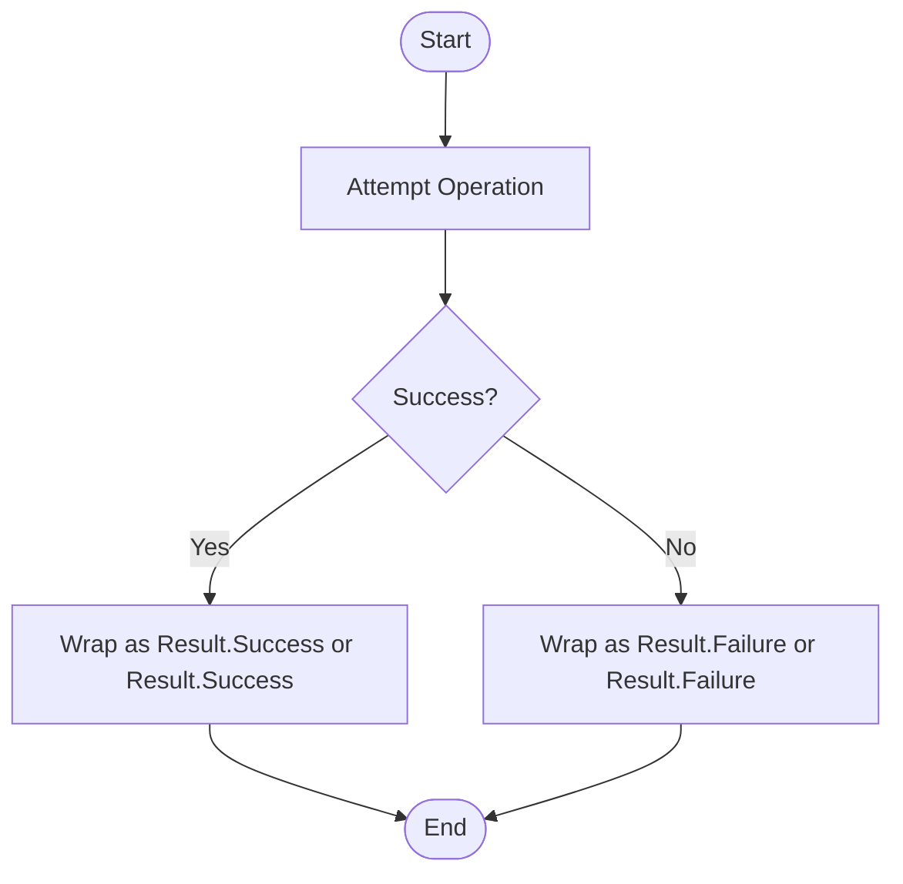

**Diagram sources**
- [Result.cs](file://src/BuildingBlocks/ErpSystem.BuildingBlocks/Common/Result.cs#L32-L55)

**Section sources**
- [Result.cs](file://src/BuildingBlocks/ErpSystem.BuildingBlocks/Common/Result.cs#L3-L55)

### Domain-Driven Design: Aggregates, Events, and Event Sourcing
- AggregateRoot<TId> tracks in-memory changes and applies domain events.
- EventStore persists event streams, deserializes event types, and publishes notifications.
- DomainEventDispatcher integrates with EF Core to publish domain events after SaveChanges.

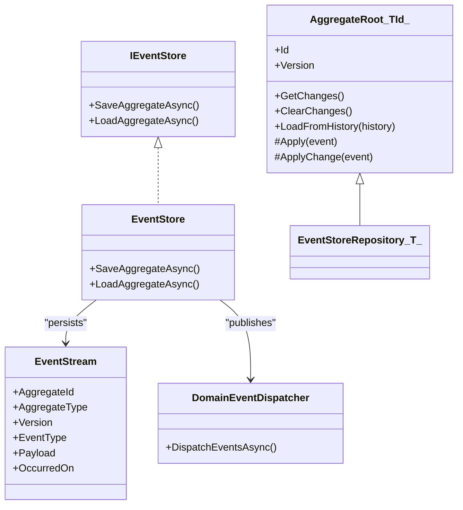

**Diagram sources**
- [DDDBase.cs](file://src/BuildingBlocks/ErpSystem.BuildingBlocks/Domain/DDDBase.cs#L14-L137)
- [DomainEventDispatcher.cs](file://src/BuildingBlocks/ErpSystem.BuildingBlocks/Domain/DomainEventDispatcher.cs#L17-L62)

**Section sources**
- [DDDBase.cs](file://src/BuildingBlocks/ErpSystem.BuildingBlocks/Domain/DDDBase.cs#L14-L137)
- [DomainEventDispatcher.cs](file://src/BuildingBlocks/ErpSystem.BuildingBlocks/Domain/DomainEventDispatcher.cs#L17-L62)

### Specification Pattern for Reusable Query Logic
- ISpecification<T> defines criteria, includes, ordering, paging, and grouping.
- Encourages composition and reuse across queries.

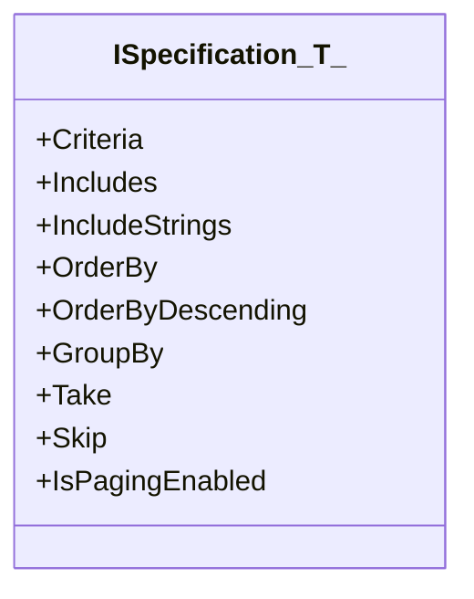

**Diagram sources**
- [ISpecification.cs](file://src/BuildingBlocks/ErpSystem.BuildingBlocks/Domain/Specifications/ISpecification.cs#L5-L17)

**Section sources**
- [ISpecification.cs](file://src/BuildingBlocks/ErpSystem.BuildingBlocks/Domain/Specifications/ISpecification.cs#L5-L17)

### MediatR Behaviors: Logging, Validation, and Audit
- LoggingBehavior logs request lifecycle.
- ValidationBehavior runs FluentValidation validators and throws on failures.
- AuditBehavior records auditable command executions.

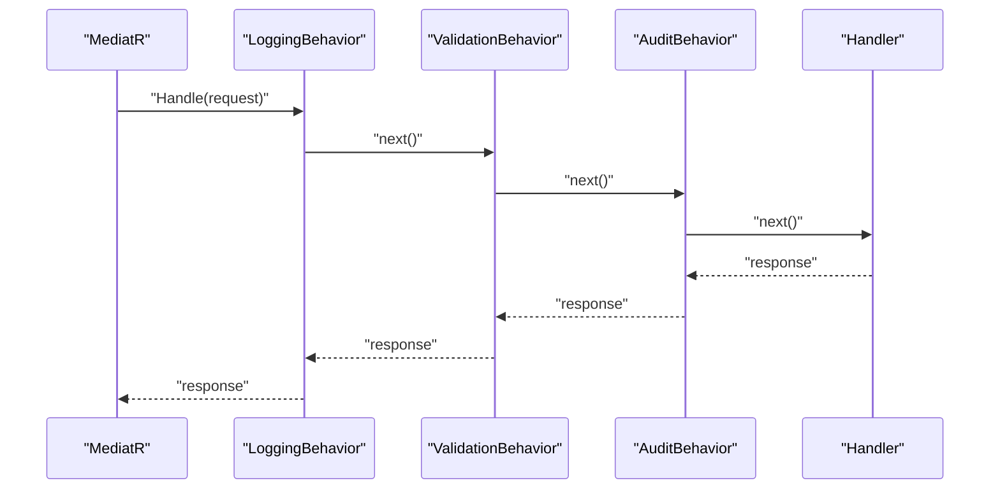

**Diagram sources**
- [LoggingBehavior.cs](file://src/BuildingBlocks/ErpSystem.BuildingBlocks/Behaviors/LoggingBehavior.cs#L9-L20)
- [ValidationBehavior.cs](file://src/BuildingBlocks/ErpSystem.BuildingBlocks/Behaviors/ValidationBehavior.cs#L10-L32)
- [AuditLog.cs](file://src/BuildingBlocks/ErpSystem.BuildingBlocks/Auditing/AuditLog.cs#L65-L101)

**Section sources**
- [LoggingBehavior.cs](file://src/BuildingBlocks/ErpSystem.BuildingBlocks/Behaviors/LoggingBehavior.cs#L6-L21)
- [ValidationBehavior.cs](file://src/BuildingBlocks/ErpSystem.BuildingBlocks/Behaviors/ValidationBehavior.cs#L7-L33)
- [AuditLog.cs](file://src/BuildingBlocks/ErpSystem.BuildingBlocks/Auditing/AuditLog.cs#L65-L101)

### Authentication and Multi-Tenant Isolation
- UserContext extracts tenant-aware identity from HTTP context.
- MultiTenancy global query filters and SaveChanges interceptors enforce tenant isolation.

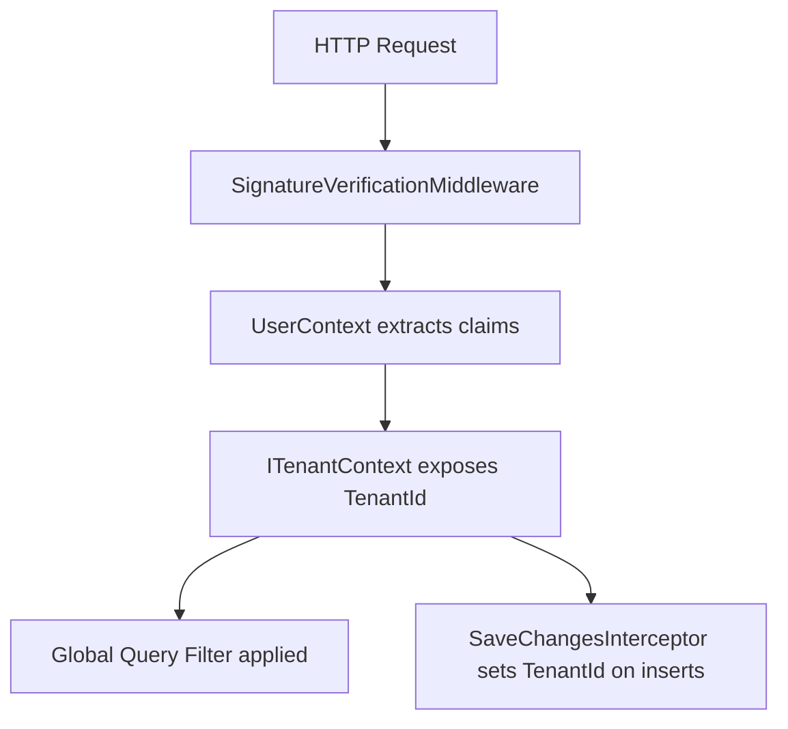

**Diagram sources**
- [SignatureVerificationMiddleware.cs](file://src/BuildingBlocks/ErpSystem.BuildingBlocks/Auth/SignatureVerificationMiddleware.cs)
- [UserContext.cs](file://src/BuildingBlocks/ErpSystem.BuildingBlocks/Auth/UserContext.cs#L6-L33)
- [MultiTenancy.cs](file://src/BuildingBlocks/ErpSystem.BuildingBlocks/MultiTenancy/MultiTenancy.cs#L34-L62)
- [MultiTenancy.cs](file://src/BuildingBlocks/ErpSystem.BuildingBlocks/MultiTenancy/MultiTenancy.cs#L68-L99)

**Section sources**
- [UserContext.cs](file://src/BuildingBlocks/ErpSystem.BuildingBlocks/Auth/UserContext.cs#L6-L33)
- [MultiTenancy.cs](file://src/BuildingBlocks/ErpSystem.BuildingBlocks/MultiTenancy/MultiTenancy.cs#L12-L63)
- [MultiTenancy.cs](file://src/BuildingBlocks/ErpSystem.BuildingBlocks/MultiTenancy/MultiTenancy.cs#L68-L99)

### Resilience Strategies Using Polly
- Preconfigured pipelines for retry, circuit breaker, timeout, and combined strategies.
- Typed HTTP retry pipeline handles transient failures.

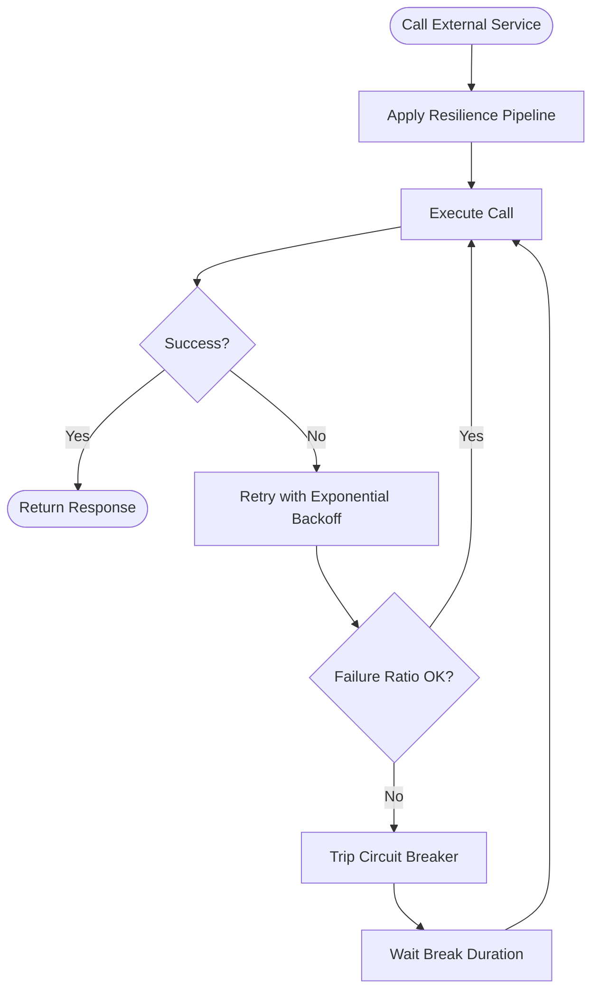

**Diagram sources**
- [ResiliencePolicies.cs](file://src/BuildingBlocks/ErpSystem.BuildingBlocks/Resilience/ResiliencePolicies.cs#L18-L90)

**Section sources**
- [ResiliencePolicies.cs](file://src/BuildingBlocks/ErpSystem.BuildingBlocks/Resilience/ResiliencePolicies.cs#L13-L110)

### Caching Mechanisms
- Distributed cache extensions provide typed get/set and get-or-set with JSON serialization.
- CacheKeyBuilder standardizes cache keys by category and parts.

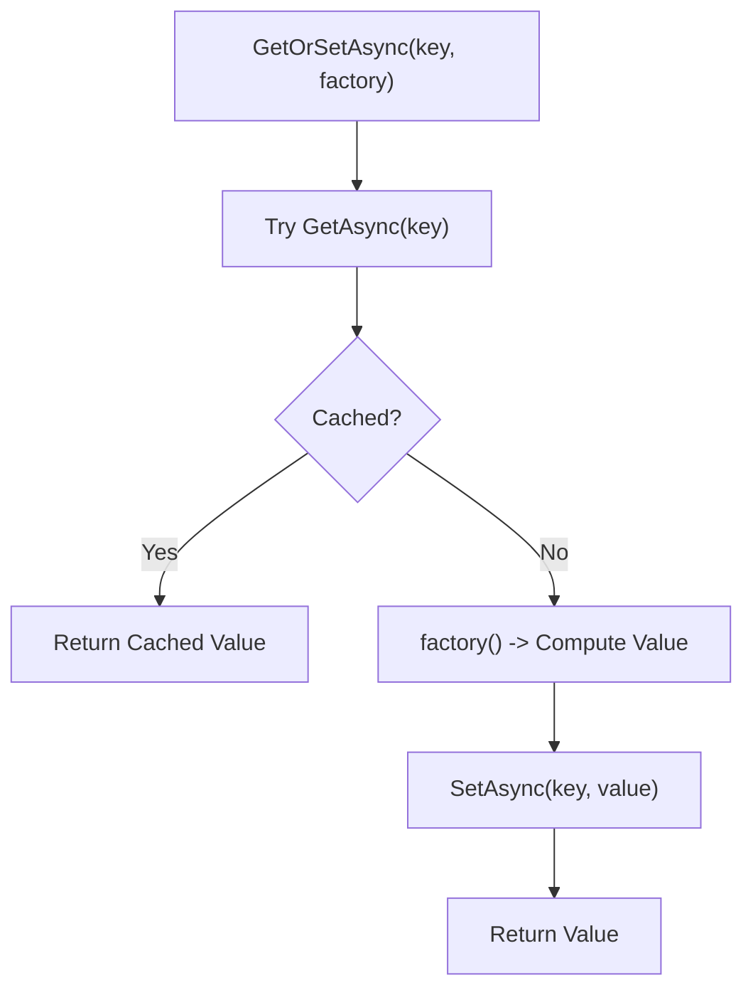

**Diagram sources**
- [CacheExtensions.cs](file://src/BuildingBlocks/ErpSystem.BuildingBlocks/Caching/CacheExtensions.cs#L38-L54)

**Section sources**
- [CacheExtensions.cs](file://src/BuildingBlocks/ErpSystem.BuildingBlocks/Caching/CacheExtensions.cs#L9-L71)

### Auditing System
- AuditLog captures entity changes with user, tenant, IP, and agent metadata.
- AuditBehavior records auditable requests around command execution.

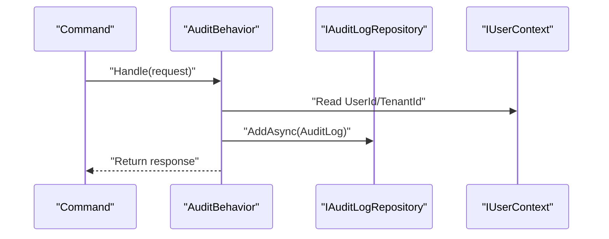

**Diagram sources**
- [AuditLog.cs](file://src/BuildingBlocks/ErpSystem.BuildingBlocks/Auditing/AuditLog.cs#L65-L101)

**Section sources**
- [AuditLog.cs](file://src/BuildingBlocks/ErpSystem.BuildingBlocks/Auditing/AuditLog.cs#L12-L134)

### Outbox Pattern for Reliable Event Publishing
- OutboxMessage persists domain events alongside writes.
- OutboxProcessor asynchronously publishes messages via the event bus.

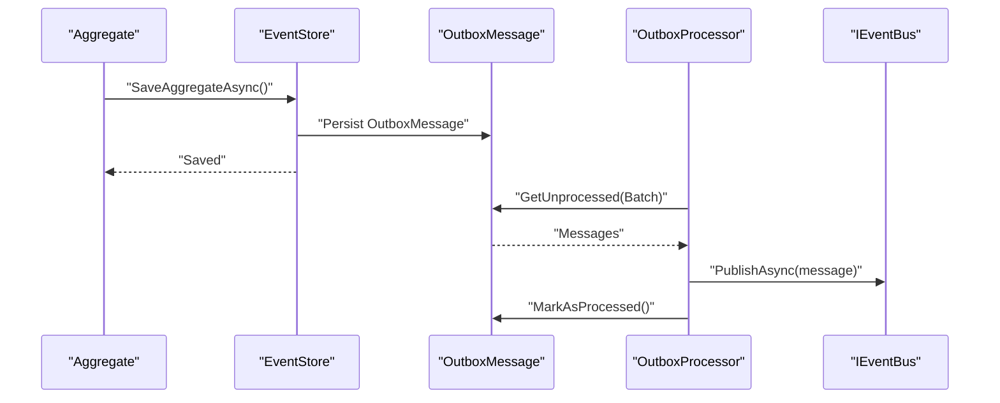

**Diagram sources**
- [DDDBase.cs](file://src/BuildingBlocks/ErpSystem.BuildingBlocks/Domain/DDDBase.cs#L62-L99)
- [OutboxMessage.cs](file://src/BuildingBlocks/ErpSystem.BuildingBlocks/Outbox/OutboxMessage.cs#L22-L54)
- [OutboxProcessor.cs](file://src/BuildingBlocks/ErpSystem.BuildingBlocks/Outbox/OutboxProcessor.cs#L29-L70)

**Section sources**
- [OutboxMessage.cs](file://src/BuildingBlocks/ErpSystem.BuildingBlocks/Outbox/OutboxMessage.cs#L10-L82)
- [OutboxProcessor.cs](file://src/BuildingBlocks/ErpSystem.BuildingBlocks/Outbox/OutboxProcessor.cs#L8-L71)

### Event Bus Integration (Dapr)
- DaprEventBus enables publish/subscribe semantics across services.
- EventBusExtensions provide convenient registration and usage.

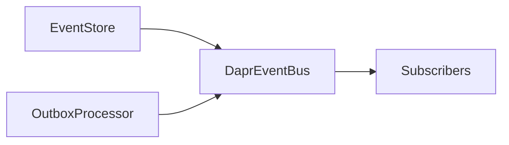

**Diagram sources**
- [DaprEventBus.cs](file://src/BuildingBlocks/ErpSystem.BuildingBlocks/EventBus/DaprEventBus.cs)
- [EventBusExtensions.cs](file://src/BuildingBlocks/ErpSystem.BuildingBlocks/EventBus/EventBusExtensions.cs)

**Section sources**
- [DaprEventBus.cs](file://src/BuildingBlocks/ErpSystem.BuildingBlocks/EventBus/DaprEventBus.cs)
- [EventBusExtensions.cs](file://src/BuildingBlocks/ErpSystem.BuildingBlocks/EventBus/EventBusExtensions.cs)

### Middleware Pipeline
- SignatureVerificationMiddleware authenticates inbound requests.
- Additional middlewares can be registered via Middlewares.cs.

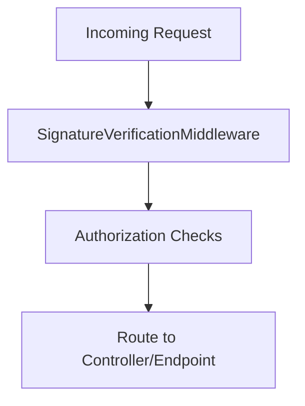

**Diagram sources**
- [SignatureVerificationMiddleware.cs](file://src/BuildingBlocks/ErpSystem.BuildingBlocks/Auth/SignatureVerificationMiddleware.cs)
- [Middlewares.cs](file://src/BuildingBlocks/ErpSystem.BuildingBlocks/Middleware/Middlewares.cs)

**Section sources**
- [SignatureVerificationMiddleware.cs](file://src/BuildingBlocks/ErpSystem.BuildingBlocks/Auth/SignatureVerificationMiddleware.cs)
- [Middlewares.cs](file://src/BuildingBlocks/ErpSystem.BuildingBlocks/Middleware/Middlewares.cs)

## Dependency Analysis
The BuildingBlocks library composes loosely coupled components that services consume through DI. The following diagram highlights key dependencies.

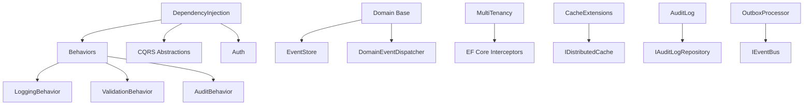

**Diagram sources**
- [DependencyInjection.cs](file://src/BuildingBlocks/ErpSystem.BuildingBlocks/DependencyInjection.cs#L12-L29)
- [LoggingBehavior.cs](file://src/BuildingBlocks/ErpSystem.BuildingBlocks/Behaviors/LoggingBehavior.cs#L6-L21)
- [ValidationBehavior.cs](file://src/BuildingBlocks/ErpSystem.BuildingBlocks/Behaviors/ValidationBehavior.cs#L7-L33)
- [AuditLog.cs](file://src/BuildingBlocks/ErpSystem.BuildingBlocks/Auditing/AuditLog.cs#L65-L101)
- [DDDBase.cs](file://src/BuildingBlocks/ErpSystem.BuildingBlocks/Domain/DDDBase.cs#L59-L120)
- [DomainEventDispatcher.cs](file://src/BuildingBlocks/ErpSystem.BuildingBlocks/Domain/DomainEventDispatcher.cs#L17-L43)
- [MultiTenancy.cs](file://src/BuildingBlocks/ErpSystem.BuildingBlocks/MultiTenancy/MultiTenancy.cs#L68-L99)
- [CacheExtensions.cs](file://src/BuildingBlocks/ErpSystem.BuildingBlocks/Caching/CacheExtensions.cs#L9-L71)
- [OutboxProcessor.cs](file://src/BuildingBlocks/ErpSystem.BuildingBlocks/Outbox/OutboxProcessor.cs#L8-L71)

**Section sources**
- [DependencyInjection.cs](file://src/BuildingBlocks/ErpSystem.BuildingBlocks/DependencyInjection.cs#L12-L29)

## Performance Considerations
- Event Sourcing
  - Persisting many small event rows can increase I/O. Consider batching and optimizing indexes on event stream tables.
- Outbox
  - Tune batch size and delay to balance throughput and latency.
- Caching
  - Use appropriate expiration policies and cache key strategies to minimize cache misses.
- Resilience
  - Choose retry attempts and backoff based on external service SLAs to avoid cascading failures.
- Multi-Tenant Isolation
  - Ensure tenant filters are efficient and leverage composite indexes on tenant-scoped entities.

## Troubleshooting Guide
- Domain Events Not Published
  - Verify DomainEventDispatcherInterceptor is registered and EF SaveChanges is invoked.
  - Confirm event types are resolvable by the event store’s type resolver.
- Outbox Messages Not Processed
  - Ensure IOutboxRepository is registered and OutboxProcessor is running as a hosted service.
  - Check for exceptions during deserialization or event bus publishing.
- Audit Logs Not Recorded
  - Ensure requests implement IAuditableRequest and AuditBehavior is included in the pipeline.
- Multi-Tenant Data Leakage
  - Confirm global query filters are configured and SaveChanges interceptors are active.
  - Verify TenantId is present on new entities.

**Section sources**
- [DomainEventDispatcher.cs](file://src/BuildingBlocks/ErpSystem.BuildingBlocks/Domain/DomainEventDispatcher.cs#L48-L62)
- [OutboxProcessor.cs](file://src/BuildingBlocks/ErpSystem.BuildingBlocks/Outbox/OutboxProcessor.cs#L33-L43)
- [AuditLog.cs](file://src/BuildingBlocks/ErpSystem.BuildingBlocks/Auditing/AuditLog.cs#L72-L101)
- [MultiTenancy.cs](file://src/BuildingBlocks/ErpSystem.BuildingBlocks/MultiTenancy/MultiTenancy.cs#L47-L62)

## Conclusion
The BuildingBlocks library provides a cohesive foundation for enterprise-grade microservices. By combining CQRS, DDD, event sourcing, multi-tenancy, resilience, caching, auditing, and the outbox pattern, teams can implement scalable, observable, and maintainable services. The provided abstractions and behaviors enable consistent integration across services and offer clear extension points for new functionality.

## Appendices

### Practical Examples Across Services
- Finance Service
  - Commands and queries demonstrate CQRS abstractions and Result<T> usage.
  - Aggregates represent financial entities and apply domain events.
  - Example references:
    - [FinanceCommands.cs](file://src/Services/Finance/ErpSystem.Finance/Application/FinanceCommands.cs)
    - [GLCommands.cs](file://src/Services/Finance/ErpSystem.Finance/Application/GLCommands.cs)
    - [FinanceQueries.cs](file://src/Services/Finance/ErpSystem.Finance/Application/FinanceQueries.cs)
    - [GLQueries.cs](file://src/Services/Finance/ErpSystem.Finance/Application/GLQueries.cs)
    - [AccountAggregate.cs](file://src/Services/Finance/ErpSystem.Finance/Domain/AccountAggregate.cs)
    - [InvoiceAggregate.cs](file://src/Services/Finance/ErpSystem.Finance/Domain/InvoiceAggregate.cs)
    - [JournalEntryAggregate.cs](file://src/Services/Finance/ErpSystem.Finance/Domain/JournalEntryAggregate.cs)
    - [FinancialPeriodAggregate.cs](file://src/Services/Finance/ErpSystem.Finance/Domain/FinancialPeriodAggregate.cs)
    - [PaymentAggregate.cs](file://src/Services/Finance/ErpSystem.Finance/Domain/PaymentAggregate.cs)
    - [MaterialCostValuationAggregate.cs](file://src/Services/Finance/ErpSystem.Finance/Domain/MaterialCostValuationAggregate.cs)

- MasterData Service
  - Commands and queries showcase CQRS and specification-based queries.
  - Aggregates model master data entities with multi-tenant support.
  - Example references:
    - [MasterCommands.cs](file://src/Services/MasterData/ErpSystem.MasterData/Application/MasterCommands.cs)
    - [BOMCommands.cs](file://src/Services/MasterData/ErpSystem.MasterData/Application/BOMCommands.cs)
    - [BOMQueries.cs](file://src/Services/MasterData/ErpSystem.MasterData/Application/BOMQueries.cs)
    - [BillOfMaterialsAggregate.cs](file://src/Services/MasterData/ErpSystem.MasterData/Domain/BillOfMaterialsAggregate.cs)
    - [CategoryAggregate.cs](file://src/Services/MasterData/ErpSystem.MasterData/Domain/CategoryAggregate.cs)
    - [CustomerAggregate.cs](file://src/Services/MasterData/ErpSystem.MasterData/Domain/CustomerAggregate.cs)
    - [LocationAggregate.cs](file://src/Services/MasterData/ErpSystem.MasterData/Domain/LocationAggregate.cs)
    - [MaterialAggregate.cs](file://src/Services/MasterData/ErpSystem.MasterData/Domain/MaterialAggregate.cs)
    - [SupplierAggregate.cs](file://src/Services/MasterData/ErpSystem.MasterData/Domain/SupplierAggregate.cs)
    - [WarehouseAggregate.cs](file://src/Services/MasterData/ErpSystem.MasterData/Domain/WarehouseAggregate.cs)

- HR Service
  - Commands and queries illustrate CQRS and Result<T>.
  - Aggregates manage employee-related domain logic.
  - Example references:
    - [EmployeeAggregate.cs](file://src/Services/HR/ErpSystem.HR/Domain/EmployeeAggregate.cs)
    - [EmployeeCommands.cs](file://src/Services/HR/ErpSystem.HR/Application/EmployeeCommands.cs)
    - [EmployeeQueries.cs](file://src/Services/HR/ErpSystem.HR/Application/EmployeeQueries.cs)

- Identity Service
  - Aggregates model identity entities with department and role support.
  - Example references:
    - [UserAggregate.cs](file://src/Services/Identity/ErpSystem.Identity/Domain/UserAggregate.cs)
    - [DepartmentAggregate.cs](file://src/Services/Identity/ErpSystem.Identity/Domain/DepartmentAggregate.cs)

These examples demonstrate how the shared kernel integrates with service-specific domains to deliver consistent patterns and behaviors across the system.