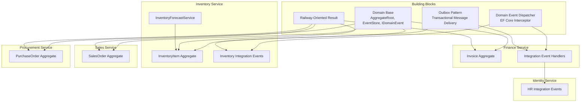
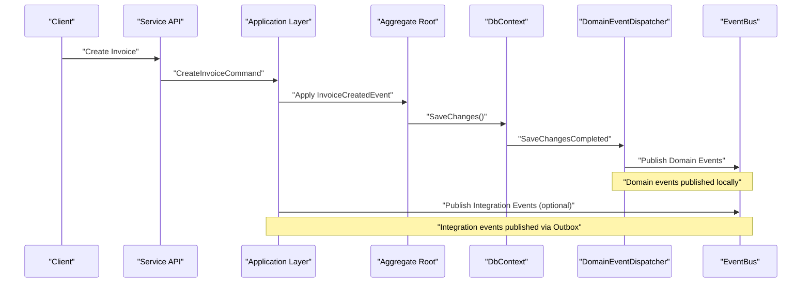
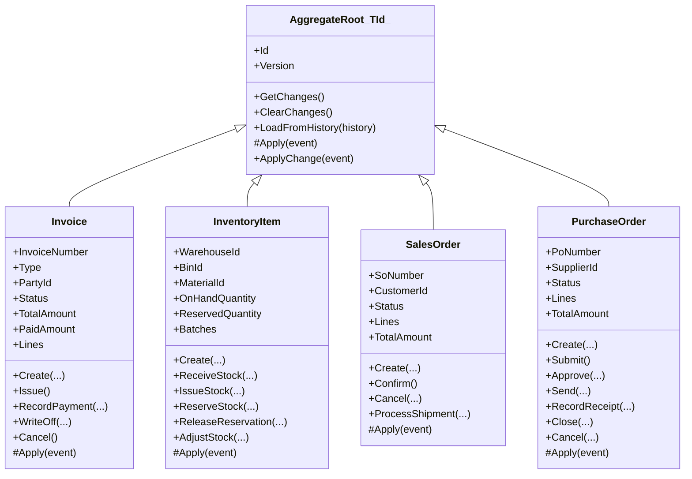
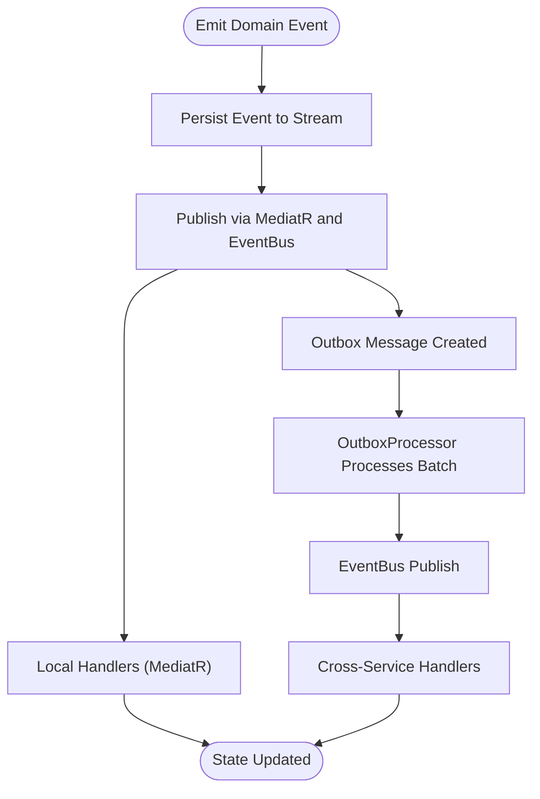
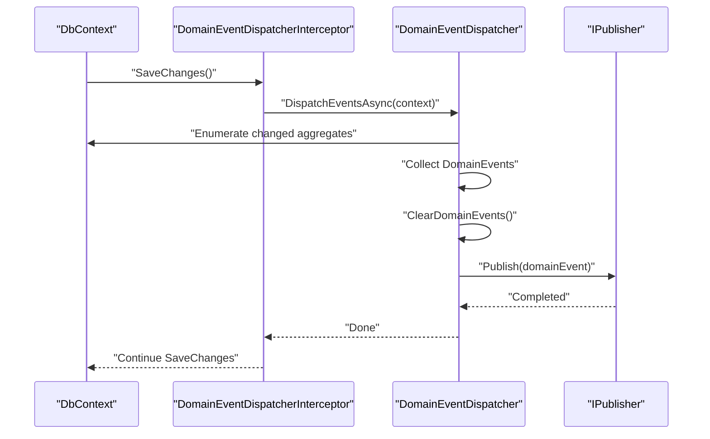
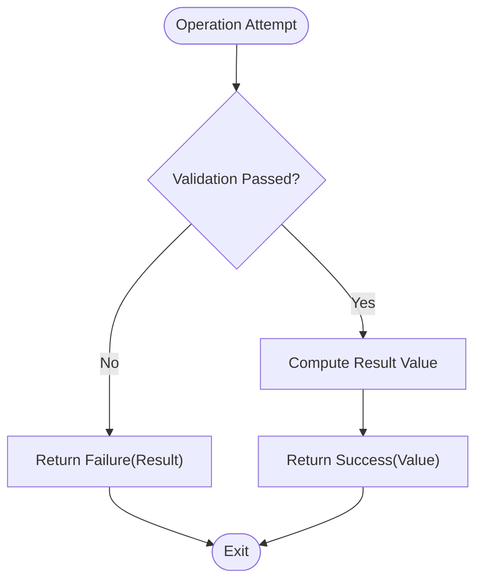
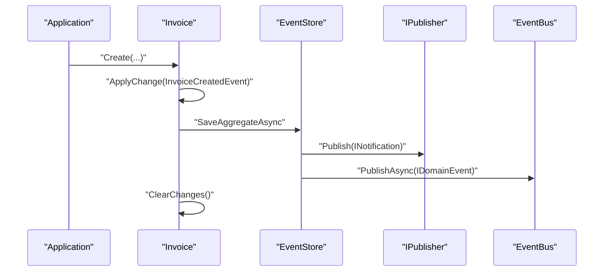
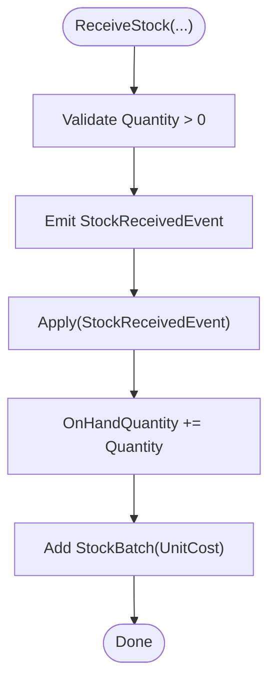
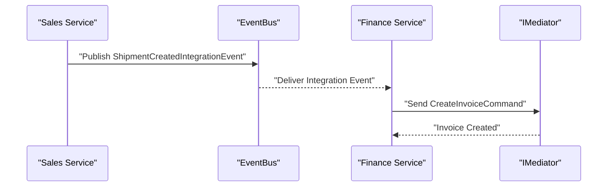
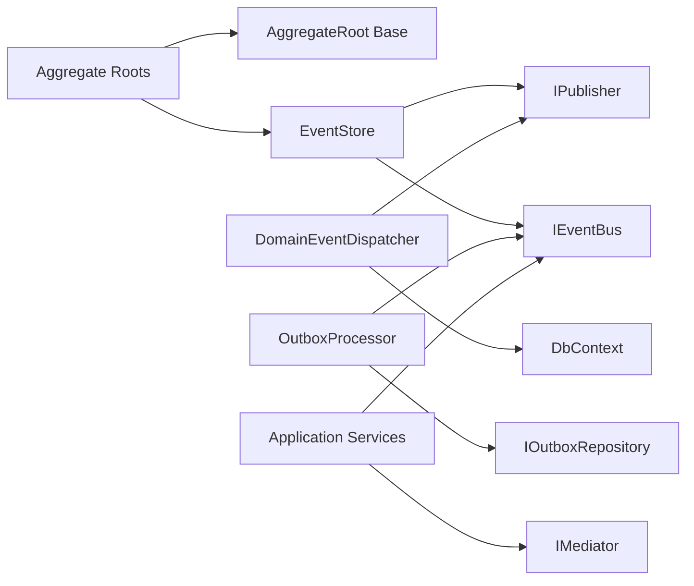

# Domain-Driven Design Patterns

<cite>
**Referenced Files in This Document**
- [DDDBase.cs](file://src/BuildingBlocks/ErpSystem.BuildingBlocks/Domain/DDDBase.cs)
- [DomainEventDispatcher.cs](file://src/BuildingBlocks/ErpSystem.BuildingBlocks/Domain/DomainEventDispatcher.cs)
- [Result.cs](file://src/BuildingBlocks/ErpSystem.BuildingBlocks/Common/Result.cs)
- [OutboxMessage.cs](file://src/BuildingBlocks/ErpSystem.BuildingBlocks/Outbox/OutboxMessage.cs)
- [OutboxProcessor.cs](file://src/BuildingBlocks/ErpSystem.BuildingBlocks/Outbox/OutboxProcessor.cs)
- [InvoiceAggregate.cs](file://src/Services/Finance/ErpSystem.Finance/Domains/InvoiceAggregate.cs)
- [InventoryItemAggregate.cs](file://src/Services/Inventory/ErpSystem.Inventory/Domains/InventoryItemAggregate.cs)
- [SalesOrderAggregate.cs](file://src/Services/Sales/ErpSystem.Sales/Domains/SalesOrderAggregate.cs)
- [PurchaseOrderAggregate.cs](file://src/Services/Procurement/ErpSystem.Procurement/Domains/PurchaseOrderAggregate.cs)
- [InventoryEvents.cs](file://src/Services/Inventory/ErpSystem.Inventory/Domains/InventoryEvents.cs)
- [IntegrationEventHandlers.cs](file://src/Services/Finance/ErpSystem.Finance/Application/IntegrationEventHandlers.cs)
- [HRIntegrationEvents.cs](file://src/Services/Identity/ErpSystem.Identity/Application/IntegrationEvents/HRIntegrationEvents.cs)
- [InventoryForecastService.cs](file://src/Services/Inventory/ErpSystem.Inventory/Domains/Services/InventoryForecastService.cs)
- [CodeGenerator.cs](file://src/Services/MasterData/ErpSystem.MasterData/Domains/CodeGenerator.cs)
</cite>

## Table of Contents
1. [Introduction](#introduction)
2. [Project Structure](#project-structure)
3. [Core Components](#core-components)
4. [Architecture Overview](#architecture-overview)
5. [Detailed Component Analysis](#detailed-component-analysis)
6. [Dependency Analysis](#dependency-analysis)
7. [Performance Considerations](#performance-considerations)
8. [Troubleshooting Guide](#troubleshooting-guide)
9. [Conclusion](#conclusion)
10. [Appendices](#appendices)

## Introduction
This document explains how the ERP system applies Domain-Driven Design (DDD) patterns across microservices. It covers aggregate roots, value objects, entities, domain events, and domain services. It documents the base building blocks for rich domain models, the domain event dispatcher mechanism for cross-service communication, and the Result<T> pattern for railway-oriented error handling. Concrete examples illustrate aggregate implementations, domain event creation, and event handling patterns. Finally, it addresses bounded context boundaries, anti-corruption layers, and domain service implementations.

## Project Structure
The solution is organized into:
- Building Blocks: Shared DDD infrastructure (domain base classes, event dispatching, outbox, result types).
- Services: Feature-based bounded contexts (Finance, Inventory, Sales, Procurement, HR, Identity, etc.), each containing Domain, Application, Infrastructure, and API layers.
- Integration points: Event bus, outbox processor, and integration event handlers enable cross-service communication.

**Diagram sources**
- [DDDBase.cs](file://src/BuildingBlocks/ErpSystem.BuildingBlocks/Domain/DDDBase.cs#L14-L137)
- [DomainEventDispatcher.cs](file://src/BuildingBlocks/ErpSystem.BuildingBlocks/Domain/DomainEventDispatcher.cs#L17-L71)
- [OutboxMessage.cs](file://src/BuildingBlocks/ErpSystem.BuildingBlocks/Outbox/OutboxMessage.cs#L10-L82)
- [InvoiceAggregate.cs](file://src/Services/Finance/ErpSystem.Finance/Domains/InvoiceAggregate.cs#L67-L176)
- [InventoryItemAggregate.cs](file://src/Services/Inventory/ErpSystem.Inventory/Domains/InventoryItemAggregate.cs#L91-L255)
- [SalesOrderAggregate.cs](file://src/Services/Sales/ErpSystem.Sales/Domains/SalesOrderAggregate.cs#L67-L148)
- [PurchaseOrderAggregate.cs](file://src/Services/Procurement/ErpSystem.Procurement/Domains/PurchaseOrderAggregate.cs#L85-L199)
- [IntegrationEventHandlers.cs](file://src/Services/Finance/ErpSystem.Finance/Application/IntegrationEventHandlers.cs#L6-L32)
- [InventoryEvents.cs](file://src/Services/Inventory/ErpSystem.Inventory/Domains/InventoryEvents.cs#L3-L12)
- [HRIntegrationEvents.cs](file://src/Services/Identity/ErpSystem.Identity/Application/IntegrationEvents/HRIntegrationEvents.cs#L5-L21)
- [InventoryForecastService.cs](file://src/Services/Inventory/ErpSystem.Inventory/Domains/Services/InventoryForecastService.cs#L7-L52)

**Section sources**
- [DDDBase.cs](file://src/BuildingBlocks/ErpSystem.BuildingBlocks/Domain/DDDBase.cs#L14-L137)
- [DomainEventDispatcher.cs](file://src/BuildingBlocks/ErpSystem.BuildingBlocks/Domain/DomainEventDispatcher.cs#L17-L71)
- [OutboxMessage.cs](file://src/BuildingBlocks/ErpSystem.BuildingBlocks/Outbox/OutboxMessage.cs#L10-L82)
- [InvoiceAggregate.cs](file://src/Services/Finance/ErpSystem.Finance/Domains/InvoiceAggregate.cs#L67-L176)
- [InventoryItemAggregate.cs](file://src/Services/Inventory/ErpSystem.Inventory/Domains/InventoryItemAggregate.cs#L91-L255)
- [SalesOrderAggregate.cs](file://src/Services/Sales/ErpSystem.Sales/Domains/SalesOrderAggregate.cs#L67-L148)
- [PurchaseOrderAggregate.cs](file://src/Services/Procurement/ErpSystem.Procurement/Domains/PurchaseOrderAggregate.cs#L85-L199)
- [IntegrationEventHandlers.cs](file://src/Services/Finance/ErpSystem.Finance/Application/IntegrationEventHandlers.cs#L6-L32)
- [InventoryEvents.cs](file://src/Services/Inventory/ErpSystem.Inventory/Domains/InventoryEvents.cs#L3-L12)
- [HRIntegrationEvents.cs](file://src/Services/Identity/ErpSystem.Identity/Application/IntegrationEvents/HRIntegrationEvents.cs#L5-L21)
- [InventoryForecastService.cs](file://src/Services/Inventory/ErpSystem.Inventory/Domains/Services/InventoryForecastService.cs#L7-L52)

## Core Components
- Aggregate Root base: Provides change tracking, event replay, and event sourcing persistence.
- Domain Event Dispatcher: Captures and publishes domain events after database writes using EF Core interceptors.
- Outbox Pattern: Ensures reliable cross-service messaging by persisting messages in the same transaction as domain changes.
- Result<T> Pattern: Railway-oriented error handling with explicit success/failure semantics and typed values.

Key building block files:
- Aggregate base and event sourcing: [DDDBase.cs](file://src/BuildingBlocks/ErpSystem.BuildingBlocks/Domain/DDDBase.cs#L14-L137)
- Domain event dispatcher: [DomainEventDispatcher.cs](file://src/BuildingBlocks/ErpSystem.BuildingBlocks/Domain/DomainEventDispatcher.cs#L17-L71)
- Outbox message and processor: [OutboxMessage.cs](file://src/BuildingBlocks/ErpSystem.BuildingBlocks/Outbox/OutboxMessage.cs#L10-L82), [OutboxProcessor.cs](file://src/BuildingBlocks/ErpSystem.BuildingBlocks/Outbox/OutboxProcessor.cs#L8-L72)
- Railway-oriented Result: [Result.cs](file://src/BuildingBlocks/ErpSystem.BuildingBlocks/Common/Result.cs#L1-L56)

**Section sources**
- [DDDBase.cs](file://src/BuildingBlocks/ErpSystem.BuildingBlocks/Domain/DDDBase.cs#L14-L137)
- [DomainEventDispatcher.cs](file://src/BuildingBlocks/ErpSystem.BuildingBlocks/Domain/DomainEventDispatcher.cs#L17-L71)
- [OutboxMessage.cs](file://src/BuildingBlocks/ErpSystem.BuildingBlocks/Outbox/OutboxMessage.cs#L10-L82)
- [OutboxProcessor.cs](file://src/BuildingBlocks/ErpSystem.BuildingBlocks/Outbox/OutboxProcessor.cs#L8-L72)
- [Result.cs](file://src/BuildingBlocks/ErpSystem.BuildingBlocks/Common/Result.cs#L1-L56)

## Architecture Overview
The system integrates domain events with two complementary mechanisms:
- Domain Event Dispatcher: Publishes domain events immediately after SaveChanges using EF Core interceptors.
- Outbox Processor: Asynchronously publishes integration events to the event bus, guaranteeing delivery.

**Diagram sources**
- [DomainEventDispatcher.cs](file://src/BuildingBlocks/ErpSystem.BuildingBlocks/Domain/DomainEventDispatcher.cs#L19-L42)
- [InvoiceAggregate.cs](file://src/Services/Finance/ErpSystem.Finance/Domains/InvoiceAggregate.cs#L85-L90)

**Section sources**
- [DomainEventDispatcher.cs](file://src/BuildingBlocks/ErpSystem.BuildingBlocks/Domain/DomainEventDispatcher.cs#L17-L71)
- [OutboxProcessor.cs](file://src/BuildingBlocks/ErpSystem.BuildingBlocks/Outbox/OutboxProcessor.cs#L8-L72)
- [InvoiceAggregate.cs](file://src/Services/Finance/ErpSystem.Finance/Domains/InvoiceAggregate.cs#L85-L90)

## Detailed Component Analysis

### Aggregate Root Patterns
- Aggregate base: Tracks unapplied domain events, supports replay from event history, and clears applied changes.
- Event sourcing persistence: Saves events to a stream and publishes them via MediatR and the event bus.
- Example aggregates:
  - Invoice: [InvoiceAggregate.cs](file://src/Services/Finance/ErpSystem.Finance/Domains/InvoiceAggregate.cs#L67-L176)
  - InventoryItem: [InventoryItemAggregate.cs](file://src/Services/Inventory/ErpSystem.Inventory/Domains/InventoryItemAggregate.cs#L91-L255)
  - SalesOrder: [SalesOrderAggregate.cs](file://src/Services/Sales/ErpSystem.Sales/Domains/SalesOrderAggregate.cs#L67-L148)
  - PurchaseOrder: [PurchaseOrderAggregate.cs](file://src/Services/Procurement/ErpSystem.Procurement/Domains/PurchaseOrderAggregate.cs#L85-L199)

**Diagram sources**
- [DDDBase.cs](file://src/BuildingBlocks/ErpSystem.BuildingBlocks/Domain/DDDBase.cs#L14-L41)
- [InvoiceAggregate.cs](file://src/Services/Finance/ErpSystem.Finance/Domains/InvoiceAggregate.cs#L67-L176)
- [InventoryItemAggregate.cs](file://src/Services/Inventory/ErpSystem.Inventory/Domains/InventoryItemAggregate.cs#L91-L255)
- [SalesOrderAggregate.cs](file://src/Services/Sales/ErpSystem.Sales/Domains/SalesOrderAggregate.cs#L67-L148)
- [PurchaseOrderAggregate.cs](file://src/Services/Procurement/ErpSystem.Procurement/Domains/PurchaseOrderAggregate.cs#L85-L199)

**Section sources**
- [DDDBase.cs](file://src/BuildingBlocks/ErpSystem.BuildingBlocks/Domain/DDDBase.cs#L14-L41)
- [InvoiceAggregate.cs](file://src/Services/Finance/ErpSystem.Finance/Domains/InvoiceAggregate.cs#L67-L176)
- [InventoryItemAggregate.cs](file://src/Services/Inventory/ErpSystem.Inventory/Domains/InventoryItemAggregate.cs#L91-L255)
- [SalesOrderAggregate.cs](file://src/Services/Sales/ErpSystem.Sales/Domains/SalesOrderAggregate.cs#L67-L148)
- [PurchaseOrderAggregate.cs](file://src/Services/Procurement/ErpSystem.Procurement/Domains/PurchaseOrderAggregate.cs#L85-L199)

### Value Objects and Entities
- Value Objects: Immutable, equality-based structures used inside aggregates.
  - Examples:
    - InvoiceLine: [InvoiceAggregate.cs](file://src/Services/Finance/ErpSystem.Finance/Domains/InvoiceAggregate.cs#L28-L33)
    - SalesOrderLine: [SalesOrderAggregate.cs](file://src/Services/Sales/ErpSystem.Sales/Domains/SalesOrderAggregate.cs#L16-L29)
    - PurchaseOrderLine: [PurchaseOrderAggregate.cs](file://src/Services/Procurement/ErpSystem.Procurement/Domains/PurchaseOrderAggregate.cs#L17-L30)
    - StockBatch: [InventoryItemAggregate.cs](file://src/Services/Inventory/ErpSystem.Inventory/Domains/InventoryItemAggregate.cs#L251-L255)
- Entities: Identified by identity and encapsulate behavior; represented by aggregate roots.

**Section sources**
- [InvoiceAggregate.cs](file://src/Services/Finance/ErpSystem.Finance/Domains/InvoiceAggregate.cs#L28-L33)
- [SalesOrderAggregate.cs](file://src/Services/Sales/ErpSystem.Sales/Domains/SalesOrderAggregate.cs#L16-L29)
- [PurchaseOrderAggregate.cs](file://src/Services/Procurement/ErpSystem.Procurement/Domains/PurchaseOrderAggregate.cs#L17-L30)
- [InventoryItemAggregate.cs](file://src/Services/Inventory/ErpSystem.Inventory/Domains/InventoryItemAggregate.cs#L251-L255)

### Domain Events and Event Sourcing
- Domain events are immutable notifications emitted by aggregates.
- Event sourcing persists events to a stream and rebuilds state via Apply handlers.
- Example domain events:
  - InvoiceCreatedEvent, InvoiceIssuedEvent, PaymentRecordedEvent, InvoiceStatusChangedEvent: [InvoiceAggregate.cs](file://src/Services/Finance/ErpSystem.Finance/Domains/InvoiceAggregate.cs#L36-L64)
  - InventoryItemCreatedEvent, StockReceivedEvent, StockIssuedEvent, StockReservedEvent, ReservationReleasedEvent, StockAdjustedEvent: [InventoryItemAggregate.cs](file://src/Services/Inventory/ErpSystem.Inventory/Domains/InventoryItemAggregate.cs#L6-L88)
  - SalesOrderCreatedEvent, SalesOrderConfirmedEvent, SalesOrderCancelledEvent, SalesOrderShipmentProcessedEvent: [SalesOrderAggregate.cs](file://src/Services/Sales/ErpSystem.Sales/Domains/SalesOrderAggregate.cs#L32-L64)
  - PurchaseOrderCreatedEvent, PurchaseOrderSubmittedEvent, PurchaseOrderApprovedEvent, PurchaseOrderSentEvent, GoodsReceivedEvent, PurchaseOrderClosedEvent, PurchaseOrderCancelledEvent: [PurchaseOrderAggregate.cs](file://src/Services/Procurement/ErpSystem.Procurement/Domains/PurchaseOrderAggregate.cs#L33-L82)

**Diagram sources**
- [DDDBase.cs](file://src/BuildingBlocks/ErpSystem.BuildingBlocks/Domain/DDDBase.cs#L62-L99)
- [OutboxMessage.cs](file://src/BuildingBlocks/ErpSystem.BuildingBlocks/Outbox/OutboxMessage.cs#L22-L32)
- [OutboxProcessor.cs](file://src/BuildingBlocks/ErpSystem.BuildingBlocks/Outbox/OutboxProcessor.cs#L29-L70)

**Section sources**
- [InvoiceAggregate.cs](file://src/Services/Finance/ErpSystem.Finance/Domains/InvoiceAggregate.cs#L36-L64)
- [InventoryItemAggregate.cs](file://src/Services/Inventory/ErpSystem.Inventory/Domains/InventoryItemAggregate.cs#L6-L88)
- [SalesOrderAggregate.cs](file://src/Services/Sales/ErpSystem.Sales/Domains/SalesOrderAggregate.cs#L32-L64)
- [PurchaseOrderAggregate.cs](file://src/Services/Procurement/ErpSystem.Procurement/Domains/PurchaseOrderAggregate.cs#L33-L82)
- [DDDBase.cs](file://src/BuildingBlocks/ErpSystem.BuildingBlocks/Domain/DDDBase.cs#L62-L99)
- [OutboxMessage.cs](file://src/BuildingBlocks/ErpSystem.BuildingBlocks/Outbox/OutboxMessage.cs#L22-L32)
- [OutboxProcessor.cs](file://src/BuildingBlocks/ErpSystem.BuildingBlocks/Outbox/OutboxProcessor.cs#L29-L70)

### Domain Event Dispatcher Mechanism
- Intercepts SaveChanges to collect aggregates with pending domain events.
- Clears events before publishing to avoid duplicates.
- Publishes via MediatR IPublisher.

**Diagram sources**
- [DomainEventDispatcher.cs](file://src/BuildingBlocks/ErpSystem.BuildingBlocks/Domain/DomainEventDispatcher.cs#L48-L62)
- [DomainEventDispatcher.cs](file://src/BuildingBlocks/ErpSystem.BuildingBlocks/Domain/DomainEventDispatcher.cs#L19-L42)

**Section sources**
- [DomainEventDispatcher.cs](file://src/BuildingBlocks/ErpSystem.BuildingBlocks/Domain/DomainEventDispatcher.cs#L17-L71)

### Result<T> Pattern for Railway-Oriented Error Handling
- Explicit success/failure with optional typed value.
- Encourages safe composition and avoids exceptions for control flow.
- Used across aggregates and application services to model outcomes.

**Diagram sources**
- [Result.cs](file://src/BuildingBlocks/ErpSystem.BuildingBlocks/Common/Result.cs#L11-L55)

**Section sources**
- [Result.cs](file://src/BuildingBlocks/ErpSystem.BuildingBlocks/Common/Result.cs#L1-L56)

### Domain Services and Anti-Corruption Layers
- Domain Services: Autonomous services encapsulating cross-boundary logic.
  - InventoryForecastService: Predictive analytics integration point. [InventoryForecastService.cs](file://src/Services/Inventory/ErpSystem.Inventory/Domains/Services/InventoryForecastService.cs#L7-L52)
- Anti-Corruption Layers: Integration events define clean contracts between services.
  - Inventory Integration Events: [InventoryEvents.cs](file://src/Services/Inventory/ErpSystem.Inventory/Domains/InventoryEvents.cs#L3-L12)
  - HR Integration Events: [HRIntegrationEvents.cs](file://src/Services/Identity/ErpSystem.Identity/Application/IntegrationEvents/HRIntegrationEvents.cs#L5-L21)
- Domain Service Contracts:
  - ICodeGenerator: [CodeGenerator.cs](file://src/Services/MasterData/ErpSystem.MasterData/Domains/CodeGenerator.cs#L3-L9)

**Section sources**
- [InventoryForecastService.cs](file://src/Services/Inventory/ErpSystem.Inventory/Domains/Services/InventoryForecastService.cs#L7-L52)
- [InventoryEvents.cs](file://src/Services/Inventory/ErpSystem.Inventory/Domains/InventoryEvents.cs#L3-L12)
- [HRIntegrationEvents.cs](file://src/Services/Identity/ErpSystem.Identity/Application/IntegrationEvents/HRIntegrationEvents.cs#L5-L21)
- [CodeGenerator.cs](file://src/Services/MasterData/ErpSystem.MasterData/Domains/CodeGenerator.cs#L3-L9)

### Concrete Examples

#### Example 1: Invoice Aggregate
- Emits domain events for creation, issuing, payment recording, and status changes.
- Validates preconditions before applying changes.
- Applies events to update state deterministically.

**Diagram sources**
- [InvoiceAggregate.cs](file://src/Services/Finance/ErpSystem.Finance/Domains/InvoiceAggregate.cs#L85-L90)
- [DDDBase.cs](file://src/BuildingBlocks/ErpSystem.BuildingBlocks/Domain/DDDBase.cs#L62-L99)

**Section sources**
- [InvoiceAggregate.cs](file://src/Services/Finance/ErpSystem.Finance/Domains/InvoiceAggregate.cs#L85-L176)
- [DDDBase.cs](file://src/BuildingBlocks/ErpSystem.BuildingBlocks/Domain/DDDBase.cs#L62-L99)

#### Example 2: InventoryItem Aggregate
- Supports stock receive, transfer, issue (FIFO valuation), reservation, release, and adjustment.
- Emits domain events and updates batches consistently.

**Diagram sources**
- [InventoryItemAggregate.cs](file://src/Services/Inventory/ErpSystem.Inventory/Domains/InventoryItemAggregate.cs#L116-L120)
- [InventoryItemAggregate.cs](file://src/Services/Inventory/ErpSystem.Inventory/Domains/InventoryItemAggregate.cs#L203-L206)

**Section sources**
- [InventoryItemAggregate.cs](file://src/Services/Inventory/ErpSystem.Inventory/Domains/InventoryItemAggregate.cs#L116-L255)

#### Example 3: Cross-Service Event Handling
- Sales creates an integration event when a shipment is created.
- Finance handler listens and auto-creates an invoice.

**Diagram sources**
- [IntegrationEventHandlers.cs](file://src/Services/Finance/ErpSystem.Finance/Application/IntegrationEventHandlers.cs#L6-L32)

**Section sources**
- [IntegrationEventHandlers.cs](file://src/Services/Finance/ErpSystem.Finance/Application/IntegrationEventHandlers.cs#L6-L32)

## Dependency Analysis
- Aggregates depend on the AggregateRoot base and event store/event bus for persistence and publication.
- DomainEventDispatcher depends on EF Core ChangeTracker and MediatR IPublisher.
- OutboxProcessor depends on IOutboxRepository and IEventBus.
- Application services orchestrate commands and coordinate integration events.

**Diagram sources**
- [DDDBase.cs](file://src/BuildingBlocks/ErpSystem.BuildingBlocks/Domain/DDDBase.cs#L59-L120)
- [DomainEventDispatcher.cs](file://src/BuildingBlocks/ErpSystem.BuildingBlocks/Domain/DomainEventDispatcher.cs#L17-L43)
- [OutboxProcessor.cs](file://src/BuildingBlocks/ErpSystem.BuildingBlocks/Outbox/OutboxProcessor.cs#L8-L72)

**Section sources**
- [DDDBase.cs](file://src/BuildingBlocks/ErpSystem.BuildingBlocks/Domain/DDDBase.cs#L59-L120)
- [DomainEventDispatcher.cs](file://src/BuildingBlocks/ErpSystem.BuildingBlocks/Domain/DomainEventDispatcher.cs#L17-L43)
- [OutboxProcessor.cs](file://src/BuildingBlocks/ErpSystem.BuildingBlocks/Outbox/OutboxProcessor.cs#L8-L72)

## Performance Considerations
- Event Sourcing: Persisting many small events can increase write volume; consider batching and indexing event streams.
- Outbox Batching: Process messages in batches to reduce overhead; tune batch size and delay based on throughput.
- Domain Event Dispatcher: Keep Apply handlers pure and fast; heavy work should be deferred to handlers or background jobs.
- Value Object Equality: Prefer record structs or immutable records to minimize allocations and comparisons.

## Troubleshooting Guide
- Duplicate Domain Events: Ensure DomainEventDispatcher clears events before publishing to prevent re-dispatch.
- Outbox Failures: Inspect error fields and retry counts; verify IEventBus availability in the scope factory.
- Validation Failures in Aggregates: Precondition checks throw exceptions; wrap operations with Result<T> to handle failures gracefully.

**Section sources**
- [DomainEventDispatcher.cs](file://src/BuildingBlocks/ErpSystem.BuildingBlocks/Domain/DomainEventDispatcher.cs#L31-L42)
- [OutboxMessage.cs](file://src/BuildingBlocks/ErpSystem.BuildingBlocks/Outbox/OutboxMessage.cs#L39-L43)
- [OutboxProcessor.cs](file://src/BuildingBlocks/ErpSystem.BuildingBlocks/Outbox/OutboxProcessor.cs#L47-L69)

## Conclusion
The ERP system implements robust DDD patterns with strong aggregate roots, rich domain models, and event-driven integration. The building blocks provide reliable event dispatching and transactional outbox guarantees, while the Result<T> pattern enables functional error handling. Together, these patterns support maintainable, testable, and scalable bounded contexts across services.

## Appendices
- Bounded Context Boundaries: Each service encapsulates a single domain (e.g., Finance, Inventory, Sales, Procurement).
- Anti-Corruption Layers: Integration events decouple domains and shield internal models from external changes.
- Domain Services: Provide cross-cutting capabilities like forecasting and code generation without violating aggregate encapsulation.