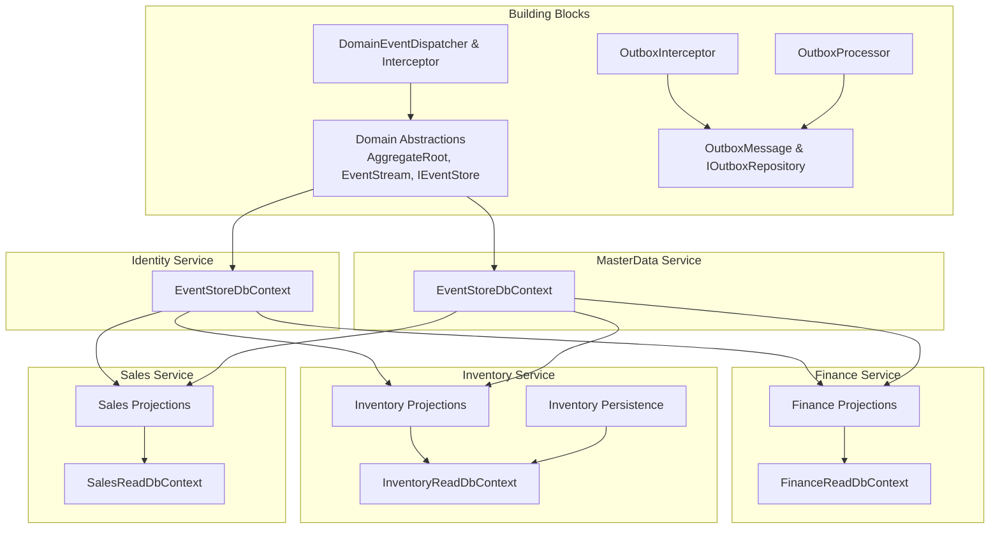
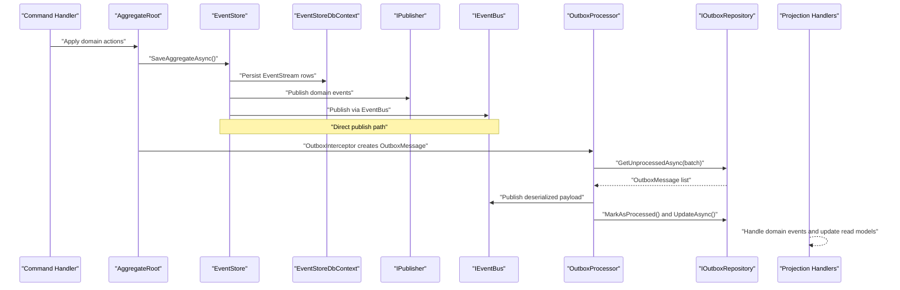
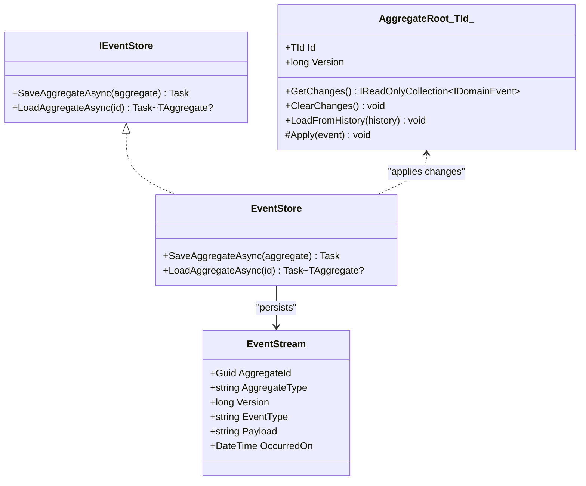
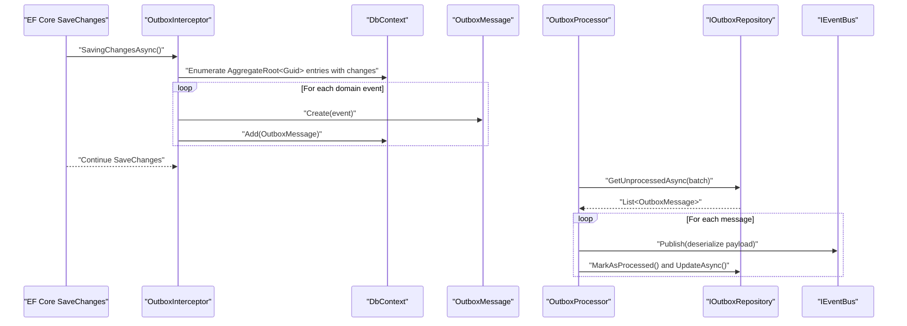
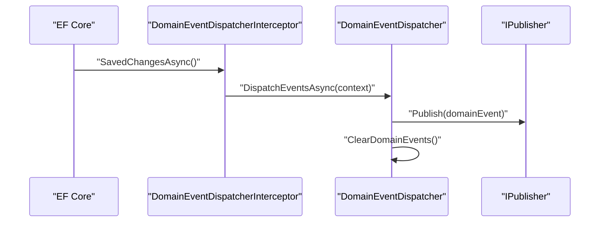
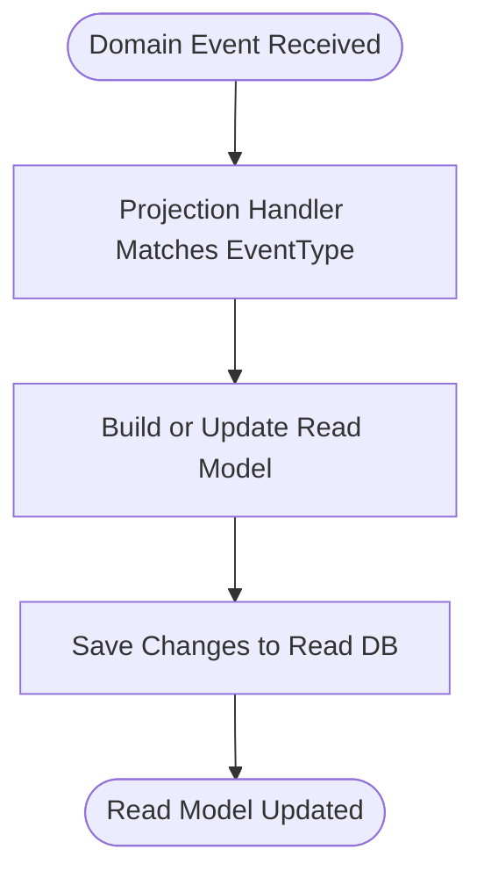
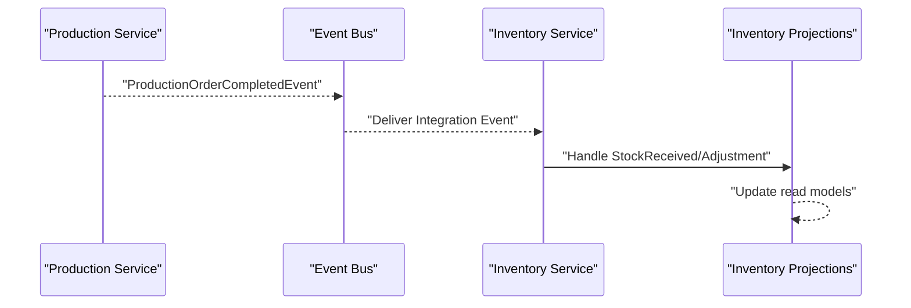
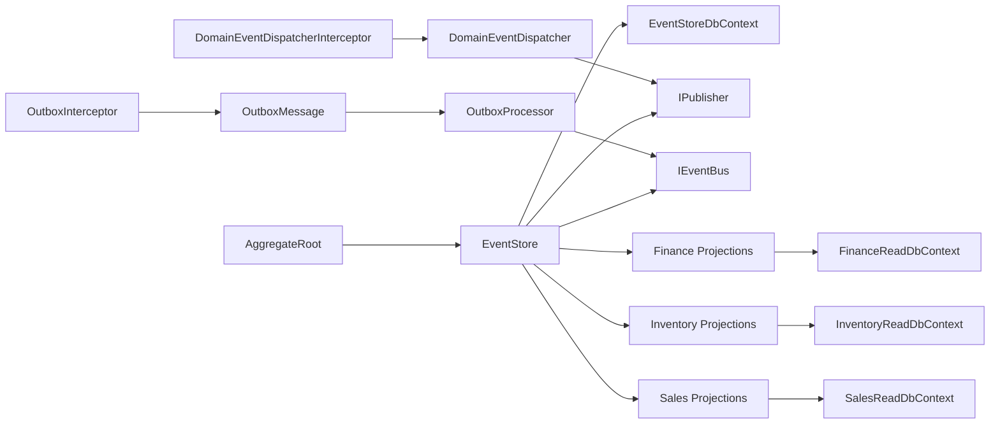

# Event Sourcing Architecture

<cite>
**Referenced Files in This Document**
- [DDDBase.cs](file://src/BuildingBlocks/ErpSystem.BuildingBlocks/Domain/DDDBase.cs)
- [DomainEventDispatcher.cs](file://src/BuildingBlocks/ErpSystem.BuildingBlocks/Domain/DomainEventDispatcher.cs)
- [OutboxMessage.cs](file://src/BuildingBlocks/ErpSystem.BuildingBlocks/Outbox/OutboxMessage.cs)
- [OutboxInterceptor.cs](file://src/BuildingBlocks/ErpSystem.BuildingBlocks/Outbox/OutboxInterceptor.cs)
- [OutboxProcessor.cs](file://src/BuildingBlocks/ErpSystem.BuildingBlocks/Outbox/OutboxProcessor.cs)
- [EventStore.cs (Identity)](file://src/Services/Identity/ErpSystem.Identity/Infrastructure/EventStore.cs)
- [EventStore.cs (MasterData)](file://src/Services/MasterData/ErpSystem.MasterData/Infrastructure/EventStore.cs)
- [Projections.cs (Finance)](file://src/Services/Finance/ErpSystem.Finance/Infrastructure/Projections.cs)
- [Projections.cs (Inventory)](file://src/Services/Inventory/ErpSystem.Inventory/Infrastructure/Projections.cs)
- [Projections.cs (Sales)](file://src/Services/Sales/ErpSystem.Sales/Infrastructure/Projections.cs)
- [Persistence.cs (Inventory)](file://src/Services/Inventory/ErpSystem.Inventory/Infrastructure/Persistence.cs)
- [ReadDbContext.cs (MasterData)](file://src/Services/MasterData/ErpSystem.MasterData/Infrastructure/ReadDbContext.cs)
- [InvoiceAggregate.cs](file://src/Services/Finance/ErpSystem.Finance/Domain/InvoiceAggregate.cs)
- [InventoryEvents.cs](file://src/Services/Inventory/ErpSystem.Inventory/Domain/InventoryEvents.cs)
- [ProductionOrderAggregate.cs](file://src/Services/Production/ErpSystem.Production/Domain/ProductionOrderAggregate.cs)
- [ProductionToInventoryTests.cs](file://src/Tests/ErpSystem.IntegrationTests/ProductionToInventoryTests.cs)
</cite>

## Table of Contents
1. [Introduction](#introduction)
2. [Project Structure](#project-structure)
3. [Core Components](#core-components)
4. [Architecture Overview](#architecture-overview)
5. [Detailed Component Analysis](#detailed-component-analysis)
6. [Dependency Analysis](#dependency-analysis)
7. [Performance Considerations](#performance-considerations)
8. [Troubleshooting Guide](#troubleshooting-guide)
9. [Conclusion](#conclusion)
10. [Appendices](#appendices)

## Introduction
This document explains the event sourcing architecture implemented across the ERP microservices. It covers how domain events are captured, stored in the event store, and used to rebuild aggregate state. It documents the outbox pattern for reliable event publishing and eventual consistency guarantees, including the outbox processor background service and interceptors. It also describes event serialization, replay mechanisms, projection updates, event versioning strategies, scaling approaches, and performance optimizations. Finally, it clarifies the relationship between event sourcing and CQRS read models, and how projections maintain query-friendly data structures.

## Project Structure
The event sourcing implementation spans building blocks and individual services:
- Building blocks define the foundational abstractions for domain events, event store, outbox, and interceptors.
- Each service maintains its own event store database context and read models, with projections updating read-side data structures.

**Diagram sources**
- [DDDBase.cs](file://src/BuildingBlocks/ErpSystem.BuildingBlocks/Domain/DDDBase.cs#L14-L120)
- [OutboxMessage.cs](file://src/BuildingBlocks/ErpSystem.BuildingBlocks/Outbox/OutboxMessage.cs#L10-L81)
- [OutboxInterceptor.cs](file://src/BuildingBlocks/ErpSystem.BuildingBlocks/Outbox/OutboxInterceptor.cs#L8-L51)
- [OutboxProcessor.cs](file://src/BuildingBlocks/ErpSystem.BuildingBlocks/Outbox/OutboxProcessor.cs#L8-L71)
- [DomainEventDispatcher.cs](file://src/BuildingBlocks/ErpSystem.BuildingBlocks/Domain/DomainEventDispatcher.cs#L17-L62)
- [EventStore.cs (Identity)](file://src/Services/Identity/ErpSystem.Identity/Infrastructure/EventStore.cs#L6-L18)
- [EventStore.cs (MasterData)](file://src/Services/MasterData/ErpSystem.MasterData/Infrastructure/EventStore.cs#L6-L18)
- [Projections.cs (Finance)](file://src/Services/Finance/ErpSystem.Finance/Infrastructure/Projections.cs#L7-L121)
- [Projections.cs (Inventory)](file://src/Services/Inventory/ErpSystem.Inventory/Infrastructure/Projections.cs#L7-L210)
- [Projections.cs (Sales)](file://src/Services/Sales/ErpSystem.Sales/Infrastructure/Projections.cs#L7-L87)
- [Persistence.cs (Inventory)](file://src/Services/Inventory/ErpSystem.Inventory/Infrastructure/Persistence.cs#L34-L59)
- [ReadDbContext.cs (MasterData)](file://src/Services/MasterData/ErpSystem.MasterData/Infrastructure/ReadDbContext.cs#L33-L108)

**Section sources**
- [DDDBase.cs](file://src/BuildingBlocks/ErpSystem.BuildingBlocks/Domain/DDDBase.cs#L14-L120)
- [OutboxMessage.cs](file://src/BuildingBlocks/ErpSystem.BuildingBlocks/Outbox/OutboxMessage.cs#L10-L81)
- [OutboxInterceptor.cs](file://src/BuildingBlocks/ErpSystem.BuildingBlocks/Outbox/OutboxInterceptor.cs#L8-L51)
- [OutboxProcessor.cs](file://src/BuildingBlocks/ErpSystem.BuildingBlocks/Outbox/OutboxProcessor.cs#L8-L71)
- [DomainEventDispatcher.cs](file://src/BuildingBlocks/ErpSystem.BuildingBlocks/Domain/DomainEventDispatcher.cs#L17-L62)
- [EventStore.cs (Identity)](file://src/Services/Identity/ErpSystem.Identity/Infrastructure/EventStore.cs#L6-L18)
- [EventStore.cs (MasterData)](file://src/Services/MasterData/ErpSystem.MasterData/Infrastructure/EventStore.cs#L6-L18)
- [Projections.cs (Finance)](file://src/Services/Finance/ErpSystem.Finance/Infrastructure/Projections.cs#L7-L121)
- [Projections.cs (Inventory)](file://src/Services/Inventory/ErpSystem.Inventory/Infrastructure/Projections.cs#L7-L210)
- [Projections.cs (Sales)](file://src/Services/Sales/ErpSystem.Sales/Infrastructure/Projections.cs#L7-L87)
- [Persistence.cs (Inventory)](file://src/Services/Inventory/ErpSystem.Inventory/Infrastructure/Persistence.cs#L34-L59)
- [ReadDbContext.cs (MasterData)](file://src/Services/MasterData/ErpSystem.MasterData/Infrastructure/ReadDbContext.cs#L33-L108)

## Core Components
- Domain abstractions: AggregateRoot, IDomainEvent, EventStream, IEventStore, and event store implementation that persists events and publishes them.
- Outbox pattern: OutboxMessage, IOutboxRepository, OutboxInterceptor, and OutboxProcessor for reliable asynchronous publishing.
- Domain event dispatching: DomainEventDispatcher and interceptor to publish domain events after SaveChanges.
- Projections: Event handlers that update read models for CQRS queries.

Key responsibilities:
- Event capture and storage: Aggregates apply events that are recorded in the event store and published.
- Replay and state reconstruction: Event store loads events by aggregate id and applies them to rebuild state.
- Reliable publishing: OutboxInterceptor captures domain events and persists them; OutboxProcessor publishes them via the event bus.
- Read model maintenance: Projections handle domain events and update normalized read models.

**Section sources**
- [DDDBase.cs](file://src/BuildingBlocks/ErpSystem.BuildingBlocks/Domain/DDDBase.cs#L14-L120)
- [OutboxMessage.cs](file://src/BuildingBlocks/ErpSystem.BuildingBlocks/Outbox/OutboxMessage.cs#L10-L81)
- [OutboxInterceptor.cs](file://src/BuildingBlocks/ErpSystem.BuildingBlocks/Outbox/OutboxInterceptor.cs#L8-L51)
- [OutboxProcessor.cs](file://src/BuildingBlocks/ErpSystem.BuildingBlocks/Outbox/OutboxProcessor.cs#L8-L71)
- [DomainEventDispatcher.cs](file://src/BuildingBlocks/ErpSystem.BuildingBlocks/Domain/DomainEventDispatcher.cs#L17-L62)

## Architecture Overview
The system integrates event sourcing with CQRS. Writes are handled by aggregates that emit domain events. These events are persisted in the event store and published either directly or via the outbox. Projections subscribe to these events and update read models optimized for queries.

**Diagram sources**
- [DDDBase.cs](file://src/BuildingBlocks/ErpSystem.BuildingBlocks/Domain/DDDBase.cs#L62-L99)
- [OutboxInterceptor.cs](file://src/BuildingBlocks/ErpSystem.BuildingBlocks/Outbox/OutboxInterceptor.cs#L34-L46)
- [OutboxProcessor.cs](file://src/BuildingBlocks/ErpSystem.BuildingBlocks/Outbox/OutboxProcessor.cs#L29-L70)
- [Projections.cs (Finance)](file://src/Services/Finance/ErpSystem.Finance/Infrastructure/Projections.cs#L17-L120)

## Detailed Component Analysis

### Event Store and Replay
The event store persists each domain event in an append-only stream per aggregate, serializing events to JSON. Loading aggregates iterates events in version order and applies them to reconstruct state.

**Diagram sources**
- [DDDBase.cs](file://src/BuildingBlocks/ErpSystem.BuildingBlocks/Domain/DDDBase.cs#L14-L120)

Key behaviors:
- Serialization: Events are serialized to JSON when stored and deserialized during replay.
- Versioning: Events are stored with monotonically increasing versions per aggregate.
- Replay: LoadAggregateAsync retrieves ordered events and applies them to a fresh aggregate instance.

**Section sources**
- [DDDBase.cs](file://src/BuildingBlocks/ErpSystem.BuildingBlocks/Domain/DDDBase.cs#L62-L119)

### Outbox Pattern: Interceptor and Processor
The outbox pattern ensures event publication occurs reliably within the same transaction as domain changes. An interceptor captures emitted domain events and persists them as outbox messages. A background processor periodically reads unprocessed messages, publishes them, and marks them processed.

**Diagram sources**
- [OutboxInterceptor.cs](file://src/BuildingBlocks/ErpSystem.BuildingBlocks/Outbox/OutboxInterceptor.cs#L10-L49)
- [OutboxProcessor.cs](file://src/BuildingBlocks/ErpSystem.BuildingBlocks/Outbox/OutboxProcessor.cs#L29-L70)
- [OutboxMessage.cs](file://src/BuildingBlocks/ErpSystem.BuildingBlocks/Outbox/OutboxMessage.cs#L22-L54)

Implementation highlights:
- Interceptor: Scans tracked aggregates for changes and enqueues OutboxMessage instances.
- Message persistence: OutboxMessage stores type metadata and serialized payload with retry/error tracking.
- Processor: Periodic batch processing with logging and idempotent updates.

**Section sources**
- [OutboxInterceptor.cs](file://src/BuildingBlocks/ErpSystem.BuildingBlocks/Outbox/OutboxInterceptor.cs#L8-L51)
- [OutboxProcessor.cs](file://src/BuildingBlocks/ErpSystem.BuildingBlocks/Outbox/OutboxProcessor.cs#L8-L71)
- [OutboxMessage.cs](file://src/BuildingBlocks/ErpSystem.BuildingBlocks/Outbox/OutboxMessage.cs#L10-L81)

### Domain Event Dispatching
Domain events can be published directly after SaveChanges using a dispatcher and interceptor, complementing the outbox approach.

**Diagram sources**
- [DomainEventDispatcher.cs](file://src/BuildingBlocks/ErpSystem.BuildingBlocks/Domain/DomainEventDispatcher.cs#L48-L62)

**Section sources**
- [DomainEventDispatcher.cs](file://src/BuildingBlocks/ErpSystem.BuildingBlocks/Domain/DomainEventDispatcher.cs#L17-L62)

### Projections and CQRS Read Models
Projections subscribe to domain events and update read models optimized for queries. They maintain normalized structures and often store JSON fields for flexible attributes.

Examples across services:
- Finance: Updates invoice and payment read models on creation, issuance, payment recording, and status changes.
- Inventory: Maintains stock balances, reservations, transactions, and material attributes.
- Sales: Stores sales orders, shipment records, and derived statuses.

**Section sources**
- [Projections.cs (Finance)](file://src/Services/Finance/ErpSystem.Finance/Infrastructure/Projections.cs#L17-L120)
- [Projections.cs (Inventory)](file://src/Services/Inventory/ErpSystem.Inventory/Infrastructure/Projections.cs#L16-L209)
- [Projections.cs (Sales)](file://src/Services/Sales/ErpSystem.Sales/Infrastructure/Projections.cs#L14-L86)
- [Persistence.cs (Inventory)](file://src/Services/Inventory/ErpSystem.Inventory/Infrastructure/Persistence.cs#L34-L59)
- [ReadDbContext.cs (MasterData)](file://src/Services/MasterData/ErpSystem.MasterData/Infrastructure/ReadDbContext.cs#L33-L108)

### Event Serialization and Versioning
- Serialization: Events are serialized to JSON when stored and deserialized during replay. Outbox messages store both payload and type metadata for robust deserialization.
- Versioning: Event store assigns incremental versions per aggregate, enabling deterministic replay and conflict-free reconstruction.

**Section sources**
- [DDDBase.cs](file://src/BuildingBlocks/ErpSystem.BuildingBlocks/Domain/DDDBase.cs#L79-L115)
- [OutboxMessage.cs](file://src/BuildingBlocks/ErpSystem.BuildingBlocks/Outbox/OutboxMessage.cs#L22-L54)

### Replay Mechanisms
Replay is achieved by loading all events for an aggregate id, ordered by version, and applying them to a new aggregate instance. This supports audit trails, debugging, and rebuilding state after schema changes.

**Section sources**
- [DDDBase.cs](file://src/BuildingBlocks/ErpSystem.BuildingBlocks/Domain/DDDBase.cs#L101-L119)

### Event Store Scaling and Performance
- Storage: Event streams are stored with JSON payloads and indexed by aggregate id and version.
- Partitioning: Consider partitioning event stores by tenant/service to scale horizontally.
- Indexing: Maintain efficient indexes on aggregate id and version for fast replay.
- Batch writes: Event store saves all pending changes in a single transaction to minimize round trips.
- Outbox batching: Processor handles fixed-size batches to balance throughput and latency.

**Section sources**
- [EventStore.cs (Identity)](file://src/Services/Identity/ErpSystem.Identity/Infrastructure/EventStore.cs#L10-L17)
- [EventStore.cs (MasterData)](file://src/Services/MasterData/ErpSystem.MasterData/Infrastructure/EventStore.cs#L10-L17)
- [OutboxProcessor.cs](file://src/BuildingBlocks/ErpSystem.BuildingBlocks/Outbox/OutboxProcessor.cs#L10)

### Cross-Service Integration and Integration Events
Services publish integration events to coordinate cross-service state changes. For example, inventory reacts to production completion events.

**Diagram sources**
- [ProductionOrderAggregate.cs](file://src/Services/Production/ErpSystem.Production/Domain/ProductionOrderAggregate.cs#L57-L60)
- [InventoryEvents.cs](file://src/Services/Inventory/ErpSystem.Inventory/Domain/InventoryEvents.cs#L5-L11)
- [Projections.cs (Inventory)](file://src/Services/Inventory/ErpSystem.Inventory/Infrastructure/Projections.cs#L39-L81)
- [ProductionToInventoryTests.cs](file://src/Tests/ErpSystem.IntegrationTests/ProductionToInventoryTests.cs#L84-L86)

**Section sources**
- [ProductionOrderAggregate.cs](file://src/Services/Production/ErpSystem.Production/Domain/ProductionOrderAggregate.cs#L57-L60)
- [InventoryEvents.cs](file://src/Services/Inventory/ErpSystem.Inventory/Domain/InventoryEvents.cs#L5-L11)
- [Projections.cs (Inventory)](file://src/Services/Inventory/ErpSystem.Inventory/Infrastructure/Projections.cs#L39-L81)
- [ProductionToInventoryTests.cs](file://src/Tests/ErpSystem.IntegrationTests/ProductionToInventoryTests.cs#L84-L86)

## Dependency Analysis
The following diagram shows key dependencies among event sourcing and CQRS components:

**Diagram sources**
- [DDDBase.cs](file://src/BuildingBlocks/ErpSystem.BuildingBlocks/Domain/DDDBase.cs#L59-L120)
- [OutboxInterceptor.cs](file://src/BuildingBlocks/ErpSystem.BuildingBlocks/Outbox/OutboxInterceptor.cs#L8-L51)
- [OutboxProcessor.cs](file://src/BuildingBlocks/ErpSystem.BuildingBlocks/Outbox/OutboxProcessor.cs#L8-L71)
- [DomainEventDispatcher.cs](file://src/BuildingBlocks/ErpSystem.BuildingBlocks/Domain/DomainEventDispatcher.cs#L17-L62)
- [Projections.cs (Finance)](file://src/Services/Finance/ErpSystem.Finance/Infrastructure/Projections.cs#L7-L121)
- [Projections.cs (Inventory)](file://src/Services/Inventory/ErpSystem.Inventory/Infrastructure/Projections.cs#L7-L210)
- [Projections.cs (Sales)](file://src/Services/Sales/ErpSystem.Sales/Infrastructure/Projections.cs#L7-L87)

**Section sources**
- [DDDBase.cs](file://src/BuildingBlocks/ErpSystem.BuildingBlocks/Domain/DDDBase.cs#L59-L120)
- [OutboxInterceptor.cs](file://src/BuildingBlocks/ErpSystem.BuildingBlocks/Outbox/OutboxInterceptor.cs#L8-L51)
- [OutboxProcessor.cs](file://src/BuildingBlocks/ErpSystem.BuildingBlocks/Outbox/OutboxProcessor.cs#L8-L71)
- [DomainEventDispatcher.cs](file://src/BuildingBlocks/ErpSystem.BuildingBlocks/Domain/DomainEventDispatcher.cs#L17-L62)
- [Projections.cs (Finance)](file://src/Services/Finance/ErpSystem.Finance/Infrastructure/Projections.cs#L7-L121)
- [Projections.cs (Inventory)](file://src/Services/Inventory/ErpSystem.Inventory/Infrastructure/Projections.cs#L7-L210)
- [Projections.cs (Sales)](file://src/Services/Sales/ErpSystem.Sales/Infrastructure/Projections.cs#L7-L87)

## Performance Considerations
- Minimize write amplification: Persist only event deltas; avoid redundant payloads.
- Batch processing: Use outbox batching and projection updates to reduce database round trips.
- Efficient indexing: Ensure event store indexes on aggregate id and version for fast replay.
- JSON storage: Use appropriate JSON/JSONB columns for payloads and read-model JSON fields.
- Idempotency: Projections should guard against duplicate processing; outbox messages track retries and errors.
- Backoff and dead-lettering: Extend outbox processor to support retry delays and dead-letter routing for persistent failures.

[No sources needed since this section provides general guidance]

## Troubleshooting Guide
Common issues and remedies:
- Duplicate event dispatch: Ensure domain events are cleared after dispatch to prevent double-processing.
- Outbox stuck messages: Verify IOutboxRepository registration and monitor ProcessedAt filter; inspect RetryCount and Error fields.
- Deserialization failures: Confirm MessageType assembly-qualified name and payload compatibility.
- Projection inconsistencies: Validate event ordering and idempotency; re-run projections if needed.

**Section sources**
- [DomainEventDispatcher.cs](file://src/BuildingBlocks/ErpSystem.BuildingBlocks/Domain/DomainEventDispatcher.cs#L32-L42)
- [OutboxMessage.cs](file://src/BuildingBlocks/ErpSystem.BuildingBlocks/Outbox/OutboxMessage.cs#L34-L54)
- [OutboxProcessor.cs](file://src/BuildingBlocks/ErpSystem.BuildingBlocks/Outbox/OutboxProcessor.cs#L47-L69)

## Conclusion
The ERP system implements a robust event sourcing architecture with clear separation between write and read domains. Aggregates emit domain events that are persisted and published reliably via the outbox pattern. Projections continuously update read models, enabling scalable, eventually consistent CQRS. The design supports replay, versioning, and cross-service integration through integration events, forming a cohesive foundation for future enhancements.

[No sources needed since this section summarizes without analyzing specific files]

## Appendices

### Example: Invoice Aggregate and Read Model Updates
- Domain events: Creation, line updates, issuance, payment recording, status changes.
- Read model: InvoiceReadModel updated by Finance projections; totals and statuses computed and persisted.

**Section sources**
- [InvoiceAggregate.cs](file://src/Services/Finance/ErpSystem.Finance/Domain/InvoiceAggregate.cs#L36-L175)
- [Projections.cs (Finance)](file://src/Services/Finance/ErpSystem.Finance/Infrastructure/Projections.cs#L17-L120)